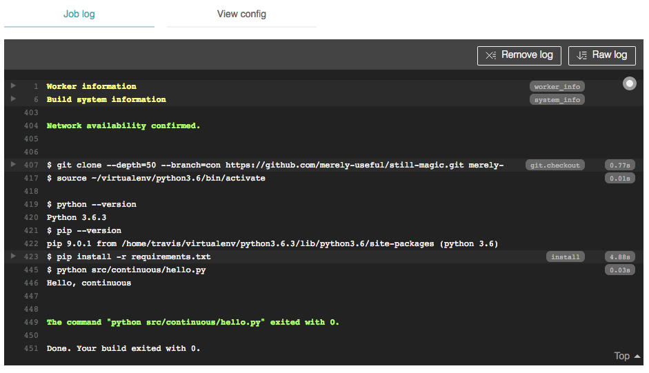

# Continuous Integration {#integrate}

## Questions {#integrate-questions}

```{r, child="questions/integrate.md"}
```

## Objectives {#integrate-objectives}

```{r, child="objectives/integrate.md"}
```

## Introduction {#integrate-intro}

[Continuous integration](glossary.html#continuous-integration) (CI) is a simple idea:
every time someone commits code to a repository,
that code should automatically be compiled and checked
and the results posted where people can see them.
If the build or the tests fail,
the person responsible for the problem should be notified immediately
so that they can fix problems while the changes are still fresh in their head
(and before anyone else has to deal with them).
Taking it one step further,
all of these automatic checks can be run on every branch
so that people only create pull requests for things that are working (Chapter \@ref(branches)).

The most widely used continuous integration system is [Travis CI][travis-ci].
It integrates well with [Github][github],
and will run tests on multiple platforms and with multiple versions of tools.
Developers still have to build the tests---CI only as good as the tests it runs---but
those tests can check the code's style as well as its correctness (Chapter \@ref(style)).
This lesson will show you how to set up Travis for your project.

## How can I run commands automatically every time a repository is updated? {#integrate-basic}

The first step is to tell Travis about your repository.
Log in to [Travis-CI][travis-ci] with your GitHub credentials;
on the left,
beside "My Repositories",
click "+" to add a repository that you have already created on GitHub.
Once you have found it,
flick the switch.

Next,
create a file called `.travis.yml` in the root directory of the repository.
Note the leading `.` in the name:
like many systems,
Travis puts its configuration file in the project's root directory (Chapter \@ref(configure)),
but uses a leading dot so that the file won't clutter the listing from `ls`.

A simple `.travis.yml` configuration file looks like this:

```
language: "python"
python:
-   "3.6"
install:
-   "pip install -r requirements.txt"
script:
-   "python src/continuous/hello.py"
```
<!-- src="integrate/simple-travis.yml" -->

The `language` key tells Travis what language we're using.
We then use `python` to specify the version (or versions) of Python to use
(we can ask Travis to test our project with several different versions).
`install` tells Travis how to install the software needed for testing;
by convention,
we put a list of packages in `requirements.txt` for `pip` to use (Chapter \@ref(package)).
Finally,
`script` tells Travis how to actually run the tests.
We can put almost anything here,
provided it does not need to interact with a human being
(e.g., provided it doesn't prompt with yes/no questions during package installation).

The third and final step is to create that test script.
Ours is called `hello.py`,
and is in the `./src/continuous` directory of the project containing this lesson:

<!-- src="integrate/hello.py" -->
```python
#!/usr/bin/env python

print('Hello, continuous')
```

The first line is a [shebang](glossary.html#shebang)
that tells the operating system to run our script with Python rather than with the Bash shell.
`#!/Users/pterry/anaconda3/bin/python` would run a particular version of Python,
but `/usr/bin/env some_program_name` finds the program you want,
so if Python is installed somewhere else,
this still works.

Once we commit these changes,
Travis is set up.
Every time a commit is made to this branch, it will:

1.  Create a new Linux image.
2.  Install the desired version of Python (or clone an existing image that has it, which is faster).
3.  Install the software described by `requirements.txt`.
4.  Run the `hello.py` script.
5.  Report the results at <code>https://travis-ci.org/<em>user</em>/<em>repo</em></code>.

Travis's summary report tells us what happened
(Figure \@ref(fig:integrate-summary)).
The detailed log has *lots* of information:
there are 397 lines hidden under "Build system information"
and another 23 under "pip install" heading
(Figure \@ref(fig:integrate-log)).

```{r integrate-summary, echo=FALSE, fig.cap="Travis Summary Report"}

```

```{r integrate-log, echo=FALSE, fig.cap="Travis Log"}
knitr::include_graphics("figures/integrate/log.png")
```

## How can I tell Travis that something went wrong? {#integrate-error}

The most important thing is the test program's [exit status](glossary.html#exit-status).
An exit status of 0 means "nothing went wrong",
and it is the default if we don't specify anything else.
We can force this exit status by ending our script with `sys.exit(0)`.

The operating system interprets any non-zero exit status as a shell error code.
`sys.exit(1)` means "something went wrong",
and you will rarely have to worry about other codes
like 127 for "command not found" and 130 for "terminated with Control-C".

We can test this by telling Travis to run a second script:

```yaml
language: "python"
python:
-   "3.6"
install:
-   "pip install -r requirements.txt"
script:
-   "python src/continuous/hello.py"
-   "python src/continuous/failure.py"
```
<!-- src="integrate/double-travis.yml" -->

<!-- == noindent -->
and by making that script report failure on purpose:

<!-- src="integrate/failure.py" -->
```python
#!/usr/bin/env python

import sys

print('And this command fails')
sys.exit(1)
```

When we commit these changes and view the repository's status page,
we are initially told that our build is queued
(Figure \@ref(fig:integrate-queued)).
We don't need to refresh the page:
when the build starts,
the page updates automatically.
When when the build finishes,
the summary turns red and the log displays an error message
(Figure \@ref(fig:integrate-failure)).

```{r integrate-queued, echo=FALSE, fig.cap="Travis Queued"}

```

```{r integrate-failure, echo=FALSE, fig.cap="Travis Failure"}
knitr::include_graphics("figures/integrate/failure.png")
```

## How can I display the status of a repository? {#integrate-display}

Travis's dashboard is very useful,
but we would also like to display the status of the build on GitHub because that's where most people will look.
To do this,
we can at the top of the status page and find the build icon
(Figure \@ref(fig:integrate-build-icon)).

```{r integrate-build-icon, echo=FALSE, fig.cap="Travis Build Icon"}

```

Clicking on it brings up a dialog
where we can select the Markdown we need for the `master` branch.
Paste this into the file `README.md` in the root directory of the `master` branch of your repository,
commit,
and push to GitHub.
(Note that the `./README.md` is the project's home page on GitHub,
*not* the root of the [GitHub Pages](glossary.html#github-pages) site.

While we are waiting for Travis to finish building our site,
we can take a look at the "Branches" tab of our repository.
Clicking on a check mark or an X will bring up details of that build on that branch
(Figure \@ref(fig:integrate-overall)).
Sure enough,
the page displays a red X once the build on `master` completes.
We can now modify `.travis.yml` to remove the failing script,
commit,
wait for an email to arrive to tell us that the build has completed,
and then go to the project on GitHub
(Figure \@ref(fig:integrate-github-icon)).

```{r integrate-overall, echo=FALSE, fig.cap="Travis Overall"}

```

```{r integrate-github-icon, echo=FALSE, fig.cap="Travis GitHub Icon"}
knitr::include_graphics("figures/integrate/github-icon.png")
```

## How can I automatically run tests for my project when things change?  {#integrate-tests}

FIXME: describe how to run actual tests with Travis-CI - will this require a project or projects in a separate repository?

## Summary {#integrate-summary}

FIXME: create concept map for integration.

FIXME: forward ref to Section \@ref(tools-cron).

## Exercises {#integrate-exercises}

FIXME: exercises for integration.

## Key Points {#integrate-keypoints}

```{r, child="keypoints/integrate.md"}
```

```{r, child="etc/links.md"}
```
