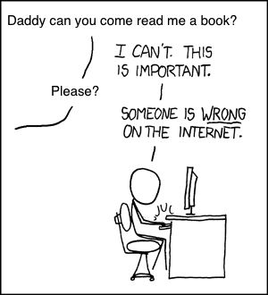

# Pacing {#pacing}

## Questions {#pacing-questions}

```{r questions, child="questions/pacing.md"}
```

## Objectives {#pacing-objectives}

```{r objectives, child="objectives/pacing.md"}
```

## Introduction {#pacing-intro}

FIXME: introduction

## How much work is overwork and what are its effects? {#pacing-crunch}

FIXME: keep this personal?

I used to brag about the hours I was working.
Not in so many words, of course---I had *some* social skills---but
I'd show up for class around noon,
unshaven and yawning,
and casually mention how I'd been up 'til 6:00 a.m. hacking away at a monster bug.

Looking back,
I can't remember who I was trying to impress.
Instead,
what I remember is
how much of the code I wrote in those all-nighters I threw away once I'd had some sleep,
and how much damage those bleary-eyed stupors did to my mental health (and grades).
My mistake was to confuse "working" with "being productive".
You can't produce software (or anything else) without doing some work,
but you can easily do lots of work without producing anything of value.

Scientific study of the issue goes back to at least the 1890s;
@Robi2005 is a good short summary,
and the most important facts are:

1.  Working more than eight hours a day for an extended period of time
    lowers your total productivity,
    not just your hourly productivity---i.e., you get less done in total
    when you're in crunch mode than when you work regular hours.

2.  Working over 21 hours in a stretch
    increases the odds of you making a catastrophic error
    just as much as being legally drunk.

These facts have been reproduced and verified hundreds of time,
and the data behind them is as solid as the data linking smoking to lung cancer.
However,
while most smokers now acknowledge that their habit is killing them,
many people in academia and the software industry
still act as if they were somehow immune to the effects of sleep deprivation.
To quote Robinson:

> When Henry Ford famously adopted a 40-hour workweek in 1926,
> he was bitterly criticized by members of the National Association of Manufacturers.
> But his experiments,
> which he'd been conducting for at least 12 years,
> showed him clearly that cutting the workday from ten hours to eight hours---and
> the workweek from six days to five days---increased total worker output
> and reduced production cost...
> the core of his argument was that reduced shift length meant more output.
>
>  ...many studies,
> conducted by businesses, universities, industry associations and the military,
> ...support the basic notion that, for most people,
> eight hours a day, five days per week,
> is the best sustainable long-term balance point between output and exhaustion.
> Throughout the 30s, 40s, and 50s,
> these studies were apparently conducted by the hundreds;
> and by the 1960s, the benefits of the 40-hour week were accepted
> almost beyond question in corporate America.
> In 1962,
> the Chamber of Commerce even published a pamphlet extolling the productivity gains
> of reduced hours.
>
> But, somehow, Silicon Valley didn't get the memo...

I worked for a data visualization startup in the mid-1990s.
Three months before our first release,
the head of development "asked" us to start coming in on Saturdays.
We were already pulling one late night a week at that point
(with no mention of overtime pay---our boss seemed to think that
ten dollars' worth of pizza was adequate compensation for four hours of work),
and most of us were also working at least a couple of hours at home in the evenings.
It's hardly surprising that we missed our "can't miss" deadline by ten weeks,
and had to follow up our 1.0 release with a 1.1, and then a 1.2,
in order to patch the bugs we'd created.
We were all zombies, and zombies can't code.

Those kinds of hours are sadly still normal
in many parts of the software industry,
and also in university programs.
Designing and building software is a creative act that requires a clear head,
but many otherwise-intelligent people act as if it was like digging a ditch.
The difference is that it's hard to lose ground when digging
(though not impossible).
In software, on the other hand,
it only takes me a couple of minutes to create a bug
that will take hours to track down later.
This is summarized in Robinson's first rule:

> Productivity varies over the course of the workday,
> with the greatest productivity occurring in the first four to six hours.
> After enough hours, productivity approaches zero;
> eventually it becomes negative.

Ah, you say, but that's long-term total output.
What about short bursts now and then,
like pulling an all-nighter to meet a deadline?
Well, that's been studied too,
and the results aren't pleasant.
Your ability to think drops by 25% for each 24 hours you're awake.
Put it another way,
the average person's IQ is only 75 after one all-nighter,
which puts them in the bottom 5% of the population.
Do two all nighters in a row,
and your effective IQ is 50,
the level at which people are usually judged incapable of independent living.

The catch in all of this is that
people usually don't notice their abilities declining.
Just like drunks who think they're still able to drive,
people who are deprived of sleep don't realize that they're not finishing their sentences
(or thoughts).
They certainly don't realize that
they're passing parameters into function calls the wrong way around,
or that what they're typing in will all have to be deleted and re-done tomorrow.

So think very hard about what's more important to you:
the amount of good work you produce,
or how hard your friends think you're pushing yourself.
Then think about which of those other people are actually going to care about,
and pace yourself accordingly.

## How can I manage my time so that I can keep to a productive schedule? {#pacing-manage}

"But I have so many assignments to do!", you say.
"And they're all due at once!  I *have* to work extra hours to get them all done!"

No.
In order to be productive, you have to prioritize and focus.
The first is important because people naturally spend hours on things that don't need to be done,
then find themselves with too little time for the things that actually count.
It can actually be expressed as an algorithm:

Make a list of the things you have to do.
:   I used to use a hardcover lab notebook for this,
    since I could doodle in it while I was on the subway,
    but these days it's just a text file on my laptop.
    Other people use their phone
    or send themselves email messages that then go into a folder titled "To Do".
    However you do it, the important thing is to write it down.
    You can only hold half a dozen things in working memory at once
    @Hock2004,@Wils2018;
    if you try to manage a to-do list longer than that in your head,
    you will forget things.

Weed out everything that you don't need to do right away.
:   Notice that I said "need", not "want":
    if you want to mess around with a new theme for your personal website,
    that's fine,
    but that's play time, not work time,
    and we're talking about getting work done.

Prioritize what's left.
:   Sort the list so that the most important tasks are at the top.
    I don't worry about getting the stuff below the first three or four lines into exact order,
    since I'm going to re-check my list before I get to them anyway.

Make sure you have everything you need to do the first task.
:   Update your repository from version control,
    make sure you have an up-to-date copy of the assignment specification,
    install whatever libraries and documentation you need,
    and adjust your chair.
    Don't give yourself an excuse to interrupt your own work:
    the world will provide enough of those.

Turn off interruptions.
:   Shut down email and put your phone in "Do Not Disturb" mode.
    (Most phones will let you disable notifications from all but a handful of people,
    so you won't miss a call from daycare while you're working.)
    Don't panic, it's only for an hour---most people can't stay focused longer than that,
    and anyway,
    you'll need to stretch your muscles and get rid of that tea you drank.

Set an alarm to go off in fifty minutes.
:   Don't switch tasks in that time unless you absolutely have to.
    Instead,
    if you remember an email message that you need to send,
    or discover a couple of tests that really should be written,
    add notes to your to-do list.
    (This is another reason to keep a lab notebook:
    the few seconds it takes to pick up a pen and jot something down
    gives your hands a rest from the keyboard.)

Take a break every hour.
:   At the end of the fifty minutes,
    get up and stretch,
    check mail (but don't reply to anything that isn't urgent),
    go to the washroom, stretch again,
    and then re-order your to-do list and start the next round.

Try to work six sprints each day.
:   Yes, your day will be eight or nine hours long,
    but there are *always* interruptions,
    and you should plan realistically, not optimistically.
    If you can actually spend 75% of your time on the things you're supposed to be doing,
    you're a lot better at staying focused than most people.

Keep track of what you accomplished.
:   It's easy to feel like you're not making any progress on a large project.
    Marking a task as "done" may not feel like much in the moment,
    but when you look back at the end of the week,
    or are reporting what you've done to your teammates,
    having those notes will remind you that you're actually making headway.

If any task on your list is more than an hour long,
break it down into into smaller pieces and prioritize those separately.
Keep in mind that the future is approaching at a fixed rate of one day every 24 hours:
if something's going to take sixty hours to do,
you'd better allow at least ten working days for it,
which means you'd better tackle the first piece two weeks before the deadline.
And since breaking large tasks down into small ones takes time,
don't be embarrassed by having "plan XYZ" as a task in your list.
Remember,
a week of hard work can sometimes save you an hour of thought (Chapter \@ref(rules)).

The point of all this organization and preparation is
to get yourself into the most productive mental state possible.
Psychologists call it **flow** @Csik1991;
athletes call it "being in the zone",
while musicians talk about losing themselves in what they're playing.
Whatever name you use,
you will produce much more per hour in this state than normal.

That's the good news.
The bad news is that it takes roughly ten minutes to get back into a state of flow after an interruption,
no matter how short the interruption was.
This means that if you are interrupted half a dozen times per hour,
you are *never* at your productive peak.
It's very much like processes being paged in and out by an operating system:
if it happens too often,
the CPU spends all its time moving things around and none doing useful work.

Making lists and setting one-hour alarms will probably seem a little earnest at first,
but trust me:
your friends will stop mocking you once they see that
you're able to finish your work and still have time to play some badminton and catch a movie.
They may even start to imitate you.

If timeslicing is bad,
why do schools require you to do it all the time?
Doing one course at a time for three weeks would be more efficient.
However,
it would be harder on instructors,
and some things need time to digest.
Similarly,
companies may know that meetings distract from work
as often as they move it forward (Chapter \@ref(teamwork)),
but some things really do need to be discussed.

I find I'm most productive when I do three back-to-back sprints on one project in the morning,
then give three other projects an hour each in the afternoon.
(I will also often schedule a meeting with a colleague so that we both have some time blocked out in our calendars
to focus on what we're supposed to deliver.)

## What happens if I don't manage my workload sensibly? {#pacing-health}

We were eating dinner one Friday night when my daughter asked me,
"Daddy, why don't you ever laugh?"
Coincidentally (or perhaps not)
I had just finished reading
Jesse Noller's post [A Lot Happens][noller-a-lot-happens],
in which he said:

> You can't be emotionally all in on everything.
> You can't make another 24 hours appear to be "present" for everything...
> I stole time and ran my emotional credit card like it was limitless.
> I stole time from my family, from work, from everything.

In a [companion piece][noller-sequel] written a month later,
he showed the price of being "all in" by turning [a classic XKCD cartoon][xkcd-duty-calls]
(Figure \@ref(fig:pacing-xkcd))
into something more personal
(Figure \@ref(fig:pacing-noller)).

```{r pacing-xkcd, echo=FALSE, fig.cap="XKCD's Version"}
knitr::include_graphics("figures/pacing/xkcd-duty-calls.png")
```

```{r pacing-noller, echo=FALSE, fig.cap="Jesse Noller's Version"}

```

It took a lot of courage to be as honest as Jesse was.
What follows is my attempt to live up to his example.

Starting when I was 19,
I had bouts of depression every 12-18 months for a little over 20 years.
Some were triggered by overwork or big life changes;
others hit me out of the blue.
Whatever the cause (and the cause might just have been neurochemistry---there's history on both sides of my family),
I would feel bleak and exhausted for anything from a couple of weeks to a couple of months.
If you've had mononucleosis (glandular fever to the British),
it feels exactly like that, but without the swollen glands and other physical symptoms---so much so that
my first couple of bouts were misdiagnosed as recurrences of mono.

I didn't even try to get help until I was in my mid-30s.
At first, it was because I didn't know I could:
two different doctors in two different countries told me that was a virus
and all I could do was wait it out.
And then,
well,
people didn't talk about this stuff back then---not the people I knew---so I didn't even know where to start.
But I eventually met someone who'd been through it,
and she pointed me in the right direction,
and I finally got some counseling.

Things were better for more than ten years,
but in April 2015 I had a week of panic attacks and insomnia.
I recovered fairly quickly,
but had a relapse from late June until early August
during which I could barely string three thoughts together.
I was OK again until four very bleak days in early November
while on holiday with family.

I did this to myself.
When I changed jobs on short notice in the summer of 2014 I expected things would be difficult,
but it was even worse than I'd feared---so much so that
I wound up working without pay in November and December.
Not long after I found out that a major funder had blacklisted me because I was "difficult".
Things were so bad at one point that I decided I'd better polish my rusty programming skills,
just in case I had to get a real job.
The last thing I'd worked on was an e-commerce application written in Django,
so I started building a web application to keep track of [Software Carpentry][carpentries] workshops.

All of that might have been manageable,
but while it was going on
my wife and I decided to sell our house to get away from a toxic neighbor.
And since we were doing that,
it seemed only sensible to go and spend a year in England
while our daughter was still young enough to actually want to hang out with her parents.
Meanwhile,
angered by Gamergate and a bunch of other things,
I approached a bunch of people about organizing a two-day workshop
for grassroots get-into-tech groups trying to help people who didn't fit the Silicon Valley mold.

Each of these things was worth doing,
but together they were too much.
As Jesse said,
you can't be all in on everything.
All you can do is run dry,
and I did.
When we discovered that visa rules for the United Kingdom had changed
and we'd only be able to spend six months overseas
instead of the year we'd hoped for,
I had no reserves left.
When we had to find a place in England long-distance,
pack up a house,
and deal with my father's cancer and then his death,
I had nothing to fall back on.

The sensible response would have been to scale back,
but I couldn't.
I mean that literally:
every time I switched off email for a few hours
my panic attacks returned.
I was hooked on being plugged in
every bit as much as my two-packs-a-day father was hooked on cigarettes,
and it was every bit as unhealthy.
And of course when email withdrawal made me twitchy I started making more mistakes,
which meant more things went wrong,
which made me feel even more that I had to get online and sort it all out---all of it,
whether it was important or not,
and my family paid the price.

Programmers still don't talk about this very often,
but it's more important than programming languages or business plans.
No one should be ashamed to say,
"That's worth doing but I'm not going to do it."
And no one should be ashamed to say that they've hit their limit,
or measure what they've done against what they *could* have done
if they were smarter, faster, luckier, and never needed to sleep.

My father never managed to quit smoking.
I don't think I'll ever stop wanting to do everything that needs doing,
but for my family's sake as well as my own
I'm going to try to get it under control.
And if you're who I was when I was 25 or 35,
please don't wait until you're in your forties or fifties
to start talking about this kind of thing.
Who knows?
Maybe once you get it out there,
you'll start laughing once in a while.

## Summary {#pacing-summary}

If you want to understand how to get more done in less time and with less pain,
these books may help:

-   @Gawa2007 FIXME
-   @Hock2004 is an entertaining summary of some keys studies in psychology.
-   @Lyon2018 describes the way tech companies chase one fad after another
    rather than addressing the root causes of poor performance.

## Key Points {#pacing-keypoints}

```{r keypoints, child="keypoints/pacing.md"}
```

```{r links, child="etc/links.md"}
```
