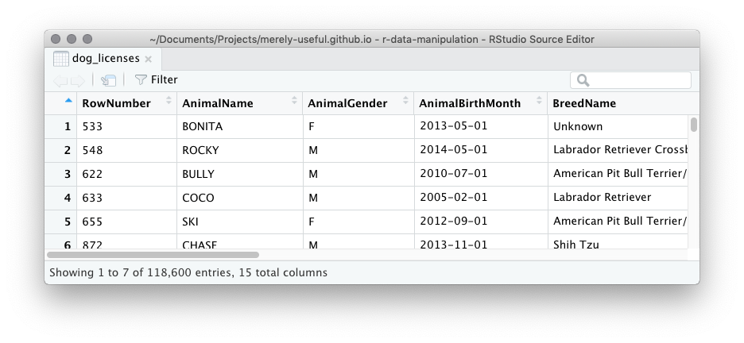

# Data Manipulation {#r-data-manipulation}

## Questions {#r-data-manipulation-questions}

```{r, child="questions/r-data-manipulation.md"}
```

## Motivation

```{r, message = FALSE, echo = FALSE}
library(tidyverse)
library(here)
dog_licenses <- read_csv(here("data", "nyc-dog-licenses.csv.gz")) %>% 
  drop_na(AnimalName)
```

TODO: where is data introduced?

TODO: clean version with no missing values and snake case column names, including month and year columns for some (all?) of the date columns.

TODO: I'm assuming that at some point this data will live in R package, so we can delay importing data to end of chapter.

The RStudio Viewer has an interface much like other spreadsheet programs you might have used.  You can use this Viewer to look at the `dog_licenses` tibble with the `View()` function:
```{r, eval = FALSE}
View(dog_licenses)
```



This viewer has some basic data manipulation features:

* **Arrange** You can change the order of the rows in the data based on the values in a column by clicking the up/down arrow next to the column name.

* **Filter** You can filter to include only rows which have a certain value in a column by first clicking the small funnel icon labelled "Filter", then typing a desired value in the appropriate column.

Arrange and filter are known as data manipulation **verbs**.  Individually, they describe a single simple manipulation of a dataset.  It's surprising how many questions you can answer using just these two basic verbs:  

* How old is the oldest dog in this data?  To answer we can arrange the `AnimalBirthMonth` column in increasing order and see Jack, a Pug from Queens, was born in January 1999 (this license was issued in May 2015, making Jack at least 16 at the time).  You'll notice that there are other dogs with this same birthday. 

* What range of license issue dates are in this data?  Arrange `LicenseIssueDate` once in increasing order and once in decreasing order, to find the issue dates range from 12th September 2015 to 31st December 2016.

* How many dogs licenses belong to dogs named Fido? Filter the `AnimalName` column with `Fido`, and see "Showing ... of 12 entries" - so 12!  

* and many more...

While these verbs are powerful in their own right, their real power comes from combining them.  For example, we can answer the more complicated question "Which dog named Fido is the oldest?" by first filtering then arranging.

The Viewer in RStudio, however, has two huge limitations:

* It's a point and click interface.  This means to repeat the same operation again you need to remember exactly the steps of point, clicking and typing you performed to get to your answer.  Consequently, it's hard to share those steps unambiguously with someone else, and it's hard to save your results for future.

* The manipulation verbs in the viewer are limited.  There is no way to rearrange the columns, add new variables or calculate summaries like counts or averages.

You'll start this chapter by overcoming this first limitation.  You won't use the Viewer to arrange and filter, you'll learn to write code to do the same operations.  Then you'll increase your vocabulary of data manipulation verbs to include:

* selecting variables,
* adding variables,
* summarizing rows, and 
* and performing these operations on subsets of the data.

Combining this verbs you'll be able to answers questions like:

* How long are licences issued for?

* What are the most popular breeds?

* What names are most popular for licensed dogs in New York?  Does this very geographically?

* When are dogs born?

TODO: update these question to reflect things that are actually done in this and later chapters.

To master data manipulation you need to master two pieces:

* How to describe the action you want with the data manipulation verbs individually.  This is a language specific skill - in this chapter, you'll use the functions in the dplyr package.  

* Identifying which verbs, and in which order to apply them, to answer a question of interest.  This skill will translate across all technologies, but it takes a little longer to master.  

### Exercise: Point and click data manipulation

Using the RStudio Viewer answer the following questions:

* How many dog licenses belong to dogs named "Queen" that live in "Queens"?

## Exploring data in the console

Let's take a look at the data in the console:
```{r}
dog_licenses
```

Notice that in contrast to the Viewer you only see the first 10 rows of the dataset, and just the first few columns. The number of columns you see depends on the width of your console, so you may see more or fewer than displayed here.  You should also note some of the contents of the columns have been abbreviated. The `…` at the end of some values in `BreedName` indicates these values have been truncated for display purposes.   

You'll be using dplyr package for data manipulation, its part of the tidyverse, so you'll need to load the tidyverse to begin:
```{r}
library(tidyverse)
```

### Re-arranging rows 

You can reorder rows of data with the dplyr function `arrange()`. The arrange function takes a dataframe as its first argument and column names as the remaining arguments. The result will have the rows ordered in increasing value of the specified column.  For example, to find the licenses belonging to the oldest dogs we arrange `dog_licenses` using the `AnimalBirthMonth` column:
```{r}
arrange(dog_licenses, AnimalBirthMonth)
```
You'll see Jack the Pug that lives in Queens, just like you did in the Viewer.

To arrange the rows by decreasing value, you need to wrap the column name in the `desc()`  (short for *desc*ending order).  For instance to find the youngest dogs:
```{r}
arrange(dog_licenses, desc(AnimalBirthMonth))
```

As another example, to find the earliest issue date we can order by increasing `LicenseIssuedDate`:
```{r}
arrange(dog_licenses, LicenseIssuedDate)
```
The first row is the record with the earliest issue date, but we can't actually see that date because the column `LicenseIssuedDate` isn't being displayed due to space.  One solution is to extract only the columns we are interested in, a manipulation known as selecting columns.

### Exercise: Arranging character strings

Use `arrange()` to order the dog licenses by `AnimalName` in increasing order.  What does this tell you about the way R treats punctuation and numbers when dealing with alphabetical order?

## How can I select subsets of my data?

Two verbs are used to subset data:

* `select()` to select columns
* `filter()` to select rows

You'll learn about these two functions in this section, along with learning about the pipe, `%>%`, a way to cahin together multiple operations on a dataset.

### Selecting columns

The `select()` function in dplyr is used to extract some subset of columns (but keep all the rows) from a dataframe.  Just like `arrange()`, it takes a dataframe as its first argument and column names as the remaining arguments.  For example, to keep only the `AnimalName` column:
```{r}
select(dog_licenses, AnimalName)
```

You can provide additional column names as arguments to keep additional specified columns, for example to keep `AnimalName` and `BreedName`:
```{r}
select(dog_licenses, AnimalName, BreedName)
```

To return to finding the earliest issue date, you need to first arrange by increasing `LicenseIssuedDate` and then select the `LicenseIssuedDate` column.  One approach is to store the result of the arrange step,
```{r}
dog_by_date <- arrange(dog_licenses, LicenseIssuedDate)
```
Then apply the select step to this object:
```{r}
select(dog_by_date, LicenseIssuedDate)
```

There are lots of shortcuts you can use with `select()` to avoid having to type out all the variables you want to keep.  For example, you can ask for all the columns that start with a certain string:
```{r}
select(dog_licenses, starts_with("Animal"))
```
Take a look in the "Useful functions" section of the `select()` help page for a complete list:
```{r, eval = FALSE}
?dplyr::select
```

### Exercise: Find the latest license issue date

Combine `arrange()` and `select()` to confirm the last issue date in this dataset is 31st December 2016.

### Combining operations with the pipe `%>%`

You've seen you can combine data manipulation steps to do more complicated tasks, but so far you've done so by saving an intermediate object, in our previous example the object `dog_by_date`:
```{r, results="hide"}
dog_by_date <- arrange(dog_licenses, LicenseIssuedDate)
select(dog_by_date, LicenseIssuedDate)
```

The pipe, `%>%`, is an operator that allows you to chain together operations without intermediate objects and maintain readability.  Let's just look at the first step in our manipulation:
```{r, results='hide'}
arrange(dog_licenses, LicenseIssuedDate)
```

With the pipe this can be rewritten as:
```{r, results='hide'}
dog_licenses %>% arrange(LicenseIssuedDate)
```
The pipe takes the object on the left hand side and passes it as the first argument to the function on the right hand side.  So, here the `dog_licenses` dataset is passed to the first argument of `arrange()`.  Inside `arrange()` we can then list any additional arguments as we normally would.  

The pipe works very nicely with the data manipulation verbs because every verb expects a dataframe as its first argument and returns a data frame. This means the result of one operation is easily piped into the next operation, allowing you to chain together multiple steps.  For instance, piping the result of the arrange step above into the `select()` function:
```{r, results = "hide"}
dog_licenses %>% 
  arrange(LicenseIssuedDate) %>% 
  select(LicenseIssuedDate)
```

When you see the pipe, read it as "and then".  So, the above code would be read:

> Take the dog_licenses data, **and then**   
> arrange the rows by the `LicenseIssuedDate`, **and then**  
> select the column `LicenseIssuedDate`.

The result is code that matches very closely how we might describe the steps we performed in natural language.  It's so natural that for the remainder of the chapter we'll use the pipe when combining data manipulation steps.

### Exercise: Reading aloud

Read the following code aloud to your neighbor (or cat, dog or rubber duck).  Remember to pronounce `%>%` as "and then".  
```{r, eval = FALSE}
dog_licenses %>% 
  filter(Borough == "Queens") %>% 
  summarise(max(AnimalBirthMonth))
```
You haven't learnt about the `filter()` or `summarise()` functions yet, but can you guess what the code does? What question might it answer? 

### Exercise:  Using the pipe

Re-write this snippet of code to use the pipe:
```{r, results = "hide"}
select(dog_licenses, AnimalName, BreedName)
```

Use the pipe to re-write this snippet of code to avoid the intermediate variable:
```{r, results = "hide"}
name_and_breed <- select(dog_licenses, AnimalName, BreedName)
arrange(name_and_breed, BreedName)
```

### Filtering to keep a subset of rows

The function to filter rows of a data frame is `filter()`.  Like `arrange()` and `select()`, its first argument is a dataframe or tibble.  The remaining arguments describe which rows to **keep**.  The rows to keep are specified with a logical expression - something that is either `TRUE` or `FALSE`. The rows where this expression is `TRUE` will be returned.

One of the simplest kinds of logical expression is a test for equality with the `==` operator.  For example, to keep the rows where `AnimalName` is `BRUNO` you could do:
```{r}
dog_licenses %>% filter(AnimalName == "BRUNO")
```
The logical expression, `AnimalName == "BRUNO"`, will be `TRUE` when the value of the `AnimalName` column is exactly equal to the character string `"BRUNO"` - any differences in case, or whitespace will result in `FALSE`.  

Columns names can appear on either side of `==` or even on both sides.  When column names appear on both sides, the comparison happens row by row.  In programming terms this is know as an element-wise comparison.  For example, `LicenseIssuedDate == AnimalBirthMonth` will return `TRUE` for a row only if for that row the date the license was issued is the exact same date as the birth month for the dog. If you take a look:
```{r}
dog_licenses %>% 
  filter(LicenseIssuedDate == AnimalBirthMonth)
```
There are no rows that satisfy this criteria.

You can think of `==` as being a specific kind of comparison.  Other comparisons include: `<` less than , `>` greater than, `<=` less than or equal to , `>=` greater than or equal to, and `!=` not equal to.

### Exercise: Enterprising dogs

Are there any dogs called "Spock", "Picard", or "Janeway"? 

These are Star Trek characters, can you find any dogs with a name from one of your favorite books, TV shows or movies?

### Exercise: Expired Licenses

This code creates a variable that contains the date for the start of the year 2016:
```{r}
start_of_2016 <- as.Date("2016-01-01")
```

Use `filter()` with this variables to find:

* The dog licenses that were issued before 2016
* The dog licenses that expire before 2016

### More complicated expressions

If you pass more than one logical expression to `filter()` it will return only rows where **all** of the expressions are `TRUE`.  For example, licenses that are to dogs named Bruno in Brooklyn:
```{r}
dog_licenses %>% 
  filter(AnimalName == "BRUNO", Borough == "Brooklyn") 
```

If you want to create an "or" type expression, like "licenses to dogs named BRUNO **or** dogs named BRUCE", you need to combine two comparisons with the OR operator, `|`.  
```{r, results = "hide"}
# Dogs just named BRUNO
dog_licenses %>% 
  filter(AnimalName == "BRUNO")

# Dogs just named BRUCE
dog_licenses %>% 
  filter(AnimalName == "BRUCE")

# Dogs named BRUNO or BRUCE
dog_licenses %>% 
  filter(AnimalName == "BRUNO" | AnimalName == "BRUCE")
```

If you find yourself combining lots of comparisons on the same column with `|`, like dogs named `BRUNO`, `BRUCE` or `BRADY`:
```{r, results = "hide"}
dog_licenses %>% 
  filter(AnimalName == "BRUNO" | AnimalName == "BRUCE" | AnimalName == "BRADY")
```
You can save a lot of typing with `%in%`:
```{r, results = "hide"}
dog_licenses %>% 
  filter(AnimalName %in% c("BRUNO", "BRUCE", "BRADY"))
```
`%in%` will return `TRUE` for an element of the left hand side if it is contained in the vector on the right hand side.

### Exercise: Expired Licenses

This code creates two variables that contains the dates for the start and end of the year 2016:
```{r}
start_of_2016 <- as.Date("2016-01-01")
endt_of_2016 <- as.Date("2016-12-31")
```

Use `filter()` with these variables to find the dog licenses that expire during  2016.

## How can I calculate new values?

So far, you've been manipulating the columns that ready exist in a dataset, but want if you want to add new ones? The function `mutate()` handles this kind of operation.  

To see how this works let's start with a logical expression: `AnimalName == "CHASE"`.  If you used this with `filter()`, you would get all the rows back where the license was issued to a dog named `CHASE`. Let's say instead of subsetting the data, you want to add a column called `called_chase` that contained the `TRUE` and `FALSE` result.  With `mutate()` after passing in the data, you pass named arguments, where the name is the name you desire for the new column, and its value is the way to calculate it:
```{r}
dog_licenses %>% 
  mutate(called_chase = AnimalName == "CHASE") %>% 
  select(AnimalName, called_chase)
```

> Take `dog_licences`, **and then**,   
> mutate to add a column called `called_chase` which is the result of testing whether `AnimalName` is exactly `"CHASE"`, **and then**,   
> select the columns `AnimalName` and `called_chase`.

The select statement isn't crucial to the calculation here, but it does help me draw your attention to the columns that were involved in this step.

This can be a useful intermediate step in filtering, since it gives you a chance to examine the logical statement before using it to filter:
```{r}
dog_licenses %>% 
  mutate(called_chase = AnimalName == "CHASE") %>% 
  filter(called_chase)
```

Take a closer look at the argument to mutate:
```
called_chase = AnimalName == "CHASE"
```
On the left of the `=` is the argument name, `called_chase`.  This is a name you choose - it should be descriptive and follow good style.  On the right of the `=` is an expression that must either return as many values as there are rows, or a single value.  Here, the logical expression involves the column `AnimalName` so it returns as many values as there are rows.

It you would prefer the values to be something other `TRUE` or `FALSE`, say `"called_chase"` and `"not_called_chase"`, `ifelse()` is a base R function that can do this:

A call to `ifelse()` takes the form:
```r
ifelse(test, yes, no)
```
Where `test` is a logical expression, `yes` the value for the elements that return `TRUE`, and `no` the value for the elements that return `FALSE`. (Both `yes` and `no` could be other column names, in which case, the corresponding element of `yes` would be returned for `TRUE` elements).
```{r}
dog_licenses %>% 
  mutate(
    called_chase = ifelse(AnimalName == "CHASE", "called_chase", "not_called_chase")
    ) %>% 
  select(AnimalName, called_chase)
```

You can perform multiple mutate steps at once by passing more arguments to `mutate()`, so an alternative way of writing the above code (with more keystrokes, but with lines that are shorter) would be:
```{r}
dog_licenses %>% 
  mutate(
    is_chase = AnimalName == "CHASE",
    called_chase = ifelse(is_chase, "called_chase", "not_called_chase")
    ) %>% 
  select(AnimalName, is_chase, called_chase)
```

Arithmetic is another common operation that returns as many elements as there are rows.  For instance we could see how long licenses are issued for:
```{r}
dog_licenses %>% 
  mutate(license_duration = LicenseExpiredDate - LicenseIssuedDate) %>% 
  select(license_duration)
```
Interesting that there is so much variation here. 

TODO: provide link to RStudio data mini cheatsheet with other functions that are useful with mutate.

You can use `mutate()` with operations that give one number based on all the rows:
```{r}
dog_licenses %>% 
  mutate(
    license_duration = LicenseExpiredDate - LicenseIssuedDate,
    avg_duration = mean(license_duration)) %>% 
  select(license_duration, avg_duration)
```
You'll get back the original number of rows, but the single value will be repeated in all of them - on average licenses are issued for 467.321 days.  You'll see a different manipulation, `summarise()` that collapses many rows into one later in this chapter.

### Exercise: Ages of dogs

Use `mutate()` to add a column `age_at_issue` that contains the dogs approximate age on the day the license was issued.

### Exercise: Mutts

Use `mutate()` along with `ifelse()` to create a column `breed` that takes values `"unknown"` if `BreedName` is `"Unknown"` and `"known"` otherwise.

*Extra challenge* Can you figure out if the licenses issued to unknown breed dogs are of longer or shorter duration on average than known breed dogs?

### Exercise: Name length

The function `str_length()` in the stringr package finds the length of character strings.  Replace the `___` in following code to add a column called `name_length` that contains the length of the dog's name:
```{r, eval = FALSE}
dog_licenses %>% 
  ___(___ = stringr::str_length(AnimalName))
```

Now add an `arrange()` step to find the licenses issued to dogs with the longest names?

## How can I tell what's gone wrong in my programs?

TODO: The errors shown in the markdown are way more informative than those in the Console.  Try to get the error displaying in the book like they do for someone in the console?

Let me share an interaction my (CVW's) husband had at a Trader Joes (a small specialized supermarket) soon after we arrived in the USA from New Zealand.  

Josh: "Do you sell *bat-trees*?"  

Store-person: "What?"  

Josh: "Do you sell *bat-trees*?"  

Store person: "Huh? *Bat...trees*?"  

Josh: "Do you sell *bat-er-ries*?  

Store-person: "Oh...you mean batteries!  No.  We don't sell batteries."  

This is a pretty accurate analogy for what it feels like when you are learning R.  You know what you want, but you have to ask for it in a way R understands.  When R doesn't understand you, or when R can't give you what you want, you'll get an error.  You'll know when you get one in R because the only output you see will start with `Error`.

```{r, error = TRUE}
buy_batteries(store = "Trader Joes")
```

It's also a good illustration of the two kinds of problems that occur:  syntax errors and runtime errors.  Syntax errors are like the "What? Huh?" moments.  R doesn't understand what you are asking it to do, because something about the way you are asking doesn't conform to what R expects.  Runtime errors are more like the "No, I can't help you" moments.  R understands what you are asking, but for some reason it can't give you what you are asking for.  

You generally want to make sure you've ruled out syntax errors before assuming it's a runtime error. Unfortunately, R doesn't distinguish these two types of error in its output, so we'll discuss some of the most common examples in the following sections.

This analogy is also a reminder that sometimes you'll have to repeat yourself.  With R, giving the exact same instruction should always result in the exact same error, but it's not uncommon, even for longtime R users, to run and edit a line of code multiple times before it runs without error.

There is one flaw in this analogy -- R isn't a real person. So, if you need to vent *your* frustration by cursing it, insulting its parentage or storming off, it's fine, no one's feelings will be hurt.  Of course, it won't change R's response...

### Common syntax errors

Syntax errors occur when your code can't be parsed into its component pieces by R.  For example, R expects the arguments to a function to start after the opening parenthesis (`(`), be separated by a comma (`,`) and finish at the closing parenthesis (`)`). When R sees this code:
```{r, error = TRUE}
filter(dog_licenses BreedName == "Finnish Lapphund")
```
The missing comma means R can't figure out where the first argument to `filter()` ends: is it after `dog_licenses`, after `BreedName`, or after `==`?  

Take a closer look at the error message.  Error messages always begin with `Error`, then optionally the name of the function that returned an error (not in this example), followed by a `:`, and some description of the error that occurred. The message `unexpected symbol` is one common kind of syntax error - in this case R encountered some code where it was expecting a comma or closing parenthesis.  We can fix it by putting in the missing comma:
```{r, error = TRUE}
filter(dog_licenses, BreedName == "Finnish Lapphund")
```

Syntax errors are usually the result of typos.  Some things to keep an eye out for:

* If you are modelling your code on an example, pay very close attention to the punctuation: commas `,`, parenthesis `(`, `)`, brackets, `[`, `]`, and quotes `"`, `'`.  Every opening parenthesis, bracket, or quote needs a matching closing one, and they must be closed in the reverse order they were opened.  

* New lines don't matter if they happen between arguments, or after pipe operators, but they can be problematic in other locations. 

* R ignores other whitespace (spaces or tabs) unless it's inside a character string (i.e. inside quotes), so different spacing shouldn't be the cause of an error, but it is a good idea to follow good style for spacing.  TODO: link to style guide section.


### Exercise: Syntax errors 

Fix these **syntax** errors. 

*  
    ```{r, error = TRUE}
    dog_licenses %>% 
      arrange(desc(LicenseExpiredDate)))
    ```
    
* 
    ```{r, error = TRUE}
    dog_licenses %>% 
      mutate(
        month_born = lubridate::month(AnimalBirthMonth)
        year_born = lubridate::year(AnimalBirthMonth))
    ```

*
    ```{r, error = TRUE}
    dog_licenses %>% 
      filter(AnimalName == "BRUNO)
    ```
    (If you run this code in the Console, you might not get an error, but you should see a `+` on a new line, a signal that R is waiting for more input and a clue that there is something missing in this code). 
    
*  
    ```{r, error = TRUE}
    dog_licenses 
      %>% filter(AnimalGender == "M")
    ```

### Common runtime errors

Runtime errors come in an infinite number of flavors because there are so many ways what you ask for might be impossible to do.  For example you might try to do arithmetic with character strings:
```{r, error = TRUE}
"apple" + "banana"
```

Or try to filter with something that isn't a logical:
```{r, error = TRUE}
dog_licenses %>% filter(AnimalName)
```

Perhaps the most common runtime error is of the form `Error: object not found`:
```{r, error = TRUE}
an_object_i_dont_have
```
This is R complaining that you've asked it to operate on an object that it doesn't know about.  Often this is actually a typo in disguise, for example you've misspelled the name of the object,
```{r, error = TRUE}
my_object <- 12
my_objet
```
you've used the wrong case, 
```{r, error = TRUE}
My_object
```
or you've forgotten you used a separator
```{r, error = TRUE}
myobject
```

This error also often arises when you forgot quotes around strings.  For example, if we want all the dogs that are male, and try
```{r, error = TRUE}
dog_licenses %>% filter(AnimalGender == M)
```
you get an error because R is looking for an object called `M` to compare to the values in the column called `AnimalGender`.  What we really wanted to do was compare the values in `AnimalGender` to the string `"M"`:
```{r}
dog_licenses %>% filter(AnimalGender == "M")
```

### Exercise: `object not found`

Fix these `object not found` errors. (Hint: the names of the objects or variables being created should give you a clue to the intent of the code)

*
    ```{r, error = TRUE}
    dog_licenses %>% 
      mutate(year_issued = lubridate::year(Liscenceissuedate))
    ```

* 
    ```{r, error = TRUE}
    dogs_named_bruno <- dog_licenses %>% 
      filter(AnimalName == BRUNO)
    ```

### Warnings and messages 

There are two other kinds of alerts R can give: warnings and messages.  These can both appear in the console with the same color as an error, but they are informational as opposed to fatal.  

Messages are purely informational, for example when you read data in with `read_csv()` you get a message that describes the columns and their data types as parsed by the function:
```{r}
sites <- read_csv(here("data", "site.csv"))
```

Warnings generally alert you that something was slightly unexpected but that R recovered and gave you a result anyway.  Poorly formatted CSV files will often result in warnings from `read_csv()`:
```{r}
bad_csv <- "
id, 
1, 2
2, 1
3, 5
"
bad <- read_csv(bad_csv)
```
Here there was a missing column name.  `read_csv()` still returns an object but the warning alerts you that it made some assumption to get it, i.e. that it made up a column name:
```{r}
bad
```

Warnings don't **stop** you from proceeding, but they should alert you to question whether you **should be** proceeding.

### What do I do when I get an `Error` I can't fix?

* Check the error is reproducible.  Restart R with a clean slate and re-run your code up to and including the code that gives the error. This is the R version of the classic tech advice to "turn it off, then turn it on again".  TODO: link to reproducibility chapter.

* Try googling it: for example, googling "R unexpected string constant" lead me to the question ["Error: unexpected symbol/input/string constant/numeric constant/SPECIAL in my code" on StackOverflow][error-unexpected] which gives some great examples of ways this error might arise.

* Ask for help. You are most likely to get help when you can provide a reproducible example. TODO: provide link

## How can I operate on subsets of my data?

The syntax for `summarise()` is the same as `mutate()` but it expects operations that reduce all rows down to one row.  Recall from `mutate()` this code that added the average license duration to every row of the data:
```{r, results="hide"}
dog_licenses %>% 
  mutate(license_duration = LicenseExpiredDate - LicenseIssuedDate) %>% 
  mutate(avg_duration = mean(license_duration)) 
```
You actually saw this in one `mutate()` statement, but I've separated out the line that calculates the average so it's easier to see the difference with `summarise()`.  See what happens when you switch out the final `mutate()` with `summarise()`:
```{r}
dog_licenses %>% 
  mutate(license_duration = LicenseExpiredDate - LicenseIssuedDate) %>% 
  summarise(avg_duration = mean(license_duration)) 
```
Instead of the the one value repeated on every row, we get a new tibble with only one row, and a single column that corresponds to our requested summary.

Any function that takes many values and reduces them to one is a good candidate for `summarise()`, for example we could find the shortest licence duration by swapping in `min()` instead of `mean()`:
```{r}
dog_licenses %>% 
  mutate(license_duration = LicenseExpiredDate - LicenseIssuedDate) %>% 
  summarise(shortest_duration = min(license_duration)) 
```

Like `mutate()` you can also create multiple summary columns at once:
```{r}
dog_licenses %>% 
  mutate(license_duration = LicenseExpiredDate - LicenseIssuedDate) %>% 
  summarise(
    avg_duration = mean(license_duration),
    shortest_duration = min(license_duration),
    longest_duration = max(license_duration)
  )
```

TODO: link to cheatsheet with list of other useful functions.

Lot's of statistical operations produce one numbers summaries and are appropriate for use with `summarise()`: `sd()`, `min()`, `max()`, `mean()`, `median()`, `quantile()` (with a single argument).  Whenever you are summarizing many rows, it's a good idea to keep track of how many rows were summarized.  This is so common, dplyr provides a special function, `n()`, that simply counts the number of rows.  To add it to your summary:
```{r}
dog_licenses %>% 
  mutate(license_duration = LicenseExpiredDate - LicenseIssuedDate) %>% 
  summarise(
    avg_duration = mean(license_duration),
    shortest_duration = min(license_duration),
    longest_duration = max(license_duration),
    n_licenses = n()
  )
```

Now, imagine you want this summary just for licenses issued to dogs in the Bronx.  You might do something like:

> Take the `dog_licenses` data, **and then**,   
> mutate to add a column called `license_duration`, **and then**  
> filter to keep rows where the `Borough` is `"Bronx"`, **and then**  
> summarise to find the mean, min and max duration along with the number of rows.

In code:
```{r}
dog_licenses %>% 
  mutate(license_duration = LicenseExpiredDate - LicenseIssuedDate) %>% 
  filter(Borough == "Bronx") %>% 
  summarise(
    avg_duration = mean(license_duration),
    shortest_duration = min(license_duration),
    longest_duration = max(license_duration),
    n_licenses = n()
  )
```

But how does this compare to Brooklyn?  You could do the same operation again, but now for Brooklyn:
```{r}
dog_licenses %>% 
  mutate(license_duration = LicenseExpiredDate - LicenseIssuedDate) %>% 
  filter(Borough == "Brooklyn") %>% 
  summarise(
    avg_duration = mean(license_duration),
    shortest_duration = min(license_duration),
    longest_duration = max(license_duration),
    n_licenses = n()
  )
```

What about Queens?  This kind of operation: summarising different subsets of the same data, is so common there is a much easier way to do it: combining `summarise()` with `group_by()`.  

The only difference in the code, is that instead of filtering for a specific `Borough` we'll `group_by()` the column `Borough`.
```{r}
dog_licenses %>% 
  mutate(license_duration = LicenseExpiredDate - LicenseIssuedDate) %>% 
  group_by(Borough) %>% 
  summarise(
    avg_duration = mean(license_duration),
    shortest_duration = min(license_duration),
    longest_duration = max(license_duration),
    n_licenses = n()
  )
```
The `group_by()` verb doesn't perform any changes to the data except to add a signal that this data is now grouped.  Subsequent operations will then happen within these groups.  In the case of `summarise()` we now get one row per group, and these are all stacked together in our result.

You might have been a little surprised by the result above. I thought there were only five boroughs in New York (at least that's what the Beastie Boys told me)?  Notice some boroughs are represented more than once by variations in case or spelling: `Bronx`, `BRONX`.  As far as `group_by()` is concerned these are distinct values of this variable.  There also seem to be smaller designations than Borough in this data. You'll get a chance to try and resolve this in an exercise below.

### Exercise: Dog birth months

The following code creates a new column `month_born` that holds the name of the month the licensed dog was born:
```{r, results = "hide"}
dog_licenses %>% 
  mutate(month_born = lubridate::month(AnimalBirthMonth, label = TRUE))
```
Use a `group_by()` step and a `summarise()` step to find the number of dogs born in each month?  Which month stands out? Can you guess why?

### Exercise: Order matters?

In the example above for dogs licensed in Brooklyn:
```{r, results = "hide"}
dog_licenses %>% 
  mutate(license_duration = LicenseExpiredDate - LicenseIssuedDate) %>% 
  filter(Borough == "Brooklyn") %>% 
  summarise(
    avg_duration = mean(license_duration),
    shortest_duration = min(license_duration),
    longest_duration = max(license_duration),
    n_licenses = n()
  )
```
the `filter()` step came after the `mutate()` step. Does this matter?  

* Swap the order in the code and see if you get the same results.

* Write out how you might describe the steps. Is it obvious you can swap the filter and mutate step and get the same results?

* Which steps can't you swap the order of? Why?

* *There are some performance differences...can you guess why?*

### Exercise: the five boroughs

The column `NTA` is a code for the "Neighborhood Tabulation Areas", and has been geo-coded from the licensee's address (as opposed to self reported).  The first two characters correspond to the Borough.

This code creates a new variable called `borough_code` that contains just these two characters:
```{r}
dog_licenses %>% 
  mutate(borough_code = stringr::str_sub(NTA, 1, 2)) 
```

Which borough has the longest average licence duration?

## How can I work with two or more datasets?

-   join

## How can I read my own tabular data into R?

### What is tabular data?

Tabular data describes data that is in the form of a table: values arranged in rows each of the same length, or equivalently values arranged in columns each of the same length. Here's a small example of some tabular data:
```{r, echo = FALSE, message=FALSE}
example_csv <- here("data", "site.csv")
sites <- read_csv(example_csv )
knitr::kable(sites)
```

Each row records information on a site at which water measurements are taken.  There are three columns: a site identification code, and the location of the site in latitude and longitude. 

This is an incredibly common way of *displaying* data, but when *storing* tabular data in a file, we need a way to communicate when records and values begin and end.  A very popular format for doing this is CSV.  CSV, is short for **c**omma **s**eparated **v**alues, and like the name suggests, a comma, `,`, is used to separate the values for each column, while each record goes on a new line.  The file is plain text, but we use the extension `.csv` to indicate that is follows the CSV format conventions.

Here's how the table above would look inside the CSV file `site.csv`:
```{r, echo = FALSE, comment = NA}
writeLines(readLines(example_csv))
```

In this case the first line has the column names, this is common (and recommended!), but not universal. 

Why is CSV so popular? 

* It's human readable.  CSV isn't a special file type, it is just a plain text file that follows some conventions.  This means you don't need any special software to look at the contents -- you can open in up in anything that can examine text and take a look inside. 
* It's computer readable.  Because CSV files all have the same structure it's easy to write computer programs to read them.  This means in almost any program designed to work with data, and all the common programming languages, you'll find functions that will import CSV files.  This also means it's easy to create CSV files -- you can export them from Excel, write them from R, or even write one from scratch in a text editor.

If you want to look inside a CSV file in RStudio you can navigate to its location in the "Files" pane and click on its name.  Selecting "View File", will open it in the Source pane. 

However, if you want to work with CSV data in R, it isn't enough to look inside the file.  You need to read the contents of the file and store it in R's memory.  This process is known as data import.

### Importing CSV data into R

To work with data in R you need to have it in R's memory.  The `read_csv()` function in the readr package will import a CSV file, and represent it as a tibble, if you give it the location of the CSV file.  For example, to read the `site.csv` data and store it in an object called `sites`: 
```{r}
library(tidyverse)
sites <- read_csv(here("data", "site.csv"))
sites
```

TODO: talk about files paths, point reader to the place where file paths are talked about, or assume file is in their working directory.

Notice that `read_csv()` gave us a message about what it did: it parsed our data file and found three columns `site_id`, `latitude` and `longitude`.  It also mentions what kind of data it assumed was in each column.  TODO: point to further discussion of data types.

The object `sites` is now R's representation of the data from the `site.csv` file.    

### Exercise: Import `visited.csv`

Use `read_csv()` to read `visited.csv` into R. How does R indicate a cell with a missing value?

```{r}
visited <- read_csv(here("data", "visited.csv"))
visited
```

### Exercise: Import IRS tax return data for New York City

Use `read_csv()` to import the CSV file `nyc-tax-returns.csv`.  

TODO: Should we introduce the "common things that go wrong" / "the most common additional arguments", e.g. `skip`, `na`, `col_names`, `col_types`?  My feeling is not now, but sometime later.

## How can I save my results?

Say, you've now got a summary of the license durations by borough:
```{r}
dog_licenses %>% 
  mutate(
    license_duration = LicenseExpiredDate - LicenseIssuedDate,
    borough_code = stringr::str_sub(NTA, 1, 2)) %>% 
  group_by(borough_code) %>% 
  summarise(
    avg_duration = mean(license_duration),
    shortest_duration = min(license_duration),
    longest_duration = max(license_duration),
    n_licenses = n()
  ) 
```

How do you save this result for future use?

If you just need this tibble later in your code you can assign it to a variable:
```{r}
duration_by_borough <- dog_licenses %>% 
  mutate(
    license_duration = LicenseExpiredDate - LicenseIssuedDate,
    borough_code = stringr::str_sub(NTA, 1, 2)) %>% 
  group_by(borough_code) %>% 
  summarise(
    avg_duration = mean(license_duration),
    shortest_duration = min(license_duration),
    longest_duration = max(license_duration),
    n_licenses = n()
  )
```

Then you can access it whenever you need it:
```{r}
duration_by_borough 
```

This keeps our result around in memory, but often you also want to preserve the data in a file on disk.  There are two common choices for format: CSV and RDS.

You've already seen CSV files.  Saving your results in this format gives you all the benefits of that format: plain text files easily shared and opened.  You can save a tibble as a CSV file with the readr function `write_csv()`, where all you need to specify is the path:
```{r}
duration_by_borough %>% write_csv("duration-by-borough.csv")
```

You can then read this file in any project or R session with `read_csv()`:
```{r}
duration_by_borough <- read_csv("duration-by-borough.csv")
```

RDS files are a special R format.  They are binary files as opposed to plain text files, which means you can't just open them up and look inside.  If you are sharing them you'd also need your collaborators to have R.  These are downsides, but the advantage of this format is that it can be much quicker to load, it will preserve special R data types (for example factors, or nested structures), and can save any R object not just tabular data structures.

To save the tibble as an RDS, use `write_rds()`:
```{r}
duration_by_borough %>% write_rds("duration-by-borough.rds")
```

To read it back in, use `read_rds()`:
```{r}
duration_by_borough <- read_rds("duration-by-borough.rds")
```

Often you'll save your data in both formats to make sure you get the best of both worlds. You'll talk more about where to save your data in TODO: add link.

### Exercise

Save the tibble with our extra columns:
```{r, results = "hide"}
dog_licenses %>% 
  mutate(
    license_duration = LicenseExpiredDate - LicenseIssuedDate,
    borough_code = stringr::str_sub(NTA, 1, 2))
```

into a CSV file called `dog-licenses-extra.csv`.
