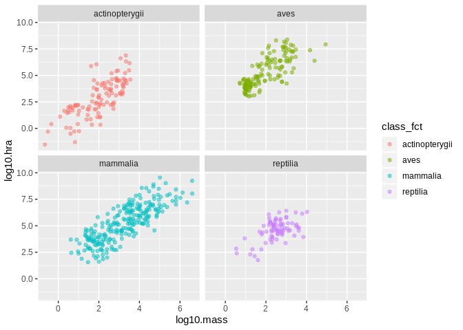
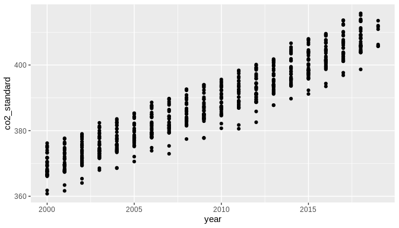
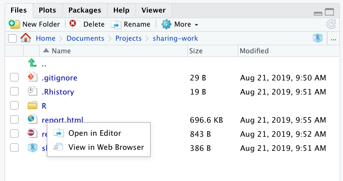
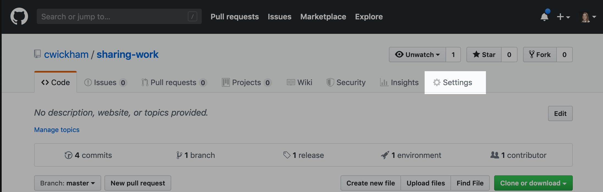

# Overview {#overview}


> It's still magic even if you know how it's done.
>
> — Terry Pratchett

FIXME: general introduction

-   Be able to do the steps in @Yenn2019.

## Why isn't all of this normal already? {#overview-against}

Nobody argues that research should be irreproducible or unsustainable,
but "not against it" and actively supporting it are very different things.
Academia doesn't yet know how to reward people for writing useful software,
so while you may be thanked,
the extra effort you put in may not translate into job security or decent pay.

And some people still argue against openness,
Being open is a big step toward a (non-academic) career path,
which is where approximately 80% of PhDs go,
and for those staying in academia,
open work is cited more often than closed (FIXME: citation).
However,
some people still worry that if they make their data and code generally available,
someone else will use it and publish a result they have come up with themselves.
This is almost unheard of in practice,
but that doesn't stop people using it as a boogeyman.

Other people are afraid of looking foolish or incompetent by sharing code that might contain bugs.
This isn't just [impostor syndrome][impostor-syndrome]:
members of marginalized groups are frequently judged more harshly than others (FIXME: citation).

## Acknowledgments {#overview-ack}

This book owes its existence to
the hundreds of researchers we met through [Software Carpentry][swc] and [Data Carpentry][dc].
We are also grateful to [Insight Data Science][insight] for sponsoring the early stages of this work,
to everyone who has contributed,
and to:

-   *Practical Computing for Biologists* @Hadd2010
-   *Effective Computation in Physics* @Scop2015
-   "A Quick Guide to Organizing Computational Biology Projects" @Nobl2009
-   "Ten Simple Rules for Making Research Software More Robust" @Tasc2017
-   "Best Practices for Scientific Computing" @Wils2014
-   "Good Enough Practices in Scientific Computing" @Wils2017

<!--chapter:end:index.Rmd-->

# Novice Goals {#novice-goals}


This outline describes the questions that the novice courses on R and Python will answer.
The advanced course can then assume that learners have hands-on experience with these topics
but nothing more.

## Personas

### Anya

**Anya** is a professor of neuropsychology
who is responsible for teaching her department's introduction to statistics
to 1100 first-year students every year.
(Students complain that the Stats department's introductory course is too theoretical
and requires more programming knowledge than they have.)
When she finds time for it,
her research focuses on color perception in infants.

Over the past nine years,
Anya has designed and run a dozen experiments on 50-100 infant subjects each
and analyzed the results using SPSS and more recently R
(which she taught herself during a sabbatical).
She has never taken a programming course,
and suffers from impostor syndrome when talking to colleagues who are using things like GitHub and R Markdown.

Anya would like to figure out how to use R to teach her intro stats course,
which currently uses a mixture of Excel and SPSS.
She would like to learn more about time series analysis to support her research,
and about tools like Git and R Markdown.

This guide has modular lessons and exercises that she can adapt to use in her course,
and suggestions for how to make learning interactive with a large class size.
She also finds helpful instructions for applying time series analysis to data using R.

### Exton

**Exton** taught business at a community college before joining a friend's startup,
and now does community management for a company that builds healthcare software.
He still teaches Marketing 101 every year to help people with backgrounds like his.

Exton uses Excel to keep track of who is registered for webinars, workshops, and training sessions.
Some of these spreadsheets are created from CSV files
produced by a web-scraping script a summer intern wrote for him a couple of years ago.
Exton doesn't think of himself as a programmer,
but spends hours creating complicated lookup tables in multi-sheet spreadsheets
to help him figure out how many webinar attendees turn into community contributors,
who answers forum posts most frequently,
and so on.

Exton knows there are better ways to do what he's doing,
but feels overwhelmed by the flood of blog posts, tweets, and "helpful" recommendations
he receives from members of the company's engineering team.
He wants someone to tell him where he should start and how long it will take whatever he learns to pay off.

Exton finds 'Merely Useful' after some Googling,
and sees an example of data analysis with spreadsheet data that looks really similar to what he's trying to do.
He carefully works through that particular example,
then goes back and works through some of the earlier material in the book.
He can tell that it won't take long to get this to work with his data.

### Irwin

**Irwin**, 18, is five months into an undergraduate degree in urban planning.
He's read lots of gushing articles in *Wired* about data science,
and was excited by the prospect of learning how to do it,
but dropped his CS 101 course after six weeks because nothing made sense.
(His university's computer science department uses Haskell as an introductory programming language...)
He is doing better in Anya's course (which he is taking as an elective)
but still spends most of his time copying, pasting, and swearing.

Irwin did well in his high school math classes,
and built himself a home page with HTML and CSS in a weekend workshop in grade 11.
He knows how to do simple calculations in Excel,
has accounts on nine different social media sites,
and attends all of his morning classes online.

Anya mentions this guide in one of her classes,
and Irwin downloads the PDF to read on the bus.
He loves the examples that use urban data,
and right away he has tons of ideas about where to get more cool data to analyze.
His urban data science blog is already taking shape in his head.

### Camilla

**Camilla** recently started a job as an assistant professor.
Her department (Medieval Studies) is trying to develop a digital humanities data-science-heavy undergraduate program,
and the undergraduate chair thinks that Camilla has the most programming experience in the department
and has asked her to develop an introduction to programming course for humanities students.

Camilla has dabbled in natural language processing and has learned Python over the course of her previous work,
but she has no experience teaching progamming
and she's not sure what the best way is to teach beginners.
She doesn't want to start from scratch to create a course out of nothing.
She also isn't sure which programming language the new program should focus on.

She finds 'Merely Useful' and feels relieved:
she can pretty much use the book as-is for her course.
She looks up the examples of text and image analysis
and compares how both R and Python approach those kinds of data
to help her make a decision about which language to teach.

### Jordan

**Jordan** is a third-year undergraduate student in ecology.
Two months ago she started working part-time for a professor in her department,
and she's beginning to collect and analyze data from her own experiments with fruit flies.
Her professor has asked her to learn R to do her analysis
and suggested that she sign up for the introduction to quantitative data analysis in R course
that the ecology department offers.
The course is just starting,
and it uses 'Merely Useful' as the textbook.

Jordan can't wait to apply her new programming knowledge to her data,
so she starts reading ahead and trying to use her own data in some of the book's examples.
As she works through examples,
she realizes that she'll need to change a few things about how she records her data in spreadsheets
so that it will be easier to analyze in R.

## Getting started

-   What are the different ways I can interact with software?
    -   console
    -   scripts
-   How can I find and view help?
    -   In the IDE
    -   Stack Overflow
-   How can I inspect data while I'm working on it?
    -   table viewers

## Data manipulation

-   How can I read tabular data into a program?
    -   what CSV is, where it comes from, and why people use it
    -   reading files
-   How can I select subsets of my data?
    -   select
    -   filter
    -   arrange
    -   Boolean conditions
-   How can I calculate new values?
    -   mutate
    -   ifelse
-   How can I tell what's gone wrong in my programs?
    -   reading error messages
    -   the difference between syntax and runtime errors
-   How can I operate on subsets of my data?
    -   group
    -   summarize
    -   split-apply-combine
-   How can I work with two or more datasets?
    -   join
-   How can I save my results?
    -   writing files
-   What *isn't* included?
    -   anything other than reasonably tidy tabular data
    -   map
    -   loops and conditionals

## Plotting

-   Why plot?
    -   summary statistics can mislead
    -   [Anscombe's Quartet and the DataSaurus dozen][anscombe-datasaurus]
-   What are the core elements of every plot?
    -   data
    -   geometric objects
    -   aesthetic mapping
-   How can I create different kinds of plots?
    -   scatter plot
    -   line plot
    -   histogram
    -   bar plot
    -   which to use when
-   How can I plot multiple datasets at once?
    -   grouping
    -   faceting
-   How can I make misleading plots?
    -   showing a single central tendency data point instead of the individual observations
    -   saturated plots instead of for example violins or 2D histograms
    -   picking unreasonable axes limits to intentionally misrepresent the underlying data
    -   not using perceptually uniform colormaps to indicate quantities
    -   not thinking about color blindness
-   What *isn't* included?
    -   outliers
    -   interactive plots
    -   maps
    -   3D visualization

## Development

-   How can I make my own functions?
    -   declaring functions
    -   declaring parameters
    -   default values
    -   common conventions
-   How can I make my programs tell me that something has gone wrong?
    -   validation (did we build the right thing) vs. verification (did we build the thing correctly)
    -   assertions for sanity checks
-   How can I ask for help?
    -   creating a reproducible example (reprex)
-   How do I install software?
    -   what *is* a package?
    -   package manager
-   What *isn't* included?
    -   code browsers, multiple cursors, and other fancy IDE tricks
    -   virtual environments
    -   debuggers

## Data analysis

-   How can I represent and manage missing values?
    -   NA
-   How can I get a feel for my data?
    -   summary statistics
-   How can I create a simple model of my data?
    -   formulas
    -   linear regression
        -   adding a best fit straight line on a scatterplot
        -   understanding what the error bands on a "best fit" straight line mean
    -   k-means cluster analysis
    -   frame these as exploratory tools for revealing structure in the data, rather than modelling or inferential tools
-   How can I put people at risk?
    -   algorithmic bias
    -   de-anonymization
-   What *isn't* included?
    -   statistical tests
    -   multiple linear regression
    -   anything with "machine learning" in its name

## Version control

-   What is a version control system?
    -   a smarter kind of backup
-   What goes where and why?
    -   local vs. remote storage (physically)
    -   local vs. remote storage (ethical/privacy issues)
-   How do I track my work locally?
    -   diff
    -   add
    -   commit
    -   log
-   How do I view or recover an old version of a file?
    -   diff
    -   checkout
-   How do I save work remotely?
    -   push and pull
-   How do I manage conflicts?
    -   merge
-   What *isn't* included?
    -   forking
    -   branching
    -   pull requests
    -   git reflow --substantive --single-afferent-cycle --ia-ia-rebase-fhtagn ...

## Publishing

-   How do static websites work?
    -   URLs
    -   servers
    -   request/response cycle
    -   pages
-   How do I create a simple HTML page?
    -   head/body
    -   basic elements
    -   images
    -   links
    -   relative vs. absolute paths
-   How can I create a simple website?
    -   GitHub pages
-   How can I give pages a standard appearance?
    -   layouts
-   How can I avoid writing all those tags?
    -   Markdown
-   How can I share values between pages?
    -   flat per-site and per-page configuration
    -   variable expansion
-   What *isn't* included?
    -   templating
    -   filters
    -   inclusions

## Reproducibility

-   How can I make programs easy to read?
    -   coding style
    -   linters
    -   documentation
-   How can I make programs easy to re-use?
    -   Taschuk's Rules
-   How can I combine explanations, code, and results?
    -   notebooks
-   Where does stuff actually live on my computer?
    -   directory structure on Windows and Unix
    -   absolute vs. relative paths
    -   significance of the working directory
    -   data on disk vs. data in memory
-   How should I organize my projects?
    -   Noble's Rules
    -   RStudio projects
-   How should I keep track of my data?
    -   simple manifests
-   What *isn't* included?
    -   build tools (Make and its kin)
    -   continuous integration
    -   documentation generators

## Collaboration

-   What kinds of licenses are there?
    -   open vs. closed
    -   copyright
-   Who gets to decide what license to use?
    -   it depends...
-   What license should I use for my publications?
    -   CC-something
-   What license should I use for my software?
    -   MIT/BSD vs. GPL
-   What license should I use for my data?
    -   CC0
-   How should I identify myself and my work?
    -   DOIs
    -   ORCIDs
-   How do I credit someone else's code?
    -   citing packages, citing something from GitHub, giving credit for someone's answer on StackOverflow...
-   What's the difference between open and welcoming?
    -   evidence for systematic exclusion
    -   mechanics of exclusion
-   How can I help create a level playing field?
    -   what's wrong with deficit models
    -   allyship, advocacy, and sponsorship
    -   Code of Conduct (remove negatives)
    -   [curb cuts][curb-cuts] (adding positives for some people helps everyone else too)
-   What *isn't* included?
    -   how to run a meeting
    -   community management
    -   mental health
    -   assessment of this course


<!--chapter:end:novice-goals.Rmd-->

# Introduction {#r-intro}


FIXME: general introduction.

## Who are these lessons for? {#r-intro-personas}

### Exton Excel

1.  Exton taught business at a community college for several years,
    and now does community management for an event management company.
    He still teaches Marketing 101 every year to help people with backgrounds like his.
2.  Exton uses Excel to keep track of who is registered for webinars, workshops, and training sessions.
    He doesn't think of himself as a programmer,
    but spends hours creating complicated lookup tables to figure out
    how many webinar attendees turn into community contributors,
    who answers forum posts most frequently,
    and so on.
3.  Exton knows there are better ways to do what he's doing,
    but feels overwhelmed by the blog posts, tweets, and “helpful” recommendations
    from the company's engineering team.
4.  Exton is a single parent;
    the one evening a week he spends teaching is the only out-of-work time
    he can take away from family responsibilities.

### Nina Newbie

1.  Nina is 18 years old and in the first year of an undergraduate degree in urban planning.
    She has read lots of gushing articles about data science,
    and was excited by the prospect of learning how to do it,
    but dropped her CS 101 course after six weeks because nothing made sense.
    She is doing better in her intro to statistics (which uses a little bit of R),
    but still spends most of her time copying, pasting, and swearing.
2.  Nina did well in her high school math classes,
    and built herself a home page with HTML and CSS in a weekend workshop in grade 11.
    She has accounts on nine different social media site,
    and attends all of her morning classes online.
3.  Nina wants self-paced tutorials with practice exercises,
    plus forums where she can ask for help.
4.  After a few bruising conversations with CS majors,
    Nina is reluctant to reveal how little she knows about programming:
    she would rather get a low grade and blame it on partying
    than let her classmates see that she is floundering.

## What will these lessons teach you? {#r-intro-goals}

During this course, you will learn how to:

-   Write programs in R that read data, clean it up, perform simple statistical analyses on it.
-   Build visualizations to help you understand your data and communicate your findings.
-   Find and install R packages to help you do these things.
-   Create software that other people can understand and re-run.
-   Track your work in version control using Git and GitHub.
-   Publish your results on a web site using R Markdown and GitHub Pages.
-   Make your data, software, and reports citable using ORCIDs and DOIs, and cite the work of others.
-   Select open source and Creative Commons licenses that allow you and others to share data, software, and reports.
-   Be an active participant in open, inclusive projects.

### What do you need to have and know to start? {#r-intro-prereq}

This course assumes that you:

-   Have a laptop that you can install software on, or access to a web-based programming system like [rstudio.cloud][rstudio-cloud].
-   Know what mean and variance are.
-   Are willing to invest about 30 hours in reading or lectures and another 100 hours doing practice exercises.

We have tried to make these lessons accessible to people with visual or motor challenges,
but recognize that some parts (particularly data visualization) may still be difficult.
We welcome suggestions for improvements.

## What examples will we use? {#r-intro-example}

FIXME: introduce running examples

## What's the big picture? (#r-intro-bigpicture}

We now swim in a sea of data and generate more each day.
That data can help us understand the world,
but it can also be used to manipulate us and invade our privacy.
Learning how to analyze data will help you do the former
and guard against the latter.

This course is therefore about *people*, *programs*, and *data*.
Data can live in three places (FIXME: diagram)

1.  In the computer's memory.
    It has to be here for the computer to use it,
    but when a program stops running or the computer is shut down,
    the contents of memory evaporate.

2.  On the computer's hard drive.
    This is much larger than memory—terabytes instead of gigabytes—and
    its contents are organized into *files* and *directories* (also called *folders*).
    What's on the hard drive stays there even when programs aren't running or the computer is switched off.
    A program must *read* data from files into memory to work with it,
    and *write* data to files to save it permanently.

3.  On some other computer on the network.
    "The cloud" and "the web" are just other people's computers;
    if we want to use data that's on the other side of a URL,
    we need to download it (i.e., copy it to our hard drive)
    or read it directly into memory (which is called [streaming][streaming-data]).

Programs also live in three places (FIXME: enhanced diagram)

1.  In the computer's memory.
    A program has to be in memory for the computer to run it.

2.  On the computer's hard drive.
    A program is a file like any other.
    Instead of containing text, pixels, or CO2 measurements,
    it contains instructions.
    In order for the computer to run it,
    those instructions have to be copied into memory.
    (This is part of what your computer is doing when it launches an application.)
    Your program typically uses other pieces of software
    called [packages][package] or [libraries][library]
    that provide common operations like searching in text,
    changing the colors of pixels,
    or calculating averages.
    When your program is loaded into memory,
    your computer also loads those packages.

3.  On some other computer on the network.
    R and Python both have catalogs of packages that people have written and shared.
    In order to use one of these,
    you must [install][install] it on your computer
    by copying its files from the catalog site to your hard drive.
    There's usually more to this than simply copying one file,
    so R and Python both come with tools to help you find, install, and manage packages.

Finally, we come to people (FIXME: enhanced diagram)

1.  This course starts by teaching you how to write programs that run on your computer,
    analyze data that is on your computer or on the web,
    and use packages written by other people.

2.  It will also teach you how to write programs that your collaborators can understand and run.
    (One of those collaborators is your future self,
    who will be grateful three months from now that you did the right thing today.)
    These skills will make you a productive member of a small team,
    and this course will also explain how to make such teams open and inclusive.

3.  The third group of people includes collaborators or reviewers
    who want to [reproduce][reproducible-research] your work.
    This course will show you how to publish your results on the web
    and how to get credit for your work and give it to others.


<!--chapter:end:r-intro.Rmd-->

# Getting Started with R {#r-getting-started}


## Questions {#r-getting-started-questions}


- How do I run R code?
- What are some basic actions I can do with R?
- How do I get help?

As stated in the introduction, our overall goal is to work with people, programs
and data. In this section, we will focus on programs and data as we learn
how to run R code, as well as
how data is stored and accessed on a computer.

## Introduction to RStudio {#r-getting-started-rstudio}

Throughout this book, we'll be writing
programs (or, in verb form, *programming*) in order to accomplish our goals
of working with data on the computer.
Programming is one way to make a computer do something for us.
Instead of clicking, we'll mostly be typing; instead of doing
what someone else has pre-defined, we'll have a lot of flexibility to
do what we want.

Just like using a web browser to access websites, and a program like
MS Word to write documents, it's helpful to have a program on your computer
that is designed to make it easy to write and run code. This kind of program
is called an "IDE" or Integrated Development Environment.

The one we'll be using in this book for writing R code is called RStudio.
RStudio (like many IDEs) has many panes (or panels or boxes),
each of which has a different purpose.

FIXME: Screenshot or schematic.

We'll take it slowly and introduce the purpose of each pane one at a time.
We'll start with the pane occupying the lefthand side of your screen.

## Running Code in the Console {#r-getting-started-console}

Now that we have our space for writing and running code (our **environment**)
open, it's time to
actually run some code.

The first time you open a new installation of RStudio,
the pane occupying the entire lefthand side of the screen is called the console.
The console is a program that is constantly ready and waiting to accept and run
code. The console you see in RStudio is expecting to see R code.
Here's an example you can type or copy in to see how the console works:


```r
print("It was the best of times, it was the worst of times.")
```

```
## [1] "It was the best of times, it was the worst of times."
```

A function is a set of code that can repeatedly perform a specific task.
As you might guess from the name, the R `print()` function
takes in text (indicated by the quotes) and then prints the text back out to
the console.
R has many built-in functions, each of which accomplishes different things:


```r
round(3.1415)
```

```
## [1] 3
```

```r
Sys.Date()
```

```
## [1] "2019-11-07"
```

```r
length("hippo")
```

```
## [1] 1
```

Part of learning to program is learning some of the base R functions and
what they do; in upcoming chapters, we'll focus on functions that allow you to
read in and manipulate data. At some point it may be helpful to write your
*own* functions, which we'll also cover in another chapter.

## Running Code via Scripts {#r-getting-started-script}

Can you imagine a situation where continuing to type code into the console
could become tedious or challenging?

Here are some examples:

* Running the same code many times (you
*can* use the up-arrow to see previous commands - try it! - but if you
run many commands, you might end up scrolling a long time.
* Organizing long sections of code in a meaningful way, and working on
  subsections separately.
* Saving the code as a text file that can be stored on the computer's
  hard drive and shared with collaborators.

Clearly, we need an approach that will allow us to write and run code
while keeping a record of our work and allowing us to run (and re-run) parts.

The answer to these challenges is to
add our R code to a text file called a script.
You can create a script in RStudio by using the "File"
menu option to select "New file" and then "R Script."
Your R script (a blank text file) should appear on the left side of the screen
above the console.
Try copying in some
of the commands we've already run:


```r
round(3.1415)
```

```
## [1] 3
```

```r
Sys.Date()
```

```
## [1] "2019-11-07"
```

FIXME: Screenshot or animated gif.

Now these commands are written in the script, but nothing has happened yet.
In order to run the commands from the script (just like we did in the console),
we can choose from a variety of run commands. RStudio includes a "Run" button
in the
script pane. Clicking this button runs the current line of code.
You should see both the code and output appear in the console pane on the
bottom left. Your cursor will also move to the next line of code.
Alternatively, you can use a keyboard shortcut to run code.
Hovering your mouse over the run button will show you the shortcut for
running code on your computer; this shortcut is typically `Ctrl+Enter`.
You can also try selecting multiple lines of code with your cursor to execute
multiple lines simultaneously.

Sometimes, when you want to experiment or check something, it can make sense
to write and run R code in the console. However, most of the time, you'll
want to write and run your code from a script.  Using
scripts has the benefit of saving your work while also being able to run
the code just like in the console. You and your collaborators can then also
easily share and run the code outside of the IDE.

We have now told the computer what to do by using R code, and we have run that
code in two different ways within our "workbench" - the RSudio IDE. Let's
see what else we can use in this environment to help us.

## Assigning and Recalling Objects {#r-getting-started-objects}

Besides running functions that *do* something (as above), we'll also want
to use R to keep track of information that we're using throughout
our analysis. We save that information by creating an
[object][object])
using a name we select, special set of symbols known as the
assignment operator (`<-`), and then the information to save.
For example:


```r
message <- "It is a far, far better thing that I do, than I have ever done"
name_length <- length("Sydney Carton")
```

On the top right pane, there's a
tab that says "Environment". If you click on that, you'll see the
objects you just created listed under "Values." Objects can represent data of
various *types* - character (collection of letters and numbers encased in
quotation marks), numeric (numbers, including decimals) and more.

Referencing the name of an object by itself will print the data you assigned
to the console. You can also use objects as input to a function:


```r
message
```

```
## [1] "It is a far, far better thing that I do, than I have ever done"
```

```r
class(message)
```

```
## [1] "character"
```

These examples are objects representing small, fairly simple data.
Objects can also be much more complex, representing large datasets.
Hopefully you can imagine how assigning objects can allow you to
work more easily with complex data, which you'll have a chance to do
in the next section.

## Viewing installed packages {#r-viewing-installed-packages}

Functions in R are grouped together into collections of related code called
packages. There is a tab in the lower right pane in RStudio called "Packages"
that lists all of the packages installed in your version of R.
Scrolling down the list, you'll note that some packages have the box on the
left checked. This means the package has been loaded and is available for use.

In addition to the built-in packages that come with every installation of R,
we have the ability to use packages written by other programmers.
One of the most common places to find such code is the
[Comprehensive R Archive Network](https://cran.r-project.org), or CRAN.
RStudio allows a straightforward way to download and install packages
through CRAN. If you click on the "Install" button in the Packages tab,
a window will appear allowing you to install from "Repository (CRAN)."
In the space below "Packages," type "tidyverse." Making sure the box next to
"Install dependencies" is checked, click "Install" to download and install
this collection of code (which we'll be using in later sections).

If you'd prefer to use code to install packages, rather than the RStudio pane,
you could execute the following line of code in your console:


```r
install.packages("tidyverse")
```

This accomplishes the same task as searching and installing using the Packages pane.
We don't recommend including this code in your script, since you won't need to
install the package every time you run the script.

Once a package is installed, you'll need to ensure it is loaded and all functions
within it are recognized by R for use. You can load a package by locating it among
installed packages in the Packages pane, and then checking the box to the left of its
name. Alternatively, you can perform the same task using code:


```r
library("tidyverse")
```

It is appropriate to include this code in your script, so any functions from loaded
packages are recognized by R and run as expected.

## Getting Help in RStudio {#r-getting-started-rstudio-help}

There are a number of additional features in RStudio that may be of
use, but we'll discuss them in later sections as the need arises.
The remaining tab that will be useful to us now is "Help," located in the lower
right pane.

You can search for more information on functions in R by typing the name
of the function, such as "round", into the search box in the Help pane.
The text that appears in the window below can sometimes be extensive.
You can search within this particular help page
using the second search box that reads "Find in Topic."
In this case, type "decimal" to find information about how the function
determines the number of decimal points to print in the output.

Luckily, R help documentation tends to be formatted very consistently. At the
very top, you'll see the name of the function ("Round", which in this case
represents a collection of related functions) followed by the name of its
package inside curly brackets ("{base}", this is important because sometimes
different packages have functions with the same names!). Below that, a short title
indicates the purpose of the function. "Description" is a more extensive
explanation that should help you figure out if the function is appropriate for
your use. "Usage" provides information on how the function should be applied
through code, and "Arguments" is like a legend for the code described in Usage.
The last subheadings, "Details" through "References" and "Examples", should be
self-explanatory.

When you're writing code in your script, you can also access help documentation
by prefacing the name of the function with a question mark.
Similar to installing packages, searching help documentation is useful
when you're working on writing code, but isn't particularly helpful to include in
your script, so try typing the following code into the console:


```r
?sum
```

After executing that code, you should see the help page for that function appear
in the lower right pane. This search method works on functions that are currently
loaded. If you would like to perform a global search (e.g., search among all R
packages installed on your computer), you can use two question marks instead
(remember to enter this in the console):


```r
??filter
```

RStudio also provides helpful pop-up windows that attempt to predict the
function name you're typing. You may see windows that appear as you're coding,
which include short versions of the help documentation.

## Getting Help Online {#r-getting-started-web-help}

Sometimes you may not be able to find the answers you seek in the
documentation available through RStudio.
This often happens when you need to do something
completely new and you don't know where to start. In that scenario, there are
multiple internet resources that are helpful:

* blogs
* Twitter
* tutorials
* question pages on Stack Overflow, an open forum that allows community members
to ask and answer questions

It can be challenging to find the right words to search when you're
troubleshooting something new. Don't be discouraged, and think about different
ways you can apply the terminology you're learning to make your search terms
clearer and more specific.

Even when you find information that seems useful,
these resources can be overwhelming and confusing.
Some things to look for in a Stack Overflow discussion include:

* Is the question clearly stated and is there example code? If you're
debugging, does the example code look like yours?
* Answers have upvotes and downvotes. Is there one clear answer that has a lot
of upvotes in response to a question?
* How complex is the answer? While some questions will necessarily have a
complicated answer, for many common programming tasks, there should be a
solution that only takes a few lines of code.
* Do you recognize any terms in the solution? If you don't, are there other
terms for which you could search?


> **Conventions**:
>
> One tool in using help pages (and in reading the rest of the book) will
> be understanding the conventions that writers use when describing
> many of the terms introduced in this chapter. For example
>
> ```
> min()
> ```
>
> indicates that something is a function, with parentheses to indicate
> that it is an action with (potentially) input and output.
>
> Some other conventions used in this book are:
> * `folder_name/` for a folder
> * `variable_name` for variables
> * `column_name` for columns

## Exercises

1. Run each of the functions above. Can you explain what each function
expects as input, and what kind of output it produces?

1. What would be the pros and cons of using the console versus a script in each situation?
    - Writing a data analysis with multiple steps.
    - Opening a new data set and exploring its dimensions.
    - Checking the value of a variable.

1. After googling "import csv file r", the two following pages appear in the
search results:
  https://stackoverflow.com/questions/3391880/how-to-get-a-csv-file-into-r
  http://www.sthda.com/english/wiki/reading-data-from-txt-csv-files-r-base-functions
    - What is useful about these two pages?
    - Do you understand all of the code in the second page?
    - The second page provides many possible options for code to import a
    csv file. Where would you start in attempting to perform this task?

1. Try reading a csv file:

    
    ```r
    data <- read_csv("measurements.csv")
    ```

    Which pane in RStudio will show our new `data` object?
    What happens when you click on it?


## Key Points {#r-getting-started-keypoints}


-   Spyder is an Integrated Development Environment (IDE) for writing Python code. 
-   You can run Python via a script or console; for most scenarios, we write and execute code from a script. 
-   IDEs like Spyder have shortcuts and help pages to facilitate writing code. 
-   Actions in Python are performed by functions and methods. 
-   Information in Python is stored as objects that are labeled with variables. 

<!--chapter:end:r-getting-started.Rmd-->

# Practice


We have covered a lot in the last few lessons,
so this one presents some practice exercises to ground what we have learned
and introduce a few more commonly-used functions.

## Working with a single tidy table

1. Load the tidyverse collection of package and the `here` package for constructing paths:


```r
library(tidyverse)
```

```
## ── Attaching packages ────────────────────────────────── tidyverse 1.2.1 ──
```

```
## ✔ ggplot2 3.2.1     ✔ purrr   0.3.3
## ✔ tibble  2.1.3     ✔ dplyr   0.8.3
## ✔ tidyr   1.0.0     ✔ stringr 1.4.0
## ✔ readr   1.3.1     ✔ forcats 0.4.0
```

```
## ── Conflicts ───────────────────────────────────── tidyverse_conflicts() ──
## ✖ dplyr::filter() masks stats::filter()
## ✖ dplyr::lag()    masks stats::lag()
```

```r
library(here)
```

```
## here() starts at /home/travis/build/merely-useful/merely-useful.github.io
```

2. Use `here::here` to construct a path to a file and `readr::read_csv` to read that file:


```r
path <- here::here("data", "person.csv")
person <- readr::read_csv(path)
```

```
## Parsed with column specification:
## cols(
##   person_id = col_character(),
##   personal_name = col_character(),
##   family_name = col_character()
## )
```

```r
person
```

```
## # A tibble: 5 x 3
##   person_id personal_name family_name
##   <chr>     <chr>         <chr>      
## 1 dyer      William       Dyer       
## 2 pb        Frank         Pabodie    
## 3 lake      Anderson      Lake       
## 4 roe       Valentina     Roerich    
## 5 danforth  Frank         Danforth
```

*Read `survey/site.csv`.*

3. Count rows and columns using `nrow` and `ncol`:


```r
nrow(person)
```

```
## [1] 5
```

```r
ncol(person)
```

```
## [1] 3
```

*How many rows and columns are in the site data?*

4. Format strings using `glue::glue`:


```r
print(glue::glue("person has {nrow(person)} rows and {ncol(person)} columns"))
```

```
## person has 5 rows and 3 columns
```

*Print a nicely-formatted summary of the number of rows and columns in the site data.*

5. Use `colnames` to get the names of columns and `paste` to join strings together:


```r
print(glue::glue("person columns are {paste(colnames(person), collapse = ' ')}"))
```

```
## person columns are person_id personal_name family_name
```

*Print a nicely-formatted summary of the names of the columns in the site data.*

6. Use `dplyr::select` to create a new table with a subset of columns by name:


```r
dplyr::select(person, family_name, personal_name)
```

```
## # A tibble: 5 x 2
##   family_name personal_name
##   <chr>       <chr>        
## 1 Dyer        William      
## 2 Pabodie     Frank        
## 3 Lake        Anderson     
## 4 Roerich     Valentina    
## 5 Danforth    Frank
```

*Create a table with just the latitudes and longitudes of sites.*

7. Use `dplyr::filter` to create a new table with a subset of rows by values:


```r
dplyr::filter(person, family_name < "M")
```

```
## # A tibble: 3 x 3
##   person_id personal_name family_name
##   <chr>     <chr>         <chr>      
## 1 dyer      William       Dyer       
## 2 lake      Anderson      Lake       
## 3 danforth  Frank         Danforth
```

*Create a table with only sites south of -48 degrees.*

8. Use the pipe operator `%>%` to combine operations:


```r
person %>%
  dplyr::select(family_name, personal_name) %>%
  dplyr::filter(family_name < "M")
```

```
## # A tibble: 3 x 2
##   family_name personal_name
##   <chr>       <chr>        
## 1 Dyer        William      
## 2 Lake        Anderson     
## 3 Danforth    Frank
```

*Create a table with only the latitudes and longitudes of sites south of -48 degrees.*

9. Use `dplyr::mutate` to create a new column with calculated values and `stringr::str_length` to calculate string length:


```r
person %>%
  dplyr::mutate(name_length = stringr::str_length(family_name))
```

```
## # A tibble: 5 x 4
##   person_id personal_name family_name name_length
##   <chr>     <chr>         <chr>             <int>
## 1 dyer      William       Dyer                  4
## 2 pb        Frank         Pabodie               7
## 3 lake      Anderson      Lake                  4
## 4 roe       Valentina     Roerich               7
## 5 danforth  Frank         Danforth              8
```

*Look at the help for the built-in function `round` and then use it to create a table with latitudes and longitudes rounded to integers.*

10. Use `dplyr::arrange` to order rows and (optionally) `dplyr::desc` to impose descending order:


```r
person %>%
  dplyr::mutate(name_length = stringr::str_length(family_name)) %>%
  dplyr::arrange(dplyr::desc(name_length))
```

```
## # A tibble: 5 x 4
##   person_id personal_name family_name name_length
##   <chr>     <chr>         <chr>             <int>
## 1 danforth  Frank         Danforth              8
## 2 pb        Frank         Pabodie               7
## 3 roe       Valentina     Roerich               7
## 4 dyer      William       Dyer                  4
## 5 lake      Anderson      Lake                  4
```

*Create a table sorted by decreasing longitude (i.e., most negative longitude last).*

## Working with grouped data

1. Read `survey/measurements.csv` and look at the data with `View`:


```r
measurements <- readr::read_csv(here::here("data", "measurements.csv"))
```

```
## Parsed with column specification:
## cols(
##   visit_id = col_double(),
##   visitor = col_character(),
##   quantity = col_character(),
##   reading = col_double()
## )
```


```r
View(measurements)
```

2. Find rows where `reading` is not NA, save as `cleaned`, and report how many rows were removed:


```r
cleaned <- measurements %>%
  dplyr::filter(!is.na(reading))
nrow(measurements) - nrow(cleaned)
```

```
## [1] 1
```

*Rewrite the filter expression to select rows where the visitor and quantity are not NA either and report the total number of rows removed.*


3. Group measurements by quantity measured and count the number of each (the column is named `n` automatically):


```r
cleaned %>%
  dplyr::group_by(quantity) %>%
  dplyr::count()
```

```
## # A tibble: 3 x 2
## # Groups:   quantity [3]
##   quantity     n
##   <chr>    <int>
## 1 rad          8
## 2 sal          7
## 3 temp         3
```

*Group by person and quantity measured.*

4. Find the minimum, average, and maximum for each quantity:


```r
cleaned %>%
  dplyr::group_by(quantity) %>%
  dplyr::summarize(low = min(reading), mid = mean(reading), high = max(reading))
```

```
## # A tibble: 3 x 4
##   quantity    low    mid  high
##   <chr>     <dbl>  <dbl> <dbl>
## 1 rad        1.46   6.56  11.2
## 2 sal        0.05   9.24  41.6
## 3 temp     -21.5  -18.7  -16
```

*Look at the range for each combination of person and quantity.*

5. Rescale salinity measurements that are greater than 1:


```r
cleaned <- cleaned %>%
  dplyr::mutate(reading = ifelse(quantity == 'sal' & reading > 1.0, reading/100, reading))
cleaned
```

```
## # A tibble: 18 x 4
##    visit_id visitor quantity reading
##       <dbl> <chr>   <chr>      <dbl>
##  1      619 dyer    rad        9.82 
##  2      619 dyer    sal        0.13 
##  3      622 dyer    rad        7.8  
##  4      622 dyer    sal        0.09 
##  5      734 pb      rad        8.41 
##  6      734 lake    sal        0.05 
##  7      734 pb      temp     -21.5  
##  8      735 pb      rad        7.22 
##  9      751 pb      rad        4.35 
## 10      751 pb      temp     -18.5  
## 11      752 lake    rad        2.19 
## 12      752 lake    sal        0.09 
## 13      752 lake    temp     -16    
## 14      752 roe     sal        0.416
## 15      837 lake    rad        1.46 
## 16      837 lake    sal        0.21 
## 17      837 roe     sal        0.225
## 18      844 roe     rad       11.2
```

*Do the same calculation use `case_when`.*

6. Read `visited.csv`, drop the NAs and store in `visits`.  Use `anti_join()` to find the measurements in `cleaned` that don't have matches in `visits`:


```r
visits <- readr::read_csv(here::here("data", "visited.csv")) %>%
  dplyr::filter(!is.na(visit_date))
```

```
## Parsed with column specification:
## cols(
##   visit_id = col_double(),
##   site_id = col_character(),
##   visit_date = col_date(format = "")
## )
```

```r
cleaned %>% anti_join(visits)
```

```
## Joining, by = "visit_id"
```

```
## # A tibble: 4 x 4
##   visit_id visitor quantity reading
##      <dbl> <chr>   <chr>      <dbl>
## 1      752 lake    rad        2.19 
## 2      752 lake    sal        0.09 
## 3      752 lake    temp     -16    
## 4      752 roe     sal        0.416
```

*Are there any sites in `visits` that don't have matches in `cleaned`?*

7. Join `visits` with the cleaned-up table of readings:


```r
cleaned <- visits %>%
  dplyr::inner_join(cleaned, by = c("visit_id" = "visit_id"))
cleaned
```

```
## # A tibble: 14 x 6
##    visit_id site_id visit_date visitor quantity reading
##       <dbl> <chr>   <date>     <chr>   <chr>      <dbl>
##  1      619 DR-1    1927-02-08 dyer    rad        9.82 
##  2      619 DR-1    1927-02-08 dyer    sal        0.13 
##  3      622 DR-1    1927-02-10 dyer    rad        7.8  
##  4      622 DR-1    1927-02-10 dyer    sal        0.09 
##  5      734 DR-3    1930-01-07 pb      rad        8.41 
##  6      734 DR-3    1930-01-07 lake    sal        0.05 
##  7      734 DR-3    1930-01-07 pb      temp     -21.5  
##  8      735 DR-3    1930-01-12 pb      rad        7.22 
##  9      751 DR-3    1930-02-26 pb      rad        4.35 
## 10      751 DR-3    1930-02-26 pb      temp     -18.5  
## 11      837 MSK-4   1932-01-14 lake    rad        1.46 
## 12      837 MSK-4   1932-01-14 lake    sal        0.21 
## 13      837 MSK-4   1932-01-14 roe     sal        0.225
## 14      844 DR-1    1932-03-22 roe     rad       11.2
```

*Join `visited.csv` with `site.csv` to get (date, latitude, longitude) triples for site visits.*

7. Find the dates of the highest radiation reading at each site:


```r
cleaned %>%
  dplyr::filter(quantity == "rad") %>%
  dplyr::group_by(site_id) %>%
  dplyr::mutate(max_rad = max(reading)) %>%
  dplyr::filter(reading == max_rad)
```

```
## # A tibble: 3 x 7
## # Groups:   site_id [3]
##   visit_id site_id visit_date visitor quantity reading max_rad
##      <dbl> <chr>   <date>     <chr>   <chr>      <dbl>   <dbl>
## 1      734 DR-3    1930-01-07 pb      rad         8.41    8.41
## 2      837 MSK-4   1932-01-14 lake    rad         1.46    1.46
## 3      844 DR-1    1932-03-22 roe     rad        11.2    11.2
```

Another way to do it:


```r
cleaned %>%
  dplyr::filter(quantity == "rad") %>%
  dplyr::group_by(site_id) %>%
  dplyr::top_n(1, reading) %>%
  dplyr::select(site_id, visit_date, reading)
```

```
## # A tibble: 3 x 3
## # Groups:   site_id [3]
##   site_id visit_date reading
##   <chr>   <date>       <dbl>
## 1 DR-3    1930-01-07    8.41
## 2 MSK-4   1932-01-14    1.46
## 3 DR-1    1932-03-22   11.2
```

*Explain why this __doesn't__ work.*


```r
cleaned %>%
  dplyr::filter(quantity == "rad") %>%
  dplyr::group_by(site_id) %>%
  dplyr::summarize(max_rad = max(reading)) %>%
  dplyr::ungroup() %>%
  dplyr::filter(reading == max_rad)
```

```
## Error: object 'reading' not found
```

8. Normalize radiation against the highest radiation seen per site:


```r
cleaned %>%
  dplyr::filter(quantity == "rad") %>%
  dplyr::group_by(site_id) %>%
  dplyr::mutate(
    max_rad = max(reading),
    frac_rad = reading / max_rad) %>%
  dplyr::select(visit_id, site_id, visit_date, frac_rad)
```

```
## # A tibble: 7 x 4
## # Groups:   site_id [3]
##   visit_id site_id visit_date frac_rad
##      <dbl> <chr>   <date>        <dbl>
## 1      619 DR-1    1927-02-08    0.873
## 2      622 DR-1    1927-02-10    0.693
## 3      734 DR-3    1930-01-07    1    
## 4      735 DR-3    1930-01-12    0.859
## 5      751 DR-3    1930-02-26    0.517
## 6      837 MSK-4   1932-01-14    1    
## 7      844 DR-1    1932-03-22    1
```

*Normalize salinity against mean salinity by site.*

9. Find stepwise change in radiation per site by date:


```r
cleaned %>%
  dplyr::filter(quantity == "rad") %>%
  dplyr::group_by(site_id) %>%
  dplyr::mutate(delta_rad = reading - dplyr::lag(reading)) %>%
  dplyr::arrange(site_id, visit_date)
```

```
## # A tibble: 7 x 7
## # Groups:   site_id [3]
##   visit_id site_id visit_date visitor quantity reading delta_rad
##      <dbl> <chr>   <date>     <chr>   <chr>      <dbl>     <dbl>
## 1      619 DR-1    1927-02-08 dyer    rad         9.82     NA   
## 2      622 DR-1    1927-02-10 dyer    rad         7.8      -2.02
## 3      844 DR-1    1932-03-22 roe     rad        11.2       3.45
## 4      734 DR-3    1930-01-07 pb      rad         8.41     NA   
## 5      735 DR-3    1930-01-12 pb      rad         7.22     -1.19
## 6      751 DR-3    1930-02-26 pb      rad         4.35     -2.87
## 7      837 MSK-4   1932-01-14 lake    rad         1.46     NA
```

*Find length of time between visits by site.*

10. Find sites that experience any stepwise increase in radiation between visits:


```r
cleaned %>%
  dplyr::filter(quantity == "rad") %>%
  dplyr::group_by(site_id) %>%
  dplyr::mutate(delta_rad = reading - dplyr::lag(reading)) %>%
  dplyr::filter(!is.na(delta_rad)) %>%
  dplyr::summarize(any_increase = any(delta_rad > 0)) %>%
  dplyr::filter(any_increase)
```

```
## # A tibble: 1 x 2
##   site_id any_increase
##   <chr>   <lgl>       
## 1 DR-1    TRUE
```

*Find sites with visits more than one year apart.*

## Creating charts

We will use data on the mass and home range area (HRA) of various species from:

> Tamburello N, Côté IM, Dulvy NK (2015) Data from: Energy and the scaling of animal space use. Dryad Digital Repository.
> https://doi.org/10.5061/dryad.q5j65


```r
hra <- readr::read_csv(here::here("data", "home-range-database.csv"))
```

```
## Parsed with column specification:
## cols(
##   .default = col_character(),
##   mean.mass.g = col_double(),
##   log10.mass = col_double(),
##   mean.hra.m2 = col_double(),
##   log10.hra = col_double(),
##   preymass = col_double(),
##   log10.preymass = col_double(),
##   PPMR = col_double()
## )
```

```
## See spec(...) for full column specifications.
```

```r
head(hra)
```

```
## # A tibble: 6 x 24
##   taxon common.name class order family genus species primarymethod N    
##   <chr> <chr>       <chr> <chr> <chr>  <chr> <chr>   <chr>         <chr>
## 1 lake… american e… acti… angu… angui… angu… rostra… telemetry     16   
## 2 rive… blacktail … acti… cypr… catos… moxo… poecil… mark-recaptu… <NA> 
## 3 rive… central st… acti… cypr… cypri… camp… anomal… mark-recaptu… 20   
## 4 rive… rosyside d… acti… cypr… cypri… clin… fundul… mark-recaptu… 26   
## 5 rive… longnose d… acti… cypr… cypri… rhin… catara… mark-recaptu… 17   
## 6 rive… muskellunge acti… esoc… esoci… esox  masqui… telemetry     5    
## # … with 15 more variables: mean.mass.g <dbl>, log10.mass <dbl>,
## #   alternative.mass.reference <chr>, mean.hra.m2 <dbl>, log10.hra <dbl>,
## #   hra.reference <chr>, realm <chr>, thermoregulation <chr>,
## #   locomotion <chr>, trophic.guild <chr>, dimension <chr>,
## #   preymass <dbl>, log10.preymass <dbl>, PPMR <dbl>,
## #   prey.size.reference <chr>
```

1. Look at how mass is distributed:


```r
ggplot2::ggplot(hra, mapping = aes(x = mean.mass.g)) +
  ggplot2::geom_histogram()
```

```
## `stat_bin()` using `bins = 30`. Pick better value with `binwidth`.
```

<!-- -->

Try again with `log10.mass`:


```r
ggplot2::ggplot(hra, mapping = aes(x = log10.mass)) +
  ggplot2::geom_histogram()
```

```
## `stat_bin()` using `bins = 30`. Pick better value with `binwidth`.
```

<!-- -->

*Create histograms showing the distribution of home range area using linear and log scales.*

2. Change the visual appearance of a chart:


```r
ggplot2::ggplot(hra, mapping = aes(x = log10.mass)) +
  ggplot2::geom_histogram(bins = 100) +
  ggplot2::ggtitle("Frequency of Species Masses") +
  ggplot2::xlab("Log10 of Mass") +
  ggplot2::ylab("Number of Species") +
  ggplot2::theme_minimal()
```

<!-- -->

*Show the distribution of home range areas with a dark background.*

3. Create a scatterplot showing the relationship between mass and home range area:


```r
ggplot2::ggplot(hra, mapping = aes(x = log10.mass, y = log10.hra)) +
  ggplot2::geom_point()
```

<!-- -->

*Create a similar scatterplot showing the relationship between the raw values rather than the log values.*

4. Colorize scatterplot points by class:


```r
hra %>%
  dplyr::mutate(class_fct = as.factor(class)) %>%
  ggplot2::ggplot(mapping = aes(x = log10.mass, y = log10.hra, color = class_fct)) +
  ggplot2::geom_point(alpha = 0.5)
```

<!-- -->

*Group by order and experiment with different alpha values.*

5. Create a faceted plot:


```r
hra %>%
  dplyr::mutate(class_fct = as.factor(class)) %>%
  ggplot2::ggplot(mapping = aes(x = log10.mass, y = log10.hra, color = class_fct)) +
  ggplot2::geom_point(alpha = 0.5) +
  ggplot2::facet_wrap(vars(class_fct))
```

<!-- -->

*Create a plot faceted by order for just the reptiles.*

6. Fit a linear regression to the logarithmic data for birds:


```r
hra %>%
  dplyr::filter(class == "aves") %>%
  ggplot2::ggplot(mapping = aes(x = log10.mass, y = log10.hra)) +
  ggplot2::geom_point(alpha = 0.5) +
  ggplot2::geom_smooth(method = lm, color = 'red', se = FALSE)
```

<!-- -->

*Fit a line to the raw data for birds rather than the logarithmic data.*

7. Create a violin plot of mass by order for birds:


```r
hra %>%
  dplyr::filter(class == "aves") %>%
  dplyr::mutate(order_fct = as.factor(order)) %>%
  ggplot2::ggplot(mapping = aes(x = order_fct, y = log10.mass, color = order_fct)) +
  ggplot2::geom_violin()
```

<!-- -->

*Rotate the labels on the X axis to make this readable, then explain the gaps.*

8. Display the same data as a boxplot:


```r
hra %>%
  dplyr::filter(class == "aves") %>%
  dplyr::mutate(order_fct = as.factor(order)) %>%
  ggplot2::ggplot(mapping = aes(x = order_fct, y = log10.mass, color = order_fct)) +
  ggplot2::geom_boxplot()
```

<!-- -->

*Fix the labels and remove orders that only contain one species.*

9. Save the linear regression plot for birds as a PNG:


```r
hra %>%
  dplyr::filter(class == "aves") %>%
  ggplot2::ggplot(mapping = aes(x = log10.mass, y = log10.hra)) +
  ggplot2::geom_point(alpha = 0.5) +
  ggplot2::geom_smooth(method = lm, color = 'red', se = FALSE)
```

<!-- -->

```r
ggsave(here::here("birds.png"))
```

```
## Saving 7 x 5 in image
```

*Save the plot as SVG scaled to be 8cm wide.*

10. Create a horizontal histogram with 50 bins:


```r
ggplot2::ggplot(hra, mapping = aes(x = log10.mass)) +
  ggplot2::geom_histogram(bins = 50) +
  ggplot2::coord_flip()
```

<!-- -->

*Use `stat_summary` to summarize the relationship between mass and home range area by class.*


<!--chapter:end:r-practice.Rmd-->

# Reproducibility {#r-reproducibility}


There are several key cornerstones for doing rigorous and sound scientific
research, two of which are reproducibility and replicability [@Patil2016]. Replicability is
when a study is repeated by other independent research groups. [Reproducibility][sci-reproducibility]
is when, given the same data and the same analytical/computational steps, a
scientific result can be verified. Both of these concepts are surprisingly
difficult to achieve.

This course is about data analysis, so we'll be focusing solely on reproducibility
rather than replicability. At present, there is little effort in science for
having research be reproducible, likely due in many ways to a lack of training
and awareness. Being reproducible isn't just about doing better science, it
can also:

1. Make you much more efficient and productive, as you spend less time between
coding and putting your results in the document.
1. Make you more confident in your results, since what you report and show as
figures or tables will be exactly what you get from your analysis. No copying
and pasting required!

There are many aspects to reproducibility, such as:

- Organized files and folder, preferably based on a standard or conventional structure.
- Understandable and readable code that is documented and descriptive.
- Results from analyses are identical to results presented in scientific output (e.g. article, poster, slides).
- Results from analyses are identical when code is executed on other machines (results aren't dependent on one computer).
- Explicit description or instruction on the order that code and scripts need to be executed.

We'll cover the first three items in this course.

## Project organization {#r-reproducibility-projects}

First off, what exactly does "project" mean? That depends a bit on the group,
individual, or situation, but for our purposes, a "project" is anything related
to one or more completed scientific "products" (e.g. poster, slides, manuscript,
package, teaching material) related to a specific question or goal. This could
be "one manuscript publication and associated conference presentations" per project.
Confining a project to one "scientific output" facilitates keeping the project reproducible
is kept reproducible, all files will relate to that "output", and can be easily
archived once the manuscript has been published. However, this definition could
be different depending on your own situation and goals.

The ability to read, understand, modify, and write simple pieces of code is an
essential skill for modern data analysis tasks and projects. Here we introduce
you to some of the best practices one should have while writing their code.
, many of which were taken from published "best practices" articles
[@Nobl2009; @Tasc2017; @Wils2017].

- Organise all R scripts and files in a single parent directory using a common
and consistent folder and file structure.
- Use [version control][version-control] to track changes to files.
- Make raw data "read-only" (don't edit it directly) and use code to show what
was done.
- Write and describe code for people to read by being descriptive and using a
[style guide][r-style-guide].
- Think of code as part of your research product: Write for an audience
or other reader.
- Create functions to avoid repetition.
- Whenever possible, use code to create output (figures, tables) rather than
manualling creating or editing them.

Managing your projects in a reproducible fashion doesn't just make your science
reproducible, it also makes your life easier! RStudio is here to help us with
that by using [R Projects][rstudio-r-projects]. RStudio projects make it
straightforward to divide your work into multiple contexts, each with their own
working directory, workspace, history, and source documents.

It is strongly recommended that you store *all* the necessary files that will be
used in your code in the **same parent directory**. You can then use
relative file paths to access them (we'll talk about file paths below). This
makes the directory and R Project a "product" or "bundle/package". Like a tiny
machine, that needs to have all its parts in the same place.

### Creating your first project

There are many ways one could organise a project folder. We'll set up a project
directory folder using the
[prodigenr](http://prodigenr.lukewjohnston.com) package:

```r
# prodigenr::setup_project("ProjectName")
prodigenr::setup_project("learningr")
```

(You can also create a new project in RStudio by using "File -> New Project -> "Scientific Analysis Project using prodigenr".)

When we use the `::` colon here, we are telling R "use setup_project function from the prodigenr package". This function will then create the following
folders and files:

```
learningr
├── R
│   ├── README.md
│   ├── fetch_data.R
│   └── setup.R
├── data
│   └── README.md
├── doc
│   └── README.md
├── .gitignore
├── DESCRIPTION
├── learningr.Rproj
└── README.md
```

This forces a specific, and consistent, folder structure to all your work. Think
of this like the "introduction", "methods", "results", and "discussion" sections
of your paper. Each project is then like a single manuscript or report, that
contains everything relevant to that specific project. There is a lot of
power in something as simple as a consistent structure. Projects are used to
make life easier. Once a project is opened within RStudio the following actions
are taken:

- A new R session (process) is started.
- The current working directory is set to the project directory.
- RStudio project options are loaded.

The README in each folder explains a bit about what should be placed there. But
briefly:

1. Documents like manuscripts, abstracts, and exploration type documents should
be put in the `doc/` directory (including [R Markdown][r-markdown] files which
we will cover [later](#r-markdown)).
1. Data, raw data, and metadata should be in either the `data/` directory or
in `data-raw/` for the raw data.
1. All R files and code should be in the `R/` directory.
1. Name all new files to reflect their content or function. Follow the tidyverse
[style guide for file naming][r-style-guide-files].

Note the `DESCRIPTION` file. This is used as metadata about the project and is
useful when working on R projects. For any project, it is **highly recommended**
to use [version control]. We'll be covering version control in more detail
[later](#version-control) in the course.

### Exercise: Better file naming

Look at the list of file names below. Which file names are good names and which
shouldn't you use?

```
fit models.R
fit-models.R
foo.r
stuff.r
get_data.R
Manuscript version 10.docx
manuscript.docx
new version of analysis.R
trying.something.here.R
plotting-regression.R
utility_functions.R
code.R
```

### Should you keep your data under version control?

We have a `data/` folder for a reason. But you might not want to keep the data
under version control, for several reasons:

1. It's a large dataset (tens or more Mb in file size)
2. There are sensitive and/or personally-identifying information in the data

As a rule of thumb, if you can send the data by an email attachment, you could
probably put it into Git. Unless there is sensitive or personal data, then don't.
If it isn't kept under version control, make sure you include a reference to how
or where you got the data, either as an R script showing the code you used to
import/clean/download it or described in the `README.md` file.

## Reusability {#r-reproducibility-reusability}

Part of reproducibility is also making sure your scripts and file organization is
"reusable" meaning that others (or yourself) can run it again. So, for instance,
making sure to use "relative file paths" compared to "absolute file paths"
(we'll cover these in a bit). Or indicating which other R packages your code
depends on. So here we'll cover how to make sure your scripts and project files
are reusable.

### Keeping a clean slate

When you finish writing your R code for the day and close the session, you probably
will be asked about saving your session. What this does is everything kept in the
[environment][environment] (e.g. all objects, functions, or datasets you created and used
during the session) get saved to an `.RData` file. Then, the next time you open up
your R session, R will see this `.RData` file and load everything in that file.
Everything you did previously will be loaded into your environment. This seems like
a good thing... but it's not. Imagine eating your dinner on a really dirty plate...
that's not pleasant right? Loading a previous session is like that dirty plate.

So, to make sure you always use a clean slate, we'll run a handy function from
the [usethis][usethis] package to stop R from saving and loading this `.RData`
file, ensuring you have a clean working environment. You only need to run this function
once, as it will set the appropriate RStudio settings for you.

```r
usethis::use_blank_slate()
```

We'll use the usethis package more throughout this chapter and others, as it provides
several very useful functions when working with projects.

### Packages, data, and file paths

A major strength of R is in its ability for others to easily create packages
that simplify doing complex tasks (e.g. creating figures with the
[ggplot2][ggplot2] package)
and for anyone to easily install and use that package[^base-r].
You load a package by writing:

[^base-r]: You may encounter some who say you shouldn't rely on packages and
to only use base R functions. However, this is seriously bad advice since the
ecosystem of R packages can greatly simplify your life doing data analysis.
Plus, packages greatly expand and enhance the capability of R, so make use of
packages! If someone invents a wheel, why wouldn't you use it?

```r
library(tidyverse)
```

Working with multiple R scripts and files, it quickly gets tedious to always
write out each library function at the top of each script. A better way of
managing this is to create a new file, keep all package loading code in that
file, and sourcing that file in each R script. So, to create a new R file
in the `R/` folder, we'll use this `use_r()` function from the usethis package:

```r
usethis::use_r("package-loading")
```

This creates a file called `package-loading.R` in the `R/` folder. In the
`package-loading.R` file, add this code to it.

```r
library(tidyverse)
```

Then in other R scripts in the `R/`, include this code at the top the script:

```r
source(here::here("R/package-loading.R"))
```

The [here][r-here-pkg] package uses a function
called `here()` that makes it easier to manage file paths. What is a file path
and why is this necessary? A file path is the list of folders a file is found
in. For instance, your resume may be found in
`/Users/Documents/personal_things/resume.docx`. The problem with file paths in R
is that when you run a script interactively (e.g. what we do in class and
normally), the file path is located at the Project level (where the `.Rproj`
file is found). You can see the file path by looking at the top of the
"Console".

But! When you `source()` an R script, it may likely run *in the
folder it is saved in*, e.g. in the `R/` folder. So your file path
`R/packages-loading.R` won't work because there isn't a folder called R in the
`R/` folder. Often people use the function `setwd()`, but this is *never* a good
idea since using it makes your script *runnable only on your computer*... which
makes it no longer reproducible. We use the `here()` function to tell R to go
to the project root (where the `.Rproj` file is found) and then use the file
path from that point. This simple function can make your work more reproducible
and easier for you to use later on.

We also use the `here()` function when we import a dataset or save a dataset.
So, let's load in the NYC Dog License dataset. First, save the CSV in the
`data/` folder. Then create a new R file:

```r
usethis::use_r("load-data")
```

And write these lines in the file:


```r
source(here::here("R/package-loading.R"))
dog_license <- read_csv(here::here("data/nyc-dog-licenses.csv.gz"))
head(dog_license)
```

That is how we will load data in from now on.

Here are a few other tips for keeping your code reusable:

- When encountering a difficult problem, try
to find R packages or functions that do your problem for you[^only-use-base].
- Split up your analyses steps into individual files (e.g. "model" file, "plot"
file). Then `source` those files as needed or save the output in `data/` to use
it in other files.
- Try not to have R scripts be too long (e.g. more than 500 lines of code). Keep
script sizes as small as necessary and as specific as possible (have a single
purpose). A script should have an end goal.


[^only-use-base]: You may hear some people say "oh, don't bother with R
packages, do everything in base R"... don't listen to them. Do you build a
computer from scratch everytime you want to do any type of work? Or a car when
you want to drive somewhere? No, you don't. Make use of other people's hard work
to make tools that simplify your life.

## Readability {#r-reproducibility-readability}

There are two reasons we write code: to instruct the computer to do something and
to record the steps we took to get a particular result for us or others to
understand. For computers, *how* or *what* you write doesn't matter, as long as
the code is correct. Computers don't need to *understand* the code. But humans
do need to understand it. We need clear language and explicit meaning in order
to understand what is going on. Humans write code, humans read code, and humans
must maintain it and fix any errors. So, what you write and how you write it
is extremely important.

Like natural human languages, R has a relaxed approached to how R code is written.
This has some nice advantages, but also some major disadvantages, notably that
writing styles can be quite different across the world or even within one's own
code. So, it's important to stick to some guidelines, for instance, as laid out
by the tidyverse [style guide][r-style-guide]. Some other tips include:

- Write your code assuming other people will be reading it.
- Stick to a *[style guide][r-style-guide]*. (We're repeating this because it's
really important!)
- Use full and descriptive words when typing and creating objects.
- Use white space to separate concepts (empty lines between them, use spaces,
and/or tabs).
- Use RStudio R Script Sections (`"Code->Insert Section"` or `Ctrl-Shift-R`) to
separate content in scripts.

Even though R doesn't care about naming, spacing, and indenting, it really
matters how your code looks. Coding is just like writing. Even though you may go
through a brainstorming note-taking stage of writing, you eventually need to
write correctly so others can understand, *and read*, what you are trying to
say. Brainstorming and exploratory work is fine, but eventually you need to
write code that will be legible. That's why using a [style guide][r-style-guide]
is really important.

### Exercise: Make the code more readable

Using the [style guide][r-style-guide] found in the link, try to make these code
more readable. Edit the code so it follows the correct style and so it is easier to
understand and read. You don't need to understand what the code does, just
follow the guide.


```r
# Object names
DayOne
dayone
T <- FALSE
c <- 9
mean <- function(x) sum(x)

# Spacing
x[,1]
x[ ,1]
x[ , 1]
mean (x, na.rm = TRUE)
mean( x, na.rm = TRUE )
function (x) {}
function(x){}
height<-feet*12+inches
mean(x, na.rm=10)
sqrt(x ^ 2 + y ^ 2)
df $ z
x <- 1 : 10

# Indenting
if (y < 0 && debug)
message("Y is negative")
```

FIXME: The below "details" will need to be dealt with since PDF doesn't allow this
FIXME: Maybe move to a solutions section at the end of chapter?

<details><summary><strong>Click for a possible solution</strong></summary>
<p>

The old code is in comments and the better code is below it.


```r
# Object names

# Should be camel case
# DayOne
day_one
# dayone
day_one

# Should not over write existing function names
# T = TRUE, so don't name anything T
# T <- FALSE
false <- FALSE
# c is a function name already. Plus c is not descriptive
# c <- 9
number_value <- 9
# mean is a function, plus does not describe the function which is sum
# mean <- function(x) sum(x)
sum_vector <- function(x) sum(x)

# Spacing
# Commas should be in correct place
# x[,1]
# x[ ,1]
# x[ , 1]
x[, 1]
# Spaces should be in correct place
# mean (x, na.rm = TRUE)
# mean( x, na.rm = TRUE )
mean(x, na.rm = TRUE)
# function (x) {}
# function(x){}
function(x) {}
# height<-feet*12+inches
height <- feet * 12 + inches
# mean(x, na.rm=10)
mean(x, na.rm = 10)
# sqrt(x ^ 2 + y ^ 2)
sqrt(x^2 + y^2)
# df $ z
df$z
# x <- 1 : 10
x <- 1:10

# Indenting should be done after if, for, else functions
# if (y < 0 && debug)
# message("Y is negative")
if (y < 0 && debug)
    message("Y is negative")
```

</p>
</details>

### Automatic styling with styler

You may have organised the exercise by hand, but it's possible to do it
automatically. The tidyverse [style guide][r-style-guide] has been implemented
into the [styler][styler-pkg] package to automate the process of following the
guide by directly re-styling selected code. The styler snippets can be found in
the Addins function in the RStudio "Addins" menu after you have installed it.

RStudio also has its own automatic styling ability, through the menu item `"Code ->
Reformat Code"` (or `Ctrl-Shift-A`). Try both methods of styling on the exercise
code above. There are slight differences in how each method works and they both
aren't always perfect. For now, let's stick with using the styler package. The
styler functions work on R code within both `.R` script files as well as R code
within `.Rmd` documents, which we will cover later in this lesson.

There are several styler RStudio addins, but we'll focus on the two:

- `"Style selection"`: Highlight text and click this button to reformat the code.
- `"Style active file"`: Code in the `.R` or `.Rmd` file you have open and
visible in RStudio will be reformatted when you click this button.

There are two other styler functions that are also useful:

- `styler::style_file("path/to/filename")`: Styles the whole file as indicated by the
file path in the first argument. Can be either an `.R` or `.Rmd` file.
- `styler::style_dir("directoryname")`: Styles all files in the indicated directory
in the first argument.

Let's try the `styler::style_file()` function out. Inside a file called
`non-styled-code.R`, it has:


```r
# Spacing
x[,1]
mean (x, na.rm = TRUE)
function (x) {}
height<-feet*12+inches
sqrt(x ^ 2 + y ^ 2)
df $ z
x <- 1 : 10

# Indenting
if (y < 0 && debug)
message("Y is negative")
```

Then we run:


```r
styler::style_file("testing-styler.R")
```

```
Styling  1  files:
 testing-styler.R ℹ
────────────────────────────────────────
Status	Count	Legend
✔ 	0	File unchanged.
ℹ 	1	File changed.
✖ 	0	Styling threw an error.
────────────────────────────────────────
Please review the changes carefully!
```

Which changes the file to be styled!


```r
# Spacing
x[, 1]
mean(x, na.rm = TRUE)
function(x) {}
height <- feet * 12 + inches
sqrt(x^2 + y^2)
df$ z
x <- 1:10

# Indenting
if (y < 0 && debug) {
  message("Y is negative")
}
```

This is more or less everything that the styler package does.

### Exercise: Use styler to fix code formatting

Use the styler package function on the code from the previous exercise by either
running `styler::style_file()` or with the `"Style selection"` addin when
highlighting the code.

## Integrating text, code, and results {#r-reproducibility-markdown}

The most obvious demonstration of reproducibility is when the results obtained
from executing the analysis code (by an independent entity) are indentical to
the results presented in the scientific output such as in an article. When there
is agreement between these two, reproducibility has been more or less acheived.
In R, there are tools available to *completely* ensure that this happens by
directly inserting the results from the code *into the scientific ouput*. This is
done by using [R Markdown][r-markdown], which interweaves R code with text.
So instead of, for example, manually inserting a figure, you write R code within
the document to insert the figure for you! Using [R Markdown][r-markdown] can
save so much time and get your work that much closer to being reproducible.

There are many other advantages to using R Markdown. From the single R Markdown
format you can use it to create manuscripts, posters, slides, websites, books,
and many more from simply using R Markdown. In fact, this book was written using
R Markdown. As a bonus, switching between citation formats or Word templates for
different journals is easier than doing it with Word.

### Markdown

R Markdown uses, well, [Markdown][markdown] as the format to convert to multiple
document types. Fun fact: This website is built based on Markdown! While there
are many "flavours" of Markdown that have been developed over the years, R
Markdown uses the [Pandoc][pandoc-markdown] version. Pandoc is a combination of
pan which is Latin for "all" and doc which means document.

Markdown is a "markup language" meaning that special characters mean certain
things, which we will cover below.

To format text, such as to bold or make a list, you use the special characters.
You write Markdown as plain text (like R code), so you don't need any special
software (like you do with Word documents). Most features needed for writing a
scientific document are available in Markdown, but not all. *Tip*: Try to fit
your writing and document creation around what Markdown can acheive, rather
than force or fight Markdown to do something it wasn't designed to do.

All right, let's create and save an R Markdown file. In RStudio, go to `File ->
New File -> R Markdown`. A dialog box will pop up. In the "Title" section,
type in `Reproducible documents` and in the "Author" section type in your name.
Choose the HTML output format. Save this file as `learning-rmarkdown.Rmd` in the
`doc/` folder.

Inside the file, there is a bunch of text that shows some basic formatting you
can use for writing Markdown. For now, delete everything *except* the top part
of the file (the part surrounded by `---`). This part is called the YAML header,
which we will cover more a bit later. Try converting the file to HTML by hitting
the "Knit" button at the top or by typing out `Ctrl-Shift-K`.


#### Headers

Creating headers (like chapters or sections) is indicated by using one or more `#`
at the beginning of a line, prefixing some text:

```markdown
# Header level 1

Paragraph.

## Header level 2

Paragraph.

### Header level 3

Paragraph.
```

This creates the section headers as seen directly above ("Headers") or below
("Text formatting"). The header text *must* be on one line, otherwise the next
line is interpreted as paragraph text.

See how it looks by "Knitting" the document ("Knit" button or `Ctrl-Shift-K`).

#### Text formatting

To format text individually, surround the text with the special characters, as
shown here:

- `**bold**` gives **bold**.
- `*italics*` gives *italics*.
- `super^script^` gives super^script^.
- `sub~script~` gives sub~script~.

What if you want to use the special character as simple text? Prefix it with an `\`,
so `\*` becomes \*, `\^` becomes \^, and `\~` becomes \~.

#### Lists

To create an unnumbered list, do:

```markdown

- item 1
- item 2
- item 3

```

which gives...

- item 1
- item 2
- item 3

Notice the empty lines above and below the line, those are important. To create
a numbered list, do:

```markdown

1. item 1
2. item 2
3. item 3

```

which gives...

1. item 1
2. item 2
3. item 3

See how it looks by "Knitting" the document ("Knit" button or `Ctrl-Shift-K`).

#### Blockquotes

Sometimes (probably not too commonly), you may need to quote someone by using
"blockquotes". To do that, do:

```markdown
> Blockquote
```

which gives...

> Blockquote

Blockquotes can be as many lines as you want. To stop a paragraph from being in
the blockquote, separate the text with an empty line:

```markdown
> Bockquote paragraph

Regular paragraph
```

#### Adding footnotes

Footnotes can be added by using `[^some-text-label]`, such as:

```markdown
Footnote[^1]

[^1]: Footnote content.
```

which gives...

Footnote[^1]

[^1]: Footnote content.

So you can write some text, add some footnotes within, and include the footnote
content right below the paragraph:

```markdown
Paragraph text[^1], with some more text[^reference].

[^1]: This is the first footnote.
[^reference]: This is the next footnote.

More paragraphs.
```

Notice the empty lines in between. The footnote should also be on one line, though
it isn't strictly necessary. See how it looks by "Knitting" the document ("Knit"
button or `Ctrl-Shift-K`).

#### Inserting pictures, images, or figures

You can include externally created (i.e. not by an R code chunk, discussed later
on) png, jpeg, or pdf image file by adding (:

```markdown

```

So something like this:

```markdown

```

which gives...

](figures/r-reproducibility/code-sharing-steps.png)

*Tip*: Can also include links to images from the Internet, as a URL link.

If you want to modify the width or sizing, append something like `{width=##%}` to
the end of the image insertion:

```markdown
{width=50%}
```

which gives...

{width=50%}

#### Adding links to websites

And a link can be linked in the following format:

```markdown
[Link to GitHub](https://github.com).
```

gives...

[Link to GitHub](https://github.com).

The above form is great for one time use, but what if you want to use the same link
again later on? Use this form then:

```markdown
Use multiple [links] in your document. The same [links] can be used again.

[links]: https://github.com
```

which gives...

Use multiple [links] in your document. The same [links] can be used again.

[links]: https://github.com

#### Inserting (simple) tables

You can insert tables with Markdown too. We wouldn't recommend doing it for
complicated tables though, as it can get tedious fast! (A recommended approach
for more complex or bigger tables is to make the table contents as a data frame
in R first and then use the `knitr::kable()` function to create the table, as
we'll cover in the R Markdown section below). You can even include Markdown
text formatting inside the table:

```markdown
|   | Fun | Serious |
|:--|--:|:--:|
| **Happy** | 1234 | 5678 |
| **Sad** | 123 | 456 |
```

which gives...

|   | Fun | Serious |
|:--|--:|:--:|
| **Happy** | 1234 | 5678 |
| **Sad** | 123 | 456 |

The `|--:|` or `|:--|` tell the table to right-align or left-align,
respectively, the values in the table column. Center-align is `|:--:|`.
See how it looks by "Knitting" the document ("Knit" button or `Ctrl-Shift-K`).

#### Exercise: Try to re-create a document using Markdown

1. Open [this link](https://htmlpreview.github.io/?https://github.com/merely-useful/merely-useful.github.io/blob/book/includes/r-reproducibility/exercise.html).
This is a HTML file that has been created by using
Markdown formatting.
2. Create a new R Markdown file, with output type "HTML", and save it as
`mimic-html-file.Rmd`.
3. Delete all the automatically added text except the top part Inside the R Markdown file
4. Write text using Markdown formatting so that you
can create a `html_document` that looks exactly like the linked file.
4. Knit the R Markdown document. Confirm that your version looks the same as the above version.

### R Markdown

[R Markdown][r-markdown] is an extension of Markdown that weaves together R code
with Markdown formatted text all together in a single document. Output from the
R code gets inserted directly into the document for a seamless integration of
document writing and analysis reporting.

#### YAML header/metadata

Most Markdown documents (especially for R Markdown) include [YAML][yaml] metadata at
the top of the document, surrounded by `---`. YAML is a data format, like CSV,
that contains the metadata and various options that R Markdown uses for the
entire document. Data in YAML is stored in the form `variable: value`. For
instance, `title` or `author` is paired with their respective "values" and then
used by Markdown when creating the document. Other options are also included
here, such as what the converted output document should be, such as Word. There
are many more output formats to choose from (e.g. slides, websites, books). The
YAML header looks something like this:

```yaml
---
title: "Document title"
author: Your Name
output: html_document
---
```

Here, there are three variable-value pairings: `title`, `author`, and `output`.
In the `output` variable, the R Markdown function `html_document` is given so that
the output document format is converted to HTML. There are also `word_document`
and `pdf_document` settings. For now, we'll focus on the `html_document` output.
Usually when you create the R Markdown file, this YAML header gets added
automatically. There are additional options you can set in the output field,
which we will cover later on.

#### Using R code chunks

R Markdown's primary function is to allow combining text and R code in the same
document, which is incredibly powerful and useful! All R code chunks have the
appearance:

````markdown
```{r chunk-label-name, chunk.option="...", chunk.option=...}
...R code...
```
````

Notice that chunk options need to be on the same line (one single line). Any
R code in the code chunk gets evaluated and any output gets inserted into the
document. So if the code prints to the console, it will get inserted into the
document.

The `r` tells R Markdown to run R on the code chunk, while the [chunk label][chunk-label]
differentiates the chunk from other chunks. Using a chunk label also helps navigate
a document when you use RStudio's "Document outline" (`Code -> Show Document Outline`).
It also does a few other things.

**Note**: Standard practice is that code [chunk labels][chunk-label] should be
named without `_`, spaces, or `.` and instead should be one word or be separated
by `-`.

Let's load in some packages and data:

````markdown
```{r setup}
library(tidyverse)
co2_data <- read_csv(here::here("data/co2.csv")) %>%
  filter(co2_standard > 0)
```
````


When running your code chunks interactively as you develop and write your document,
R Markdown will look for a code chunk labeled `setup` to run first (for
instance, to load all packages used in a document). Hence we name this chunk "setup".

#### Inserting figures

One of the most obvious benefits to using R Markdown is to automatically insert
a plot. To do that we do:

````markdown
```{r co2-time-plot}
ggplot(co2_data, aes(x = year, y = co2_standard)) +
    geom_point()
```
````

<!-- -->

What if we want to include the plot but not the code? Easy! Set the chunk option
`echo` to `FALSE`:

````markdown
```{r co2-time-plot, echo=FALSE}
ggplot(co2_data, aes(x = year, y = co2_standard)) +
    geom_point()
```
````

Or what if you don't want R to run the code chunk, but still show the code? Set
the chunk option `eval` (for evaluate) to `FALSE`:

````markdown
```{r co2-time-plot, eval=FALSE}
ggplot(co2_data, aes(x = year, y = co2_standard)) +
    geom_point()
```
````

Since we have a figure, we can change some width, height, and alignment options,
as well as add a caption with the `fig.width`, `fig.height`, `fig.align`, and `fig.cap`
(respectively):

````markdown
```{r co2-time-plot, fig.cap="Add your figure title here.", fig.height=4, fig.width=7}
ggplot(co2_data, aes(x = year, y = co2_standard)) +
    geom_point()
```
````


```r
ggplot(co2_data, aes(x = year, y = co2_standard)) +
    geom_point()
```

<div class="figure">

<p class="caption">(\#fig:co2-time-plot-1)Add your figure title here.</p>
</div>

What if we want to first run some code before running the plot, but don't want to
include the output of the other code? Make sure that the output doesn't "print".
So letting R evaluate both dataframe and plot, the code chunk will output and
insert both into the knitted document.

````markdown
```{r co2-time-plot-after-2000-1, fig.cap="Add your figure title here.", fig.height=4, fig.width=7}
co2_after_2000 <- co2_data %>%
    filter(year >= 2000)

# Print dataframe
co2_after_2000

# Print plot
ggplot(co2_after_2000, aes(x = year, y = co2_standard)) +
    geom_point()
```
````


```
## # A tibble: 680 x 5
##     year month date_numeric co2_standard station               
##    <dbl> <dbl>        <dbl>        <dbl> <chr>                 
##  1  2000     1        2000.         369. Mauna Loa, Hawaii, USA
##  2  2000     2        2000.         369. Mauna Loa, Hawaii, USA
##  3  2000     3        2000.         371. Mauna Loa, Hawaii, USA
##  4  2000     4        2000.         372. Mauna Loa, Hawaii, USA
##  5  2000     5        2000.         372. Mauna Loa, Hawaii, USA
##  6  2000     6        2000.         372. Mauna Loa, Hawaii, USA
##  7  2000     7        2001.         370. Mauna Loa, Hawaii, USA
##  8  2000     8        2001.         368. Mauna Loa, Hawaii, USA
##  9  2000     9        2001.         367. Mauna Loa, Hawaii, USA
## 10  2000    10        2001.         367. Mauna Loa, Hawaii, USA
## # … with 670 more rows
```

<div class="figure">

<p class="caption">(\#fig:co2-time-plot-after-2000-1)Add your figure title here.</p>
</div>

Compare to this next code chunk, which will only output ("print") the plot. See
how we don't include code that would send anything to the console to be
"printed"? Only things that get "printed" will be included in the R Markdown output
document. Also notice how we renamed the chunk label? In R Markdown you can't
have duplicate code chunk labels.

````markdown
```{r co2-time-plot-after-2000-2, fig.cap="Add your figure title here.", fig.height=4, fig.width=7}
co2_after_2000 <- co2_data %>%
    filter(year >= 2000)

# Print plot
ggplot(co2_after_2000, aes(x = year, y = co2_standard)) +
    geom_point()
```
````

<div class="figure">

<p class="caption">(\#fig:co2-time-plot-after-2000-2)Add your figure title here.</p>
</div>

#### Exercise: Add some figures to a R Markdown document

1. Create a new R Markdown file ("File -> New File -> R Markdown"), providing
the title, author name (your name), and setting the output to HTML.
2. Save the file as `using-rmarkdown.Rmd` in the `doc/` folder.
3. Delete all text *except* the YAML header.
4. Create an R code chunk and call the label "setup". Write code so the packages
and data are loaded.
5. Create another code chunk and call it "plot-licenses-by-year". Write R code
to create a point plot (`geom_point()`) of the year on the `x` axis and number
of licenses on the `y` axis.
6. Knit the document and see what the output looks like.
7. Change the theme of the plot to another builtin theme (*hint*: themes start
with `theme_`).

#### Using R code chunks to insert tables

You can also create tables by using the `kable()` function from the knitr package.
Let's create a table of the mean CO~2~ concentration over the years at each
monthly period for each station.

````markdown
```{r mean-co2-table}
co2_data %>%
    select(station, month, co2_standard) %>%
    group_by(station, month) %>%
    summarise(MeanCO2 = round(mean(co2_standard, na.rm = TRUE), 2)) %>%
    spread(station, MeanCO2) %>%
    knitr::kable(caption = "Table caption here.")
```
````


Table: (\#tab:mean-co2-table)Table caption here.

 month   Alert Station, NWT, Canada   Cape Grim, Tasmania, Australia   Mauna Loa, Hawaii, USA
------  ---------------------------  -------------------------------  -----------------------
     1                       378.54                           364.63                   354.61
     2                       380.06                           364.65                   355.96
     3                       380.75                           364.73                   356.11
     4                       381.07                           364.89                   357.47
     5                       380.36                           363.34                   356.57
     6                       378.43                           363.70                   356.64
     7                       371.33                           364.16                   354.50
     8                       365.98                           364.60                   352.51
     9                       365.11                           364.85                   350.85
    10                       369.21                           364.90                   351.49
    11                       374.77                           364.80                   352.24
    12                       376.94                           364.68                   353.53

#### Inline R code

Often you might have results inside the text you are writing. Here you can
include R code within the text so that the results are inserted directly
into the document. It looks like:

> The mean of CO~2~ is &#96;r round(mean(co2_data$co2_standard, na.rm = TRUE), 2)&#96;.

Which gives...

> The mean of CO~2~ is ` round(mean(co2_data$co2_standard, na.rm = TRUE), 2)`.

Keep in mind that inline R code can *only* insert a single number or character
value, nothing more.

#### Citing literature with R Markdown

No scientific writing is complete without being able to include references. If
you want to insert a citation, use the Markdown key `[@Cone2016]`, which will
look like [@Cone2016]. The text `Cone2016` is the key that the bibliography
manager uses to identify a specific reference. Adding more references is done
by separating by a `;`, so like `[@AuthorYear; @Author2Year; @Author3Year]`. The
resulting citation reference will be inserted at the bottom of the document. To
get the bibliography to work, you'll also need to add a line to the YAML header
like this:

```yaml
---
title: "My report"
author: "Me!"
bibliography: my_references.bib
---
```

The `my_references.bib` is a `.bib` file found in the same folder as the `.Rmd`
file. So in our case, the `.bib` file is in the `doc/` folder. You can also use
other bibliography manager files, such as EndNote.
See [this documentation](https://rmarkdown.rstudio.com/authoring_bibliographies_and_citations.html#specifying_a_bibliography)
for which bibliography managers can be used.

Since all references are appended to the bottom of the document, it's good to
add a final "Reference" section header to the end of your file, like so:

```markdown
# References
```

#### Making your report prettier

This part mostly applies to HTML-based and PDF[^tinytex] outputs, since
programmatically modifying or setting templates in Word documents is rather
difficult[^md-to-word]. Changing broad features of a document can be done by
setting the "theme" of the document. Add an option in the YAML metadata like:

```yaml
---
title: "My report"
output:
    html_document:
        theme: sandstone
---
```

Check out the R Markdown [documentation][rmd-themes] for more types of
themes you can use for HTML documents, and advanced topics such as parameterized
R Markdown documents. Most of the [Bootswatch][bootswatch] themes are available
for use in R Markdown to HTML conversion.

[^tinytex]: Knitting to PDF requires LaTeX, which you can install from [tinytex][tinytex].
After you install LaTeX you can create truly beautifully typeset PDF documents.

[^md-to-word]: If you really want to do it, the best way is to create your
template in the `.odt`, and then convert to `.docx`.

Want to add a Table of Contents? Easy! Add `toc: true` to the YAML header:

```yaml
---
title: "My report"
output:
    html_document:
        theme: sandstone
        toc: true
---
```

Adding a `toc` only works for PDF and HTML, but *not* Word documents.

#### Exercise: Add a summary table, inline results, and a prettier theme

1. Use the R Markdown file from the previous exercise (`using-rmarkdown.Rmd`).
2. Create three new header 1 `#` sections: Objective, Results, Conclusion.
3. Write in the "Objective" section an idea you have about the Dog License dataset.
It can be as simple as "How many dogs are there in New Year City?". Include an
*italics* in this sentence.
4. Create three new code chunks in the "Results" section: One for `setup`, one
for `plot-dogs`, and one for `table-dogs`.
5. Write R code to load the packages and data in the `setup` chunk. Knit the document
to see what it looks like.
6. Write R code to create a simple ggplot2 plot in the `plot-dogs` chunk related
to your "Objective". Knit the document to see what it looks like.
7. Write R code to create a simple summary table using `kable()` in the
`table-dogs` chunk related to your "Objective". Knit the document to see what it
looks like.
8. Write an observation you made about the data from the plot and table in the
"Conclusions" section. Include a **bold** text in this section.
9. Check out the [Bootswatch][bootswatch] themes and change your HTML theme to
something else and add a Table of Contents.

## Key Points {#r-reproducibility-keypoints}


-   A structured and standard project folder and file layout
    is the first step to having a reproducible data analysis project.
-   Writing documents in R Markdown can reduce the time spent on manual tasks
    since results can be easily re-generated and inserted into the final document to improve reproducibility.
-   `usethis` has several helper functions for managing data analysis projects.
-   Following a style guide and emphasizing readable code can lead to better quality code
    and to code that is more likely to be reproducible and reusable.
-   Using Markdown to write documents is a great way to improve accessibility (since it is plain text only)
    and allows you to generate multiple types of output (HTML, PDF, slides, etc) from a single document source.

## Additional learning resources and material {#r-reproducibility-resources}

**For learning**:

- Use [other programming languages](https://bookdown.org/yihui/rmarkdown/language-engines.html)
in an R Markdown document.
- [Online book for R Markdown](https://bookdown.org/yihui/rmarkdown/)
- [R Markdown chapter](https://r4ds.had.co.nz/r-markdown.html#r-markdown) in the
[R for Data Science](http://r4ds.had.co.nz/) book.

**For help**:

- [RStudio helpful cheatsheets](https://www.rstudio.com/resources/cheatsheets/)
- [R Markdown cheatsheet](https://github.com/rstudio/cheatsheets/raw/master/rmarkdown-2.0.pdf) (downloads a pdf file)
- [R Markdown reference cheatsheet](https://www.rstudio.com/wp-content/uploads/2015/03/rmarkdown-reference.pdf)

Note: Source material for this chapter was modified from
https://rqawr-course.lwjohnst.com/, as well as many other resources (see
https://rqawr-course.lwjohnst.com/license/).

<!--chapter:end:r-reproducibility.Rmd-->

# Data Manipulation {#r-data-manipulation}


## Questions {#r-data-manipulation-questions}


- How can I read tabular data into a program?
- How can I select subsets of my data?
- How can I calculate new values?
- How can I tell what's gone wrong in my programs?
- How can I operate on subsets of my data?
- How can I save my results?

## Motivation


FIXME: where is data introduced?

FIXME: clean version with no missing values and snake case column names, including month and year columns for some (all?) of the date columns.

FIXME: I'm assuming that at some point this data will live in R package, so we can delay importing data to end of chapter.

The RStudio Viewer has an interface much like other spreadsheet programs you might have used.  You can use this Viewer to look at the `dog_licenses` tibble with the `View()` function:

```r
View(dog_licenses)
```


This viewer has some basic data manipulation features:

* **Arrange** You can change the order of the rows in the data based on the values in a column by clicking the up/down arrow next to the column name.

* **Filter** You can filter to include only rows which have a certain value in a column by first clicking the small funnel icon labelled "Filter", then typing a desired value in the appropriate column.

Arrange and filter are known as data manipulation **verbs**.  Individually, they describe a single simple manipulation of a dataset.  It's surprising how many questions you can answer using just these two basic verbs:

* How old is the oldest dog in this data?  To answer we can arrange the `animal_birth_month` column in increasing order and see Jack, a Pug from Queens, was born in January 1999 (this license was issued in May 2015, making Jack at least 16 at the time).  You'll notice that there are other dogs with this same birthday.

* What range of license issue dates are in this data?  Arrange `license_issued_date` once in increasing order and once in decreasing order, to find the issue dates range from 12th September 2015 to 31st December 2016.

* How many dogs licenses belong to dogs named Fido? Filter the `animal_name` column with `Fido`, and see "Showing ... of 12 entries" - so 12!

* and many more...

While these verbs are powerful in their own right, their real power comes from combining them.  For example, we can answer the more complicated question "Which dog named Fido is the oldest?" by first filtering then arranging.

The Viewer in RStudio, however, has two huge limitations:

* It's a point and click interface.  This means to repeat the same operation again you need to remember exactly the steps of point, clicking and typing you performed to get to your answer.  Consequently, it's hard to share those steps unambiguously with someone else, and it's hard to save your results for future.

* The manipulation verbs in the viewer are limited.  There is no way to rearrange the columns, add new variables or calculate summaries like counts or averages.

You'll start this chapter by overcoming this first limitation.  You won't use the Viewer to arrange and filter, you'll learn to write code to do the same operations.  Then you'll increase your vocabulary of data manipulation verbs to include:

* selecting variables,
* adding variables,
* summarizing rows, and
* performing these operations on subsets of the data.

Combining these verbs you'll be able to answers questions like:

* How long are licences issued for?

* What are the most popular breeds?

* What names are most popular for licensed dogs in New York?  Does this very geographically?

* When are dogs born?

FIXME: update these question to reflect things that are actually done in this and later chapters.

To master data manipulation you need to master two pieces:

* How to describe the action you want with the data manipulation verbs individually.  This is a language specific skill - in this chapter, you'll use the functions in the dplyr package.

* Identifying which verbs, and in which order to apply them, to answer a question of interest.  This skill will translate across all technologies, but it takes a little longer to master.

### Exercise: Point and click data manipulation

Using the RStudio Viewer answer the following questions:

* How many dog licenses belong to dogs named "Queen" that live in "Queens"?

## Exploring data in the console

Let's take a look at the data in the console:

```r
dog_licenses
```

```
## # A tibble: 118,542 x 15
##    row_number animal_name animal_gender animal_birth_month  breed_name
##         <dbl> <chr>       <chr>         <dttm>              <chr>     
##  1        533 BONITA      F             2013-05-01 00:00:00 Unknown   
##  2        548 ROCKY       M             2014-05-01 00:00:00 Labrador …
##  3        622 BULLY       M             2010-07-01 00:00:00 American …
##  4        633 COCO        M             2005-02-01 00:00:00 Labrador …
##  5        655 SKI         F             2012-09-01 00:00:00 American …
##  6        872 CHASE       M             2013-11-01 00:00:00 Shih Tzu  
##  7        874 CHEWY       M             2014-09-01 00:00:00 Shih Tzu  
##  8        875 CHASE       M             2008-08-01 00:00:00 Labrador …
##  9        893 MILEY       F             2008-07-01 00:00:00 Boxer     
## 10        919 KENZI       F             2010-05-01 00:00:00 Schnauzer…
## # … with 118,532 more rows, and 10 more variables: borough <chr>,
## #   zip_code <dbl>, community_district <dbl>, census_tract_2010 <dbl>,
## #   neighborhood_tabulation_area <chr>, city_council_district <dbl>,
## #   congressional_district <dbl>, state_senatorial_district <dbl>,
## #   license_issued_date <date>, license_expired_date <date>
```

Notice that in contrast to the Viewer you only see the first 10 rows of the dataset, and just the first few columns. The number of columns you see depends on the width of your console, so you may see more or fewer than displayed here.  You should also note some of the contents of the columns have been abbreviated. The `…` at the end of some values in `breed_name` indicates these values have been truncated for display purposes.

You'll be using the dplyr package for data manipulation. Since it is part of the tidyverse, you'll need to load the tidyverse package to begin:

```r
library(tidyverse)
```

### Re-arranging rows

You can reorder rows of data with the dplyr function `arrange()`. The arrange function takes a tibble as its first argument and column names as the remaining arguments. The result will have the rows ordered in increasing value of the specified column.  For example, to find the licenses belonging to the oldest dogs we arrange `dog_licenses` using the `animal_birth_month` column:

```r
arrange(dog_licenses, animal_birth_month)
```

```
## # A tibble: 118,542 x 15
##    row_number animal_name animal_gender animal_birth_month  breed_name
##         <dbl> <chr>       <chr>         <dttm>              <chr>     
##  1      15568 JACK        M             1999-01-01 00:00:00 Pug       
##  2      23695 KATTY       F             1999-01-01 00:00:00 Chihuahua 
##  3     101309 TOMMY       M             1999-01-01 00:00:00 Unknown   
##  4       1598 SARAH       F             1999-01-01 00:00:00 West High…
##  5       8628 DOMINO      M             1999-01-01 00:00:00 Labrador …
##  6      15733 BRINKS      M             1999-01-01 00:00:00 Yorkshire…
##  7      30419 LUCKY       M             1999-01-01 00:00:00 Unknown   
##  8      31348 MAGGIE      F             1999-01-01 00:00:00 German Sh…
##  9      34685 COOKIE      M             1999-01-01 00:00:00 Pomeranian
## 10      37194 DARCY       F             1999-01-01 00:00:00 Cocker Sp…
## # … with 118,532 more rows, and 10 more variables: borough <chr>,
## #   zip_code <dbl>, community_district <dbl>, census_tract_2010 <dbl>,
## #   neighborhood_tabulation_area <chr>, city_council_district <dbl>,
## #   congressional_district <dbl>, state_senatorial_district <dbl>,
## #   license_issued_date <date>, license_expired_date <date>
```
You'll see Jack the Pug that lives in Queens, just like you did in the Viewer.

To arrange the rows by decreasing value, you need to wrap the column name in `desc()`  (short for *desc*ending order).  For instance to find the youngest dogs:

```r
arrange(dog_licenses, desc(animal_birth_month))
```

```
## # A tibble: 118,542 x 15
##    row_number animal_name animal_gender animal_birth_month  breed_name
##         <dbl> <chr>       <chr>         <dttm>              <chr>     
##  1     120352 MARLEY      M             2016-12-01 00:00:00 Cocker Sp…
##  2     121981 MR.         M             2016-12-01 00:00:00 Chihuahua…
##  3     120501 RORY        M             2016-12-01 00:00:00 Unknown   
##  4     122028 TAQUITO     M             2016-12-01 00:00:00 Papillon  
##  5     115820 REX         M             2016-11-01 00:00:00 Maltese   
##  6     121727 CHANDERBAL… M             2016-11-01 00:00:00 Havanese  
##  7     115777 ANGEL       F             2016-11-01 00:00:00 Poodle, M…
##  8     118175 MASON       M             2016-11-01 00:00:00 American …
##  9     121601 TEDDY       M             2016-11-01 00:00:00 Havanese  
## 10     120995 LOLA        F             2016-11-01 00:00:00 Morkie    
## # … with 118,532 more rows, and 10 more variables: borough <chr>,
## #   zip_code <dbl>, community_district <dbl>, census_tract_2010 <dbl>,
## #   neighborhood_tabulation_area <chr>, city_council_district <dbl>,
## #   congressional_district <dbl>, state_senatorial_district <dbl>,
## #   license_issued_date <date>, license_expired_date <date>
```

As another example, to find the earliest issue date we can order by increasing `license_issued_date`:

```r
arrange(dog_licenses, license_issued_date)
```

```
## # A tibble: 118,542 x 15
##    row_number animal_name animal_gender animal_birth_month  breed_name
##         <dbl> <chr>       <chr>         <dttm>              <chr>     
##  1          1 QUEEN       F             2013-04-01 00:00:00 Akita Cro…
##  2          2 CHEWBACCA   F             2012-06-01 00:00:00 Labrador …
##  3          3 IAN         M             2006-01-01 00:00:00 Unknown   
##  4          7 LOLA        F             2009-06-01 00:00:00 Maltese   
##  5          4 PAIGE       F             2014-07-01 00:00:00 American …
##  6          5 BUDDY       M             2008-04-01 00:00:00 Unknown   
##  7          8 YOGI        M             2010-09-01 00:00:00 Boxer     
##  8         10 MUNECA      F             2013-05-01 00:00:00 Beagle    
##  9         27 BESS        F             2010-09-01 00:00:00 Beagle    
## 10         26 BIGS        M             2004-12-01 00:00:00 American …
## # … with 118,532 more rows, and 10 more variables: borough <chr>,
## #   zip_code <dbl>, community_district <dbl>, census_tract_2010 <dbl>,
## #   neighborhood_tabulation_area <chr>, city_council_district <dbl>,
## #   congressional_district <dbl>, state_senatorial_district <dbl>,
## #   license_issued_date <date>, license_expired_date <date>
```
The first row is the record with the earliest issue date, but we can't actually see that date because the column `license_issued_date` isn't being displayed due to space.  One solution is to extract only the columns we are interested in, a manipulation known as selecting columns.

### Exercise: Arranging character strings

Use `arrange()` to order the dog licenses by `animal_name` in increasing order.  What does this tell you about the way R treats punctuation and numbers when dealing with alphabetical order?

## How can I select subsets of my data?

Two verbs are used to subset data:

* `select()` to select columns
* `filter()` to select rows

You'll learn about these two functions in this section, along with learning about a way to chain together multiple operations on a dataset.

### Selecting columns

The `select()` function in dplyr is used to extract some subset of columns (but keep all the rows) from a tibble.  Just like `arrange()`, it takes a tibble as its first argument and column names as the remaining arguments.  For example, to keep only the `animal_name` column:

```r
select(dog_licenses, animal_name)
```

```
## # A tibble: 118,542 x 1
##    animal_name
##    <chr>      
##  1 BONITA     
##  2 ROCKY      
##  3 BULLY      
##  4 COCO       
##  5 SKI        
##  6 CHASE      
##  7 CHEWY      
##  8 CHASE      
##  9 MILEY      
## 10 KENZI      
## # … with 118,532 more rows
```

You can provide additional column names as arguments to keep additional specified columns, for example to keep `animal_name` and `breed_name`:

```r
select(dog_licenses, animal_name, breed_name)
```

```
## # A tibble: 118,542 x 2
##    animal_name breed_name                        
##    <chr>       <chr>                             
##  1 BONITA      Unknown                           
##  2 ROCKY       Labrador Retriever Crossbreed     
##  3 BULLY       American Pit Bull Terrier/Pit Bull
##  4 COCO        Labrador Retriever                
##  5 SKI         American Pit Bull Terrier/Pit Bull
##  6 CHASE       Shih Tzu                          
##  7 CHEWY       Shih Tzu                          
##  8 CHASE       Labrador Retriever                
##  9 MILEY       Boxer                             
## 10 KENZI       Schnauzer, Miniature              
## # … with 118,532 more rows
```

To return to finding the earliest issue date, you need to first arrange by increasing `license_issued_date` and then select the `license_issued_date` column.  One approach is to store the result of the arrange step,

```r
dog_by_date <- arrange(dog_licenses, license_issued_date)
```
Then apply the select step to this object:

```r
select(dog_by_date, license_issued_date)
```

```
## # A tibble: 118,542 x 1
##    license_issued_date
##    <date>             
##  1 2014-09-12         
##  2 2014-09-12         
##  3 2014-09-12         
##  4 2014-09-12         
##  5 2014-09-12         
##  6 2014-09-12         
##  7 2014-09-12         
##  8 2014-09-13         
##  9 2014-09-13         
## 10 2014-09-13         
## # … with 118,532 more rows
```

There are lots of shortcuts you can use with `select()` to avoid having to type out all the variables you want to keep.  For example, you can ask for all the columns that start with a certain string:

```r
select(dog_licenses, starts_with("Animal"))
```

```
## # A tibble: 118,542 x 3
##    animal_name animal_gender animal_birth_month 
##    <chr>       <chr>         <dttm>             
##  1 BONITA      F             2013-05-01 00:00:00
##  2 ROCKY       M             2014-05-01 00:00:00
##  3 BULLY       M             2010-07-01 00:00:00
##  4 COCO        M             2005-02-01 00:00:00
##  5 SKI         F             2012-09-01 00:00:00
##  6 CHASE       M             2013-11-01 00:00:00
##  7 CHEWY       M             2014-09-01 00:00:00
##  8 CHASE       M             2008-08-01 00:00:00
##  9 MILEY       F             2008-07-01 00:00:00
## 10 KENZI       F             2010-05-01 00:00:00
## # … with 118,532 more rows
```
Take a look in the ["Useful functions"][select-docs] section of the `select()` help page for a complete list:

```r
?dplyr::select
```

### Exercise: Find the latest license issue date

Combine `arrange()` and `select()` to confirm the last issue date in this dataset is 31st December 2016.

### Combining operations with the pipe `%>%`

You've seen you can combine data manipulation steps to do more complicated tasks, but so far you've done so by saving an intermediate object, in our previous example the object `dog_by_date`:

```r
dog_by_date <- arrange(dog_licenses, license_issued_date)
select(dog_by_date, license_issued_date)
```

The pipe, `%>%`, is an operator that allows you to chain together operations without intermediate objects and maintain readability.  The name, "pipe", comes from the plumbing kind of pipe, not the smoking kind, and references the idea of objects flowing out of one function and into another. Let's just look at the first step in our manipulation:

```r
arrange(dog_licenses, license_issued_date)
```

With the pipe this can be rewritten as:

```r
dog_licenses %>% arrange(license_issued_date)
```
The pipe takes the object on the left hand side and passes it as the first argument to the function on the right hand side.  So, here the `dog_licenses` dataset is passed to the first argument of `arrange()`.  Inside `arrange()` we can then list any additional arguments as we normally would.

The pipe works very nicely with the data manipulation verbs because every verb expects a tibble as its first argument and returns a tibble. This means the result of one operation is easily piped into the next operation, allowing you to chain together multiple steps.  For instance, piping the result of the arrange step above into the `select()` function:

```r
dog_licenses %>%
  arrange(license_issued_date) %>%
  select(license_issued_date)
```

When you see the pipe, read it as "and then".  So, the above code would be read:

> Take the dog_licenses data, **and then**
> arrange the rows by the `license_issued_date`, **and then**
> select the column `license_issued_date`.

The result is code that matches very closely how we might describe the steps we performed in natural language.  It's so natural that for the remainder of the chapter we'll use the pipe when combining data manipulation steps.

### Exercise: Reading aloud

Read the following code aloud to your neighbor (or cat, dog, or [rubber duck][rubber-duck-debugging]).  Remember to pronounce `%>%` as "and then".

```r
dog_licenses %>%
  arrange(license_issued_date) %>%
  select(license_expired_date)
```

What question might it answer?

### Exercise:  Using the pipe

Re-write this snippet of code to use the pipe:

```r
select(dog_licenses, animal_name, breed_name)
```

Use the pipe to re-write this snippet of code to avoid the intermediate variable:

```r
name_and_breed <- select(dog_licenses, animal_name, breed_name)
arrange(name_and_breed, breed_name)
```

### Filtering to keep a subset of rows

The function to filter rows of a tibble is `filter()`.  Like `arrange()` and `select()`, its first argument is a tibble.  The remaining arguments describe which rows to **keep**.  The rows to keep are specified with a logical expression - something that is either `TRUE` or `FALSE`. The rows where this expression is `TRUE` will be returned.

One of the simplest kinds of logical expression is a test for equality with the `==` operator.  For example, to keep the rows where `animal_name` is `BRUNO` you could do:

```r
dog_licenses %>% filter(animal_name == "BRUNO")
```

```
## # A tibble: 272 x 15
##    row_number animal_name animal_gender animal_birth_month  breed_name
##         <dbl> <chr>       <chr>         <dttm>              <chr>     
##  1      12001 BRUNO       M             2010-05-01 00:00:00 American …
##  2      27228 BRUNO       M             2013-07-01 00:00:00 Jack Russ…
##  3      68192 BRUNO       M             2002-01-01 00:00:00 Shih Tzu  
##  4      70175 BRUNO       M             2015-12-01 00:00:00 Chihuahua…
##  5     120562 BRUNO       M             2016-05-01 00:00:00 Labrador …
##  6       3915 BRUNO       M             2014-03-01 00:00:00 Doberman …
##  7       9614 BRUNO       M             2014-12-01 00:00:00 Boxer     
##  8      15606 BRUNO       M             2015-02-01 00:00:00 French Bu…
##  9      32742 BRUNO       M             2014-03-01 00:00:00 Maltipoo  
## 10      34299 BRUNO       M             2003-01-01 00:00:00 Unknown   
## # … with 262 more rows, and 10 more variables: borough <chr>,
## #   zip_code <dbl>, community_district <dbl>, census_tract_2010 <dbl>,
## #   neighborhood_tabulation_area <chr>, city_council_district <dbl>,
## #   congressional_district <dbl>, state_senatorial_district <dbl>,
## #   license_issued_date <date>, license_expired_date <date>
```
You could read this code aloud as:

> Take the dog_licenses data, **and then**
> filter for only rows when `animal_name` is equal to "BRUNO"

The logical expression, `animal_name == "BRUNO"`, will be `TRUE` when the value of the `animal_name` column is exactly equal to the character string `"BRUNO"` - any differences in characters, case, or whitespace will result in `FALSE`.

Above, each value within a column was compared against the same fixed string (`"BRUNO"`). You can also compare the values from two columns against each other by including a column name on each side of the `==` sign. In programming terms this is known as element-wise comparison.  For example, `license_issued_date == animal_birth_month` will return `TRUE` for a row only if for that row the date the license was issued is the exact same date as the birth month for the dog. If you take a look:

```r
dog_licenses %>%
  filter(license_issued_date == animal_birth_month)
```

```
## # A tibble: 0 x 15
## # … with 15 variables: row_number <dbl>, animal_name <chr>,
## #   animal_gender <chr>, animal_birth_month <dttm>, breed_name <chr>,
## #   borough <chr>, zip_code <dbl>, community_district <dbl>,
## #   census_tract_2010 <dbl>, neighborhood_tabulation_area <chr>,
## #   city_council_district <dbl>, congressional_district <dbl>,
## #   state_senatorial_district <dbl>, license_issued_date <date>,
## #   license_expired_date <date>
```
There is no output (apart from the column names), which means that no rows satisfy this criteria.

Remember that a string is surrounded by quotes while a column name is not.  When you are reading  code, look for the quotes to figure out if the comparison is to a string, or (by the absence of quotes) to the strings within a column. Use the same strategy to figure out where the quotes should be in your own code, but beware: misplacing quotes often won't result in an error, but instead a result that you weren't expecting.  For example, I might be interested in the licenses issued to male dogs and try:

```r
dog_licenses %>%
  filter("animal_gender" == "M")
```

```
## # A tibble: 0 x 15
## # … with 15 variables: row_number <dbl>, animal_name <chr>,
## #   animal_gender <chr>, animal_birth_month <dttm>, breed_name <chr>,
## #   borough <chr>, zip_code <dbl>, community_district <dbl>,
## #   census_tract_2010 <dbl>, neighborhood_tabulation_area <chr>,
## #   city_council_district <dbl>, congressional_district <dbl>,
## #   state_senatorial_district <dbl>, license_issued_date <date>,
## #   license_expired_date <date>
```
The result has zero rows, which would suggest there are no such licenses, but in fact this is the answer to a different question.  Can you see what is wrong with the code?  By surrounding `animal_gender` in quotes, R has interpreted the comparison as: is the string `"animal_gender"` equal to the string `"M"`?.  The answer is `FALSE`, and no rows are returned.  I actually wanted to compare the `animal_gender` column to the string `"M"`, so `animal_gender` should have no quotes around it:

```r
dog_licenses %>%
  filter(animal_gender == "M")
```

```
## # A tibble: 64,770 x 15
##    row_number animal_name animal_gender animal_birth_month  breed_name
##         <dbl> <chr>       <chr>         <dttm>              <chr>     
##  1        548 ROCKY       M             2014-05-01 00:00:00 Labrador …
##  2        622 BULLY       M             2010-07-01 00:00:00 American …
##  3        633 COCO        M             2005-02-01 00:00:00 Labrador …
##  4        872 CHASE       M             2013-11-01 00:00:00 Shih Tzu  
##  5        874 CHEWY       M             2014-09-01 00:00:00 Shih Tzu  
##  6        875 CHASE       M             2008-08-01 00:00:00 Labrador …
##  7        976 APOLLO      M             2014-10-01 00:00:00 American …
##  8       1297 JERRY       M             2009-06-01 00:00:00 Labrador …
##  9       2133 SIMON       M             2010-12-01 00:00:00 Havanese  
## 10       2289 BUDDY       M             2012-06-01 00:00:00 Labrador …
## # … with 64,760 more rows, and 10 more variables: borough <chr>,
## #   zip_code <dbl>, community_district <dbl>, census_tract_2010 <dbl>,
## #   neighborhood_tabulation_area <chr>, city_council_district <dbl>,
## #   congressional_district <dbl>, state_senatorial_district <dbl>,
## #   license_issued_date <date>, license_expired_date <date>
```

The operator, `==` (you can read as "is equal to", or simply "equals"), is a specific kind of comparison.  Other comparisons include:

| Operator | Meaning |
|:--|:--|
| `<` | less than |
| `>` | greater than |
|  `<=` | less than or equal to |
| `>=` | greater than or equal to |
| `!=` | not equal to |

### Exercise: Enterprising dogs

Are there any dogs called "Spock", "Picard", or "Janeway"?

These are Star Trek characters, can you find any dogs with a name from one of your favorite books, TV shows, or movies?

### Exercise: Expired Licenses

This code creates a variable that contains the date for the start of the year 2016:

```r
start_of_2016 <- as.Date("2016-01-01")
```

Use `filter()` with this variable to find:

* The dog licenses that were issued before 2016
* The dog licenses that expire before 2016

### More complicated expressions

Logical expressions can be combined with logical operators to construct more complicated expressions.  For example, the AND operator, `&`, returns `TRUE` only if the expressions on both sides of it are `TRUE`.  For example, you've seen, you can find the licenses to dogs called `"BRUNO"`:

```r
dog_licenses %>%
  filter(animal_name == "BRUNO")
```

```
## # A tibble: 272 x 15
##    row_number animal_name animal_gender animal_birth_month  breed_name
##         <dbl> <chr>       <chr>         <dttm>              <chr>     
##  1      12001 BRUNO       M             2010-05-01 00:00:00 American …
##  2      27228 BRUNO       M             2013-07-01 00:00:00 Jack Russ…
##  3      68192 BRUNO       M             2002-01-01 00:00:00 Shih Tzu  
##  4      70175 BRUNO       M             2015-12-01 00:00:00 Chihuahua…
##  5     120562 BRUNO       M             2016-05-01 00:00:00 Labrador …
##  6       3915 BRUNO       M             2014-03-01 00:00:00 Doberman …
##  7       9614 BRUNO       M             2014-12-01 00:00:00 Boxer     
##  8      15606 BRUNO       M             2015-02-01 00:00:00 French Bu…
##  9      32742 BRUNO       M             2014-03-01 00:00:00 Maltipoo  
## 10      34299 BRUNO       M             2003-01-01 00:00:00 Unknown   
## # … with 262 more rows, and 10 more variables: borough <chr>,
## #   zip_code <dbl>, community_district <dbl>, census_tract_2010 <dbl>,
## #   neighborhood_tabulation_area <chr>, city_council_district <dbl>,
## #   congressional_district <dbl>, state_senatorial_district <dbl>,
## #   license_issued_date <date>, license_expired_date <date>
```
And you could find the dog licenses issued to dogs that live in Brooklyn:

```r
dog_licenses %>%
  filter(borough == "Brooklyn")
```

```
## # A tibble: 29,334 x 15
##    row_number animal_name animal_gender animal_birth_month  breed_name
##         <dbl> <chr>       <chr>         <dttm>              <chr>     
##  1       2895 FUDGE       M             2014-07-01 00:00:00 American …
##  2       4057 STAR        F             2011-01-01 00:00:00 Poodle    
##  3      74463 MUNECA      F             2011-09-01 00:00:00 Chihuahua…
##  4      76232 KATTY       F             2002-06-01 00:00:00 Chihuahua 
##  5      85113 SHADOW      M             2015-03-01 00:00:00 American …
##  6      85997 SPARKIE     M             2013-08-01 00:00:00 Maltese C…
##  7      92451 SNOW        M             2014-07-01 00:00:00 Maltese   
##  8     104256 BELLA       F             2016-07-01 00:00:00 Maltese   
##  9      10389 SPARKLE     F             2006-01-01 00:00:00 Schnauzer…
## 10      82492 UNKNOWN     F             2015-11-01 00:00:00 Pomeranian
## # … with 29,324 more rows, and 10 more variables: borough <chr>,
## #   zip_code <dbl>, community_district <dbl>, census_tract_2010 <dbl>,
## #   neighborhood_tabulation_area <chr>, city_council_district <dbl>,
## #   congressional_district <dbl>, state_senatorial_district <dbl>,
## #   license_issued_date <date>, license_expired_date <date>
```
If you want to find the licenses that are to dogs named Bruno in Brooklyn, you could combine the two logical statements with `&`:

```r
dog_licenses %>%
  filter((animal_name == "BRUNO") & (borough == "Brooklyn"))
```

```
## # A tibble: 55 x 15
##    row_number animal_name animal_gender animal_birth_month  breed_name
##         <dbl> <chr>       <chr>         <dttm>              <chr>     
##  1       8496 BRUNO       M             2005-04-01 00:00:00 American …
##  2      65466 BRUNO       M             2012-11-01 00:00:00 Golden Re…
##  3     115999 BRUNO       M             2009-01-01 00:00:00 Pug       
##  4     118963 BRUNO       M             2005-01-01 00:00:00 Unknown   
##  5      10505 BRUNO       M             2006-04-01 00:00:00 Bull Dog,…
##  6      14444 BRUNO       M             2007-01-01 00:00:00 Cocker Sp…
##  7      14690 BRUNO       M             2014-04-01 00:00:00 Shih Tzu  
##  8      47454 BRUNO       M             2011-06-01 00:00:00 Pug       
##  9      58918 BRUNO       M             2006-04-01 00:00:00 Bull Dog,…
## 10     105964 BRUNO       M             2016-04-01 00:00:00 Bull Dog,…
## # … with 45 more rows, and 10 more variables: borough <chr>,
## #   zip_code <dbl>, community_district <dbl>, census_tract_2010 <dbl>,
## #   neighborhood_tabulation_area <chr>, city_council_district <dbl>,
## #   congressional_district <dbl>, state_senatorial_district <dbl>,
## #   license_issued_date <date>, license_expired_date <date>
```
The parentheses around each logical expression are optional, but can help visually to group the components to `&`, especially if those logical expressions get more complicated.

If you want to create an "or" type expression, like "licenses to dogs named BRUNO **or** dogs named BRUCE", you need to combine two comparisons with the OR operator, `|`.

```r
dog_licenses %>%
  filter((animal_name == "BRUNO") | (animal_name == "BRUCE"))
```

If you find yourself combining lots of comparisons on the same column with `|`, like dogs named `BRUNO`, `BRUCE` or `BRADY`:

```r
dog_licenses %>%
  filter((animal_name == "BRUNO") | (animal_name == "BRUCE") | (animal_name == "BRADY"))
```
You can save a lot of typing with `%in%`:

```r
dog_licenses %>%
  filter(animal_name %in% c("BRUNO", "BRUCE", "BRADY"))
```
On the right hand side of `%in%` the function `c()`, **c**ombines many single values into a vector. `%in%` will return `TRUE` for an element of the left hand side if it is contained in the vector on the right hand side.

### Exercise: Expired Licenses

This code creates two variables that contain the dates for the start and end of the year 2016:

```r
start_of_2016 <- as.Date("2016-01-01")
endt_of_2016 <- as.Date("2016-12-31")
```

Use `filter()` with these variables to find the dog licenses that expire during 2016.

## How can I calculate new values?

So far, you've been manipulating the columns that already exist in a dataset, but what if you want to add new ones? The function `mutate()` handles this kind of operation.

To see how this works let's start with a logical expression: `animal_name == "CHASE"`.  If you used this with `filter()`, you would get all the rows back where the license was issued to a dog named `CHASE`. Let's say instead of subsetting the data, you want to add a column called `called_chase` that contained the `TRUE` and `FALSE` result. You might do this for example, if you are interested in comparing the two groups of dogs, rather than just keeping one of them. With `mutate()` after passing in the data, you pass named arguments, where the name is the name you desire for the new column, and its value is the way to calculate it:

```r
dog_licenses %>%
  mutate(called_chase = animal_name == "CHASE") %>%
  select(animal_name, called_chase)
```

```
## # A tibble: 118,542 x 2
##    animal_name called_chase
##    <chr>       <lgl>       
##  1 BONITA      FALSE       
##  2 ROCKY       FALSE       
##  3 BULLY       FALSE       
##  4 COCO        FALSE       
##  5 SKI         FALSE       
##  6 CHASE       TRUE        
##  7 CHEWY       FALSE       
##  8 CHASE       TRUE        
##  9 MILEY       FALSE       
## 10 KENZI       FALSE       
## # … with 118,532 more rows
```

> Take `dog_licences`, **and then**,
> mutate to add a column called `called_chase` which is the result of testing whether `animal_name` is exactly `"CHASE"`, **and then**,
> select the columns `animal_name` and `called_chase`.

The select statement isn't crucial to the calculation here, but it does help me draw your attention to the columns that were involved in this step.

This can be a useful intermediate step in filtering, since it gives you a chance to examine the logical statement before using it to filter:

```r
dog_licenses %>%
  mutate(called_chase = animal_name == "CHASE") %>%
  filter(called_chase)
```

```
## # A tibble: 126 x 16
##    row_number animal_name animal_gender animal_birth_month  breed_name
##         <dbl> <chr>       <chr>         <dttm>              <chr>     
##  1        872 CHASE       M             2013-11-01 00:00:00 Shih Tzu  
##  2        875 CHASE       M             2008-08-01 00:00:00 Labrador …
##  3      32652 CHASE       M             2013-09-01 00:00:00 Yorkshire…
##  4      42125 CHASE       M             2015-08-01 00:00:00 Chihuahua 
##  5     109847 CHASE       M             2013-04-01 00:00:00 Terrier m…
##  6     114557 CHASE       M             2009-07-01 00:00:00 Siberian …
##  7      33434 CHASE       M             2014-08-01 00:00:00 Schnauzer…
##  8      45142 CHASE       M             2005-01-01 00:00:00 Unknown   
##  9       2528 CHASE       M             2011-10-01 00:00:00 Lhasa Apso
## 10       3426 CHASE       M             2014-03-01 00:00:00 Yorkshire…
## # … with 116 more rows, and 11 more variables: borough <chr>,
## #   zip_code <dbl>, community_district <dbl>, census_tract_2010 <dbl>,
## #   neighborhood_tabulation_area <chr>, city_council_district <dbl>,
## #   congressional_district <dbl>, state_senatorial_district <dbl>,
## #   license_issued_date <date>, license_expired_date <date>,
## #   called_chase <lgl>
```

Take a closer look at the argument to mutate:
```
called_chase = animal_name == "CHASE"
```
On the left of the `=` is the argument name, `called_chase`.  This is a name you choose - it should be descriptive and follow good style.  On the right of the `=` is an expression that must either return as many values as there are rows, or a single value.  Here, the logical expression involves the column `animal_name` so it returns as many values as there are rows.

If you would prefer the values to be something other than `TRUE` or `FALSE`, instead maybe you want them to be something like `"called chase"` or `"not called chase"`, we would need to use the `ifelse()`.

A call to `ifelse()` takes the form:
```r
ifelse(test, yes, no)
```
Where `test` is a logical expression, `yes` the value for the elements that return `TRUE`, and `no` the value for the elements that return `FALSE`. (Both `yes` and `no` could be other column names, in which case, the corresponding element of `yes` would be returned for `TRUE` elements).

```r
dog_licenses %>%
  mutate(
    called_chase = ifelse(animal_name == "CHASE", "called chase", "not called chase")
    ) %>%
  select(animal_name, called_chase)
```

```
## # A tibble: 118,542 x 2
##    animal_name called_chase    
##    <chr>       <chr>           
##  1 BONITA      not called chase
##  2 ROCKY       not called chase
##  3 BULLY       not called chase
##  4 COCO        not called chase
##  5 SKI         not called chase
##  6 CHASE       called chase    
##  7 CHEWY       not called chase
##  8 CHASE       called chase    
##  9 MILEY       not called chase
## 10 KENZI       not called chase
## # … with 118,532 more rows
```

FIXME: add diagram showing how ifelse works

You can perform multiple mutate steps at once by passing more arguments to `mutate()`, so an alternative way of writing the above code (with more keystrokes, but with lines that are shorter) would be:

```r
dog_licenses %>%
  mutate(
    is_chase = animal_name == "CHASE",
    called_chase = ifelse(is_chase, "called chase", "not called chase")
    ) %>%
  select(animal_name, is_chase, called_chase)
```

```
## # A tibble: 118,542 x 3
##    animal_name is_chase called_chase    
##    <chr>       <lgl>    <chr>           
##  1 BONITA      FALSE    not called chase
##  2 ROCKY       FALSE    not called chase
##  3 BULLY       FALSE    not called chase
##  4 COCO        FALSE    not called chase
##  5 SKI         FALSE    not called chase
##  6 CHASE       TRUE     called chase    
##  7 CHEWY       FALSE    not called chase
##  8 CHASE       TRUE     called chase    
##  9 MILEY       FALSE    not called chase
## 10 KENZI       FALSE    not called chase
## # … with 118,532 more rows
```
Notice that the computation for the `called_chase` column refers to the `is_chase` column.  The arguments to mutate are computed in order, so columns created later in the same `mutate()` can refer to columns created earlier.

Arithmetic is another common operation that returns as many elements as there are rows.  For instance we could see how long licenses are issued for:

```r
dog_licenses %>%
  mutate(license_duration = license_expired_date - license_issued_date) %>%
  select(license_duration)
```

```
## # A tibble: 118,542 x 1
##    license_duration
##    <drtn>          
##  1 1118 days       
##  2 1826 days       
##  3  697 days       
##  4 1096 days       
##  5 1826 days       
##  6  731 days       
##  7  731 days       
##  8 1097 days       
##  9  421 days       
## 10  402 days       
## # … with 118,532 more rows
```
The output shows us licenses aren't issued for a standard time period.  In these first rows, there are some licenses issued for a whole number of years: 2 (731 days), 3 (1097 days) and 5 (1826 days).  However, others seem to be for fractions of years like 421 days.

FIXME: provide link to RStudio data mini cheatsheet with other functions that are useful with mutate.

You can use `mutate()` with operations that give one number based on all the rows:

```r
dog_licenses %>%
  mutate(
    license_duration = license_expired_date - license_issued_date,
    avg_duration = mean(license_duration)) %>%
  select(license_duration, avg_duration)
```

```
## # A tibble: 118,542 x 2
##    license_duration avg_duration
##    <drtn>           <drtn>      
##  1 1118 days        467.321 days
##  2 1826 days        467.321 days
##  3  697 days        467.321 days
##  4 1096 days        467.321 days
##  5 1826 days        467.321 days
##  6  731 days        467.321 days
##  7  731 days        467.321 days
##  8 1097 days        467.321 days
##  9  421 days        467.321 days
## 10  402 days        467.321 days
## # … with 118,532 more rows
```
You'll get back the original number of rows, but the single value will be repeated in all of them - on average licenses are issued for 467.321 days.  You'll see a different verb, `summarise()` that collapses many rows into one later in this chapter.

### Exercise: Ages of dogs

Use `mutate()` to add a column `age_at_issue` that contains the dogs approximate age on the day the license was issued.

### Exercise: Unknown breeds

Use `mutate()` along with `ifelse()` to create a column `breed` that takes values `"unknown"` if `breed_name` is `"unknown"` and `"known"` otherwise.

*Extra challenge* Can you figure out if the licenses issued to unknown breed dogs are of longer or shorter duration on average than known breed dogs?

### Exercise: Name length

The function `str_length()` in the stringr package finds the length of character strings.  Replace the `___` in following code to add a column called `name_length` that contains the length of the dog's name:

```r
dog_licenses %>%
  ___(___ = stringr::str_length(animal_name))
```

Now add an `arrange()` step to find the licenses issued to dogs with the longest names?

## How can I tell what's gone wrong in my programs?

FIXME: The errors shown in the markdown are way more informative than those in the Console.  Try to get the error displaying in the book like they do for someone in the console?

Let me share an interaction my (CVW's) husband had at a Trader Joes (a small specialized supermarket) soon after we arrived in the USA from New Zealand.

Josh: "Do you sell *bat-trees*?"

Store-person: "What?"

Josh: "Do you sell *bat-trees*?"

Store person: "Huh? *Bat...trees*?"

Josh: "Do you sell *bat-er-ries*?

Store-person: "Oh...you mean batteries!  No.  We don't sell batteries."

This is a pretty accurate analogy for what it feels like when you are learning R.  You know what you want, but you have to ask for it in a way R understands.  When R doesn't understand you, or when R can't give you what you want, you'll get an error.  You'll know when you get one in R because the only output you see will start with `Error`.


```r
buy_batteries(store = "Trader Joes")
```

```
## Error in buy_batteries(store = "Trader Joes"): could not find function "buy_batteries"
```

It's also a good illustration of the two kinds of problems that occur:  syntax errors and runtime errors.  Syntax errors are like the "What? Huh?" moments.  R doesn't understand what you are asking it to do, because something about the way you are asking doesn't conform to what R expects and it will not even try to run your code.  Runtime errors are more like the "No, I can't help you" moments.  R understands what you are asking and runs your code, but during the run something goes wrong and R has to stop running the code.

You generally want to make sure you've ruled out syntax errors before assuming it's a runtime error. Unfortunately, R doesn't distinguish these two types of error in its output, so we'll discuss some of the most common examples in the following sections.

This analogy is also a reminder that sometimes you'll have to repeat yourself.  With R, giving the exact same instruction should always result in the exact same error, but it's not uncommon, even for longtime R users, to run and edit a line of code multiple times before it runs without error.

There is one flaw in this analogy: R isn't a real person. So, if you need to vent *your* frustration by cursing it, insulting its parentage or storming off, it's fine, no one's feelings will be hurt.  Of course, it won't change R's response...

### Common syntax errors

Syntax errors occur when your code can't be broken into its component pieces by R.  For example, R expects the arguments to a function to start after the opening parenthesis (`(`), be separated by a comma (`,`) and finish at the closing parenthesis (`)`). When R sees this code:

```r
filter(dog_licenses breed_name == "Finnish Lapphund")
```

```
## Error: <text>:1:21: unexpected symbol
## 1: filter(dog_licenses breed_name
##                         ^
```
The missing comma means R can't figure out where the first argument to `filter()` ends: is it after `dog_licenses`, after `breed_name`, or after `==`?

Take a closer look at the error message.  Error messages always begin with `Error`, then optionally the name of the function that returned an error (not in this example), followed by a `:`, and some description of the error that occurred. The message `unexpected symbol` is one common kind of syntax error - in this case R encountered some code where it was expecting a comma or closing parenthesis.  We can fix it by putting in the missing comma:

```r
filter(dog_licenses, breed_name == "Finnish Lapphund")
```

```
## # A tibble: 1 x 15
##   row_number animal_name animal_gender animal_birth_month  breed_name
##        <dbl> <chr>       <chr>         <dttm>              <chr>     
## 1     118408 FREDDIE     M             2011-11-01 00:00:00 Finnish L…
## # … with 10 more variables: borough <chr>, zip_code <dbl>,
## #   community_district <dbl>, census_tract_2010 <dbl>,
## #   neighborhood_tabulation_area <chr>, city_council_district <dbl>,
## #   congressional_district <dbl>, state_senatorial_district <dbl>,
## #   license_issued_date <date>, license_expired_date <date>
```

Syntax errors are usually the result of typos.  Some things to keep an eye out for:

* If you are modelling your code on an example, pay very close attention to the punctuation: commas `,`, parenthesis `(`, `)`, brackets, `[`, `]`, and quotes `"`, `'`.  Every opening parenthesis, bracket, or quote needs a matching closing one, and they must be closed in the reverse order they were opened.

* New lines don't matter if they happen between arguments, or after pipe operators, but they can be problematic in other locations.

* R ignores other whitespace (spaces or tabs) unless it's inside a character string (i.e. inside quotes), so different spacing shouldn't be the cause of an error, but it is a good idea to follow good style for spacing.  FIXME: link to style guide section.


### Exercise: Syntax errors

Fix these **syntax** errors.

*
    
    ```r
    dog_licenses %>%
      arrange(desc(license_expired_date)))
    ```
    
    ```
    ## Error: <text>:2:38: unexpected ')'
    ## 1: dog_licenses %>%
    ## 2:   arrange(desc(license_expired_date)))
    ##                                         ^
    ```

*
    
    ```r
    dog_licenses %>%
      mutate(
        month_born = lubridate::month(animal_birth_month)
        year_born = lubridate::year(animal_birth_month))
    ```
    
    ```
    ## Error: <text>:4:5: unexpected symbol
    ## 3:     month_born = lubridate::month(animal_birth_month)
    ## 4:     year_born
    ##        ^
    ```

*
    
    ```r
    dog_licenses %>%
      filter(animal_name == "BRUNO)
    ```
    
    ```
    ## Error: <text>:2:25: unexpected INCOMPLETE_STRING
    ## 1: dog_licenses %>%
    ## 2:   filter(animal_name == "BRUNO)
    ##                            ^
    ```
    (If you run this code in the Console, you might not get an error, but you should see a `+` on a new line, a signal that R is waiting for more input and a clue that there is something missing in this code).

*
    
    ```r
    dog_licenses
      %>% filter(animal_gender == "M")
    ```
    
    ```
    ## Error: <text>:2:3: unexpected SPECIAL
    ## 1: dog_licenses
    ## 2:   %>%
    ##      ^
    ```

### Common runtime errors

Runtime errors come in an infinite number of flavors because there are so many ways that you ask for that might be impossible to do.  For example you might try to do arithmetic with character strings:

```r
"apple" + "banana"
```

```
## Error in "apple" + "banana": non-numeric argument to binary operator
```

Or try to filter with something that isn't a logical:

```r
dog_licenses %>% filter(animal_name)
```

```
## Error: Argument 2 filter condition does not evaluate to a logical vector
```

Perhaps the most common runtime error is of the form `Error: object not found`:

```r
an_object_i_dont_have
```

```
## Error in eval(expr, envir, enclos): object 'an_object_i_dont_have' not found
```
This is R complaining that you've asked it to operate on an object that it doesn't know about.  Often this is actually a typo in disguise, for example you've misspelled the name of the object,

```r
my_object <- 12
my_objet
```

```
## Error in eval(expr, envir, enclos): object 'my_objet' not found
```
you've used the wrong case,

```r
My_object
```

```
## Error in eval(expr, envir, enclos): object 'My_object' not found
```
or you've forgotten that you've used a separator

```r
myobject
```

```
## Error in eval(expr, envir, enclos): object 'myobject' not found
```

This error also often arises when you forgot quotes around strings.  For example, if we want all the dogs that are male, and try

```r
dog_licenses %>% filter(animal_gender == M)
```

```
## Error: object 'M' not found
```
you get an error because R is looking for an object called `M` to compare to the values in the column called `animal_gender`.  What we really wanted to do was compare the values in `animal_gender` to the string `"M"`:

```r
dog_licenses %>% filter(animal_gender == "M")
```

```
## # A tibble: 64,770 x 15
##    row_number animal_name animal_gender animal_birth_month  breed_name
##         <dbl> <chr>       <chr>         <dttm>              <chr>     
##  1        548 ROCKY       M             2014-05-01 00:00:00 Labrador …
##  2        622 BULLY       M             2010-07-01 00:00:00 American …
##  3        633 COCO        M             2005-02-01 00:00:00 Labrador …
##  4        872 CHASE       M             2013-11-01 00:00:00 Shih Tzu  
##  5        874 CHEWY       M             2014-09-01 00:00:00 Shih Tzu  
##  6        875 CHASE       M             2008-08-01 00:00:00 Labrador …
##  7        976 APOLLO      M             2014-10-01 00:00:00 American …
##  8       1297 JERRY       M             2009-06-01 00:00:00 Labrador …
##  9       2133 SIMON       M             2010-12-01 00:00:00 Havanese  
## 10       2289 BUDDY       M             2012-06-01 00:00:00 Labrador …
## # … with 64,760 more rows, and 10 more variables: borough <chr>,
## #   zip_code <dbl>, community_district <dbl>, census_tract_2010 <dbl>,
## #   neighborhood_tabulation_area <chr>, city_council_district <dbl>,
## #   congressional_district <dbl>, state_senatorial_district <dbl>,
## #   license_issued_date <date>, license_expired_date <date>
```

### Exercise: `object not found`

Fix these `object not found` errors. (Hint: the names of the objects or variables being created should give you a clue to the intent of the code)

*
    
    ```r
    dog_licenses %>%
      mutate(year_issued = lubridate::year(Liscenceissuedate))
    ```
    
    ```
    ## Error in lubridate::year(Liscenceissuedate): object 'Liscenceissuedate' not found
    ```

*
    
    ```r
    dogs_named_bruno <- dog_licenses %>%
      filter(animal_name == BRUNO)
    ```
    
    ```
    ## Error: object 'BRUNO' not found
    ```

### Warnings and messages

There are two other kinds of alerts R can give: warnings and messages.  These can both appear in the console with the same color as an error, but they are informational as opposed to fatal.

Messages are purely informational, for example when you read data in with `read_csv()` you get a message that describes the columns and their data types as parsed by the function:

```r
sites <- read_csv("site.csv")
```

```
## Parsed with column specification:
## cols(
##   site_id = col_character(),
##   latitude = col_double(),
##   longitude = col_double()
## )
```

Warnings generally alert you that something was slightly unexpected but that R recovered and gave you a result anyway.  Poorly formatted CSV files will often result in warnings from `read_csv()`:

```r
bad_csv <- "
id,
1, 2
2, 1
3, 5
"
bad <- read_csv(bad_csv)
```

```
## Warning: Missing column names filled in: 'X2' [2]
```
Here there was a missing column name.  `read_csv()` still returns an object but the warning alerts you that it made some assumption to get it, i.e. that it made up a column name:

```r
bad
```

```
## # A tibble: 3 x 2
##      id    X2
##   <dbl> <dbl>
## 1     1     2
## 2     2     1
## 3     3     5
```

Warnings don't **stop** you from proceeding, but they should alert you to question whether you **should be** proceeding.

### What do I do when I get an `Error` I can't fix?

* Check that the error is reproducible.  Restart R with a clean slate and re-run your code up to and including the code that gives the error. This is the R version of the classic tech advice to "turn it off, then turn it on again".  FIXME: link to reproducibility chapter.

* Try searching for it online: for example, searching for "R unexpected string constant" lead me to the question ["Error: unexpected symbol/input/string constant/numeric constant/SPECIAL in my code" on StackOverflow][error-unexpected] which gives some great examples of ways this error might arise.

* Ask for help.  You are most likely to get help when you can provide a reproducible example. Stack Overflow
has detailed instruction on how to create a [minimal reproducible
example][so-mre] when asking a question to increase the chances that the
question receives a specific and helpful answer. The key principles listed on
the website recommends that an answer follows these guidelines:

    > - Minimal – Use as little code as possible that still produces the same
     problem
    > - Complete – Provide all parts someone else needs to reproduce your problem
    > in the question itself
    > - Reproducible – Test the code you're about to provide to make sure it
    > reproduces the problem

## How can I operate on subsets of my data?

The syntax for `summarise()` is the same as `mutate()` but it expects operations that reduce all rows down to one row.  Recall from `mutate()` that this code added the average license duration to every row of the data:

```r
dog_licenses %>%
  mutate(license_duration = license_expired_date - license_issued_date) %>%
  mutate(avg_duration = mean(license_duration))
```
You actually saw this in one `mutate()` statement, but I've separated out the line that calculates the average so it's easier to see the difference with `summarise()`.  See what happens when you switch out the final `mutate()` with `summarise()`:

```r
dog_licenses %>%
  mutate(license_duration = license_expired_date - license_issued_date) %>%
  summarise(avg_duration = mean(license_duration))
```

```
## # A tibble: 1 x 1
##   avg_duration
##   <drtn>      
## 1 467.321 days
```
Instead of the the one value repeated on every row, we get a new tibble with only one row, and a single column that corresponds to our requested summary.

Any function that takes many values and reduces them to one is a good candidate for `summarise()`, for example we could find the shortest licence duration by swapping in `min()` instead of `mean()`:

```r
dog_licenses %>%
  mutate(license_duration = license_expired_date - license_issued_date) %>%
  summarise(shortest_duration = min(license_duration))
```

```
## # A tibble: 1 x 1
##   shortest_duration
##   <drtn>           
## 1 1 days
```

Like `mutate()` you can also create multiple summary columns at once:

```r
dog_licenses %>%
  mutate(license_duration = license_expired_date - license_issued_date) %>%
  summarise(
    avg_duration = mean(license_duration),
    shortest_duration = min(license_duration),
    longest_duration = max(license_duration)
  )
```

```
## # A tibble: 1 x 3
##   avg_duration shortest_duration longest_duration
##   <drtn>       <drtn>            <drtn>          
## 1 467.321 days 1 days            2191 days
```

FIXME: link to cheatsheet with list of other useful functions.

Lot's of statistical operations produce one numbers summaries and are appropriate for use with `summarise()`: `sd()`, `min()`, `max()`, `mean()`, `median()`, `quantile()` (with a single argument).  Whenever you are summarizing many rows, it's a good idea to keep track of how many rows were summarized.  This is so common, dplyr provides a special function, `n()`, that simply counts the number of rows.  To add it to your summary:

```r
dog_licenses %>%
  mutate(license_duration = license_expired_date - license_issued_date) %>%
  summarise(
    avg_duration = mean(license_duration),
    shortest_duration = min(license_duration),
    longest_duration = max(license_duration),
    n_licenses = n()
  )
```

```
## # A tibble: 1 x 4
##   avg_duration shortest_duration longest_duration n_licenses
##   <drtn>       <drtn>            <drtn>                <int>
## 1 467.321 days 1 days            2191 days            118542
```

Now, imagine you want this summary just for licenses issued to dogs in the Bronx.  You might do something like:

> Take the `dog_licenses` data, **and then**,
> mutate to add a column called `license_duration`, **and then**
> filter to keep rows where the `borough` is `"Bronx"`, **and then**
> summarise to find the mean, min and max duration along with the number of rows.

In code:

```r
dog_licenses %>%
  mutate(license_duration = license_expired_date - license_issued_date) %>%
  filter(borough == "Bronx") %>%
  summarise(
    avg_duration = mean(license_duration),
    shortest_duration = min(license_duration),
    longest_duration = max(license_duration),
    n_licenses = n()
  )
```

```
## # A tibble: 1 x 4
##   avg_duration  shortest_duration longest_duration n_licenses
##   <drtn>        <drtn>            <drtn>                <int>
## 1 435.9884 days 2 days            1919 days             12043
```

But how does this compare to Brooklyn?  You could do the same operation again, but now for Brooklyn:

```r
dog_licenses %>%
  mutate(license_duration = license_expired_date - license_issued_date) %>%
  filter(borough == "Brooklyn") %>%
  summarise(
    avg_duration = mean(license_duration),
    shortest_duration = min(license_duration),
    longest_duration = max(license_duration),
    n_licenses = n()
  )
```

```
## # A tibble: 1 x 4
##   avg_duration  shortest_duration longest_duration n_licenses
##   <drtn>        <drtn>            <drtn>                <int>
## 1 465.8845 days 2 days            2191 days             29334
```

What about Queens?  This kind of operation—summarising different subsets of the same data—is so common there is a much easier way to do it: combining `summarise()` with `group_by()`.

The only difference in the code, is that instead of filtering for a specific `borough` we'll `group_by()` the column `borough`.

```r
dog_licenses %>%
  mutate(license_duration = license_expired_date - license_issued_date) %>%
  group_by(borough) %>%
  summarise(
    avg_duration = mean(license_duration),
    shortest_duration = min(license_duration),
    longest_duration = max(license_duration),
    n_licenses = n()
  )
```

```
## # A tibble: 57 x 5
##    borough      avg_duration  shortest_duration longest_duration n_licenses
##    <chr>        <drtn>        <drtn>            <drtn>                <int>
##  1 ARVERNE      334.0000 days 334 days           334 days                 1
##  2 Astoria      498.0000 days 239 days           757 days                 2
##  3 ASTORIA      387.6667 days 366 days           405 days                 3
##  4 B            347.0000 days 347 days           347 days                 1
##  5 Bayside      410.0000 days 410 days           410 days                 1
##  6 BELLE HARBOR 309.0000 days 309 days           309 days                 1
##  7 Briarwood    540.5000 days 358 days           723 days                 2
##  8 Bronx        435.9884 days   2 days          1919 days             12043
##  9 BRONX        370.3333 days  72 days           418 days               102
## 10 Brooklyn     465.8845 days   2 days          2191 days             29334
## # … with 47 more rows
```
The `group_by()` verb doesn't perform any changes to the data except to add a signal that this data is now grouped.  Subsequent operations will then happen within these groups.  In the case of `summarise()` we now get one row per group, and these are all stacked together in our result.

You might have been a little surprised by the result above. I thought there were only five boroughs in New York (at least that's what the Beastie Boys told me).  Notice some boroughs are represented more than once by variations in case or spelling: `Bronx`, `BRONX`.  As far as `group_by()` is concerned these are distinct values of this variable.  There also seem to be smaller designations than Borough in this data. You'll get a chance to try and resolve this in an exercise below.

### Exercise: Dog birth months

The following code creates a new column `month_born` that holds the name of the month the licensed dog was born:

```r
dog_licenses %>%
  mutate(month_born = lubridate::month(animal_birth_month, label = TRUE))
```
Use a `group_by()` step and a `summarise()` step to find the number of dogs born in each month.  Which month stands out? Can you guess why?

### Exercise: Order matters?

In the example above for dogs licensed in Brooklyn:

```r
dog_licenses %>%
  mutate(license_duration = license_expired_date - license_issued_date) %>%
  filter(borough == "Brooklyn") %>%
  summarise(
    avg_duration = mean(license_duration),
    shortest_duration = min(license_duration),
    longest_duration = max(license_duration),
    n_licenses = n()
  )
```
the `filter()` step came after the `mutate()` step. Does this matter?

* Swap the order in the code and see if you get the same results.

* Write out how you might describe the steps. Is it obvious you can swap the filter and mutate step and get the same results?

* Which steps can't you swap the order of? Why?

* *Despite giving the same results, some orderings of the data manipulation steps will take longer to compute. Can you guess why?*

### Exercise: the five boroughs

The column `neighborhood_tabulation_area` is a code for the "Neighborhood Tabulation Areas", and has been geo-coded from the licensee's address (as opposed to self reported).  The first two characters correspond to the Borough.

This code creates a new variable called `borough_code` that contains just these two characters:

```r
dog_licenses %>%
  mutate(borough_code = stringr::str_sub(neighborhood_tabulation_area, 1, 2))
```

```
## # A tibble: 118,542 x 16
##    row_number animal_name animal_gender animal_birth_month  breed_name
##         <dbl> <chr>       <chr>         <dttm>              <chr>     
##  1        533 BONITA      F             2013-05-01 00:00:00 Unknown   
##  2        548 ROCKY       M             2014-05-01 00:00:00 Labrador …
##  3        622 BULLY       M             2010-07-01 00:00:00 American …
##  4        633 COCO        M             2005-02-01 00:00:00 Labrador …
##  5        655 SKI         F             2012-09-01 00:00:00 American …
##  6        872 CHASE       M             2013-11-01 00:00:00 Shih Tzu  
##  7        874 CHEWY       M             2014-09-01 00:00:00 Shih Tzu  
##  8        875 CHASE       M             2008-08-01 00:00:00 Labrador …
##  9        893 MILEY       F             2008-07-01 00:00:00 Boxer     
## 10        919 KENZI       F             2010-05-01 00:00:00 Schnauzer…
## # … with 118,532 more rows, and 11 more variables: borough <chr>,
## #   zip_code <dbl>, community_district <dbl>, census_tract_2010 <dbl>,
## #   neighborhood_tabulation_area <chr>, city_council_district <dbl>,
## #   congressional_district <dbl>, state_senatorial_district <dbl>,
## #   license_issued_date <date>, license_expired_date <date>,
## #   borough_code <chr>
```

Which borough has the longest average licence duration?

## How can I read my own tabular data into R?

### What is tabular data?

Tabular data describes data that is in the form of a table: values arranged in rows each of the same length, or equivalently values arranged in columns each of the same length. Here's a small example of some tabular data:

site_id    latitude   longitude
--------  ---------  ----------
DR-1         -49.85     -128.57
DR-3         -47.15     -126.72
MSK-4        -48.87     -123.40

Each row records information on a site at which water measurements are taken.  There are three columns: a site identification code, and the location of the site in latitude and longitude.

This is an incredibly common way of *displaying* data, but when *storing* tabular data in a file, we need a way to communicate when records and values begin and end.  A very popular format for doing this is CSV.  CSV, is short for **c**omma **s**eparated **v**alues, and like the name suggests, a comma, `,`, is used to separate the values for each column, while each record goes on a new line.  The file is plain text, but we use the extension `.csv` to indicate that is follows the CSV format conventions.

Here's how the table above would look inside the CSV file `site.csv`:

```
site_id,latitude,longitude
DR-1,-49.85,-128.57
DR-3,-47.15,-126.72
MSK-4,-48.87,-123.4
```

In this case the first line has the column names, this is common (and recommended!), but not universal.

Why is CSV so popular?

* It's human readable.  CSV isn't a special file type, it is a simple plain text file that follows some conventions.  This means you don't need any special software to look at the contents—you can open it up in anything that can examine text and take a look inside.
* It's computer readable.  Because CSV files all have the same structure it's easy to write computer programs to read them.  This means in almost any program designed to work with data, which is basically all the common programming languages, you'll find functions that will import CSV files.  This also means it's easy to create CSV files—you can export them from Excel, write them from R, or even write one from scratch in a text editor.

If you want to look inside a CSV file in RStudio you can navigate to its location in the "Files" pane and click on its name.  Selecting "View File", will open it in the Source pane.

However, if you want to work with CSV data in R, it isn't enough to look inside the file.  You need to read the contents of the file and store it in R's memory.  This process is known as data import.

### Importing CSV data into R

To work with data in R you need to have it in R's memory.  The `read_csv()` function in the readr package will import a CSV file, and represent it as a tibble, if you give it the location of the CSV file.  For example, to read the `site.csv` data and store it in an object called `sites`:

```r
library(tidyverse)
sites <- read_csv(here("data", "site.csv"))
```

```
## Parsed with column specification:
## cols(
##   site_id = col_character(),
##   latitude = col_double(),
##   longitude = col_double()
## )
```

```r
sites
```

```
## # A tibble: 3 x 3
##   site_id latitude longitude
##   <chr>      <dbl>     <dbl>
## 1 DR-1       -49.8     -129.
## 2 DR-3       -47.2     -127.
## 3 MSK-4      -48.9     -123.
```

FIXME: talk about files paths, point reader to the place where file paths are talked about, or assume file is in their working directory.

Notice that `read_csv()` gave us a message about what it did: it parsed our data file and found three columns `site_id`, `latitude` and `longitude`.  It also mentions what kind of data it assumed was in each column.  FIXME: point to further discussion of data types.

The object `sites` is now R's representation of the data from the `site.csv` file.

### Exercise: Import `visited.csv`

Use `read_csv()` to read `visited.csv` into R. How does R indicate a cell with a missing value?


```r
visited <- read_csv(here("data", "visited.csv"))
```

```
## Parsed with column specification:
## cols(
##   visit_id = col_double(),
##   site_id = col_character(),
##   visit_date = col_date(format = "")
## )
```

```r
visited
```

```
## # A tibble: 8 x 3
##   visit_id site_id visit_date
##      <dbl> <chr>   <date>    
## 1      619 DR-1    1927-02-08
## 2      622 DR-1    1927-02-10
## 3      734 DR-3    1930-01-07
## 4      735 DR-3    1930-01-12
## 5      751 DR-3    1930-02-26
## 6      752 DR-3    NA        
## 7      837 MSK-4   1932-01-14
## 8      844 DR-1    1932-03-22
```

### Exercise: Import IRS tax return data for New York City

Use `read_csv()` to import the CSV file `nyc-tax-returns.csv`.

FIXME: Should we introduce the "common things that go wrong" / "the most common additional arguments", e.g. `skip`, `na`, `col_names`, `col_types`?  My feeling is not now, but sometime later.

## How can I save my results?

Say, you've now got a summary of the license durations by borough:

```r
dog_licenses %>%
  mutate(
    license_duration = license_expired_date - license_issued_date,
    borough_code = stringr::str_sub(neighborhood_tabulation_area, 1, 2)) %>%
  group_by(borough_code) %>%
  summarise(
    avg_duration = mean(license_duration),
    shortest_duration = min(license_duration),
    longest_duration = max(license_duration),
    n_licenses = n()
  )
```

```
## # A tibble: 5 x 5
##   borough_code avg_duration  shortest_duration longest_duration n_licenses
##   <chr>        <drtn>        <drtn>            <drtn>                <int>
## 1 BK           465.2768 days 2 days            2191 days             29558
## 2 BX           435.8062 days 2 days            1919 days             12050
## 3 MN           494.0276 days 1 days            2189 days             41668
## 4 QN           452.1386 days 2 days            2186 days             24420
## 5 SI           439.4875 days 4 days            2164 days             10846
```

How do you save this result for future use?

If you just need this tibble later in your code you can assign it to a variable:

```r
duration_by_borough <- dog_licenses %>%
  mutate(
    license_duration = license_expired_date - license_issued_date,
    borough_code = stringr::str_sub(neighborhood_tabulation_area, 1, 2)) %>%
  group_by(borough_code) %>%
  summarise(
    avg_duration = mean(license_duration),
    shortest_duration = min(license_duration),
    longest_duration = max(license_duration),
    n_licenses = n()
  )
```

Then you can access it whenever you need it:

```r
duration_by_borough
```

```
## # A tibble: 5 x 5
##   borough_code avg_duration  shortest_duration longest_duration n_licenses
##   <chr>        <drtn>        <drtn>            <drtn>                <int>
## 1 BK           465.2768 days 2 days            2191 days             29558
## 2 BX           435.8062 days 2 days            1919 days             12050
## 3 MN           494.0276 days 1 days            2189 days             41668
## 4 QN           452.1386 days 2 days            2186 days             24420
## 5 SI           439.4875 days 4 days            2164 days             10846
```

This keeps our result around in memory, but often you also want to preserve the data in a file on disk.  There are two common choices for format: CSV and RDS.

You've already seen CSV files.  Saving your results in this format gives you all the benefits of that format: plain text files easily shared and opened.  You can save a tibble as a CSV file with the readr function `write_csv()`, where all you need to specify is the path:

```r
duration_by_borough %>% write_csv("duration-by-borough.csv")
```

You can then read this file in any project or R session with `read_csv()`:

```r
duration_by_borough <- read_csv("duration-by-borough.csv")
```

```
## Parsed with column specification:
## cols(
##   borough_code = col_character(),
##   avg_duration = col_double(),
##   shortest_duration = col_double(),
##   longest_duration = col_double(),
##   n_licenses = col_double()
## )
```

RDS files are a special R format.  They are binary files as opposed to plain text files, which means you can't just open them up and look inside.  If you are sharing them you'd also need your collaborators to have R.  These are downsides, but the advantage of this format is that it can be much quicker to load, it will preserve special R data types (for example factors, or nested structures), and can save any R object not just tabular data structures.

To save the tibble as an RDS, use `write_rds()`:

```r
duration_by_borough %>% write_rds("duration-by-borough.rds")
```

To read it back in, use `read_rds()`:

```r
duration_by_borough <- read_rds("duration-by-borough.rds")
```

Often you'll save your data in both formats to make sure you get the best of both worlds. You'll talk more about where to save your data in FIXME: add link.


### Exercise

Save the tibble with our extra columns:

```r
dog_licenses %>%
  mutate(
    license_duration = license_expired_date - license_issued_date,
    borough_code = stringr::str_sub(neighborhood_tabulation_area, 1, 2))
```

into a CSV file called `dog-licenses-extra.csv`.


<!--chapter:end:r-data-manipulation.Rmd-->

# Publishing {#r-publishing}


## Questions {#r-publishing-questions}


- How can I share my work on the web?

## Why should I share my work on the internet?

A key part of any project is communicating what you have learned.  You've already seen how to create documents to communicate your work with R Markdown, and how to host whole projects on GitHub.  This chapter is about sharing your work through a webpage on the internet. Some advantages of sharing your work on a webpage include:

* It's easy for your visitors—they just need to click on a link and see your work. They don't need to know anything about R Markdown, HTML, or GitHub.
* It provides a visually friendly and customizable landing point for people interested in your project.  You can easily point them to the GitHub repo if they want more details.
* It's easy for you to make updates and those updates are immediately available to any visitors—you don't have to re-send anyone any files.

By the end of this chapter, you'll be able to take an R Markdown document that lives on your computer and share it with the world through a link to your own webpage.

## What does it take to get a webpage online?

To understand what it takes to get a webpage online, it helps to understand roughly what happens when you point your browser at a web address.  When you point your browser at an address, for example https://merely-useful.github.io/r-publishing.html, the following things happen:

1. The URL `https://merely-useful.github.io` points to a location on another computer where the relevant files for this website reside. This computer is known as the website host or server, since it *hosts* the webpage files on its local storage drives and *serves* them to us via the internet.
2. The browser requests the file `r-publishing.html` from the host.
3. The browser reads the contents of `r-publishing.html` and displays it for you in the browser window.

In reverse order this process also describes what you need to do to get your own website online:

1. You need an HTML file that describes what people should see on your page.
2. You need to host the HTML file on a computer on the internet.
3. You need a way to associate a URL with the address of your host.

In this chapter, you'll learn a process for getting your work online that leverages what you already know—creating HTML files using R Markdown (#1 above) and how to host your work in a GitHub repository (#2).  The third step will be handled by a GitHub service called [GitHub Pages][gh-pages].  By following the conventions that GitHub Pages expects, you'll be able to make a webpage for any of your repositories available at: `http://{{your_username}}.github.io/{{repo_name}}`.

## How do I get my work on the web?

### A starting point

FIXME: revisit this later when more content is fleshed out.  Maybe there will be a repo we can rely on all learners having that we can start from.

In practice you'll probably start thinking about a website once you've already done a lot of work on a project—your project will already have some analysis documented in R Markdown, be in version control, and hosted on GitHub.  However, so that we can work with a specific example, you'll set up a project in this section that is less developed than where your project might be when you start thinking about making a website.

At the end of this section, you should have an RStudio project with an example report in `report.Rmd`.  This project should also be on GitHub at `https://github.com/{{your_username}}/sharing-work`, where `{{your_username}}` should be substituted with your GitHub username, e.g. mine is at https://github.com/cwickham/sharing-work.

Let's start by creating a new project called, `sharing-work` by running the following in the RStudio console:

```r
usethis::create_project("sharing-work")
```

Once the project opens, set it up to use version control by running the next code in the Console:

```r
usethis::use_git()
```

Then add it as a repository on GitHub:

```r
usethis::use_github()
```

Then so we have a report to work with, create a new R Markdown file ("File -> New File -> R Markdown"), making sure to leave the "Default Output Format" as HTML.  Save this new file as `report.Rmd`.

Commit these changes and push your repository to GitHub.  This is our starting point.

FIXME: Would it be better to get to this point by getting learners to fork a repo, then "New project -> From version control" in RStudio? Except forking isn't in the plan for the Version Control section.

### HTML files

If you Knit `report.Rmd` you'll get `report.html`, an HTML document, because in the header of `report.Rmd`  `output` is set to `html_document`.  In the Files pane in RStudio if you click on `report.html`, you'll get two options: Open in Editor, or Display in Web Browser.



HTML is the language of webpages. If you "Open in Editor" you will see the contents of the file—it's plain text with markup tags
to indicate how web browsers should display the text.  If you "View in Web Browser" your browser will read, interpret and display the HTML for you.   When you "View in Web Browser" you may notice the address bar in your browser looks something like:
```
file:///Users/wickhamc/Documents/Projects/sharing-work/docs/report.html
```

Just as `https://` is a signal that a file resides on a remote server computer, `file://` is a signal that a file lives on your computer locally. In spite of having "web" in their name, web browsers perfectly display local files as long as they are in a suitable format,
such as HTML. However, you couldn't give this local address to someone else and expect it to work, because they don't have this file on their computer.

The HTML produced by R Markdown is completely self-contained, the browser needs no additional files to display the page as you see it now.  So, you could email the file `report.html`, and your recipients could open it their browser and see the same result.  However, our goal will be to put this HTML file on the web so you can share a link to the file instead of the file itself.  You'll start by having this file accessible at the link `https://{{your_username}}.github.io/sharing-work/report.html`, then learn how to have it displayed with the shorter link  `https://{{your_username}}.github.io/sharing-work`


### Setting up your repo to have a web page

Our goal is to get the report that is currently living in `report.html` displayed when a visitor heads to `https://{{your_username}}.github.io/sharing-work`

You'll set up GitHub Pages to look for your HTML files in the `docs` directory.  Your first step will be to make this directory and put our report file inside.  Create `docs/` with:

```r
usethis::use_directory("docs")
```

Move `report.Rmd` and `report.html` into this directory.  You can do this within the Files pane by checking the files and "More -> Move...".  Or you can do it with code on the Console:

```r
file.rename("report.Rmd", "docs/report.Rmd")
file.rename("report.html", "docs/report.html")
```

Commit and push your changes.  Your repo should now have a structure like:
```
├── docs
│   ├── report.Rmd
│   └── report.html
└── sharing-work.Rproj
```

Now you will activate GitHub Pages, so that GitHub will know to deliver your files when visitors head to: `https://{{your_username}}.github.io/sharing-work`

Visit your GitHub Repository and head to the "Settings" tab.



Scroll to the "GitHub Pages" section.  Activate GitHub pages, with source set to "master branch /docs folder".  You should see a message that your site is now live at: `https://{{your_username}}.github.io/sharing-work`


Try visiting: `https://{{your_username}}.github.io/sharing-work/report.html`.  You should see your report.  Congratulations you have a webpage!

### Getting a default page to display when people visit the project site

You could send people the link, `https://{{your_username}}.github.io/sharing-work/report.html`, but it is often nicer to send them the shorter version without the file name: `https://{{your_username}}.github.io/sharing-work`.  You can try this now, but it won't work—you'll see a message in your browser like: "404- File not found".  This shorter URL points to a directory as opposed to a file.  By default, when a server receives a request for a directory, it looks for a file to display with a default name—usually `index.html`.  In your case there is no file called `index.html` so there is nothing to display.

If you would like the contents of `report.html` to be displayed as the homepage of your project, then rename `report.Rmd` to `index.Rmd`.  You'll then need to regenerate the HTML file, commit it, and push your changes.   For work that is communicated easily in one page, this would be a good option.

Alternatively, you might have a different page as the default page—one that summarizes the project and then links to other more detailed pages.  You'll see how to do this over the next few sections.  To get started create a new R Markdown document.  Delete **all** the contents of the file, and then copy and paste in the following:
```
---
title: "Sharing work on a webpage"
author: "Me"
output: html_document
---

This project ...

* Read my report
* Visit this project on GitHub

```

Save the file as `index.Rmd`, knit it, commit, and push your changes.  Your repo should now look like:
```
├── docs
│   ├── index.Rmd
│   ├── index.html
│   ├── report.Rmd
│   └── report.html
└── sharing-work.Rproj
```

Now when you visit `https://{{your_username}}.github.io/sharing-work` you should see:


Note that it might take some time for the webpage to refresh automatically and detect the new index file. You can trigger this manually by going to GitHub Pages settings and changes the source branch to something else than `docs/` and then back again.

### What does it take to get your work on a webpage?

To sum up the process above, in its most minimal form, to have a webpage at `https://{{your_username}}.github.io/{{repo_name}}`, your repo at `https://github.com/{{your_username}}/{{repo_name}}` needs to:

1. have an `index.html` file in the `docs` directory (probably generated from `index.Rmd` in the same location), and
2. have GitHub Pages activated in repository settings with source set to "master branch /docs folder".

Be aware that everything inside the `docs` folder is now public, even if your repository is private.

You might have noticed this book lives at a GitHub Pages URL without a repo name—there is nothing after the `.io` in `https://merely-useful.github.io`.  Both GitHub organizations and individuals can make use of this shorter address format (`merely-useful` is an organization rather than a user, so this is an organization site).  There are a few differences between what you've learnt so far and the process of setting up a user site without a repo name (at `https://{{your_username}}.github.io`).  First, you need to name your repository in a specific way—it must be called `{{your_username}}.github.io`.  Second, user sites don't use the `docs/` folder—you put your HTML files at the top level in the repo.  And third, you don't have to change any settings with user sites—GitHub will recognize the repo name and automatically serve it at `https://{{your_username}}.github.io`.

### Exercise: Customize `index.Rmd`

* Edit `index.Rmd` to have your name as the author.

* Knit `index.Rmd` to verify your changes, then commit and push them.

* Visit `https://{{your_username}}.github.io/sharing-work` to check the updated site.

*This is the workflow for making changes to your webpage.  Make edits locally, and Knit to check them.  Then commit and push to make those changes visible on the web.*

## How do I link to other pages, files or images?

### Linking to other pages

To create a link to another page in markdown file you use the syntax:
```markdown
[text to display](url)
```
Once Knit to HTML, only `text to display` will be visible, and clicking on the text will take a viewer to `url`.  For example, to add a link to my GitHub repo I might add the following line to `index.Rmd`:
```markdown
Visit [my github repo](https://www.github.com/cwickham/sharing-work)
```

Which when Knit to HTML renders like:

> Visit [my github repo](https://www.github.com/cwickham/sharing-work)

This is an example of an **absolute** URL. Just like when you specify file paths on your own computer, URLs can be both absolute and relative.  An absolute URL describes a file location starting from and including the domain name.  For instance, the absolute URL that points to `report.html` in my repo is `https://cwickham.github.io/sharing-work/report.html`.

Relative URLs are *relative* to the current HTML file.  So, for instance if you are viewing `https://cwickham.github.io/sharing-work/index.html`, a relative link to my `report.html` would be `report.html` since this file is at the same level as `index.html` in my website structure.  For pages created using this GitHub Pages workflow, your website structure is the same as the file structure in your `docs/` folder.

To add a link to `report.html` in `index.Rmd` I would add a line like:

```markdown
See the [full report](report.html)
```

You should use relative URLs to reference any of **your** files (i.e. those in `docs/`). That way if you ever rename your repository, move it, or use a different hosting platform, your links will all work without changes.  You must use absolute links for files that reside elsewhere on the internet.

### Exercise: Relative links

Imagine your `docs/` folder had the following structure:

```
├── docs
│   ├── index.Rmd
│   ├── index.html
│   ├── diagrams
│   │   └── workflow.png
|   ├── reports
|   │   ├── jan.Rmd
|   │   ├── jan.html
|   │   ├── feb.Rmd
|   │   └── feb.html
└── sharing-work.Rproj
```

Using a relative URL, how would you refer to:

* `jan.html` from `index.html`?
* `feb.html` from `jan.html`?
* `workflow.png` from `index.html`?

### Exercise: Add links to `index.html`

Add to `index.Rmd`:

* a link to `report.html` using a relative link, and
* a link your GitHub repository using an absolute link.

### Linking to sections within a page

URLs can also refer to places inside the current page, most usually to another section.  In R Markdown you've seen how to create headings using `#`.  For example, an Appendix subsection might be:
```markdown
## Appendix
```

If we want to link to this section from elsewhere, you prefix the section name with a single `#` in the URL.  For example, if this section is in `report.Rmd` and you want to link to it elsewhere in `report.Rmd`, you could use:
```markdown
See more details in the [appendix](#appendix)
```

The URL `#appendix` is interpreted as the heading with ID `appendix` in the current page.  R Markdown creates IDs for all sections (and subsections) automatically, by converting to lower case and replacing spaces with dashes (`-`).  But, you can explicitly set IDs too, by adding the ID with the `#` inside curly braces after the section heading.  For instance you might prefer the shorter `appen` ID.  You need to set it where the heading occurs:
```markdown
## Appendix {#appen}
```

Then you can link to it using this shorter ID elsewhere:
```markdown
See more details in the [appendix](#appen)
```

You can also use this strategy to link to sections in other pages by including the relative URL first.  For instance, to refer to this "Appendix" section from `index.html` you could include in `index.Rmd`:
```markdown
Some gory details of the analysis can also be found in the [Appendix of the report](report.html#appen)
```

### Exercise: Add and link to a section in `report.Rmd`

Add a new section to `report.Rmd` and include a link to it in `index.Rmd`.  You'll need to Knit both `report.Rmd` and `index.Rmd`, and commit and push the HTML files to check your work.

### Including images

Most of your images will likely be plots generated by R chunks in your R Markdown files and thus automatically included in the knitted HTML.  If you want to display other images, you use the same syntax you saw in the [Markdown section of the Reproducibility chapter](#r-reproducibility-markdown) chapter.  That is, in your R Markdown file you'll include the image with something like:

```markdown

```

However, the `path/to/image/file.png` should be a relative URL pointing at an image in your `docs/` directory.  For example, if you had an image, `me.png`, inside an `images` directory inside your `docs` folder:

```
├── docs
│   ├── index.Rmd
│   ├── index.html
│   ├── images
│   │   └── me.png
│   ├── report.Rmd
│   └── report.html
└── sharing-work.Rproj
```

You could include it in `index.html` by adding to `index.Rmd` the line:
```markdown

```

Notice the syntax is very similar to adding a link to `me.png`:
```markdown
[A picture of me](images/me.png)
```
*Including* the image displays the image inside at the appropriate place in the current page, *linking* to the image requires a viewer to click the link to see the image.

Your image will be included at full size, but you might find it too large.  You can additionally specify some attributes for the image in curly braces immediately following the link.  For instance, use the `width` attribute to set the image width, either in pixels:
```markdown
[A picture of me](images/me.png){width=50} # default unit is px
```
Or as a percentage:
```markdown
[A picture of me](images/me.png){width=50%}
```

### Exercise: Add an image to `index.html`

Include an image in your `index.Rmd`.  *(If you need an image to include you could always [build your own version of an Octocat][gh-myoctocat], GitHub's mascot).*

Don't forget, you'll need to commit both your re-Knit `index.html` and your image.

## Exercise: Add a website to an existing project

Add a website to one of your existing project repositories.  You'll need to complete the following steps:

* Create a `docs/` directory in your project.
* Add an `index.Rmd` R Markdown document to the `docs/` folder and knit it to HTML to produce `index.html`.
* Commit these changes to git, and push to GitHub.
* Activate GitHub Pages in the repository settings with source set to "master branch /docs folder".
* Visit the site to check it is working.

<!--chapter:end:r-publishing.Rmd-->

# (APPENDIX) Appendix {-}

<!--chapter:end:appendix.Rmd-->

# License {#license}

*This is a human-readable summary of (and not a substitute for) the license.
Please see <https://creativecommons.org/licenses/by/4.0/legalcode> for the full legal text.*

This work is licensed under the Creative Commons Attribution 4.0
International license (CC-BY-4.0).

**You are free to:**

- **Share**---copy and redistribute the material in any medium or
  format

- **Remix**---remix, transform, and build upon the material for any
  purpose, even commercially.

The licensor cannot revoke these freedoms as long as you follow the
license terms.

**Under the following terms:**

- **Attribution**---You must give appropriate credit, provide a link
  to the license, and indicate if changes were made. You may do so in
  any reasonable manner, but not in any way that suggests the licensor
  endorses you or your use.

- **No additional restrictions**---You may not apply legal terms or
  technological measures that legally restrict others from doing
  anything the license permits.

**Notices:**

You do not have to comply with the license for elements of the
material in the public domain or where your use is permitted by an
applicable exception or limitation.

No warranties are given. The license may not give you all of the
permissions necessary for your intended use. For example, other rights
such as publicity, privacy, or moral rights may limit how you use the
material.

<!--chapter:end:LICENSE.md-->

# Code of Conduct {#conduct}

In the interest of fostering an open and welcoming environment, we as
contributors and maintainers pledge to making participation in our project and
our community a harassment-free experience for everyone, regardless of age, body
size, disability, ethnicity, gender identity and expression, level of
experience, education, socio-economic status, nationality, personal appearance,
race, religion, or sexual identity and orientation.

## Our Standards {#conduct-standards}

Examples of behavior that contributes to creating a positive environment
include:

* using welcoming and inclusive language,
* being respectful of differing viewpoints and experiences,
* gracefully accepting constructive criticism,
* focusing on what is best for the community, and
* showing empathy towards other community members.

Examples of unacceptable behavior by participants include:

* the use of sexualized language or imagery and unwelcome sexual
  attention or advances,
* trolling, insulting/derogatory comments, and personal or political
  attacks,
* public or private harassment,
* publishing others' private information, such as a physical or
  electronic address, without explicit permission, and
* other conduct which could reasonably be considered inappropriate in
  a professional setting

## Our Responsibilities {#conduct-responsibilities}

Project maintainers are responsible for clarifying the standards of acceptable
behavior and are expected to take appropriate and fair corrective action in
response to any instances of unacceptable behavior.

Project maintainers have the right and responsibility to remove, edit, or reject
comments, commits, code, wiki edits, issues, and other contributions that are
not aligned to this Code of Conduct, or to ban temporarily or permanently any
contributor for other behaviors that they deem inappropriate, threatening,
offensive, or harmful.

## Scope {#conduct-scope}

This Code of Conduct applies both within project spaces and in public spaces
when an individual is representing the project or its community. Examples of
representing a project or community include using an official project e-mail
address, posting via an official social media account, or acting as an appointed
representative at an online or offline event. Representation of a project may be
further defined and clarified by project maintainers.

## Enforcement {#conduct-enforcement}

Instances of abusive, harassing, or otherwise unacceptable behavior may be
reported by [emailing the project team](mailto:gvwilson@third-bit.com). All
complaints will be reviewed and investigated and will result in a response that
is deemed necessary and appropriate to the circumstances. The project team is
obligated to maintain confidentiality with regard to the reporter of an
incident.  Further details of specific enforcement policies may be posted
separately.

Project maintainers who do not follow or enforce the Code of Conduct in good
faith may face temporary or permanent repercussions as determined by other
members of the project's leadership.

## Attribution {#conduct-attribution}

This Code of Conduct is adapted from the
[Contributor Covenant](https://www.contributor-covenant.org) version 1.4.

<!--chapter:end:CONDUCT.md-->

# Contributing {#contributing}

Contributions of all kinds are welcome.
By offering a contribution, you agree to abide by our [Code of Conduct](CONDUCT.md)
and that your work may be made available under the terms of [our license](LICENSE.md).

1.  To report a bug or request a new feature,
    please check the [list of open issues](https://github.com/tidyblocks/tidyblocks/issues)
    to see if it's already there,
    and if not,
    file as complete a description as you can.

1.  If you have made a fix or improvement,
    please create a [pull request](https://github.com/tidyblocks/tidyblocks/pulls).
    We will review these as quickly as we can (typically within 2-3 days).
    If you are tackling an issue that has already been opened,
    please name your branch `number-some-description`
    (e.g., `20-highlighting-active-block`)
    and put `Closes #N` (e.g., `Closes #20`)
    on a line by itself at the end of the PR's long description.

## Style Guide {#contributing-style}

We follow the [tidyverse style guide](https://style.tidyverse.org/) for R and
[PEP 8](https://www.python.org/dev/peps/pep-0008/) for Python as closely as
possible but specify some conventions further. We go against the style guides
only when it is considered that it will improve clarity.

Specific conventions include:

- `variable_name` (snake_case)
- `function_name` and `method_name` (snake_case)
  - Please do _not_ include empty parentheses to indicate a function,
    as this makes it hard to distinguish a function name from a call with no arguments.
- `folder-name/` (hyphens instead of underscores, trailing slash for clarity)
- `file-name` (hyphens instead of underscores)
- `'string'` and `"string"`
  - We will settle on single vs. double quotes before we publish :-)
- Method chaining in pandas:

    ```
    (dataframe
        .method()
        .method(short_arg)
        .method(
            long_arg1,
            long_arg2))
    ```

For markdown, we use ATX-headers (`#` prefix) rather than Setext headers (`=/-`
underlines), links with `[linkname][tag]` rather than `[linkname](url)`, and
fenced code blocks rather than indented blocks.

There are more details for what we recommend for learners in
[rse-style.Rmd](rse-style.Rmd). Discuss further in [issue #116](https://github.com/merely-useful/merely-useful.github.io/issues/116).

Please note that we use Simplified English rather than Traditional English,
i.e., American rather than British spelling and grammar.

## Setting Up

This book is written in [Bookdown](https://bookdown.org/).
If you want to preview builds on your own computer, please:

1.  Follow the instructions for installing Bookdown.
2.  Run `make everything` to recompile everything.
    -   Run `make` on its own to see a list of targets for rebuilding specific volumes as HTML or PDF.

Please note that Bookdown works best with [TinyTeX](https://yihui.name/tinytex/).
After installing it, you can run `make tex-packages` to install all the packages this book depends on.
You do _not_ need to do this if you are only building and previewing the HTML versions of the books.

<!--chapter:end:CONTRIBUTING.md-->

# Glossary {#glossary}

**Abandonware**<a id="abandonware"></a>
:   FIXME

**Absolute error**<a id="absolute-error"></a>
:   FIXME

**Absolute path**<a id="absolute-path"></a>
:   FIXME

**Accuracy**<a id="accuracy"></a>
:   FIXME

**Action**<a id="action-make"></a> (in Make):
   FIXME

**Active listening**<a id="active-listening"></a>
:   FIXME

**Actual output**<a id="actual-output"></a> (of a test):
   FIXME

**Actual result**<a id="actual-result"></a>
:   FIXME

**Aggregate**<a id="aggregate"></a>
:   FIXME

**Agile development**<a id="agile"></a>
:   FIXME

**Ally**<a id="ally"></a>
:   FIXME

**Analysis and estimation**<a id="ae"></a>
:   FIXME

**Annotated tag**<a id="annotated-tag"></a> (in version control):
   FIXME

**Append mode**<a id="append-mode"></a>
:   FIXME

**Application Programming Interface**<a id="api"></a> (API):
   FIXME

**Assertion**<a id="assertion"></a>
:   FIXME

**Authentic task**<a id="authentic-task"></a>
:   A task which contains important elements of things that learners would do in real (non-classroom situations).
    To be authentic,
    a task should require learners to construct their own answers rather than choose between provided answers,
    and to work with the same tools and data they would use in real life.

**Auto-completion**<a id="auto-completion"></a>
:   FIXME

**Automatic variable**<a id="automatic-variable"></a>
:   FIXME

**Automatic variable**<a id="automatic-variable-make"></a> (in Make):
   FIXME

**Backlog**<a id="backlog"></a>
:   FIXME

**Bash**<a id="bash"></a>
:   FIXME

**Beeswarm plot**<a id="beeswarm-plot"></a>
:   FIXME

**Binary code**<a id="binary-code"></a>
:   FIXME

**Bit rot**<a id="bit-rot"></a>
:   FIXME

**Boilerplate**<a id="boilerplate"></a>
:   FIXME

**Branch**<a id="branch"></a>
:   FIXME

**Branch-per-feature workflow**<a id="branch-per-feature-workflow"></a>
:   FIXME <https://www.atlassian.com/git/tutorials/comparing-workflows/feature-branch-workflow>

**Breakpoint**<a id="breakpoint"></a>
:   FIXME

**Buffer**<a id="buffer"></a>
:   FIXME

**Bug report**<a id="bug-report"></a>
:   FIXME

**Bug tracker**<a id="bug-tracker"></a>
:   FIXME

**Build tool**<a id="build-tool"></a>
:   FIXME

**Build tool**<a id="build-tool"></a>
:   FIXME <https://en.wikipedia.org/wiki/List_of_build_automation_software>

**Byte code**<a id="byte-code"></a>
:   FIXME

**Call stack**<a id="call-stack"></a>
:   FIXME

**Camel case**<a id="camel-case"></a>
:   FIXME

**Catch**<a id="catch"></a> (an exception):
   FIXME

**Checking-driven development**<a id="cdd"></a> (CDD):
   FIXME

**Checklist**<a id="checklist"></a>
:   FIXME

**Code browser**<a id="code-browser"></a>
:   FIXME

**Code coverage**<a id="code-coverage"></a>
:   FIXME

**Cognitive load**<a id="cognitive-load"></a>
:   FIXME

**Comma-separated values**<a id="csv"></a> (CSV):
   FIXME

**Command argument**<a id="command-argument"></a>
:   FIXME

**Command flag**<a id="command-flag"></a>
:   FIXME

**Command history**<a id="command-history-unix"></a>
:   FIXME

**Command option**<a id="command-option"></a>
:   FIXME

**Command shell**<a id="command-shell"></a>
:   FIXME

**Command switch**<a id="command-switch"></a>
:   FIXME

**Command-line interface**<a id="cli"></a> (CLI):
   FIXME

**Comment**<a id="comment"></a>
:   FIXME

**Commit hash**<a id="commit-hash"></a>
:   FIXME

**Commit message**<a id="commit-message"></a>
:   FIXME

**Commit**<a id="commit"></a>
:   FIXME

**Commons**<a id="commons"></a>
:   FIXME

**Competent practitioner**<a id="competent-practitioner"></a>
:   Someone who can do normal tasks with normal effort under normal circumstances.
    See also [novice][novice] and [expert][novice].

**Compiled language**<a id="compiled-language"></a>
:   FIXME

**Compiler**<a id="compiler"></a>
:   FIXME

**Computational competence**<a id="computational-competence"></a>
:   FIXME

**Computational notebook**<a id="computational-notebook"></a>
:   FIXME

**Computational stylometry**<a id="computational-stylometry"></a>
:   FIXME

**Computational thinking**<a id="computational-thinking"></a>
:   FIXME

**Conditional expression**<a id="conditional-expression"></a>
:   FIXME

**Configuration object**<a id="configuration-object"></a>
:   FIXME

**Confirmation bias**<a id="confirmation-bias"></a>
:   FIXME

**Context manager**<a id="context-manager"></a>
:   FIXME

**Continuation prompt**<a id="continuation-prompt"></a>
:   FIXME

**Continuous integration**<a id="continuous-integration"></a>
:   FIXME

**Corpus**<a id="corpus"></a>
:   FIXME

**Coverage**<a id="coverage"></a>
:   FIXME

**Creative Commons - Attribution License**<a id="cc-by"></a> (CC-BY):
   FIXME

**Curb cuts**<a id="curb-cuts"></a>
:   https://medium.com/@mosaicofminds/the-curb-cut-effect-how-making-public-spaces-accessible-to-people-with-disabilities-helps-everyone-d69f24c58785

**Current working directory**<a id="current-working-directory"></a>
:   FIXME

**DRY (Don't Repeat Yourself)**<a id="dry"></a>
:   The general principle when programming that it's typically better to define something (a function, a constant...) once
    and refer to it consistently  as a "single source of truth" throughout a piece of software
    than to define copies in multiple places,
    if only because then you only have to make any changes in one place.
    This is useful and helpful principle but should not be thought of as an involate rule.

**Data engineering**<a id="data-engineering"></a>
:   FIXME

**Data package**<a id="data-package"></a>
:   FIXME

**Declarative programming**<a id="declarative-programming"></a>
:   FIXME

**Default target**<a id="default-target"></a>
:   FIXME

**Default target**<a id="default-target-make"></a> (in Make):
   FIXME

**Delimiter**<a id="delimiter"></a>
:   FIXME

**Dependency graph**<a id="dependency-graph"></a>
:   FIXME

**Design pattern**<a id="design-pattern"></a>
:   FIXME

**Design patterns**<a id="design-patterns"></a>
:   FIXME

**Destructuring**<a id="destructuring"></a>
:   FIXME

**Dictionary**<a id="dictionary"></a>
:   FIXME

**Digital Object Identifier**<a id="doi"></a> (DOI):
   FIXME

**Directory Tree**<a id="directory-tree"></a>
:   If the nesting relationships between directories in a filesystem are drawn as arrows from the containing directory to the nested ones,
    a tree structure develops. 

**Directory**<a id="directory"></a>
:   A folder in a filesystem. 

**Disk**<a id="disk"></a>
:   Disk refers to disk storage, a physical component of a computer that stores  information on a disk.
    The most common kind of disk storage is a hard disk drive,
    which is a storage drive with a non-removable disk. 

**Docstring**<a id="docstring"></a>
:   FIXME

**Documentation generator**<a id="documentation-generator"></a>
:   FIXME

**Downvote**<a id="downvote"></a>
:   FIXME

**Embedded documentation**<a id="embedded-documentation"></a>
:   FIXME

**Eniac**<a id="eniac"></a>
:   FIXME

**Environment**<a id="environment"></a>
:   FIXME

**Error**<a id="test-error"></a> (result from a unit test):
   FIXME

**Escape sequence**<a id="escape-sequence"></a>
:   FIXME

**Exception**<a id="exception"></a>
:   FIXME

**Exit status**<a id="exit-status"></a>
:   FIXME

**Expected output**<a id="expected-output"></a> (of a test):
   FIXME

**Expected result**<a id="expected-result"></a>
:   FIXME

**Expert**<a id="expert"></a>
:   Someone who can diagnose and handle unusual situations,
    knows when the usual rules do not apply,
    and tends to recognize solutions rather than reasoning to them.
    See also [competent practitioner][competent-practitioner] and [novice][novice].

**Exploratory programming**<a id="exploratory-programming"></a>
:   FIXME

**Exponent**<a id="exponent"></a>
:   FIXME

**External error**<a id="external-error"></a>
:   FIXME

**Failure**<a id="test-failure"></a> (result from a unit test):
   FIXME

**False beginner**<a id="false-beginner"></a>
:   Someone who has studied a language before but is learning it again.
    False beginners start at the same point as true beginners
    (i.e., a pre-test will show the same proficiency)
    but can move much more quickly.

**False negative**<a id="false-negative"></a>
:   FIXME

**False positive**<a id="false-positive"></a>
:   FIXME

**Feature boxing**<a id="feature-boxing"></a>
:   FIXME

**Feature creep**<a id="feature-creep"></a>
:   FIXME

**Feature request**<a id="feature-request"></a>
:   FIXME

**Filename extension**<a id="filename-extension"></a>
:   FIXME

**Filename stem**<a id="filename-stem"></a>
:   FIXME

**Filesystem**<a id="filesystem"></a>
:   Controls how files are stored and retrieved on disk by an operating system.
    Also used to refer to the disk that is used to store the files or the type  of the filesystem. 

**Filter**<a id="filter"></a>
:   FIXME

**Fixture**<a id="fixture"></a>
:   FIXME

**Flag variable**<a id="flag-variable"></a>
:   FIXME

**Flag**<a id="flag"></a>
:   FIXME

**Folder**<a id="folder"></a>
:   FIXME

**Forge**<a id="forge"></a>
:   FIXME

**Fork**<a id="fork"></a>
:   FIXME

**Format string**<a id="format-string"></a>
:   FIXME

**Frequently Asked Questions**<a id="faq"></a> (FAQ):
   FIXME

**Full identifier**<a id="full-identifier-git"></a> (in Git):
   FIXME

**Fully-qualified name**<a id="fully-qualified-name"></a>
:   FIXME

**Function attribute**<a id="function-attribute"></a>
:   FIXME

**Function**<a id="function-make"></a> (in Make):
   FIXME

**GNU Public License**<a id="gpl"></a> (GPL):
   FIXME

**Git branch**<a id="git-branch"></a>
:   FIXME

**Git clone**<a id="git-clone"></a>
:   FIXME

**Git conflict**<a id="git-conflict"></a>
:   FIXME

**Git fork**<a id="git-fork"></a>
:   FIXME

**Git merge**<a id="git-merge"></a>
:   FIXME

**Git pull**<a id="git-pull"></a>
:   FIXME

**Git push**<a id="git-push"></a>
:   FIXME

**Git stage**<a id="git-stage"></a>
:   FIXME

**Git**<a id="git"></a>
:   FIXME

**GitHub Pages**<a id="github-pages"></a>
:   FIXME

**Globbing**<a id="globbing"></a>
:   FIXME

**Graphical user interface**<a id="gui"></a> (GUI):
   FIXME

**HTTP status code**<a id="http-status-code"></a>
:   FIXME

**Hitchhiker**<a id="hitchhiker"></a>
:   FIXME

**Home directory**<a id="home-directory"></a>
:   FIXME

**Hot spot**<a id="hot-spot"></a>
:   FIXME

**ISO date format**<a id="iso-date-format"></a>
:   FIXME

**Impostor syndrome**<a id="impostor-syndrome"></a>
:   FIXME

**In-place operator**<a id="in-place-operator"></a>
:   FIXME

**Index**<a id="index"></a>
:   FIXME

**Install**<a id="install"></a>
:   FIXME

**Integrated Development Environment**<a id="ide"></a> (IDE):
   FIXME

**Internal error**<a id="internal-error"></a>
:   FIXME

**Interpeter**<a id="interpeter"></a>
:   FIXME

**Interpreted language**<a id="interpreted-language"></a>
:   FIXME

**Interruption bingo**<a id="interruption-bingo"></a>
:   FIXME

**Issue tracking system**<a id="issue-tracking-system"></a>
:   FIXME

**Issue**<a id="issue"></a>
:   FIXME

**Iteration**<a id="iteration"></a> (in software development):
   FIXME

**JSON**<a id="json"></a>
:   FIXME

**Jenny**<a id="jenny"></a> (a repository):
   FIXME

**Join**<a id="join"></a> (of database tables):
   FIXME

**Kebab case**<a id="kebab-case"></a>
:   FIXME

**Label**<a id="issue-label"></a> (in issue tracker):
   FIXME

**Learned helplessness**<a id="learned-helplessness"></a>
:   FIXME

**Library**<a id="library"></a>
:   FIXME

**Linter**<a id="linter"></a>
:   FIXME

**List comprehension**<a id="list-comprehension"></a>
:   FIXME

**Log file**<a id="log-file"></a>
:   FIXME

**Logging framework**<a id="logging-framework"></a>
:   FIXME

**Loop body**<a id="loop-body"></a>
:   FIXME

**Loop**<a id="loop-unix"></a> (in Unix):
   FIXME

**MIT License**<a id="mit-license"></a>
:   FIXME

**Macro**<a id="macro"></a>
:   FIXME

**Magic number**<a id="magic-number"></a>
:   FIXME

**Magnitude**<a id="magnitude"></a>
:   FIXME

**Makefile**<a id="makefile"></a>
:   FIXME

**Mantissa**<a id="mantissa"></a>
:   FIXME

**Martha's Rules**<a id="marthas-rules"></a>
:   FIXME

**Memory**<a id="memory"></a>
:   A physical device on your computer that temporarily stores information for immediate use. 

**Mental model**<a id="mental-model"></a>
:   A simplified representation of the key elements and relationships of some problem domain
    that is good enough to support problem solving.

**Method**<a id="method"></a>
:   A function that is specific to an object type,
    based on qualities  of that type,
    e.g. a string method like `upper()` which turns characters  in a string to uppercase. 

**Namespace**<a id="namespace"></a>
:   A way of organizing names of related objects, functions, or variables
    to avoid confusion with (for instance) common names that might well occur in multiple packages.

**Nano**<a id="nano"></a>
:   FIXME

**Ngo**<a id="ngo"></a>
:   FIXME

**Not Invented Here**<a id="not-invented-here"></a> (NIH):
   FIXME

**Novice**<a id="novice"></a>
:   Someone who has not yet built a usable mental model of a domain.
    See also [competent practitioner][competent-practitioner] and [expert][expert].

**ORCID**<a id="orcid"></a>
:   FIXME

**Object**<a id="object"></a>
:   An object is a programming language's way of descrbing and storing values,
    usually labeled with a variable name. 

**Object-oriented programming**<a id="oop"></a>
:   FIXME

**Open license**<a id="open-license"></a>
:   FIXME

**Open science**<a id="open-science"></a>
:   FIXME

**Operating system**<a id="operating-system"></a>
:   FIXME

**Operational test**<a id="operational-test"></a>
:   FIXME

**Oppression**<a id="oppression"></a>
:   FIXME

**Orthogonality**<a id="orthogonality"></a>
:   FIXME

**Overlay configuration**<a id="overlay-configuration"></a>
:   FIXME

**Overloading**<a id="overloading"></a>
:   FIXME

**Package**<a id="package"></a>
:   FIXME

**Pager**<a id="pager"></a>
:   FIXME

**Pair programming**<a id="pair-programming"></a>
:   FIXME

**Parent directory**<a id="parent-directory"></a>
:   FIXME

**Parking lot**<a id="parking-lot"></a>
:   FIXME

**Path coverage**<a id="path-coverage"></a>
:   FIXME

**Path**<a id="path"></a>
:   FIXME

**Pattern rule**<a id="pattern-rule"></a>
:   FIXME

**Pattern rule**<a id="pattern-rule-make"></a>
:   FIXME

**Peer action**<a id="peer-action"></a>
:   FIXME

**Phony target**<a id="phony-target"></a>
:   FIXME

**Phony target**<a id="phony-target-make"></a>
:   FIXME

**Pipe**<a id="pipe-unix"></a> (in Unix):
   FIXME

**Post-mortem**<a id="post-mortem"></a>
:   FIXME

**Pothole case**<a id="pothole-case"></a>
:   FIXME

**Precision**<a id="precision"></a>
:   FIXME

**Prerequisite**<a id="prerequisite-make"></a> (in Make):
   FIXME

**Privilege**<a id="privilege"></a>
:   FIXME

**Procedural programming**<a id="procedural-programming"></a>
:   FIXME

**Process**<a id="process"></a>
:   FIXME

**Product manager**<a id="product-manager"></a>
:   FIXME

**Project manager**<a id="project-manager"></a>
:   FIXME

**Prompt**<a id="prompt"></a>
:   FIXME

**Provenance**<a id="provenance"></a>
:   FIXME

**Pseudorandom number generator**<a id="prng"></a> (PRNG):
   FIXME

**Public domain license**<a id="cc-0"></a> (CC-0):
   FIXME

**Pull request**<a id="pull-request"></a>
:   FIXME

**Python**<a id="python"></a>
:   FIXME

**Raise**<a id="raise"></a>
:   FIXME

**Raise**<a id="raise-exception"></a> (exception):
   FIXME

**Raster image**<a id="raster-image"></a>
:   FIXME

**Rebase**<a id="rebase"></a>
:   FIXME

**Recursion**<a id="recursion"></a>
:   FIXME

**Redirection**<a id="redirection"></a>
:   FIXME

**Refactor**<a id="refactor"></a>
:   FIXME

**Refactoring**<a id="refactoring"></a>
:   FIXME

**Regular expression**<a id="regular-expression"></a>
:   FIXME

**Relative error**<a id="relative-error"></a>
:   FIXME

**Relative import**<a id="relative-import"></a>
:   In Python,
    the importing of a module relative to the current path
    and thus likely from within the current package (e.g., `from . import generate`)
    rather than an import from a globally-defined package (e.g., `from zipfpy import generate`).

**Relative path**<a id="relative-path"></a>
:   FIXME

**Remote login**<a id="remote-login"></a>
:   FIXME

**Remote repository**<a id="remote-repository"></a>
:   FIXME

**Repl**<a id="repl"></a>
:   FIXME

**Repository**<a id="repository"></a>
:   FIXME

**Representation State Transfer**<a id="rest"></a> (REST):
   FIXME

**Reproducible example**<a id="reprex"></a> (reprex):
   FIXME

**Reproducible research**<a id="reproducible-research"></a>
:   FIXME

**Research software engineer**<a id="rse"></a> (RSE):
   FIXME

**Restructured Text (reST)**<a id="restructured-text"></a>
:   A plain text markup language used by much Python documentation and documentation tooling.

**Revision**<a id="revision"></a>
:   FIXME

**Root directory**<a id="root-directory"></a>
:   FIXME

**Rotating file**<a id="rotating-file"></a>
:   FIXME

**Rule**<a id="rule-make"></a> (in Make):
   FIXME

**SSH key**<a id="ssh-key"></a>
:   FIXME

**SSH protocol**<a id="ssh-protocol"></a>
:   FIXME

**Scalable Vector Graphics**<a id="svg"></a> (SVG):
   FIXME

**Script**<a id="script"></a>
:   FIXME

**Seed**<a id="prng-seed"></a> (for pseudorandom number generator):
   FIXME

**Semantic versioning**<a id="semantic-versioning"></a>
:   FIXME <https://semver.org/>

**Sense vote**<a id="sense-vote"></a>
:   FIXME

**Set and override**<a id="set-and-override"></a> (pattern):
   FIXME

**Shebang**<a id="shebang"></a>
:   FIXME

**Shell script**<a id="shell-script"></a>
:   FIXME

**Short circuit test**<a id="short-circuit-test"></a>
:   FIXME

**Short identifier**<a id="short-identifier-git"></a> (in Git):
   FIXME

**Side effects**<a id="side-effects"></a>
:   FIXME

**Sign**<a id="sign"></a>
:   FIXME

**Silent error**<a id="silent-error"></a>
:   FIXME

**Silent failure**<a id="silent-failure"></a>
:   FIXME

**Situational action**<a id="situational-action"></a>
:   FIXME

**Snake case**<a id="snake-case"></a>
:   FIXME

**Software development process**<a id="dev-process"></a>
:   FIXME

**Source code**<a id="source-code"></a>
:   FIXME

**Stand-up meeting**<a id="stand-up-meeting"></a>
:   FIXME

**Standard error**<a id="standard-error"></a>
:   FIXME

**Standard error**<a id="stderr"></a>
:   FIXME

**Standard input**<a id="standard-input"></a>
:   FIXME

**Standard input**<a id="stdin"></a>
:   FIXME

**Standard output**<a id="standard-output"></a>
:   FIXME

**Standard output**<a id="stdout"></a>
:   FIXME

**Streaming data**<a id="streaming-data"></a>
:   FIXME

**Sturdy development**<a id="sturdy"></a>
:   FIXME

**Subcommand**<a id="subcommand"></a>
:   FIXME

**Subdirectory**<a id="subdirectory"></a>
:   FIXME

**Subsampling**<a id="subsampling"></a>
:   FIXME

**Success**<a id="test-success"></a> (result from a unit test):
   FIXME

**Sustainability**<a id="sustainability"></a>
:   FIXME

**Sustainable software**<a id="sustainable-software"></a>
:   FIXME

**Symbolic debugger**<a id="symbolic-debugger"></a>
:   FIXME

**Syntax highlighting**<a id="syntax-highlighting"></a>
:   FIXME

**Synthetic data**<a id="synthetic-data"></a>
:   FIXME

**Tab completion**<a id="tab-completion"></a>
:   FIXME

**Tag**<a id="git-tag"></a> (in version control):
   FIXME

**Tag**<a id="tag"></a>
:   FIXME

**Target**<a id="target"></a>
:   FIXME

**Target**<a id="target-make"></a> (in Make):
   FIXME

**Target**<a id="target-oppression"></a> (of oppression):
   FIXME

**Technical debt**<a id="technical-debt"></a>
:   FIXME

**Test coverage**<a id="test-coverage"></a>
:   FIXME

**Test framework**<a id="test-framework"></a>
:   FIXME

**Test isolation**<a id="test-isolation"></a>
:   FIXME

**Test runner**<a id="test-runner"></a>
:   FIXME

**Test-driven development**<a id="tdd"></a>
:   FIXME

**Three stickies**<a id="three-stickies"></a>
:   FIXME

**Ticket**<a id="ticket"></a>
:   FIXME

**Ticketing system**<a id="ticketing-system"></a>
:   FIXME

**Tidy data**<a id="tidy-data"></a>
:   As defined in @Wick2014, tabular data is tidy if (1) each variable is in one column,
    (2) each different observation of that variable is in a different row,
    (3) there is one table for each kind of variable, and
    (4) if there are multiple tables, each includes a key so that related data can be linked.

**Time boxing**<a id="time-boxing"></a>
:   FIXME

**Timestamp**<a id="timestamp"></a> (on a file):
   FIXME

**Tldr**<a id="tldr"></a>
:   FIXME

**Tolerance**<a id="tolerance"></a>
:   FIXME

**Transitive dependency**<a id="transitive-dependency"></a>
:   FIXME

**Triage**<a id="triage"></a>
:   FIXME

**Tuning**<a id="tuning"></a>
:   FIXME

**Tuple**<a id="tuple"></a>
:   FIXME

**Typesetting language**<a id="typesetting-language"></a>
:   FIXME

**Unit test**<a id="unit-test"></a>
:   FIXME

**Unix shell**<a id="unix-shell"></a>
:   FIXME

**Update operator**<a id="update-operator"></a>
:   See [in-place operator][in-place-operator].

**Upvote**<a id="upvote"></a>
:   FIXME

**Validation**<a id="validation"></a>
:   FIXME

**Variable**<a id="python-variable"></a> (in Python):
   A symbolic name that reserves memory to store a value. 

**Variable**<a id="variable"></a>
:   FIXME

**Variable**<a id="variable-make"></a> (in Make):
   FIXME

**Vector image**<a id="vector-image"></a>
:   FIXME

**Verification**<a id="verification"></a>
:   FIXME

**Violin plot**<a id="violin-plot"></a>
:   FIXME

**Virtual environment**<a id="virtual-environment"></a>
:   In Python, the `virtualenv` package allows you to create virtual, disposable, Python software environments
    containing only the packages and versions of packages you want to use for a particular project or task,
    and to install new packages into the environment
    without affecting other virtual environments or the system-wide default environment.

**What You See Is What You Get**<a id="wysiwyg"></a> (WYSIWYG):
   FIXME

**Wildcard**<a id="wildcard"></a>
:   FIXME

**Working directory**<a id="working-directory"></a>
:   FIXME

**Working memory**<a id="working-memory"></a>
:   FIXME

**Wrap code**<a id="wrap-code"></a>
:   FIXME

**Wrapper**<a id="wrapper"></a>
:   FIXME

**YAML**<a id="yaml"></a>
:   FIXME

<!--chapter:end:gloss.md-->

# Novice R Learning Objectives {#objectives}


This appendix lays out the learning objectives for each set of lessons,
and is intended to help instructors who want to use this curriculum.

FIXME: learning objectives for novice R.

<!--chapter:end:r-objectives.Rmd-->

# Novice R Key Points {#keypoints}


FIXME: fill in keypoints for novice R

<!--chapter:end:r-keypoints.Rmd-->


# References {-}


<!--chapter:end:references.Rmd-->

[abandonware]: glossary.html#abandonware
[absolute-error]: glossary.html#absolute-error
[absolute-path]: glossary.html#absolute-path
[accuracy]: glossary.html#accuracy
[action-make]: glossary.html#action-make
[actual-result]: glossary.html#actual-result
[advanced-r-performance]: http://adv-r.had.co.nz/Performance.html
[aggregate]: glossary.html#aggregate
[ally-skills]: https://frameshiftconsulting.com/ally-skills-workshop/
[ally]: glossary.html#ally
[anscombe-datasaurus]: https://blog.revolutionanalytics.com/2017/05/the-datasaurus-dozen.html
[assertr]: https://cran.r-project.org/web/packages/assertr/index.html
[authentic-task]: glossary.html#authentic-task
[auto-completion]: glossary.html#auto-completion
[automatic-variable-make]: glossary.html#automatic-variable-make
[bash]: glossary.html#bash
[beeswarm-plot]: glossary.html#beeswarm-plot
[bibtex]: http://www.bibtex.org/
[binary-code]: glossary.html#binary-code
[boilerplate]: glossary.html#boilerplate
[bootswatch]: https://bootswatch.com/3/
[branch-per-feature]: glossary.html#branch-per-feature-workflow
[branch]: glossary.html#branch
[broman-packages]: https://kbroman.org/pkg_primer/
[bug-report]: glossary.html#bug-report
[bug-tracker]: glossary.html#bug-tracker
[build-tool]: glossary.html#build-tool
[byte-code]: glossary.html#byte-code
[capes-gerard]: https://github.com/gcapes
[captain-awkward]: https://captainawkward.com/
[carpentries]: https://carpentries.org/
[caulfield-chorus]: https://hapgood.us/2016/05/13/choral-explanations/
[cc-0]: glossary.html#cc-0
[cc-by]: glossary.html#cc-by
[cdd]: glossary.html#cdd
[charles-rules]: http://geekfeminism.wikia.com/wiki/Charles%27_Rules_of_Argument
[checklist]: glossary.html#checklist
[checkr]: https://cran.r-project.org/web/packages/checkr/index.html
[chocolatey]: https://chocolatey.org/
[choose-license]: http://choosealicense.com/
[chunk-label]: https://yihui.name/knitr/options/#chunk-options
[cli]: glossary.html#cli
[climate-api]: http://data.worldbank.org/developers/climate-data-api
[code-coverage]: glossary.html#code-coverage
[code-smells-and-feels]: https://github.com/jennybc/code-smells-and-feels
[codecov]: https://codecov.io/
[cognitive-load]: glossary.html#cognitive-load
[command-argument]: glossary.html#command-argument
[command-flag]: glossary.html#command-flag
[command-history-unix]: glossary.html#command-history-unix
[command-option]: glossary.html#command-option
[command-shell]: glossary.html#command-shell
[command-switch]: glossary.html#command-switch
[comment]: glossary.html#comment
[commit-message]: glossary.html#commit-message
[commit]: glossary.html#commit
[commons]: glossary.html#commons
[competent-practitioner]: glossary.html#competent-practitioner
[compiled-language]: glossary.html#compiled-language
[compiler]: glossary.html#compiler
[computational-notebook]: glossary.html#computational-notebook
[conda]: https://conda.io/
[conditional-expression]: glossary.html#conditional-expression
[config-email]: mailto:gvwilson@third-bit.com
[config-repo]: https://github.com/merely-useful/merely-useful.github.io/
[confirmation-bias]: glossary.html#confirmation-bias
[continuation-prompt]: glossary.html#continuation-prompt
[continuous-integration]: glossary.html#continuous-integration
[cookiecutter]: https://drivendata.github.io/cookiecutter-data-science/
[corpus]: glossary.html#corpus
[covenant]: https://www.contributor-covenant.org
[cran]: https://cran.r-project.org/
[creative-commons]: https://creativecommons.org/
[cron]: https://en.wikipedia.org/wiki/Cron
[csv]: glossary.html#csv
[curb-cuts]: glossary.html#curb-cuts
[current-working-directory]: glossary.html#current-working-directory
[cv]: https://stats.stackexchange.com/
[data-package]: glossary.html#data-package
[dc]: https://datacarpentry.org/
[declarative-programming]: glossary.html#declarative-programming
[default-target-make]: glossary.html#default-target-make
[delimiter]: glossary.html#delimiter
[design-pattern]: glossary.html#design-pattern
[destructuring]: glossary.html#destructuring
[dictionary]: glossary.html#dictionary
[docker]: https://en.wikipedia.org/wiki/Docker_(software)
[documentation-generator]: glossary.html#documentation-generator
[doi]: glossary.html#doi
[downvote]: glossary.html#downvote
[drake]: https://ropenscilabs.github.io/drake-manual/
[dry]: glossary.html#dry
[dryad]: https://datadryad.org/
[dursi-jonathan]: https://www.dursi.ca/
[dursi-pattern-rules]: https://github.com/ljdursi/make_pattern_rules
[embedded-documentation]: glossary.html#embedded-documentation
[eniac]: glossary.html#eniac
[environment]: glossary.html#environment
[error-unexpected]: https://stackoverflow.com/questions/25889234/error-unexpected-symbol-input-string-constant-numeric-constant-special-in-my-co
[exception]: glossary.html#exception
[expected-result]: glossary.html#expected-result
[expert]: glossary.html#expert
[exploratory-programming]: glossary.html#exploratory-programming
[exponent]: glossary.html#exponent
[f1000-research]: https://f1000research.com/
[false-beginner]: glossary.html#false-beginner
[false-negative]: glossary.html#false-negative
[false-positive]: glossary.html#false-positive
[faq]: glossary.html#faq
[feature-request]: glossary.html#feature-request
[figshare]: https://figshare.com/
[filename-extension]: glossary.html#filename-extension
[filename-stem]: glossary.html#filename-stem
[filesystem]: glossary.html#filesystem
[filter]: glossary.html#filter
[fixture]: glossary.html#fixture
[flag-variable]: glossary.html#flag-variable
[folder]: glossary.html#folder
[forge]: glossary.html#forge
[full-identifier-git]: glossary.html#full-identifier-git
[fully-qualified-name]: glossary.html#fully-qualified-name
[function-make]: glossary.html#function-make
[gdb]: https://www.gnu.org/software/gdb
[geek-feminism]: http://geekfeminism.wikia.com/
[ggplot2]: https://ggplot2.tidyverse.org/
[gh-myoctocat]: https://myoctocat.com
[gh-pages]: https://pages.github.com/
[git-branch]: glossary.html#git-branch
[git-clone]: glossary.html#git-clone
[git-conflict]: glossary.html#git-conflict
[git-fork]: glossary.html#git-fork
[git-merge]: glossary.html#git-merge
[git-pull]: glossary.html#git-pull
[git-push]: glossary.html#git-push
[git-ssh-bitbucket]: https://confluence.atlassian.com/bitbucket/set-up-ssh-for-git-728138079.html
[git-ssh-github]: https://help.github.com/articles/generating-ssh-keys
[git-ssh-gitlab]: https://about.gitlab.com/2014/03/04/add-ssh-key-screencast/
[git-stage]: glossary.html#git-stage
[git]: glossary.html#git
[github-pages]: https://pages.github.com/
[github-zenodo-tutorial]: https://guides.github.com/activities/citable-code/
[github]: http://github.com
[github]: http://github.com
[gitkraken]: https://www.gitkraken.com/
[gnu-make-other-vars]: https://www.gnu.org/software/make/manual/html_node/Special-Variables.html
[gnu-make]: http://www.gnu.org/software/make/
[gnu-man-coreutils]: http://www.gnu.org/software/coreutils/manual/coreutils.html
[gnu-man]: http://www.gnu.org/manual/manual.html
[go-fair]: https://www.go-fair.org/fair-principles/
[gpl]: glossary.html#gpl
[gui]: glossary.html#gui
[gutenberg]: https://www.gutenberg.org/
[hitchhiker]: glossary.html#hitchhiker
[home-directory]: glossary.html#home-directory
[huff-testing]: https://github.com/katyhuff/python-testing
[impostor-syndrome]: glossary.html#impostor-syndrome
[in-place-operator]: glossary.html#in-place-operator
[ini-format]: https://en.wikipedia.org/wiki/INI_file
[insight]: https://www.insightdatascience.com/
[install]: glossary.html#install
[intellij-idea]: https://www.jetbrains.com/idea/
[interpeter]: glossary.html#interpeter
[interpreted-language]: glossary.html#interpreted-language
[interruption-bingo]: glossary.html#interruption-bingo
[iso-date-format]: glossary.html#iso-date-format
[issue-label]: glossary.html#issue-label
[issue-tracking-system]: glossary.html#issue-tracking-system
[issue]: glossary.html#issue
[join]: glossary.html#join
[joss]: https://joss.theoj.org/
[json]: glossary.html#json
[jupyter]: http://jupyter.org/
[jupytext]: https://jupytext.readthedocs.io/en/latest/introduction.html
[lbyl-vs-eafp]: https://blogs.msdn.microsoft.com/pythonengineering/2016/06/29/idiomatic-python-eafp-versus-lbyl/
[lc]: https://librarycarpentry.org
[learned-helplessness]: glossary.html#learned-helplessness
[library]: glossary.html#library
[lint]: https://en.wikipedia.org/wiki/Lint_(software)
[linter]: glossary.html#linter
[lme4]: https://cran.r-project.org/web/packages/lme4/vignettes/lmer.pdf
[log-file]: glossary.html#log-file
[loop-body]: glossary.html#loop-body
[loop-unix]: glossary.html#loop-unix
[magic-number]: glossary.html#magic-number
[magnitude]: glossary.html#magnitude
[make]: https://www.gnu.org/software/make/
[makefile]: glossary.html#makefile
[mantissa]: glossary.html#mantissa
[markdown]: https://en.wikipedia.org/wiki/Markdown
[marthas-rules]: glossary.html#marthas-rules
[mental-model]: glossary.html#mental-model
[mertz-documentation]: https://realpython.com/documenting-python-code/
[mit-license]: glossary.html#mit-license
[model-coc]: http://geekfeminism.wikia.com/wiki/Conference_anti-harassment/Policy
[namespace]: glossary.html#namespace
[nano]: glossary.html#nano
[ngo]: glossary.html#ngo
[noller-a-lot-happens]: http://jessenoller.com/blog/2015/9/27/a-lot-happens
[noller-sequel]: http://jessenoller.com/blog/2015/10/31/community-boundaries
[novice]: glossary.html#novice
[numpy-docstring]: https://numpydoc.readthedocs.io/en/latest/format.html
[object]: glossary.html#object
[oop]: glossary.html#oop
[open-license]: glossary.html#open-license
[open-science]: glossary.html#open-science
[openrefine]: http://openrefine.org/
[operating-system]: glossary.html#operating-system
[operational-test]: glossary.html#operational-test
[oppression]: glossary.html#oppression
[orcid]: https://orcid.org/
[orthogonality]: glossary.html#orthogonality
[orwells-rules]: https://en.wikipedia.org/wiki/Politics_and_the_English_Language#Remedy_of_Six_Rules
[osf]: https://osf.io/
[osi-license-list]: http://opensource.org/licenses
[overloading]: glossary.html#overloading
[package]: glossary.html#package
[pager]: glossary.html#pager
[pandas-docstring]: https://pandas.pydata.org/pandas-docs/stable/development/contributing_docstring.html
[pandoc-markdown]: https://pandoc.org/MANUAL.html#pandocs-markdown
[parent-directory]: glossary.html#parent-directory
[parking-lot]: glossary.html#parking-lot
[path-coverage]: glossary.html#path-coverage
[path]: glossary.html#path
[pattern-rule-make]: glossary.html#pattern-rule-make
[peer-action]: glossary.html#peer-action
[pentium-div-bug]: https://en.wikipedia.org/wiki/Pentium_FDIV_bug
[pep-8-hobgoblin]: https://www.python.org/dev/peps/pep-0008/#a-foolish-consistency-is-the-hobgoblin-of-little-minds
[pep-8]: https://www.python.org/dev/peps/pep-0008/
[phony-target-make]: glossary.html#phony-target-make
[pipe-unix]: glossary.html#pipe-unix
[pothole-case]: glossary.html#pothole-case
[precision]: glossary.html#precision
[prerequisite-make]: glossary.html#prerequisite-make
[privilege]: glossary.html#privilege
[procedural-programming]: glossary.html#procedural-programming
[process]: glossary.html#process
[product-manager]: glossary.html#product-manager
[prompt]: glossary.html#prompt
[provenance]: glossary.html#provenance
[pull-request]: glossary.html#pull-request
[pypi]: https://pypi.org/
[pytest-mpl]: https://github.com/matplotlib/pytest-mpl
[pytest]: http://pytest.org/
[python-102]: https://python-102.readthedocs.io/
[python-exceptions]: https://docs.python.org/3/library/exceptions.html#exception-hierarchy
[python]: glossary.html#python
[r-here-pkg]: https://here.r-lib.org/
[r-markdown]: https://rmarkdown.rstudio.com/
[r-pkg-book-testing]: http://r-pkgs.had.co.nz/tests.html
[r-pkg-book]: http://r-pkgs.had.co.nz/
[r-style-guide-files]: https://style.tidyverse.org/files.html
[r-style-guide]: https://style.tidyverse.org/
[r-testthat]: https://testthat.r-lib.org/
[r]: https://cran.r-project.org/
[raise-exception]: glossary.html#raise-exception
[raster-image]: glossary.html#raster-image
[readthedocs]: https://docs.readthedocs.io/en/latest/
[recursion]: glossary.html#recursion
[redirection]: glossary.html#redirection
[refactoring]: glossary.html#refactoring
[regular-expression]: glossary.html#regular-expression
[relative-error]: glossary.html#relative-error
[relative-path]: glossary.html#relative-path
[remote-repository]: glossary.html#remote-repository
[repl]: glossary.html#repl
[repository]: glossary.html#repository
[reprex]: glossary.html#reprex
[reproducible-research]: glossary.html#reproducible-research
[requests]: http://docs.python-requests.org
[restructured-text]: glossary.html#restructured-text
[revision]: glossary.html#revision
[rmd-documentation]: https://bookdown.org/yihui/rmarkdown/html-document.html#appearance-and-style
[rmd-themes]: FIXME
[root-directory]: glossary.html#root-directory
[rothenberg-backup]: http://wiki.c2.com/?ComputerErrorHaiku
[rothenberg-quote]: https://www.clir.org/wp-content/uploads/sites/6/ensuring.pdf
[roxygen-md]: https://cran.r-project.org/web/packages/roxygen2/vignettes/markdown.html
[rse]: glossary.html#rse
[rstudio-addin]: https://rstudio.github.io/rstudioaddins/
[rstudio-cloud]: https://rstudio.cloud/
[rstudio-ide]: https://www.rstudio.com/products/rstudio/
[rstudio-r-projects]: https://support.rstudio.com/hc/en-us/articles/200526207-Using-Projects
[rstudio]: https://rstudio.com/
[rubber-duck-debugging]: https://en.wikipedia.org/wiki/Rubber_duck_debugging
[rule-make]: glossary.html#rule-make
[sci-reproducibility]: https://en.wikipedia.org/wiki/Reproducibility
[script]: glossary.html#script
[select-docs]: https://dplyr.tidyverse.org/reference/select.html#useful-functions
[sense-vote]: glossary.html#sense-vote
[setuptools]: https://setuptools.readthedocs.io/
[shebang]: glossary.html#shebang
[shell-script]: glossary.html#shell-script
[short-circuit-test]: glossary.html#short-circuit-test
[short-identifier-git]: glossary.html#short-identifier-git
[side-effects]: glossary.html#side-effects
[sign]: glossary.html#sign
[silent-failure]: glossary.html#silent-failure
[situational-action]: glossary.html#situational-action
[snake-case]: glossary.html#snake-case
[snakemake]: https://snakemake.readthedocs.io/
[so-bash]: https://stackoverflow.com/questions/tagged/bash
[so-keywords-builtins]: https://stackoverflow.com/a/22864250/2166823
[so-mre-p]: https://stackoverflow.com/questions/20109391/how-to-make-good-reproducible-pandas-examples
[so-mre-r]: https://stackoverflow.com/questions/5963269/how-to-make-a-great-r-reproducible-example
[so-mre]: https://stackoverflow.com/help/minimal-reproducible-example
[so]: https://stackoverflow.com/
[source-code]: glossary.html#source-code
[sphinx]: http://www.sphinx-doc.org/en/master/
[srinath-ashwin]: https://ccit.clemson.edu/research/researcher-profiles/ashwin-srinath/
[stack-exchange-data-explorer]: https://data.stackexchange.com/
[stack-overflow-good-question]: https://stackoverflow.com/help/how-to-ask
[stack-overflow]: https://stackoverflow.com/
[stack-printer]: http://www.stackprinter.com/
[standard-error]: glossary.html#standard-error
[standard-input]: glossary.html#standard-input
[standard-output]: glossary.html#standard-output
[stderr]: glossary.html#stderr
[stdin]: glossary.html#stdin
[stdout]: glossary.html#stdout
[streaming-data]: glossary.html#streaming-data
[styler-pkg]: http://styler.r-lib.org/
[subcommand]: glossary.html#subcommand
[subdirectory]: glossary.html#subdirectory
[subsampling]: glossary.html#subsampling
[sustainable-software]: glossary.html#sustainable-software
[svg]: glossary.html#svg
[swc-git]: https://swcarpentry.github.io/git-novice/
[swc-make]: https://github.com/swcarpentry/make-novice
[swc-python]: https://swcarpentry.github.io/python-novice-inflammation/
[swc-r]: https://swcarpentry.github.io/r-novice-gapminder/
[swc-shell]: https://swcarpentry.github.io/shell-novice/
[swc]: http://software-carpentry.org
[syntax-highlighting]: glossary.html#syntax-highlighting
[synthetic-data]: glossary.html#synthetic-data
[tab-completion]: glossary.html#tab-completion
[tag]: glossary.html#tag
[target-make]: glossary.html#target-make
[target]: glossary.html#target
[tdd]: glossary.html#tdd
[tdda-site]: http://www.tdda.info/
[test-error]: glossary.html#test-error
[test-failure]: glossary.html#test-failure
[test-framework]: glossary.html#test-framework
[test-isolation]: glossary.html#test-isolation
[test-runner]: glossary.html#test-runner
[test-success]: glossary.html#test-success
[testpypi]: https://test.pypi.org
[tf-idf]: https://en.wikipedia.org/wiki/Tf%E2%80%93idf
[three-stickies]: glossary.html#three-stickies
[ticket]: glossary.html#ticket
[ticketing-system]: glossary.html#ticketing-system
[tidy-data]: glossary.html#tidy-data
[timestamp]: glossary.html#timestamp
[tinytex]: https://yihui.name/tinytex/
[tldr-gpl]: https://tldrlegal.com/license/gnu-general-public-license-v3-(gpl-3)
[tldr]: glossary.html#tldr
[tolerance]: glossary.html#tolerance
[transitive-dependency]: glossary.html#transitive-dependency
[travis-ci]: https://travis-ci.org/
[triage]: glossary.html#triage
[troy-meetings]: https://chelseatroy.com/2018/03/29/why-do-remote-meetings-suck-so-much/
[tuple]: glossary.html#tuple
[tyranny-structurelessness]: http://www.jofreeman.com/joreen/tyranny.htm
[ukho-accessibility]: https://ukhomeoffice.github.io/accessibility-posters/posters/accessibility-posters.pdf
[unit-test]: glossary.html#unit-test
[unix-shell]: glossary.html#unix-shell
[unpaywall]: http://unpaywall.org/
[update-operator]: glossary.html#update-operator
[upvote]: glossary.html#upvote
[usethis]: https://usethis.r-lib.org/
[uwm-git-lesson]: https://uw-madison-datascience.github.io/git-novice-custom/
[validate-r]: https://cran.r-project.org/web/packages/validate/index.html
[validation]: glossary.html#validation
[vanderplas-licensing]: http://www.astrobetter.com/blog/2014/03/10/the-whys-and-hows-of-licensing-scientific-code/
[variable-make]: glossary.html#variable-make
[variable]: glossary.html#variable
[vector-image]: glossary.html#vector-image
[verification]: glossary.html#verification
[version-control]: https://peerj.com/preprints/3159/
[violin-plot]: glossary.html#violin-plot
[virtual-environment]: glossary.html#virtual-environment
[vs-code]: https://code.visualstudio.com/
[wickham-packages]: http://r-pkgs.had.co.nz/
[wiki-rubber-duck-debugging]: https://en.wikipedia.org/wiki/Rubber_duck_debugging
[wikipedia-iso-country]: http://en.wikipedia.org/wiki/ISO_3166-1_alpha-3
[wildcard]: glossary.html#wildcard
[wing-ide]: https://wingware.com/
[womens-pockets-data]: https://github.com/the-pudding/data/blob/master/pockets/README.md
[womens-pockets]: https://pudding.cool/2018/08/pockets/
[working-memory]: glossary.html#working-memory
[wrap-code]: glossary.html#wrap-code
[xcode]: https://developer.apple.com/xcode/ide/
[xkcd-duty-calls]: https://xkcd.com/386/
[yaml]: https://bookdown.org/yihui/rmarkdown/html-document.html
[zenodo]: https://zenodo.org/
[zipfs-law]: http://en.wikipedia.org/wiki/Zipf%27s_law

<!--chapter:end:links.md-->

