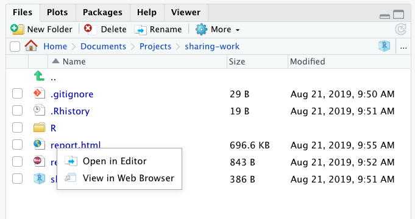
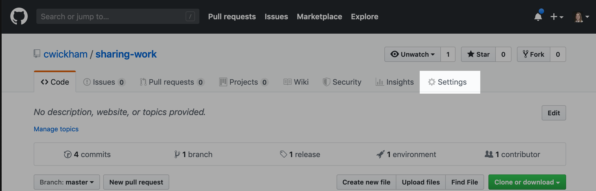
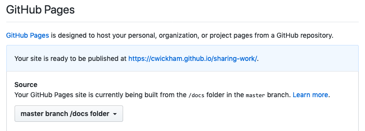
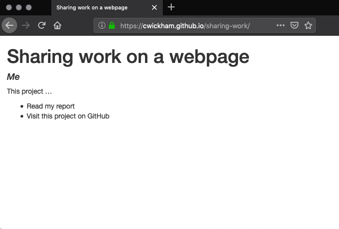

# Publishing {#r-publishing}

```{r r-publishing-setup, include=FALSE}
source(here::here("_common.R"))
```

## Questions {#r-publishing-questions}

```{r, child="questions/r-publishing.md"}
```

## Why should I share my work on the internet?

A key part of any project is communicating what you have learned.  You've already seen how to create documents to communicate your work with R Markdown, and how to host whole projects on GitHub.  This chapter is about sharing your work through a webpage on the internet. Some advantages of sharing your work on a webpage include:

* It's easy for your visitors—they just need to click on a link and see your work. They don't need to know anything about R Markdown, HTML, or GitHub.
* It provides a visually friendly and customizable landing point for people interested in your project.  You can easily point them to the GitHub repo if they want more details.
* It's easy for you to make updates and those updates are immediately available to any visitors—you don't have to re-send anyone any files.

By the end of this chapter, you'll be able to take an R Markdown document that lives on your computer and share it with the world through a link to your own webpage.

## What does it take to get a webpage online?

To understand what it takes to get a webpage online, it helps to understand roughly what happens when you point your browser at a web address.  When you point your browser at an address, for example https://merely-useful.github.io/r-publishing.html, the following things happen:

1. The URL `https://merely-useful.github.io` points to a location on another computer where the relevant files for this website reside. This computer is known as the website host or server, since it *hosts* the webpage files on its local storage drives and *serves* them to us via the internet.
2. The browser requests the file `r-publishing.html` from the host.
3. The browser reads the contents of `r-publishing.html` and displays it for you in the browser window.

In reverse order this process also describes what you need to do to get your own website online:

1. You need an HTML file that describes what people should see on your page.
2. You need to host the HTML file on a computer on the internet.
3. You need a way to associate a URL with the address of your host.

In this chapter, you'll learn a process for getting your work online that leverages what you already know—creating HTML files using R Markdown (#1 above) and how to host your work in a GitHub repository (#2).  The third step will be handled by a GitHub service called [GitHub Pages][gh-pages].  By following the conventions that GitHub Pages expects, you'll be able to make a webpage for any of your repositories available at: `http://{{your_username}}.github.io/{{repo_name}}`.

## How do I get my work on the web?

### A starting point

FIXME: revisit this later when more content is fleshed out.  Maybe there will be a repo we can rely on all learners having that we can start from.

In practice you'll probably start thinking about a website once you've already done a lot of work on a project—your project will already have some analysis documented in R Markdown, be in version control, and hosted on GitHub.  However, so that we can work with a specific example, you'll set up a project in this section that is less developed than where your project might be when you start thinking about making a website.

At the end of this section, you should have an RStudio project with an example report in `report.Rmd`.  This project should also be on GitHub at `https://github.com/{{your_username}}/sharing-work`, where `{{your_username}}` should be substituted with your GitHub username, e.g. mine is at https://github.com/cwickham/sharing-work.

Let's start by creating a new project called, `sharing-work` by running the following in the RStudio console:
```{r new-project, eval = FALSE}
usethis::create_project("sharing-work")
```

Once the project opens, set it up to use version control by running the next code in the Console:
```{r add-git, eval = FALSE}
usethis::use_git()
```

Then add it as a repository on GitHub:
```{r add-github, eval = FALSE}
usethis::use_github()
```

Then so we have a report to work with, create a new R Markdown file ("File -> New File -> R Markdown"), making sure to leave the "Default Output Format" as HTML.  Save this new file as `report.Rmd`.

Commit these changes and push your repository to GitHub.  This is our starting point.

FIXME: Would it be better to get to this point by getting learners to fork a repo, then "New project -> From version control" in RStudio? Except forking isn't in the plan for the Version Control section.

### HTML files

If you Knit `report.Rmd` you'll get `report.html`, an HTML document, because in the header of `report.Rmd`  `output` is set to `html_document`.  In the Files pane in RStudio if you click on `report.html`, you'll get two options: Open in Editor, or Display in Web Browser.



HTML is the language of webpages. If you "Open in Editor" you will see the contents of the file—it's plain text with markup tags
to indicate how web browsers should display the text.  If you "View in Web Browser" your browser will read, interpret and display the HTML for you.   When you "View in Web Browser" you may notice the address bar in your browser looks something like:
```
file:///Users/wickhamc/Documents/Projects/sharing-work/docs/report.html
```

Just as `https://` is a signal that a file resides on a remote server computer, `file://` is a signal that a file lives on your computer locally. In spite of having "web" in their name, web browsers perfectly display local files as long as they are in a suitable format,
such as HTML. However, you couldn't give this local address to someone else and expect it to work, because they don't have this file on their computer.

The HTML produced by R Markdown is completely self-contained, the browser needs no additional files to display the page as you see it now.  So, you could email the file `report.html`, and your recipients could open it their browser and see the same result.  However, our goal will be to put this HTML file on the web so you can share a link to the file instead of the file itself.  You'll start by having this file accessible at the link `https://{{your_username}}.github.io/sharing-work/report.html`, then learn how to have it displayed with the shorter link  `https://{{your_username}}.github.io/sharing-work`


### Setting up your repo to have a web page

Our goal is to get the report that is currently living in `report.html` displayed when a visitor heads to `https://{{your_username}}.github.io/sharing-work`

You'll set up GitHub Pages to look for your HTML files in the `docs` directory.  Your first step will be to make this directory and put our report file inside.  Create `docs/` with:
```{r add-docs, eval = FALSE}
usethis::use_directory("docs")
```

Move `report.Rmd` and `report.html` into this directory.  You can do this within the Files pane by checking the files and "More -> Move...".  Or you can do it with code on the Console:
```{r move-files, eval = FALSE}
file.rename("report.Rmd", "docs/report.Rmd")
file.rename("report.html", "docs/report.html")
```

Commit and push your changes.  Your repo should now have a structure like:
```
├── docs
│   ├── report.Rmd
│   └── report.html
└── sharing-work.Rproj
```

Now you will activate GitHub Pages, so that GitHub will know to deliver your files when visitors head to: `https://{{your_username}}.github.io/sharing-work`

Visit your GitHub Repository and head to the "Settings" tab.



Scroll to the "GitHub Pages" section.  Activate GitHub pages, with source set to "master branch /docs folder".  You should see a message that your site is now live at: `https://{{your_username}}.github.io/sharing-work`



Try visiting: `https://{{your_username}}.github.io/sharing-work/report.html`.  You should see your report.  Congratulations you have a webpage!

### Getting a default page to display when people visit the project site

You could send people the link, `https://{{your_username}}.github.io/sharing-work/report.html`, but it is often nicer to send them the shorter version without the file name: `https://{{your_username}}.github.io/sharing-work`.  You can try this now, but it won't work—you'll see a message in your browser like: "404- File not found".  This shorter URL points to a directory as opposed to a file.  By default, when a server receives a request for a directory, it looks for a file to display with a default name—usually `index.html`.  In your case there is no file called `index.html` so there is nothing to display.

If you would like the contents of `report.html` to be displayed as the homepage of your project, then rename `report.Rmd` to `index.Rmd`.  You'll then need to regenerate the HTML file, commit it, and push your changes.   For work that is communicated easily in one page, this would be a good option.

Alternatively, you might have a different page as the default page—one that summarizes the project and then links to other more detailed pages.  You'll see how to do this over the next few sections.  To get started create a new R Markdown document.  Delete **all** the contents of the file, and then copy and paste in the following:
```
---
title: "Sharing work on a webpage"
author: "Me"
output: html_document
---

This project ...

* Read my report
* Visit this project on GitHub

```

Save the file as `index.Rmd`, knit it, commit, and push your changes.  Your repo should now look like:
```
├── docs
│   ├── index.Rmd
│   ├── index.html
│   ├── report.Rmd
│   └── report.html
└── sharing-work.Rproj
```

Now when you visit `https://{{your_username}}.github.io/sharing-work` you should see:



Note that it might take some time for the webpage to refresh automatically and detect the new index file. You can trigger this manually by going to GitHub Pages settings and changes the source branch to something else than `docs/` and then back again.

### What does it take to get your work on a webpage?

To sum up the process above, in its most minimal form, to have a webpage at `https://{{your_username}}.github.io/{{repo_name}}`, your repo at `https://github.com/{{your_username}}/{{repo_name}}` needs to:

1. have an `index.html` file in the `docs` directory (probably generated from `index.Rmd` in the same location), and
2. have GitHub Pages activated in repository settings with source set to "master branch /docs folder".

Be aware that everything inside the `docs` folder is now public, even if your repository is private.

You might have noticed this book lives at a GitHub Pages URL without a repo name—there is nothing after the `.io` in `https://merely-useful.github.io`.  Both GitHub organizations and individuals can make use of this shorter address format (`merely-useful` is an organization rather than a user, so this is an organization site).  There are a few differences between what you've learnt so far and the process of setting up a user site without a repo name (at `https://{{your_username}}.github.io`).  First, you need to name your repository in a specific way—it must be called `{{your_username}}.github.io`.  Second, user sites don't use the `docs/` folder—you put your HTML files at the top level in the repo.  And third, you don't have to change any settings with user sites—GitHub will recognize the repo name and automatically serve it at `https://{{your_username}}.github.io`.

### Exercise: Customize `index.Rmd`

* Edit `index.Rmd` to have your name as the author.

* Knit `index.Rmd` to verify your changes, then commit and push them.

* Visit `https://{{your_username}}.github.io/sharing-work` to check the updated site.

*This is the workflow for making changes to your webpage.  Make edits locally, and Knit to check them.  Then commit and push to make those changes visible on the web.*

## How do I link to other pages, files or images?

### Linking to other pages

To create a link to another page in markdown file you use the syntax:
```markdown
[text to display](url)
```
Once Knit to HTML, only `text to display` will be visible, and clicking on the text will take a viewer to `url`.  For example, to add a link to my GitHub repo I might add the following line to `index.Rmd`:
```markdown
Visit [my github repo](https://www.github.com/cwickham/sharing-work)
```

Which when Knit to HTML renders like:

> Visit [my github repo](https://www.github.com/cwickham/sharing-work)

This is an example of an **absolute** URL. Just like when you specify file paths on your own computer, URLs can be both absolute and relative.  An absolute URL describes a file location starting from and including the domain name.  For instance, the absolute URL that points to `report.html` in my repo is `https://cwickham.github.io/sharing-work/report.html`.

Relative URLs are *relative* to the current HTML file.  So, for instance if you are viewing `https://cwickham.github.io/sharing-work/index.html`, a relative link to my `report.html` would be `report.html` since this file is at the same level as `index.html` in my website structure.  For pages created using this GitHub Pages workflow, your website structure is the same as the file structure in your `docs/` folder.

To add a link to `report.html` in `index.Rmd` I would add a line like:

```markdown
See the [full report](report.html)
```

You should use relative URLs to reference any of **your** files (i.e. those in `docs/`). That way if you ever rename your repository, move it, or use a different hosting platform, your links will all work without changes.  You must use absolute links for files that reside elsewhere on the internet.

### Exercise: Relative links

Imagine your `docs/` folder had the following structure:

```
├── docs
│   ├── index.Rmd
│   ├── index.html
│   ├── diagrams
│   │   └── workflow.png
|   ├── reports
|   │   ├── jan.Rmd
|   │   ├── jan.html
|   │   ├── feb.Rmd
|   │   └── feb.html
└── sharing-work.Rproj
```

Using a relative URL, how would you refer to:

* `jan.html` from `index.html`?
* `feb.html` from `jan.html`?
* `workflow.png` from `index.html`?

### Exercise: Add links to `index.html`

Add to `index.Rmd`:

* a link to `report.html` using a relative link, and
* a link your GitHub repository using an absolute link.

### Linking to sections within a page

URLs can also refer to places inside the current page, most usually to another section.  In R Markdown you've seen how to create headings using `#`.  For example, an Appendix subsection might be:
```markdown
## Appendix
```

If we want to link to this section from elsewhere, you prefix the section name with a single `#` in the URL.  For example, if this section is in `report.Rmd` and you want to link to it elsewhere in `report.Rmd`, you could use:
```markdown
See more details in the [appendix](#appendix)
```

The URL `#appendix` is interpreted as the heading with ID `appendix` in the current page.  R Markdown creates IDs for all sections (and subsections) automatically, by converting to lower case and replacing spaces with dashes (`-`).  But, you can explicitly set IDs too, by adding the ID with the `#` inside curly braces after the section heading.  For instance you might prefer the shorter `appen` ID.  You need to set it where the heading occurs:
```markdown
## Appendix {#appen}
```

Then you can link to it using this shorter ID elsewhere:
```markdown
See more details in the [appendix](#appen)
```

You can also use this strategy to link to sections in other pages by including the relative URL first.  For instance, to refer to this "Appendix" section from `index.html` you could include in `index.Rmd`:
```markdown
Some gory details of the analysis can also be found in the [Appendix of the report](report.html#appen)
```

### Exercise: Add and link to a section in `report.Rmd`

Add a new section to `report.Rmd` and include a link to it in `index.Rmd`.  You'll need to Knit both `report.Rmd` and `index.Rmd`, and commit and push the HTML files to check your work.

### Including images

Most of your images will likely be plots generated by R chunks in your R Markdown files and thus automatically included in the knitted HTML.  If you want to display other images, you use the same syntax you saw in the [Markdown section of the Reproducibility chapter](#r-reproducibility-markdown) chapter.  That is, in your R Markdown file you'll include the image with something like:

```markdown

```

However, the `path/to/image/file.png` should be a relative URL pointing at an image in your `docs/` directory.  For example, if you had an image, `me.png`, inside an `images` directory inside your `docs` folder:

```
├── docs
│   ├── index.Rmd
│   ├── index.html
│   ├── images
│   │   └── me.png
│   ├── report.Rmd
│   └── report.html
└── sharing-work.Rproj
```

You could include it in `index.html` by adding to `index.Rmd` the line:
```markdown

```

Notice the syntax is very similar to adding a link to `me.png`:
```markdown
[A picture of me](images/me.png)
```
*Including* the image displays the image inside at the appropriate place in the current page, *linking* to the image requires a viewer to click the link to see the image.

Your image will be included at full size, but you might find it too large.  You can additionally specify some attributes for the image in curly braces immediately following the link.  For instance, use the `width` attribute to set the image width, either in pixels:
```markdown
[A picture of me](images/me.png){width=50} # default unit is px
```
Or as a percentage:
```markdown
[A picture of me](images/me.png){width=50%}
```

### Exercise: Add an image to `index.html`

Include an image in your `index.Rmd`.  *(If you need an image to include you could always [build your own version of an Octocat][gh-myoctocat], GitHub's mascot).*

Don't forget, you'll need to commit both your re-Knit `index.html` and your image.

## Exercise: Add a website to an existing project

Add a website to one of your existing project repositories.  You'll need to complete the following steps:

* Create a `docs/` directory in your project.
* Add an `index.Rmd` R Markdown document to the `docs/` folder and knit it to HTML to produce `index.html`.
* Commit these changes to git, and push to GitHub.
* Activate GitHub Pages in the repository settings with source set to "master branch /docs folder".
* Visit the site to check it is working.
