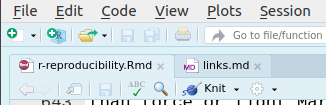
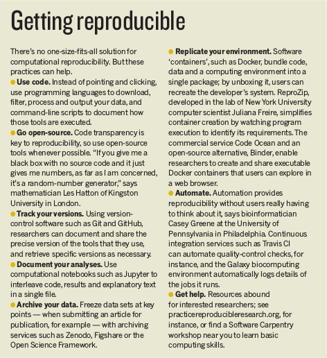

# Reproducibility {#r-reproducibility}

```{r re-reproducibility-setup, include=FALSE}
source(here::here("_common.R"))
```

There are several key cornerstones for doing rigorous and sound scientific
research, two of which are reproducibility and replicability [@Patil2016]. Replicability is
when a study is repeated by other independent research groups. [Reproducibility][sci-reproducibility]
is when, given the same data and the same analytical/computational steps, a
scientific result can be verified. Both of these concepts are surprisingly
difficult to achieve.

This course is about data analysis, so we'll be focusing solely on reproducibility
rather than replicability. At present, there is little effort in science for
having research be reproducible, likely due in many ways to a lack of training
and awareness. Being reproducible isn't just about doing better science, it
can also:

1. Make you much more efficient and productive, as you spend less time between
coding and putting your results in the document.
1. Make you more confident in your results, since what you report and show as
figures or tables will be exactly what you get from your analysis. No copying
and pasting required!

There are many aspects to reproducibility, such as:

- Organized files and folder, preferably based on a standard or conventional structure.
- Understandable and readable code that is documented and descriptive.
- Results from analyses are identical to results presented in scientific output (e.g. article, poster, slides).
- Results from analyses are identical when code is executed on other machines (results aren't dependent on one computer).
- Explicit description or instruction on the order that code and scripts need to be executed.

We'll cover the first three items in this course.

## Project organization {#r-reproducibility-projects}

First off, what exactly does "project" mean? That depends a bit on the group,
individual, or situation, but for our purposes, a "project" is anything related
to one or more completed scientific "products" (e.g. poster, slides, manuscript,
package, teaching material) related to a specific question or goal. This could
be "one manuscript publication and associated conference presentations" per project.
Confining a project to one "scientific output" facilitates keeping the project reproducible
is kept reproducible, all files will relate to that "output", and can be easily
archived once the manuscript has been published. However, this definition could
be different depending on your own situation and goals.

The ability to read, understand, modify, and write simple pieces of code is an
essential skill for modern data analysis tasks and projects. Here we introduce
you to some of the best practices one should have while writing their code.
, many of which were taken from published "best practices" articles
[@Nobl2009; @Tasc2017; @Wils2017].

- Organise all R scripts and files in a single parent directory using a common
and consistent folder and file structure.
- Use [version control][version-control] to track changes to files.
- Make raw data "read-only" (don't edit it directly) and use code to show what
was done.
- Write and describe code for people to read by being descriptive and using a
[style guide][r-style-guide].
- Think of code as part of your research product: Write for an audience
or other reader.
- Create functions to avoid repetition.
- Whenever possible, use code to create output (figures, tables) rather than
manualling creating or editing them.

Managing your projects in a reproducible fashion doesn't just make your science
reproducible, it also makes your life easier! RStudio is here to help us with
that by using [R Projects][rstudio-r-projects]. RStudio projects make it
straightforward to divide your work into multiple contexts, each with their own
working directory, workspace, history, and source documents.

It is strongly recommended that you store *all* the necessary files that will be
used in your code in the **same parent directory**. You can then use
relative file paths to access them (we'll talk about file paths below). This
makes the directory and R Project a "product" or "bundle/package". Like a tiny
machine, that needs to have all its parts in the same place.

### Creating your first project

There are many ways one could organise a project folder. We'll set up a project
directory folder using the
[prodigenr](http://prodigenr.lukewjohnston.com) package:

```r
# prodigenr::setup_project("ProjectName")
prodigenr::setup_project("learningr")
```

(You can also create a new project in RStudio by using "File -> New Project -> "Scientific Analysis Project using prodigenr".)

When we use the `::` colon here, we are telling R "use setup_project function from the prodigenr package". This function will then create the following
folders and files:

```
learningr
├── R
│   ├── README.md
│   ├── fetch_data.R
│   └── setup.R
├── data
│   └── README.md
├── doc
│   └── README.md
├── .gitignore
├── DESCRIPTION
├── learningr.Rproj
└── README.md
```

This forces a specific, and consistent, folder structure to all your work. Think
of this like the "introduction", "methods", "results", and "discussion" sections
of your paper. Each project is then like a single manuscript or report, that
contains everything relevant to that specific project. There is a lot of
power in something as simple as a consistent structure. Projects are used to
make life easier. Once a project is opened within RStudio the following actions
are taken:

- A new R session (process) is started.
- The current working directory is set to the project directory.
- RStudio project options are loaded.

The README in each folder explains a bit about what should be placed there. But
briefly:

1. Documents like manuscripts, abstracts, and exploration type documents should
be put in the `doc/` directory (including [R Markdown][r-markdown] files which
we will cover [later](#r-markdown)).
1. Data, raw data, and metadata should be in either the `data/` directory or
in `data-raw/` for the raw data.
1. All R files and code should be in the `R/` directory.
1. Name all new files to reflect their content or function. Follow the tidyverse
[style guide for file naming][r-style-guide-files].

Note the `DESCRIPTION` file. This is used as metadata about the project and is
useful when working on R projects. For any project, it is **highly recommended**
to use [version control]. We'll be covering version control in more detail
[later](#version-control) in the course.

### Exercise: Better file naming

Look at the list of file names below. Which file names are good names and which
shouldn't you use?

```
fit models.R
fit-models.R
foo.r
stuff.r
get_data.R
Manuscript version 10.docx
manuscript.docx
new version of analysis.R
trying.something.here.R
plotting-regression.R
utility_functions.R
code.R
```

### Should you keep your data under version control?

We have a `data/` folder for a reason. But you might not want to keep the data
under version control, for several reasons:

1. It's a large dataset (tens or more Mb in file size)
2. There are sensitive and/or personally-identifying information in the data

As a rule of thumb, if you can send the data by an email attachment, you could
probably put it into Git. Unless there is sensitive or personal data, then don't.
If it isn't kept under version control, make sure you include a reference to how
or where you got the data, either as an R script showing the code you used to
import/clean/download it or described in the `README.md` file.

## Reusability {#r-reproducibility-reusability}

Part of reproducibility is also making sure your scripts and file organization is
"reusable" meaning that others (or yourself) can run it again. So, for instance,
making sure to use "relative file paths" compared to "absolute file paths"
(we'll cover these in a bit). Or indicating which other R packages your code
depends on. So here we'll cover how to make sure your scripts and project files
are reusable.

### Keeping a clean slate

When you finish writing your R code for the day and close the session, you probably
will be asked about saving your session. What this does is everything kept in the
[environment][environment] (e.g. all objects, functions, or datasets you created and used
during the session) get saved to an `.RData` file. Then, the next time you open up
your R session, R will see this `.RData` file and load everything in that file.
Everything you did previously will be loaded into your environment. This seems like
a good thing... but it's not. Imagine eating your dinner on a really dirty plate...
that's not pleasant right? Loading a previous session is like that dirty plate.

So, to make sure you always use a clean slate, we'll run a handy function from
the [usethis][usethis] package to stop R from saving and loading this `.RData`
file, ensuring you have a clean working environment. You only need to run this function
once, as it will set the appropriate RStudio settings for you.

```r
usethis::use_blank_slate()
```

We'll use the usethis package more throughout this chapter and others, as it provides
several very useful functions when working with projects.

### Packages, data, and file paths

A major strength of R is in its ability for others to easily create packages
that simplify doing complex tasks (e.g. creating figures with the
[ggplot2][ggplot2] package)
and for anyone to easily install and use that package[^base-r].
You load a package by writing:

[^base-r]: You may encounter some who say you shouldn't rely on packages and
to only use base R functions. However, this is seriously bad advice since the
ecosystem of R packages can greatly simplify your life doing data analysis.
Plus, packages greatly expand and enhance the capability of R, so make use of
packages! If someone invents a wheel, why wouldn't you use it?

```r
library(tidyverse)
```

Working with multiple R scripts and files, it quickly gets tedious to always
write out each library function at the top of each script. A better way of
managing this is to create a new file, keep all package loading code in that
file, and sourcing that file in each R script. So, to create a new R file
in the `R/` folder, we'll use this `use_r()` function from the usethis package:

```r
usethis::use_r("package-loading")
```

This creates a file called `package-loading.R` in the `R/` folder. In the
`package-loading.R` file, add this code to it.

```r
library(tidyverse)
```

Then in other R scripts in the `R/`, include this code at the top the script:

```r
source(here::here("R/package-loading.R"))
```

The [here][r-here-pkg] package uses a function
called `here()` that makes it easier to manage file paths. What is a file path
and why is this necessary? A file path is the list of folders a file is found
in. For instance, your resume may be found in
`/Users/Documents/personal_things/resume.docx`. The problem with file paths in R
is that when you run a script interactively (e.g. what we do in class and
normally), the file path is located at the Project level (where the `.Rproj`
file is found). You can see the file path by looking at the top of the
"Console".

But! When you `source()` an R script, it may likely run *in the
folder it is saved in*, e.g. in the `R/` folder. So your file path
`R/packages-loading.R` won't work because there isn't a folder called R in the
`R/` folder. Often people use the function `setwd()`, but this is *never* a good
idea since using it makes your script *runnable only on your computer*... which
makes it no longer reproducible. We use the `here()` function to tell R to go
to the project root (where the `.Rproj` file is found) and then use the file
path from that point. This simple function can make your work more reproducible
and easier for you to use later on.

We also use the `here()` function when we import a dataset or save a dataset.
So, let's load in the NYC Dog License dataset. First, save the CSV in the
`data/` folder. Then create a new R file:

```r
usethis::use_r("load-data")
```

And write these lines in the file:

```{r load-data-example, eval=FALSE}
source(here::here("R/package-loading.R"))
dog_license <- read_csv(here::here("data/nyc-dog-licenses.csv"))
head(dog_license)
```

That is how we will load data in from now on.

Here are a few other tips for keeping your code reusable:

- When encountering a difficult problem, try
to find R packages or functions that do your problem for you[^only-use-base].
- Split up your analyses steps into individual files (e.g. "model" file, "plot"
file). Then `source` those files as needed or save the output in `data/` to use
it in other files.
- Try not to have R scripts be too long (e.g. more than 500 lines of code). Keep
script sizes as small as necessary and as specific as possible (have a single
purpose). A script should have an end goal.


[^only-use-base]: You may hear some people say "oh, don't bother with R
packages, do everything in base R"... don't listen to them. Do you build a
computer from scratch everytime you want to do any type of work? Or a car when
you want to drive somewhere? No, you don't. Make use of other people's hard work
to make tools that simplify your life.

## Readability {#r-reproducibility-readability}

There are two reasons we write code: to instruct the computer to do something and
to record the steps we took to get a particular result for us or others to
understand. For computers, *how* or *what* you write doesn't matter, as long as
the code is correct. Computers don't need to *understand* the code. But humans
do need to understand it. We need clear language and explicit meaning in order
to understand what is going on. Humans write code, humans read code, and humans
must maintain it and fix any errors. So, what you write and how you write it
is extremely important.

Like natural human languages, R has a relaxed approached to how R code is written.
This has some nice advantages, but also some major disadvantages, notably that
writing styles can be quite different across the world or even within one's own
code. So, it's important to stick to some guidelines, for instance, as laid out
by the tidyverse [style guide][r-style-guide]. Some other tips include:

- Write your code assuming other people will be reading it.
- Stick to a *[style guide][r-style-guide]*. (We're repeating this because it's
really important!)
- Use full and descriptive words when typing and creating objects.
- Use white space to separate concepts (empty lines between them, use spaces,
and/or tabs).
- Use RStudio R Script Sections (`"Code->Insert Section"` or `Ctrl-Shift-R`) to
separate content in scripts.

Even though R doesn't care about naming, spacing, and indenting, it really
matters how your code looks. Coding is just like writing. Even though you may go
through a brainstorming note-taking stage of writing, you eventually need to
write correctly so others can understand, *and read*, what you are trying to
say. Brainstorming and exploratory work is fine, but eventually you need to
write code that will be legible. That's why using a [style guide][r-style-guide]
is really important.

### Exercise: Make the code more readable

Using the [style guide][r-style-guide] found in the link, try to make these code
more readable. Edit the code so it follows the correct style and so it is easier to
understand and read. You don't need to understand what the code does, just
follow the guide.

```{r r-repro-exercise-readable-code, eval=FALSE}
# Object names
DayOne
dayone
T <- FALSE
c <- 9
mean <- function(x) sum(x)

# Spacing
x[,1]
x[ ,1]
x[ , 1]
mean (x, na.rm = TRUE)
mean( x, na.rm = TRUE )
function (x) {}
function(x){}
height<-feet*12+inches
mean(x, na.rm=10)
sqrt(x ^ 2 + y ^ 2)
df $ z
x <- 1 : 10

# Indenting
if (y < 0 && debug)
message("Y is negative")
```

FIXME: The below "details" will need to be dealt with since PDF doesn't allow this
FIXME: Maybe move to a solutions section at the end of chapter?

<details><summary><strong>Click for a possible solution</strong></summary>
<p>

The old code is in comments and the better code is below it.

```{r r-repro-exercise-readable-code-solution, eval=FALSE}
# Object names

# Should be camel case
# DayOne
day_one
# dayone
day_one

# Should not over write existing function names
# T = TRUE, so don't name anything T
# T <- FALSE
false <- FALSE
# c is a function name already. Plus c is not descriptive
# c <- 9
number_value <- 9
# mean is a function, plus does not describe the function which is sum
# mean <- function(x) sum(x)
sum_vector <- function(x) sum(x)

# Spacing
# Commas should be in correct place
# x[,1]
# x[ ,1]
# x[ , 1]
x[, 1]
# Spaces should be in correct place
# mean (x, na.rm = TRUE)
# mean( x, na.rm = TRUE )
mean(x, na.rm = TRUE)
# function (x) {}
# function(x){}
function(x) {}
# height<-feet*12+inches
height <- feet * 12 + inches
# mean(x, na.rm=10)
mean(x, na.rm = 10)
# sqrt(x ^ 2 + y ^ 2)
sqrt(x^2 + y^2)
# df $ z
df$z
# x <- 1 : 10
x <- 1:10

# Indenting should be done after if, for, else functions
# if (y < 0 && debug)
# message("Y is negative")
if (y < 0 && debug)
    message("Y is negative")
```

</p>
</details>

### Automatic styling with styler

You may have organised the exercise by hand, but it's possible to do it
automatically. The tidyverse [style guide][r-style-guide] has been implemented
into the [styler][styler-pkg] package to automate the process of following the
guide by directly re-styling selected code. The styler snippets can be found in
the Addins function in the RStudio "Addins" menu after you have installed it.

RStudio also has its own automatic styling ability, through the menu item `"Code ->
Reformat Code"` (or `Ctrl-Shift-A`). Try both methods of styling on the exercise
code above. There are slight differences in how each method works and they both
aren't always perfect. For now, let's stick with using the styler package. The
styler functions work on R code within both `.R` script files as well as R code
within `.Rmd` documents, which we will cover later in this lesson.

There are several styler RStudio addins, but we'll focus on the two:

- `"Style selection"`: Highlight text and click this button to reformat the code.
- `"Style active file"`: Code in the `.R` or `.Rmd` file you have open and
visible in RStudio will be reformatted when you click this button.

There are two other styler functions that are also useful:

- `styler::style_file("path/to/filename")`: Styles the whole file as indicated by the
file path in the first argument. Can be either an `.R` or `.Rmd` file.
- `styler::style_dir("directoryname")`: Styles all files in the indicated directory
in the first argument.

Let's try the `styler::style_file()` function out. Inside a file called
`non-styled-code.R`, it has:

```{r r-repro-non-styled-code, eval=FALSE}
# Spacing
x[,1]
mean (x, na.rm = TRUE)
function (x) {}
height<-feet*12+inches
sqrt(x ^ 2 + y ^ 2)
df $ z
x <- 1 : 10

# Indenting
if (y < 0 && debug)
message("Y is negative")
```

Then we run:

```{r r-repro-use-styler-file, eval=FALSE}
styler::style_file("testing-styler.R")
```

```
Styling  1  files:
 testing-styler.R ℹ
────────────────────────────────────────
Status	Count	Legend
✔ 	0	File unchanged.
ℹ 	1	File changed.
✖ 	0	Styling threw an error.
────────────────────────────────────────
Please review the changes carefully!
```

Which changes the file to be styled!

```{r r-repro-styled-code, eval=FALSE}
# Spacing
x[, 1]
mean(x, na.rm = TRUE)
function(x) {}
height <- feet * 12 + inches
sqrt(x^2 + y^2)
df$ z
x <- 1:10

# Indenting
if (y < 0 && debug) {
  message("Y is negative")
}
```

This is more or less everything that the styler package does.

### Exercise: Use styler to fix code formatting

Use the styler package function on the code from the previous exercise by either
running `styler::style_file()` or with the `"Style selection"` addin when
highlighting the code.

## Integrating text, code, and results {#r-reproducibility-markdown}

The most obvious demonstration of reproducibility is when the results obtained
from executing the analysis code (by an independent entity) are indentical to
the results presented in the scientific output such as in an article. When there
is agreement between these two, reproducibility has been more or less acheived.
In R, there are tools available to *completely* ensure that this happens by
directly inserting the results from the code *into the scientific ouput*. This is
done by using [R Markdown][r-markdown], which interweaves R code with text.
So instead of, for example, manually inserting a figure, you write R code within
the document to insert the figure for you! Using [R Markdown][r-markdown] can
save so much time and get your work that much closer to being reproducible.

There are many other advantages to using R Markdown. From the single R Markdown
format you can use it to create manuscripts, posters, slides, websites, books,
and many more from simply using R Markdown. In fact, this book was written using
R Markdown. As a bonus, switching between citation formats or Word templates for
different journals is easier than doing it with Word.

### Markdown

R Markdown uses, well, [Markdown][markdown] as the format to convert to multiple
document types. Fun fact: This website is built based on Markdown! While there
are many "flavours" of Markdown that have been developed over the years, R
Markdown uses the [Pandoc][pandoc-markdown] version. Pandoc is a combination of
pan which is Latin for "all" and doc which means document.

Markdown is a "markup language" meaning that special characters mean certain
things, which we will cover below.

To format text, such as to bold or make a list, you use the special characters.
You write Markdown as plain text (like R code), so you don't need any special
software (like you do with Word documents). Most features needed for writing a
scientific document are available in Markdown, but not all. *Tip*: Try to fit
your writing and document creation around what Markdown can acheive, rather
than force or fight Markdown to do something it wasn't designed to do.

All right, let's create and save an R Markdown file. In RStudio, go to `File ->
New File -> R Markdown`. A dialog box will pop up. In the "Title" section,
type in `Reproducible documents` and in the "Author" section type in your name.
Choose the HTML output format. Save this file as `learning-rmarkdown.Rmd` in the
`doc/` folder.

Inside the file, there is a bunch of text that shows some basic formatting you
can use for writing Markdown. For now, delete everything *except* the top part
of the file (the part surrounded by `---`). This part is called the YAML header,
which we will cover more a bit later. Try converting the file to HTML by hitting
the "Knit" button at the top or by typing out `Ctrl-Shift-K`.



#### Headers

Creating headers (like chapters or sections) is indicated by using one or more `#`
at the beginning of a line, prefixing some text:

```markdown
# Header level 1

Paragraph.

## Header level 2

Paragraph.

### Header level 3

Paragraph.
```

This creates the section headers as seen directly above ("Headers") or below
("Text formatting"). The header text *must* be on one line, otherwise the next
line is interpreted as paragraph text.

See how it looks by "Knitting" the document ("Knit" button or `Ctrl-Shift-K`).

#### Text formatting

To format text individually, surround the text with the special characters, as
shown here:

- `**bold**` gives **bold**.
- `*italics*` gives *italics*.
- `super^script^` gives super^script^.
- `sub~script~` gives sub~script~.

What if you want to use the special character as simple text? Prefix it with an `\`,
so `\*` becomes \*, `\^` becomes \^, and `\~` becomes \~.

#### Lists

To create an unnumbered list, do:

```markdown

- item 1
- item 2
- item 3

```

which gives...

- item 1
- item 2
- item 3

Notice the empty lines above and below the line, those are important. To create
a numbered list, do:

```markdown

1. item 1
2. item 2
3. item 3

```

which gives...

1. item 1
2. item 2
3. item 3

See how it looks by "Knitting" the document ("Knit" button or `Ctrl-Shift-K`).

#### Blockquotes

Sometimes (probably not too commonly), you may need to quote someone by using
"blockquotes". To do that, do:

```markdown
> Blockquote
```

which gives...

> Blockquote

Blockquotes can be as many lines as you want. To stop a paragraph from being in
the blockquote, separate the text with an empty line:

```markdown
> Bockquote paragraph

Regular paragraph
```

#### Adding footnotes

Footnotes can be added by using `[^some-text-label]`, such as:

```markdown
Footnote[^1]

[^1]: Footnote content.
```

which gives...

Footnote[^1]

[^1]: Footnote content.

So you can write some text, add some footnotes within, and include the footnote
content right below the paragraph:

```markdown
Paragraph text[^1], with some more text[^reference].

[^1]: This is the first footnote.
[^reference]: This is the next footnote.

More paragraphs.
```

Notice the empty lines in between. The footnote should also be on one line, though
it isn't strictly necessary. See how it looks by "Knitting" the document ("Knit"
button or `Ctrl-Shift-K`).

#### Inserting pictures, images, or figures

You can include externally created (i.e. not by an R code chunk, discussed later
on) png, jpeg, or pdf image file by adding (:

```markdown

```

So something like this:

```markdown

```

which gives...

](figures/r-reproducibility/code-sharing-steps.png)

*Tip*: Can also include links to images from the Internet, as a URL link.

If you want to modify the width or sizing, append something like `{width=##%}` to
the end of the image insertion:

```markdown
{width=50%}
```

which gives...

{width=50%}

#### Adding links to websites

And a link can be linked in the following format:

```markdown
[Link to GitHub](https://github.com).
```

gives...

[Link to GitHub](https://github.com).

The above form is great for one time use, but what if you want to use the same link
again later on? Use this form then:

```markdown
Use multiple [links] in your document. The same [links] can be used again.

[links]: https://github.com
```

which gives...

Use multiple [links] in your document. The same [links] can be used again.

[links]: https://github.com

#### Inserting (simple) tables

You can insert tables with Markdown too. We wouldn't recommend doing it for
complicated tables though, as it can get tedious fast! (A recommended approach
for more complex or bigger tables is to make the table contents as a data frame
in R first and then use the `knitr::kable()` function to create the table, as
we'll cover in the R Markdown section below). You can even include Markdown
text formatting inside the table:

```markdown
|   | Fun | Serious |
|:--|--:|:--:|
| **Happy** | 1234 | 5678 |
| **Sad** | 123 | 456 |
```

which gives...

|   | Fun | Serious |
|:--|--:|:--:|
| **Happy** | 1234 | 5678 |
| **Sad** | 123 | 456 |

The `|--:|` or `|:--|` tell the table to right-align or left-align,
respectively, the values in the table column. Center-align is `|:--:|`.
See how it looks by "Knitting" the document ("Knit" button or `Ctrl-Shift-K`).

#### Exercise: Try to re-create a document using Markdown

1. Open [this link](https://htmlpreview.github.io/?https://github.com/merely-useful/merely-useful.github.io/blob/book/includes/r-reproducibility/exercise.html).
This is a HTML file that has been created by using
Markdown formatting.
2. Create a new R Markdown file, with output type "HTML", and save it as
`mimic-html-file.Rmd`.
3. Delete all the automatically added text except the top part Inside the R Markdown file
4. Write text using Markdown formatting so that you
can create a `html_document` that looks exactly like the linked file.
4. Knit the R Markdown document. Confirm that your version looks the same as the above version.

### R Markdown

[R Markdown][r-markdown] is an extension of Markdown that weaves together R code
with Markdown formatted text all together in a single document. Output from the
R code gets inserted directly into the document for a seamless integration of
document writing and analysis reporting.

#### YAML header/metadata

Most Markdown documents (especially for R Markdown) include [YAML][yaml] metadata at
the top of the document, surrounded by `---`. YAML is a data format, like CSV,
that contains the metadata and various options that R Markdown uses for the
entire document. Data in YAML is stored in the form `variable: value`. For
instance, `title` or `author` is paired with their respective "values" and then
used by Markdown when creating the document. Other options are also included
here, such as what the converted output document should be, such as Word. There
are many more output formats to choose from (e.g. slides, websites, books). The
YAML header looks something like this:

```yaml
---
title: "Document title"
author: Your Name
output: html_document
---
```

Here, there are three variable-value pairings: `title`, `author`, and `output`.
In the `output` variable, the R Markdown function `html_document` is given so that
the output document format is converted to HTML. There are also `word_document`
and `pdf_document` settings. For now, we'll focus on the `html_document` output.
Usually when you create the R Markdown file, this YAML header gets added
automatically. There are additional options you can set in the output field,
which we will cover later on.

#### Using R code chunks

R Markdown's primary function is to allow combining text and R code in the same
document, which is incredibly powerful and useful! All R code chunks have the
appearance:

````markdown
`r ''````{r chunk-label-name, chunk.option="...", chunk.option=...}
...R code...
`r ''````
````

Notice that chunk options need to be on the same line (one single line). Any
R code in the code chunk gets evaluated and any output gets inserted into the
document. So if the code prints to the console, it will get inserted into the
document.

The `r` tells R Markdown to run R on the code chunk, while the [chunk label][chunk-label]
differentiates the chunk from other chunks. Using a chunk label also helps navigate
a document when you use RStudio's "Document outline" (`Code -> Show Document Outline`).
It also does a few other things.

**Note**: Standard practice is that code [chunk labels][chunk-label] should be
named without `_`, spaces, or `.` and instead should be one word or be separated
by `-`.

Let's load in some packages and data:

````markdown
`r ''````{r setup}
library(tidyverse)
co2_data <- read_csv(here::here("data/co2.csv")) %>%
  filter(co2_standard > 0)
`r ''````
````

```{r setup, include=FALSE}
library(tidyverse)
co2_data <- read_csv(here::here("data/co2.csv")) %>%
  filter(co2_standard > 0)
```

When running your code chunks interactively as you develop and write your document,
R Markdown will look for a code chunk labeled `setup` to run first (for
instance, to load all packages used in a document). Hence we name this chunk "setup".

#### Inserting figures

One of the most obvious benefits to using R Markdown is to automatically insert
a plot. To do that we do:

````markdown
`r ''````{r co2-time-plot}
ggplot(co2_data, aes(x = year, y = co2_standard)) +
    geom_point()
`r ''````
````

```{r co2-time-plot, echo=FALSE}
ggplot(co2_data, aes(x = year, y = co2_standard)) +
    geom_point()
```

What if we want to include the plot but not the code? Easy! Set the chunk option
`echo` to `FALSE`:

````markdown
`r ''````{r co2-time-plot, echo=FALSE}
ggplot(co2_data, aes(x = year, y = co2_standard)) +
    geom_point()
`r ''````
````

Or what if you don't want R to run the code chunk, but still show the code? Set
the chunk option `eval` (for evaluate) to `FALSE`:

````markdown
`r ''````{r co2-time-plot, eval=FALSE}
ggplot(co2_data, aes(x = year, y = co2_standard)) +
    geom_point()
`r ''````
````

Since we have a figure, we can change some width, height, and alignment options,
as well as add a caption with the `fig.width`, `fig.height`, `fig.align`, and `fig.cap`
(respectively):

````markdown
`r ''````{r co2-time-plot, fig.cap="Add your figure title here.", fig.height=4, fig.width=7}
ggplot(co2_data, aes(x = year, y = co2_standard)) +
    geom_point()
`r ''````
````

```{r co2-time-plot-1, fig.cap="Add your figure title here.", fig.height=4, fig.width=7}
ggplot(co2_data, aes(x = year, y = co2_standard)) +
    geom_point()
```

What if we want to first run some code before running the plot, but don't want to
include the output of the other code? Make sure that the output doesn't "print".
So letting R evaluate both dataframe and plot, the code chunk will output and
insert both into the knitted document.

````markdown
`r ''````{r co2-time-plot-after-2000-1, fig.cap="Add your figure title here.", fig.height=4, fig.width=7}
co2_after_2000 <- co2_data %>%
    filter(year >= 2000)

# Print dataframe
co2_after_2000

# Print plot
ggplot(co2_after_2000, aes(x = year, y = co2_standard)) +
    geom_point()
`r ''````
````

```{r co2-time-plot-after-2000-1, fig.cap="Add your figure title here.", fig.height=4, fig.width=7, echo=FALSE}
co2_after_2000 <- co2_data %>%
    filter(year >= 2000)

# Print dataframe
co2_after_2000

# Print plot
ggplot(co2_after_2000, aes(x = year, y = co2_standard)) +
    geom_point()
```

Compare to this next code chunk, which will only output ("print") the plot. See
how we don't include code that would send anything to the console to be
"printed"? Only things that get "printed" will be included in the R Markdown output
document. Also notice how we renamed the chunk label? In R Markdown you can't
have duplicate code chunk labels.

````markdown
`r ''````{r co2-time-plot-after-2000-2, fig.cap="Add your figure title here.", fig.height=4, fig.width=7}
co2_after_2000 <- co2_data %>%
    filter(year >= 2000)

# Print plot
ggplot(co2_after_2000, aes(x = year, y = co2_standard)) +
    geom_point()
`r ''````
````

```{r co2-time-plot-after-2000-2, fig.cap="Add your figure title here.", fig.height=4, fig.width=7, echo=FALSE}
co2_after_2000 <- co2_data %>%
    filter(year >= 2000)

# Print plot
ggplot(co2_after_2000, aes(x = year, y = co2_standard)) +
    geom_point()
```

#### Exercise: Add some figures to a R Markdown document

1. Create a new R Markdown file ("File -> New File -> R Markdown"), providing
the title, author name (your name), and setting the output to HTML.
2. Save the file as `using-rmarkdown.Rmd` in the `doc/` folder.
3. Delete all text *except* the YAML header.
4. Create an R code chunk and call the label "setup". Write code so the packages
and data are loaded.
5. Create another code chunk and call it "plot-licenses-by-year". Write R code
to create a point plot (`geom_point()`) of the year on the `x` axis and number
of licenses on the `y` axis.
6. Knit the document and see what the output looks like.
7. Change the theme of the plot to another builtin theme (*hint*: themes start
with `theme_`).

#### Using R code chunks to insert tables

You can also create tables by using the `kable()` function from the knitr package.
Let's create a table of the mean CO~2~ concentration over the years at each
monthly period for each station.

````markdown
`r ''````{r mean-co2-table}
co2_data %>%
    select(station, month, co2_standard) %>%
    group_by(station, month) %>%
    summarise(MeanCO2 = round(mean(co2_standard, na.rm = TRUE), 2)) %>%
    spread(station, MeanCO2) %>%
    knitr::kable(caption = "Table caption here.")
`r ''````
````

```{r mean-co2-table, echo=FALSE}
co2_data %>%
    select(station, month, co2_standard) %>%
    group_by(station, month) %>%
    summarise(MeanCO2 = round(mean(co2_standard, na.rm = TRUE), 2)) %>%
    spread(station, MeanCO2) %>%
    knitr::kable(caption = "Table caption here.")
```

#### Inline R code

Often you might have results inside the text you are writing. Here you can
include R code within the text so that the results are inserted directly
into the document. It looks like:

> The mean of CO~2~ is &#96;r round(mean(co2_data$co2_standard, na.rm = TRUE), 2)&#96;.

Which gives...

> The mean of CO~2~ is ` round(mean(co2_data$co2_standard, na.rm = TRUE), 2)`.

Keep in mind that inline R code can *only* insert a single number or character
value, nothing more.

#### Citing literature with R Markdown

No scientific writing is complete without being able to include references. If
you want to insert a citation, use the Markdown key `[@Cone2016]`, which will
look like [@Cone2016]. The text `Cone2016` is the key that the bibliography
manager uses to identify a specific reference. Adding more references is done
by separating by a `;`, so like `[@AuthorYear; @Author2Year; @Author3Year]`. The
resulting citation reference will be inserted at the bottom of the document. To
get the bibliography to work, you'll also need to add a line to the YAML header
like this:

```yaml
---
title: "My report"
author: "Me!"
bibliography: my_references.bib
---
```

The `my_references.bib` is a `.bib` file found in the same folder as the `.Rmd`
file. So in our case, the `.bib` file is in the `doc/` folder. You can also use
other bibliography manager files, such as EndNote.
See [this documentation](https://rmarkdown.rstudio.com/authoring_bibliographies_and_citations.html#specifying_a_bibliography)
for which bibliography managers can be used.

Since all references are appended to the bottom of the document, it's good to
add a final "Reference" section header to the end of your file, like so:

```markdown
# References
```

#### Making your report prettier

This part mostly applies to HTML-based and PDF[^tinytex] outputs, since
programmatically modifying or setting templates in Word documents is rather
difficult[^md-to-word]. Changing broad features of a document can be done by
setting the "theme" of the document. Add an option in the YAML metadata like:

```yaml
---
title: "My report"
output:
    html_document:
        theme: sandstone
---
```

Check out the R Markdown [documentation][rmd-themes] for more types of
themes you can use for HTML documents, and advanced topics such as parameterized
R Markdown documents. Most of the [Bootswatch][bootswatch] themes are available
for use in R Markdown to HTML conversion.

[^tinytex]: Knitting to PDF requires LaTeX, which you can install from [tinytex][tinytex].
After you install LaTeX you can create truly beautifully typeset PDF documents.

[^md-to-word]: If you really want to do it, the best way is to create your
template in the `.odt`, and then convert to `.docx`.

Want to add a Table of Contents? Easy! Add `toc: true` to the YAML header:

```yaml
---
title: "My report"
output:
    html_document:
        theme: sandstone
        toc: true
---
```

Adding a `toc` only works for PDF and HTML, but *not* Word documents.

#### Exercise: Add a summary table, inline results, and a prettier theme

1. Use the R Markdown file from the previous exercise (`using-rmarkdown.Rmd`).
2. Create three new header 1 `#` sections: Objective, Results, Conclusion.
3. Write in the "Objective" section an idea you have about the Dog License dataset.
It can be as simple as "How many dogs are there in New Year City?". Include an
*italics* in this sentence.
4. Create three new code chunks in the "Results" section: One for `setup`, one
for `plot-dogs`, and one for `table-dogs`.
5. Write R code to load the packages and data in the `setup` chunk. Knit the document
to see what it looks like.
6. Write R code to create a simple ggplot2 plot in the `plot-dogs` chunk related
to your "Objective". Knit the document to see what it looks like.
7. Write R code to create a simple summary table using `kable()` in the
`table-dogs` chunk related to your "Objective". Knit the document to see what it
looks like.
8. Write an observation you made about the data from the plot and table in the
"Conclusions" section. Include a **bold** text in this section.
9. Check out the [Bootswatch][bootswatch] themes and change your HTML theme to
something else and add a Table of Contents.

## Key Points {#r-reproducibility-keypoints}

```{r, child="keypoints/r-reproducibility.md"}
```

## Additional learning resources and material {#r-reproducibility-resources}

**For learning**:

- Use [other programming languages](https://bookdown.org/yihui/rmarkdown/language-engines.html)
in an R Markdown document.
- [Online book for R Markdown](https://bookdown.org/yihui/rmarkdown/)
- [R Markdown chapter](https://r4ds.had.co.nz/r-markdown.html#r-markdown) in the
[R for Data Science](http://r4ds.had.co.nz/) book.

**For help**:

- [RStudio helpful cheatsheets](https://www.rstudio.com/resources/cheatsheets/)
- [R Markdown cheatsheet](https://github.com/rstudio/cheatsheets/raw/master/rmarkdown-2.0.pdf) (downloads a pdf file)
- [R Markdown reference cheatsheet](https://www.rstudio.com/wp-content/uploads/2015/03/rmarkdown-reference.pdf)

Note: Source material for this chapter was modified from
https://rqawr-course.lwjohnst.com/, as well as many other resources (see
https://rqawr-course.lwjohnst.com/license/).
