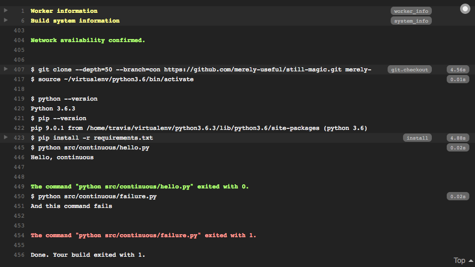
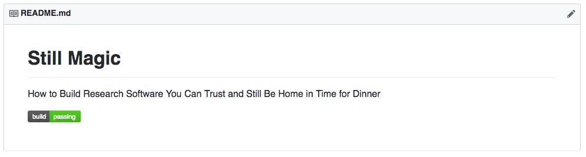

# Continuous Integration {#rse-ci}

```{r, include=FALSE}
knitr::opts_chunk$set(eval = FALSE)
```

## Questions {#rse-ci-questions}

```{r, child="questions/rse-ci.md"}
```

## Objectives {#rse-ci-objectives}

```{r, child="objectives/rse-ci.md"}
```

## Introduction {#rse-ci-intro}

[Continuous integration](glossary.html#continuous-integration) (CI) in software
development is a simple idea: to frequently merge in ("integrate") additions of or
modifications to code so that a software project gets developed and tested in
small, regular increments. The purpose of CI is to catch bugs or problems early
before they become bigger problems later on. There are automated tools available
that help with building and testing any change to the code in a repository. What
the tools do is download the software repository, run and build the software and
code on the repository, run any tests, and then print out the results of these
builds and tests. That way, you can check if there are any problems with your
software and fix any that occur.

The most widely used CI system is [Travis CI][travis-ci]. It integrates well
with [Github][github], and will run tests on multiple platforms and with
multiple versions of tools. At a minimum, Travis will build the software. If
you want to confirm that your software works as intended, you should create tests
as detailed in Chapter \@ref(unit-tests). If tests exist, Travis will run them
and print the results for you to check. Remember, the tests that the CI runs are
only as good as you've written them.

TODO: Confirm unit test chapter ref.

So why should you use CI? There are several reasons:

1. CI will construct a clean, separate computing environment before building and
testing your software. That gives you a better idea on whether potential users
of your software can actually use it. Often your software will build and work on
*your* computer, but not others' computers because of differences in software
versions, operating systems, and other potential dependency conflicts. So part of
good practice for creating software is to confirm that it works at least on a clean
environment.
2. CI will help you catch problems or bugs sooner, which should reduce your stress
and frustration compared to if you have to hunt for a bug later in the software
development.
3. CI is great when working on a project with others, as it can help reduce bugs
introduced by other people on the team and hopefully prevent the other team members
from having to deal with those bugs.
4. CI can also be extended and customized to be used in other situations outside
of software projects, like when writing a book or creating a website. Having
the knowledge and skill for using CI can allow you to apply these tools to
other areas of work and ultimately reduce more manual and tedious work tasks.

In this lesson we will show you how to set up Travis for your project.

## The basics of setting up CI on a repository? {#rse-ci-basic}

The general steps for setting up CI are:

1. Go to the [Travis][travis-ci] website and get Travis to start watching the
repository.
1. Create a `.travis.yml` file in your repository.
1. Add some standard commands to the file, like `language` (e.g. Python or R).
1. Add and commit the `.travis.yml` file into your Git repository.
1. Push to the repository to GitHub.

And that is the basic steps involved! Let's go through it in more detail. The very
first thing to do is create a Travis account by linking your GitHub account.
Go to [Travis][travis-ci] and create your profile.

### Travis is watching (your repo)

> Note: This process is for general Travis usage. When working with R projects
or packages, this process is simplified by using the `usethis::use_travis()`
command, which we wil discuss at the end of this session.

TODO: Add internal link to R section

After the "step-zero" of setting up your Travis account, the first step to using
Travis is to tell it about your repository. Go to [Travis-CI][travis-ci] and
on the left, besides the "My Repositories", click "+" to add a repository that
is already on GitHub. 

```{r image-add-repo}
insert_graphic("figure/rse-ci/add-repo.png")
```

Then, find your repository in the list...

You may have to re-sync the list of repositories with GitHub.

```{r image-list-repos}
insert_graphic("figure/rse-ci/list-repos.png")
```

When you've found your repository, flick the switch. You've now told Travis
to watch the repository for any updated commits and run any commands as needed.

### Setting up Travis for Python projects

Next,
create a file called `.travis.yml` in the root directory of the repository.
Note the leading `.` in the name:
like many systems,
Travis puts its configuration file in the project's root directory (Chapter \@ref(configure)),
but uses a leading dot so that the file won't clutter the listing from `ls`.

A simple template `.travis.yml` configuration file may look like this:

```yaml
language: ... # Which programming language to use, e.g. Python
python:
- ... # Python specific. Sets the Python version
install:
- ... # Commands to use to install, such as extra software packages
script:
- ... # Commands to run in order to build or test your software
```

Let's break it down what each key does:

- `language` tells Travis which programming language you're using.
- `python` is specific to when `language` is set to `python` and sets the version
you want to use, e.g. `"3.6"`. You can ask Travis to test our project with
several different versions by adding more `-` items.
- `install` tells Travis how to install the software you need for your package.
For Python packages, the convention is to put a list of packages in
`requirements.txt` for `pip` to use (Chapter \@ref(py-package)).
- `script` tells Travis how to actually run the tests.
We can put almost anything here,
provided it does not need to interact with a human being
(e.g., provided it doesn't prompt with yes/no questions during package installation).

The third and final step is to create that test script.
Ours is called `hello.py`,
and is in the `./src/continuous` directory of the project containing this lesson:

An example file might be something like:

```yaml
language: python
python:
- "3.6"
install:
- pip install -r requirements.txt
script:
- python src/build.py # example build.py file
```


```python
#!/usr/bin/env python

print('Hello, continuous')
```

The first line is a [shebang](glossary.html#shebang)
that tells the operating system to run our script with Python rather than with the Bash shell.
`#!/Users/pterry/anaconda3/bin/python` would run a particular version of Python,
but `/usr/bin/env some_program_name` finds the program you want,
so if Python is installed somewhere else,
this still works.

Once we commit these changes,
Travis is set up.
Every time a commit is made to this branch, it will:

1.  Create a new Linux image.
2.  Install the desired version of Python (or clone an existing image that has it, which is faster).
3.  Install the software described by `requirements.txt`.
4.  Run the `hello.py` script.
5.  Report the results at <code>https://travis-ci.org/<em>user</em>/<em>repo</em></code>.

Travis's summary report tells us what happened
(Figure \@ref(fig:integrate-summary)).
The detailed log has *lots* of information:
there are 397 lines hidden under "Build system information"
and another 23 under "pip install" heading
(Figure \@ref(fig:integrate-log)).

```{r integrate-summary, echo=FALSE, fig.cap="Travis Summary Report"}
knitr::include_graphics("figures/integrate/summary.png")
```

```{r integrate-log, echo=FALSE, fig.cap="Travis Log"}
knitr::include_graphics("figures/integrate/log.png")
```


### Setting up Travis in R

In R, setting up and using Travis is greatly simplified by using:

```r
usethis::use_travis()
```

This command does several things at once. It:

- Creates a typical `.travis.yml` configuration file used for R packages.
- Adds a Travis build badge to your `README.md`, which we describe more in the
section [below] on displaying the build status of your package.
- Opens up the Travis CI website to the page of your package so you can activate
Travis for the repository. Note, this assumes you already have your package on
GitHub and that you have a Travis account.

TODO: Add ref to section.

See the [usethis](https://usethis.r-lib.org/reference/ci.html) webpage for more
details and help on this function.

## How can I tell Travis that something went wrong? {#rse-ci-error}

The most important thing is the test program's [exit status](glossary.html#exit-status).
An exit status of 0 means "nothing went wrong",
and it is the default if we don't specify anything else.
We can force this exit status by ending our script with `sys.exit(0)`.

The operating system interprets any non-zero exit status as a shell error code.
`sys.exit(1)` means "something went wrong",
and you will rarely have to worry about other codes
like 127 for "command not found" and 130 for "terminated with Control-C".

We can test this by telling Travis to run a second script:

```yaml
language: "python"
python:
-   "3.6"
install:
-   "pip install -r requirements.txt"
script:
-   "python src/continuous/hello.py"
-   "python src/continuous/failure.py"
```

<!-- == noindent -->
and by making that script report failure on purpose:

```python
#!/usr/bin/env python

import sys

print('And this command fails')
sys.exit(1)
```

When we commit these changes and view the repository's status page,
we are initially told that our build is queued
(Figure \@ref(fig:integrate-queued)).
We don't need to refresh the page:
when the build starts,
the page updates automatically.
When when the build finishes,
the summary turns red and the log displays an error message
(Figure \@ref(fig:integrate-failure)).

```{r integrate-queued, echo=FALSE, fig.cap="Travis Queued"}
knitr::include_graphics("figures/integrate/queued.png")
```

```{r integrate-failure, echo=FALSE, fig.cap="Travis Failure"}

```

## How can I display the status of a repository? {#rse-ci-display}

Travis's dashboard is very useful,
but we would also like to display the status of the build on GitHub because that's where most people will look.
To do this,
we can at the top of the status page and find the build icon
(Figure \@ref(fig:integrate-build-icon)).

```{r integrate-build-icon, echo=FALSE, fig.cap="Travis Build Icon"}
knitr::include_graphics("figures/integrate/build-icon.png")
```

Clicking on it brings up a dialog
where we can select the Markdown we need for the `master` branch.
Paste this into the file `README.md` in the root directory of the `master` branch of your repository,
commit,
and push to GitHub.
(Note that the `./README.md` is the project's home page on GitHub,
*not* the root of the [GitHub Pages](glossary.html#github-pages) site.

While we are waiting for Travis to finish building our site,
we can take a look at the "Branches" tab of our repository.
Clicking on a check mark or an X will bring up details of that build on that branch
(Figure \@ref(fig:integrate-overall)).
Sure enough,
the page displays a red X once the build on `master` completes.
We can now modify `.travis.yml` to remove the failing script,
commit,
wait for an email to arrive to tell us that the build has completed,
and then go to the project on GitHub
(Figure \@ref(fig:integrate-github-icon)).

```{r integrate-overall, echo=FALSE, fig.cap="Travis Overall"}
knitr::include_graphics("figures/integrate/overall.png")
```

```{r integrate-github-icon, echo=FALSE, fig.cap="Travis GitHub Icon"}

```

## How can I automatically run tests for my project when things change?  {#rse-ci-tests}

FIXME: describe how to run actual tests with Travis-CI - will this require a project or projects in a separate repository?

## Summary {#rse-ci-summary}

FIXME: create concept map for integration.

## Exercises {#rse-ci-exercises}

FIXME: exercises for integration.

## Key Points {#rse-ci-keypoints}

```{r, child="keypoints/rse-ci.md"}
```
