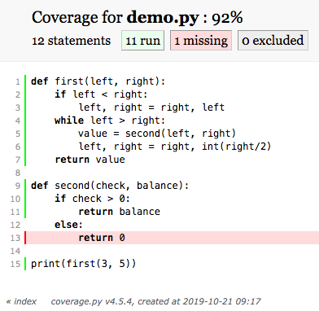

# Correctness {#rse-correct}

We all hope the software we write does what we wrote it to do.
But how can we be sure?
The short is answer is that we can't,
but that as in science,
we can test our expectations against reality to help us decide if we are sure enough.
This chapter explores ways of doing that in both R and Python.

## How can I test functions manually? {#rse-correct-manual}

Suppose we have written a function to get the sign of a number.
In R,
this might be:

```{r manual-test-r}
numSign <- function(x) {
  if (x > 0) {
    1
  } else {
    -1
  }
}
```

while in Python,
it might be:

```{python manual-test-py}
def numSign(x):
    if x > 0:
        out = 1
    else:
        out = -1
    return out
```

A simple way to test the function interactively in either language
is to check that it produces the correct value for a few representative cases:

```{r manual-test-r-2}
numSign(2) == 1
numSign(0) == 0
numSign(-4) == -1
```

These tests show that it handles (some) positive and negatives value correctly,
but gives the wrong value for zero
(whose sign should also be 0).

Manual testing is a good place to start,
but when we are creating or modifying a larger function,
we want to be able to re-run our tests with a single command.
That phrase "with a single command" suggests that we should write a second function
whose job is to re-run tests for the first.
In R,
this might be:

```{r stop-not-r}
test_numSign <- function() {
    stopifnot(numSign(0.1) == 1)
    stopifnot(numSign(0) == 0)
    stopifnot(numSign(-Inf) == -1)
}
```

As its name suggests,
`stopifnot` stops the program if its argument is not true.
A Python equivalent could use `assert` to achieve the same effect:

```{python stop-not-python}
import math

def test_numSign():
    assert numSign(0.1) == 1
    assert numSign(0) == 0
    assert numSign(math.inf) == -1
```

## What features do we want a testing framework to have? {#rse-correct-features}

The individual tests in `test_numSign` are called [unit tests][unit-test]
because they test the smallest units of our code.
Writing functions so that we can easily re-run unit tests is a step in the right direction,
but our current approach has two flaws.
First,
if a test fails,
none of the tests that come after it run.
In this case,
for example,
we don't know if `numSign` handles `-Inf` correctly or not
because testing stops when `numSign(0)` gives the wrong answer.
We would have more information if all of the tests ran every time.

The second flaw in `test_numSign` is that it doesn't tell us anything if our tests pass.
A one-line summary saying "3/3 tests passed" would confirm that the tests actually ran,
while something like "2/3 tests passed"
followed by a list of the tests that *didn't* so we know where to start investigating
would be even better.

> **Too Much Information**
>
> We *don't* want our testing framework to list all of the tests that pass
> because if there is too much output,
> we will soon start ignoring all of it.
> A testing framework should only demand that we pay attention to details
> when we actually need to.

One other requirement for a good set of tests is [isolation][test-isolation].
Suppose that we have two functions `first` and `second` and we test them in this way:

```
first_result = first()
check(first_result)
second_result = second(first_result)
check(second_result)
```

If `first` produces a wrong answer,
we won't know if `second` is working
because we won't know what its actual input is.
Using the output of one test as the input of another
increases the risk of [false positives][false-positive] (tests passing when they should fail)
and [false negatives][false-negative] (tests failing when they should pass),
which distract or mislead us.

Putting these requirements together,
a single unit test has:

-   a [fixture][fixture],
    which is the thing being tested (e.g., the number 0 or a list of images);
-   an [actual result][actual-result],
    which is what the code produces when given that fixture; and
-   an [expected result][expected-result]
    that the actual result is compared to.

Each test can have one of three results:

-   [success][test-success]: the code passed the test.
-   [failure][test-failure]: the code didn't pass the test.
-   [error][test-error]: something went wrong with the test itself,
    so we don't know anything for certain about the code being tested.

A [test framework][test-framework] (also called a [test runner][test-runner]) should:

-   find and run tests;
-   summarize results;
-   pinpoint the locations of failures so that users know where to start debugging;
-   encourage people to isolate tests; and
-   make it easy to write and update tests (because otherwise people won't do it).

The next two sections will introduce the most popular frameworks for R and Python.
We will then explore general issues
such as how we can tell which parts of our code have and haven't been tested
and what kinds of tests we should write.

## How do I create and run unit tests in Python? {#rse-correct-create-python}

[`pytest`][pytest] is the most widely used test framework for Python.
Tests obey three rules:

1.  All tests are put in files whose names begin with `test_`.
2.  Each test is a function whose name also begins with `test_`.
3.  These functions use `assert` to check results.

The `pytest` library comes with a command-line tool that is also called `pytest`.
When we run it with no options:

```shell
$ pytest
```

it searches for all files named `test_*.py` in the current directory and its sub-directories.
It then imports these files,
runs the tests they contain,
and summarizes their results.
If we only want to run the tests in a particular file,
we can use the command `pytest path/to/test_file.py`.

We can put our tests wherever we want,
but most projects put them in a sub-directory of the project's root directory called `tests`.
If the project uses a [build tool][build-tool] like Make (Chapter \@ref(rse-automate)),
it is common to include a target called `test` so that `make test` will re-run all of the tests.

So what do tests look like?
To see,
create a file called `test_add.py` and insert the following code:

```python
def add(x, y):
    val = x + y
    return val

def test_add_two_small_integers_2():
    assert add_two(1, 2) == 3

def test_add_integer_and_float():
    left = 1
    right = 2.0
    result = add_two(left, right)
    assert result == 3
    assert type(result) == int
```

The function being tested will *not* normally be in
the file of tests—test files will normally import those functions instead—but
we have put `add` here for convenience.
We don't write comments to explain what each test is doing;
we give each a long name instead,
because that's what `pytest` will print if and when the test fails.
Finally,
we have shown two styles of testing here:
one in which the fixture is just the values passed into the function
and the result is checked immediately,
and one in which the fixture is constructed step-by-step (the variables `left` and `right`)
and the function's result is captured in another variable
so that several checks can be done.

To run these tests, we use:

```shell
$ pytest test_add.py
```

The output is:

```text
============================= test session starts ==============================
platform darwin -- Python 3.7.3, pytest-5.0.1, py-1.8.0, pluggy-0.12.0
rootdir: /Users/merely/tests
plugins: openfiles-0.3.2, arraydiff-0.3, doctestplus-0.3.0, remotedata-0.3.1
collected 2 items

test_add.py FF                                                          [100%]

=================================== FAILURES ===================================
________________________ test_add_two_small_integers_2 _________________________

    def test_add_two_small_integers_2():
>       assert add_two(1, 2) == 3
E       NameError: name 'add_two' is not defined

test_add.py:6: NameError
__________________________ test_add_integer_and_float __________________________

    def test_add_integer_and_float():
        left = 1
        right = 2.0
>       result = add_two(left, right)
E       NameError: name 'add_two' is not defined

test_add.py:11: NameError
=========================== 2 failed in 0.10 seconds ===========================
```

The two `F`'s in the top line tell us there are two failures.
The `E` in the report for each test tells us why that test failed,
and the listing immediately above this line tells us why:
our function is called `add`,
but we are using `add_two` in our tests.
Let's rename the function and re-run our tests:

```text
============================= test session starts ==============================
platform darwin -- Python 3.7.3, pytest-5.0.1, py-1.8.0, pluggy-0.12.0
rootdir: /Users/merely/tests
plugins: openfiles-0.3.2, arraydiff-0.3, doctestplus-0.3.0, remotedata-0.3.1
collected 2 items

test_add.py .F                                                           [100%]

=================================== FAILURES ===================================
__________________________ test_add_integer_and_float __________________________

    def test_add_integer_and_float():
        left = 1
        right = 2.0
        result = add_two(left, right)
        assert result == 3
>       assert type(result) == int
E       AssertionError: assert <class 'float'> == int
E        +  where <class 'float'> = type(3.0)

test_add.py:13: AssertionError
====================== 1 failed, 1 passed in 0.05 seconds ======================
```

This time the first line of output tells us that one test passed (the `.`)
and another failed (the `F`).
`pytest` then shows where the problem occurred in the failing test:
we claimed on line 13 that the result's type would be `int`
but it is actually `float`.

## How do I create and run unit tests in R? {#rse-correct-create-r}

The easiest way to start testing in R is via the `usethis` package.
Let's create a new project in RStudio caller `creater` of type "package"
(both because `usethis` is designed to work with packages,
and because our R projects should always be packages).
We can then type:

```r
usethis::use_testthat()
```

```text
✔ Setting active project to '/Users/merely/creater'
✔ Adding 'testthat' to Suggests field in DESCRIPTION
✔ Creating 'tests/testthat/'
✔ Writing 'tests/testthat.R'
● Call `use_test()` to initialize a basic test file and open it for editing.
```

The call creates a new directory `tests/testthat/`,
adds `testthat` to `Suggests` in the `DESCRIPTION` file,
and creates a file called `tests/testthat.R` that tells R how to run the tests.
This may seem like a lot,
but it is all needed to create an R package (Chapter \@ref(rse-package-r)),
so we might as well do things that way from the start.

The file `tests/testthat.R` contains:

```r
library(testthat)
library(creater)

test_check("creater")
```

I.e.,
it loads the `testthat` library and our own package,
then calls `test_check` to run tests.
If we try to run our tests using:

```r
devtools::test()
```

we get the message:

```text
No tests: no files in /Users/merely/creater/tests/testthat match '^test.*\.[rR]$'
```

This is fair,
since we haven't yet created any tests.
To do that,
we run:

```r
usethis::use_test("mean")
```

```text
✔ Increasing 'testthat' version to '>= 2.1.0' in DESCRIPTION
✔ Writing 'tests/testthat/test-mean.R'
● Modify 'tests/testthat/test-mean.R'
```

As the output suggests,
this command creates a file called `tests/testthat/test-mean.R`.
We could create this file ourselves if we want;
either way,
its name should reflect what we are using it to test,
such as `test-read-data.R` or `test-annual-analysis.R`.
Note that we do *not* type the prefix `test-` in the call to `usethis::use_test`;
`usethis` will insert that automatically.

The newly-created file contains a single test case:

```r
test_that("multiplication works", {
  expect_equal(2 * 2, 4)
})
```

We can run this with:

```r
devtools::test()
```

```text
Loading creater
Testing creater
✔ |  OK F W S | Context
✔ |   1       | mean

══ Results ══════════════════════════════════════════════════════════════════════════════════════════════════════
OK:       1
Failed:   0
Warnings: 0
Skipped:  0
```

or use the RStudio keyboard shortcut <kbd>Ctrl</kbd>+<kbd>Shift</kbd>+<kbd>T</kbd> (on Windows)
or <kbd>Cmd</kbd>+<kbd>Shift</kbd>+<kbd>T</kbd> (on Mac),
which calls the same function.
Either way,
R searches below the `tests/testthat` directory to find files whose names start with `test`,
loads them,
and runs the tests that it finds.
The output tells us that one test passed,
none failed,
there were no warnings,
and no tests were skipped.

Let's re-open `tests/testthat/test-mean.R` and replace the test that R wrote for us
with this code:

```r
context("Computing the mean")

test_that("the mean of an odd-length vector is correct", {
    expect_identical(mean(1:3), 2.0)
})

test_that("the mean of an even-length vector is correct", {
    expect_identical(mean(1:4), 2.0)
})
```

```text
Loading creater
Testing creater
✔ |  OK F W S | Context
✖ |   1 1     | Computing the mean
─────────────────────────────────────────────────────────────────────────────────────────────────────────────────
test-mean.R:8: failure: the mean of an even-length vector is correct
mean(1:4) not identical to 2.
1/1 mismatches
[1] 2.5 - 2 == 0.5
─────────────────────────────────────────────────────────────────────────────────────────────────────────────────

══ Results ══════════════════════════════════════════════════════════════════════════════════════════════════════
OK:       1
Failed:   1
Warnings: 0
Skipped:  0
```

The little table at the top of the output shows that one test passed and one failed
in the context titled `"Computing the mean"`.
The lines below tell us what failed and why,
and the final section of the report summarizes the results.
It is redundant in this case,
since both of our tests are in the same context,
but is useful if we have several files full of tests.

## How should I set up fixtures my unit tests? {#rse-correct-fixtures}

Test files all have a similar structure:

1.  Load the software to be tested
    (since it normally won't be in the same file as the tests).
2.  Write one short function to test each feature of the software.

Each test function also has a stereotypical structure:

1.  Create the fixture.
2.  Run the test.
3.  Check the result.

Creating a fixture often requires many lines of code,
so we often write helper functions to do this.
For example,
if we are testing functions that work on multiple dataframes in R,
we might write a function like this:

```r
create_three_frames <- function() {
    ones <- tribble(
        ~odd, ~even,
           1,     2,
           3,     4)
    tens <- tribble(
        ~odd, ~even,
          10,    20,
          30,    40)
    hundreds <- tribble(
        ~odd, ~even,
         100,   200,
         300,   400)
    list(ones=ones, tens=tens, hundreds=hundreds)
}
```

We could then use the fixture that function produces in many tests.
Here,
for example,
we are using it to test a function called `columnize`:

```r
test_that("columnize combines columns by name with addition", {
    fixture <- create_three_frames()
    result <- columnize(fixture, '+', odd)
    expect_equal(result$odd, c(111, 333))
})

test_that("columnize combines columns by name with multiplication", {
    fixture <- create_three_frames()
    result <- columnize(fixture, '*', odd)
    expect_equal(result$odd, c(1000, 9000))
})
```

Using helper functions to create fixtures like this
reduces the [cognitive load][cognitive-load] on whoever has to maintain the tests,
since they only have to form a [mental model][mental-model] of a few cases
rather than a new one for each test.
Note that we do *not* create the fixture once as a global variable
and then re-use it in many tests.
Tests should be isolated,
and having them share data increases the chances that
one of our tests will modify the data in ways that interfere with other tests.

## How should I check the results of tests? {#rse-correct-check}

Once we have a result we need to check it.
The simplest way to do this in Python is the `assert` statement,
which [raises][exception-raise] an [exception][exception] if a condition is not true.
This normally causes Python to halt the program,
but `pytest` catches these exceptions,
adds them to its summary report,
and then runs the next test function.
As a result,
all of the test functions are run,
but each function only runs as far as the first failed check (FIXME: figure).
This is another reason to recycle fixtures and keep test functions short:
in the example below,
we can't be sure that the second test is run in `combined_tests`:

```python
def combined_tests():
    fixture = make_fixture()
    result = function(fixture)
    assert len(result) > 2
    assert result[0] != 0  # might not run
```

but we can be sure that both checks are run in `split_test_len` and `split_test_zero`.

```python
def split_test_len():
    fixture = make_fixture()
    result = function(fixture)
    assert len(result) > 2

def split_test_zero():
    fixture = make_fixture()
    result = function(fixture)
    assert result[0] != 0
```

> **Testing in the Real World**
>
> In practice,
> most programmers would write `combined_tests` in this case
> rather than doubling the amount of reading they have to do
> in order to understand these tests.
> The purpose of testing is always to draw attention to things that need it;
> if the second check in `combined_tests` doesn't run because the first one failed
> then we will have less information than we could,
> but we will still know the most important thing:
> our code is broken.

In contrast to Python,
R's `testthat` library provides multiple checking functions for different purposes.
`expect_identical()` compares that actual and expected results are identical down to the last bit.
`expect_equal()` checks that its arguments are equal within a narrow tolerance;
as we discuss in Section \@ref(rse-correct-float),
this is more useful for most data science problems.
Others include `expect_length`,
which checks that a vector has the right length,
and `expect_match`,
which checks that a string matches a [regular expression][regular-expression].
We can always replace these with `expect_true`,
i.e.,
use:

```r
expect_true(length(result == 3))
```

instead of:

```r
expect_length(result, 3)
```

but the latter makes our intention clearer.

## Why and how should I test that software fails correctly? {#rse-correct-failure}

Evil clowns are every programmer's worst nightmare.
Their second worst is a [silent failure][silent-failure]:
something that goes wrong but doesn't crash,
print a warning,
or otherwise signal that human attention is required.
Testing that our code fails when it should
is therefore just as important as testing that it runs correctly.

> **We Have the Data**
>
> The need to test error handling is not just folklore:
> in their study of failures in data-intensive applications,
> @Yuan2014 found that,
> "the majority of catastrophic failures could easily have been prevented
> by performing simple testing on error handling code—the last line of defense—even without
> an understanding of the software design."

In Python,
we can test for an error using a `with` statement
and the `pytest.raises` function.
For example,
suppose a function called `count_words` is supposed to raise a `ValueError` exception when given an empty string.
We can test this behavior as follows:

```python
import pytest

def test_text_must_not_be_empty():
    with pytest.raises(ValueError):
        count_words('')
```

In R,
`testthat` provides specific functions to test for errors or warnings
called `expect_error()` and `expect_warning()` respectively:

```r
test_that("text must not be empty", {
    expect_error(count_words(""))
})
```

## How can I tell whether my code has been tested or not? {#rse-correct-coverage}

As we write more code or make changes to code we already have,
we may lose track of which parts we have tested and which we haven't.
Even short programs,
loops or conditionals may make it difficult for us to figure out
what is actually being executed.
For example,
take a few moments to read this function in Python:

```python
def first(left, right):
    if left < right:
        left, right = right, left
    while left > right:
        value = second(left, right)
        left, right = right, int(right/2)
    return value

def second(check, balance):
    if check > 0:
        return balance
    else:
        return 0

print(first(3, 5))
```

or its equivalent in R:

```r
first <- function(left, right) {
  if (left < right) {
    tmp <- left
    left <- right
    right <- tmp
  }

  while (left > right) {
    value <- second(left, right)
    left <- right
    right <- as.integer(right / 2)
  }

  value
}

second <- function(check, balance) {
    if (check > 0) {
        balance
    } else {
        0
    }
}

c(3, 5, first(3, 5))
```

The only way to know which parts of these functions are and aren't executed
is to trace their execution a line at a time.
The good news is that we don't have to do this ourselves:
a [code coverage][code-coverage] tool will do this for us.
In essence,
a code coverage tool creates a vector of Boolean flags with one entry for each line of code,
then modifies the code so that the appropriate flag is set to `true` whenever that line is executed (FIXME: figure).
When the program finishes,
the tool can show us which lines were touched
and report summary statistics such as the number or percentage of lines that weren't used.

Most Python programmers use the `coverage` module as a coverage checking tool.
When we install it we get a command-line utility that is also called `coverage`.
If the example program above is in a file called `demo.py`,
we can check coverage by running:

```shell
$ coverage run demo_coverage.py
```

This command doesn't display anything of its own;
instead,
it puts coverage data in a file called `.coverage` (with a leading `.`) in the current directory.
To display that data,
we run:

```shell
$ coverage report
```

```text
Name      Stmts   Miss  Cover
-----------------------------
demo.py      12      1    92%
```

To get a fuller report,
we run `coverage html`
and then open `htmlcov/index.html`.
Clicking on the name of our file produces the colorized line-by-line display shown in Figure \@ref(fig:python-coverage).

```{r python-coverage, echo=FALSE}

```

R's `covr` package has several functions for checking coverage.
For example,
we can test the coverage of the tests for a package by running:

```r
covr::package_coverage()
```

This function outputs a list of all R files in the package
with their corresponding percentage coverage,
which is a good way to figure out what needs to be done next.

## How much testing is enough? {#rse-correct-enough}

If we are writing software for a safety-critical application such as a medical device,
we should aim for 100% code coverage,
i.e.,
every single line in the application should be tested.
In fact,
we should probably go further and aim for 100% [path coverage][path-coverage]
and ensure that every possible path through the code has been checked.

But most of us don't write software that people's lives depend on,
so requiring 100% code coverage is like asking for ten decimal places of accuracy
when checking the voltage of a household electrical outlet.
We always need to balance the effort required to create tests
against the likelihood that those tests will uncover useful information.

It's important to understand that no amount of testing can prove a piece of software is completely correct.
A function with only two numeric arguments has 2<sup>128</sup> possible inputs.
Even if we could write the tests,
how could we be sure we were checking the result of each one correctly?

And testing data analysis pipelines is often harder than testing mainstream software applications,
since data analysts often don't know what the right answer is.
(If we did,
we would have submitted our report and moved on to the next problem already.)
The key distinction is the difference between [validation][validation],
which asks whether the specification is correct,
while [verification][verification],
which asks whether we have met that specification.
The difference between them is the difference between building the right thing and building something right,
and the former question is often hard for data scientists to answer.

Luckily,
we can group the test cases for most functions into classes.
For example,
it might be possible to test a function that takes numbers as inputs
as well as we need to
using only a few cases:
zero, a positive number, a negative one, and infinity.
If we want to go further,
we could check that it fails the right way when given a string or a list.
Similarly,
when testing a function that summarizes a table full of data,
we should probably check that it handles tables with:

-   no rows
-   only one row
-   many identical rows
-   rows having keys that are supposed to be unique, but aren't
-   rows that contain nothing but missing values

Some projects develop [checklists][checklist] to remind programmers what they ought to test.
These checklists can be a bit daunting for newcomers,
but they are a great way to pass on hard-earned experience.

## When should I write my tests? {#rse-correct-tdd}

Many programmers are passionate advocates of a practice called
[test-driven development][tdd] (TDD).
Rather than writing code and then writing tests,
they write the tests first and then write just enough code to make those tests pass.
Once the code is working,
they clean it up (Chapter \@ref(refactor)) and then move on to the next task.

TDD's advocates claim that working this way leads to better code in less time because:

1.  Writing tests clarifies what the code is actually supposed to do.

2.  It eliminates [confirmation bias][confirmation-bias].
    If someone has just written a function,
    they are predisposed to want it to be right,
    so they will bias their tests towards proving that it is correct
    instead of trying to uncover errors.

3.  Writing tests first ensures that they actually get written.

These arguments are plausible.
However,
studies such as @Fucci2016 don't support them:
in practice,
writing tests first or last doesn't appear to affect productivity.
What *does* have an impact is working in small, interleaved increments,
i.e.,
writing just a few lines of code and testing it before moving on
rather than writing several pages of code and then spending hours on testing.

So how do most data scientists figure out if their software is doing the right thing?
The answer is spot checks:
each time they produce an intermediate or final result,
they scan a table, create a chart, or inspect some summary statistics
to see if everything looks OK.
Their heuristics are usually easy to state,
like "there shouldn't be NAs at this point" or "the age range should be reasonable",
but applying those heuristics to a particular analysis always depends on
their evolving insight into the data in question.

By analogy with test-driven development,
we could call this process [checking-driven development][cdd] (CDD).
Each time we add a step to our pipeline and look at its output,
we can also add a check of some kind to the pipeline to ensure that
what we are checking for remains true as the pipeline evolves or is run on other data.
This helps reusability—it's amazing how often a one-off analysis
winds up being used many times—but the real goal is comprehensibility.
If someone can get our code and data,
run the former on the latter,
and get the same result that we did,
then our computation is reproducible,
but that doesn't mean they can understand it.
Comments help
(either in the code or as blocks of prose in a [computational notebook][computational-notebook]),
but they won't check that assumptions and invariants hold.
And unlike comments,
runnable assertions can't fall out of step with what the code is actually doing...

We also need to distinguish between testing during development
and testing in production.
During development,
our main concern is whether our answers are (close enough to) what we expect.
We do this by analyzing small datasets
and convincing ourselves that we're getting the right answer in some ad hoc way.

In production,
on the other hand,
our goal is to detect cases where behavior deviates significantly from what we previously decided what right.
We want this to be automated
so that our pipeline will ring an alarm bell to tell us something is wrong
even if we're busy working on something else.
This can happen because real data will never have exactly the same characteristics as the data we used during development.
We also need these checks because the pipeline's environment can change:
for example,
someone could upgrade a library that one of our libraries depends on,
which could lead to us getting slightly different answers than we expected.

## Why should I be cautious when using floating-point numbers? {#rse-correct-float}

No matter what the cause,
we need to understand exactly what we mean by "tolerance" when talking about testing.
The explanation that follows is simplified to keep it manageable;
To learn more,
please take half an hour to read @Gold1991.

Finding a good representation for floating point numbers is hard:
we cannot represent an infinite number of real values with a finite set of bit patterns,
and unlike integers,
no matter what values we *do* represent,
there will be an infinite number of values between each of them that we can't.
These days,
floating point numbers are usually represented using [sign][sign],
[magnitude][magnitude] (or [mantissa][mantissa]),
and an [exponent][exponent].
In a 32-bit number,
the IEEE 754 standard calls for 1 bit of sign,
23 bits for the mantissa,
and 8 bits for the exponent.
To illustrate the problems with floating point,
we will use a much simpler 5-bit representation
with 3 bits for the magnitude and 2 for the exponent.
We won't worry about fractions or negative numbers,
since our simple representation will show off the main problems.

The table below shows the possible values we can represent with 5 bits.
(Real floating point representations shift values left and right to avoid the redundancy shown here,
but again,
that doesn't affect our main point.)
Using subscripts to show the bases of numbers,
110<sub>2</sub>×2<sup>11<sub>2</sub></sup> in binary
is 6×2<sup>3</sup> in decimal,
or 48.

<table>
  <tr>
    <th></th>
    <th colspan="4">Exponent</th>
  </tr>
  <tr>
    <th>Mantissa</th> <th>00</th> <th>01</th> <th>10</th> <th>11</th>
  </tr>
  <tr>
    <th>000</th> <td>0</td> <td>0</td> <td>0</td> <td>0</td>
  </tr>
  <tr>
    <th>001</th> <td>1</td> <td>2</td> <td>4</td> <td>8</td>
  </tr>
  <tr>
    <th>010</th> <td>2</td> <td>4</td> <td>8</td> <td>16</td>
  </tr>
  <tr>
    <th>011</th> <td>3</td> <td>6</td> <td>12</td> <td>24</td>
  </tr>
  <tr>
    <th>100</th> <td>4</td> <td>8</td> <td>16</td> <td>32</td>
  </tr>
  <tr>
    <th>101</th> <td>5</td> <td>10</td> <td>20</td> <td>40</td>
  </tr>
  <tr>
    <th>110</th> <td>6</td> <td>12</td> <td>24</td> <td>48</td>
  </tr>
  <tr>
    <th>111</th> <td>7</td> <td>14</td> <td>28</td> <td>56</td>
  </tr>
</table>

```{r verify-spacing, echo=FALSE, fig.cap="Number Spacing"}
knitr::include_graphics("figures/rse-correct/number-spacing.png")
```

Figure \@ref(fig:verify-spacing) is a clearer view of some of the values our scheme can represent.
It shows that a lot of values are missing from this diagram:
for example,
it includes 8 and 10 but not 9.
This is exactly the same problem as writing out ⅓ in decimal:
we have to round that to 0.3333 or 0.3334.

Since this scheme has no representation for 9,
8+1 must be stored as either 8 or 10.
But if 8+1 is 8, what is 8+1+1?
If we add from the left, 8+1 is 8, plus another 1 is 8 again.
If we add from the right, 1+1 is 2, and 2+8 is 10,
so changing the order of operations can make the difference between right and wrong.
In this case,
sorting the values and adding from smallest to largest
gives us the best chance of getting the most accurate answer.
In other situations,
like inverting a matrix,
the rules are more complicated.

To make this more concrete,
consider the short Python program below.
It loops over the integers from 1 to 9
and puts the numbers 0.9, 0.09, 0.009, and so on in `vals`.
The sums should be 0.9, 0.99, 0.999, and so on, but are they?
To find out,
we can calculate the same values by subtracting .1 from 1,
then subtracting .01 from 1, and so on.
This should create exactly the same sequence of numbers, but it doesn't.

```{python}
vals = []
for i in range(1, 10):
    number = 9.0 * 10.0 ** -i
    vals.append(number)
    total = sum(vals)
    expected = 1.0 - (10.0 ** -i)
    diff = total - expected
    print('{:2d} {:22.21f} {:22.21f}'.format(i, total, total-expected))
```

As the output shows,
the very first value contributing to our sum is already slightly off:
even with 23 bits for a mantissa,
we cannot exactly represent 0.9 in base 2.
Doubling the size of the mantissa would reduce the error,
but we can't ever eliminate it.

The good news is that 9×10<sup>-1</sup> and 1-0.1 are exactly the same:
the values might not be correct,
but at least they are consistent.
However,
some later values differ,
and sometimes accumulated error makes the result *more* accurate.

*This has nothing to do with randomness.*
The process is completely deterministic,
so the same calculation will produce exactly the same results no matter how many times it is run.
(If we see someone run the same code on the same data with the same parameters many times and average the results,
we should ask if they know what they're doing.)
In practice,
just as electrical engineers trust oscilloscope makers,
data scientists should trust the authors of core libraries to do the best they can.

## How should I write tests that involved floating-point values? {#rse-correct-numeric}

The absolute spacing between the values we can represent in Figure \@ref(fig:verify-spacing) is uneven.
However,
the relative spacing between each set of values stays the same:
the first group is separated by 1,
then the separation becomes 2,
then 4,
and then 8.
This happens because we're multiplying the same fixed set of mantissas by ever-larger exponents,
and it leads to some useful definitions.
The [absolute error][absolute-error] in an approximation is the absolute value of
the difference between the approximation and the actual value.
The [relative error][relative-error] is the ratio of the absolute error to the value we're approximating.
For example,
it we are off by 1 in approximating 8+1 and 56+1,
we have the same absolute error,
but the relative error is larger in the first case than in the second.

Relative error is almost always more important than absolute error when we are testing software
because it makes little sense to say that we're off by a hundredth
when the value in question is a billionth.
[Accuracy][accuracy] is how close our answer is to right,
and [precision](glossary.html#precision) is how close repeated measurements are to each other.
We can be precise without being accurate (systematic bias),
or accurate without being precise (near the right answer but without many significant digits).

Accuracy is usually more important than precision for human decision making:
a relative error of 10<sup>-2</sup> (two decimal places) is good enough for most data science
because the decision a human being would make won't change if the number changes by 1%.

We now come to the crux of this lesson:
if the function we are testing uses floating point numbers,
what should we compare its result to?
If we compared the sum of the first few numbers in `vals` to the "right" answer,
the answer could be `False` even though we're doing nothing wrong.
If we compared it to a previously calculated result that we had stored somehow,
the match would be exact.

No one has a good generic answer to this problem
because its root cause is that we're using approximations,
and each approximation has to be judged in context.
So what can you do to test your programs?
If you are comparing to a saved result,
and the result was saved at full precision,
you could use exact equality,
because there is no reason for the new number to differ.
However,
any change to your code,
however small,
could trigger a report of a difference.
Experience shows that these spurious warnings quickly lead developers to stop paying attention to their tests.

A much better approach is to write a test that checks whether numbers are the same within some [tolerance][tolerance],
which is best expressed as a relative error.
R's `expect_equal` does this automatically.
In Python,
we can use `pytest.approx`,
which works on lists, sets, arrays, and other collections,
and can be given either relative or absolute error bounds.
To show how it works,
here's an example with an unrealistically tight absolute bound:

```python
from pytest import approx

for bound in (1e-15, 1e-16):
    vals = []
    for i in range(1, 10):
        number = 9.0 * 10.0 ** -i
        vals.append(number)
        total = sum(vals)
        expected = 1.0 - (10.0 ** -i)
        if total != approx(expected, abs=bound):
            print('{:22.21f} {:2d} {:22.21f} {:22.21f}'.format(bound, i, total, expected))
```

```text
9.999999999999999790978e-17  6 0.999999000000000082267 0.999998999999999971244
9.999999999999999790978e-17  8 0.999999990000000060775 0.999999989999999949752
```

This tells us that two tests pass with an absolute error of 10<sup>-15</sup>
but fail when the bound is 10<sup>-16</sup>,
both of which are unreasonably tight.
Again,
it helps to think of physical experiments:
an absolute error of 10<sup>-15</sup is one part in a trillion,
which only a handful of high-precision experiments have ever achieved.

## How can I test plots and other graphical results? {#rse-correct-plots}

Testing visualizations is hard:
any change to the dimension of the plot,
however small,
can change many pixels in a [raster image][raster-image],
and cosmetic changes such as moving the legend up a couple of pixels
will similarly cause false positives.

The simplest solution is therefore to test the data used to produce the image
rather than the image itself.
Unless we suspect that the plotting library contains bugs,
the correct data should alwyas produce the correct plot.

If we *do* need to test the generated image,
the only practical approach is to compare it to a saved image that we have visually verified.
For example,
[pytest-mpl][pytest-mpl] does this by calculating the root mean square (RMS) difference between images,
which must be below a threshold for the comparison to pass.
It also allows us to turn off comparison of text,
because font differences can throw up spurious failures.
As with choosing tolerances for floating-point tests,
our rule for picking thresholds should be,
"If images are close enough that a human being would make the same decision about meaning,
the test should pass"

Another approach is to save the plot in a [vector format][vector-image] like [SVG][svg]
that stores the coordinates of lines and other elements as text.
We can then check that the right elements are there with the right properties.
However,
this is usually unrewarding:
again,
small changes to the library or to plotting parameters can make all of the tests fail
by moving elements by a pixel or two.
Vector-based tests therefore still need to have thresholds on floating-point values.

## What data should I use to test my analyses? {#rse-correct-data}

There aren't any useful general rules for testing the calculations that our pipelines do,
since those calculations vary from one pipeline to the next,
but there *are* some rules about where to get data to test with.
The first method is [subsampling][subsampling]:
choose random subsets of your data,
analyze it,
and see how close the output is to what you get with the full dataset.
If the output doesn't converge as the sample size grows,
something is probably unstable in either the algorithm or its implementation.

When we are subsampling,
it's vital that we select a truly random subset of data
rather than (for example) the first N records or every N'th record.
If there is any ordering or grouping in our data,
those techniques can produce samples that are biased,
which may in turn invalidate some of your tests.

The other approach is to test with [synthetic data][synthetic-data].
A few lines of code can generate uniform data (i.e., data having the same values for all observations),
strongly bimodal data (which is handy for testing clustering algorithms),
or a pseudorandom sample with a known distribution.
If we do this,
we should also give our pipeline data that *doesn't* fit your expected distribution
and make sure that something, somewhere, complains.
Doing this is the data science equivalent of testing the fire alarm every once in a while.

For example,
we can write a short program to generate data that conforms to Zips' Law and use it to test our analysis.
Real data will be integers,
since words only occur or not,
and distributions will be fractional.
After a bit of experimentation,
we will use 5% relative error as our threshold for correctness:
1% excludes a valid correct case.
The test function is called `is_zipf`:

```python
from pytest import approx


RELATIVE_ERROR = 0.05


def is_zipf(hist):
    scaled = [h/hist[0] for h in hist]
    print('scaled', scaled)
    perfect = [1/(1 + i) for i in range(len(hist))]
    print('perfect', perfect)
    return scaled == approx(perfect, rel=RELATIVE_ERROR)
```

Here are three tests that synthesize data and then check it using this function
with names that suggest their purpose:

```python
def test_fit_correct():
    actual = [round(100 / (1 + i)) for i in range(10)]
    print('actual', actual)
    assert is_zipf(actual)


def test_fit_first_too_small():
    actual = [round(100 / (1 + i)) for i in range(10)]
    actual[0] /= 2
    assert not is_zipf(actual)


def test_fit_last_too_large():
    actual = [round(100 / (1 + i)) for i in range(10)]
    actual[-1] = actual[1]
    assert not is_zipf(actual)
```

## How can I test a data analysis pipeline in production? {#rse-correct-production}

An [operational test][operational-test] is one that is kept in place during production
to tell users if everything is still working as it should.
Some common operational tests include:

-   Does this pipeline stage produce the same number of output records as input records?
-   Or fewer if the stage is aggregating?
-   If two or more tables are being [joined][join],
    is the number of output records equal to the product of the number of input records?
-   Is the standard deviation smaller than the range of the data?
-   Are there any NaNs or NULLs where there aren't supposed to be?

A common pattern for such tests is to have every tool append information to a [log file][log-file]
and then have another tool check that log file after the run is over.
Logging while calculating and checking afterward makes it easy to compare values between pipeline stages,
and ensures that there's a record of why a problem was reported.

To illustrate these ideas,
here's a script that reads a document and prints one line per word:

```python
import sys

num_lines = num_words = 0
for line in sys.stdin:
    num_lines += 1
    words = [strip_punctuation(w) for w in line.strip().split()]
    num_words += len(words)
    for w in words:
        print(w)

with open('logfile.csv', 'a') as logger:
    logger.write('text_to_words.py,num_lines,{}\n'.format(num_lines))
    logger.write('text_to_words.py,num_words,{}\n'.format(num_words))
```

Here's a complementary script that counts how often words appear in its input:

```python
import sys

num_words = 0
count = {}
for word in sys.stdin:
    num_words += 1
    count[word] = count.get(word, 0) + 1

for word in count:
    print('{} {}', word, count[word])

with open('logfile.csv', 'a') as logger:
    logger.write('word_count.py,num_words,{}\n'.format(num_words))
    logger.write('word_count.py,num_distinct,{}\n'.format(len(count)))
```

Both of these scripts write records to `logfile.csv`.
When we look at that file after a typical run,
we see records like this:

```text
text_to_words.py,num_lines,431
text_to_words.py,num_words,2554
word_count.py,num_words,2554
word_count.py,num_distinct,1167
```

We can then use a small program to check that everything went as planned:

```python
import sys
import csv

data = {}
for row in csv.reader(sys.stdin):
    data[(row[0], row[1])] = int(row[2])
    
assert data[('text_to_words.py', 'num_lines')] <= data['word_count.py', 'num_words')]
assert data[('text_to_words.py', 'num_words')] == data['word_count.py', 'num_words')]
assert data[('word_count.py', 'num_words')] >= data['word_count.py', 'num_distinct')]
```

Tests like these are simple to write
and catch a surprising number of errors,
particularly when the person using the pipeline isn't its original author.

> **Validating Pipelines**
>
> There are several libraries for validating data pipelines in R,
> including [assertr][assertr],
> [checkr][checkr],
> and [validate][validate-r].

## How can I infer and check properties of my data? {#rse-correct-infer}

Writing tests for the properties of data can be tedious,
but some of the work can be automated.
In particular,
the [TDDA library][tdda-site] for Python can infer test rules from data,
such as "`age` should be less than 100",
"`Date` should be sorted in ascending order",
or "`StartDate` should be less than or equal to `EndDate`".
The library comes with a command-line tool called `tdda`,
so that the command:

```shell
$ tdda discover training-data.csv properties.tdda
```

infers rules from data,
while the command:

```shell
$ tdda verify actual-data.csv properties.tdda
```

verifies data against those rules.
The inferred rules are stored as [JSON][json],
which is (sort of) readable with a bit of practice.
Reading the generated rules is a good way to get to know your data,
and modifying values
(e.g., changing the maximum allowed value for `Grade` from the observed 94.5 to the actual 100.0)
is an easy way to make constraints explicit.
For example,
if we run:

```shell
$ tdda discover elements92.csv elements.tdda
```

(which contains information about the first 92 elements)
the output includes:

```json
"fields": {
    "Name": {
        "type": "string",
        "min_length": 3,
        "max_length": 12,
        "max_nulls": 0,
        "no_duplicates": true
    },
    "Symbol": {
        "type": "string",
        "min_length": 1,
        "max_length": 2,
        "max_nulls": 0,
        "no_duplicates": true
    },
    "ChemicalSeries": {
        "type": "string",
        "min_length": 7,
        "max_length": 20,
        "max_nulls": 0,
        "allowed_values": [
            "Actinoid",
            "Alkali metal",
            "Alkaline earth metal",
            "Halogen",
            "Lanthanoid",
            "Metalloid",
            "Noble gas",
            "Nonmetal",
            "Poor metal",
            "Transition metal"
        ]
    },
    "AtomicWeight": {
        "type": "real",
        "min": 1.007947,
        "max": 238.028913,
        "sign": "positive",
        "max_nulls": 0
    },
    ...more...
}
```

We can apply these inferred rules to all elements up to number 118
using the `-7` option to get pure ASCII output
and the `-f` option to show only fields with failures:

```shell
$ tdda verify -f elements118.csv elements.tdda
```

```text
FIELDS:

Z: 1 failure  5 passes  type ✓  min ✓  max ✗  sign ✓  max_nulls ✓  no_duplicates ✓

Name: 1 failure  4 passes  type ✓  min_length ✓  max_length ✗  max_nulls ✓  no_duplicates ✓

Symbol: 1 failure  4 passes  type ✓  min_length ✓  max_length ✗  max_nulls ✓  no_duplicates ✓

AtomicWeight: 2 failures  3 passes  type ✓  min ✓  max ✗  sign ✓  max_nulls ✗

...other reports...

SUMMARY:

Constraints passing: 57
Constraints failing: 15
```

Another way to use TDDA is to generate constraints for two datasets and then look at differences
in order to see how similar the datasets are to each other.
This is especially useful if the constraint file is put under version control.

## Summary {#rse-correct-summary}

```{r rse-correct-concept, echo=FALSE, fig.cap="Correctness Concept Map"}
if (knitr::is_latex_output()) {
  knitr::include_graphics("figures/rse-correct/concept.pdf")
} else {
  knitr::include_graphics("figures/rse-correct/concept.svg")
}
```

## Exercises {#rse-correct-exercises}

### Fixing `numSign` {#rse-correct-ex-numsign}

1.  Fix the implementation of `numSign` in either R or Python so that all tests will succeed.
2.  Re-run the tests to confirm that the function is working.
3.  Extend the function so that it does something sensible when passed a string or an empty list.
    Write functions to check your changes.

### Checking simple calculations {#rse-correct-ex-simple-calc}

Create a new test by running `usethis::use_test("simple-arithmetic")`.
Copy the code below into the newly created test file and fill in the blanks
so that it runs correctly.

```r
context("Check simple calculations")

test_that("plus and minus give correct outputs", {
  expect_identical(1 + 2, 3)
  ___(1 - 2, -1)
  expect_identical(1 + NA, __)
  expect_identical(___ - ___, NA)
})
```

### Explain the purpose of tests {#rse-correct-ex-purpose}

Based on the contents of the tests below,
replace the blanks with appropriate `context()` and `test_that()` messages.

```r
context("___")

test_that("___", {
  expect_identical(sum(c(1, 2)), 3)
  expect_identical(sum(c(NA, 2)), NA)
})

test_that("___", {
  expect_identical(mean(c(1, 2)), 1.5)
  expect_identical(mean(c(NA, 2)), NA)
})
```

### Testing `count_words` {#rse-correct-ex-count-words}

1.  Create a new test file.
2.  Write unit tests for `count_words` to check the following:
    -   Returns zero when given an empty string.
    -   Returns `NA` when given `NA`.
    -   Returns 2 when given two words separated by a space.
    -   Returns 2 when given two words separated by a dash `-`.

### Checking for errors {#rse-correct-ex-count-words}

Add new unit tests for the word-counting function
to check that it raises errors when it should.

## Key Points {#rse-correct-keypoints}

```{r, child="keypoints/rse-correct.md"}
```
