# Introduction {#rse-intro}


> It's still magic even if you know how it's done.
>
> — Terry Pratchett

Computers are now as essential for research as telescopes, test tubes, and libraries,
which means that researchers need need to know how to build, use, and share software.
However,
most introductions to programming focus on developing commercial applications,
not on exploring problems and answering questions.
This series of books will show you how to do the latter
both on your own and as part of a team.

The prequels to this book introduce three core skills:
how to write short programs to clean and analyze data in a reproducible way,
how to keep track of what you have done,
and how to share your software and your results with other people.
But just as some astronomers spend their careers designing telescopes,
some researchers focus on building software to make their colleagues' lives easier.
People who do this are called [research software engineers][rse],
and the aim of this book is to get you ready for this role—to help you go from writing code for your own use
to creating tools to help your entire field advance.
All of this material can be freely re-used under the terms of the Creative Commons Attribution License (CC-BY 4.0);
please see Appendix \@ref(license) for details.

## Who are these lessons for? {#rse-intro-personas}

Amira
:   completed a master's in library science five years ago
    and has since worked for a small aid organization.
    She did some statistics during her degree,
    and has learned some R and Python by doing data science courses online,
    but has no formal training in programming.
    Amira would like to tidy up the scripts, data sets, and reports she has created
    in order to share them with her colleagues.
    These lessons will show her how to do this and what "done" looks like.

Jun
:   completed an [Insight Data Science][insight] fellowship last year after doing a PhD in Geology
    and now works for a company that does forensic audits.
    He uses a variety of machine learning and visualization packages,
    and would now like to turn some of his own work into an open source project.
    This book will show him how such a project should be organized
    and how to encourage people to contribute to it.

Sami
:   became a competent programmer during a bachelor's degree in applied math
    and was then hired by the university's research computing center.
    The kinds of applications they are being asked to support
    have shifted from fluid dynamics to data analysis;
    this guide will teach them how to build and run data pipelines
    so that they can pass those skills on to their users.

### Summary

For researchers and data scientists who can write functions to create programs that are several pages long,
and who want to be more productive and have more confidence in their results,
this book provides a pragmatic, tools-based introduction to research software engineering.
Unlike material courses aimed at computer scientists and professional software developers,
this book uses data analysis as a motivating example
and assumes that the learner's ultimate goal is to answer questions rather than ship products.

### Prerequisites

Learners must be able to:

-   Write reusable functions to analyze tabular data using [R][r] or [Python][python].
-   Keep track of their work using [Git][git] and [GitHub][github].
-   Create reproducible reports using [R Markdown][r-markdown] or [Jupytext][jupytext] (in [JupyterLab Notebooks][jupyter]).
-   Publish those reports with appropriate metadata such as a [DOI][doi] and [ORCID][orcid].

Learners will need:

-   A personal computer with Internet access.
-   A [Unix shell][unix-shell] (see Appendix \@ref(install) for how to set this up on Windows).
-   [Python 3][python] and [Jupyter][jupyter].
-   [R][r] and [RStudio][rstudio].
-   A [GitHub][github] account.

If you are using Windows,
please install [Chocolatey][chocolatey]:
you can use it to install other programs as you go along.

## What's the big picture? {#rse-intro-big-picture}

To make sense of what follows,
we must distinguish two key ideas:

-   [Open science][open-science]
    focuses on making data, methods, and results freely available to all
    by publishing them under [open licenses][open-license].
-   [Reproducible research][reproducible-research]
    means ensuring that anyone with access to data and software can feasibly reproduce results,
    both to check them and to build on them.

People often conflate these terms,
but they are distinct:

-   If you share your data and the programs that analyze it,
    but don't document what steps to take in what order,
    your work is open but not reproducible.
-   If you completely automate your analysis,
    but your data is only available to people in your lab,
    your work is reproducible but not open.

The third key idea is [sustainability][sustainable-software].
Software is sustainable if it's easier for people to maintain it and extend it than to replace it.
However,
sustainability isn't just a property of the software:
it also depends on the skills and culture of its users.
If a software package is being maintained by a couple of post-docs
who are being paid a fraction of what they could earn in industry
and have no realistic hope of promotion because their field doesn't value tool building,
it doesn't matter whether the package is well tested and easy to install:
sooner or later (probably sooner)
it will become [abandonware][abandonware].

### Why isn't all of this already normal?

Nobody argues that research should be irreproducible or unsustainable,
but "not against it" and actively supporting it are very different things.
Academia doesn't yet know how to reward people for writing useful software,
so while you may be thanked,
the effort you put in may not translate into job security or decent pay.

And some people still worry that if they make their data and code generally available,
someone else will use it and publish a result they have come up with themselves.
This is almost unheard of in practice,
but that doesn't stop people using it as a scare tactic.
Other people are afraid of looking foolish or incompetent by sharing code that might contain bugs.
This isn't just [impostor syndrome][impostor-syndrome]:
members of marginalized groups are frequently judged more harshly than others,
so being wrong in public is much riskier for them.

### Syllabus

This book covers the tools and practices needed to create work that is open, reproducible, and sustainable.
You can use this book for self-study
or as the foundation of a one-semester course for graduate students or senior undergraduates.
By its end,
you will be able to:

-   Use [branches][branch] to coordinate development of complex software.
-   Enable users to configure software without modifying it.
-   Re-run analyses and rebuild packages reproducibly with a single command.
-   Test your software and know which parts have not yet been tested.
-   Keep track of what still needs to be done and who's working on it.
-   Work on remote computers such as computing clusters or the cloud.
-   Document software so it can be easily used, maintained, and extended.
-   Create packages that can be installed in standard ways and be used by others.
-   Work productively in a small team where everyone is welcome.

## Acknowledgments {#rse-intro-ack}

This book owes its existence to
everyone we met through [Software Carpentry][swc], [Data Carpentry][dc], and [Library Carpentry][lc].
We are also grateful to [Insight Data Science][insight] for sponsoring the early stages of this work
and to everyone who has contributed,
particularly Jonathan Dursi
and the authors of [@Nobl2009; @Hadd2010; @Wils2014; @Scop2015; @Tasc2017; @Wils2017; @Brow2018; @Deve2018; @Shol2019; @Wils2019].


[abandonware]: glossary.html#abandonware
[absolute-error]: glossary.html#absolute-error
[absolute-path]: glossary.html#absolute-path
[accuracy]: glossary.html#accuracy
[action-make]: glossary.html#action-make
[actual-result]: glossary.html#actual-result
[advanced-r-performance]: http://adv-r.had.co.nz/Performance.html
[aggregate]: glossary.html#aggregate
[ally-skills]: https://frameshiftconsulting.com/ally-skills-workshop/
[ally]: glossary.html#ally
[anscombe-datasaurus]: https://blog.revolutionanalytics.com/2017/05/the-datasaurus-dozen.html
[assertr]: https://cran.r-project.org/web/packages/assertr/index.html
[authentic-task]: glossary.html#authentic-task
[auto-completion]: glossary.html#auto-completion
[automatic-variable-make]: glossary.html#automatic-variable-make
[bash]: glossary.html#bash
[beeswarm-plot]: glossary.html#beeswarm-plot
[bibtex]: http://www.bibtex.org/
[binary-code]: glossary.html#binary-code
[boilerplate]: glossary.html#boilerplate
[bootswatch]: https://bootswatch.com/3/
[branch-per-feature]: glossary.html#branch-per-feature-workflow
[branch]: glossary.html#branch
[broman-packages]: https://kbroman.org/pkg_primer/
[bug-report]: glossary.html#bug-report
[bug-tracker]: glossary.html#bug-tracker
[build-tool]: glossary.html#build-tool
[byte-code]: glossary.html#byte-code
[capes-gerard]: https://github.com/gcapes
[captain-awkward]: https://captainawkward.com/
[carpentries]: https://carpentries.org/
[caulfield-chorus]: https://hapgood.us/2016/05/13/choral-explanations/
[cc-0]: glossary.html#cc-0
[cc-by]: glossary.html#cc-by
[cdd]: glossary.html#cdd
[charles-rules]: http://geekfeminism.wikia.com/wiki/Charles%27_Rules_of_Argument
[checklist]: glossary.html#checklist
[checkr]: https://cran.r-project.org/web/packages/checkr/index.html
[chocolatey]: https://chocolatey.org/
[choose-license]: http://choosealicense.com/
[chunk-label]: https://yihui.name/knitr/options/#chunk-options
[cli]: glossary.html#cli
[climate-api]: http://data.worldbank.org/developers/climate-data-api
[code-coverage]: glossary.html#code-coverage
[code-smells-and-feels]: https://github.com/jennybc/code-smells-and-feels
[codecov]: https://codecov.io/
[cognitive-load]: glossary.html#cognitive-load
[command-argument]: glossary.html#command-argument
[command-flag]: glossary.html#command-flag
[command-history-unix]: glossary.html#command-history-unix
[command-option]: glossary.html#command-option
[command-shell]: glossary.html#command-shell
[command-switch]: glossary.html#command-switch
[comment]: glossary.html#comment
[commit-message]: glossary.html#commit-message
[commit]: glossary.html#commit
[commons]: glossary.html#commons
[competent-practitioner]: glossary.html#competent-practitioner
[compiled-language]: glossary.html#compiled-language
[compiler]: glossary.html#compiler
[computational-notebook]: glossary.html#computational-notebook
[conda]: https://conda.io/
[conditional-expression]: glossary.html#conditional-expression
[config-email]: mailto:gvwilson@third-bit.com
[config-repo]: https://github.com/merely-useful/merely-useful.github.io/
[confirmation-bias]: glossary.html#confirmation-bias
[continuation-prompt]: glossary.html#continuation-prompt
[continuous-integration]: glossary.html#continuous-integration
[cookiecutter]: https://drivendata.github.io/cookiecutter-data-science/
[corpus]: glossary.html#corpus
[covenant]: https://www.contributor-covenant.org
[cran]: https://cran.r-project.org/
[creative-commons]: https://creativecommons.org/
[cron]: https://en.wikipedia.org/wiki/Cron
[csv]: glossary.html#csv
[curb-cuts]: glossary.html#curb-cuts
[current-working-directory]: glossary.html#current-working-directory
[cv]: https://stats.stackexchange.com/
[data-package]: glossary.html#data-package
[dc]: https://datacarpentry.org/
[declarative-programming]: glossary.html#declarative-programming
[default-target-make]: glossary.html#default-target-make
[delimiter]: glossary.html#delimiter
[design-pattern]: glossary.html#design-pattern
[destructuring]: glossary.html#destructuring
[dictionary]: glossary.html#dictionary
[docker]: https://en.wikipedia.org/wiki/Docker_(software)
[documentation-generator]: glossary.html#documentation-generator
[doi]: glossary.html#doi
[downvote]: glossary.html#downvote
[drake]: https://ropenscilabs.github.io/drake-manual/
[dry]: glossary.html#dry
[dryad]: https://datadryad.org/
[dursi-jonathan]: https://www.dursi.ca/
[dursi-pattern-rules]: https://github.com/ljdursi/make_pattern_rules
[embedded-documentation]: glossary.html#embedded-documentation
[eniac]: glossary.html#eniac
[environment]: glossary.html#environment
[error-unexpected]: https://stackoverflow.com/questions/25889234/error-unexpected-symbol-input-string-constant-numeric-constant-special-in-my-co
[exception]: glossary.html#exception
[expected-result]: glossary.html#expected-result
[expert]: glossary.html#expert
[exploratory-programming]: glossary.html#exploratory-programming
[exponent]: glossary.html#exponent
[f1000-research]: https://f1000research.com/
[false-beginner]: glossary.html#false-beginner
[false-negative]: glossary.html#false-negative
[false-positive]: glossary.html#false-positive
[faq]: glossary.html#faq
[feature-request]: glossary.html#feature-request
[figshare]: https://figshare.com/
[filename-extension]: glossary.html#filename-extension
[filename-stem]: glossary.html#filename-stem
[filesystem]: glossary.html#filesystem
[filter]: glossary.html#filter
[fixture]: glossary.html#fixture
[flag-variable]: glossary.html#flag-variable
[folder]: glossary.html#folder
[forge]: glossary.html#forge
[full-identifier-git]: glossary.html#full-identifier-git
[fully-qualified-name]: glossary.html#fully-qualified-name
[function-make]: glossary.html#function-make
[gdb]: https://www.gnu.org/software/gdb
[geek-feminism]: http://geekfeminism.wikia.com/
[ggplot2]: https://ggplot2.tidyverse.org/
[gh-myoctocat]: https://myoctocat.com
[gh-pages]: https://pages.github.com/
[git-branch]: glossary.html#git-branch
[git-clone]: glossary.html#git-clone
[git-conflict]: glossary.html#git-conflict
[git-fork]: glossary.html#git-fork
[git-merge]: glossary.html#git-merge
[git-pull]: glossary.html#git-pull
[git-push]: glossary.html#git-push
[git-ssh-bitbucket]: https://confluence.atlassian.com/bitbucket/set-up-ssh-for-git-728138079.html
[git-ssh-github]: https://help.github.com/articles/generating-ssh-keys
[git-ssh-gitlab]: https://about.gitlab.com/2014/03/04/add-ssh-key-screencast/
[git-stage]: glossary.html#git-stage
[git]: glossary.html#git
[github-pages]: https://pages.github.com/
[github-zenodo-tutorial]: https://guides.github.com/activities/citable-code/
[github]: http://github.com
[github]: http://github.com
[gitkraken]: https://www.gitkraken.com/
[gnu-make-other-vars]: https://www.gnu.org/software/make/manual/html_node/Special-Variables.html
[gnu-make]: http://www.gnu.org/software/make/
[gnu-man-coreutils]: http://www.gnu.org/software/coreutils/manual/coreutils.html
[gnu-man]: http://www.gnu.org/manual/manual.html
[go-fair]: https://www.go-fair.org/fair-principles/
[gpl]: glossary.html#gpl
[gui]: glossary.html#gui
[gutenberg]: https://www.gutenberg.org/
[hitchhiker]: glossary.html#hitchhiker
[home-directory]: glossary.html#home-directory
[huff-testing]: https://github.com/katyhuff/python-testing
[impostor-syndrome]: glossary.html#impostor-syndrome
[in-place-operator]: glossary.html#in-place-operator
[ini-format]: https://en.wikipedia.org/wiki/INI_file
[insight]: https://www.insightdatascience.com/
[install]: glossary.html#install
[intellij-idea]: https://www.jetbrains.com/idea/
[interpeter]: glossary.html#interpeter
[interpreted-language]: glossary.html#interpreted-language
[interruption-bingo]: glossary.html#interruption-bingo
[iso-date-format]: glossary.html#iso-date-format
[issue-label]: glossary.html#issue-label
[issue-tracking-system]: glossary.html#issue-tracking-system
[issue]: glossary.html#issue
[join]: glossary.html#join
[joss]: https://joss.theoj.org/
[json]: glossary.html#json
[jupyter]: http://jupyter.org/
[jupytext]: https://jupytext.readthedocs.io/en/latest/introduction.html
[lbyl-vs-eafp]: https://blogs.msdn.microsoft.com/pythonengineering/2016/06/29/idiomatic-python-eafp-versus-lbyl/
[lc]: https://librarycarpentry.org
[learned-helplessness]: glossary.html#learned-helplessness
[library]: glossary.html#library
[lint]: https://en.wikipedia.org/wiki/Lint_(software)
[linter]: glossary.html#linter
[lme4]: https://cran.r-project.org/web/packages/lme4/vignettes/lmer.pdf
[log-file]: glossary.html#log-file
[loop-body]: glossary.html#loop-body
[loop-unix]: glossary.html#loop-unix
[magic-number]: glossary.html#magic-number
[magnitude]: glossary.html#magnitude
[make]: https://www.gnu.org/software/make/
[makefile]: glossary.html#makefile
[mantissa]: glossary.html#mantissa
[markdown]: https://en.wikipedia.org/wiki/Markdown
[marthas-rules]: glossary.html#marthas-rules
[mental-model]: glossary.html#mental-model
[mertz-documentation]: https://realpython.com/documenting-python-code/
[mit-license]: glossary.html#mit-license
[model-coc]: http://geekfeminism.wikia.com/wiki/Conference_anti-harassment/Policy
[namespace]: glossary.html#namespace
[nano]: glossary.html#nano
[ngo]: glossary.html#ngo
[noller-a-lot-happens]: http://jessenoller.com/blog/2015/9/27/a-lot-happens
[noller-sequel]: http://jessenoller.com/blog/2015/10/31/community-boundaries
[novice]: glossary.html#novice
[numpy-docstring]: https://numpydoc.readthedocs.io/en/latest/format.html
[object]: glossary.html#object
[oop]: glossary.html#oop
[open-license]: glossary.html#open-license
[open-science]: glossary.html#open-science
[openrefine]: http://openrefine.org/
[operating-system]: glossary.html#operating-system
[operational-test]: glossary.html#operational-test
[oppression]: glossary.html#oppression
[orcid]: https://orcid.org/
[orthogonality]: glossary.html#orthogonality
[orwells-rules]: https://en.wikipedia.org/wiki/Politics_and_the_English_Language#Remedy_of_Six_Rules
[osf]: https://osf.io/
[osi-license-list]: http://opensource.org/licenses
[overloading]: glossary.html#overloading
[package]: glossary.html#package
[pager]: glossary.html#pager
[pandas-docstring]: https://pandas.pydata.org/pandas-docs/stable/development/contributing_docstring.html
[pandoc-markdown]: https://pandoc.org/MANUAL.html#pandocs-markdown
[parent-directory]: glossary.html#parent-directory
[parking-lot]: glossary.html#parking-lot
[path-coverage]: glossary.html#path-coverage
[path]: glossary.html#path
[pattern-rule-make]: glossary.html#pattern-rule-make
[peer-action]: glossary.html#peer-action
[pentium-div-bug]: https://en.wikipedia.org/wiki/Pentium_FDIV_bug
[pep-8-hobgoblin]: https://www.python.org/dev/peps/pep-0008/#a-foolish-consistency-is-the-hobgoblin-of-little-minds
[pep-8]: https://www.python.org/dev/peps/pep-0008/
[phony-target-make]: glossary.html#phony-target-make
[pipe-unix]: glossary.html#pipe-unix
[pothole-case]: glossary.html#pothole-case
[precision]: glossary.html#precision
[prerequisite-make]: glossary.html#prerequisite-make
[privilege]: glossary.html#privilege
[procedural-programming]: glossary.html#procedural-programming
[process]: glossary.html#process
[product-manager]: glossary.html#product-manager
[prompt]: glossary.html#prompt
[provenance]: glossary.html#provenance
[pull-request]: glossary.html#pull-request
[pypi]: https://pypi.org/
[pytest-mpl]: https://github.com/matplotlib/pytest-mpl
[pytest]: http://pytest.org/
[python-102]: https://python-102.readthedocs.io/
[python-exceptions]: https://docs.python.org/3/library/exceptions.html#exception-hierarchy
[python]: glossary.html#python
[r-here-pkg]: https://here.r-lib.org/
[r-markdown]: https://rmarkdown.rstudio.com/
[r-pkg-book-testing]: http://r-pkgs.had.co.nz/tests.html
[r-pkg-book]: http://r-pkgs.had.co.nz/
[r-style-guide-files]: https://style.tidyverse.org/files.html
[r-style-guide]: https://style.tidyverse.org/
[r-testthat]: https://testthat.r-lib.org/
[r]: https://cran.r-project.org/
[raise-exception]: glossary.html#raise-exception
[raster-image]: glossary.html#raster-image
[readthedocs]: https://docs.readthedocs.io/en/latest/
[recursion]: glossary.html#recursion
[redirection]: glossary.html#redirection
[refactoring]: glossary.html#refactoring
[regular-expression]: glossary.html#regular-expression
[relative-error]: glossary.html#relative-error
[relative-path]: glossary.html#relative-path
[remote-repository]: glossary.html#remote-repository
[repl]: glossary.html#repl
[repository]: glossary.html#repository
[reprex]: glossary.html#reprex
[reproducible-research]: glossary.html#reproducible-research
[requests]: http://docs.python-requests.org
[restructured-text]: glossary.html#restructured-text
[revision]: glossary.html#revision
[rmd-documentation]: https://bookdown.org/yihui/rmarkdown/html-document.html#appearance-and-style
[rmd-themes]: FIXME
[root-directory]: glossary.html#root-directory
[rothenberg-backup]: http://wiki.c2.com/?ComputerErrorHaiku
[rothenberg-quote]: https://www.clir.org/wp-content/uploads/sites/6/ensuring.pdf
[roxygen-md]: https://cran.r-project.org/web/packages/roxygen2/vignettes/markdown.html
[rse]: glossary.html#rse
[rstudio-addin]: https://rstudio.github.io/rstudioaddins/
[rstudio-cloud]: https://rstudio.cloud/
[rstudio-ide]: https://www.rstudio.com/products/rstudio/
[rstudio-r-projects]: https://support.rstudio.com/hc/en-us/articles/200526207-Using-Projects
[rstudio]: https://rstudio.com/
[rubber-duck-debugging]: https://en.wikipedia.org/wiki/Rubber_duck_debugging
[rule-make]: glossary.html#rule-make
[sci-reproducibility]: https://en.wikipedia.org/wiki/Reproducibility
[script]: glossary.html#script
[select-docs]: https://dplyr.tidyverse.org/reference/select.html#useful-functions
[sense-vote]: glossary.html#sense-vote
[setuptools]: https://setuptools.readthedocs.io/
[shebang]: glossary.html#shebang
[shell-script]: glossary.html#shell-script
[short-circuit-test]: glossary.html#short-circuit-test
[short-identifier-git]: glossary.html#short-identifier-git
[side-effects]: glossary.html#side-effects
[sign]: glossary.html#sign
[silent-failure]: glossary.html#silent-failure
[situational-action]: glossary.html#situational-action
[snake-case]: glossary.html#snake-case
[snakemake]: https://snakemake.readthedocs.io/
[so-bash]: https://stackoverflow.com/questions/tagged/bash
[so-keywords-builtins]: https://stackoverflow.com/a/22864250/2166823
[so-mre-p]: https://stackoverflow.com/questions/20109391/how-to-make-good-reproducible-pandas-examples
[so-mre-r]: https://stackoverflow.com/questions/5963269/how-to-make-a-great-r-reproducible-example
[so-mre]: https://stackoverflow.com/help/minimal-reproducible-example
[so]: https://stackoverflow.com/
[source-code]: glossary.html#source-code
[sphinx]: http://www.sphinx-doc.org/en/master/
[srinath-ashwin]: https://ccit.clemson.edu/research/researcher-profiles/ashwin-srinath/
[stack-exchange-data-explorer]: https://data.stackexchange.com/
[stack-overflow-good-question]: https://stackoverflow.com/help/how-to-ask
[stack-overflow]: https://stackoverflow.com/
[stack-printer]: http://www.stackprinter.com/
[standard-error]: glossary.html#standard-error
[standard-input]: glossary.html#standard-input
[standard-output]: glossary.html#standard-output
[stderr]: glossary.html#stderr
[stdin]: glossary.html#stdin
[stdout]: glossary.html#stdout
[streaming-data]: glossary.html#streaming-data
[styler-pkg]: http://styler.r-lib.org/
[subcommand]: glossary.html#subcommand
[subdirectory]: glossary.html#subdirectory
[subsampling]: glossary.html#subsampling
[sustainable-software]: glossary.html#sustainable-software
[svg]: glossary.html#svg
[swc-git]: https://swcarpentry.github.io/git-novice/
[swc-make]: https://github.com/swcarpentry/make-novice
[swc-python]: https://swcarpentry.github.io/python-novice-inflammation/
[swc-r]: https://swcarpentry.github.io/r-novice-gapminder/
[swc-shell]: https://swcarpentry.github.io/shell-novice/
[swc]: http://software-carpentry.org
[syntax-highlighting]: glossary.html#syntax-highlighting
[synthetic-data]: glossary.html#synthetic-data
[tab-completion]: glossary.html#tab-completion
[tag]: glossary.html#tag
[target-make]: glossary.html#target-make
[target]: glossary.html#target
[tdd]: glossary.html#tdd
[tdda-site]: http://www.tdda.info/
[test-error]: glossary.html#test-error
[test-failure]: glossary.html#test-failure
[test-framework]: glossary.html#test-framework
[test-isolation]: glossary.html#test-isolation
[test-runner]: glossary.html#test-runner
[test-success]: glossary.html#test-success
[testpypi]: https://test.pypi.org
[tf-idf]: https://en.wikipedia.org/wiki/Tf%E2%80%93idf
[three-stickies]: glossary.html#three-stickies
[ticket]: glossary.html#ticket
[ticketing-system]: glossary.html#ticketing-system
[tidy-data]: glossary.html#tidy-data
[timestamp]: glossary.html#timestamp
[tinytex]: https://yihui.name/tinytex/
[tldr-gpl]: https://tldrlegal.com/license/gnu-general-public-license-v3-(gpl-3)
[tldr]: glossary.html#tldr
[tolerance]: glossary.html#tolerance
[transitive-dependency]: glossary.html#transitive-dependency
[travis-ci]: https://travis-ci.org/
[triage]: glossary.html#triage
[troy-meetings]: https://chelseatroy.com/2018/03/29/why-do-remote-meetings-suck-so-much/
[tuple]: glossary.html#tuple
[tyranny-structurelessness]: http://www.jofreeman.com/joreen/tyranny.htm
[ukho-accessibility]: https://ukhomeoffice.github.io/accessibility-posters/posters/accessibility-posters.pdf
[unit-test]: glossary.html#unit-test
[unix-shell]: glossary.html#unix-shell
[unpaywall]: http://unpaywall.org/
[update-operator]: glossary.html#update-operator
[upvote]: glossary.html#upvote
[usethis]: https://usethis.r-lib.org/
[uwm-git-lesson]: https://uw-madison-datascience.github.io/git-novice-custom/
[validate-r]: https://cran.r-project.org/web/packages/validate/index.html
[validation]: glossary.html#validation
[vanderplas-licensing]: http://www.astrobetter.com/blog/2014/03/10/the-whys-and-hows-of-licensing-scientific-code/
[variable-make]: glossary.html#variable-make
[variable]: glossary.html#variable
[vector-image]: glossary.html#vector-image
[verification]: glossary.html#verification
[version-control]: https://peerj.com/preprints/3159/
[violin-plot]: glossary.html#violin-plot
[virtual-environment]: glossary.html#virtual-environment
[vs-code]: https://code.visualstudio.com/
[wickham-packages]: http://r-pkgs.had.co.nz/
[wiki-rubber-duck-debugging]: https://en.wikipedia.org/wiki/Rubber_duck_debugging
[wikipedia-iso-country]: http://en.wikipedia.org/wiki/ISO_3166-1_alpha-3
[wildcard]: glossary.html#wildcard
[wing-ide]: https://wingware.com/
[womens-pockets-data]: https://github.com/the-pudding/data/blob/master/pockets/README.md
[womens-pockets]: https://pudding.cool/2018/08/pockets/
[working-memory]: glossary.html#working-memory
[wrap-code]: glossary.html#wrap-code
[xcode]: https://developer.apple.com/xcode/ide/
[xkcd-duty-calls]: https://xkcd.com/386/
[yaml]: https://bookdown.org/yihui/rmarkdown/html-document.html
[zenodo]: https://zenodo.org/
[zipfs-law]: http://en.wikipedia.org/wiki/Zipf%27s_law

<!--chapter:end:index.Rmd-->

# The Basics of the Unix Shell {#rse-bash-basics}


At a high level, computers do four things:
run programs,
store data,
communicate with each other,
and interact with people.
They can do the last of these in many different ways,
of which a [graphical user interface][gui] (GUI) is the most widely used way.
The computer displays icons to show us our files and programs,
and we tell it to copy or run those by clicking with a mouse.
This style of interaction is easy to learn but hard to automate,
and doesn't create a record of what we did.

In contrast,
when we use a [command-line interface][cli] (CLI)
we communicate with the computer by typing commands,
and the computer responds by displaying text.
CLIs existed long before GUIs,
and have survived because they are efficient,
easy to automate,
and automatically create a record of what we did.

The heart of every CLI is a [read-evaluate-print loop][repl].
Its name comes from its basic operating cycle:
when we type a command and press <kbd>Return</kbd> (also known as <kbd>Enter</kbd>)
the CLI <strong>r</strong>eads the command,
<strong>e</strong>valuates it (i.e., executes it),
<strong>p</strong>rints its output,
then <strong>l</strong>oops around and waits for another command.

If you have used an interactive console for R or Python,
then you have already used a REPL and a simple CLI.
This lesson will introduce another kind of CLI that lets us interact with our computer's operating system.
It is called a [command shell][command-shell],
or just "shell" for short,
and in essence is a program that runs other programs on our behalf (Figure \@ref(fig:rse-bash-basics-repl)).
Those "other programs" can do things as simple as telling us what time it is
or as complex as modeling global climate change;
as long as they obey a few simple rules,
the shell can run them without having to know what language they are written in
or how they do what they do.

<div class="figure">

<p class="caption">(\#fig:rse-bash-basics-repl)The Shell</p>
</div>

Programmers have written many different shells over the last forty years.
The most popular on Unix systems today,
and in most packages that provide Unix-like tools for Windows,
is called Bash
(an acronym of <strong>B</strong>ourne <strong>A</strong>gain <strong>SH</strong>ell,
which is a pun on the name of its predecessor,
the Bourne shell).
Like other shells,
it allows us to combine programs to create pipelines
that can handle large volumes of data.
Sequences of commands can be saved in a [script][script],
just as commands for R or Python can be saved in programs,
which makes our workflows more reproducible.
Finally,
the command line is often the easiest way to interact with remote machines and supercomputers—in fact,
the shell is practically essential for working with clusters and the cloud.

## How can I explore my files and directories using the shell? {#rse-bash-basics-explore}

When Bash runs it presents us with a [prompt][prompt] to indicate that it is waiting for input.
By default,
this prompt is a simple dollar sign:

```shell
$
```

However,
different shells may use a different symbol,
and as we'll see later,
we can customize the prompt to give us more information.

> **Don't Type the Dollar Sign**
>
> We show the `$` prompt so that it's clear what you are supposed to type,
> particularly when several commands appear in a row,
> but you should *not* type it yourself.

Let's run a command to find out who the shell thinks we are:

```shell
$ whoami
```

```text
amira
```

Amira is one of the learners described in Section \@ref(rse-intro-personas);
we will use her in the examples that follow.

Now that we know who we are,
we can explore where we are and what we have.
The part of the operating system responsible for managing files and directories (also called [folders][folder])
is called the [filesystem][filesystem].
Some of the most commonly-used commands in the shell create, inspect, rename, and delete files and directories.
Let's start exploring them by running the command `pwd`,
which stands for <strong>p</strong>rint <strong>w</strong>orking <strong>d</strong>irectory.
The "print" part of its name is straightforward;
the "working directory" part refers to the fact that
the shell keeps track of our [current working directory][current-working-directory] at all times.
Most commands read and write files in the current working directory
unless we tell them to do something else,
so knowing where we are before running a command is important.

```shell
$ pwd
```

```text
/Users/amira
```

Here,
the computer's response is `/Users/amira`,
which tells us that we are in a directory called `amira` that is contained in a top-level directory called `User`.
This directory is Amira's [home directory][home-directory],
and to understand what that phrase means,
we must first understand how the filesystem is organized.
On Amira's computer, it looks like Figure \@ref(fig:rse-bash-basics-filesystem).

<div class="figure">

<p class="caption">(\#fig:rse-bash-basics-filesystem)Sample Filesystem</p>
</div>

At the top is the [root directory][root-directory] that holds everything else,
which we can refer to using a slash character, `/` on its own.
Inside that directory are several other directories,
including `bin` (where some built-in programs are stored),
`data` (for miscellaneous data files),
`tmp` (for temporary files that don't need to be stored long-term),
and `Users` (where users' personal directories are located).
We know that `/Users` is stored inside the root directory `/` because its name begins with `/`,
and that our current working directory `/Users/amira` is stored inside `/Users`
because `/Users` is the first part of its name.
A string like this is called a [path][path] because it tells us
how to get from one place in the filesystem (in this case, the root directory)
to another (in this case, Amira's home directory).

> **Slashes**
>
> The `/` character means two different things in a path.
> At the front of a path or on its own,
> it refers to the root directory.
> When it appears inside a name, it is a separator.
> Windows uses backslashes (`\\ `) instead of forward slashes as separators.

Underneath `/Users`,
we find one directory for each user with an account on this machine.
Jun's files are stored in `/Users/jun`,
Sami's in `/Users/sami`,
and Amira's in `/Users/amira`.
This is where the name "home directory" comes from:
when we log in as a particular user,
the shell starts us off in the directory that holds that user's files.

> **Home Directory Variations**
>
> Our home directory will be different on different operating systems.
> On Linux it may look like `/home/amira`,
> and on Windows it may be `C:\Documents and Settings\amira` or `C:\Users\amira`
> (depending on the version of Windows).
> Our examples show what we would see on MacOS.

Now that we know where we are,
let's see what we have using the command `ls`,
which stands for "listing":

```shell
$ ls
```

```text
Applications Documents    Library      Music        Public         todo.txt
Desktop      Downloads    Movies       Pictures     climate-data
```

`ls` prints the names of the files and directories in the current directory.
(Again,
our results may be different depending on our operating system
and what files or directories we have.)

We can make the output of `ls` more comprehensible by using the `-F` [option][command-option]
(also sometimes called a [switch][command-switch] or a [flag][command-flag]).
Options are exactly like arguments to a function in R or Python;
in this case,
`-F` tells `ls` to add markers to its output to tell us what things are.
A trailing `/` indicates a directory,
while a trailing `*` tell us that something is a runnable program.
Depending on our setup,
the shell might also use colors to indicate whether each entry is a file or directory.

```shell
$ ls -F
```

```text
Applications/ Documents/    Library/      Music/        Public/        todo.txt
Desktop/      Downloads/    Movies/       Pictures/     climate-data/
```

Here,
we can see that almost everything in our home directory is a [subdirectory][subdirectory];
the only thing that isn't is a file called `todo.tt`.

> **Spaces Matter**
>
> `1+2` and `1 + 2` mean the same thing in mathematics,
> but `ls -F` and `ls-F` are very different things in the shell.
> The shell splits whatever we type into pieces based on spaces,
> so if we forget to separate `ls` and `-F` with at least one space,
> the shell will try to find a program called `ls-F` and (quite sensibly)
> give an error message like `ls-F: command not found`.

Some options tell a command how to behave,
but others tell it what to act on.
For example,
if we want to see what's in the `/Users` directory,
we can type:

```shell
$ ls /Users
```

```text
Amira   Jun     Sami
```

We often call the file and directory names that we give to commands [arguments][command-argument]
to distinguish them from the built-in options.
We can combine options and arguments:

```shell
$ ls -F /Users
```

```text
Amira/  Jun/    Sami/
```

but we must put the command's options (like `-F`)
before the names of any files or directories we want to work on
because once the command encounters one of the latter
it assumes that we are done giving it built-in options:

```shell
$ ls /Users -F
```

```text
ls: -F: No such file or directory
Amira   Jun     Sami
```

FIXME: check if -F behaves differently on Linux.

## How can I move around in the shell? {#rse-bash-basics-navigate}

Let's run `ls` again to look at what's in our current working directory,
which is what the command shows if we don't ask it to show us anything else:

```shell
$ ls -F
```

```text
Applications/ Documents/    Library/      Music/        Public/        todo.txt
Desktop/      Downloads/    Movies/       Pictures/     climate-data/
```

If we want to see what's in `climate-data`,
we can ask `ls` to list its contents:

```shell
$ ls -F climate-data
```

```text
NOTES           bin/            docs/           thesis.md       tofu.config
README.md       cleaned/        raw/            thesis.pdf
```

Notice that `climate-data` doesn't have a leading slash before its name.
This absence tells the shell that it is a [relative path][relative-path],
i.e.,
that it should be interpreted starting from our current working directory.
In contrast,
a path like `/Users/amira` is an [absolute path][absolute-path]:
it is always interpreted from the root directory down,
so it always refers to the same thing.
Using a relative path is like telling someone to go two kilometers north and then half a kilometer east;
using an absolute path is like giving them the latitude and longitude of their destination.

We can use whichever kind of path is easiest to type,
but if we are going to do a lot of work with our climate data,
the easiest thing would be to change our current working directory
so that we don't have to type `climate-data` at all.
The command to do this is `cd`,
which stands for <strong>c</strong>hange <strong>d</strong>irectory.
This name is a bit misleading:
the command doesn't change the directory,
it changes the shell's idea of what directory we are in.
Let's try it out:

```shell
$ cd climate-data
```

`cd` doesn't print anything.
This is normal:
many shell commands run silently unless something goes wrong,
on the theory that they should only ask for our attention when they need it.
To confirm that `cd` has done what we asked,
we can use `pwd`:

```shell
$ pwd
```

```text
/Users/amira/climate-data
```

```shell
$ ls -F
```

```text
NOTES           bin/            docs/           thesis.md       tofu.config
README.md       cleaned/        raw/            thesis.pdf
```

> **Missing Directories and Unknown Options**
>
> If we give a command an option that it doesn't understand,
> it will usually print an error message and (if we're lucky)
> tersely remind us of what we should have done:
>
> ```shell
> $ cd -j
> ```
>
> ```text
> -bash: cd: -j: invalid option
> cd: usage: cd [-L|-P] [dir]
> ```
>
> If, on the other hand,
> we get the syntax right but make a mistake in the name of a file or directory,
> it will tell us that:
>
> ```shell
> $ cd whoops
> ```
>
> ```text
> -bash: cd: whoops: No such file or directory
> ```

We now know how to go down the directory tree,
but how do we go up?
This doesn't work:

```shell
$ cd amira
```

```text
cd: amira: No such file or directory
```

because `amira` on its own is a relative path meaning
"a file or directory called `amira` *below our current working directory*".
To get back home,
we can either use an absolute path:

```shell
$ cd /Users/amira
```

or a special relative path called `..` (two periods in a row with no spaces),
which always means "the directory that contains the current one".
The directory one level above the one we are in is called the [parent directory][parent-directory],
and sure enough,
`..` gets us there:

```shell
$ cd ..
$ pwd
```

```text
/Users/amira
```

`ls` usually doesn't show us this special directory—since it's always there,
displaying it every time would be a distraction.
We can ask `ls` to include it using the `-a` option,
which stands for "all":

```shell
$ ls -F -a
```

```text
./              Applications/   Documents/      Library/        Music/          Public/         todo.txt
../             Desktop/        Downloads/      Movies/         Pictures/       climate-data/
```

(Remember,
we are now in `/Users/amira`.)
The output also shows another special directory called `.` (a single period),
which refers to the current working directory.
It may seem redundant to have a name for it,
but we'll see some uses for it soon.

The special names `.` and `..` don't belong to `cd`:
they are interpreted the same way by every program.
For example,
if we are in `/Users/amira/climate-data`,
the command `ls ..` will display a listing of `/Users/amira`.
When the meanings of the parts are the same no matter how they're combined,
programmers say they are [orthogonal][orthogonality].
Orthogonal systems tend to be easier for people to learn
because there are fewer interactions and exceptions to keep track of.

> **Other Hidden Files**
>
> In addition to the hidden directories `..` and `.`,
> we may also comes across files with names like `.jupyter` or `.Rhistory`.
> These usually contain settings or other data for particular programs;
> the prefix `.` is used to prevent `ls` from cluttering up the output
> when we run `ls`.
> We can always use the `-a` option to display them.

`cd` is a simple command,
but it allows us to explore several new ideas.
First,
several `..` can be joined by the path separator
to move higher than the parent directory in a single step.
For example, `cd ../..` will move us up two directories
(e.g., from `/Users/amira/climate-data` to `/Users`),
while `cd ../Movies` will move us up from `climate-data` and back down into `Movies`.

What happens if we type `cd` on its own without giving a directory?

```shell
$ pwd
```

```text
/Users/amira/Movies
```

```shell
$ cd
$ pwd
```

```text
/Users/amira
```

This works no matter where we are:
`cd` on its own always returns us to our home directory.
We can achieve the same thing using the special directory name `~`,
which is a shortcut for our home directory:

```shell
$ ls ~
```

```text
Applications    Documents       Library         Music           Public          todo.txt
Desktop         Downloads       Movies          Pictures        climate-data
```

(`ls` doesn't show any trailing slashes here because we haven't used `-F`.)
We can use `~` in paths,
so that (for example) `~/Downloads` always refers to our download directory.

Finally,
`cd` interprets the shortcut `-` (a single dash) to mean the last directory we were in.
Using this is usually faster and more reliable than trying to remember and type the path,
but unlike `~`,
it only works with `cd`:
`ls -` tries to print a listing of a directory called `-`
rather than showing us the contents of our previous directory.

## How can I create new files and directories? {#rse-bash-basics-filedir}

We now know how to explore files and directories,
but how do we create them?
To find out,
let's go back to our `climate-data` directory:

```shell
$ cd ~/climate-data
$ ls -F
```

```text
NOTES           bin/            docs/           thesis.md       tofu.config
README.md       cleaned/        raw/            thesis.pdf
```

To create a new directory,
we use the command `mkdir` (short for <strong>m</strong>a<strong>k</strong>e <strong>dir</strong>irectory):

```shell
$ mkdir analysis
```

Since `analysis` is a relative path
(i.e., does not have a leading slash)
the new directory is created in the current working directory:

```shell
$ ls -F
```

```text
NOTES           analysis/       cleaned/        raw/            thesis.pdf
README.md       bin/            docs/           thesis.md       tofu.config
```

Using the shell to create a directory is no different than using a graphical tool.
If we look at the current directory with our computer's file browser
we will see the `analysis` directory there too.
The shell and the file explorer are two different ways of interacting with the files;
the files and directories themselves are the same.

> **Naming Files and Directories**
>
> Complicated names of files and directories can make our life painful.
> Following a few simple rules can save a lot of headaches:
>
> 1. **Don't use spaces.**
>    Spaces can make a name easier to read,
>    but since they are used to separate arguments on the command line,
>    most shell commands interpret a name like `My Thesis` as two names `My` and `Thesis`.
>    Use `-` or `_` instead,
>    e.g, `climate-data` or `climate_data`.
>
> 2. **Don't begin the name with `-` (dash)**
>    to avoid confusion with command options like `-F`.
>
> 3. **Stick with letters, digits, `.` (period or 'full stop'), `-` (dash) and `_` (underscore).**
>    Many other characters mean special things in the shell.
>    We will learn about some of these during this lesson,
>    but these are always safe.
>
> If we need to refer to files or directories that have spaces or other special characters in their names,
> we can surround the name in quotes (`""`).
> For example, `ls "My Thesis"` will work where `ls My Thesis` does not.

Since we just created the `thesis` directory,
it doesn't contain anything:

```shell
$ ls -F analysis
```

Let's change our working directory to `analysis` using `cd`,
then use a very simple text editor called [Nano][nano] to create a file called `draft.txt`
(Figure \@ref(fig:rse-bash-basics-nano)):

```shell
$ cd analysis
$ nano draft.txt
```

<div class="figure">

<p class="caption">(\#fig:rse-bash-basics-nano)The Nano Editor</p>
</div>

We could just as easily have run `nano analysis/draft.txt` to edit the file.
What's more important is that when we say "Nano is a text editor" we really do mean "text":
it can only work with plain character data,
not spreadsheets, images, Microsoft Word files, or anything else invented after 1970.
We use it in this lesson because it runs everywhere
and because it is as simple as something can be and still be called an editor.
However,
that last trait means that we *shouldn't* use it for larger tasks,
such as writing a program or a paper.
Chapter \@ref(tools) discusses some alternatives.

> **Recycling Pixels**
>
> Unlike most modern editors,
> Nano runs *inside* the shell window instead of opening a new window of its own.
> This is a holdover from an era when graphical terminals were a rarity
> and different applications had to share a single character-only screen.

Once Nano is open we can type in a few lines of text,
then press <kbd>Ctrl</kbd>+<kbd>O</kbd>
(the Control key and the letter 'O' at the same time)
to save our work.
Nano will ask us what file we want to save it to;
press <kbd>Return</kbd> to accept the suggested default of `draft.txt`.
Once our file is saved,
we can use <kbd>Ctrl</kbd>+<kbd>X</kbd> to exit the editor and return to the shell.

> **Control, Ctrl, or ^ Key**
>
> The Control key,
> also called the "Ctrl" key,
> can be described in a bewildering variety of ways.
> For example,
> holding down <kbd>Control</kbd> and <kbd>X</kbd> at the same time
> may be written as any of:
>
> -   `Control-X`
> -   `Control+X`
> -   `Ctrl-X`
> -   `Ctrl+X`
> -   `C-x`
> -   `^X`
>
> When Nano runs
> it displays some help in the bottom two lines of the screen
> using the last of these notations:
> for example,
> `^G Get Help` means "use <kbd>Control</kbd>+<kbd>G</kbd> to get help"
> and `^O WriteOut` means "use <kbd>Control</kbd>+<kbd>O</kbd> to write out the current file".

Nano doesn't leave any output on the screen after it exits,
but we can use `ls` to show that we have indeed created a new file `draft.txt`:
but `ls` now shows that we have created a file called `draft.txt`:

```shell
$ ls
```

```text
draft.txt
```

> **What's In A Name?**
>
> All of Amira's files are named "something dot something".
> This is just a convention:
> we can call a file `mythesis` or almost anything else.
> However,
> most people use two-part names to help them (and their programs)
> tell different kinds of files apart.
> The second part of such a name is called the [filename extension][filename-extension]
> and indicates what type of data the file holds:
> `.txt` for plain text,
> `.pdf` for a PDF document,
> `.png` for a PNG image, and so on.
> This is just a convention:
> saving a PNG image of a whale as `whale.mp3`
> doesn't somehow magically turn it into a recording of whalesong,
> though it *might* cause the operating system to try to open it with a music player
> when someone double-clicks it.

## How can move files and directories around? {#rse-bash-basics-move}

Let's go back to our `climate-data` directory:

```shell
cd ~/climate-data
```

The `analysis` directory contains a file called `draft.txt`.
That isn't a particularly informative name,
so let's change it using `mv` (short for <strong>m</strong>o<strong>v</strong>e):

```shell
$ mv analysis/draft.txt analysis/prior-work.txt
```

The first argument tells `mv` what we are "moving",
while the second is where it's to go:
here,
moving `analysis/draft.txt` to `analysis/prior-work.txt`
has the same effect as renaming the file:

```shell
$ ls analysis
```

```text
prior-work.txt
```

We must be careful when specifying the destination
because `mv` will silently overwrite any existing file with the same name.
An option `-i` (for "interactive") makes `mv` ask us for confirmation before overwriting.
`mv` also works on directories,
so `mv analysis first-paper` would rename the directory without changing its contents.

Now suppose we want to move `prior-work.txt` into the current working directory.
If we don't want to change the file's name,
just its location,
we can provide `mv` with a directory as a destination
and it will move the file there.
In this case,
the directory we want is the special name `.` that we mentioned earlier:

```shell
$ mv analysis/prior-work.txt .
```

`ls` now shows us that `analysis` is empty:

```shell
$ ls analysis
```

and that our current directory now contains our file:

```shell
$ ls
```

```text
NOTES           analysis/       cleaned/        prior-work.txt  thesis.md       tofu.config
README.md       bin/            docs/           raw/            thesis.pdf
```

If we only want to check that the file exists,
we can give its name to `ls`
just like we can give the command the name of a directory:

```shell
$ ls prior-work.txt
```

```text
prior-work.txt
```

## How can I copy files and directories? {#rse-bash-basics-copy}

The `cp` command
(for <strong>c</strong>o<strong>p</strong>y,
and no, we don't know why the creators of Unix seemed to be allergic to vowels)
works like `mv` except it copies a file instead of moving it.
We can check that it did the right thing using `ls` with two arguments:

```shell
$ cp prior-work.txt analysis/section-1.txt
$ ls prior-work.txt analysis/section-1.txt
```

```text
analysis/section-1.txt  prior-work.txt
```

Notice that `ls` shows the output in alphabetical order.
If we leave off the second filename and ask it to show us a file and a directory
(or multiple directories)
it lists them one by one:

```shell
$ ls prior-work.txt analysis
```

```text
prior-work.txt

analysis:
section-1.txt
```

Copying a directory and its content is a little more complicated.
If we use `cp` on its own,
we get an error message:

```shell
$ cp analysis backup
```

```text
cp: analysis is a directory (not copied).
```

If we really want to copy everything,
we must give `cp` the `-r` option (meaning [<strong>r</strong>ecursive][recursion]:

```shell
$ cp -r analysis backup
```

Once again we can check the result with `ls`:

```shell
$ ls analysis backup
```

```text
analysis/:
section-1.txt

backup/:
section-1.txt
```

## How can I delete files and directories? {#rse-bash-basics-rm}

Let's tidy up by removing the `prior-work.txt` file we created in our `climate-data` directory.
The command to do this is `rm` (for <strong>r</strong>e<strong>m</strong>ove):

```shell
$ rm prior-work.txt
```

We can confirm the file has gone using `ls`:

```shell
$ ls prior-work.txt
```

```text
ls: prior-work.txt: No such file or directory
```

Deleting is forever:
the Unix shell doesn't have a trash bin that we can recover deleted files from
(though most graphical interfaces for Unix do),
so when we delete a file,
it really is gone—or at least gone-ish.
Tools for finding and recovering deleted files do exist,
but there is no guarantee they will work,
since the computer may recycle the file's disk space at any time.

In a half-hearted attempt to stop us from erasing things accidentally,
`rm` refuses to delete directories:

```shell
$ rm analysis
```

```text
rm: analysis: is a directory
```

`rm` can remove a directory and everything it contains
if we use the recursive option `-r`:

```shell
$ rm -r analysis
```

`rm -r` should be used with great caution:
in most cases,
it's safest to add the `-i` option (for <strong>i</strong>nteractive)
to get `rm` to ask us to confirm each deletion.
As a halfway measure,
we can use `-v` (for <strong>v</strong>erbose)
to get `rm` to print a message for each file it deletes.
This options works the same way with `mv` and `cp`.

## How can I run commands on lots of files at once? {#rse-bash-basicswildcard}

The `cleaned` directory in our climate data project contains
precipitation and temperature records from four weather stations in Australia:

```shell
$ ls cleaned
```

```text
andamooka_prec.csv      badingarra_prec.csv     bellambi_prec.csv       tuggeranong_prec.csv
andamooka_temp.csv      badingarra_temp.csv     bellambi_temp.csv       tuggeranong_temp.csv
```

The `wc` command (short for <strong>w</strong>ord <strong>c</strong>ount)
can tell us how many lines, words, and letters there are in one of these files:

```shell
$ wc cleaned/andamooka_prec.csv
```

```text
20003   20004  401858 cleaned/andamooka_prec.csv
```

> **What's in a Word?**
>
> The number of lines and number of words in this file are almost the same
> because `wc` only considers spaces to be word breaks, not commas,
> and the only space in this file occurs in the name of one of the columns.

We could run `wc` seven more times to count find out how many lines there are in the other files,
but that would be a lot of typing
and we would probably make at least one mistake.
We can't just give `wc` the name of the directory as we do with `ls`:

```shell
$ wc cleaned
```

```text
wc: cleaned: read: Is a directory
```

Instead,
we can use [wildcards][wildcard] to select a set of filenames at once.
The most commonly-used wildcard is `*`;
it matches zero or more characters,
so `cleaned/*.csv` matches all of the files in the `cleaned` directory:

```text
$ ls cleaned/*.csv
```

```text
cleaned/andamooka_prec.csv       cleaned/badingarra_prec.csv      cleaned/bellambi_prec.csv        cleaned/tuggeranong_prec.csv
cleaned/andamooka_temp.csv       cleaned/badingarra_temp.csv      cleaned/bellambi_temp.csv        cleaned/tuggeranong_temp.csv
```

while `cleaned/b*.csv` only matches the four whose names begin with a 'b':

```shell
$ ls cleaned/b*.csv
```

```text
cleaned/badingarra_prec.csv      cleaned/badingarra_temp.csv      cleaned/bellambi_prec.csv        cleaned/bellambi_temp.csv
```

Wildcards are expanded to match filenames *before* commands are run,
so they work exactly the same way for every command.
This means that we can use them with `wc` to (for example)
count the number of records in the precipitation files:

```shell
$ wc cleaned/*_prec.csv
```

```text
   20003   20004  401858 cleaned/andamooka_prec.csv
   21099   21100  406584 cleaned/badingarra_prec.csv
    8315    8316  169740 cleaned/bellambi_prec.csv
    8681    8682  175998 cleaned/tuggeranong_prec.csv
   58098   58102 1154180 total
```

or the number of records in the files from Tuggeranong:

```shell
$ wc cleaned/tug*.csv
```

```text
    8681    8682  175998 cleaned/tuggeranong_prec.csv
    8680    8681  196212 cleaned/tuggeranong_temp.csv
   17361   17363  372210 total
```

The exercises will introduce and explore other wildcards
(such as `?`, which matches exactly one character).
For now,
the only other thing we need to know is that
it's possible for a wildcard expression to *not* match anything.
In this case,
the command will usually print an error message:

```shell
$ wc cleaned/*.txt
```

```text
wc: cleaned/*.txt: open: No such file or directory
```

## How can I find out what commands there are and how to use them? {#rse-bash-basics-help}

By default,
`wc` displays lines, words, and characters,
but we can ask it to display only a count of lines:

```shell
$ wc -l cleaned/*_prec.csv
```

```text
   20003 cleaned/andamooka_prec.csv
   21099 cleaned/badingarra_prec.csv
    8315 cleaned/bellambi_prec.csv
    8681 cleaned/tuggeranong_prec.csv
   58098 total
```

`wc` has other options as well.
We can use the `man` command (short for <strong>man</strong>ual)
to find out what they are:

```shell
$ man wc
```

FIXME: typeset the text below as a figure with callouts pointing at its parts.

```text
WC(1)                     BSD General Commands Manual                    WC(1)

NAME
     wc -- word, line, character, and byte count

SYNOPSIS
     wc [-clmw] [file ...]

DESCRIPTION
     The wc utility displays the number of lines, words, and bytes contained
     in each input file, or standard input (if no file is specified) to the
     standard output.  A line is defined as a string of characters delimited
     by a <newline> character.  Characters beyond the final <newline> charac-
     ter will not be included in the line count.

     A word is defined as a string of characters delimited by white space
     characters.  White space characters are the set of characters for which
     the iswspace(3) function returns true.  If more than one input file is
     specified, a line of cumulative counts for all the files is displayed on
     a separate line after the output for the last file.

     The following options are available:

     -c      The number of bytes in each input file is written to the standard
             output.  This will cancel out any prior usage of the -m option.

     -l      The number of lines in each input file is written to the standard
             output.

     -m      The number of characters in each input file is written to the
             standard output.  If the current locale does not support multi-
             byte characters, this is equivalent to the -c option.  This will
             cancel out any prior usage of the -c option.

     -w      The number of words in each input file is written to the standard
             output.

     When an option is specified, wc only reports the information requested by
     that option.  The order of output always takes the form of line, word,
     byte, and file name.  The default action is equivalent to specifying the
     -c, -l and -w options.

     If no files are specified, the standard input is used and no file name is
     displayed.  The prompt will accept input until receiving EOF, or [^D] in
     most environments.

ENVIRONMENT
     The LANG, LC_ALL and LC_CTYPE environment variables affect the execution
     of wc as described in environ(7).

EXIT STATUS
     The wc utility exits 0 on success, and >0 if an error occurs.

EXAMPLES
     Count the number of characters, words and lines in each of the files
     report1 and report2 as well as the totals for both:

           wc -mlw report1 report2

COMPATIBILITY
     Historically, the wc utility was documented to define a word as a "maxi-
     mal string of characters delimited by <space>, <tab> or <newline> charac-
     ters".  The implementation, however, did not handle non-printing charac-
     ters correctly so that "  ^D^E  " counted as 6 spaces, while
     "foo^D^Ebar" counted as 8 characters.  4BSD systems after 4.3BSD modi-
     fied the implementation to be consistent with the documentation.  This
     implementation defines a "word" in terms of the iswspace(3) function,
     as required by IEEE Std 1003.2 ("POSIX.2").

SEE ALSO
     iswspace(3)

STANDARDS
     The wc utility conforms to IEEE Std 1003.1-2001 ("POSIX.1").

HISTORY
     A wc command appeared in Version 1 AT&T UNIX.

BSD                            February 23, 2005                           BSD
```

> **Navigating the Manual**
>
> If our screen is too small to display an entire manual page at once,
> the shell will use a [pager][pager] called `less` to show it piece by piece.
> We can use <kbd>↑</kbd> and <kbd>↓</kbd> to move line-by-line
> or <kbd>Ctrl</kbd>+<kbd>Spacebar</kbd> and <kbd>Spacebar</kbd>
> to skip up and down one page at a time.
> (<kbd>B</kbd> and <kbd>F</kbd> also work.)
>
> To search for a character or word,
> use <kbd>/</kbd> followed by the character or word to search for.
> If the search produces multiple hits,
> we can move between them using <kbd>N</kbd> (for "next").
> To quit, press <kbd>Q</kbd>.

This is a lot of information,
most of which isn't really useful.
Some commands have a `--help` option to provide a succinct summary of possibilites,
but the best place to go for help these days is probably the [TLDR][tldr] website.
The acronym stands for "too long, didn't read",
and its help for `wc` displays this:

```
wc
Count words, bytes, or lines.

Count lines in file:
wc -l {{file}}

Count words in file:
wc -w {{file}}

Count characters (bytes) in file:
wc -c {{file}}

Count characters in file (taking multi-byte character sets into account):
wc -m {{file}}

edit this page on github
```

As the last line suggests,
all of its examples are in a public GitHub repository
so that users like you can add the ones you wish it had.
For more information,
we can search on [Stack Overflow][so-bash]
or browse the [GNU manuals][gnu-man]
(particularly those for the [core GNU utilities][gnu-man-coreutils],
which include many of the commands introduced in this lesson).
In all cases,
though,
we need to have some idea of what we're looking for in the first place:
someone who wants to know how many lines there are in a data file
is unlikely to think to look for `wc`.

## How can I combine commands? {#rse-bash-basics-pipe}

Now that we know a few basic commands,
we can introduce one of the shell's most powerful features:
the ease with which it lets us combine existing programs in new ways.
Let's go into the `climate-data/cleaned` directory
and count the number of lines in each file once again:

```shell
$ cd ~/climate-data/cleaned
$ wc -l *.csv
```

```text
   20003 andamooka_prec.csv
   18541 andamooka_temp.csv
   21099 badingarra_prec.csv
   20002 badingarra_temp.csv
    8315 bellambi_prec.csv
    8314 bellambi_temp.csv
    8681 tuggeranong_prec.csv
    8680 tuggeranong_temp.csv
  113635 total
```

Which of these files is shortest?
It's easy to see when there are only eight files,
but what if there were eight thousand?
Our first step toward a solution is to run the command:

```shell
$ wc -l *.csv > lengths.txt
```

The greater than symbol `>` tells the shell to [redirect][redirection] the command's output to a file
instead of printing it.
Nothing appears on the screen:
everything that would have appeared has gone into the file `lengths.txt` instead.
The shell creates this file if it doesn't exist,
or overwrites it if it already exists.
`ls lengths.txt` confirms that the file exists:

```shell
$ ls lengths.txt
```

```text
lengths.txt
```

We can print the contents of `lengths.txt` using `cat`
(short for con<strong>cat</strong>enate).
Its name comes from the fact that it will print as many files as we give it,
one after the other.
If we give it just one name,
all we get is that file:

```shell
$ cat lengths.txt
```

```text
   20003 andamooka_prec.csv
   18541 andamooka_temp.csv
   21099 badingarra_prec.csv
   20002 badingarra_temp.csv
    8315 bellambi_prec.csv
    8314 bellambi_temp.csv
    8681 tuggeranong_prec.csv
    8680 tuggeranong_temp.csv
  113635 total
```

We can now use `sort` to sort the lines in this file:

```shell
$ sort lengths.txt
```

```text
    8314 bellambi_temp.csv
    8315 bellambi_prec.csv
    8680 tuggeranong_temp.csv
    8681 tuggeranong_prec.csv
   18541 andamooka_temp.csv
   20002 badingarra_temp.csv
   20003 andamooka_prec.csv
   21099 badingarra_prec.csv
  113635 total
```

Just to be safe,
we should use `sort`'s `-n` option to specify that we want to sort numerically;
without this,
`sort` would sort things alphabetically
and `10` would come before `2`.

`sort` does not change `lengths.txt`,
but it sends its output to the screen just as `wc` did.
We can therefore put the sorted list of lines in another temporary file called `sorted-lengths.txt` using `>`:

```shell
$ sort lengths.txt > sorted-lengths.txt
```

> **Redirecting to the Same File**
>
> It's tempting to send the output of `sort` back to the file it reads:
>
> ```shell
> $ sort -n lengths.txt > lengths.txt
> ```
>
> However, all this does is wipe out the contents of `lengths.txt`.
> The reason is that when the shell sees the redirection,
> it opens the file on the right of the `>` for writing,
> which erases anything that file contained.
> It then runs `sort`, which finds itself reading from a newly-empty file.

Creating intermediate files with names like `lengths.txt` and `sorted-lengths.txt` works,
but keeping track of those files and cleaning them up when they're no longer needed is a burden.
We can produce the same result more safely and with less typing using a [pipe][pipe-unix]:

```shell
$ wc -l *.csv | sort -n
```

```text
    8314 bellambi_temp.csv
    8315 bellambi_prec.csv
    8680 tuggeranong_temp.csv
    8681 tuggeranong_prec.csv
   18541 andamooka_temp.csv
   20002 badingarra_temp.csv
   20003 andamooka_prec.csv
   21099 badingarra_prec.csv
  113635 total
```

The vertical bar `|` between the `wc` and `sort` commands
tells the shell that we want to use the output of the command on the left
as the input to the command on the right.
Putting it another way,
the downstream command doesn't read from a file;
instead,
it reads the output of the upstream command.

We can use `|` to build pipes of any length.
For example,
we can use the command `head` to get just the first three lines of sorted data:

```shell
$ wc -l *.csv | sort -n | head -n 3
```

```text
    8314 bellambi_temp.csv
    8315 bellambi_prec.csv
    8680 tuggeranong_temp.csv
```

If we want the last line of this,
we can add a call to the `tail` command:

```shell
$ wc -l *.csv | sort -n | head -n 3 | tail -n 1
```

```text
    8680 tuggeranong_temp.csv
```

and finally save our result:

```shell
$ wc -l *.csv | sort -n | head -n 3 | tail -n 1 > results.txt
```

In practice,
most Unix users would create this pipeline exactly as we have,
by starting with a single command and adding others one by one,
checking the output after each change.
The shell makes this easy by letting us move up and down in our [command history][command-history-unix]
using the <kbd>↑</kbd> and <kbd>↓</kbd> keys
and editing old commands to create new ones.

## How do pipes work (and why do I need to know)? {#rse-bash-basics-stdio}

In order to use pipes and redirection effectively,
we need to know just a little about how they work.
When a computer runs a program—any program—it creates a [process][process] in memory
to hold the program's instructions and data.
Every process in Unix has an input channel called [standard input][standard-input]
and an output channel called [standard output][standard-output].
(By this point you may be surprised that their names are so memorable, but don't worry:
most Unix programmers call them [stdin][stdin] and [stdout][stdout]).

The shell is a program like any other,
and like any other,
it runs inside a process.
Under normal circumstances its standard input is connected to our keyboard
and its standard output to our screen,
so it reads what we type and displays its output for us to see (Figure \@ref(fig:rse-bash-basics-stdio)a).
When we tell the shell to run a program
it creates a new process
and temporarily reconnects the keyboard and stream
to that process's standard input and output (Figure \@ref(fig:rse-bash-basics-stdio)b).

<div class="figure">

<p class="caption">(\#fig:rse-bash-basics-stdio)Standard I/O</p>
</div>

Redirection with `>` tells the shell to connect the program's standard output to a file
instead of to the screen (Figure \@ref(fig:rse-bash-basics-stdio)c).
If we provide one or more files for the command to read,
as with `sort lengths.txt`,
the program reads data from those files.
If we don't provide any filenames,
though,
the Unix convention is for the program to read from standard input.
We can test this by running `sort` on its own,
typing in a few lines of text,
and then pressing <kbd>Ctrl</kbd>+<kbd>D</kbd> to signal the end of input.
`sort` will then sort and print whatever we typed:

```shell
$ sort
one
two
three
four
^D
```

```text
four
one
three
two
```

When we create a pipe like `wc *.csv | sort`,
the shell creates one process for each command so that `wc` and `sort` will run simultaneously,
and then connects the standard output of `wc` directly to the standard input of `sort`
(Figure \@ref(fig:rse-bash-basics-misconnect)).
`wc` doesn't know whether its output is going to the screen,
another program,
or to a file via `>`.
Equally,
`sort` doesn't know if its input is coming from the keyboard or another process;
it just knows that it has to read, sort, and print.

<div class="figure">

<p class="caption">(\#fig:rse-bash-basics-misconnect)Misconnection</p>
</div>

> **Why Isn't It Doing Anything?**
>
> What happens if a command is supposed to process a file
> but we don't give it a filename?
> For example, what if we type:
>
> ```shell
> $ wc -l
> ```
>
> but don't type `*.csv` (or anything else) after the command?
> Since it doesn't have any filenames,
> `wc` assumes it is supposed to read from the keyboard,
> so it waits for us to type in some data.
> It doesn't tell us this:
> it just sits and waits.
>
> This mistake can be hard to spot,
> particularly if we put the filename at the end of the pipeline:
>
> ```shell
> $ wc -l | sort bellambi_temp.csv
> ```
>
> In this case,
> `sort` ignores standard input and reads the data in the file,
> but `wc` still just sits there waiting for input.
>
> If we make this mistake,
> we can end the program by typing <kbd>Ctrl</kbd>+<kbd>C</kbd>.
> We can also use this to interrupt programs that are taking a long time to run
> or are trying to connect to a website that isn't responding.

Just as we can redirect standard output with `>`,
we can connect standard input to a file using `<`.
In the case of a single file,
this has the same effect as providing the file's name to the command:

```shell
$ wc < bellambi_temp.csv
```

```text
    8314    8316  184203
```

If we try to use redirection with a wildcard,
though,
the shell *doesn't* concatenate all of the matching files:

```shell
$ wc < *.csv
```

```text
-bash: *.csv: ambiguous redirect
```

It also doesn't print the error message to standard output,
which we can prove by redirecting:

```shell
$ wc < *.csv > all.txt
```

```text
-bash: *.csv: ambiguous redirect
```

```shell
$ cat all.txt
```

```text
cat: all.txt: No such file or directory
```

Every process has a second output channel called [standard error][standard-error] (or [stderr][stderr]).
Programs use it for error messages
so that their attempts to tell us something has gone wrong don't vanish silently into an output file.
There are ways to redirect standard error,
but doing so is almost always a bad idea.

## How can I do the same operations on many files? {#rse-bash-basics-loops}

A [loop][loop-unix] is a way to repeat a set of commands for each item in a list.
We can use them to build complex workflows out of simple pieces,
and,
like wildcards,
they reduce the typing we have to do and the number of mistakes we might make.

Let's suppose that we want to take a slice out of each temperature data file in the `cleaned` directory—
more specifically,
that we want to get the first three rows of each file
*without* the header row.
If we only cared about one file,
we could use a simple pipeline to take the first four lines
and then take the last three of those:

```shell
$ head -n 4 andamooka_temp.csv | tail -n 3
```

```text
16065,1969,1,1,,
16065,1969,1,2,,
16065,1969,1,3,,
```

If we try to use a wildcard to select files,
we only get three lines of output,
not the 12 we expect:

```shell
$ head -n 4 *.csv | tail -n 3
```

```text
70339,1996,1,1,,
70339,1996,1,2,,
70339,1996,1,3,,
```

The problem is that `head` is producing a single stream of output
containing four lines for each file
(along with a header telling us the file's name):

```shell
$ head -n 4 *.csv
```

```text
==> andamooka_temp.csv <==
Station,Year,Month,Day,Max Temp (C),Quality
16065,1969,1,1,,
16065,1969,1,2,,
16065,1969,1,3,,

==> badingarra_temp.csv <==
Station,Year,Month,Day,Max Temp (C),Quality
9037,1965,1,1,40.6,Y
9037,1965,1,2,40,Y
9037,1965,1,3,41.1,Y

==> bellambi_temp.csv <==
Station,Year,Month,Day,Max Temp (C),Quality
68228,1997,1,1,,
68228,1997,1,2,,
68228,1997,1,3,,

==> tuggeranong_temp.csv <==
Station,Year,Month,Day,MaxTemp (C),Quality
70339,1996,1,1,,
70339,1996,1,2,,
70339,1996,1,3,,
```

Let's try this instead:

```shell
$ for filename in andamooka_temp.csv badingarra_temp.csv
> do
>   head -n 4 $filename
> done
```

```text
Station,Year,Month,Day,Max Temp (C),Quality
16065,1969,1,1,,
16065,1969,1,2,,
16065,1969,1,3,,
Station,Year,Month,Day,Max Temp (C),Quality
9037,1965,1,1,40.6,Y
9037,1965,1,2,40,Y
9037,1965,1,3,41.1,Y
```

There is a lot going on here,
so we will break it down into pieces:

1.  The keywords `for`…`in`…`do`…`done` create the loop,
    and must always appear in that order.

2.  `filename` is a [variable][variable].
    At any moment it contains a value,
    which can change over time.

3.  The loop runs once for each item in the list.
    Each time it runs,
    it assigns the next item to the variable,
    so in this case,
    `filename` will be `andamooka_temp.csv` the first time around
    and `badingarra_temp.csv` the second time.

4.  The commands that the loop executes (which are called the [body][loop-body] of the loop)
    appear between `do` and `done`.
    Those commands use the current value of the variable `filename`,
    but to get it,
    we must put a dollar sign `$` in front of the variable's name.
    If we forget and use `filename` instead of `$filename`,
    the shell will think that we are actually referring to something called `filename`.

5.  The shell prompt changes from `$` to `>` and back again as we type in our loop.
    The second prompt is called a [continuation prompt][continuation-prompt];
    it is different to remind us that we haven't finished typing a complete command yet.

So what does the loop actually do?
As the output shows,
it runs our little pipeline separately for each file.
Let's use a wildcard expression to select all four temperature files
and add another stage to the pipeline:

```shell
$ for filename in *_temp.csv
> do
>   head -n 4 $filename | tail -n 3
> done
```

```text
16065,1969,1,1,,
16065,1969,1,2,,
16065,1969,1,3,,
9037,1965,1,1,40.6,Y
9037,1965,1,2,40,Y
9037,1965,1,3,41.1,Y
68228,1997,1,1,,
68228,1997,1,2,,
68228,1997,1,3,,
70339,1996,1,1,,
70339,1996,1,2,,
70339,1996,1,3,,
```

The weather station IDs in the first column show that
we are in fact getting exactly three rows from each of four files.

> **Same Symbols, Different Meanings**
>
> The computer displays `>` as a shell continuation prompt when we are typing,
> but when we type `>` ourselves,
> it means "redirect output".
> Similarly,
> `$` is a regular prompt when the computer prints it
> but means "get the value of a variable" when we type.
> This [overloading][overloading] is sometimes confusing,
> but there are only so many symbols on a standard keyboard.

## What do variable names mean? {#rse-bash-basics-meaningless}

The short answer to this section's title is "nothing".
We have called the variable in this loop `filename`
to make its purpose clear to human readers,
but the shell doesn't care what the variable is called.
We could equally well write our loop as:

```shell
$ for f in *_temp.csv
> do
>   head -n 4 $f | tail -n 3
> done
```

or:

```shell
$ for username in *_temp.csv
> do
>   head -n 4 $username | tail -n 3
> done
```

*Don't do this.*
Programs are only useful if people can understand them,
so meaningless names like `f` and misleading names like `username`
increase the odds of misunderstanding.

## How can I re-do things I have done recently? {#rse-bash-basics-history}

Loops are useful if we know in advance what we want to repeat,
but if we have already run commands,
we can still repeat.
One way is to use <kbd>↑</kbd> and <kbd>↓</kbd> to go up and down in our command history as described earlier.
Another is to use the `history` command to get a list of the last few hundred commands that have been executed:

```shell
$ history
```

```text
  ...
  571  wc -l *.csv | sort -n | head n 3
  572  wc -l *.csv | sort -n | head -n 3
  573  wc -l *.csv | sort -n | head -n 3 | tail -n 1
  ...
```

and then use an exclamation mark `!` followed by a number to repeat one of those commands:

```shell
$ !572
```

```shell
wc -l *.csv | sort -n | head -n 3
    8314 bellambi_temp.csv
    8315 bellambi_prec.csv
    8680 tuggeranong_temp.csv
```

The shell prints the command it is going to run to standard error rather than to standard output,
so that (for example) `!572 > results.txt` puts the command's output into a file
*without* also writing the command.

Having an accurate record of what we have done
and a simple way to repeat it
are yet another reason why people use the Unix shell.
In fact,
being able to repeat history is such a powerful idea
that the shell gives us several ways to do it.

-   `!head` re-runs the most recent command starting with `head`,
    while `!wc` re-runs the most recent starting with `wc`.
-   If we type <kbd>Ctrl</kbd>+<kbd>R</kbd>
    the shell does an interactive reverse search for whatever we type next.
    If we don't like the first thing it finds,
    we can type <kbd>Ctrl</kbd>+<kbd>R</kbd> again to go further back.

If we use `history`, <kbd>↑</kbd>, or <kbd>Ctrl</kbd>+<kbd>R</kbd>,
we will quickly notice that loops don't have to be broken across lines.
Instead,
their parts can be separated with semi-colons:

```shell
$ for filename in *_temp.csv; do head -n 4 $filename | tail -n 3; done
```

This is fairly readable,
although even experienced users have a tendency to put the semi-colon after `do` instead of before it.
If our loop contains multiple commands,
though,
the multi-line format is much easier to read—compare this:

```shell
$ for filename in *_temp.csv
> do
>   echo $filename
>   head -n 4 $filename | tail -n 3
> done
```

with this:

```shell
$ for filename in *_temp.csv; do echo $filename; head -n 4 $filename | tail -n 3; done
```

## How can I create new filenames automatically? {#rse-bash-basics-autoname}

Suppose we want to create a backup copy of each precipitation data file.
If we don't want to change the files' names,
we can do this with `cp`:

```shell
$ cd ~/climate-data
$ mkdir backup
$ cp cleaned/*_prec.csv backup
```

But what if we want the backup files to have the [extension][filename-extension] `.bak` instead of `.csv`?
`cp` can do this for a single file:

```shell
$ cp cleaned/andamooka_prec.csv backup/andamooka_prec.bak
```

but can't do all the files at once:

```shell
$ cp cleaned/*_prec.csv backup/*_prec.bak
```

```text
usage: cp [-R [-H | -L | -P]] [-fi | -n] [-apvXc] source_file target_file
       cp [-R [-H | -L | -P]] [-fi | -n] [-apvXc] source_file ... target_directory
```

`backup/*_prec.bak` doesn't match anything—those files don't yet exist—so
what we are actually asking `cp` to do is:

```shell
$ cp cleaned/andamooka_prec.csv cleaned/badingarra_prec.csv cleaned/bellambi_prec.csv cleaned/tuggeranong_prec.csv
```

This doesn't work because `cp` only understands how to do two things:
copy a single file to create another file,
or copy a bunch of files into a directory.
If we give it more than two names as arguments,
it expects the last one to be a directory;
since it isn't,
it reports an error.

Instead,
let's copy all the files and then rename them:

```shell
$ cp cleaned/*_prec.csv backup
$ for filename in backup/*.csv
> do
>   mv $filename $filename.bak
> done
$ ls backup
```

```text
andamooka_prec.csv.bak badingarra_prec.csv.bak bellambi_prec.csv.bak tuggeranong_prec.csv.bak
```

## Exercises {#rse-bash-basics-exercises}

### Exploring more `ls` flags {#rse-bash-basics-ex-more-ls}

You can also use two options at the same time. What does the command `ls` do when used
with the `-l` option? What about if you use both the `-l` and the `-h` option?

Some of its output is about properties that we do not cover in this lesson (such
as file permissions and ownership), but the rest should be useful
nevertheless.

### Listing recursively and by time {#rse-bash-basics-ex-ls-rt}

The command `ls -R` lists the contents of directories recursively, i.e., lists
their subdirectories, sub-subdirectories, and so on at each level. The command
`ls -t` lists things by time of last change, with most recently changed files or
directories first.

In what order does `ls -R -t` display things? Hint: `ls -l` uses a long listing
format to view timestamps.

### Absolute and relative paths {#rse-bash-basics-ex-paths}

Starting from `/Users/amanda/data`,
which of the following commands could Amanda use to navigate to her home directory,
which is `/Users/amanda`?

1. `cd .`
2. `cd /`
3. `cd /home/amanda`
4. `cd ../..`
5. `cd ~`
6. `cd home`
7. `cd ~/data/..`
8. `cd`
9. `cd ..`

### Relative path resolution {#rse-bash-basics-ex-resolve-rel-path}

Using the filesystem shown in Figure \@ref(fig:rse-bash-basics-ex-rel-path),
if `pwd` displays `/Users/thing`,
what will `ls -F ../backup` display?

1.  `../backup: No such file or directory`
2.  `2012-12-01 2013-01-08 2013-01-27`
3.  `2012-12-01/ 2013-01-08/ 2013-01-27/`
4.  `original/ pnas_final/ pnas_sub/`

<div class="figure">

<p class="caption">(\#fig:rse-bash-basics-ex-rel-path)Exercise Filesystem</p>
</div>

### `ls` reading comprehension {#rse-bash-basics-ex-reading-ls}

Using the filesystem shown in Figure \@ref(fig:rse-bash-basics-ex-reading-ls),
if `pwd` displays `/Users/backup`,
and `-r` tells `ls` to display things in reverse order,
what command(s) will result in the following output:

```shell
pnas_sub/ pnas_final/ original/
```

<div class="figure">

<p class="caption">(\#fig:rse-bash-basics-ex-reading-ls)Filesystem for Exercise</p>
</div>

1.  `ls pwd`
2.  `ls -r -F`
3.  `ls -r -F /Users/backup`

### Creating files a different way {#rse-bash-basics-ex-touch}

We have seen how to create text files using the `nano` editor.
Now, try the following command:

```shell
$ touch my_file.txt
```

1.  What did the `touch` command do?
    When you look at your current directory using the GUI file explorer,
    does the file show up?

2.  Use `ls -l` to inspect the files.  How large is `my_file.txt`?

3.  When might you want to create a file this way?

### Moving to the current folder {#rse-bash-basics-ex-move-dot}

After running the following commands,
Jamie realizes that she put the files `sucrose.dat` and `maltose.dat` into the wrong folder:

```shell
$ ls -F
  analyzed/ raw/
$ ls -F analyzed
  fructose.dat glucose.dat maltose.dat sucrose.dat
$ cd raw/
```

Fill in the blanks to move these files to the current folder
(i.e., the one she is currently in):

```shell
$ mv ___/sucrose.dat  ___/maltose.dat ___
```

### Renaming files {#rse-bash-basics-ex-renaming-files}

Suppose that you created a plain-text file in your current directory to contain a list of the
statistical tests you will need to do to analyze your data, and named it: `statstics.txt`

After creating and saving this file you realize you misspelled the filename! You want to
correct the mistake, which of the following commands could you use to do so?

1. `cp statstics.txt statistics.txt`
2. `mv statstics.txt statistics.txt`
3. `mv statstics.txt .`
4. `cp statstics.txt .`

### Moving and copying {#rse-bash-basics-ex-last-ls}

What is the output of the closing `ls` command in the sequence shown below?

```shell
$ pwd
```

```text
/Users/jamie/data
```

```shell
$ ls
```

```text
proteins.dat
```

```shell
$ mkdir recombine
$ mv proteins.dat recombine/
$ cp recombine/proteins.dat ../proteins-saved.dat
$ ls
```

1.   `proteins-saved.dat recombine`
2.   `recombine`
3.   `proteins.dat recombine`
4.   `proteins-saved.dat`

### Using `rm` safely {#rse-bash-basics-ex-safe-rm}

What happens when we execute `rm -i thesis_backup/quotations.txt`?
Why would we want this protection when using `rm`?

### Copy with multiple filenames {#rse-bash-basics-ex-copy-multi}

For this exercise, you can test the commands in the `data-shell/data` directory.

In the example below, what does `cp` do when given several filenames and a directory name?

```shell
$ mkdir backup
$ cp amino-acids.txt animals.txt backup/
```

In the example below, what does `cp` do when given three or more file names?

```shell
$ ls -F
```

```text
amino-acids.txt  animals.txt  backup/  elements/  morse.txt  pdb/  planets.txt  salmon.txt  sunspot.txt
```

```shell
$ cp amino-acids.txt animals.txt morse.txt
```

### List filenames matching a pattern {#rse-bash-basics-ex-ls-match}

When run in the `molecules` directory, which `ls` command(s) will
produce this output?

`ethane.pdb   methane.pdb`

1. `ls *t*ane.pdb`
2. `ls *t?ne.*`
3. `ls *t??ne.pdb`
4. `ls ethane.*`

### More on wildcards {#rse-bash-basics-ex-more-wildcards}

Sam has a directory containing calibration data, datasets, and descriptions of
the datasets:

```text
.
├── 2015-10-23-calibration.txt
├── 2015-10-23-dataset1.txt
├── 2015-10-23-dataset2.txt
├── 2015-10-23-dataset_overview.txt
├── 2015-10-26-calibration.txt
├── 2015-10-26-dataset1.txt
├── 2015-10-26-dataset2.txt
├── 2015-10-26-dataset_overview.txt
├── 2015-11-23-calibration.txt
├── 2015-11-23-dataset1.txt
├── 2015-11-23-dataset2.txt
├── 2015-11-23-dataset_overview.txt
├── backup
│   ├── calibration
│   └── datasets
└── send_to_bob
    ├── all_datasets_created_on_a_23rd
    └── all_november_files
```

Before heading off to another field trip, she wants to back up her data and
send some datasets to her colleague Bob. Sam uses the following commands
to get the job done:

```shell
$ cp *dataset* backup/datasets
$ cp ____calibration____ backup/calibration
$ cp 2015-____-____ send_to_bob/all_november_files/
$ cp ____ send_to_bob/all_datasets_created_on_a_23rd/
```

Help Sam by filling in the blanks.

The resulting directory structure should look like this
```text
.
├── 2015-10-23-calibration.txt
├── 2015-10-23-dataset1.txt
├── 2015-10-23-dataset2.txt
├── 2015-10-23-dataset_overview.txt
├── 2015-10-26-calibration.txt
├── 2015-10-26-dataset1.txt
├── 2015-10-26-dataset2.txt
├── 2015-10-26-dataset_overview.txt
├── 2015-11-23-calibration.txt
├── 2015-11-23-dataset1.txt
├── 2015-11-23-dataset2.txt
├── 2015-11-23-dataset_overview.txt
├── backup
│   ├── calibration
│   │   ├── 2015-10-23-calibration.txt
│   │   ├── 2015-10-26-calibration.txt
│   │   └── 2015-11-23-calibration.txt
│   └── datasets
│       ├── 2015-10-23-dataset1.txt
│       ├── 2015-10-23-dataset2.txt
│       ├── 2015-10-23-dataset_overview.txt
│       ├── 2015-10-26-dataset1.txt
│       ├── 2015-10-26-dataset2.txt
│       ├── 2015-10-26-dataset_overview.txt
│       ├── 2015-11-23-dataset1.txt
│       ├── 2015-11-23-dataset2.txt
│       └── 2015-11-23-dataset_overview.txt
└── send_to_bob
    ├── all_datasets_created_on_a_23rd
    │   ├── 2015-10-23-dataset1.txt
    │   ├── 2015-10-23-dataset2.txt
    │   ├── 2015-10-23-dataset_overview.txt
    │   ├── 2015-11-23-dataset1.txt
    │   ├── 2015-11-23-dataset2.txt
    │   └── 2015-11-23-dataset_overview.txt
    └── all_november_files
        ├── 2015-11-23-calibration.txt
        ├── 2015-11-23-dataset1.txt
        ├── 2015-11-23-dataset2.txt
        └── 2015-11-23-dataset_overview.txt
```

### Organizing directories and files {#rse-bash-basics-ex-organizing}

Jamie is working on a project and she sees that her files aren't very well
organized:

```shell
$ ls -F
```

```text
analyzed/  fructose.dat    raw/   sucrose.dat
```

The `fructose.dat` and `sucrose.dat` files contain output from her data
analysis. What command(s) covered in this lesson does she need to run so that the commands below will
produce the output shown?

```shell
$ ls -F
```

```text
analyzed/   raw/
```

```shell
$ ls analyzed
```

```text
fructose.dat    sucrose.dat
```

### Reproduce a directory structure {#rse-bash-basics-ex-reproduce-structure}

You're starting a new experiment, and would like to duplicate the directory
structure from your previous experiment so you can add new data.

Assume that the previous experiment is in a folder called '2016-05-18',
which contains a `data` folder that in turn contains folders named `raw` and
`processed` that contain data files.  The goal is to copy the folder structure
of the `2016-05-18-data` folder into a folder called `2016-05-20`
so that your final directory structure looks like this:

	2016-05-20/
	└── data
	    ├── processed
	    └── raw

Which of the following set of commands would achieve this objective?

What would the other commands do?

```shell
$ mkdir 2016-05-20
$ mkdir 2016-05-20/data
$ mkdir 2016-05-20/data/processed
$ mkdir 2016-05-20/data/raw
```

```shell
$ mkdir 2016-05-20
$ cd 2016-05-20
$ mkdir data
$ cd data
$ mkdir raw processed
```

```shell
$ mkdir 2016-05-20/data/raw
$ mkdir 2016-05-20/data/processed
```

```shell
$ mkdir 2016-05-20
$ cd 2016-05-20
$ mkdir data
$ mkdir raw processed
```

### What does `sort -n` do? {#rse-bash-basics-ex-sort-n}

If we run `sort` on a file containing the following lines:

```text
10
2
19
22
6
```

the output is:

```text
10
19
2
22
6
```

If we run `sort -n` on the same input, we get this instead:

```text
2
6
10
19
22
```

Explain why `-n` has this effect.

### What does `>>` mean? {#rse-bash-basics-ex-redirect-append}

We have seen the use of `>`, but there is a similar operator `>>` which works slightly differently.
We'll learn about the differences between these two operators by printing some strings.
We can use the `echo` command to print strings e.g.

```shell
$ echo The echo command prints text
```

```text
The echo command prints text
```

Now test the commands below to reveal the difference between the two operators:

```shell
$ echo hello > testfile01.txt
```

and:

```shell
$ echo hello >> testfile02.txt
```

Hint: Try executing each command twice in a row and then examining the output files.

### Appending data {#rse-bash-basics-ex-append-data}

We have already met the `head` command, which prints lines from the start of a file.
`tail` is similar, but prints lines from the end of a file instead.

Consider the file `data-shell/data/animals.txt`.
After these commands, select the answer that
corresponds to the file `animals-subset.txt`:

```shell
$ head -n 3 animals.txt > animals-subset.txt
$ tail -n 2 animals.txt >> animals-subset.txt
```

1. The first three lines of `animals.txt`
2. The last two lines of `animals.txt`
3. The first three lines and the last two lines of `animals.txt`
4. The second and third lines of `animals.txt`

### Piping commands {#rse-bash-basics-ex-piping}

In our current directory, we want to find the 3 files which have the least number of
lines. Which command listed below would work?

1. `wc -l * > sort -n > head -n 3`
2. `wc -l * | sort -n | head -n 1-3`
3. `wc -l * | head -n 3 | sort -n`
4. `wc -l * | sort -n | head -n 3`

### Why does `uniq` only remove adjacent duplicates? {#rse-bash-basics-ex-uniq-adjacent}

The command `uniq` removes adjacent duplicated lines from its input.
For example, the file `data-shell/data/salmon.txt` contains:

```text
coho
coho
steelhead
coho
steelhead
steelhead
```

Running the command `uniq salmon.txt` from the `data-shell/data` directory produces:

```text
coho
steelhead
coho
steelhead
```

Why do you think `uniq` only removes *adjacent* duplicated lines?
(Hint: think about very large data sets.) What other command could
you combine with it in a pipe to remove all duplicated lines?

### Pipe reading comprehension {#rse-bash-basics-ex-reading-pipes}

A file called `animals.txt` (in the `data-shell/data` folder) contains the following data:

```text
2012-11-05,deer
2012-11-05,rabbit
2012-11-05,raccoon
2012-11-06,rabbit
2012-11-06,deer
2012-11-06,fox
2012-11-07,rabbit
2012-11-07,bear
```

What text passes through each of the pipes and the final redirect in the pipeline below?

```shell
$ cat animals.txt | head -n 5 | tail -n 3 | sort -r > final.txt
```

Hint: build the pipeline up one command at a time to test your understanding

### Pipe construction {#rse-bash-basics-ex-pipe-construction}

For the file `animals.txt` from the previous exercise, consider the following command:

```shell
$ cut -d , -f 2 animals.txt
```

The `cut` command is used to remove or "cut out" certain sections of each line in the file.
The `-d` option is used to define the delimiter.
A **delimiter** is a character that is used to separate each line of text into columns.
The default delimiter is <kbd>Tab</kbd>,
meaning that the `cut` command will automatically assume that
values in different columns will be separated by a tab.
The `-f` option is used to specify the field (column) to cut out.
The command above uses the `-d` option to split each line by comma,
and the `-f` option to print the second field in each line, to give the following output:

```text
deer
rabbit
raccoon
rabbit
deer
fox
rabbit
bear
```

What other command(s) could be added to this in a pipeline to find
out what animals the file contains (without any duplicates in their
names)?

### Which pipe? {#rse-bash-basics-ex-which-pipe}

The file `animals.txt` contains 8 lines of data formatted as follows:

```text
2012-11-05,deer
2012-11-05,rabbit
2012-11-05,raccoon
2012-11-06,rabbit
...
```

The `uniq` command has a `-c` option which gives a count of the
number of times a line occurs in its input.  Assuming your current
directory is `data-shell/data/`, what command would you use to produce
a table that shows the total count of each type of animal in the file?

1.  `sort animals.txt | uniq -c`
2.  `sort -t, -k2,2 animals.txt | uniq -c`
3.  `cut -d, -f 2 animals.txt | uniq -c`
4.  `cut -d, -f 2 animals.txt | sort | uniq -c`
5.  `cut -d, -f 2 animals.txt | sort | uniq -c | wc -l`

### Wildcard expressions {#rse-bash-basics-ex-wildcard-expressions}

Wildcard expressions can be very complex, but you can sometimes write
them in ways that only use simple syntax, at the expense of being a bit
more verbose.
Consider the directory `data-shell/north-pacific-gyre/2012-07-03` :
the wildcard expression `*[AB].txt`
matches all files ending in `A.txt` or `B.txt`. Imagine you forgot about
this.

1.  Can you match the same set of files with basic wildcard expressions
    that do not use the `[]` syntax? *Hint*: You may need more than one
    expression.

2.  The expression that you found and the expression from the lesson match the
    same set of files in this example. What is the small difference between the
    outputs?

3.  Under what circumstances would your new expression produce an error message
    where the original one would not?

### Removing unneeded files {#rse-bash-basics-ex-remove-unneeded}

Suppose you want to delete your processed data files, and only keep
your raw files and processing script to save storage.
The raw files end in `.dat` and the processed files end in `.txt`.
Which of the following would remove all the processed data files,
and *only* the processed data files?

1. `rm ?.txt`
2. `rm *.txt`
3. `rm * .txt`
4. `rm *.*`

### Doing a dry run {#rse-bash-basics-ex-loop-dry-run}

A loop is a way to do many things at once—or to make many mistakes at
once if it does the wrong thing. One way to check what a loop *would* do
is to `echo` the commands it would run instead of actually running them.

Suppose we want to preview the commands the following loop will execute
without actually running those commands:

```shell
$ for file in *.pdb
> do
>   analyze $file > analyzed-$file
> done
```

What is the difference between the two loops below, and which one would we
want to run?

```shell
# Version 1
$ for file in *.pdb
> do
>   echo analyze $file > analyzed-$file
> done
```

```shell
# Version 2
$ for file in *.pdb
> do
>   echo "analyze $file > analyzed-$file"
> done
```

### Nested loops {#rse-bash-basics-ex-nested-loops}

Suppose we want to set up up a directory structure to organize
some experiments measuring reaction rate constants with different compounds
*and* different temperatures.  What would be the
result of the following code:

```shell
$ for species in cubane ethane methane
> do
>     for temperature in 25 30 37 40
>     do
>         mkdir $species-$temperature
>     done
> done
```

### Variables in loops {#rse-bash-basics-ex-loop-variables}

This exercise refers to the `data-shell/molecules` directory.
`ls` gives the following output:

```text
cubane.pdb  ethane.pdb  methane.pdb  octane.pdb  pentane.pdb  propane.pdb
```

What is the output of the following code?

```shell
$ for datafile in *.pdb
> do
>    ls *.pdb
> done
```

Now, what is the output of the following code?

```shell
$ for datafile in *.pdb
> do
>	ls $datafile
> done
```

Why do these two loops give different outputs?

### Limiting sets of files {#rse-bash-basics-ex-limiting-file-sets}

What would be the output of running the following loop in the `data-shell/molecules` directory?

```shell
$ for filename in c*
> do
>    ls $filename
> done
```

1.  No files are listed.
2.  All files are listed.
3.  Only `cubane.pdb`, `octane.pdb` and `pentane.pdb` are listed.
4.  Only `cubane.pdb` is listed.

How would the output differ from using this command instead?

```shell
$ for filename in *c*
> do
>    ls $filename
> done
```

1.  The same files would be listed.
2.  All the files are listed this time.
3.  No files are listed this time.
4.  The files `cubane.pdb` and `octane.pdb` will be listed.
5.  Only the file `octane.pdb` will be listed.

### Saving to a file in a loop {#rse-bash-basics-ex-loop-save}

In the `data-shell/molecules` directory, what is the effect of this loop?

```shell
for alkanes in *.pdb
> do
>     echo $alkanes
>     cat $alkanes > alkanes.pdb
> done
```

1.  Prints `cubane.pdb`, `ethane.pdb`, `methane.pdb`, `octane.pdb`, `pentane.pdb` and `propane.pdb`,
    and the text from `propane.pdb` will be saved to a file called `alkanes.pdb`.
2.  Prints `cubane.pdb`, `ethane.pdb`, and `methane.pdb`, and the text from all three files would be
    concatenated and saved to a file called `alkanes.pdb`.
3.  Prints `cubane.pdb`, `ethane.pdb`, `methane.pdb`, `octane.pdb`, and `pentane.pdb`, and the text
    from `propane.pdb` will be saved to a file called `alkanes.pdb`.
4.  None of the above.

Also in the `data-shell/molecules` directory, what would be the output of the following loop?

```shell
for datafile in *.pdb
> do
>     cat $datafile >> all.pdb
> done
```

1.  All of the text from `cubane.pdb`, `ethane.pdb`, `methane.pdb`, `octane.pdb`, and
    `pentane.pdb` would be concatenated and saved to a file called `all.pdb`.
2.  The text from `ethane.pdb` will be saved to a file called `all.pdb`.
3.  All of the text from `cubane.pdb`, `ethane.pdb`, `methane.pdb`, `octane.pdb`, `pentane.pdb`
    and `propane.pdb` would be concatenated and saved to a file called `all.pdb`.
4.  All of the text from `cubane.pdb`, `ethane.pdb`, `methane.pdb`, `octane.pdb`, `pentane.pdb`
    and `propane.pdb` would be printed to the screen and saved to a file called `all.pdb`.

### List unique species {#rse-bash-basics-ex-list-unique}

Leah has several hundred data files, each of which is formatted like this:

```text
2013-11-05,deer,5
2013-11-05,rabbit,22
2013-11-05,raccoon,7
2013-11-06,rabbit,19
2013-11-06,deer,2
2013-11-06,fox,1
2013-11-07,rabbit,18
2013-11-07,bear,1
```

An example of this type of file is given in `data-shell/data/animal-counts/animals.txt`.

We can use the command `cut -d , -f 2 animals.txt | sort | uniq`
to produce the unique species in `animals.txt`.
In order to avoid having to type out this series of commands every time,
a scientist may choose to write a shell script instead.

Write a shell script called `species.sh` that takes any number of
filenames as command-line arguments,
and uses a variation of the above command to print a list
of the unique species appearing in each of those files separately.

### Why does `history` record commands before running them? {#rse-bash-basics-ex-history-order}

If you run the command:

```shell
$ history | tail -n 5 > recent.sh
```

the last command in the file is the `history` command itself, i.e.,
the shell has added `history` to the command log before actually
running it. In fact, the shell *always* adds commands to the log
before running them. Why do you think it does this?

## Key Points {#rse-bash-basics-keypoints}


-   A shell is a program whose primary purpose is to read commands and run other programs.
-   The shell's main advantages are its high action-to-keystroke ratio,
    its support for automating repetitive tasks,
    and its capacity to access networked machines.
-   The shell's main disadvantages are its primarily textual nature and how cryptic its commands and operation can be.
-   The file system is responsible for managing information on the disk.
-   Information is stored in files, which are stored in directories (folders).
-   Directories can also store other directories, which forms a directory tree.
-   `cd path` changes the current working directory.
-   `ls path` prints a listing of a specific file or directory; `ls` on its own lists the current working directory.
-   `pwd` prints the user's current working directory.
-   `/` on its own is the root directory of the whole file system.
-   A relative path specifies a location starting from the current location.
-   An absolute path specifies a location from the root of the file system.
-   Directory names in a path are separated with `/` on Unix, but `\\` on Windows.
-   `..` means 'the directory above the current one'; `.` on its own means 'the current directory'.
-   `cp old new` copies a file.
-   `mkdir path` creates a new directory.
-   `mv old new` moves (renames) a file or directory.
-   `rm path` removes (deletes) a file.
-   `*` matches zero or more characters in a filename, so `*.txt` matches all files ending in `.txt`.
-   `?` matches any single character in a filename, so `?.txt` matches `a.txt` but not `any.txt`.
-   Use of the Control key may be described in many ways, including `Ctrl-X`, `Control-X`, and `^X`.
-   The shell does not have a trash bin: once something is deleted, it's really gone.
-   Most files' names are `something.extension`.
    The extension isn't required and doesn't guarantee anything,
    but is normally used to indicate the type of data in the file.
-   Depending on the type of work you do, you may need a more powerful text editor than Nano.
-   `cat` displays the contents of its inputs.
-   `head` displays the first 10 lines of its input.
-   `tail` displays the last 10 lines of its input.
-   `sort` sorts its inputs.
-   `wc` counts lines, words, and characters in its inputs.
-   `command > file` redirects a command's output to a file (overwriting any existing content).
-   `command >> file` appends a command's output to a file.
-   `<` operator redirects input to a command
-   `first | second` is a pipeline: the output of the first command is used as the input to the second.
-   The best way to use the shell is to use pipes to combine simple single-purpose programs (filters).
-   A `for` loop repeats commands once for every thing in a list.
-   Every `for` loop needs a variable to refer to the thing it is currently operating on.
-   Use `$name` to expand a variable (i.e., get its value). `${name}` can also be used.
-   Do not use spaces, quotes, or wildcard characters such as '*' or '?' in filenames, as it complicates variable expansion.
-   Give files consistent names that are easy to match with wildcard patterns to make it easy to select them for looping.
-   Use the up-arrow key to scroll up through previous commands to edit and repeat them.
-   Use `Ctrl-R` to search through the previously entered commands.
-   Use `history` to display recent commands, and `!number` to repeat a command by number.


[abandonware]: glossary.html#abandonware
[absolute-error]: glossary.html#absolute-error
[absolute-path]: glossary.html#absolute-path
[accuracy]: glossary.html#accuracy
[action-make]: glossary.html#action-make
[actual-result]: glossary.html#actual-result
[advanced-r-performance]: http://adv-r.had.co.nz/Performance.html
[aggregate]: glossary.html#aggregate
[ally-skills]: https://frameshiftconsulting.com/ally-skills-workshop/
[ally]: glossary.html#ally
[anscombe-datasaurus]: https://blog.revolutionanalytics.com/2017/05/the-datasaurus-dozen.html
[assertr]: https://cran.r-project.org/web/packages/assertr/index.html
[authentic-task]: glossary.html#authentic-task
[auto-completion]: glossary.html#auto-completion
[automatic-variable-make]: glossary.html#automatic-variable-make
[bash]: glossary.html#bash
[beeswarm-plot]: glossary.html#beeswarm-plot
[bibtex]: http://www.bibtex.org/
[binary-code]: glossary.html#binary-code
[boilerplate]: glossary.html#boilerplate
[bootswatch]: https://bootswatch.com/3/
[branch-per-feature]: glossary.html#branch-per-feature-workflow
[branch]: glossary.html#branch
[broman-packages]: https://kbroman.org/pkg_primer/
[bug-report]: glossary.html#bug-report
[bug-tracker]: glossary.html#bug-tracker
[build-tool]: glossary.html#build-tool
[byte-code]: glossary.html#byte-code
[capes-gerard]: https://github.com/gcapes
[captain-awkward]: https://captainawkward.com/
[carpentries]: https://carpentries.org/
[caulfield-chorus]: https://hapgood.us/2016/05/13/choral-explanations/
[cc-0]: glossary.html#cc-0
[cc-by]: glossary.html#cc-by
[cdd]: glossary.html#cdd
[charles-rules]: http://geekfeminism.wikia.com/wiki/Charles%27_Rules_of_Argument
[checklist]: glossary.html#checklist
[checkr]: https://cran.r-project.org/web/packages/checkr/index.html
[chocolatey]: https://chocolatey.org/
[choose-license]: http://choosealicense.com/
[chunk-label]: https://yihui.name/knitr/options/#chunk-options
[cli]: glossary.html#cli
[climate-api]: http://data.worldbank.org/developers/climate-data-api
[code-coverage]: glossary.html#code-coverage
[code-smells-and-feels]: https://github.com/jennybc/code-smells-and-feels
[codecov]: https://codecov.io/
[cognitive-load]: glossary.html#cognitive-load
[command-argument]: glossary.html#command-argument
[command-flag]: glossary.html#command-flag
[command-history-unix]: glossary.html#command-history-unix
[command-option]: glossary.html#command-option
[command-shell]: glossary.html#command-shell
[command-switch]: glossary.html#command-switch
[comment]: glossary.html#comment
[commit-message]: glossary.html#commit-message
[commit]: glossary.html#commit
[commons]: glossary.html#commons
[competent-practitioner]: glossary.html#competent-practitioner
[compiled-language]: glossary.html#compiled-language
[compiler]: glossary.html#compiler
[computational-notebook]: glossary.html#computational-notebook
[conda]: https://conda.io/
[conditional-expression]: glossary.html#conditional-expression
[config-email]: mailto:gvwilson@third-bit.com
[config-repo]: https://github.com/merely-useful/merely-useful.github.io/
[confirmation-bias]: glossary.html#confirmation-bias
[continuation-prompt]: glossary.html#continuation-prompt
[continuous-integration]: glossary.html#continuous-integration
[cookiecutter]: https://drivendata.github.io/cookiecutter-data-science/
[corpus]: glossary.html#corpus
[covenant]: https://www.contributor-covenant.org
[cran]: https://cran.r-project.org/
[creative-commons]: https://creativecommons.org/
[cron]: https://en.wikipedia.org/wiki/Cron
[csv]: glossary.html#csv
[curb-cuts]: glossary.html#curb-cuts
[current-working-directory]: glossary.html#current-working-directory
[cv]: https://stats.stackexchange.com/
[data-package]: glossary.html#data-package
[dc]: https://datacarpentry.org/
[declarative-programming]: glossary.html#declarative-programming
[default-target-make]: glossary.html#default-target-make
[delimiter]: glossary.html#delimiter
[design-pattern]: glossary.html#design-pattern
[destructuring]: glossary.html#destructuring
[dictionary]: glossary.html#dictionary
[docker]: https://en.wikipedia.org/wiki/Docker_(software)
[documentation-generator]: glossary.html#documentation-generator
[doi]: glossary.html#doi
[downvote]: glossary.html#downvote
[drake]: https://ropenscilabs.github.io/drake-manual/
[dry]: glossary.html#dry
[dryad]: https://datadryad.org/
[dursi-jonathan]: https://www.dursi.ca/
[dursi-pattern-rules]: https://github.com/ljdursi/make_pattern_rules
[embedded-documentation]: glossary.html#embedded-documentation
[eniac]: glossary.html#eniac
[environment]: glossary.html#environment
[error-unexpected]: https://stackoverflow.com/questions/25889234/error-unexpected-symbol-input-string-constant-numeric-constant-special-in-my-co
[exception]: glossary.html#exception
[expected-result]: glossary.html#expected-result
[expert]: glossary.html#expert
[exploratory-programming]: glossary.html#exploratory-programming
[exponent]: glossary.html#exponent
[f1000-research]: https://f1000research.com/
[false-beginner]: glossary.html#false-beginner
[false-negative]: glossary.html#false-negative
[false-positive]: glossary.html#false-positive
[faq]: glossary.html#faq
[feature-request]: glossary.html#feature-request
[figshare]: https://figshare.com/
[filename-extension]: glossary.html#filename-extension
[filename-stem]: glossary.html#filename-stem
[filesystem]: glossary.html#filesystem
[filter]: glossary.html#filter
[fixture]: glossary.html#fixture
[flag-variable]: glossary.html#flag-variable
[folder]: glossary.html#folder
[forge]: glossary.html#forge
[full-identifier-git]: glossary.html#full-identifier-git
[fully-qualified-name]: glossary.html#fully-qualified-name
[function-make]: glossary.html#function-make
[gdb]: https://www.gnu.org/software/gdb
[geek-feminism]: http://geekfeminism.wikia.com/
[ggplot2]: https://ggplot2.tidyverse.org/
[gh-myoctocat]: https://myoctocat.com
[gh-pages]: https://pages.github.com/
[git-branch]: glossary.html#git-branch
[git-clone]: glossary.html#git-clone
[git-conflict]: glossary.html#git-conflict
[git-fork]: glossary.html#git-fork
[git-merge]: glossary.html#git-merge
[git-pull]: glossary.html#git-pull
[git-push]: glossary.html#git-push
[git-ssh-bitbucket]: https://confluence.atlassian.com/bitbucket/set-up-ssh-for-git-728138079.html
[git-ssh-github]: https://help.github.com/articles/generating-ssh-keys
[git-ssh-gitlab]: https://about.gitlab.com/2014/03/04/add-ssh-key-screencast/
[git-stage]: glossary.html#git-stage
[git]: glossary.html#git
[github-pages]: https://pages.github.com/
[github-zenodo-tutorial]: https://guides.github.com/activities/citable-code/
[github]: http://github.com
[github]: http://github.com
[gitkraken]: https://www.gitkraken.com/
[gnu-make-other-vars]: https://www.gnu.org/software/make/manual/html_node/Special-Variables.html
[gnu-make]: http://www.gnu.org/software/make/
[gnu-man-coreutils]: http://www.gnu.org/software/coreutils/manual/coreutils.html
[gnu-man]: http://www.gnu.org/manual/manual.html
[go-fair]: https://www.go-fair.org/fair-principles/
[gpl]: glossary.html#gpl
[gui]: glossary.html#gui
[gutenberg]: https://www.gutenberg.org/
[hitchhiker]: glossary.html#hitchhiker
[home-directory]: glossary.html#home-directory
[huff-testing]: https://github.com/katyhuff/python-testing
[impostor-syndrome]: glossary.html#impostor-syndrome
[in-place-operator]: glossary.html#in-place-operator
[ini-format]: https://en.wikipedia.org/wiki/INI_file
[insight]: https://www.insightdatascience.com/
[install]: glossary.html#install
[intellij-idea]: https://www.jetbrains.com/idea/
[interpeter]: glossary.html#interpeter
[interpreted-language]: glossary.html#interpreted-language
[interruption-bingo]: glossary.html#interruption-bingo
[iso-date-format]: glossary.html#iso-date-format
[issue-label]: glossary.html#issue-label
[issue-tracking-system]: glossary.html#issue-tracking-system
[issue]: glossary.html#issue
[join]: glossary.html#join
[joss]: https://joss.theoj.org/
[json]: glossary.html#json
[jupyter]: http://jupyter.org/
[jupytext]: https://jupytext.readthedocs.io/en/latest/introduction.html
[lbyl-vs-eafp]: https://blogs.msdn.microsoft.com/pythonengineering/2016/06/29/idiomatic-python-eafp-versus-lbyl/
[lc]: https://librarycarpentry.org
[learned-helplessness]: glossary.html#learned-helplessness
[library]: glossary.html#library
[lint]: https://en.wikipedia.org/wiki/Lint_(software)
[linter]: glossary.html#linter
[lme4]: https://cran.r-project.org/web/packages/lme4/vignettes/lmer.pdf
[log-file]: glossary.html#log-file
[loop-body]: glossary.html#loop-body
[loop-unix]: glossary.html#loop-unix
[magic-number]: glossary.html#magic-number
[magnitude]: glossary.html#magnitude
[make]: https://www.gnu.org/software/make/
[makefile]: glossary.html#makefile
[mantissa]: glossary.html#mantissa
[markdown]: https://en.wikipedia.org/wiki/Markdown
[marthas-rules]: glossary.html#marthas-rules
[mental-model]: glossary.html#mental-model
[mertz-documentation]: https://realpython.com/documenting-python-code/
[mit-license]: glossary.html#mit-license
[model-coc]: http://geekfeminism.wikia.com/wiki/Conference_anti-harassment/Policy
[namespace]: glossary.html#namespace
[nano]: glossary.html#nano
[ngo]: glossary.html#ngo
[noller-a-lot-happens]: http://jessenoller.com/blog/2015/9/27/a-lot-happens
[noller-sequel]: http://jessenoller.com/blog/2015/10/31/community-boundaries
[novice]: glossary.html#novice
[numpy-docstring]: https://numpydoc.readthedocs.io/en/latest/format.html
[object]: glossary.html#object
[oop]: glossary.html#oop
[open-license]: glossary.html#open-license
[open-science]: glossary.html#open-science
[openrefine]: http://openrefine.org/
[operating-system]: glossary.html#operating-system
[operational-test]: glossary.html#operational-test
[oppression]: glossary.html#oppression
[orcid]: https://orcid.org/
[orthogonality]: glossary.html#orthogonality
[orwells-rules]: https://en.wikipedia.org/wiki/Politics_and_the_English_Language#Remedy_of_Six_Rules
[osf]: https://osf.io/
[osi-license-list]: http://opensource.org/licenses
[overloading]: glossary.html#overloading
[package]: glossary.html#package
[pager]: glossary.html#pager
[pandas-docstring]: https://pandas.pydata.org/pandas-docs/stable/development/contributing_docstring.html
[pandoc-markdown]: https://pandoc.org/MANUAL.html#pandocs-markdown
[parent-directory]: glossary.html#parent-directory
[parking-lot]: glossary.html#parking-lot
[path-coverage]: glossary.html#path-coverage
[path]: glossary.html#path
[pattern-rule-make]: glossary.html#pattern-rule-make
[peer-action]: glossary.html#peer-action
[pentium-div-bug]: https://en.wikipedia.org/wiki/Pentium_FDIV_bug
[pep-8-hobgoblin]: https://www.python.org/dev/peps/pep-0008/#a-foolish-consistency-is-the-hobgoblin-of-little-minds
[pep-8]: https://www.python.org/dev/peps/pep-0008/
[phony-target-make]: glossary.html#phony-target-make
[pipe-unix]: glossary.html#pipe-unix
[pothole-case]: glossary.html#pothole-case
[precision]: glossary.html#precision
[prerequisite-make]: glossary.html#prerequisite-make
[privilege]: glossary.html#privilege
[procedural-programming]: glossary.html#procedural-programming
[process]: glossary.html#process
[product-manager]: glossary.html#product-manager
[prompt]: glossary.html#prompt
[provenance]: glossary.html#provenance
[pull-request]: glossary.html#pull-request
[pypi]: https://pypi.org/
[pytest-mpl]: https://github.com/matplotlib/pytest-mpl
[pytest]: http://pytest.org/
[python-102]: https://python-102.readthedocs.io/
[python-exceptions]: https://docs.python.org/3/library/exceptions.html#exception-hierarchy
[python]: glossary.html#python
[r-here-pkg]: https://here.r-lib.org/
[r-markdown]: https://rmarkdown.rstudio.com/
[r-pkg-book-testing]: http://r-pkgs.had.co.nz/tests.html
[r-pkg-book]: http://r-pkgs.had.co.nz/
[r-style-guide-files]: https://style.tidyverse.org/files.html
[r-style-guide]: https://style.tidyverse.org/
[r-testthat]: https://testthat.r-lib.org/
[r]: https://cran.r-project.org/
[raise-exception]: glossary.html#raise-exception
[raster-image]: glossary.html#raster-image
[readthedocs]: https://docs.readthedocs.io/en/latest/
[recursion]: glossary.html#recursion
[redirection]: glossary.html#redirection
[refactoring]: glossary.html#refactoring
[regular-expression]: glossary.html#regular-expression
[relative-error]: glossary.html#relative-error
[relative-path]: glossary.html#relative-path
[remote-repository]: glossary.html#remote-repository
[repl]: glossary.html#repl
[repository]: glossary.html#repository
[reprex]: glossary.html#reprex
[reproducible-research]: glossary.html#reproducible-research
[requests]: http://docs.python-requests.org
[restructured-text]: glossary.html#restructured-text
[revision]: glossary.html#revision
[rmd-documentation]: https://bookdown.org/yihui/rmarkdown/html-document.html#appearance-and-style
[rmd-themes]: FIXME
[root-directory]: glossary.html#root-directory
[rothenberg-backup]: http://wiki.c2.com/?ComputerErrorHaiku
[rothenberg-quote]: https://www.clir.org/wp-content/uploads/sites/6/ensuring.pdf
[roxygen-md]: https://cran.r-project.org/web/packages/roxygen2/vignettes/markdown.html
[rse]: glossary.html#rse
[rstudio-addin]: https://rstudio.github.io/rstudioaddins/
[rstudio-cloud]: https://rstudio.cloud/
[rstudio-ide]: https://www.rstudio.com/products/rstudio/
[rstudio-r-projects]: https://support.rstudio.com/hc/en-us/articles/200526207-Using-Projects
[rstudio]: https://rstudio.com/
[rubber-duck-debugging]: https://en.wikipedia.org/wiki/Rubber_duck_debugging
[rule-make]: glossary.html#rule-make
[sci-reproducibility]: https://en.wikipedia.org/wiki/Reproducibility
[script]: glossary.html#script
[select-docs]: https://dplyr.tidyverse.org/reference/select.html#useful-functions
[sense-vote]: glossary.html#sense-vote
[setuptools]: https://setuptools.readthedocs.io/
[shebang]: glossary.html#shebang
[shell-script]: glossary.html#shell-script
[short-circuit-test]: glossary.html#short-circuit-test
[short-identifier-git]: glossary.html#short-identifier-git
[side-effects]: glossary.html#side-effects
[sign]: glossary.html#sign
[silent-failure]: glossary.html#silent-failure
[situational-action]: glossary.html#situational-action
[snake-case]: glossary.html#snake-case
[snakemake]: https://snakemake.readthedocs.io/
[so-bash]: https://stackoverflow.com/questions/tagged/bash
[so-keywords-builtins]: https://stackoverflow.com/a/22864250/2166823
[so-mre-p]: https://stackoverflow.com/questions/20109391/how-to-make-good-reproducible-pandas-examples
[so-mre-r]: https://stackoverflow.com/questions/5963269/how-to-make-a-great-r-reproducible-example
[so-mre]: https://stackoverflow.com/help/minimal-reproducible-example
[so]: https://stackoverflow.com/
[source-code]: glossary.html#source-code
[sphinx]: http://www.sphinx-doc.org/en/master/
[srinath-ashwin]: https://ccit.clemson.edu/research/researcher-profiles/ashwin-srinath/
[stack-exchange-data-explorer]: https://data.stackexchange.com/
[stack-overflow-good-question]: https://stackoverflow.com/help/how-to-ask
[stack-overflow]: https://stackoverflow.com/
[stack-printer]: http://www.stackprinter.com/
[standard-error]: glossary.html#standard-error
[standard-input]: glossary.html#standard-input
[standard-output]: glossary.html#standard-output
[stderr]: glossary.html#stderr
[stdin]: glossary.html#stdin
[stdout]: glossary.html#stdout
[streaming-data]: glossary.html#streaming-data
[styler-pkg]: http://styler.r-lib.org/
[subcommand]: glossary.html#subcommand
[subdirectory]: glossary.html#subdirectory
[subsampling]: glossary.html#subsampling
[sustainable-software]: glossary.html#sustainable-software
[svg]: glossary.html#svg
[swc-git]: https://swcarpentry.github.io/git-novice/
[swc-make]: https://github.com/swcarpentry/make-novice
[swc-python]: https://swcarpentry.github.io/python-novice-inflammation/
[swc-r]: https://swcarpentry.github.io/r-novice-gapminder/
[swc-shell]: https://swcarpentry.github.io/shell-novice/
[swc]: http://software-carpentry.org
[syntax-highlighting]: glossary.html#syntax-highlighting
[synthetic-data]: glossary.html#synthetic-data
[tab-completion]: glossary.html#tab-completion
[tag]: glossary.html#tag
[target-make]: glossary.html#target-make
[target]: glossary.html#target
[tdd]: glossary.html#tdd
[tdda-site]: http://www.tdda.info/
[test-error]: glossary.html#test-error
[test-failure]: glossary.html#test-failure
[test-framework]: glossary.html#test-framework
[test-isolation]: glossary.html#test-isolation
[test-runner]: glossary.html#test-runner
[test-success]: glossary.html#test-success
[testpypi]: https://test.pypi.org
[tf-idf]: https://en.wikipedia.org/wiki/Tf%E2%80%93idf
[three-stickies]: glossary.html#three-stickies
[ticket]: glossary.html#ticket
[ticketing-system]: glossary.html#ticketing-system
[tidy-data]: glossary.html#tidy-data
[timestamp]: glossary.html#timestamp
[tinytex]: https://yihui.name/tinytex/
[tldr-gpl]: https://tldrlegal.com/license/gnu-general-public-license-v3-(gpl-3)
[tldr]: glossary.html#tldr
[tolerance]: glossary.html#tolerance
[transitive-dependency]: glossary.html#transitive-dependency
[travis-ci]: https://travis-ci.org/
[triage]: glossary.html#triage
[troy-meetings]: https://chelseatroy.com/2018/03/29/why-do-remote-meetings-suck-so-much/
[tuple]: glossary.html#tuple
[tyranny-structurelessness]: http://www.jofreeman.com/joreen/tyranny.htm
[ukho-accessibility]: https://ukhomeoffice.github.io/accessibility-posters/posters/accessibility-posters.pdf
[unit-test]: glossary.html#unit-test
[unix-shell]: glossary.html#unix-shell
[unpaywall]: http://unpaywall.org/
[update-operator]: glossary.html#update-operator
[upvote]: glossary.html#upvote
[usethis]: https://usethis.r-lib.org/
[uwm-git-lesson]: https://uw-madison-datascience.github.io/git-novice-custom/
[validate-r]: https://cran.r-project.org/web/packages/validate/index.html
[validation]: glossary.html#validation
[vanderplas-licensing]: http://www.astrobetter.com/blog/2014/03/10/the-whys-and-hows-of-licensing-scientific-code/
[variable-make]: glossary.html#variable-make
[variable]: glossary.html#variable
[vector-image]: glossary.html#vector-image
[verification]: glossary.html#verification
[version-control]: https://peerj.com/preprints/3159/
[violin-plot]: glossary.html#violin-plot
[virtual-environment]: glossary.html#virtual-environment
[vs-code]: https://code.visualstudio.com/
[wickham-packages]: http://r-pkgs.had.co.nz/
[wiki-rubber-duck-debugging]: https://en.wikipedia.org/wiki/Rubber_duck_debugging
[wikipedia-iso-country]: http://en.wikipedia.org/wiki/ISO_3166-1_alpha-3
[wildcard]: glossary.html#wildcard
[wing-ide]: https://wingware.com/
[womens-pockets-data]: https://github.com/the-pudding/data/blob/master/pockets/README.md
[womens-pockets]: https://pudding.cool/2018/08/pockets/
[working-memory]: glossary.html#working-memory
[wrap-code]: glossary.html#wrap-code
[xcode]: https://developer.apple.com/xcode/ide/
[xkcd-duty-calls]: https://xkcd.com/386/
[yaml]: https://bookdown.org/yihui/rmarkdown/html-document.html
[zenodo]: https://zenodo.org/
[zipfs-law]: http://en.wikipedia.org/wiki/Zipf%27s_law

<!--chapter:end:rse-bash-basics.Rmd-->

# Going Further with the Unix Shell {#rse-bash-advanced}


Chapter \@ref(rse-bash-basics) explained how we can use the command line
to do all of the things we can do with a graphical file explorer,
and how to go beyond that to combine commands in powerful ways using pipes and redirection.
This chapter extends those ideas to show how we can save commands in files
to create new tools of our own,
and how to use a more powerful version of [wildcards][wildcard]
to extract data from files.

## How can I create new commands of my own? {#rse-bash-advanced-script}

Loops and history let us do tasks repeatedly,
but we can go even further and save commands in files
so that we can re-run complex sequences of operations with a few keystrokes.
For historical reasons,
a file full of shell commands is usually called a [shell script][shell-script],
but it is really just another kind of program.

Let's start by going into `climate-data` and creating a new file called `years.sh`
to hold our shell script:

```shell
$ cd ~/climate-data
$ nano years.sh
```

Insert this line:

```text
cut -d , -f 2 cleaned/bellambi_temp.csv
```

This uses the `cut` command to split the CSV file on commas
and select the second field from each line.
(The option `-d` stands for [delimiter][delimiter]:
we can provide any character we want to split lines on colons, spaces, and so on.)
Note that we do *not* put a dollar sign `$` at the front of the line:
we have been showing that for interactive commands,
but in this case we are putting the command in a file rather than running it immediately.

Once we have added this line to the file,
we can write it out with <kbd>Ctrl</kbd>+<kbd>O</kbd>
and exit with <kbd>Ctrl</kbd>+<kbd>O</kbd>.
`ls` shows that our file now exists:

```shell
$ ls
```

```text
NOTES           backup/         cleaned/        raw/            thesis.pdf      years.sh
README.md       bin/            docs/           thesis.md       tofu.config
```

and we can check its contents using `cat years.sh`.
More importantly,
we can now ask the shell to run this file:

```shell
$ bash years.sh
```

```text
Year
1997
1997
...many more lines...
2019
2019
2019
```

Sure enough,
our script's output is exactly what we would get if we ran the command directly.
For example,
we can count how many lines of output there are by putting our script in a pipeline:

```shell
$ bash years.sh | wc -l
```

```text
    8314
```

What if we want to remove duplicates from the output?
The command `uniq` will do what we want,
so let's edit our script,
add it,
look at our changes,
and then run the modified script:

```shell
$ nano years.sh
$ cat years.sh
```

```text
cut -d , -f 2 cleaned/bellambi_temp.csv | uniq
```

```shell
$ bash years.sh
```

```text
Year
1997
1998
1999
...one line per year...
2017
2018
2019
```

Once again,
we can pipe the output of our script into other commands
just as we would pipe the output from any other program:

```shell
$ bash years.sh | wc -l
```

```text
      24
```

## How can I make my scripts more versatile? {#rse-bash-advanced-params}

Creating a list of distinct years in a single specific data file isn't all that useful.
What we really want is a way to get the years from any of our files.
Let's edit `years.sh` again and replace `cleaned/bellambi_temp.csv`
with a special variable `$1`.
Once our change is made,
`years.sh` should contain:

```text
cut -d , -f 2 $1 | uniq
```

Inside a shell script,
`$1` means "the first argument on the command line".
We can now run our script like this:

```shell
$ bash years.sh cleaned/bellambi_temp.csv
```

and get exactly the same output as before,
or give it a different filename:

```shell
$ bash years.sh cleaned/andamooka_prec.csv
```

and get the years from that file instead.

Our little script is now doing something useful,
but it may take the next person who reads it a moment to figure out exactly what that is.
We can improve our script by adding [comments][comment] at the top:

```text
# Select distinct years from column 2 of climate data file.
# Usage: bash years.sh /path/to/file.csv
cut -d , -f 2 $1 | uniq
```

As in R and Python,
a comment starts with a `#` character and runs to the end of the line.
The computer ignores comments,
but they help people (including your future self) understand and use scripts.

Let's make one more change to our script.
Instead of always selecting the second column,
let's have it select whatever column the user specified:

```text
# Select distinct years from column 2 of climate data file.
# Usage: bash years.sh /path/to/file.csv
cut -d , -f $2 $1 | uniq
```

The change is very small:
we have replaced the fixed column number `2` with a reference to the special variable `$2`,
which is assigned the value of the second command-line argument we give the script when we run it.
Let's check that it works by asking for column 1,
which is the weather station ID:

```shell
$ bash years.sh cleaned/bellambi_prec.csv 1
```

```text
Station
68228
```

But we have made a common mistake:
we have changed the script without changing the comment.
A description that sends readers in the wrong direction is worse than none at all,
so we should go back and update it.
We should probably also change the script's name from `years.sh` to `column.sh`,
since a program's name is the first piece of documentation anyone sees.

And finally,
we should add one more command to our pipeline.
If we run the script as-is for column 3,
which holds months,
we get this:

```shell
$ bash years.sh cleaned/bellambi_prec.csv 3
```
Month
1
2
...
11
12
1
2
...
8
9
10
```

Duplicate months aren't removed because `uniq` only removes *adjacent* duplicates.
If we want to get rid of them all,
we must sort the data so that redundant lines are next to one another.
Here's our final script:

```text
# Select distinct values from a column of a climate data file.
# Usage: bash years.sh /path/to/file.csv column_number
cut -d , -f $2 $1 | uniq
```

## How can I turn interactive work into a script? {#rse-bash-advanced-capture}

Suppose we have just run a series of commands that did something useful,
such as creating a plot for a paper.
Instead of typing those commands into a file in an editor
(and potentially getting them wrong)
we can run this:

```shell
$ history 6 > make-figure-3.sh
```

to put the most recent five commands in `make-figure-3.sh`.

```text
297 bash stats.sh cleaned/*_temp.csv > temperature_stats.csv
298 bash trim-outliers.sh temperature_stats.csv > plot_data.txt
299 date
300 ygraph --format scatter --color bw --borders none plot_data.txt figure-3.png
301 rm temperature_stats.csv plot_data.txt
302 history 6 > make-figure-3.sh
```

It only takes a few moments in an editor to remove the serial numbers
and delete the use of `date`
(which prints the current time and date)
to create a script that accurately captures what we actually did.
This is how we usually develop shell scripts:
run commands interactively a few times to make sure they are doing the right thing,
then save our recent history to a file and turn that into a reusable script.

## How can I find things in a file? {#rse-bash-advanced-grep}

We can use `head` and `tail` to select lines from a file by position,
but we also often want to select lines that contain certain values.
This operation is called [filtering][filter] When we are working with database tables or dataframes,
and in the shell,
we usually do it using a command called `grep`.
The name comes from "global regular expression print",
which was a common sequence of operations in early Unix text editors.
To show how `grep` works,
we will use a file that contains three haikus
taken from a 1998 competition in *Salon* magazine.

```shell
$ cat haiku.txt
```

```text
The Tao that is seen
Is not the true Tao, until
You bring fresh toner.

With searching comes loss
and the presence of absence:
"My Thesis" not found.

Yesterday it worked
Today it is not working
Software is like that.
```

> **Forever, or Five Years**
>
> We haven't linked to the original haikus because they don't appear to be on *Salon*'s site any longer.
> As [Jeff Rothenberg said][rothenberg-quote],
> "Digital information lasts forever—or five years, whichever comes first."
> Luckily, popular content often [has backups][rothenberg-backup].

Let's find lines that contain the word "not":

```shell
$ grep not haiku.txt
```

```text
Is not the true Tao, until
"My Thesis" not found
Today it is not working
```

Here, `not` is our (very simple) pattern.
`grep` searches the file line by line
and shows those lines that contain matches.
Let's search for the pattern `The`:

```shell
$ grep The haiku.txt
```

```text
The Tao that is seen
"My Thesis" not found.
```

Two lines match,
but in one of them,
our pattern is part of a larger word `Thesis`.
To restrict matching to lines containing `The` on its own,
we can give `grep` with the `-w` option:

```shell
$ grep -w The haiku.txt
```

```text
The Tao that is seen
```

What if we want to search for a phrase rather than a single word?

```shell
$ grep is not haiku.txt
```

```text
grep: not: No such file or directory
haiku.txt:The Tao that is seen
haiku.txt:"My Thesis" not found.
haiku.txt:Today it is not working
haiku.txt:Software is like that.
```

In this case,
`grep` uses `is` as the pattern
and tries to find it in the files `not` and `haiku.txt`.
It then tells us that the file `not` cannot be found,
but prints `haiku.txt` as a prefix to each other line of output
to tell us which file those lines came from.

If we want to give `grep` both words as a single argument,
we must wrap them in quotation marks:

```shell
$ grep "is not" haiku.txt
```

```text
Today it is not working
```

> **Quoting**
>
> Quotation marks aren't specific to `grep`:
> the shell interprets them before running the command,
> just as it expands wildcards to create actual filenames
> no matter what we're asking it to do.
> This allows us to do things like `head -n 5 "My Thesis.txt"`
> if we want to edit a file that has a space in its name.
> It is also why many programmers write `"$variable"` instead of just `$variable`
> when creating loops or shell scripts:
> if there's any chance at all that the variable's value will contain spaces,
> it's safest to quote it.

`grep` has many options—so many,
in fact,
that almost every letter of the alphabet means something to it:

```shell
$ man grep
```

```text
GREP(1)                   BSD General Commands Manual                  GREP(1)

NAME
     grep, egrep, fgrep, zgrep, zegrep, zfgrep -- file pattern searcher

SYNOPSIS
     grep [-abcdDEFGHhIiJLlmnOopqRSsUVvwxZ] [-A num] [-B num] [-C[num]]
          [-e pattern] [-f file] [--binary-files=value] [--color[=when]]
          [--colour[=when]] [--context[=num]] [--label] [--line-buffered]
          [--null] [pattern] [file ...]
...more...
```

One of the most useful options is `-n`,
which numbers the lines that match:

```shell
$ grep -n it haiku.txt
```

```text
5:With searching comes loss
9:Yesterday it worked
10:Today it is not working
```

Another is `-i`,
which does case-insensitive matching:

We can combine options (i.e. flags) as we do with other Unix commands.
For example, let's find the lines that contain the word "the". We can combine
the option `-w` to find the lines that contain the word "the" and `-n` to number the lines that match:

```shell
$ grep -i to haiku.txt
```

```text
You bring fresh toner.
Today it is not working
```

We can combine options as with other commands:

```shell
$ grep -i -n haiku.txt
```

```text
3:You bring fresh toner.
10:Today it is not working
```

We can also invert the match—i.e., print lines that *don't* match the pattern—using `-v`:

```shell
$ grep -i -n -v to haiku.txt
```

```text
1:The Tao that is seen
2:Is not the true Tao, until
4:
5:With searching comes loss
6:and the presence of absence:
7:"My Thesis" not found.
8:
9:Yesterday it worked
11:Software is like that.
```

If we want to search several files at once,
all we have to do is give `grep` all of their names.
We will frequently use wildcards to do this,
so if we want to count how many records in our climate data come from the year 2001,
we can do this:

```shell
$ grep 2001 cleaned/*.csv | wc -l
```

```text
    2920
```

Finally,
the `-r` option (for "recursive") tells `grep` to search all of the files
in or below a directory:

```shell
$ grep -r . FIXME | wc -l
```

```text
      28
```

`grep`'s real power comes from the fact that its patterns can include
a powerful kind of wildcards called [regular expressions][regular-expression].
For example,
this command finds lines that start with the letter 'T':

```shell
$ grep -E "^T" haiku.txt
```

```text
The Tao that is seen
Today it is not working
```

The `-E` option tells `grep` to interpret the pattern as a regular expression
rather than taking it literally.
The quotes prevent the shell from treating any special characters in the pattern as wildcards,
and the `^` in front of the `T` means, "Only match at the start of the line."

Many tools support regular expressions:
we can use them in programming languages,
database queries,
online search engines,
and most text editors (though not Nano—its creators wanted to keep it as small as possible).
Chapter \@ref(FIXME-regexp-pointers) has pointers to a few tutorials if you would like to explore them further.

## How can I find files? {#rse-bash-advanced-find}

While `grep` finds things in files,
the `find` command finds files themselves.
It also has a lot of options,
but unlike most Unix commands these are written as full words rather than abbreviations.
To show how it works,
we will explore the `docs` directory within `climate-data`:

```shell
$ cd docs
$ tree .
```

```text
.
├── bibliography.bib
├── chapter-1
│   └── index.html
├── chapter-2
│   └── index.html
├── chapter-3
│   └── index.html
├── figures
│   ├── figure-1.png
│   ├── figure-2.png
│   ├── figure-3.png
│   └── figure-4.png
└── index.html

4 directories, 9 files
```

This directory contains `index.html`, `bibliography.bib`, and four subdirectories:
three for chapters and one for figures.
For our first command,
let's run `find .` to find and list everything in this directory.
(As always,
`.` on its own means the current working directory,
which is where we want our search to start.)

```shell
$ find .
```

```text
.
./index.html
./chapter-1
./chapter-1/index.html
./figures
./figures/figure-4.png
./figures/figure-1.png
./figures/figure-3.png
./figures/figure-2.png
./chapter-3
./chapter-3/index.html
./chapter-2
./chapter-2/index.html
./bibliography.bib
```

If we only want to find directories,
we can tell `find` to show us things of type `d`:

```shell
$ find . -type d
```

```text
.
./chapter-1
./figures
./chapter-3
./chapter-2
```

If we change `-type d` to `-type f`
we get a listing of all the files instead:

```shell
$ find . -type f
```

```text
./index.html
./chapter-1/index.html
./figures/figure-4.png
./figures/figure-1.png
./figures/figure-3.png
./figures/figure-2.png
./chapter-3/index.html
./chapter-2/index.html
./bibliography.bib
```

Now let's try matching by name:

```shell
$ find . -name "*.png"
```

```text
./figures/figure-4.png
./figures/figure-1.png
./figures/figure-3.png
./figures/figure-2.png
```

As we said earlier,
the command line's power lies in combining tools.
We have seen how to do that with pipes;
let's use another technique to see how large our HTML files are:

```shell
$ wc -l $(find . -name "*.html")
```

```text
      16 ./index.html
      14 ./chapter-1/index.html
      15 ./chapter-3/index.html
      11 ./chapter-2/index.html
      56 total
```

When the shell executes this command,
it runs whatever is inside the `$()`
and then replaces `$()` with that command's output.
Since the output of `find` is the paths of four HTML files,
the shell constructs the command:

```shell
$ wc -l ./index.html ./chapter-1/index.html ./chapter-2/index.html ./chapter-3/index.html
```

which is what we wanted.
It is exactly like expanding the wildcard in `*.html`,
but more flexible.

We will often use `find` and `grep` together.
The first finds files whose names match a pattern,
while the second looks for lines inside those files that match another pattern.
For example,
we can look for the titles of all our HTML files:

```shell
$ grep "<title>" $(find . -name "*.html")
```

```text
./index.html:    <title>Climate Change in the Australian Subcontinent</title>
./chapter-1/index.html:    <title>Climate Change in the Australian Subcontinent: Introduction</title>
./chapter-3/index.html:    <title>Climate Change in the Australian Subcontinent: Methods</title>
./chapter-2/index.html:    <title>Climate Change in the Australian Subcontinent: Background</title>
```

We can also use `$()` expansion to create a list of filenames to use in a loop:

```shell
$ for page in $(find . -name "*.html")
> do
> cp $page $page.bak
> done
$ find . -name "*.bak"
```

```text
./chapter-1/index.html.bak
./index.html.bak
./chapter-3/index.html.bak
./chapter-2/index.html.bak
```

## Summary {#rse-bash-advanced-summary}

FIXME: create concept map of advanced shell

The original Unix shell was created in 1971,
and will soon celebrate its fiftieth anniversary.
Its syntax may be cryptic and inconsistent,
but few programs have lasted as long,
and fewer still remain in daily use.
The secret to its success was and is its generality:
any program that reads text from standard input
and prints text to standard output
can work with any other.

FIXME: write a better summary for advanced shell

## Exercises {#rse-bash-advanced-exercises}

### Variables in shell scripts {#rse-bash-advanced-ex-script-variables}

In the `molecules` directory, imagine you have a shell script called `script.sh` containing the
following commands:

```shell
head -n $2 $1
tail -n $3 $1
```

While you are in the `molecules` directory, you type the following command:

```shell
bash script.sh '*.pdb' 1 1
```

Which of the following outputs would you expect to see?

1. All of the lines between the first and the last lines of each file ending in `.pdb`
    in the `molecules` directory
2. The first and the last line of each file ending in `.pdb` in the `molecules` directory
3. The first and the last line of each file in the `molecules` directory
4. An error because of the quotes around `*.pdb`

### Find the longest file with a given extension {#rse-bash-advanced-ex-longest-with-extension}

Write a shell script called `longest.sh` that takes the name of a
directory and a filename extension as its arguments, and prints
out the name of the file with the most lines in that directory
with that extension. For example:

```shell
$ bash longest.sh /tmp/data pdb
```

would print the name of the `.pdb` file in `/tmp/data` that has
the most lines.

### Script reading comprehension {#rse-bash-advanced-ex-reading-scripts}

For this question, consider the `data-shell/molecules` directory once again.
This contains a number of `.pdb` files in addition to any other files you
may have created.
Explain what each of the following three scripts would do when run as
`bash script1.sh *.pdb`, `bash script2.sh *.pdb`, and `bash script3.sh *.pdb` respectively.

```shell
# Script 1
echo *.*
```

```shell
# Script 2
for filename in $1 $2 $3
> do
>     cat $filename
> done
```

```shell
# Script 3
echo $@.pdb
```

### Using `grep` {#rse-bash-advanced-ex-using-grep}

Which command would result in the following output:

```text
and the presence of absence:
```

1. `grep "of" haiku.txt`
2. `grep -E "of" haiku.txt`
3. `grep -w "of" haiku.txt`
4. `grep -i "of" haiku.txt`

### Tracking a species {#rse-bash-advanced-ex-tracking-species}

Leah has several hundred
data files saved in one directory, each of which is formatted like this:

```text
2013-11-05,deer,5
2013-11-05,rabbit,22
2013-11-05,raccoon,7
2013-11-06,rabbit,19
2013-11-06,deer,2
```

She wants to write a shell script that takes a species as the first command-line argument
and a directory as the second argument. The script should return one file called `species.txt`
containing a list of dates and the number of that species seen on each date.
For example using the data shown above, `rabbit.txt` would contain:

```text
2013-11-05,22
2013-11-06,19
```

Put these commands and pipes in the right order to achieve this:

```shell
cut -d : -f 2
>
|
grep -w $1 -r $2
|
$1.txt
cut -d , -f 1,3
```

Hint: use `man grep` to look for how to grep text recursively in a directory
and `man cut` to select more than one field in a line.

An example of such a file is provided in `data-shell/data/animal-counts/animals.txt`

### Counting names {#rse-bash-advanced-ex-little-women}

You and your friend, having just finished reading *Little Women* by
Louisa May Alcott, are in an argument.  Of the four sisters in the
book, Jo, Meg, Beth, and Amy, your friend thinks that Jo was the
most mentioned.  You, however, are certain it was Amy.  Luckily, you
have a file `LittleWomen.txt` containing the full text of the novel
(`data-shell/writing/data/LittleWomen.txt`).
Using a `for` loop, how would you tabulate the number of times each
of the four sisters is mentioned?

Hint: one solution might employ
the commands `grep` and `wc` and a `|`, while another might utilize
`grep` options.
There is often more than one way to solve a programming task, so a
particular solution is usually chosen based on a combination of
yielding the correct result, elegance, readability, and speed.

### Matching and subtracting {#rse-bash-advanced-ex-match-subtract}

The `-v` option to `grep` inverts pattern matching, so that only lines
which do *not* match the pattern are printed. Given that, which of
the following commands will find all files in `/data` whose names
end in `s.txt` (e.g., `animals.txt` or `planets.txt`), but do
*not* contain the word `net`?
Once you have thought about your answer, you can test the commands in the `data-shell`
directory.

1.  `find data -name '*s.txt' | grep -v net`
2.  `find data -name *s.txt | grep -v net`
3.  `grep -v "temp" $(find data -name '*s.txt')`
4.  None of the above.

### `find` pipeline reading comprehension {#rse-bash-advanced-ex-reading-find}

Write a short explanatory comment for the following shell script:

```shell
wc -l $(find . -name '*.dat') | sort -n
```

### Finding files with different properties {#rse-bash-advanced-ex-find-properties}

The `find` command can be given several other criteria known as "tests"
to locate files with specific attributes, such as creation time, size,
permissions, or ownership.  Use `man find` to explore these, and then
write a single command to find all files in or below the current directory
that are owned by the user `ahmed` and were modified in the last 24 hours.

Hint 1: you will need to use three tests: `-type`, `-mtime`, and `-user`.

Hint 2: The value for `-mtime` will need to be negative—why?

### Combining options {#rse-bash-advanced-ex-combining-options}

In most command line tools,
multiple options can be combined with a single `-` and no spaces between the options:
`ls -F -a` is equivalent to `ls -Fa`.
FIXME: finish this exercise

### Other wildcards {#rse-bash-advanced-ex-other-wildcards}

FIXME: exercise to introduce ? and other wildcards.

## Key Points {#rse-bash-advanced-keypoints}


-   Save commands in files (usually called shell scripts) for re-use.
-   `bash filename` runs the commands saved in a file.
-   `$@` refers to all of a shell script's command-line arguments.
-   `$1`, `$2`, etc., refer to the first command-line argument, the second command-line argument, etc.
-   Place variables in quotes if the values might have spaces in them.
-   Letting users decide what files to process is more flexible and more consistent with built-in Unix commands.
-   `find` finds files with specific properties that match patterns.
-   `grep` selects lines in files that match patterns.
-   `--help` is an option supported by many bash commands, and programs that can be run from within Bash, to display more information on how to use these commands or programs.
-   `man command` displays the manual page for a given command.
-   `$(command)` inserts a command's output in place.


[abandonware]: glossary.html#abandonware
[absolute-error]: glossary.html#absolute-error
[absolute-path]: glossary.html#absolute-path
[accuracy]: glossary.html#accuracy
[action-make]: glossary.html#action-make
[actual-result]: glossary.html#actual-result
[advanced-r-performance]: http://adv-r.had.co.nz/Performance.html
[aggregate]: glossary.html#aggregate
[ally-skills]: https://frameshiftconsulting.com/ally-skills-workshop/
[ally]: glossary.html#ally
[anscombe-datasaurus]: https://blog.revolutionanalytics.com/2017/05/the-datasaurus-dozen.html
[assertr]: https://cran.r-project.org/web/packages/assertr/index.html
[authentic-task]: glossary.html#authentic-task
[auto-completion]: glossary.html#auto-completion
[automatic-variable-make]: glossary.html#automatic-variable-make
[bash]: glossary.html#bash
[beeswarm-plot]: glossary.html#beeswarm-plot
[bibtex]: http://www.bibtex.org/
[binary-code]: glossary.html#binary-code
[boilerplate]: glossary.html#boilerplate
[bootswatch]: https://bootswatch.com/3/
[branch-per-feature]: glossary.html#branch-per-feature-workflow
[branch]: glossary.html#branch
[broman-packages]: https://kbroman.org/pkg_primer/
[bug-report]: glossary.html#bug-report
[bug-tracker]: glossary.html#bug-tracker
[build-tool]: glossary.html#build-tool
[byte-code]: glossary.html#byte-code
[capes-gerard]: https://github.com/gcapes
[captain-awkward]: https://captainawkward.com/
[carpentries]: https://carpentries.org/
[caulfield-chorus]: https://hapgood.us/2016/05/13/choral-explanations/
[cc-0]: glossary.html#cc-0
[cc-by]: glossary.html#cc-by
[cdd]: glossary.html#cdd
[charles-rules]: http://geekfeminism.wikia.com/wiki/Charles%27_Rules_of_Argument
[checklist]: glossary.html#checklist
[checkr]: https://cran.r-project.org/web/packages/checkr/index.html
[chocolatey]: https://chocolatey.org/
[choose-license]: http://choosealicense.com/
[chunk-label]: https://yihui.name/knitr/options/#chunk-options
[cli]: glossary.html#cli
[climate-api]: http://data.worldbank.org/developers/climate-data-api
[code-coverage]: glossary.html#code-coverage
[code-smells-and-feels]: https://github.com/jennybc/code-smells-and-feels
[codecov]: https://codecov.io/
[cognitive-load]: glossary.html#cognitive-load
[command-argument]: glossary.html#command-argument
[command-flag]: glossary.html#command-flag
[command-history-unix]: glossary.html#command-history-unix
[command-option]: glossary.html#command-option
[command-shell]: glossary.html#command-shell
[command-switch]: glossary.html#command-switch
[comment]: glossary.html#comment
[commit-message]: glossary.html#commit-message
[commit]: glossary.html#commit
[commons]: glossary.html#commons
[competent-practitioner]: glossary.html#competent-practitioner
[compiled-language]: glossary.html#compiled-language
[compiler]: glossary.html#compiler
[computational-notebook]: glossary.html#computational-notebook
[conda]: https://conda.io/
[conditional-expression]: glossary.html#conditional-expression
[config-email]: mailto:gvwilson@third-bit.com
[config-repo]: https://github.com/merely-useful/merely-useful.github.io/
[confirmation-bias]: glossary.html#confirmation-bias
[continuation-prompt]: glossary.html#continuation-prompt
[continuous-integration]: glossary.html#continuous-integration
[cookiecutter]: https://drivendata.github.io/cookiecutter-data-science/
[corpus]: glossary.html#corpus
[covenant]: https://www.contributor-covenant.org
[cran]: https://cran.r-project.org/
[creative-commons]: https://creativecommons.org/
[cron]: https://en.wikipedia.org/wiki/Cron
[csv]: glossary.html#csv
[curb-cuts]: glossary.html#curb-cuts
[current-working-directory]: glossary.html#current-working-directory
[cv]: https://stats.stackexchange.com/
[data-package]: glossary.html#data-package
[dc]: https://datacarpentry.org/
[declarative-programming]: glossary.html#declarative-programming
[default-target-make]: glossary.html#default-target-make
[delimiter]: glossary.html#delimiter
[design-pattern]: glossary.html#design-pattern
[destructuring]: glossary.html#destructuring
[dictionary]: glossary.html#dictionary
[docker]: https://en.wikipedia.org/wiki/Docker_(software)
[documentation-generator]: glossary.html#documentation-generator
[doi]: glossary.html#doi
[downvote]: glossary.html#downvote
[drake]: https://ropenscilabs.github.io/drake-manual/
[dry]: glossary.html#dry
[dryad]: https://datadryad.org/
[dursi-jonathan]: https://www.dursi.ca/
[dursi-pattern-rules]: https://github.com/ljdursi/make_pattern_rules
[embedded-documentation]: glossary.html#embedded-documentation
[eniac]: glossary.html#eniac
[environment]: glossary.html#environment
[error-unexpected]: https://stackoverflow.com/questions/25889234/error-unexpected-symbol-input-string-constant-numeric-constant-special-in-my-co
[exception]: glossary.html#exception
[expected-result]: glossary.html#expected-result
[expert]: glossary.html#expert
[exploratory-programming]: glossary.html#exploratory-programming
[exponent]: glossary.html#exponent
[f1000-research]: https://f1000research.com/
[false-beginner]: glossary.html#false-beginner
[false-negative]: glossary.html#false-negative
[false-positive]: glossary.html#false-positive
[faq]: glossary.html#faq
[feature-request]: glossary.html#feature-request
[figshare]: https://figshare.com/
[filename-extension]: glossary.html#filename-extension
[filename-stem]: glossary.html#filename-stem
[filesystem]: glossary.html#filesystem
[filter]: glossary.html#filter
[fixture]: glossary.html#fixture
[flag-variable]: glossary.html#flag-variable
[folder]: glossary.html#folder
[forge]: glossary.html#forge
[full-identifier-git]: glossary.html#full-identifier-git
[fully-qualified-name]: glossary.html#fully-qualified-name
[function-make]: glossary.html#function-make
[gdb]: https://www.gnu.org/software/gdb
[geek-feminism]: http://geekfeminism.wikia.com/
[ggplot2]: https://ggplot2.tidyverse.org/
[gh-myoctocat]: https://myoctocat.com
[gh-pages]: https://pages.github.com/
[git-branch]: glossary.html#git-branch
[git-clone]: glossary.html#git-clone
[git-conflict]: glossary.html#git-conflict
[git-fork]: glossary.html#git-fork
[git-merge]: glossary.html#git-merge
[git-pull]: glossary.html#git-pull
[git-push]: glossary.html#git-push
[git-ssh-bitbucket]: https://confluence.atlassian.com/bitbucket/set-up-ssh-for-git-728138079.html
[git-ssh-github]: https://help.github.com/articles/generating-ssh-keys
[git-ssh-gitlab]: https://about.gitlab.com/2014/03/04/add-ssh-key-screencast/
[git-stage]: glossary.html#git-stage
[git]: glossary.html#git
[github-pages]: https://pages.github.com/
[github-zenodo-tutorial]: https://guides.github.com/activities/citable-code/
[github]: http://github.com
[github]: http://github.com
[gitkraken]: https://www.gitkraken.com/
[gnu-make-other-vars]: https://www.gnu.org/software/make/manual/html_node/Special-Variables.html
[gnu-make]: http://www.gnu.org/software/make/
[gnu-man-coreutils]: http://www.gnu.org/software/coreutils/manual/coreutils.html
[gnu-man]: http://www.gnu.org/manual/manual.html
[go-fair]: https://www.go-fair.org/fair-principles/
[gpl]: glossary.html#gpl
[gui]: glossary.html#gui
[gutenberg]: https://www.gutenberg.org/
[hitchhiker]: glossary.html#hitchhiker
[home-directory]: glossary.html#home-directory
[huff-testing]: https://github.com/katyhuff/python-testing
[impostor-syndrome]: glossary.html#impostor-syndrome
[in-place-operator]: glossary.html#in-place-operator
[ini-format]: https://en.wikipedia.org/wiki/INI_file
[insight]: https://www.insightdatascience.com/
[install]: glossary.html#install
[intellij-idea]: https://www.jetbrains.com/idea/
[interpeter]: glossary.html#interpeter
[interpreted-language]: glossary.html#interpreted-language
[interruption-bingo]: glossary.html#interruption-bingo
[iso-date-format]: glossary.html#iso-date-format
[issue-label]: glossary.html#issue-label
[issue-tracking-system]: glossary.html#issue-tracking-system
[issue]: glossary.html#issue
[join]: glossary.html#join
[joss]: https://joss.theoj.org/
[json]: glossary.html#json
[jupyter]: http://jupyter.org/
[jupytext]: https://jupytext.readthedocs.io/en/latest/introduction.html
[lbyl-vs-eafp]: https://blogs.msdn.microsoft.com/pythonengineering/2016/06/29/idiomatic-python-eafp-versus-lbyl/
[lc]: https://librarycarpentry.org
[learned-helplessness]: glossary.html#learned-helplessness
[library]: glossary.html#library
[lint]: https://en.wikipedia.org/wiki/Lint_(software)
[linter]: glossary.html#linter
[lme4]: https://cran.r-project.org/web/packages/lme4/vignettes/lmer.pdf
[log-file]: glossary.html#log-file
[loop-body]: glossary.html#loop-body
[loop-unix]: glossary.html#loop-unix
[magic-number]: glossary.html#magic-number
[magnitude]: glossary.html#magnitude
[make]: https://www.gnu.org/software/make/
[makefile]: glossary.html#makefile
[mantissa]: glossary.html#mantissa
[markdown]: https://en.wikipedia.org/wiki/Markdown
[marthas-rules]: glossary.html#marthas-rules
[mental-model]: glossary.html#mental-model
[mertz-documentation]: https://realpython.com/documenting-python-code/
[mit-license]: glossary.html#mit-license
[model-coc]: http://geekfeminism.wikia.com/wiki/Conference_anti-harassment/Policy
[namespace]: glossary.html#namespace
[nano]: glossary.html#nano
[ngo]: glossary.html#ngo
[noller-a-lot-happens]: http://jessenoller.com/blog/2015/9/27/a-lot-happens
[noller-sequel]: http://jessenoller.com/blog/2015/10/31/community-boundaries
[novice]: glossary.html#novice
[numpy-docstring]: https://numpydoc.readthedocs.io/en/latest/format.html
[object]: glossary.html#object
[oop]: glossary.html#oop
[open-license]: glossary.html#open-license
[open-science]: glossary.html#open-science
[openrefine]: http://openrefine.org/
[operating-system]: glossary.html#operating-system
[operational-test]: glossary.html#operational-test
[oppression]: glossary.html#oppression
[orcid]: https://orcid.org/
[orthogonality]: glossary.html#orthogonality
[orwells-rules]: https://en.wikipedia.org/wiki/Politics_and_the_English_Language#Remedy_of_Six_Rules
[osf]: https://osf.io/
[osi-license-list]: http://opensource.org/licenses
[overloading]: glossary.html#overloading
[package]: glossary.html#package
[pager]: glossary.html#pager
[pandas-docstring]: https://pandas.pydata.org/pandas-docs/stable/development/contributing_docstring.html
[pandoc-markdown]: https://pandoc.org/MANUAL.html#pandocs-markdown
[parent-directory]: glossary.html#parent-directory
[parking-lot]: glossary.html#parking-lot
[path-coverage]: glossary.html#path-coverage
[path]: glossary.html#path
[pattern-rule-make]: glossary.html#pattern-rule-make
[peer-action]: glossary.html#peer-action
[pentium-div-bug]: https://en.wikipedia.org/wiki/Pentium_FDIV_bug
[pep-8-hobgoblin]: https://www.python.org/dev/peps/pep-0008/#a-foolish-consistency-is-the-hobgoblin-of-little-minds
[pep-8]: https://www.python.org/dev/peps/pep-0008/
[phony-target-make]: glossary.html#phony-target-make
[pipe-unix]: glossary.html#pipe-unix
[pothole-case]: glossary.html#pothole-case
[precision]: glossary.html#precision
[prerequisite-make]: glossary.html#prerequisite-make
[privilege]: glossary.html#privilege
[procedural-programming]: glossary.html#procedural-programming
[process]: glossary.html#process
[product-manager]: glossary.html#product-manager
[prompt]: glossary.html#prompt
[provenance]: glossary.html#provenance
[pull-request]: glossary.html#pull-request
[pypi]: https://pypi.org/
[pytest-mpl]: https://github.com/matplotlib/pytest-mpl
[pytest]: http://pytest.org/
[python-102]: https://python-102.readthedocs.io/
[python-exceptions]: https://docs.python.org/3/library/exceptions.html#exception-hierarchy
[python]: glossary.html#python
[r-here-pkg]: https://here.r-lib.org/
[r-markdown]: https://rmarkdown.rstudio.com/
[r-pkg-book-testing]: http://r-pkgs.had.co.nz/tests.html
[r-pkg-book]: http://r-pkgs.had.co.nz/
[r-style-guide-files]: https://style.tidyverse.org/files.html
[r-style-guide]: https://style.tidyverse.org/
[r-testthat]: https://testthat.r-lib.org/
[r]: https://cran.r-project.org/
[raise-exception]: glossary.html#raise-exception
[raster-image]: glossary.html#raster-image
[readthedocs]: https://docs.readthedocs.io/en/latest/
[recursion]: glossary.html#recursion
[redirection]: glossary.html#redirection
[refactoring]: glossary.html#refactoring
[regular-expression]: glossary.html#regular-expression
[relative-error]: glossary.html#relative-error
[relative-path]: glossary.html#relative-path
[remote-repository]: glossary.html#remote-repository
[repl]: glossary.html#repl
[repository]: glossary.html#repository
[reprex]: glossary.html#reprex
[reproducible-research]: glossary.html#reproducible-research
[requests]: http://docs.python-requests.org
[restructured-text]: glossary.html#restructured-text
[revision]: glossary.html#revision
[rmd-documentation]: https://bookdown.org/yihui/rmarkdown/html-document.html#appearance-and-style
[rmd-themes]: FIXME
[root-directory]: glossary.html#root-directory
[rothenberg-backup]: http://wiki.c2.com/?ComputerErrorHaiku
[rothenberg-quote]: https://www.clir.org/wp-content/uploads/sites/6/ensuring.pdf
[roxygen-md]: https://cran.r-project.org/web/packages/roxygen2/vignettes/markdown.html
[rse]: glossary.html#rse
[rstudio-addin]: https://rstudio.github.io/rstudioaddins/
[rstudio-cloud]: https://rstudio.cloud/
[rstudio-ide]: https://www.rstudio.com/products/rstudio/
[rstudio-r-projects]: https://support.rstudio.com/hc/en-us/articles/200526207-Using-Projects
[rstudio]: https://rstudio.com/
[rubber-duck-debugging]: https://en.wikipedia.org/wiki/Rubber_duck_debugging
[rule-make]: glossary.html#rule-make
[sci-reproducibility]: https://en.wikipedia.org/wiki/Reproducibility
[script]: glossary.html#script
[select-docs]: https://dplyr.tidyverse.org/reference/select.html#useful-functions
[sense-vote]: glossary.html#sense-vote
[setuptools]: https://setuptools.readthedocs.io/
[shebang]: glossary.html#shebang
[shell-script]: glossary.html#shell-script
[short-circuit-test]: glossary.html#short-circuit-test
[short-identifier-git]: glossary.html#short-identifier-git
[side-effects]: glossary.html#side-effects
[sign]: glossary.html#sign
[silent-failure]: glossary.html#silent-failure
[situational-action]: glossary.html#situational-action
[snake-case]: glossary.html#snake-case
[snakemake]: https://snakemake.readthedocs.io/
[so-bash]: https://stackoverflow.com/questions/tagged/bash
[so-keywords-builtins]: https://stackoverflow.com/a/22864250/2166823
[so-mre-p]: https://stackoverflow.com/questions/20109391/how-to-make-good-reproducible-pandas-examples
[so-mre-r]: https://stackoverflow.com/questions/5963269/how-to-make-a-great-r-reproducible-example
[so-mre]: https://stackoverflow.com/help/minimal-reproducible-example
[so]: https://stackoverflow.com/
[source-code]: glossary.html#source-code
[sphinx]: http://www.sphinx-doc.org/en/master/
[srinath-ashwin]: https://ccit.clemson.edu/research/researcher-profiles/ashwin-srinath/
[stack-exchange-data-explorer]: https://data.stackexchange.com/
[stack-overflow-good-question]: https://stackoverflow.com/help/how-to-ask
[stack-overflow]: https://stackoverflow.com/
[stack-printer]: http://www.stackprinter.com/
[standard-error]: glossary.html#standard-error
[standard-input]: glossary.html#standard-input
[standard-output]: glossary.html#standard-output
[stderr]: glossary.html#stderr
[stdin]: glossary.html#stdin
[stdout]: glossary.html#stdout
[streaming-data]: glossary.html#streaming-data
[styler-pkg]: http://styler.r-lib.org/
[subcommand]: glossary.html#subcommand
[subdirectory]: glossary.html#subdirectory
[subsampling]: glossary.html#subsampling
[sustainable-software]: glossary.html#sustainable-software
[svg]: glossary.html#svg
[swc-git]: https://swcarpentry.github.io/git-novice/
[swc-make]: https://github.com/swcarpentry/make-novice
[swc-python]: https://swcarpentry.github.io/python-novice-inflammation/
[swc-r]: https://swcarpentry.github.io/r-novice-gapminder/
[swc-shell]: https://swcarpentry.github.io/shell-novice/
[swc]: http://software-carpentry.org
[syntax-highlighting]: glossary.html#syntax-highlighting
[synthetic-data]: glossary.html#synthetic-data
[tab-completion]: glossary.html#tab-completion
[tag]: glossary.html#tag
[target-make]: glossary.html#target-make
[target]: glossary.html#target
[tdd]: glossary.html#tdd
[tdda-site]: http://www.tdda.info/
[test-error]: glossary.html#test-error
[test-failure]: glossary.html#test-failure
[test-framework]: glossary.html#test-framework
[test-isolation]: glossary.html#test-isolation
[test-runner]: glossary.html#test-runner
[test-success]: glossary.html#test-success
[testpypi]: https://test.pypi.org
[tf-idf]: https://en.wikipedia.org/wiki/Tf%E2%80%93idf
[three-stickies]: glossary.html#three-stickies
[ticket]: glossary.html#ticket
[ticketing-system]: glossary.html#ticketing-system
[tidy-data]: glossary.html#tidy-data
[timestamp]: glossary.html#timestamp
[tinytex]: https://yihui.name/tinytex/
[tldr-gpl]: https://tldrlegal.com/license/gnu-general-public-license-v3-(gpl-3)
[tldr]: glossary.html#tldr
[tolerance]: glossary.html#tolerance
[transitive-dependency]: glossary.html#transitive-dependency
[travis-ci]: https://travis-ci.org/
[triage]: glossary.html#triage
[troy-meetings]: https://chelseatroy.com/2018/03/29/why-do-remote-meetings-suck-so-much/
[tuple]: glossary.html#tuple
[tyranny-structurelessness]: http://www.jofreeman.com/joreen/tyranny.htm
[ukho-accessibility]: https://ukhomeoffice.github.io/accessibility-posters/posters/accessibility-posters.pdf
[unit-test]: glossary.html#unit-test
[unix-shell]: glossary.html#unix-shell
[unpaywall]: http://unpaywall.org/
[update-operator]: glossary.html#update-operator
[upvote]: glossary.html#upvote
[usethis]: https://usethis.r-lib.org/
[uwm-git-lesson]: https://uw-madison-datascience.github.io/git-novice-custom/
[validate-r]: https://cran.r-project.org/web/packages/validate/index.html
[validation]: glossary.html#validation
[vanderplas-licensing]: http://www.astrobetter.com/blog/2014/03/10/the-whys-and-hows-of-licensing-scientific-code/
[variable-make]: glossary.html#variable-make
[variable]: glossary.html#variable
[vector-image]: glossary.html#vector-image
[verification]: glossary.html#verification
[version-control]: https://peerj.com/preprints/3159/
[violin-plot]: glossary.html#violin-plot
[virtual-environment]: glossary.html#virtual-environment
[vs-code]: https://code.visualstudio.com/
[wickham-packages]: http://r-pkgs.had.co.nz/
[wiki-rubber-duck-debugging]: https://en.wikipedia.org/wiki/Rubber_duck_debugging
[wikipedia-iso-country]: http://en.wikipedia.org/wiki/ISO_3166-1_alpha-3
[wildcard]: glossary.html#wildcard
[wing-ide]: https://wingware.com/
[womens-pockets-data]: https://github.com/the-pudding/data/blob/master/pockets/README.md
[womens-pockets]: https://pudding.cool/2018/08/pockets/
[working-memory]: glossary.html#working-memory
[wrap-code]: glossary.html#wrap-code
[xcode]: https://developer.apple.com/xcode/ide/
[xkcd-duty-calls]: https://xkcd.com/386/
[yaml]: https://bookdown.org/yihui/rmarkdown/html-document.html
[zenodo]: https://zenodo.org/
[zipfs-law]: http://en.wikipedia.org/wiki/Zipf%27s_law

<!--chapter:end:rse-bash-advanced.Rmd-->

# Command Line Programs in Python {#rse-py-scripting}

The Jupyter Notebook, PyCharm and other interactive tools
are great for prototyping code and exploring data,
but in many cases you will ultimately want to take the code you've developed
using those tools and apply it to thousands of data files,
run it with many different parameters,
and/or combine it with other programs in a data analysis pipeline.
To effectively perform these tasks,
it is often necessary to turn the code you've developed into a standalone program
that can be run from the Unix shell,
just like other command-line tools.

In this chapter we take the code we developed in Chapter \@ref(FIXME)
and turn it into a Python script (i.e. a command line program written in Python).

## How are command-line scripts structured? {#rse-py-scripting-template}

In general,
the first thing that gets added to any Python script is the following:

```python
if __name__ == '__main__':
    main()
```

The reason we need these two lines of code
is to differentiate between running a Python file as a standalone program
and importing it as a module.
When you import a Python file as a module,
the `__name__` variable is automatically set to the name of the file
(e.g. when importing script.py, `__name__` is `script`).
When running a Python file as a standalone program,
`__name__` is always set to `__main__`.
This means that we can separate the two cases above by checking the value of `__name__`.
When the Python file is running as a standalone program,
we want to execute its main functionality.
Conventionally, this functionality is defined inside a function named `main()`,
but you could call this function whatever you prefer.

The next thing you'll need is a library to parse the command line for input arguments.
The most widely used option is
[argparse](https://docs.python.org/3/library/argparse.html).

Putting those together,
let's create a basic python script called `script_template.py`
by opening our favourite text editor and entering the following:

```python
import argparse

#
# All your functions (that will be called by main()) go here.
#

def main(inargs):
    """Run the program."""

    print('Input file: ', inargs.infile)
    print('Output file: ', inargs.outfile)


if __name__ == '__main__':

    description='Print the input arguments to the screen.'
    parser = argparse.ArgumentParser(description=description)

    parser.add_argument("infile", type=str, help="Input file name")
    parser.add_argument("outfile", type=str, help="Output file name")

    args = parser.parse_args()
    main(args)
```

By running `script_template.py` at the command line
we'll see that `argparse` handles all the input arguments:

```shell
$ python script_template.py in.csv out.png
```

```text
Input file:  in.csv
Output file:  out.png
```

It also generates help information for the user:

```shell
$ python script_template.py -h
```

```text
usage: script_template.py [-h] infile outfile

Print the input arguments to the screen.

positional arguments:
  infile      Input file name
  outfile     Output file name

optional arguments:
  -h, --help  show this help message and exit
```

and issues errors when users give the program invalid arguments:

```shell
$ python script_template.py in.csv
```

```text
usage: script_template.py [-h] infile outfile
script_template.py: error: the following arguments are required: outfile
```

## Where should I put my code? {#rse-py-scripting-code}

Using this template as a starting point,
we can add the functions we developed previously to a script called...

FIXME: In this section we will take the code developed in the novice book
and turn it into a Python script that can be executed at the command line.
See [this lesson](https://carpentrieslab.github.io/python-aos-lesson/04-cmdline/index.html)
for an example of this approach in action.

> **Code Reuse**
>
> In the novice lessons,
> we learned how to reuse (rather than cut and paste)
> code by defining functions (Section \@ref(FIXME)).
> In order to use those functions in other python notebooks/scripts,
> we saw that we can save them in a file (called a module)
> that can be imported (Section \@ref(FIXME)).
> In this chapter, we've seen that we can go one step further
> and run our Python code outside of a Python environment,
> by writing Python scripts that can be executed at the command line.

## How can I write useful error messages? {#rse-py-scripting-error-messages}

The error message shown in Figure \@ref(fig:rse-py-scripting-error-message)(#FIG) is not helpful:

<div class="figure">
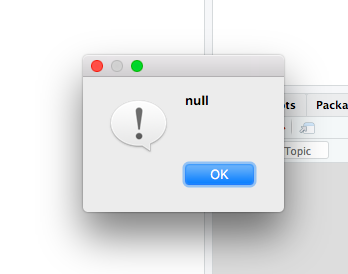
<p class="caption">(\#fig:rse-py-scripting-error-message)An Unhelpful Error Message</p>
</div>



Neither is this:

```text
System.InvalidOperationException: Nullable object must have a value.
```

or this:

```text
I tried really hard but was unable to complete your request.
You probably need to talk to a human - have you tried calling Dave?
```

Error messages are often the first thing people actually read about a piece of software
(or possibly the second if they had to install it themselves),
so they should therefore be the most carefully written documentation for that software.
A quick web search for "writing good error messages" turns up hundreds of hits,
but recommendations are often more like gripes than solid guidelines
and are usually not backed up by evidence.
What research there is gives us the following rules @Beck2016:

1.  Do not tell the user what the program did that caused the problem,
    but what the user did.
    Putting it another way,
    the message shouldn't state the effect of the error,
    it should state the cause.

2.  Be spatially correct,
    i.e.,
    point at the actual location of the error.
    Few things are as frustrating as being pointed at line 28
    when the problem is really on line 35.

3.  Do not provide tips or potential solutions.
    In most languages it is not possible to determine what the actual error is from the message with 100% certainty.
    Therefore it is better to give an as-specific-as-possible message on what went wrong without offering guidance on fixing it.
    Tips and hints could be provided by a different tool,
    but they should be based on the error message and not part of it.

4.  Be as specific as possible without ever being (or seeming) wrong:
    from a user's point of view,
    "file not found" is very different from "don't have permissions to open file" or "file is empty".

5.  Write for your audience's level of understanding.
    For example, error messages should never use programming terms more advanced than
    those you would use to describe the code the user wrote.

6.  Do not blame the user, and do not use words like fatal, illegal, etc.
    The former can frustrate—in many cases, "user error" actually isn't—and
    the latter can make people worry that the program has damaged their data,
    their computer,
    or their reputation.

7.  Do not try to make the computer sound like a human being.
    In particular, avoid humor:
    very few jokes are funny on the dozenth re-telling,
    and most users are going to see error messages at least that often.

8.  Use a consistent vocabulary.
    This rule can be hard to enforce when error messages are written by several different people,
    but putting them all in one module makes review easier.

That last suggestion deserves a little elaboration.
Most people write error messages directly in their code:

```python
try:
    # ...do something complicated...
except OSError as e:
    print('Unable to find or read file {}'.format(filename))
    sys.exit(1)
```

A better approach for large projects is to put all of the error messages in a catalog:

```python
ERROR_MESSAGES = {
    'cannot_read_file' : 'Unable to find or read file {}',
    'config_corrupted' : 'Configuration file {} corrupted',
    # ...more error messages...
}
```

and then only use messages from that catalog:

```python
from error_messages import ERROR_MESSAGES

try:
    # ...do something complicated...
except OSError as e:
    print(ERROR_MESSAGES['cannot_read_file'].format(filename))
    sys.exit(1)
```

Doing this makes it much easier to ensure that messages are consistent.
It also makes it much easier to give messages in the user's preferred language:

```python
ERROR_MESSAGES = {
    'en' : {
        'cannot_read_file' : 'Unable to find or read file {}',
        'config_corrupted' : 'Configuration file {} corrupted',
        # ...more error messages in English...
    },
    'fr' : {
        'cannot_read_file' : 'Impossible d'acceder au fichier {}',
        'config_corrupted' : 'Fichier de configuration {} corrompu',
        # ...more error messages in French...
    }
    # ...other languages...
}
```

The error report is then looked up as:

```python
ERROR_MESSAGES[user_language]['cannot_read_file']
```

where `user_language` is a two-letter code for the user's preferred language.

## Key Points {#rse-pyscripts-keypoints}


-   Libraries such as argparse can be used the efficiently handle command line arguments.
-   Most Python scripts have a similar structure that can be used as a template.


[abandonware]: glossary.html#abandonware
[absolute-error]: glossary.html#absolute-error
[absolute-path]: glossary.html#absolute-path
[accuracy]: glossary.html#accuracy
[action-make]: glossary.html#action-make
[actual-result]: glossary.html#actual-result
[advanced-r-performance]: http://adv-r.had.co.nz/Performance.html
[aggregate]: glossary.html#aggregate
[ally-skills]: https://frameshiftconsulting.com/ally-skills-workshop/
[ally]: glossary.html#ally
[anscombe-datasaurus]: https://blog.revolutionanalytics.com/2017/05/the-datasaurus-dozen.html
[assertr]: https://cran.r-project.org/web/packages/assertr/index.html
[authentic-task]: glossary.html#authentic-task
[auto-completion]: glossary.html#auto-completion
[automatic-variable-make]: glossary.html#automatic-variable-make
[bash]: glossary.html#bash
[beeswarm-plot]: glossary.html#beeswarm-plot
[bibtex]: http://www.bibtex.org/
[binary-code]: glossary.html#binary-code
[boilerplate]: glossary.html#boilerplate
[bootswatch]: https://bootswatch.com/3/
[branch-per-feature]: glossary.html#branch-per-feature-workflow
[branch]: glossary.html#branch
[broman-packages]: https://kbroman.org/pkg_primer/
[bug-report]: glossary.html#bug-report
[bug-tracker]: glossary.html#bug-tracker
[build-tool]: glossary.html#build-tool
[byte-code]: glossary.html#byte-code
[capes-gerard]: https://github.com/gcapes
[captain-awkward]: https://captainawkward.com/
[carpentries]: https://carpentries.org/
[caulfield-chorus]: https://hapgood.us/2016/05/13/choral-explanations/
[cc-0]: glossary.html#cc-0
[cc-by]: glossary.html#cc-by
[cdd]: glossary.html#cdd
[charles-rules]: http://geekfeminism.wikia.com/wiki/Charles%27_Rules_of_Argument
[checklist]: glossary.html#checklist
[checkr]: https://cran.r-project.org/web/packages/checkr/index.html
[chocolatey]: https://chocolatey.org/
[choose-license]: http://choosealicense.com/
[chunk-label]: https://yihui.name/knitr/options/#chunk-options
[cli]: glossary.html#cli
[climate-api]: http://data.worldbank.org/developers/climate-data-api
[code-coverage]: glossary.html#code-coverage
[code-smells-and-feels]: https://github.com/jennybc/code-smells-and-feels
[codecov]: https://codecov.io/
[cognitive-load]: glossary.html#cognitive-load
[command-argument]: glossary.html#command-argument
[command-flag]: glossary.html#command-flag
[command-history-unix]: glossary.html#command-history-unix
[command-option]: glossary.html#command-option
[command-shell]: glossary.html#command-shell
[command-switch]: glossary.html#command-switch
[comment]: glossary.html#comment
[commit-message]: glossary.html#commit-message
[commit]: glossary.html#commit
[commons]: glossary.html#commons
[competent-practitioner]: glossary.html#competent-practitioner
[compiled-language]: glossary.html#compiled-language
[compiler]: glossary.html#compiler
[computational-notebook]: glossary.html#computational-notebook
[conda]: https://conda.io/
[conditional-expression]: glossary.html#conditional-expression
[config-email]: mailto:gvwilson@third-bit.com
[config-repo]: https://github.com/merely-useful/merely-useful.github.io/
[confirmation-bias]: glossary.html#confirmation-bias
[continuation-prompt]: glossary.html#continuation-prompt
[continuous-integration]: glossary.html#continuous-integration
[cookiecutter]: https://drivendata.github.io/cookiecutter-data-science/
[corpus]: glossary.html#corpus
[covenant]: https://www.contributor-covenant.org
[cran]: https://cran.r-project.org/
[creative-commons]: https://creativecommons.org/
[cron]: https://en.wikipedia.org/wiki/Cron
[csv]: glossary.html#csv
[curb-cuts]: glossary.html#curb-cuts
[current-working-directory]: glossary.html#current-working-directory
[cv]: https://stats.stackexchange.com/
[data-package]: glossary.html#data-package
[dc]: https://datacarpentry.org/
[declarative-programming]: glossary.html#declarative-programming
[default-target-make]: glossary.html#default-target-make
[delimiter]: glossary.html#delimiter
[design-pattern]: glossary.html#design-pattern
[destructuring]: glossary.html#destructuring
[dictionary]: glossary.html#dictionary
[docker]: https://en.wikipedia.org/wiki/Docker_(software)
[documentation-generator]: glossary.html#documentation-generator
[doi]: glossary.html#doi
[downvote]: glossary.html#downvote
[drake]: https://ropenscilabs.github.io/drake-manual/
[dry]: glossary.html#dry
[dryad]: https://datadryad.org/
[dursi-jonathan]: https://www.dursi.ca/
[dursi-pattern-rules]: https://github.com/ljdursi/make_pattern_rules
[embedded-documentation]: glossary.html#embedded-documentation
[eniac]: glossary.html#eniac
[environment]: glossary.html#environment
[error-unexpected]: https://stackoverflow.com/questions/25889234/error-unexpected-symbol-input-string-constant-numeric-constant-special-in-my-co
[exception]: glossary.html#exception
[expected-result]: glossary.html#expected-result
[expert]: glossary.html#expert
[exploratory-programming]: glossary.html#exploratory-programming
[exponent]: glossary.html#exponent
[f1000-research]: https://f1000research.com/
[false-beginner]: glossary.html#false-beginner
[false-negative]: glossary.html#false-negative
[false-positive]: glossary.html#false-positive
[faq]: glossary.html#faq
[feature-request]: glossary.html#feature-request
[figshare]: https://figshare.com/
[filename-extension]: glossary.html#filename-extension
[filename-stem]: glossary.html#filename-stem
[filesystem]: glossary.html#filesystem
[filter]: glossary.html#filter
[fixture]: glossary.html#fixture
[flag-variable]: glossary.html#flag-variable
[folder]: glossary.html#folder
[forge]: glossary.html#forge
[full-identifier-git]: glossary.html#full-identifier-git
[fully-qualified-name]: glossary.html#fully-qualified-name
[function-make]: glossary.html#function-make
[gdb]: https://www.gnu.org/software/gdb
[geek-feminism]: http://geekfeminism.wikia.com/
[ggplot2]: https://ggplot2.tidyverse.org/
[gh-myoctocat]: https://myoctocat.com
[gh-pages]: https://pages.github.com/
[git-branch]: glossary.html#git-branch
[git-clone]: glossary.html#git-clone
[git-conflict]: glossary.html#git-conflict
[git-fork]: glossary.html#git-fork
[git-merge]: glossary.html#git-merge
[git-pull]: glossary.html#git-pull
[git-push]: glossary.html#git-push
[git-ssh-bitbucket]: https://confluence.atlassian.com/bitbucket/set-up-ssh-for-git-728138079.html
[git-ssh-github]: https://help.github.com/articles/generating-ssh-keys
[git-ssh-gitlab]: https://about.gitlab.com/2014/03/04/add-ssh-key-screencast/
[git-stage]: glossary.html#git-stage
[git]: glossary.html#git
[github-pages]: https://pages.github.com/
[github-zenodo-tutorial]: https://guides.github.com/activities/citable-code/
[github]: http://github.com
[github]: http://github.com
[gitkraken]: https://www.gitkraken.com/
[gnu-make-other-vars]: https://www.gnu.org/software/make/manual/html_node/Special-Variables.html
[gnu-make]: http://www.gnu.org/software/make/
[gnu-man-coreutils]: http://www.gnu.org/software/coreutils/manual/coreutils.html
[gnu-man]: http://www.gnu.org/manual/manual.html
[go-fair]: https://www.go-fair.org/fair-principles/
[gpl]: glossary.html#gpl
[gui]: glossary.html#gui
[gutenberg]: https://www.gutenberg.org/
[hitchhiker]: glossary.html#hitchhiker
[home-directory]: glossary.html#home-directory
[huff-testing]: https://github.com/katyhuff/python-testing
[impostor-syndrome]: glossary.html#impostor-syndrome
[in-place-operator]: glossary.html#in-place-operator
[ini-format]: https://en.wikipedia.org/wiki/INI_file
[insight]: https://www.insightdatascience.com/
[install]: glossary.html#install
[intellij-idea]: https://www.jetbrains.com/idea/
[interpeter]: glossary.html#interpeter
[interpreted-language]: glossary.html#interpreted-language
[interruption-bingo]: glossary.html#interruption-bingo
[iso-date-format]: glossary.html#iso-date-format
[issue-label]: glossary.html#issue-label
[issue-tracking-system]: glossary.html#issue-tracking-system
[issue]: glossary.html#issue
[join]: glossary.html#join
[joss]: https://joss.theoj.org/
[json]: glossary.html#json
[jupyter]: http://jupyter.org/
[jupytext]: https://jupytext.readthedocs.io/en/latest/introduction.html
[lbyl-vs-eafp]: https://blogs.msdn.microsoft.com/pythonengineering/2016/06/29/idiomatic-python-eafp-versus-lbyl/
[lc]: https://librarycarpentry.org
[learned-helplessness]: glossary.html#learned-helplessness
[library]: glossary.html#library
[lint]: https://en.wikipedia.org/wiki/Lint_(software)
[linter]: glossary.html#linter
[lme4]: https://cran.r-project.org/web/packages/lme4/vignettes/lmer.pdf
[log-file]: glossary.html#log-file
[loop-body]: glossary.html#loop-body
[loop-unix]: glossary.html#loop-unix
[magic-number]: glossary.html#magic-number
[magnitude]: glossary.html#magnitude
[make]: https://www.gnu.org/software/make/
[makefile]: glossary.html#makefile
[mantissa]: glossary.html#mantissa
[markdown]: https://en.wikipedia.org/wiki/Markdown
[marthas-rules]: glossary.html#marthas-rules
[mental-model]: glossary.html#mental-model
[mertz-documentation]: https://realpython.com/documenting-python-code/
[mit-license]: glossary.html#mit-license
[model-coc]: http://geekfeminism.wikia.com/wiki/Conference_anti-harassment/Policy
[namespace]: glossary.html#namespace
[nano]: glossary.html#nano
[ngo]: glossary.html#ngo
[noller-a-lot-happens]: http://jessenoller.com/blog/2015/9/27/a-lot-happens
[noller-sequel]: http://jessenoller.com/blog/2015/10/31/community-boundaries
[novice]: glossary.html#novice
[numpy-docstring]: https://numpydoc.readthedocs.io/en/latest/format.html
[object]: glossary.html#object
[oop]: glossary.html#oop
[open-license]: glossary.html#open-license
[open-science]: glossary.html#open-science
[openrefine]: http://openrefine.org/
[operating-system]: glossary.html#operating-system
[operational-test]: glossary.html#operational-test
[oppression]: glossary.html#oppression
[orcid]: https://orcid.org/
[orthogonality]: glossary.html#orthogonality
[orwells-rules]: https://en.wikipedia.org/wiki/Politics_and_the_English_Language#Remedy_of_Six_Rules
[osf]: https://osf.io/
[osi-license-list]: http://opensource.org/licenses
[overloading]: glossary.html#overloading
[package]: glossary.html#package
[pager]: glossary.html#pager
[pandas-docstring]: https://pandas.pydata.org/pandas-docs/stable/development/contributing_docstring.html
[pandoc-markdown]: https://pandoc.org/MANUAL.html#pandocs-markdown
[parent-directory]: glossary.html#parent-directory
[parking-lot]: glossary.html#parking-lot
[path-coverage]: glossary.html#path-coverage
[path]: glossary.html#path
[pattern-rule-make]: glossary.html#pattern-rule-make
[peer-action]: glossary.html#peer-action
[pentium-div-bug]: https://en.wikipedia.org/wiki/Pentium_FDIV_bug
[pep-8-hobgoblin]: https://www.python.org/dev/peps/pep-0008/#a-foolish-consistency-is-the-hobgoblin-of-little-minds
[pep-8]: https://www.python.org/dev/peps/pep-0008/
[phony-target-make]: glossary.html#phony-target-make
[pipe-unix]: glossary.html#pipe-unix
[pothole-case]: glossary.html#pothole-case
[precision]: glossary.html#precision
[prerequisite-make]: glossary.html#prerequisite-make
[privilege]: glossary.html#privilege
[procedural-programming]: glossary.html#procedural-programming
[process]: glossary.html#process
[product-manager]: glossary.html#product-manager
[prompt]: glossary.html#prompt
[provenance]: glossary.html#provenance
[pull-request]: glossary.html#pull-request
[pypi]: https://pypi.org/
[pytest-mpl]: https://github.com/matplotlib/pytest-mpl
[pytest]: http://pytest.org/
[python-102]: https://python-102.readthedocs.io/
[python-exceptions]: https://docs.python.org/3/library/exceptions.html#exception-hierarchy
[python]: glossary.html#python
[r-here-pkg]: https://here.r-lib.org/
[r-markdown]: https://rmarkdown.rstudio.com/
[r-pkg-book-testing]: http://r-pkgs.had.co.nz/tests.html
[r-pkg-book]: http://r-pkgs.had.co.nz/
[r-style-guide-files]: https://style.tidyverse.org/files.html
[r-style-guide]: https://style.tidyverse.org/
[r-testthat]: https://testthat.r-lib.org/
[r]: https://cran.r-project.org/
[raise-exception]: glossary.html#raise-exception
[raster-image]: glossary.html#raster-image
[readthedocs]: https://docs.readthedocs.io/en/latest/
[recursion]: glossary.html#recursion
[redirection]: glossary.html#redirection
[refactoring]: glossary.html#refactoring
[regular-expression]: glossary.html#regular-expression
[relative-error]: glossary.html#relative-error
[relative-path]: glossary.html#relative-path
[remote-repository]: glossary.html#remote-repository
[repl]: glossary.html#repl
[repository]: glossary.html#repository
[reprex]: glossary.html#reprex
[reproducible-research]: glossary.html#reproducible-research
[requests]: http://docs.python-requests.org
[restructured-text]: glossary.html#restructured-text
[revision]: glossary.html#revision
[rmd-documentation]: https://bookdown.org/yihui/rmarkdown/html-document.html#appearance-and-style
[rmd-themes]: FIXME
[root-directory]: glossary.html#root-directory
[rothenberg-backup]: http://wiki.c2.com/?ComputerErrorHaiku
[rothenberg-quote]: https://www.clir.org/wp-content/uploads/sites/6/ensuring.pdf
[roxygen-md]: https://cran.r-project.org/web/packages/roxygen2/vignettes/markdown.html
[rse]: glossary.html#rse
[rstudio-addin]: https://rstudio.github.io/rstudioaddins/
[rstudio-cloud]: https://rstudio.cloud/
[rstudio-ide]: https://www.rstudio.com/products/rstudio/
[rstudio-r-projects]: https://support.rstudio.com/hc/en-us/articles/200526207-Using-Projects
[rstudio]: https://rstudio.com/
[rubber-duck-debugging]: https://en.wikipedia.org/wiki/Rubber_duck_debugging
[rule-make]: glossary.html#rule-make
[sci-reproducibility]: https://en.wikipedia.org/wiki/Reproducibility
[script]: glossary.html#script
[select-docs]: https://dplyr.tidyverse.org/reference/select.html#useful-functions
[sense-vote]: glossary.html#sense-vote
[setuptools]: https://setuptools.readthedocs.io/
[shebang]: glossary.html#shebang
[shell-script]: glossary.html#shell-script
[short-circuit-test]: glossary.html#short-circuit-test
[short-identifier-git]: glossary.html#short-identifier-git
[side-effects]: glossary.html#side-effects
[sign]: glossary.html#sign
[silent-failure]: glossary.html#silent-failure
[situational-action]: glossary.html#situational-action
[snake-case]: glossary.html#snake-case
[snakemake]: https://snakemake.readthedocs.io/
[so-bash]: https://stackoverflow.com/questions/tagged/bash
[so-keywords-builtins]: https://stackoverflow.com/a/22864250/2166823
[so-mre-p]: https://stackoverflow.com/questions/20109391/how-to-make-good-reproducible-pandas-examples
[so-mre-r]: https://stackoverflow.com/questions/5963269/how-to-make-a-great-r-reproducible-example
[so-mre]: https://stackoverflow.com/help/minimal-reproducible-example
[so]: https://stackoverflow.com/
[source-code]: glossary.html#source-code
[sphinx]: http://www.sphinx-doc.org/en/master/
[srinath-ashwin]: https://ccit.clemson.edu/research/researcher-profiles/ashwin-srinath/
[stack-exchange-data-explorer]: https://data.stackexchange.com/
[stack-overflow-good-question]: https://stackoverflow.com/help/how-to-ask
[stack-overflow]: https://stackoverflow.com/
[stack-printer]: http://www.stackprinter.com/
[standard-error]: glossary.html#standard-error
[standard-input]: glossary.html#standard-input
[standard-output]: glossary.html#standard-output
[stderr]: glossary.html#stderr
[stdin]: glossary.html#stdin
[stdout]: glossary.html#stdout
[streaming-data]: glossary.html#streaming-data
[styler-pkg]: http://styler.r-lib.org/
[subcommand]: glossary.html#subcommand
[subdirectory]: glossary.html#subdirectory
[subsampling]: glossary.html#subsampling
[sustainable-software]: glossary.html#sustainable-software
[svg]: glossary.html#svg
[swc-git]: https://swcarpentry.github.io/git-novice/
[swc-make]: https://github.com/swcarpentry/make-novice
[swc-python]: https://swcarpentry.github.io/python-novice-inflammation/
[swc-r]: https://swcarpentry.github.io/r-novice-gapminder/
[swc-shell]: https://swcarpentry.github.io/shell-novice/
[swc]: http://software-carpentry.org
[syntax-highlighting]: glossary.html#syntax-highlighting
[synthetic-data]: glossary.html#synthetic-data
[tab-completion]: glossary.html#tab-completion
[tag]: glossary.html#tag
[target-make]: glossary.html#target-make
[target]: glossary.html#target
[tdd]: glossary.html#tdd
[tdda-site]: http://www.tdda.info/
[test-error]: glossary.html#test-error
[test-failure]: glossary.html#test-failure
[test-framework]: glossary.html#test-framework
[test-isolation]: glossary.html#test-isolation
[test-runner]: glossary.html#test-runner
[test-success]: glossary.html#test-success
[testpypi]: https://test.pypi.org
[tf-idf]: https://en.wikipedia.org/wiki/Tf%E2%80%93idf
[three-stickies]: glossary.html#three-stickies
[ticket]: glossary.html#ticket
[ticketing-system]: glossary.html#ticketing-system
[tidy-data]: glossary.html#tidy-data
[timestamp]: glossary.html#timestamp
[tinytex]: https://yihui.name/tinytex/
[tldr-gpl]: https://tldrlegal.com/license/gnu-general-public-license-v3-(gpl-3)
[tldr]: glossary.html#tldr
[tolerance]: glossary.html#tolerance
[transitive-dependency]: glossary.html#transitive-dependency
[travis-ci]: https://travis-ci.org/
[triage]: glossary.html#triage
[troy-meetings]: https://chelseatroy.com/2018/03/29/why-do-remote-meetings-suck-so-much/
[tuple]: glossary.html#tuple
[tyranny-structurelessness]: http://www.jofreeman.com/joreen/tyranny.htm
[ukho-accessibility]: https://ukhomeoffice.github.io/accessibility-posters/posters/accessibility-posters.pdf
[unit-test]: glossary.html#unit-test
[unix-shell]: glossary.html#unix-shell
[unpaywall]: http://unpaywall.org/
[update-operator]: glossary.html#update-operator
[upvote]: glossary.html#upvote
[usethis]: https://usethis.r-lib.org/
[uwm-git-lesson]: https://uw-madison-datascience.github.io/git-novice-custom/
[validate-r]: https://cran.r-project.org/web/packages/validate/index.html
[validation]: glossary.html#validation
[vanderplas-licensing]: http://www.astrobetter.com/blog/2014/03/10/the-whys-and-hows-of-licensing-scientific-code/
[variable-make]: glossary.html#variable-make
[variable]: glossary.html#variable
[vector-image]: glossary.html#vector-image
[verification]: glossary.html#verification
[version-control]: https://peerj.com/preprints/3159/
[violin-plot]: glossary.html#violin-plot
[virtual-environment]: glossary.html#virtual-environment
[vs-code]: https://code.visualstudio.com/
[wickham-packages]: http://r-pkgs.had.co.nz/
[wiki-rubber-duck-debugging]: https://en.wikipedia.org/wiki/Rubber_duck_debugging
[wikipedia-iso-country]: http://en.wikipedia.org/wiki/ISO_3166-1_alpha-3
[wildcard]: glossary.html#wildcard
[wing-ide]: https://wingware.com/
[womens-pockets-data]: https://github.com/the-pudding/data/blob/master/pockets/README.md
[womens-pockets]: https://pudding.cool/2018/08/pockets/
[working-memory]: glossary.html#working-memory
[wrap-code]: glossary.html#wrap-code
[xcode]: https://developer.apple.com/xcode/ide/
[xkcd-duty-calls]: https://xkcd.com/386/
[yaml]: https://bookdown.org/yihui/rmarkdown/html-document.html
[zenodo]: https://zenodo.org/
[zipfs-law]: http://en.wikipedia.org/wiki/Zipf%27s_law

<!--chapter:end:rse-py-scripting.Rmd-->

# Git at the Command Line {#rse-git-cmdline}


The first two volumes in this series introduced version control with Git
using a graphical interface like [GitKraken][gitkraken] or [the RStudio IDE][rstudio-ide].
These interfaces are actually wrappers around Git's original command-line interface,
which allows us to access all of Git's features.
This lesson describes how the basic cycle of add, commit, push, and pull works at the command line.

## How can I set up Git for command-line use? {#rse-git-cmdline-setup}

On a command line,
we write Git commands as <code>git <em>verb</em> <em>options</em></code>,
where the [subcommand][subcommand] <code><em>verb</em></code> tells Git what we want to do
and <code><em>options</em></code> provide any additional optional information that subcommand needs.
Using this syntax,
the first thing we need to do is configure Git:

```shell
$ git config --global user.name "Frances Bilas"
$ git config --global user.email "frances@eniac.org"
```

(Please use your own name and email address instead of the one shown.)
Here,
`config` is the verb
and the rest of the command are options.
We put the name in quotation marks because it contains a space;
we don't actually need to quote the email address,
but do so for consistency.
Since we are going to be using [GitHub][github],
the email address should be the same as the one we used when setting up our GitHub account.

These two commands only need to be run once:
the flag `--global` tells Git to use the settings for all of our projects on this computer.
We can re-run these commands any time if you want to change our details.
We can also check our settings:

```shell
$ git config --list
```

```text
user.name=Frances Bilas
user.email=frances@eniac.org
core.autocrlf=input
core.editor=nano
core.repositoryformatversion=0
core.filemode=true
core.bare=false
core.ignorecase=true
```

> **Git Help and Manual**
>
> If you forget a Git command,
> we can get a list of the ones available using `--help`.
> This option will also give us more information about specific commands.
>
> ```shell
> $ git --help
> $ git config --help
> ```

## How can I create a new repository? {#rse-git-cmdline-repos}

Once Git is configured, we can start using it.
This section will cover how to create a Git repository associated with a project folder.
As a running example,
we will watch as Frances and her colleague Jean Jennings write a history of the [ENIAC project][eniac].
First,
let's create a directory for our work beneath our home directory and go into it:

```shell
$ cd ~
$ mkdir eniac
$ cd eniac
```

We then tell Git to make this directory a [repository][repository],
i.e.,
a place where Git can store versions of our files:

```shell
$ git init .
```

```text
Initialized empty Git repository in /Users/frances/eniac/.git/
```

`ls` seems to show that the directory is still empty:

```shell
$ ls
```

But if we add the `-a` flag to show everything,
we can see that Git has created a hidden directory within `eniac` called `.git`:

```shell
$ ls -a
```

```text
.	..	.git
```

Git stores information about the project in this special subdirectory.
If we ever delete it,
we will lose that history.

We can check that everything is set up correctly
by asking Git to tell us the status of our project:

```shell
$ git status
```

```text
# On branch master
#
# Initial commit
#
nothing to commit (create/copy files and use "git add" to track)
```

## How can I save and track changes? {#rse-git-cmdline-changes}

Now that we have a repository for our work,
we can add files to it and track their history.
Most of the commands we will use (such as `git add` and `git commit`) will sound familiar,
as the same terminology is used in graphical interfaces like [GitKraken][gitkraken] and [the RStudio IDE][rstudio-ide].

To start, let's make sure we're still in the right directory:

```shell
$ cd ~/eniac
```

Let's use our favorite text editor
to create a file called `names.txt` that contains
the names of the original six ENIAC programmers:

```text
Frances Bilas
Jean Jennings
Ruth Lichterman
Kay Mcnulty
Betty Synder
```

(There are some typos and omissions here that we will fix later.)
If we check the status of our project,
Git tells us that we have a new file:

```shell
$ git status
```

```text
On branch master

No commits yet

Untracked files:
  (use "git add <file>..." to include in what will be committed)

	names.txt

nothing added to commit but untracked files present (use "git add" to track)
```

"Untracked files" means there is a file in the directory whose history Git isn't tracking.
We can tell Git to start keeping track of of it using `git add`:

```shell
$ git add names.txt
```

and then check that it did what we wanted:

```shell
$ git status
```

```text
On branch master

No commits yet

Changes to be committed:
  (use "git rm --cached <file>..." to unstage)

	new file:   names.txt
```

Git now knows that it's supposed to keep track of `names.txt`,
but it hasn't actually recorded any changes yet.
To do taht,
we need to tell it to [commit][commit] our work:

```shell
$ git commit -m "Starting notes on ENIAC personnel"
```

```text
[master (root-commit) 8e966b5] Starting notes on ENIAC personnel
 1 file changed, 6 insertions(+)
 create mode 100644 names.txt
```

When we run `git commit`,
Git takes everything we have told it to save by using `git add`
and stores a copy permanently inside the special `.git` directory.
This permanent copy is called a [commit][commit] or a [revision][revision].
In this case,
its [short identifier][short-identifier-git] is `8e966b5`;
your commit may have another identifier.

We use the `-m` option (short for <strong>m</strong>essage)
to record a short descriptive that will remind us later what we did and why.
If we just run `git commit` without the `-m` option,
Git will launch `nano`
(or whatever other editor is configured using `git config --global core.editor`)
so that we can write a longer message.
Once again,
we put the message in double quotes because it contains spaces.

If we run `git status` now,
Git tells us that everything is up to date:

```shell
$ git status
```

```text
On branch master
nothing to commit, working directory clean
```

If we want to know what we've done recently,
we can display the project's history using `git log`:

```shell
$ git log
```

```text
commit 8e966b5f0703d347e4f84817f12b48f456a58ae1
Author: Frances Bilas <frances@eniac.org>
Date:   Thu Oct 10 09:24:04 2019 -0400

    Starting notes on ENIAC personnel
```

`git log` lists all commits made to a repository in reverse chronological order.
The listing for each commit includes
the commit's [full identifier][full-identifier-git]
(which starts with the same characters as the short identifier printed by `git commit` earlier),
the commit's author,
when it was created,
and the log message Git was given when the commit was created.

Now suppose Frances goes and corrects the two typos
("Mcnulty" should be "McNulty" and "Synder" should be "Snyder")
so that the file contains this:

```text
Frances Bilas
Jean Jennings
Ruth Lichterman
Kay McNulty
Betty Snyder
```

When we run `git status` now,
it tells us that a file it already knows about has been modified:

```shell
$ git status
```

```text
On branch master
Changes not staged for commit:
  (use "git add <file>..." to update what will be committed)
  (use "git checkout -- <file>..." to discard changes in working directory)

	modified:   names.txt

no changes added to commit (use "git add" and/or "git commit -a")
```

The last line is the key phrase:
"no changes added to commit".
We have changed this file,
but we haven't told Git we want to save those changes
(which we do with `git add`)
nor have we saved them
(which we do with `git commit`).

Let's do that now.
It is good practice to review our changes before saving them,
which we can do with `git diff`.
This command shows us the differences between the current state of our repository
and the most recently saved version:

```shell
$ git diff
```

```text
diff --git a/names.txt b/names.txt
index deca855..46a1948 100644
--- a/names.txt
+++ b/names.txt
@@ -1,5 +1,5 @@
 Frances Bilas
 Jean Jennings
 Ruth Lichterman
-Kay Mcnulty
-Betty Synder
+Kay McNulty
+Betty Snyder
```

The output is cryptic (even by the standards of the Unix command line)
because it is actually a series of commands telling editors and other tools
how to turn the file we *had* into the file we *have*.
If we break it down into pieces:

1.  The first line tells us that Git is producing output
    in the format of the Unix `diff` command.
2.  The second line tells exactly which versions of the file Git is comparing:
    `deca855` and `46a1948` are unique computer-generated labels for those versions.
3.  The third and fourth lines once again show the name of the file being changed;
    the name appears twice in case we are renaming a file as well as modifying it.
4.  The remaining lines show us the changes and the lines on which they occur.
    A minus sign `-` in the first column indicates a line that is being removed,
    while a plus sign `+` shows a line that is being added.

After reviewing our change
we can commit it just as we did before:

```shell
$ git commit -m "Correcting typos in names"
```

```text
On branch master
Changes not staged for commit:
	modified:   names.txt

no changes added to commit
```

Whoops:
we forgot to add the file to the set of things we want to commit.
Let's fix that:

```shell
$ git add names.txt
$ git status
```

```text
On branch master
Changes to be committed:
  (use "git reset HEAD <file>..." to unstage)

	modified:   names.txt
```

```shell
$ git commit -m "Correcting typos in names"
```

```text
[master 61d3964] Correcting typos in names
 1 file changed, 2 insertions(+), 2 deletions(-)
```

If we are sure we want to commit all of our changes,
we can combine `git add` and `git commit` into a single command.
Let's add a missing name to the bottom of our file:

```text
Frances Bilas
Jean Jennings
Ruth Lichterman
Kay McNulty
Betty Snyder
Marlyn Wescoff
```

and then save our work in one step by giving `git commit` the `-a` option:

```shell
$ git commit -a -m "Adding missing name"
```

```text
[master f865209] Adding missing name
 1 file changed, 1 insertion(+)
```

## How can I synchronize with other repositories? {#rse-git-cmdline-remotes}

Sooner or later our computer will experience a hardware failure,
be stolen,
or be thrown in the lake by someone who thinks we shouldn't spend the *entire* vacation working on our thesis.
Even before that happens
we will probably want to collaborate with others,
which we can do by linking our local repository to one stored on a hosting service such as [GitHub][github].

The first step in doing that is to create an account on GitHub if we don't already have one,
and then to create a new repository to synchronize with.
The remote repository doesn't have to have the same name as the local one,
but we will probably get confused if they are different,
so the repository we create on GitHub will also be called `eniac`.

The next step is to connect the two repositories.
We do this by making the GitHub repository a [remote][remote-repository] for the local repository.
The home page of the repository on GitHub includes the string we need to identify it
(Figure \@ref(fig:rse-git-cmdline-repo-link)).

<div class="figure">

<p class="caption">(\#fig:rse-git-cmdline-repo-link)Where to Find the Repository Link</p>
</div>

We can click on "HTTPS" to change the URL from SSH to HTTPS
and then copy that URL.

> **HTTPS vs. SSH**
>
> We use HTTPS here because it does not require additional configuration.
> You may want to set up SSH access,
> which is a bit more secure,
> by following one of the tutorials from [GitHub][git-ssh-github],
> [Bitbucket][git-ssh-bitbucket],
> or [GitLab][git-ssh-gitlab]
> (the last of which includes a screencast).

Next,
let's go into the local `eniac` repository and run this command:

```shell
$ git remote add origin https://github.com/frances/eniac.git
```

Make sure to use the URL for your repository instead of the one shown:
the only difference should be that it includes your username instead of `frances`.

A Git remote is like a bookmark:
it gives a short name to a URL.
In this case,
the remote's name is `origin`;
we could use anything we want,
but `origin` is Git's default,
so we will stick with it.
We can check that the command has worked by running `git remote -v`
(where the `-v` option is short for <strong>v</strong>erbose):

```shell
$ git remote -v
```

```text
origin	https://github.com/frances/eniac.git (fetch)
origin	https://github.com/frances/eniac.git (push)
```

Git displays two lines because it's actually possible to set up a remote
to download from one URL but upload to another.
Sensible people don't do this,
so we won't explore this possibility any further.

Once we have set up the remote,
we can [push][git-push] the work we have done so far to the repository on GitHub:

```shell
$ git push origin master
```

This may prompt us to enter our username and password;
once we do that,
we see a few lines of administrative information:


```text
Counting objects: 9, done.
Delta compression using up to 4 threads.
Compressing objects: 100% (6/6), done.
Writing objects: 100% (9/9), 833 bytes | 277.00 KiB/s, done.
Total 9 (delta 1), reused 0 (delta 0)
remote: Resolving deltas: 100% (1/1), done.
To github.com:frances/eniac.git
 * [new branch]      master -> master
```

If we view our GitHub repository in the browser,
we will now see that it includes `names.txt`
along with all of the commits we made to create it (Figure \@ref(fig:rse-git-cmdline-history)).

<div class="figure">

<p class="caption">(\#fig:rse-git-cmdline-history)Repository History</p>
</div>

We can now [pull][git-pull] changes from the remote repository to the local one as well:

```shell
$ git pull origin master
```

```text
From https://github.com/frances/eniac
 * branch            master     -> FETCH_HEAD
Already up-to-date.
```

Pulling has no effect in this case
because the two repositories are already synchronized.

## How can I explore a project's history? {#rse-git-cmdline-history}

We have now made three changes to our project.
Git lets us look at the previous versions of the project files
and restore specific files to earlier states if we want to.
To do this,
we need to use an identifier that indicates the versions we want.

There are two ways to do this,
which are similar in spirit to [absolute][absolute-path] and [relative][relative-path] paths.
The "absolute" version is the unique identifier that Git gives to each commit.
These identifiers are 40 characters long,
but in most situations Git will let us use just the first half dozen characters or so.
For example,
if we run `git log` right now,
it shows us something like this:

```text
commit f86520952f1f4ed3751ff407673203a57dab633c
Author: Frances Bilas <frances@eniac.org>
Date:   Thu Oct 10 09:41:24 2019 -0400

    Adding missing name

commit 61d3964f81a081d80dc49d9610d5bcbe454b2ad6
Author: Frances Bilas <frances@eniac.org>
Date:   Thu Oct 10 09:38:12 2019 -0400

    Correcting typos in names

commit 8e966b5f0703d347e4f84817f12b48f456a58ae1
Author: Frances Bilas <frances@eniac.org>
Date:   Thu Oct 10 09:30:03 2019 -0400

    Starting notes on ENIAC personnel
```

If we add a title to the top of `names.txt` so that it contains:

```text
Personnel:
Frances Bilas
Jean Jennings
Ruth Lichterman
Kay McNulty
Betty Snyder
Marlyn Wescoff
```

then `git diff` on its own will show the difference between the file as it is
and the most recent version:

```text
diff --git a/names.txt b/names.txt
index 53b863e..fddc85e 100644
--- a/names.txt
+++ b/names.txt
@@ -1,3 +1,4 @@
+Personnel:
 Frances Bilas
 Jean Jennings
 Ruth Lichterman
```

but `git diff -r 61d3964` shows the difference between the current state
and the file as it was after that commit:

```text
diff --git a/names.txt b/names.txt
index 46a1948..fddc85e 100644
--- a/names.txt
+++ b/names.txt
@@ -1,5 +1,7 @@
+Personnel:
 Frances Bilas
 Jean Jennings
 Ruth Lichterman
 Kay McNulty
 Betty Snyder
+Marlyn Wescoff
```

Note that you may need to use a different identifier than `61d3964`.
Note also that we have *not* committed this change:
we will look at ways of undoing it in the next section.

The "relative" version of history relies on a special identifier called `HEAD`,
which always refers to the most recent version in the repository.
`git diff -r HEAD` (where the option `-r` is short for <strong>r</strong>evision)
shows the same thing as `git diff`.
Instead of typing in a version identifier to back up one commit,
though,
we can simply use `HEAD~1` (where `~` is the tilde symbol).
This shorthand is read "HEAD minus one",
and gives us the difference to the *previous* saved version.
`git diff -r HEAD~2` goes back two revisions and so on.

We can also look at the differences between two saved versions
by separating their identifiers with two dots `..` like this:

```shell
$ git diff -r HEAD~1..HEAD~2
```

```text
diff --git a/names.txt b/names.txt
index 46a1948..deca855 100644
--- a/names.txt
+++ b/names.txt
@@ -1,5 +1,5 @@
 Frances Bilas
 Jean Jennings
 Ruth Lichterman
-Kay McNulty
-Betty Snyder
+Kay Mcnulty
+Betty Synder
```

If we want to see the changes made in a particular commit,
we can use `git show`;
we do not need the `-r` option in this case:

```shell
$ git show HEAD~2 names.txt
```

```text
commit 8e966b5f0703d347e4f84817f12b48f456a58ae1
Author: Frances Bilas <frances@eniac.org>
Date:   Thu Oct 10 09:30:03 2019 -0400

    Starting notes on ENIAC personnel

diff --git a/names.txt b/names.txt
new file mode 100644
index 0000000..deca855
--- /dev/null
+++ b/names.txt
@@ -0,0 +1,5 @@
+Frances Bilas
+Jean Jennings
+Ruth Lichterman
+Kay Mcnulty
+Betty Synder
```

## How can I restore old versions of files? {#rse-git-cmdline-restore}

We can see what we changed,
but how can we restore it?
Let's suppose we change our mind about the last update to `names.txt`
before we add it or commit it.
`git status` tells us that the file has been changed,
but those changes haven't been [staged][git-stage]:

```shell
$ git status
```

```text
On branch master
Changes not staged for commit:
  (use "git add <file>..." to update what will be committed)
  (use "git checkout -- <file>..." to discard changes in working directory)

    modified:   names.txt

no changes added to commit (use "git add" and/or "git commit -a")
```

We can put things back the way they were in the last saved revision using `git checkout`:

```shell
$ git checkout HEAD names.txt
$ git status
```

```text
On branch master
nothing to commit, working tree clean
```

```shell
$ cat names.txt
```

```text
Frances Bilas
Jean Jennings
Ruth Lichterman
Kay McNulty
Betty Snyder
Marlyn Wescoff
```

As its name suggests,
`git checkout` checks out (i.e., restores) an old version of a file.
In this case,
we told Git to recover the version of the file saved in `HEAD`,
i.e.,
in the most recent commit.
We can use a commit identifier to go back as far as we want:

```shell
$ git checkout 8e966b5 names.txt
$ cat names.txt
```

```text
Frances Bilas
Jean Jennings
Ruth Lichterman
Kay Mcnulty
Betty Synder
```

Doing this does *not* change the history:
`git log` still shows our three commits.
Instead,
it replaces the content of the file with the old content:

```shell
$ git status
```

```text
On branch master
Changes to be committed:
  (use "git reset HEAD <file>..." to unstage)

	modified:   names.txt
```

Notice that the changes have already been added to the staging area for new commits.
We can bring the file back in sync with the most recent commit using `git checkout`:

```shell
$ git checkout HEAD names.txt
$ git status
```

```text
On branch master
nothing to commit, working tree clean
```

```shell
$ cat names.txt
```

```text
Frances Bilas
Jean Jennings
Ruth Lichterman
Kay McNulty
Betty Snyder
Marlyn Wescoff
```

Since we didn't commit the change in which we added the line `Personnel`,
that work is now lost:
Git can only go back and forth between committed versions of files.

## How can I tell Git to ignore some files? {#rse-git-cmdline-ignore}

We have only modified one file in this tutorial,
but everything we have done works just as well with multiple files.
Sometimes,
though,
we don't want Git to track files' history.
For example,
we might want to track text files with names ending in `.txt`
but not data files with names ending in `.dat`.

To stop Git from telling us about these files every time we call `git status`,
we can create a file in the root directory of our project called `.gitignore`.
This file can contain filenames like `thesis.pdf`
or [wildcard][wildcard] patterns like `*.dat`.
Each must be on a line of its own,
and Git will ignore anything that matches any of these lines.

> **Remember to Ignore**
>
> Don't forget to commit `.gitignore` to your repository
> so that Git knows to use it.

## Exercises {#rse-git-cmdline-exercises}

### Places to create Git repositories {#rse-git-cmdline-ex-places}

Along with information about the ENIAC project,
Frances would also like to keep some notes on the UNIVAC.
Despite her colleagues' concerns,
Frances creates a `univac` project inside her `eniac` project as follows:

```shell
$ cd ~/eniac     # go into eniac directory, which is already a Git repository
$ mkdir univac   # make a subdirectory eniac/univac
$ cd univac      # go into univac subdirectory
$ git init       # make univac a Git repository
```

Is the `git init` command that she runs inside the `univac` subdirectory
required for tracking files stored there?

### Committing changes {#rse-git-cmdline-ex-commit}

Which command(s) below would save changes to `myfile.txt` to a local Git repository?

1. ```shell
   $ git commit -m "my recent changes"
   ```

2. ```shell
   $ git init myfile.txt
   $ git commit -m "my recent changes"
   ```

3. ```shell
   $ git add myfile.txt
   $ git commit -m "my recent changes"
   ```

4. ```shell
   $ git commit -m myfile.txt "my recent changes"
   ```

### Committing multiple files {#rse-git-cmdline-ex-multiple}

The staging area can hold changes from any number of files
that you want to commit as a single snapshot.

1.  Add some commas to `names.txt` to separate first and last names.

2.  Create a new file `old-computers.txt`
    and write a few lines about the first computer you remember seeing or using.

3.  Add changes from both files to the staging area
    and commit those changes.

### Write a biography {#rse-git-cmdline-ex-bio}

-   Create a new Git repository on your computer called `bio`.
-   Write a three-line biography for yourself in a file called `me.txt` and commit your changes.
-   Modify one line and add a fourth line.
-   Display the differences between the file's original state and its updated state.

### Ignoring nested files {#rse-git-cmdline-ex-ignore-nested}

Suppose our project has a directory `results` with two subdirectories called `data` and `plots`.
How would we ignore all of the files in `results/plots`
but not ignore files in `results/data`?

### Including specific files {#rse-git-cmdline-ex-include}

How would you ignore all `.dat` files in your root directory except for `final.dat`?
(Hint: find out what the exclamation mark `!` means in a `.gitignore` file.)

### Exploring the GitHub interface {#rse-git-cmdline-ex-github-interface}

Browse to your `eniac` repository on GitHub.
Under the `Code` tab,
find and click on the text that says "NN commits" (where "NN" is some number).
Hover over and click on the three buttons to the right of each commit.
What information can you gather/explore from these buttons?
How would you get that same information in the shell?

### GitHub timestamps {#rse-git-cmdline-ex-timestamp}

-   Create a remote repository on GitHub.
-   Push the contents of your local repository to the remote.
-   Make changes to your local repository and push these changes as well.
-   Go to the repo you just created on GitHub and check the timestamps of the files.

How does GitHub record times, and why?

### Push versus commit {#rse-git-cmdline-ex-push-commit}

How is `git push` different from `git commit`?

### License and README files {#rse-git-cmdline-ex-boilerplate}

When we initialized our GitHub repo,
we didn't add a `README.md` or license file.
If we had,
what would have happened when we tried to link our local and remote repositories?

### Recovering older versions of a file {#rse-git-cmdline-ex-recover}

Jennifer made changes this morning to a shell script called `data_cruncher.sh`
that she has been working on for weeks.
Her changes broke the script,
and she has now spent an hour trying to get it back in working order.
Luckily,
she has been keeping track of her project's versions using Git.
Which of the commands below can she use
torecover the last committed version of her script?

1.  `$ git checkout HEAD`
2.  `$ git checkout HEAD data_cruncher.sh`
3.  `$ git checkout HEAD~1 data_cruncher.sh`
4.  `$ git checkout <unique ID of last commit> data_cruncher.sh`
5.  Both 2 and 4

### Workflow and history {#rse-git-cmdline-ex-history}

What is the output of the last command in the sequence below?

```
$ cd eniac
$ echo "ENIAC was the world's first computer." > history.txt
$ git add history.txt
$ echo "ENIAC was the world's first general-purpose electronic computer." > history.txt
$ git commit -m "Origins of ENIAC"
$ git checkout HEAD history.txt
$ cat history.txt
```

1. ```text
   ENIAC was the world's first computer.
   ```

2. ```
   ENIAC was the world's first general-purpose electronic computer.
   ```

3. ```
   ENIAC was the world's first computer.
   ENIAC was the world's first general-purpose electronic computer.
   ```

4. An error message because we have changed `history.txt` without committing first.

### Understanding `git diff` {#rse-git-cmdline-ex-diff}

-   What will the command `git diff HEAD~9 names.txt` do if we run it?
-   What does it actually do?
-   What does `git diff HEAD names.txt` do?

### Getting rid of staged changes {#rse-git-cmdline-ex-unstage}

`git checkout` can be used to restore a previous commit when unstaged changes have been made,
but will it also work for changes that have been staged but not committed?
To find out:

-   Change `names.txt`.
-   `git add` that change.
-   Use `git checkout` to see if you can remove your change.

Does it work?

### Figuring out who did what {#rse-git-cmdline-ex-blame}

Run the command `git blame names.txt`.

-   What does each line of the output show?
-   Why do some lines start with a circumflex `^`?

## Key Points {#rse-git-cmdline-keypoints}


-   Use git config with the `--global` option to configure a user name, email address, and other preferences once per machine.
-   `git init` initializes a repository.
-   Git stores all of its repository data in the `.git` directory.
-   `git status` shows the status of a repository.
-   `git add` puts files in the staging area.
-   `git commit` saves the staged content as a new commit in the local repository.
-   The `.gitignore` file tells Git what files to ignore.
-   `git push` copies changes from a local repository to a remote repository.
-   `git pull` copies changes from a remote repository to a local repository.
-   `git diff` displays differences between commits.
-   `git checkout` recovers old versions of files.


[abandonware]: glossary.html#abandonware
[absolute-error]: glossary.html#absolute-error
[absolute-path]: glossary.html#absolute-path
[accuracy]: glossary.html#accuracy
[action-make]: glossary.html#action-make
[actual-result]: glossary.html#actual-result
[advanced-r-performance]: http://adv-r.had.co.nz/Performance.html
[aggregate]: glossary.html#aggregate
[ally-skills]: https://frameshiftconsulting.com/ally-skills-workshop/
[ally]: glossary.html#ally
[anscombe-datasaurus]: https://blog.revolutionanalytics.com/2017/05/the-datasaurus-dozen.html
[assertr]: https://cran.r-project.org/web/packages/assertr/index.html
[authentic-task]: glossary.html#authentic-task
[auto-completion]: glossary.html#auto-completion
[automatic-variable-make]: glossary.html#automatic-variable-make
[bash]: glossary.html#bash
[beeswarm-plot]: glossary.html#beeswarm-plot
[bibtex]: http://www.bibtex.org/
[binary-code]: glossary.html#binary-code
[boilerplate]: glossary.html#boilerplate
[bootswatch]: https://bootswatch.com/3/
[branch-per-feature]: glossary.html#branch-per-feature-workflow
[branch]: glossary.html#branch
[broman-packages]: https://kbroman.org/pkg_primer/
[bug-report]: glossary.html#bug-report
[bug-tracker]: glossary.html#bug-tracker
[build-tool]: glossary.html#build-tool
[byte-code]: glossary.html#byte-code
[capes-gerard]: https://github.com/gcapes
[captain-awkward]: https://captainawkward.com/
[carpentries]: https://carpentries.org/
[caulfield-chorus]: https://hapgood.us/2016/05/13/choral-explanations/
[cc-0]: glossary.html#cc-0
[cc-by]: glossary.html#cc-by
[cdd]: glossary.html#cdd
[charles-rules]: http://geekfeminism.wikia.com/wiki/Charles%27_Rules_of_Argument
[checklist]: glossary.html#checklist
[checkr]: https://cran.r-project.org/web/packages/checkr/index.html
[chocolatey]: https://chocolatey.org/
[choose-license]: http://choosealicense.com/
[chunk-label]: https://yihui.name/knitr/options/#chunk-options
[cli]: glossary.html#cli
[climate-api]: http://data.worldbank.org/developers/climate-data-api
[code-coverage]: glossary.html#code-coverage
[code-smells-and-feels]: https://github.com/jennybc/code-smells-and-feels
[codecov]: https://codecov.io/
[cognitive-load]: glossary.html#cognitive-load
[command-argument]: glossary.html#command-argument
[command-flag]: glossary.html#command-flag
[command-history-unix]: glossary.html#command-history-unix
[command-option]: glossary.html#command-option
[command-shell]: glossary.html#command-shell
[command-switch]: glossary.html#command-switch
[comment]: glossary.html#comment
[commit-message]: glossary.html#commit-message
[commit]: glossary.html#commit
[commons]: glossary.html#commons
[competent-practitioner]: glossary.html#competent-practitioner
[compiled-language]: glossary.html#compiled-language
[compiler]: glossary.html#compiler
[computational-notebook]: glossary.html#computational-notebook
[conda]: https://conda.io/
[conditional-expression]: glossary.html#conditional-expression
[config-email]: mailto:gvwilson@third-bit.com
[config-repo]: https://github.com/merely-useful/merely-useful.github.io/
[confirmation-bias]: glossary.html#confirmation-bias
[continuation-prompt]: glossary.html#continuation-prompt
[continuous-integration]: glossary.html#continuous-integration
[cookiecutter]: https://drivendata.github.io/cookiecutter-data-science/
[corpus]: glossary.html#corpus
[covenant]: https://www.contributor-covenant.org
[cran]: https://cran.r-project.org/
[creative-commons]: https://creativecommons.org/
[cron]: https://en.wikipedia.org/wiki/Cron
[csv]: glossary.html#csv
[curb-cuts]: glossary.html#curb-cuts
[current-working-directory]: glossary.html#current-working-directory
[cv]: https://stats.stackexchange.com/
[data-package]: glossary.html#data-package
[dc]: https://datacarpentry.org/
[declarative-programming]: glossary.html#declarative-programming
[default-target-make]: glossary.html#default-target-make
[delimiter]: glossary.html#delimiter
[design-pattern]: glossary.html#design-pattern
[destructuring]: glossary.html#destructuring
[dictionary]: glossary.html#dictionary
[docker]: https://en.wikipedia.org/wiki/Docker_(software)
[documentation-generator]: glossary.html#documentation-generator
[doi]: glossary.html#doi
[downvote]: glossary.html#downvote
[drake]: https://ropenscilabs.github.io/drake-manual/
[dry]: glossary.html#dry
[dryad]: https://datadryad.org/
[dursi-jonathan]: https://www.dursi.ca/
[dursi-pattern-rules]: https://github.com/ljdursi/make_pattern_rules
[embedded-documentation]: glossary.html#embedded-documentation
[eniac]: glossary.html#eniac
[environment]: glossary.html#environment
[error-unexpected]: https://stackoverflow.com/questions/25889234/error-unexpected-symbol-input-string-constant-numeric-constant-special-in-my-co
[exception]: glossary.html#exception
[expected-result]: glossary.html#expected-result
[expert]: glossary.html#expert
[exploratory-programming]: glossary.html#exploratory-programming
[exponent]: glossary.html#exponent
[f1000-research]: https://f1000research.com/
[false-beginner]: glossary.html#false-beginner
[false-negative]: glossary.html#false-negative
[false-positive]: glossary.html#false-positive
[faq]: glossary.html#faq
[feature-request]: glossary.html#feature-request
[figshare]: https://figshare.com/
[filename-extension]: glossary.html#filename-extension
[filename-stem]: glossary.html#filename-stem
[filesystem]: glossary.html#filesystem
[filter]: glossary.html#filter
[fixture]: glossary.html#fixture
[flag-variable]: glossary.html#flag-variable
[folder]: glossary.html#folder
[forge]: glossary.html#forge
[full-identifier-git]: glossary.html#full-identifier-git
[fully-qualified-name]: glossary.html#fully-qualified-name
[function-make]: glossary.html#function-make
[gdb]: https://www.gnu.org/software/gdb
[geek-feminism]: http://geekfeminism.wikia.com/
[ggplot2]: https://ggplot2.tidyverse.org/
[gh-myoctocat]: https://myoctocat.com
[gh-pages]: https://pages.github.com/
[git-branch]: glossary.html#git-branch
[git-clone]: glossary.html#git-clone
[git-conflict]: glossary.html#git-conflict
[git-fork]: glossary.html#git-fork
[git-merge]: glossary.html#git-merge
[git-pull]: glossary.html#git-pull
[git-push]: glossary.html#git-push
[git-ssh-bitbucket]: https://confluence.atlassian.com/bitbucket/set-up-ssh-for-git-728138079.html
[git-ssh-github]: https://help.github.com/articles/generating-ssh-keys
[git-ssh-gitlab]: https://about.gitlab.com/2014/03/04/add-ssh-key-screencast/
[git-stage]: glossary.html#git-stage
[git]: glossary.html#git
[github-pages]: https://pages.github.com/
[github-zenodo-tutorial]: https://guides.github.com/activities/citable-code/
[github]: http://github.com
[github]: http://github.com
[gitkraken]: https://www.gitkraken.com/
[gnu-make-other-vars]: https://www.gnu.org/software/make/manual/html_node/Special-Variables.html
[gnu-make]: http://www.gnu.org/software/make/
[gnu-man-coreutils]: http://www.gnu.org/software/coreutils/manual/coreutils.html
[gnu-man]: http://www.gnu.org/manual/manual.html
[go-fair]: https://www.go-fair.org/fair-principles/
[gpl]: glossary.html#gpl
[gui]: glossary.html#gui
[gutenberg]: https://www.gutenberg.org/
[hitchhiker]: glossary.html#hitchhiker
[home-directory]: glossary.html#home-directory
[huff-testing]: https://github.com/katyhuff/python-testing
[impostor-syndrome]: glossary.html#impostor-syndrome
[in-place-operator]: glossary.html#in-place-operator
[ini-format]: https://en.wikipedia.org/wiki/INI_file
[insight]: https://www.insightdatascience.com/
[install]: glossary.html#install
[intellij-idea]: https://www.jetbrains.com/idea/
[interpeter]: glossary.html#interpeter
[interpreted-language]: glossary.html#interpreted-language
[interruption-bingo]: glossary.html#interruption-bingo
[iso-date-format]: glossary.html#iso-date-format
[issue-label]: glossary.html#issue-label
[issue-tracking-system]: glossary.html#issue-tracking-system
[issue]: glossary.html#issue
[join]: glossary.html#join
[joss]: https://joss.theoj.org/
[json]: glossary.html#json
[jupyter]: http://jupyter.org/
[jupytext]: https://jupytext.readthedocs.io/en/latest/introduction.html
[lbyl-vs-eafp]: https://blogs.msdn.microsoft.com/pythonengineering/2016/06/29/idiomatic-python-eafp-versus-lbyl/
[lc]: https://librarycarpentry.org
[learned-helplessness]: glossary.html#learned-helplessness
[library]: glossary.html#library
[lint]: https://en.wikipedia.org/wiki/Lint_(software)
[linter]: glossary.html#linter
[lme4]: https://cran.r-project.org/web/packages/lme4/vignettes/lmer.pdf
[log-file]: glossary.html#log-file
[loop-body]: glossary.html#loop-body
[loop-unix]: glossary.html#loop-unix
[magic-number]: glossary.html#magic-number
[magnitude]: glossary.html#magnitude
[make]: https://www.gnu.org/software/make/
[makefile]: glossary.html#makefile
[mantissa]: glossary.html#mantissa
[markdown]: https://en.wikipedia.org/wiki/Markdown
[marthas-rules]: glossary.html#marthas-rules
[mental-model]: glossary.html#mental-model
[mertz-documentation]: https://realpython.com/documenting-python-code/
[mit-license]: glossary.html#mit-license
[model-coc]: http://geekfeminism.wikia.com/wiki/Conference_anti-harassment/Policy
[namespace]: glossary.html#namespace
[nano]: glossary.html#nano
[ngo]: glossary.html#ngo
[noller-a-lot-happens]: http://jessenoller.com/blog/2015/9/27/a-lot-happens
[noller-sequel]: http://jessenoller.com/blog/2015/10/31/community-boundaries
[novice]: glossary.html#novice
[numpy-docstring]: https://numpydoc.readthedocs.io/en/latest/format.html
[object]: glossary.html#object
[oop]: glossary.html#oop
[open-license]: glossary.html#open-license
[open-science]: glossary.html#open-science
[openrefine]: http://openrefine.org/
[operating-system]: glossary.html#operating-system
[operational-test]: glossary.html#operational-test
[oppression]: glossary.html#oppression
[orcid]: https://orcid.org/
[orthogonality]: glossary.html#orthogonality
[orwells-rules]: https://en.wikipedia.org/wiki/Politics_and_the_English_Language#Remedy_of_Six_Rules
[osf]: https://osf.io/
[osi-license-list]: http://opensource.org/licenses
[overloading]: glossary.html#overloading
[package]: glossary.html#package
[pager]: glossary.html#pager
[pandas-docstring]: https://pandas.pydata.org/pandas-docs/stable/development/contributing_docstring.html
[pandoc-markdown]: https://pandoc.org/MANUAL.html#pandocs-markdown
[parent-directory]: glossary.html#parent-directory
[parking-lot]: glossary.html#parking-lot
[path-coverage]: glossary.html#path-coverage
[path]: glossary.html#path
[pattern-rule-make]: glossary.html#pattern-rule-make
[peer-action]: glossary.html#peer-action
[pentium-div-bug]: https://en.wikipedia.org/wiki/Pentium_FDIV_bug
[pep-8-hobgoblin]: https://www.python.org/dev/peps/pep-0008/#a-foolish-consistency-is-the-hobgoblin-of-little-minds
[pep-8]: https://www.python.org/dev/peps/pep-0008/
[phony-target-make]: glossary.html#phony-target-make
[pipe-unix]: glossary.html#pipe-unix
[pothole-case]: glossary.html#pothole-case
[precision]: glossary.html#precision
[prerequisite-make]: glossary.html#prerequisite-make
[privilege]: glossary.html#privilege
[procedural-programming]: glossary.html#procedural-programming
[process]: glossary.html#process
[product-manager]: glossary.html#product-manager
[prompt]: glossary.html#prompt
[provenance]: glossary.html#provenance
[pull-request]: glossary.html#pull-request
[pypi]: https://pypi.org/
[pytest-mpl]: https://github.com/matplotlib/pytest-mpl
[pytest]: http://pytest.org/
[python-102]: https://python-102.readthedocs.io/
[python-exceptions]: https://docs.python.org/3/library/exceptions.html#exception-hierarchy
[python]: glossary.html#python
[r-here-pkg]: https://here.r-lib.org/
[r-markdown]: https://rmarkdown.rstudio.com/
[r-pkg-book-testing]: http://r-pkgs.had.co.nz/tests.html
[r-pkg-book]: http://r-pkgs.had.co.nz/
[r-style-guide-files]: https://style.tidyverse.org/files.html
[r-style-guide]: https://style.tidyverse.org/
[r-testthat]: https://testthat.r-lib.org/
[r]: https://cran.r-project.org/
[raise-exception]: glossary.html#raise-exception
[raster-image]: glossary.html#raster-image
[readthedocs]: https://docs.readthedocs.io/en/latest/
[recursion]: glossary.html#recursion
[redirection]: glossary.html#redirection
[refactoring]: glossary.html#refactoring
[regular-expression]: glossary.html#regular-expression
[relative-error]: glossary.html#relative-error
[relative-path]: glossary.html#relative-path
[remote-repository]: glossary.html#remote-repository
[repl]: glossary.html#repl
[repository]: glossary.html#repository
[reprex]: glossary.html#reprex
[reproducible-research]: glossary.html#reproducible-research
[requests]: http://docs.python-requests.org
[restructured-text]: glossary.html#restructured-text
[revision]: glossary.html#revision
[rmd-documentation]: https://bookdown.org/yihui/rmarkdown/html-document.html#appearance-and-style
[rmd-themes]: FIXME
[root-directory]: glossary.html#root-directory
[rothenberg-backup]: http://wiki.c2.com/?ComputerErrorHaiku
[rothenberg-quote]: https://www.clir.org/wp-content/uploads/sites/6/ensuring.pdf
[roxygen-md]: https://cran.r-project.org/web/packages/roxygen2/vignettes/markdown.html
[rse]: glossary.html#rse
[rstudio-addin]: https://rstudio.github.io/rstudioaddins/
[rstudio-cloud]: https://rstudio.cloud/
[rstudio-ide]: https://www.rstudio.com/products/rstudio/
[rstudio-r-projects]: https://support.rstudio.com/hc/en-us/articles/200526207-Using-Projects
[rstudio]: https://rstudio.com/
[rubber-duck-debugging]: https://en.wikipedia.org/wiki/Rubber_duck_debugging
[rule-make]: glossary.html#rule-make
[sci-reproducibility]: https://en.wikipedia.org/wiki/Reproducibility
[script]: glossary.html#script
[select-docs]: https://dplyr.tidyverse.org/reference/select.html#useful-functions
[sense-vote]: glossary.html#sense-vote
[setuptools]: https://setuptools.readthedocs.io/
[shebang]: glossary.html#shebang
[shell-script]: glossary.html#shell-script
[short-circuit-test]: glossary.html#short-circuit-test
[short-identifier-git]: glossary.html#short-identifier-git
[side-effects]: glossary.html#side-effects
[sign]: glossary.html#sign
[silent-failure]: glossary.html#silent-failure
[situational-action]: glossary.html#situational-action
[snake-case]: glossary.html#snake-case
[snakemake]: https://snakemake.readthedocs.io/
[so-bash]: https://stackoverflow.com/questions/tagged/bash
[so-keywords-builtins]: https://stackoverflow.com/a/22864250/2166823
[so-mre-p]: https://stackoverflow.com/questions/20109391/how-to-make-good-reproducible-pandas-examples
[so-mre-r]: https://stackoverflow.com/questions/5963269/how-to-make-a-great-r-reproducible-example
[so-mre]: https://stackoverflow.com/help/minimal-reproducible-example
[so]: https://stackoverflow.com/
[source-code]: glossary.html#source-code
[sphinx]: http://www.sphinx-doc.org/en/master/
[srinath-ashwin]: https://ccit.clemson.edu/research/researcher-profiles/ashwin-srinath/
[stack-exchange-data-explorer]: https://data.stackexchange.com/
[stack-overflow-good-question]: https://stackoverflow.com/help/how-to-ask
[stack-overflow]: https://stackoverflow.com/
[stack-printer]: http://www.stackprinter.com/
[standard-error]: glossary.html#standard-error
[standard-input]: glossary.html#standard-input
[standard-output]: glossary.html#standard-output
[stderr]: glossary.html#stderr
[stdin]: glossary.html#stdin
[stdout]: glossary.html#stdout
[streaming-data]: glossary.html#streaming-data
[styler-pkg]: http://styler.r-lib.org/
[subcommand]: glossary.html#subcommand
[subdirectory]: glossary.html#subdirectory
[subsampling]: glossary.html#subsampling
[sustainable-software]: glossary.html#sustainable-software
[svg]: glossary.html#svg
[swc-git]: https://swcarpentry.github.io/git-novice/
[swc-make]: https://github.com/swcarpentry/make-novice
[swc-python]: https://swcarpentry.github.io/python-novice-inflammation/
[swc-r]: https://swcarpentry.github.io/r-novice-gapminder/
[swc-shell]: https://swcarpentry.github.io/shell-novice/
[swc]: http://software-carpentry.org
[syntax-highlighting]: glossary.html#syntax-highlighting
[synthetic-data]: glossary.html#synthetic-data
[tab-completion]: glossary.html#tab-completion
[tag]: glossary.html#tag
[target-make]: glossary.html#target-make
[target]: glossary.html#target
[tdd]: glossary.html#tdd
[tdda-site]: http://www.tdda.info/
[test-error]: glossary.html#test-error
[test-failure]: glossary.html#test-failure
[test-framework]: glossary.html#test-framework
[test-isolation]: glossary.html#test-isolation
[test-runner]: glossary.html#test-runner
[test-success]: glossary.html#test-success
[testpypi]: https://test.pypi.org
[tf-idf]: https://en.wikipedia.org/wiki/Tf%E2%80%93idf
[three-stickies]: glossary.html#three-stickies
[ticket]: glossary.html#ticket
[ticketing-system]: glossary.html#ticketing-system
[tidy-data]: glossary.html#tidy-data
[timestamp]: glossary.html#timestamp
[tinytex]: https://yihui.name/tinytex/
[tldr-gpl]: https://tldrlegal.com/license/gnu-general-public-license-v3-(gpl-3)
[tldr]: glossary.html#tldr
[tolerance]: glossary.html#tolerance
[transitive-dependency]: glossary.html#transitive-dependency
[travis-ci]: https://travis-ci.org/
[triage]: glossary.html#triage
[troy-meetings]: https://chelseatroy.com/2018/03/29/why-do-remote-meetings-suck-so-much/
[tuple]: glossary.html#tuple
[tyranny-structurelessness]: http://www.jofreeman.com/joreen/tyranny.htm
[ukho-accessibility]: https://ukhomeoffice.github.io/accessibility-posters/posters/accessibility-posters.pdf
[unit-test]: glossary.html#unit-test
[unix-shell]: glossary.html#unix-shell
[unpaywall]: http://unpaywall.org/
[update-operator]: glossary.html#update-operator
[upvote]: glossary.html#upvote
[usethis]: https://usethis.r-lib.org/
[uwm-git-lesson]: https://uw-madison-datascience.github.io/git-novice-custom/
[validate-r]: https://cran.r-project.org/web/packages/validate/index.html
[validation]: glossary.html#validation
[vanderplas-licensing]: http://www.astrobetter.com/blog/2014/03/10/the-whys-and-hows-of-licensing-scientific-code/
[variable-make]: glossary.html#variable-make
[variable]: glossary.html#variable
[vector-image]: glossary.html#vector-image
[verification]: glossary.html#verification
[version-control]: https://peerj.com/preprints/3159/
[violin-plot]: glossary.html#violin-plot
[virtual-environment]: glossary.html#virtual-environment
[vs-code]: https://code.visualstudio.com/
[wickham-packages]: http://r-pkgs.had.co.nz/
[wiki-rubber-duck-debugging]: https://en.wikipedia.org/wiki/Rubber_duck_debugging
[wikipedia-iso-country]: http://en.wikipedia.org/wiki/ISO_3166-1_alpha-3
[wildcard]: glossary.html#wildcard
[wing-ide]: https://wingware.com/
[womens-pockets-data]: https://github.com/the-pudding/data/blob/master/pockets/README.md
[womens-pockets]: https://pudding.cool/2018/08/pockets/
[working-memory]: glossary.html#working-memory
[wrap-code]: glossary.html#wrap-code
[xcode]: https://developer.apple.com/xcode/ide/
[xkcd-duty-calls]: https://xkcd.com/386/
[yaml]: https://bookdown.org/yihui/rmarkdown/html-document.html
[zenodo]: https://zenodo.org/
[zipfs-law]: http://en.wikipedia.org/wiki/Zipf%27s_law

<!--chapter:end:rse-git-cmdline.Rmd-->

# Advanced Git {#rse-git-advanced}


Now that we are comfortable using Git at the command line,
we can look at two tools for organizing our development and working with others:
branching and pull requests.
[Branches][git-branch] let us work on multiple things simultaneously in a single repository;
[pull requests][pull-request] (PRs) let us submit our work for review,
get feedback,
and make updates.
Used together,
they allow us to go through the write-review-revise cycle
familiar to anyone who has ever written a journal paper
in hours rather than weeks.

> This lesson is derived in part from one created at
> [the University of Wisconsin-Madison][uwm-git-lesson].
> We are grateful to its authors for using an open license
> so that we could repurpose their work.

## What is a branch and how do I create one? {#rse-git-advanced-create-branch}

The Git lessons so far have all used a sequential timeline:
each change builds on the one before,
and *only* on the one before.
However,
there are times when we want to keep our main work safe from experimental changes.
To do this, we can use [branches][git-branch] to work on separate tasks in parallel.

We can see what branches a repository using this command:

```shell
$ git branch
```

```text
* master
```

When we initialize a repository,
Git automatically creates a branch called [`master`][git-branch-master].
It is often considered the "official" version of the repository.
The asterisk '*' indicates that it is currently active,
i.e.,
that all changes we make will take place in this branch by default.
(The active branch is like the [current working directory][current-working-directory] in the shell.)

Suppose that we are working on an analysis
and don't know whether a [violin plot][violin-plot] or [beeswarm plot][beeswarm-plot]
will make our results clearer.
We decide to create a new branch from `master` for each
and then merge whichever we prefers back to `master` (Figure \@ref(fig:rse-git-advanced-creating-branches)).

<div class="figure">

<p class="caption">(\#fig:rse-git-advanced-creating-branches)Creating Branches</p>
</div>

After tossing a coin,
we decide to experiment with violin plots first.
To create the branch,
we run:

```shell
$ git branch violin
```

We can check that the branch exists by running `git branch` again:

```shell
$ git branch
```

```text
* master
  violin
```

Our branch is there,
but the asterisk `*` shows that we are still in the `master` branch.
(By analogy,
creating a new directory doesn't automatically move us into that directory.)
As a further check,
let's see what our repository's status is:

```shell
$ git status
```

```text
On branch master
nothing to commit, working directory clean
```

To switch to our new branch we can use the `checkout` command that we first saw in Section \@ref(rse-git-cmdline-restore):

```shell
$ git checkout violin
$ git branch
```

```text
  master
* violin
```

`git checkout` doesn't just check out a file from a specific commit:
it can also check out the whole repository,
i.e.,
switch it from one saved state to another
by updating all files in the repository to match the desired state.
A branch is a human-readable name for one such state.
We can (and should) choose the name to signal the purpose of the branch,
just as we choose the names of files and variables to indicate what they are for.

At this point,
`master` and `violin` are two names for the same repository state (Figure \@ref(fig:rse-git-advanced-repo-state)),
so commands like `ls` and `git log` shows that the files and history haven't changed
as we switch from `master` to `violin`.
This will be true until some changes are committed to our new branch.

<div class="figure">

<p class="caption">(\#fig:rse-git-advanced-repo-state)Repository State</p>
</div>

Let's make such a change by editing our analysis script,
adding a lines to create the violin plot,
and committing our changes:

```shell
$ nano bin/analysis.sh
$ git add bin/analysis.sh
$ git commit -m "Created violin plots"
```

```text
[violin 3ff8195] Created violin plots
 1 file changed, 1 insertion(+)
```

If we look at the last couple of commits using `git log`,
we see our most recent change:

```shell
$ git log --oneline -n 2
```

```text
3ff8195 Created violin plots
64b802f Adding overdue .gitignore file
```

(We use `--oneline` and `-n 2` to shorten the log display.)
But let's switch back to the `master` branch:

```shell
$ git checkout master
$ git branch
```

```text
* master
  violin
```

If we look at the log,
our latest change is not there:

```shell
$ git log --oneline -n 2
```

```text
64b802f (HEAD -> master) Adding overdue .gitignore file
2fe5f6f Updating analysis script
```

We have not lost our work:
it just isn't included in this branch (Figure \@ref(fig:rse-git-advanced-not-lost)).
We can prove this by switching back to the `violin` branch and checking the log again:

```shell
$ git checkout violin
$ git log --oneline -n 2
```

```text
3ff8195 Created violin plots
64b802f Adding overdue .gitignore file
```

<div class="figure">

<p class="caption">(\#fig:rse-git-advanced-not-lost)Work Is Not Lost</p>
</div>

We can also look inside `bin/analysis.sh` and see our changes.
If we make another change and commit it,
that change will also go into the `violin` branch (Figure \@ref(fig:rse-git-advanced-change-into-branch)):

```shell
$ nano bin/analysis.sh
$ git add .
$ git commit -m "Adding facets to the violin plot"
```

```text
[violin db1d03f] Adding facets to the violin plot
 1 file changed, 4 insertions(+), 2 deletions(-)
```

<div class="figure">

<p class="caption">(\#fig:rse-git-advanced-change-into-branch)Change Goes Into Branch</p>
</div>

And if we want to see the differences between two branches,
we can use `git diff` with the same double-dot `..` syntax we use
to view differences between two revisions:

```shell
$ git diff master..violin
```

```text
diff --git a/bin/analysis.sh b/bin/analysis.sh
index 8de12fa..bbe78f7 100644
--- a/bin/analysis.sh
+++ b/bin/analysis.sh
@@ -1,5 +1,5 @@
 #!/usr/bin/env bash
 cat $1 | \
   species --all | \
-  plot --default > \
+  plot --violin --facet=species_name > \
   plots/violin-by-species.png
```

We can repeat this process to experiment with beeswarm plots.
Since we don't want to include any of the violin plot work in this branch,
we make our new branch from `master`.
To speed things up a bit,
we use the `-b` option to `git checkout` to create the branch and switch to it
in a single step:

```shell
$ git checkout master           # make sure of our starting point
$ git checkout -b beeswarm      # make branch and switch to it
$ nano bin/analysis.sh          # make our changes
$ git add bin/analysis.sh       # add our changes
$ git commit -m "Beeswarms"     # we really should use a more informative message
$ git log --oneline -n 2        # show history
```

```text
917823d (HEAD -> beeswarm) Beeswarms
64b802f (master) Adding overdue .gitignore file
```

The log shows that the changes in the `beeswarm` branch are
on top of the changes in the `master` branch,
and do *not* include the changes in the `violin` branch (Figure \@ref(fig:rse-git-advanced-where-changes-are)).
If we're curious,
we can use `git diff` to show the differences between the two plotting branches:

```shell
$ git diff beeswarm..violin
```

```text
diff --git a/bin/analysis.sh b/bin/analysis.sh
index 2ebd322..bbe78f7 100644
--- a/bin/analysis.sh
+++ b/bin/analysis.sh
@@ -1,5 +1,5 @@
 #!/usr/bin/env bash
 cat $1 | \
   species --all | \
-  plot --beeswarm --jitter=0.1 --facet=species_name > \
-  plots/beeswarm-by-species.png
+  plot --violin --facet=species_name > \
+  plots/violin-by-species.png
```

<div class="figure">

<p class="caption">(\#fig:rse-git-advanced-where-changes-are)Where Changes Are</p>
</div>

## How do I merge work from separate branches? {#rse-git-advanced-merge}

After a bit of experimentation,
we decide that we prefer violin plots to beeswarm plots.
We now have three options:

1.  Add our changes to `bin/analysis.sh` once again in the `master` branch.
2.  Stop working in `master` and start using the `violin` branch for future development.
3.  [Merge][git-merge] the `violin` and `master` branches.

The first option is tedious and error-prone,
while the second option will lead to confusion
and doesn't give us a way to combine changes made in two or more branches.
The third option the simplest, fastest, and most reliable.
To start,
let's make sure we're in the `master` branch:

```shell
$ git checkout master
$ git branch
```

```text
  beeswarm
* master
  violin
```

We can now merge the changes in `violin` branch into our current branch
with a single command:

```shell
$ git merge violin
```

```text
Updating 64b802f..db1d03f
Fast-forward
 bin/analysis.sh | 5 ++++-
 1 file changed, 4 insertions(+), 1 deletion(-)
```

Merging doesn't change the source branch `violin` (Figure \@ref(fig:rse-git-advanced-merging-doesnt-change)).
Once the merge is done,
though,
all of the changes made in `violin` are also in the history of `master`:

```shell
$ git log --oneline -n 4
```

```text
db1d03f (HEAD -> master, violin) Adding facets to the violin plot
3ff8195 Created violin plots
64b802f Adding overdue .gitignore file
2fe5f6f Updating analysis script
```

<div class="figure">

<p class="caption">(\#fig:rse-git-advanced-merging-doesnt-change)Merging Doesn't Change Things</p>
</div>

Note that Git automatically creates a new commit (in this case, `db1d03f`) to represent the merge.
If we now run `git diff master..violin`,
Git doesn't print anything
because there aren't any differences to show.

Now that we have merged all of the changes from `violin` into `master`
there is no need to keep the `violin` branch,
so we can delete it:

```shell
$ git branch -d violin
```

```text
Deleted branch violin (was db1d03f).
```

And since we don't want to keep the changes in the `beeswarm` branch,
we can delete it as well:

```shell
$ git branch -d beeswarm
```

```text
error: The branch 'beeswarm' is not fully merged.
If you are sure you want to delete it, run 'git branch -D beeswarm'.
```

Git refuses to do what we have asked
because we have *not* merged the changes from `beeswarm` into `master`
(or any other branch),
so deleting it actually would erase work.
If we are sure we want to do this,
we would have to follow Git's instructions and use the `-D` option.
We won't do this yet because we can use the changes in the `beeswarm` branch
to illustrate another key feature of Git:
handling conflicts.

> **Not Just the Command Line**
>
> We have been creating, merging, and deleting branches on the command line,
> but we can do all of these things using [GitKraken][gitkraken],
> [the RStudio IDE][rstudio-ide],
> and other GUIs.
> The operations stay the same;
> all that changes is how we tell the computer what we want to do.

## How do I handle conflicting changes? {#rse-git-advanced-conflict}

We now have two branches,
`master` and `beeswarm`,
in which we have changes the same lines of `bin/analysis.sh` in different ways:

```shell
$ git diff beeswarm..master
```

```text
diff --git a/bin/analysis.sh b/bin/analysis.sh
index 2ebd322..bbe78f7 100644
--- a/bin/analysis.sh
+++ b/bin/analysis.sh
@@ -1,5 +1,5 @@
 #!/usr/bin/env bash
 cat $1 | \
   species --all | \
-  plot --beeswarm --jitter=0.1 --facet=species_name > \
-  plots/beeswarm-by-species.png
+  plot --violin --facet=species_name > \
+  plots/violin-by-species.png
```

When we try to merge `beeswarm` into `master`,
Git doesn't know which of these changes we want to keep.
This is called a [conflict][git-conflict]:

```shell
$ git merge beeswarm master
```

```text
Auto-merging bin/analysis.sh
CONFLICT (content): Merge conflict in bin/analysis.sh
Automatic merge failed; fix conflicts and then commit the result.
```

If we look in `bin/analysis.sh`,
we see that Git has kept both sets of changes,
but has marked which came from where:

```shell
$ cat bin/analysis.sh
```

```text
#!/usr/bin/env bash
cat $1 | \
  species --all | \
<<<<<<< HEAD
  plot --violin --facet=species_name > \
  plots/violin-by-species.png
=======
  plot --beeswarm --jitter=0.1 --facet=species_name > \
  plots/beeswarm-by-species.png
>>>>>>> beeswarm
```

The lines from `<<<<<<< HEAD` to `=======` are what was in `master`,
while the lines from there to `>>>>>>> beeswarm` show what was in `beeswarm`.
If there were several conflicting regions in the same file,
Git would mark each one this way.

We have to decide what to do next:
keep the `master` changes,
keep those from `beeswarm`,
edit this part of the file to combine them,
or write something new.
Whatever we do,
we must remove the `>>>`, `===`, and `<<<` markers.
Let's combine the two sets of changes to create side-by-side plots:

```shell
$ nano bin/analysis.sh
$ cat bin/analysis.sh
```

```text
#!/usr/bin/env bash
cat $1 | \
  species --all | \
  plot -n 2 --violin --beeswarm --jitter=0.1 --facet=species_name > \
  plots/by-species.png
```

This counts as yet another change to the file:

```shell
$ git status
```

```text
On branch master
All conflicts fixed but you are still merging.
  (use "git commit" to conclude merge)

Changes to be committed:

        modified:   bin/analysis.sh

Changes not staged for commit:
  (use "git add <file>..." to update what will be committed)
  (use "git checkout -- <file>..." to discard changes in working directory)

        modified:   bin/analysis.sh
```

Here,
Git thinks that there are changes to be committed because of the merge,
and that `bin/analysis.sh` has been modified again because of our edit.
Let's add the file and commit the change:

```shell
$ git add bin/analysis.sh
$ git commit -m "Merging beeswarm plots"
```

```text
[master b0c3fc6] Merging beeswarm plots
```

The project's history now shows a single sequence of commits,
with the `beeswarm` changes on top of the earlier `violin` changes:

```shell
$ git log --oneline
```

```text
b0c3fc6 (HEAD -> master) Merging beeswarm plots
917823d (beeswarm) Beeswarms
db1d03f Adding facets to the violin plot
3ff8195 Created violin plots
64b802f Adding overdue .gitignore file
2fe5f6f Updating analysis script
c89bf68 Northern data
dc4adfb Initial commit
```

If we want to see what really happened,
we can add the `--graph` option to `git log`:

```shell
$ git log --oneline --graph
```

```text
*   b0c3fc6 (HEAD -> master) Merging beeswarm plots
|\
| * 917823d (beeswarm) Beeswarms
* | db1d03f Adding facets to the violin plot
* | 3ff8195 Created violin plots
|/
* 64b802f Adding overdue .gitignore file
* 2fe5f6f Updating analysis script
* c89bf68 Northern data
* dc4adfb Initial commit
```

## How should I use branches? {#rse-git-advanced-workflow}

People use Git in different ways,
but all of those ways rely heavily on branches.
If we are working on our own computer,
this workflow will help us keep track of what we are doing:

1.  `git checkout master` to make sure we are in the `master` branch.

2.  `git checkout -b name-of-feature` to create a new branch.
    We *always* create a branch when making changes,
    since we never know what else might come up.
    The branch name should be as descriptive as a variable name or filename would be.

3.  Make our changes.
    If something occurs to us along the way—for example,
    if we are writing a new function and realize that
    the documentation for some other function should be updated—we do *not*
    do that work in this branch just because we happen to be there.
    Instead,
    we commit our changes,
    switch back to `master`,
    and create a new branch for the other work.

4.  When the new feature is complete,
    we `git merge master name-of-feature`
    to get any changes we merged into `master` after creating `name-of-feature`
    and resolve any conflicts.
    This is an important step:
    we want to do the merge and test that everything still works in our feature branch,
    not in `master`.

5.  Finally,
    we switch back to `master` and `git merge name-of-feature master`
    to merge our changes into `master`.
    We should not have any conflicts,
    and all of our tests should pass.

Most experienced developers use this "branch-per-feature" workflow,
but what exactly is a "feature"?
These rules make sense for small projects with or without collaborators:

1.  Anything cosmetic that is only one or two lines long can be done in `master` and committed right away.
    "Cosmetic" means changes to comments or documentation:
    nothing that affects how code runs, not even a simple variable renaming.

2.  A pure addition that doesn't change anything else is a feature and goes into a branch.
    For example,
    if we run a new analysis and save the results,
    that should be done on its own branch
    because it might take several tries to get the analysis to run,
    and we might interrupt ourselves to fix things that we discover aren't working.

3.  Every change to code that someone might want to undo later in one step gets is a feature.
    For example,
    if a new parameter is added to a function,
    then every call to the function has to be updated.
    Since neither alteration makes sense without the other,
    those changes are considered a single feature and should be done in one branch.

The hardest thing about using a branch-per-feature workflow is sticking to it for small changes.
As the first point in the list above suggests,
most people are pragmatic about this on small projects;
on large ones,
where dozens of people might be committing,
even the smallest and most innocuous change needs to be in its own branch
so that it can be reviewed (which we discuss below).

## How can I use someone else's work? {#rse-git-advanced-fork}

So far we have used Git to manage individual work,
but it really comes into its own when we are working with other people.
We can do this in two ways:

1.  Everyone has read and write access to a single shared repository.

2.  Everyone can read from the project's main repository,
    but only a few people can commit changes to it.
    The project's other contributors [fork][git-fork] the main repository to create one that they own,
    do their work in that,
    and then submit their changes to the main repository.

The first approach works well for teams of up to half a dozen people
who are all comfortable using Git,
but if the project is larger,
or if contributors are worried that they might make a mess in the `master` branch,
the second approach is safer.

Git itself doesn't have any notion of a "main repository",
but [forges][forge] like GitHub, GitLab, and BitBucket all encourage people
to use Git in ways that effectively create one.
Suppose,
for example,
that Frances Bilas has put her plotting project online
and that the repository's URL is `https://github.com/francesbilas/plotting`.
Jean Jennings (another of the original ENIAC programmers) would like to contribute to the project,
so she goes to that URL and clicks on the "Fork" button in the upper right corner
(Figure \@ref(fig:rse-git-advanced-fork-button)).
GitHub immediately creates a copy of Frances's repository within Jean's account on GitHub's own servers.
When the command completes,
the setup on GitHub now looks like this:

<div class="figure">

<p class="caption">(\#fig:rse-git-advanced-fork-button)Forking</p>
</div>

Nothing has happened yet on Jean's own machine:
the new repository exists only on GitHub.
When Jean explores its history,
she sees that it contains all of the changes Frances made.

A copy of a repository is called a [clone][git-clone].
In order to start working on the project,
Jean needs to create a clone of *her* repository (not Frances's) on her own computer.
We will modify Jean's prompt to include her desktop user ID (`jj`)
and her working directory (initially `~`)
to make it easier to follow what's happening:

```shell
jj:~ $ git clone https://github.com/jeanjennings/plotting.git
```

```text
Cloning into 'plotting'...
remote: Enumerating objects: 32, done.
remote: Counting objects: 100% (32/32), done.
remote: Compressing objects: 100% (16/16), done.
remote: Total 32 (delta 5), reused 32 (delta 5), pack-reused 0
Unpacking objects: 100% (32/32), done.
```

This command creates a new directory with the same name as the project,
i.e., `plotting`.
When Jean goes into this directory and runs `ls` and `git log`,
she sees that all of the project's files and history are there:

```shell
jj:~ $ cd plotting
jj:~/plotting $ ls
```

```text
README.md       bin             data
```

```shell
jj:~/plotting $ git log --oneline
```

```text
b0c3fc6 Merging beeswarm plots
917823d Beeswarms
db1d03f Adding facets to the violin plot
3ff8195 Created violin plots
64b802f Adding overdue .gitignore file
2fe5f6f Updating analysis script
c89bf68 Northern data
dc4adfb Initial commit
```

She also sees that Git has automatically created a remote for her repository
that points back at her repository on GitHub:

```shell
jj:~/plotting $ git remote -v
```

```text
origin  https://github.com/jeanjennings/plotting.git (fetch)
origin  https://github.com/jeanjennings/plotting.git (push)
```

Frances's original repository,
Jean's fork on GitHub,
and Jean's new clone on her desktop
are now arranged as shown in Figure \@ref(fig:rse-git-advanced-forked-repos).
Jean can pull changes from her fork and push work back there,
but she needs to do one more thing before she can get changes from Frances's repository:

```shell
jj:~/plotting $ git remote add upstream https://github.com/francesbilas/plotting.git
jj:~/plotting $ git remote -v
```

```text
origin      https://github.com/jeanjennings/plotting.git (fetch)
origin      https://github.com/jeanjennings/plotting.git (push)
upstream    https://github.com/francesbilas/plotting.git (fetch)
upstream    https://github.com/francesbilas/plotting.git (push)
```

<div class="figure">

<p class="caption">(\#fig:rse-git-advanced-forked-repos)Forked Repositories</p>
</div>

Jean has called her new remote `upstream` because it points at the repository hers are derived from.
She could use any name,
but `upstream` is a nearly universal convention.

With this remote in place,
Jean is finally set up (Figure \@ref(fig:rse-git-advanced-finished-forking)).
Suppose,
for example,
that Frances has modified the project's `README.md` file to add Jean as a contributor.
(Again, we show Frances's user ID and working directory in her prompt to make it clear who's doing what).

<div class="figure">

<p class="caption">(\#fig:rse-git-advanced-finished-forking)Finished Forking</p>
</div>

```shell
frances:~/plotting $ pwd
```

```text
/Users/frances/plotting
```

```shell
frances:~/plotting $ nano README.md
frances:~/plotting $ cat README.md
```

```text
# Plotting Species Distribution

Contributors:

-   Frances Bilas
-   Jean Jennings
```

Frances commits her changes and pushes them to *her* repository on GitHub:

```shell
frances:~/plotting $ git commit -a -m "Adding Jean as a contributor"
```

```text
[master 766c2cd] Adding Jean as a contributor
 1 file changed, 6 insertions(+)
```

```shell
frances:~/plotting $ git push origin master
```

```text
Counting objects: 3, done.
Delta compression using up to 4 threads.
Compressing objects: 100% (3/3), done.
Writing objects: 100% (3/3), 340 bytes | 340.00 KiB/s, done.
Total 3 (delta 1), reused 0 (delta 0)
remote: Resolving deltas: 100% (1/1), completed with 1 local object.
To https://github.com/francesbilas/plotting.git
   b0c3fc6..766c2cd  master -> master
```

<div class="figure">

<p class="caption">(\#fig:rse-git-advanced-pull-request)Pull Request</p>
</div>

The situation is now as shown in (Figure \@ref(fig:rse-git-advanced-pull-request)a),
with Frances's changes on her desktop and in her GitHub repository
but not in either of Jean's repositories.
Since Jean has create a remote that points at Frances's GitHub repository,
though,
she can easily pull those changes to her desktop (Figure \@ref(fig:rse-git-advanced-pull-request)b):

```shell
jj:~/plotting $ git pull upstream master
```

```text
remote: Enumerating objects: 5, done.
remote: Counting objects: 100% (5/5), done.
remote: Compressing objects: 100% (2/2), done.
remote: Total 3 (delta 1), reused 3 (delta 1), pack-reused 0
Unpacking objects: 100% (3/3), done.
From https://github.com/francesbilas/plotting
 * branch            master     -> FETCH_HEAD
 * [new branch]      master     -> upstream/master
Updating b0c3fc6..766c2cd
Fast-forward
 README.md | 6 ++++++
 1 file changed, 6 insertions(+)
```

Pulling from a repository owned by someone else
is no different than pulling from a repository we own.
In either case,
Git merges the changes and asks us to resolve any conflicts that arise.
The only significant difference is that,
as with `git push` and `git pull`,
we have to specify both a remote and a branch:
in this case,
`upstream` and `master`.

## What is a pull request and how do I create one? {#rse-git-advanced-pull-requests}

Jean can now get Frances's work,
but how can Frances get Jean's?
One way would be for Frances to create a remote that pointed at Jean's repository on GitHub
and then pull in Jean's changes periodically,
but that would lead to chaos,
since we could never be sure that everyone's work was in any one place at the same time.
Instead,
almost everyone uses [pull requests][pull-request] instead.

Pull requests aren't part of Git itself,
but a great way to collaborate with others using [forges][forge] like GitHub.
A pull request is essentially a note saying,
"Someone would like to merge branch A of repository B into branch X of repository Y".
The pull request does not contain the changes,
but instead points at two particular branches.
If either branch changes,
the difference displayed is always up to date (Figure \@ref(fig:rse-git-advanced-how-pr-works)).

<div class="figure">

<p class="caption">(\#fig:rse-git-advanced-how-pr-works)How Pull Requests Work</p>
</div>

A pull request can store more than just the source and destination branches:
it can also store comments people have made about the proposed merge.
GitHub and other [forges][forge] allow users to comment on the pull request as a whole,
or on particular lines,
and mark comments as out of date
if the author of the pull request updates the code that the comment is attached to
(Figure \@ref(fig:rse-git-advanced-comment-out-of-date)).
It is common for complex changes to go through several rounds of review and revision
before being merged.

<div class="figure">

<p class="caption">(\#fig:rse-git-advanced-comment-out-of-date)Comment Out of Date</p>
</div>

To see this in action,
suppose that Jean wants to add her email address to `README.md` in the plotting project.
She creates a new branch and switches to it:

```shell
jj:~/plotting $ git checkout -b adding-email
```

```text
Switched to a new branch 'adding-email'
```

then makes her change and commits it:

```shell
jj:~/plotting $ nano README.md
jj:~/plotting $ git commit -a -m "Adding my email address"
```

```text
[master b8938eb] Adding my email address
 1 file changed, 1 insertion(+), 1 deletion(-)
```

```shell
jj:~/plotting $ git diff -r HEAD~1
```

```text
diff --git a/README.md b/README.md
index a55a9bb..eb24a3f 100644
--- a/README.md
+++ b/README.md
@@ -3,4 +3,4 @@
 Contributors:

 -   Frances Bilas
--   Jean Jennings
+-   Jean Jennings <jj@eniac.org>
```

Her changes are in her desktop repository, and *only* in her desktop repository.
She cannot create a pull request until those changes are on GitHub,
so she pushes her new branch to her repository on GitHub:

```shell
jj:~/plotting $ git push origin adding-email
```

```text
Counting objects: 3, done.
Delta compression using up to 4 threads.
Compressing objects: 100% (3/3), done.
Writing objects: 100% (3/3), 307 bytes | 307.00 KiB/s, done.
Total 3 (delta 2), reused 0 (delta 0)
remote: Resolving deltas: 100% (2/2), completed with 2 local objects.
remote:
remote: Create a pull request for 'adding-email' on GitHub by visiting:
remote:      https://github.com/jeanjennings/plotting/pull/new/adding-email
remote:
To https://github.com/jeanjennings/plotting.git
 * [new branch]      adding-email -> adding-email
```

When Jean goes to her GitHub repository in the browser,
GitHub notices that she has just pushed a new branch
and asks her if she wants to create a pull request:

<div class="figure">
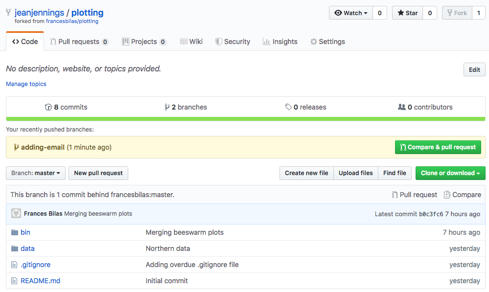
<p class="caption">(\#fig:image-after-jean-pushes)After Jean Pushes</p>
</div>

When Jean clicks on the button,
GitHub displays a page showing the default source and destination of the pull request
and a pair of editable boxes for the pull request's title and a longer comment:

<div class="figure">
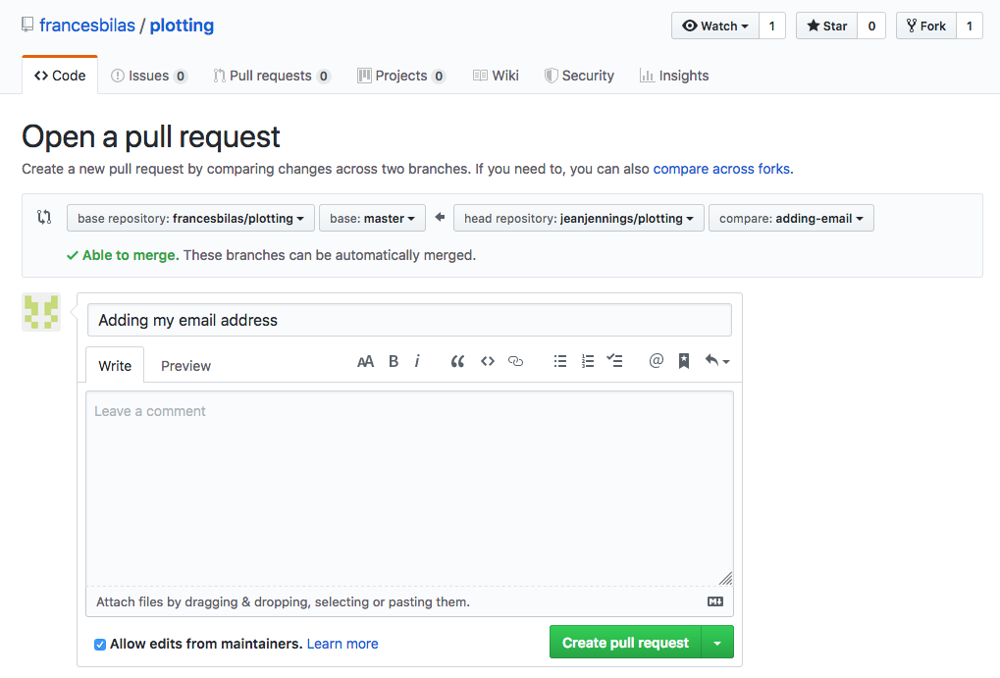
<p class="caption">(\#fig:image-pull-request-a)Starting Pull Request</p>
</div>

If she scrolls down,
she can see a summary of the changes that will be in the pull request:

<div class="figure">
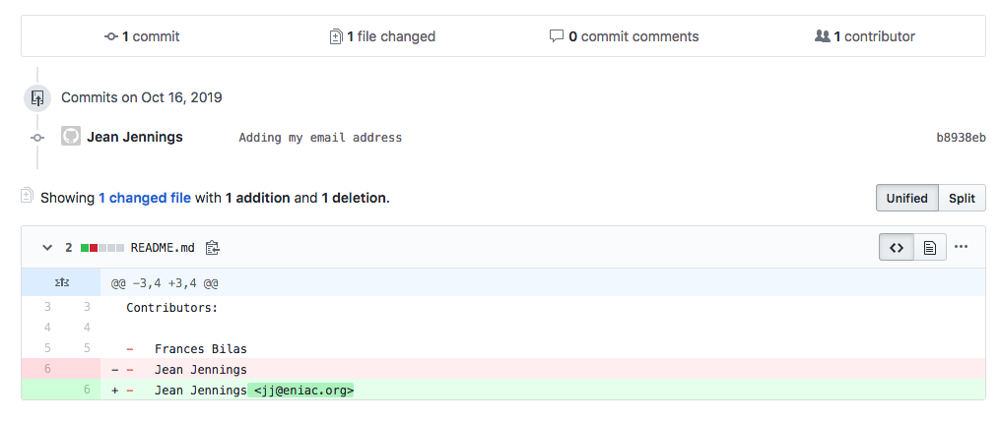
<p class="caption">(\#fig:image-pull-request-b)Summary of Pull Request</p>
</div>

She fills in the top two boxes:

<div class="figure">
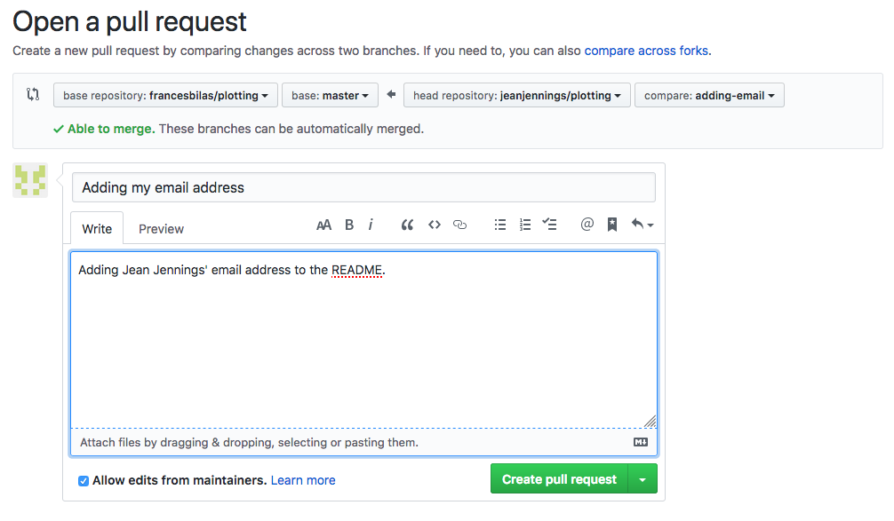
<p class="caption">(\#fig:image-fill-in-pull-request)Filling In Pull Request</p>
</div>

and clicks on "Create Pull Request".
GitHub does that
and then displays a page showing the new pull request:

<div class="figure">
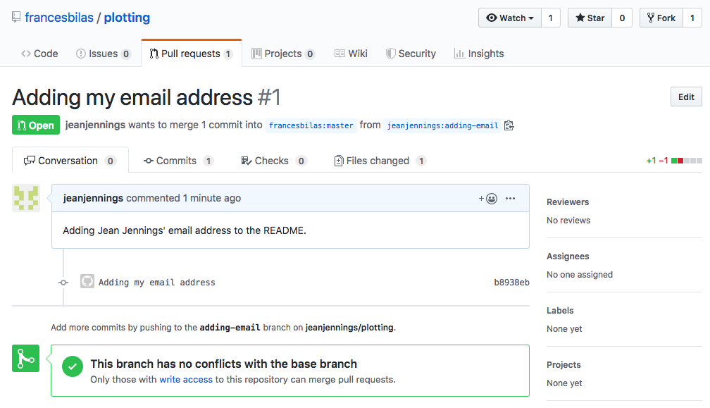
<p class="caption">(\#fig:image-new-pull-request)New Pull Request</p>
</div>

Note that this pull request is displayed in Frances's repository rather than Jean's
since it is Frances's repository that will be affected if the pull request is merged.

Some time later,
Frances checks her repository and sees that there is a pull request:

<div class="figure">
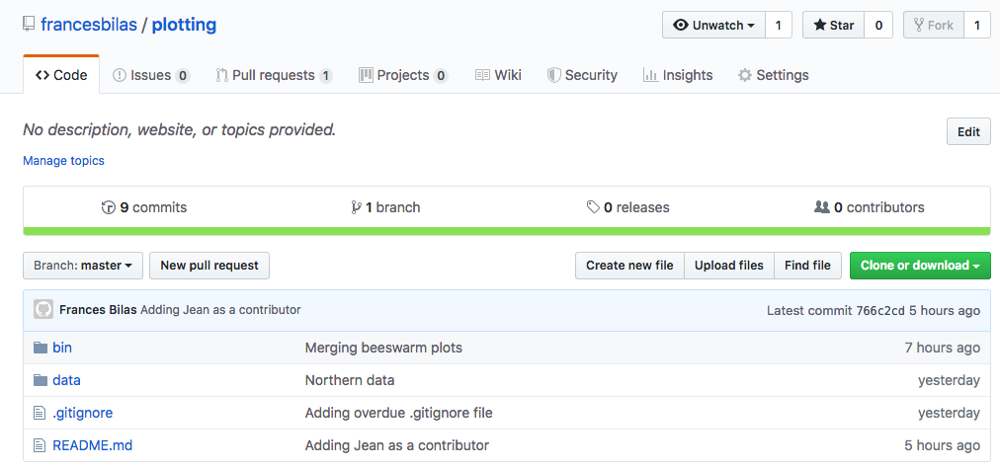
<p class="caption">(\#fig:image-viewing-new-pull-request)Viewing Pull Request</p>
</div>

Clicking on the "Pull requests" tab brings up a list of PRs:

<div class="figure">
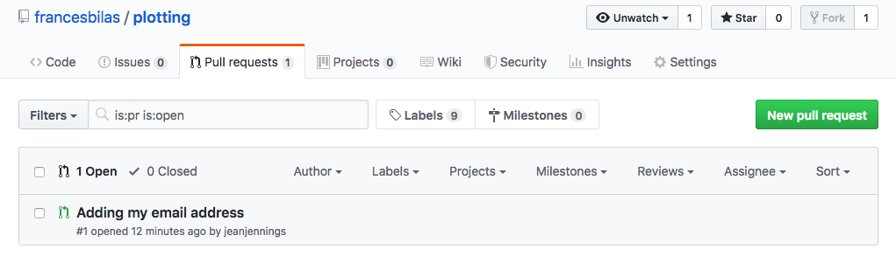
<p class="caption">(\#fig:image-pr-list)Listing Pull Requests</p>
</div>

and clicking on the pull link itself displays more information about it:

<div class="figure">
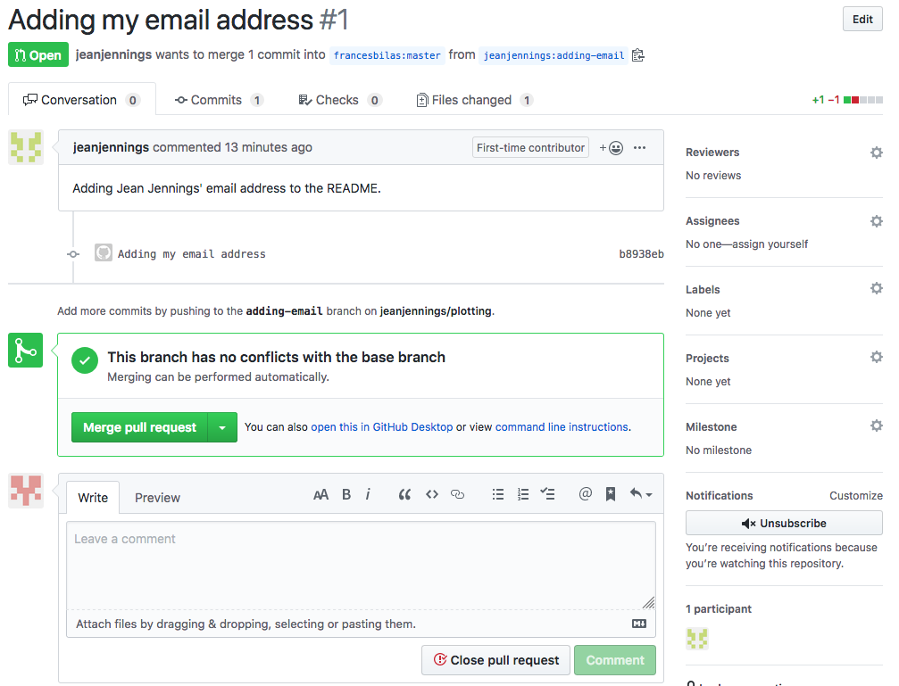
<p class="caption">(\#fig:image-pr-details)Pull Request Details</p>
</div>

Since there are no conflicts,
GitHub will allow Frances to merge the PR immediately using the "Merge pull request" button.
She could also discard or reject it *without* merging using the "Close pull request" button.
Instead,
she clicks on the "Files changed" tab to see what Jean has changed:

<div class="figure">
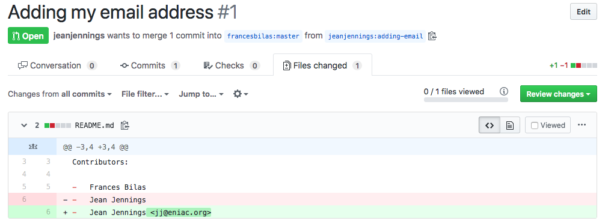
<p class="caption">(\#fig:image-pr-changes)Files Changed</p>
</div>

If she moves her mouse over particular lines,
a white-on-blue cross appears near the numbers to indicate that she can add comments:

<div class="figure">
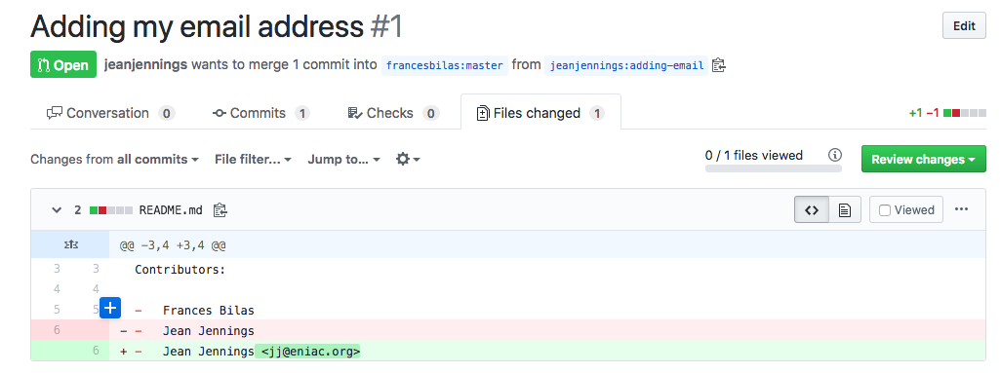
<p class="caption">(\#fig:image-pr-comment-marker)Comment Marker</p>
</div>

She clicks on the marker beside her own name and writes a comment:

<div class="figure">
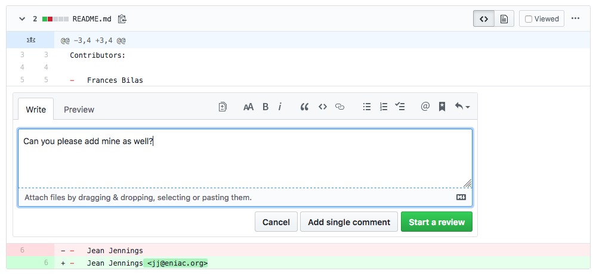
<p class="caption">(\#fig:image-pr-writing-comment)Writing Comment</p>
</div>

She only wants to make one comment rather than write a lengthier multi-comment review,
so she clicks on "Add single comment".
GitHub redisplays the page with her comment inserted inline:

<div class="figure">
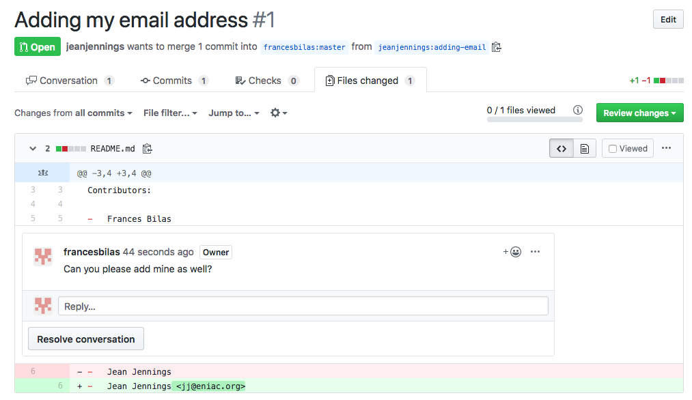
<p class="caption">(\#fig:image-pr-with-comment)Pull Request With Comment</p>
</div>

While all of this has been doing on,
GitHub has been emailing notifications to both Jean and Frances.
When Jean clicks on the link in hers,
it takes her to the PR and shows her Frances's comment.
She changes `README.md`,
commits,
and pushes,
but does *not* create a new pull request or do anything to the existing one.
As explained above,
a PR is a note asking that two branches be merged,
so if either end of the merge changes,
the PR updates automatically.

Sure enough,
when Frances looks at the PR again a few moments later she sees this:

<div class="figure">
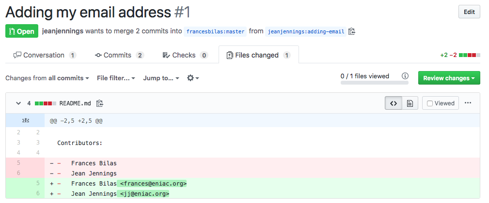
<p class="caption">(\#fig:image-pr-with-fix)Pull Request With Fix</p>
</div>

Satisfied,
she goes back to the "Conversation" tab and clicks on "Merge".
The icon at the top of the PR's page changes text and color to show that the merge was successful:

<div class="figure">
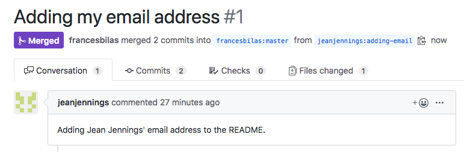
<p class="caption">(\#fig:image-pr-successful-merge)Successful Merge</p>
</div>

To get those changes from GitHub to her desktop repository,
Frances uses `git pull`:

```shell
frances:~/plotting $ git pull origin master
```

```text
remote: Enumerating objects: 9, done.
remote: Counting objects: 100% (9/9), done.
remote: Compressing objects: 100% (5/5), done.
remote: Total 7 (delta 3), reused 5 (delta 2), pack-reused 0
Unpacking objects: 100% (7/7), done.
From https://github.com/francesbilas/plotting
 * branch            master     -> FETCH_HEAD
   766c2cd..984b116  master     -> origin/master
Updating 766c2cd..984b116
Fast-forward
 README.md | 4 ++--
 1 file changed, 2 insertions(+), 2 deletions(-)
```

To get the change she just made from her `adding-email` branch into her `master` branch,
Jean could use `git merge` on the command line.
It's a little clearer,
though,
if she also uses `git pull` from her `upstream` repository (i.e., Frances's repository)
so that she's sure to get any other changes that Frances may have merged:

```shell
jj:~/plotting $ git checkout master
```

```text
Switched to branch 'master'
Your branch is ahead of 'origin/master' by 1 commit.
  (use "git push" to publish your local commits)
```

```shell
jj:~/plotting $ git pull upstream master
```

```text
remote: Enumerating objects: 1, done.
remote: Counting objects: 100% (1/1), done.
remote: Total 1 (delta 0), reused 0 (delta 0), pack-reused 0
Unpacking objects: 100% (1/1), done.
From https://github.com/francesbilas/plotting
 * branch            master     -> FETCH_HEAD
   766c2cd..984b116  master     -> upstream/master
Updating 766c2cd..984b116
Fast-forward
 README.md | 4 ++--
 1 file changed, 2 insertions(+), 2 deletions(-)
```

All four repositories are now synchronized.

This process may seem overly complicated when it is described step by step,
but it quickly becomes second nature.
Everyone involved in the project can work at their own pace,
picking up others' changes and submitting their own whenever they want.
More importantly,
everyone has a chance to review work before it lands in the main repository.
As we discuss in Chapter \@ref(FIXME),
doing reviews doesn't just prevent errors from creeping in:
it is also an effective way to spread understanding and skills.

## How can I label a particular version of my project? {#rse-git-advanced-tag}

FIXME: explain tagging

## Exercises {#rse-git-advanced-exercises}

### Add new country file and make additional PR {#rse-git-advanced-ex-additional-pr}

-   Starting in the master branch make a new branch
-   Copy other country file into a new country
-   Edit the file to include info on the new country
-   Add and commit this new file
-   Push the new changes to GitHub

## Key Points {#rse-git-advanced-keypoints}


-   `git branch` creates a new branch where new features can be developed while leaving the master branch untouched.
-   `git clone` copies a remote repository to create a local repository with a remote called origin automatically set up.
-   Pull requests suggest changes to repos where you don’t have write privileges.
-   Reorganizing code in consistent ways makes errors less likely.
-   Replace a value with a name to make code more readable and to forestall typing errors.
-   Replace a repeated test with a flag to ensure consistency.
-   Turn small pieces of large functions into functions in their own right, even if they are only used once.
-   Combine functions if they are always used together on the same inputs.
-   Use lookup tables to make decision rules easier to follow.
-   Use comprehensions instead of loops.


[abandonware]: glossary.html#abandonware
[absolute-error]: glossary.html#absolute-error
[absolute-path]: glossary.html#absolute-path
[accuracy]: glossary.html#accuracy
[action-make]: glossary.html#action-make
[actual-result]: glossary.html#actual-result
[advanced-r-performance]: http://adv-r.had.co.nz/Performance.html
[aggregate]: glossary.html#aggregate
[ally-skills]: https://frameshiftconsulting.com/ally-skills-workshop/
[ally]: glossary.html#ally
[anscombe-datasaurus]: https://blog.revolutionanalytics.com/2017/05/the-datasaurus-dozen.html
[assertr]: https://cran.r-project.org/web/packages/assertr/index.html
[authentic-task]: glossary.html#authentic-task
[auto-completion]: glossary.html#auto-completion
[automatic-variable-make]: glossary.html#automatic-variable-make
[bash]: glossary.html#bash
[beeswarm-plot]: glossary.html#beeswarm-plot
[bibtex]: http://www.bibtex.org/
[binary-code]: glossary.html#binary-code
[boilerplate]: glossary.html#boilerplate
[bootswatch]: https://bootswatch.com/3/
[branch-per-feature]: glossary.html#branch-per-feature-workflow
[branch]: glossary.html#branch
[broman-packages]: https://kbroman.org/pkg_primer/
[bug-report]: glossary.html#bug-report
[bug-tracker]: glossary.html#bug-tracker
[build-tool]: glossary.html#build-tool
[byte-code]: glossary.html#byte-code
[capes-gerard]: https://github.com/gcapes
[captain-awkward]: https://captainawkward.com/
[carpentries]: https://carpentries.org/
[caulfield-chorus]: https://hapgood.us/2016/05/13/choral-explanations/
[cc-0]: glossary.html#cc-0
[cc-by]: glossary.html#cc-by
[cdd]: glossary.html#cdd
[charles-rules]: http://geekfeminism.wikia.com/wiki/Charles%27_Rules_of_Argument
[checklist]: glossary.html#checklist
[checkr]: https://cran.r-project.org/web/packages/checkr/index.html
[chocolatey]: https://chocolatey.org/
[choose-license]: http://choosealicense.com/
[chunk-label]: https://yihui.name/knitr/options/#chunk-options
[cli]: glossary.html#cli
[climate-api]: http://data.worldbank.org/developers/climate-data-api
[code-coverage]: glossary.html#code-coverage
[code-smells-and-feels]: https://github.com/jennybc/code-smells-and-feels
[codecov]: https://codecov.io/
[cognitive-load]: glossary.html#cognitive-load
[command-argument]: glossary.html#command-argument
[command-flag]: glossary.html#command-flag
[command-history-unix]: glossary.html#command-history-unix
[command-option]: glossary.html#command-option
[command-shell]: glossary.html#command-shell
[command-switch]: glossary.html#command-switch
[comment]: glossary.html#comment
[commit-message]: glossary.html#commit-message
[commit]: glossary.html#commit
[commons]: glossary.html#commons
[competent-practitioner]: glossary.html#competent-practitioner
[compiled-language]: glossary.html#compiled-language
[compiler]: glossary.html#compiler
[computational-notebook]: glossary.html#computational-notebook
[conda]: https://conda.io/
[conditional-expression]: glossary.html#conditional-expression
[config-email]: mailto:gvwilson@third-bit.com
[config-repo]: https://github.com/merely-useful/merely-useful.github.io/
[confirmation-bias]: glossary.html#confirmation-bias
[continuation-prompt]: glossary.html#continuation-prompt
[continuous-integration]: glossary.html#continuous-integration
[cookiecutter]: https://drivendata.github.io/cookiecutter-data-science/
[corpus]: glossary.html#corpus
[covenant]: https://www.contributor-covenant.org
[cran]: https://cran.r-project.org/
[creative-commons]: https://creativecommons.org/
[cron]: https://en.wikipedia.org/wiki/Cron
[csv]: glossary.html#csv
[curb-cuts]: glossary.html#curb-cuts
[current-working-directory]: glossary.html#current-working-directory
[cv]: https://stats.stackexchange.com/
[data-package]: glossary.html#data-package
[dc]: https://datacarpentry.org/
[declarative-programming]: glossary.html#declarative-programming
[default-target-make]: glossary.html#default-target-make
[delimiter]: glossary.html#delimiter
[design-pattern]: glossary.html#design-pattern
[destructuring]: glossary.html#destructuring
[dictionary]: glossary.html#dictionary
[docker]: https://en.wikipedia.org/wiki/Docker_(software)
[documentation-generator]: glossary.html#documentation-generator
[doi]: glossary.html#doi
[downvote]: glossary.html#downvote
[drake]: https://ropenscilabs.github.io/drake-manual/
[dry]: glossary.html#dry
[dryad]: https://datadryad.org/
[dursi-jonathan]: https://www.dursi.ca/
[dursi-pattern-rules]: https://github.com/ljdursi/make_pattern_rules
[embedded-documentation]: glossary.html#embedded-documentation
[eniac]: glossary.html#eniac
[environment]: glossary.html#environment
[error-unexpected]: https://stackoverflow.com/questions/25889234/error-unexpected-symbol-input-string-constant-numeric-constant-special-in-my-co
[exception]: glossary.html#exception
[expected-result]: glossary.html#expected-result
[expert]: glossary.html#expert
[exploratory-programming]: glossary.html#exploratory-programming
[exponent]: glossary.html#exponent
[f1000-research]: https://f1000research.com/
[false-beginner]: glossary.html#false-beginner
[false-negative]: glossary.html#false-negative
[false-positive]: glossary.html#false-positive
[faq]: glossary.html#faq
[feature-request]: glossary.html#feature-request
[figshare]: https://figshare.com/
[filename-extension]: glossary.html#filename-extension
[filename-stem]: glossary.html#filename-stem
[filesystem]: glossary.html#filesystem
[filter]: glossary.html#filter
[fixture]: glossary.html#fixture
[flag-variable]: glossary.html#flag-variable
[folder]: glossary.html#folder
[forge]: glossary.html#forge
[full-identifier-git]: glossary.html#full-identifier-git
[fully-qualified-name]: glossary.html#fully-qualified-name
[function-make]: glossary.html#function-make
[gdb]: https://www.gnu.org/software/gdb
[geek-feminism]: http://geekfeminism.wikia.com/
[ggplot2]: https://ggplot2.tidyverse.org/
[gh-myoctocat]: https://myoctocat.com
[gh-pages]: https://pages.github.com/
[git-branch]: glossary.html#git-branch
[git-clone]: glossary.html#git-clone
[git-conflict]: glossary.html#git-conflict
[git-fork]: glossary.html#git-fork
[git-merge]: glossary.html#git-merge
[git-pull]: glossary.html#git-pull
[git-push]: glossary.html#git-push
[git-ssh-bitbucket]: https://confluence.atlassian.com/bitbucket/set-up-ssh-for-git-728138079.html
[git-ssh-github]: https://help.github.com/articles/generating-ssh-keys
[git-ssh-gitlab]: https://about.gitlab.com/2014/03/04/add-ssh-key-screencast/
[git-stage]: glossary.html#git-stage
[git]: glossary.html#git
[github-pages]: https://pages.github.com/
[github-zenodo-tutorial]: https://guides.github.com/activities/citable-code/
[github]: http://github.com
[github]: http://github.com
[gitkraken]: https://www.gitkraken.com/
[gnu-make-other-vars]: https://www.gnu.org/software/make/manual/html_node/Special-Variables.html
[gnu-make]: http://www.gnu.org/software/make/
[gnu-man-coreutils]: http://www.gnu.org/software/coreutils/manual/coreutils.html
[gnu-man]: http://www.gnu.org/manual/manual.html
[go-fair]: https://www.go-fair.org/fair-principles/
[gpl]: glossary.html#gpl
[gui]: glossary.html#gui
[gutenberg]: https://www.gutenberg.org/
[hitchhiker]: glossary.html#hitchhiker
[home-directory]: glossary.html#home-directory
[huff-testing]: https://github.com/katyhuff/python-testing
[impostor-syndrome]: glossary.html#impostor-syndrome
[in-place-operator]: glossary.html#in-place-operator
[ini-format]: https://en.wikipedia.org/wiki/INI_file
[insight]: https://www.insightdatascience.com/
[install]: glossary.html#install
[intellij-idea]: https://www.jetbrains.com/idea/
[interpeter]: glossary.html#interpeter
[interpreted-language]: glossary.html#interpreted-language
[interruption-bingo]: glossary.html#interruption-bingo
[iso-date-format]: glossary.html#iso-date-format
[issue-label]: glossary.html#issue-label
[issue-tracking-system]: glossary.html#issue-tracking-system
[issue]: glossary.html#issue
[join]: glossary.html#join
[joss]: https://joss.theoj.org/
[json]: glossary.html#json
[jupyter]: http://jupyter.org/
[jupytext]: https://jupytext.readthedocs.io/en/latest/introduction.html
[lbyl-vs-eafp]: https://blogs.msdn.microsoft.com/pythonengineering/2016/06/29/idiomatic-python-eafp-versus-lbyl/
[lc]: https://librarycarpentry.org
[learned-helplessness]: glossary.html#learned-helplessness
[library]: glossary.html#library
[lint]: https://en.wikipedia.org/wiki/Lint_(software)
[linter]: glossary.html#linter
[lme4]: https://cran.r-project.org/web/packages/lme4/vignettes/lmer.pdf
[log-file]: glossary.html#log-file
[loop-body]: glossary.html#loop-body
[loop-unix]: glossary.html#loop-unix
[magic-number]: glossary.html#magic-number
[magnitude]: glossary.html#magnitude
[make]: https://www.gnu.org/software/make/
[makefile]: glossary.html#makefile
[mantissa]: glossary.html#mantissa
[markdown]: https://en.wikipedia.org/wiki/Markdown
[marthas-rules]: glossary.html#marthas-rules
[mental-model]: glossary.html#mental-model
[mertz-documentation]: https://realpython.com/documenting-python-code/
[mit-license]: glossary.html#mit-license
[model-coc]: http://geekfeminism.wikia.com/wiki/Conference_anti-harassment/Policy
[namespace]: glossary.html#namespace
[nano]: glossary.html#nano
[ngo]: glossary.html#ngo
[noller-a-lot-happens]: http://jessenoller.com/blog/2015/9/27/a-lot-happens
[noller-sequel]: http://jessenoller.com/blog/2015/10/31/community-boundaries
[novice]: glossary.html#novice
[numpy-docstring]: https://numpydoc.readthedocs.io/en/latest/format.html
[object]: glossary.html#object
[oop]: glossary.html#oop
[open-license]: glossary.html#open-license
[open-science]: glossary.html#open-science
[openrefine]: http://openrefine.org/
[operating-system]: glossary.html#operating-system
[operational-test]: glossary.html#operational-test
[oppression]: glossary.html#oppression
[orcid]: https://orcid.org/
[orthogonality]: glossary.html#orthogonality
[orwells-rules]: https://en.wikipedia.org/wiki/Politics_and_the_English_Language#Remedy_of_Six_Rules
[osf]: https://osf.io/
[osi-license-list]: http://opensource.org/licenses
[overloading]: glossary.html#overloading
[package]: glossary.html#package
[pager]: glossary.html#pager
[pandas-docstring]: https://pandas.pydata.org/pandas-docs/stable/development/contributing_docstring.html
[pandoc-markdown]: https://pandoc.org/MANUAL.html#pandocs-markdown
[parent-directory]: glossary.html#parent-directory
[parking-lot]: glossary.html#parking-lot
[path-coverage]: glossary.html#path-coverage
[path]: glossary.html#path
[pattern-rule-make]: glossary.html#pattern-rule-make
[peer-action]: glossary.html#peer-action
[pentium-div-bug]: https://en.wikipedia.org/wiki/Pentium_FDIV_bug
[pep-8-hobgoblin]: https://www.python.org/dev/peps/pep-0008/#a-foolish-consistency-is-the-hobgoblin-of-little-minds
[pep-8]: https://www.python.org/dev/peps/pep-0008/
[phony-target-make]: glossary.html#phony-target-make
[pipe-unix]: glossary.html#pipe-unix
[pothole-case]: glossary.html#pothole-case
[precision]: glossary.html#precision
[prerequisite-make]: glossary.html#prerequisite-make
[privilege]: glossary.html#privilege
[procedural-programming]: glossary.html#procedural-programming
[process]: glossary.html#process
[product-manager]: glossary.html#product-manager
[prompt]: glossary.html#prompt
[provenance]: glossary.html#provenance
[pull-request]: glossary.html#pull-request
[pypi]: https://pypi.org/
[pytest-mpl]: https://github.com/matplotlib/pytest-mpl
[pytest]: http://pytest.org/
[python-102]: https://python-102.readthedocs.io/
[python-exceptions]: https://docs.python.org/3/library/exceptions.html#exception-hierarchy
[python]: glossary.html#python
[r-here-pkg]: https://here.r-lib.org/
[r-markdown]: https://rmarkdown.rstudio.com/
[r-pkg-book-testing]: http://r-pkgs.had.co.nz/tests.html
[r-pkg-book]: http://r-pkgs.had.co.nz/
[r-style-guide-files]: https://style.tidyverse.org/files.html
[r-style-guide]: https://style.tidyverse.org/
[r-testthat]: https://testthat.r-lib.org/
[r]: https://cran.r-project.org/
[raise-exception]: glossary.html#raise-exception
[raster-image]: glossary.html#raster-image
[readthedocs]: https://docs.readthedocs.io/en/latest/
[recursion]: glossary.html#recursion
[redirection]: glossary.html#redirection
[refactoring]: glossary.html#refactoring
[regular-expression]: glossary.html#regular-expression
[relative-error]: glossary.html#relative-error
[relative-path]: glossary.html#relative-path
[remote-repository]: glossary.html#remote-repository
[repl]: glossary.html#repl
[repository]: glossary.html#repository
[reprex]: glossary.html#reprex
[reproducible-research]: glossary.html#reproducible-research
[requests]: http://docs.python-requests.org
[restructured-text]: glossary.html#restructured-text
[revision]: glossary.html#revision
[rmd-documentation]: https://bookdown.org/yihui/rmarkdown/html-document.html#appearance-and-style
[rmd-themes]: FIXME
[root-directory]: glossary.html#root-directory
[rothenberg-backup]: http://wiki.c2.com/?ComputerErrorHaiku
[rothenberg-quote]: https://www.clir.org/wp-content/uploads/sites/6/ensuring.pdf
[roxygen-md]: https://cran.r-project.org/web/packages/roxygen2/vignettes/markdown.html
[rse]: glossary.html#rse
[rstudio-addin]: https://rstudio.github.io/rstudioaddins/
[rstudio-cloud]: https://rstudio.cloud/
[rstudio-ide]: https://www.rstudio.com/products/rstudio/
[rstudio-r-projects]: https://support.rstudio.com/hc/en-us/articles/200526207-Using-Projects
[rstudio]: https://rstudio.com/
[rubber-duck-debugging]: https://en.wikipedia.org/wiki/Rubber_duck_debugging
[rule-make]: glossary.html#rule-make
[sci-reproducibility]: https://en.wikipedia.org/wiki/Reproducibility
[script]: glossary.html#script
[select-docs]: https://dplyr.tidyverse.org/reference/select.html#useful-functions
[sense-vote]: glossary.html#sense-vote
[setuptools]: https://setuptools.readthedocs.io/
[shebang]: glossary.html#shebang
[shell-script]: glossary.html#shell-script
[short-circuit-test]: glossary.html#short-circuit-test
[short-identifier-git]: glossary.html#short-identifier-git
[side-effects]: glossary.html#side-effects
[sign]: glossary.html#sign
[silent-failure]: glossary.html#silent-failure
[situational-action]: glossary.html#situational-action
[snake-case]: glossary.html#snake-case
[snakemake]: https://snakemake.readthedocs.io/
[so-bash]: https://stackoverflow.com/questions/tagged/bash
[so-keywords-builtins]: https://stackoverflow.com/a/22864250/2166823
[so-mre-p]: https://stackoverflow.com/questions/20109391/how-to-make-good-reproducible-pandas-examples
[so-mre-r]: https://stackoverflow.com/questions/5963269/how-to-make-a-great-r-reproducible-example
[so-mre]: https://stackoverflow.com/help/minimal-reproducible-example
[so]: https://stackoverflow.com/
[source-code]: glossary.html#source-code
[sphinx]: http://www.sphinx-doc.org/en/master/
[srinath-ashwin]: https://ccit.clemson.edu/research/researcher-profiles/ashwin-srinath/
[stack-exchange-data-explorer]: https://data.stackexchange.com/
[stack-overflow-good-question]: https://stackoverflow.com/help/how-to-ask
[stack-overflow]: https://stackoverflow.com/
[stack-printer]: http://www.stackprinter.com/
[standard-error]: glossary.html#standard-error
[standard-input]: glossary.html#standard-input
[standard-output]: glossary.html#standard-output
[stderr]: glossary.html#stderr
[stdin]: glossary.html#stdin
[stdout]: glossary.html#stdout
[streaming-data]: glossary.html#streaming-data
[styler-pkg]: http://styler.r-lib.org/
[subcommand]: glossary.html#subcommand
[subdirectory]: glossary.html#subdirectory
[subsampling]: glossary.html#subsampling
[sustainable-software]: glossary.html#sustainable-software
[svg]: glossary.html#svg
[swc-git]: https://swcarpentry.github.io/git-novice/
[swc-make]: https://github.com/swcarpentry/make-novice
[swc-python]: https://swcarpentry.github.io/python-novice-inflammation/
[swc-r]: https://swcarpentry.github.io/r-novice-gapminder/
[swc-shell]: https://swcarpentry.github.io/shell-novice/
[swc]: http://software-carpentry.org
[syntax-highlighting]: glossary.html#syntax-highlighting
[synthetic-data]: glossary.html#synthetic-data
[tab-completion]: glossary.html#tab-completion
[tag]: glossary.html#tag
[target-make]: glossary.html#target-make
[target]: glossary.html#target
[tdd]: glossary.html#tdd
[tdda-site]: http://www.tdda.info/
[test-error]: glossary.html#test-error
[test-failure]: glossary.html#test-failure
[test-framework]: glossary.html#test-framework
[test-isolation]: glossary.html#test-isolation
[test-runner]: glossary.html#test-runner
[test-success]: glossary.html#test-success
[testpypi]: https://test.pypi.org
[tf-idf]: https://en.wikipedia.org/wiki/Tf%E2%80%93idf
[three-stickies]: glossary.html#three-stickies
[ticket]: glossary.html#ticket
[ticketing-system]: glossary.html#ticketing-system
[tidy-data]: glossary.html#tidy-data
[timestamp]: glossary.html#timestamp
[tinytex]: https://yihui.name/tinytex/
[tldr-gpl]: https://tldrlegal.com/license/gnu-general-public-license-v3-(gpl-3)
[tldr]: glossary.html#tldr
[tolerance]: glossary.html#tolerance
[transitive-dependency]: glossary.html#transitive-dependency
[travis-ci]: https://travis-ci.org/
[triage]: glossary.html#triage
[troy-meetings]: https://chelseatroy.com/2018/03/29/why-do-remote-meetings-suck-so-much/
[tuple]: glossary.html#tuple
[tyranny-structurelessness]: http://www.jofreeman.com/joreen/tyranny.htm
[ukho-accessibility]: https://ukhomeoffice.github.io/accessibility-posters/posters/accessibility-posters.pdf
[unit-test]: glossary.html#unit-test
[unix-shell]: glossary.html#unix-shell
[unpaywall]: http://unpaywall.org/
[update-operator]: glossary.html#update-operator
[upvote]: glossary.html#upvote
[usethis]: https://usethis.r-lib.org/
[uwm-git-lesson]: https://uw-madison-datascience.github.io/git-novice-custom/
[validate-r]: https://cran.r-project.org/web/packages/validate/index.html
[validation]: glossary.html#validation
[vanderplas-licensing]: http://www.astrobetter.com/blog/2014/03/10/the-whys-and-hows-of-licensing-scientific-code/
[variable-make]: glossary.html#variable-make
[variable]: glossary.html#variable
[vector-image]: glossary.html#vector-image
[verification]: glossary.html#verification
[version-control]: https://peerj.com/preprints/3159/
[violin-plot]: glossary.html#violin-plot
[virtual-environment]: glossary.html#virtual-environment
[vs-code]: https://code.visualstudio.com/
[wickham-packages]: http://r-pkgs.had.co.nz/
[wiki-rubber-duck-debugging]: https://en.wikipedia.org/wiki/Rubber_duck_debugging
[wikipedia-iso-country]: http://en.wikipedia.org/wiki/ISO_3166-1_alpha-3
[wildcard]: glossary.html#wildcard
[wing-ide]: https://wingware.com/
[womens-pockets-data]: https://github.com/the-pudding/data/blob/master/pockets/README.md
[womens-pockets]: https://pudding.cool/2018/08/pockets/
[working-memory]: glossary.html#working-memory
[wrap-code]: glossary.html#wrap-code
[xcode]: https://developer.apple.com/xcode/ide/
[xkcd-duty-calls]: https://xkcd.com/386/
[yaml]: https://bookdown.org/yihui/rmarkdown/html-document.html
[zenodo]: https://zenodo.org/
[zipfs-law]: http://en.wikipedia.org/wiki/Zipf%27s_law


<!--chapter:end:rse-git-advanced.Rmd-->

# Code Style, Review, and Refactoring {#rse-style}


To paraphrase @Dobz1973,
nothing in software development makes sense except in light of human psychology.
This is particularly true when we look at programming style.
Computers don't need to understand programs in order to execute them,
but people do in order to create them, maintain them, and fix them.
The more clearly those programs are laid out,
the easier it is to find things and make sense of them.
This lesson therefore describes some widely-used rules of Python programming style,
and some features of the language that you can use to make your programs more flexible and more readable.

The biggest benefit of having a second person work on a programming project
is therefore not getting twice as much code written,
but having code reviewed.
Study after study over more than 40 years has shown that code review is the most effective way to find bugs in software
@Faga1976,@Faga1986,@Cohe2010@Bacc2013.
Despite this,
it still isn't common in research software development,
in part because it isn't part of the culture @Sega2005,
but also because code review is mostly useful
when the reviewers understand the problem domain well enough to comment on algorithms and design choices
rather than indentation and variable naming,
and the number of people who can do that for a research project is typically very small—sometimes
as small as one @Petr2014.

This lesson will look at the mechanics of code review
and present some short examples of the kinds of things reviewers should look for.

## How should I review someone else's code? {#rse-style-github}

How you review is just as important as what you look for:
being dismissive or combative are good ways to ensure that people don't pay attention to your reviews,
or avoid having you review their work.
Equally,
being defensive when someone offers suggestions politely and sincerely is very human,
but can stunt your development as a programmer.

Lots of people have written guidelines for doing reviews,
which are also useful when reviewing written work @Quen2018,@Sank2018.
A few key points are:

Work in small increments.
:   As @Cohe2010 and others have found,
    code review is most effective when done in short bursts.
    That means that change requests should also be short:
    anything that's more than a couple of screens long
    should be broken into smaller pieces.

Look for algorithmic problems first.
:   Code review isn't just (or even primarily) about style:
    its real purpose is to find bugs before they can affect anyone.
    The first pass over any change should therefore look for algorithmic problems.
    Are the calculations right?
    Are any rare cases going to be missed?
    Are errors being caught and handled Chapter \@ref(logging)?

Use a rubric.
:   Linters are great,
    but can't decide when someone should have used a lookup table instead of conditionals.
    A list of things to check for can make review faster and more comprehensible,
    especially when you can copy-and-paste or drag-and-drop specific comments
    onto specific lines
    (something that GitHub unfortunately doesn't yet support).

Ask for clarification.
:   If you don't understand something,
    or don't understand why the author did it,
    ask.
    (And when the author explains it,
    think about suggesting that the explanation ought to be documented somewhere.)

Offer alternatives.
:   Telling authors that something is wrong is helpful;
    telling them what they might do instead is more so.

Don't be sarcastic or disparaging.
:   "Did you maybe think about *testing* this garbage?"
    is a Code of Conduct violation in any well-run project.

Don't present opinions as facts.
:   "Nobody uses X any more" might be true.
    If it is,
    the person making the claim ought to be able to point at download statistics
    or a Google Trends search;
    if they can't,
    they should say,
    "I don't think anybody uses X any more" and explain why they think that.

Don't feign surprise or pass judgment.
:   "Gosh, didn't you know [some obscure fact]?" isn't helpful;
    neither is, "Geez, why don't you [some clever trick] here?"

Don't overwhelm people with details.
:   If someone has used the letter `x` as a variable name in several places,
    and they shouldn't have,
    comment on the first two or three and simply put a check beside the others—the reader
    won't need the comment repeated.

Don't ask people to do extra work.
:   Nobody enjoys fixing bugs and style violations.
    Asking them to add a few features while they're at it is rude.

Don't let people break these rules just because they're frequent contributors or in positions of power.
:   The culture of any organization is shaped by the worst behavior it is willing to tolerate @Grue2015.
    If you let people be rude to one another,
    *that* is your culture.

Be specific in replies to reviewers.
:   If someone has suggested a better variable name,
    you can probably simply fix it.
    If someone has suggested a major overhaul to an algorithm,
    you should reply to their comment to point at the commit that includes the fix.

Thank your reviewers.
:   If someone has taken the time to read your code carefully,
    thank them for doing it.

## What are the standard rules of good style for Python programs? {#rse-style-pep8}

The single most important rule of style is to be consistent,
both internally and with other programs.
Python's standard style is called [PEP-8][pep-8];
the term "PEP" is short for "Python Enhancement Proposal",
and PEP-8 has become the most widely used standard for Python coding.
Some of its rules are listed below,
along with others borrowed from "[Code Smells and Feels][code-smells-and-feels]":

FIXME: add before-and-after examples for each of these.

FIXME: move this to the novice material.

### Always indent code blocks using 4 spaces, and use spaces instead of tabs.

### Do not put spaces inside parentheses

I.e., don't write <code>(&nbsp;1+2&nbsp;)</code>.
This applies to function calls as well:
do not write <code>max(&nbsp;a,&nbsp;b&nbsp;)</code>.

### Always use spaces around comparisons like `>` and `<=`.

Use your own judgment for spacing around common arithmetic operators like `+` and `/`.

### Use `ALL_CAPS_WITH_UNDERSCORES` for constants (also called global variables).

### Use `lower_case_with_underscores` for the names of functions and variables.

This naming convention is called [snake case][snake-case] or [pothole case][pothole-case].
You should only use [`CamelCase`][camel-case] for classes,
which are outside the scope of this lesson.

### Put two blank links between each function definition.

This helps them stand out.

### Avoid abbreviations in function and variable names.

They can be ambiguous,
and can be be hard for non-native speakers to understand.
This rule doesn't necessarily you will have to do more typing:
a good programming editor will [auto-complete][auto-completion] names for you.

### Use short names for short-lived local variables but longer names for things with wider scope.

Loop indices @Beni2017 can be `i` and `j` (provided the loop is only a few lines long).
Anything that is used at a greater distance
or whose purpose isn't immediately clear
(such as a function) should have a longer name.

### Put everything in a file in order.

The order of items in each file should be:

-   The [shebang][shebang] line (because it has to come first to work).
-   The file's documentation string (Chapter \@ref(style)).
-   All of the `import` statements, one per line.
-   Constant definitions.
-   Function definitions.
-   If the file can be run as a program,
    the `if __name__ == '__main__'` statement discussed in
    Section \@ref(rse-package-py-import).

### Do not comment and uncomment sections of code to change behavior.

If you need to do something in some runs of the program and not do it in others,
use an `if` statement to enable or disable that block of code.
It's much more reliable—you're far less likely to accidentally comment out one too many lines—and
you may find that you want to leave those conditional sections in the finished program
for logging purposes (Chapter \@ref(logging)).

### Keep functions short.

Nothing should be more than a page long
or have more than three levels of indentation because of nested loops and conditionals.
Anything longer or more deeply nested will be hard for readers to fit into [working memory][working-memory];
when you find yourself needing to break these limits,
extract a function.

### Handle special cases at the start of the function.

This helps readers mentally get them out of the way
and focus on the "normal" case.

## How can I check that code follows style guidelines? {#rse-style-check}

Checking that code conforms to guidelines like the ones above can be time consuming,
but luckily it doesn't have to be done by hand.
Most languages have tools that will check code style rules and report violations.
These are often called [linters][linter],
after an early tool called `[lint][lint]` that found lint (or fluff) in C code.
Python has a tool that used to be called `pep8`
and is now called `pycodestyle`
that will do this.
For example,
this program is supposed to count the number of stop words in a document:

```python
stops = ['a', 'A', 'the', 'The', 'and']

def count(ln):
    n = 0
    for i in range(len(ln)):
        line = ln[i]
        stuff = line.split()
        for word in stuff:
            # print(word)
            j = stops.count(word)
            if (j > 0) == True:
                n = n + 1
    return n

import sys

lines = sys.stdin.readlines()
# print('number of lines', len(lines))
n = count(lines)
print('number', n)
```

When we run this command:

```shell
$ pycodestyle count_stops.py
```

it prints this report:

```text
src/style/count_stops_before.py:3:1: E302 expected 2 blank lines, found 1
src/style/count_stops_before.py:11:24: E712 comparison to True should be 'if cond is True:' or 'if cond:'
src/style/count_stops_before.py:12:13: E101 indentation contains mixed spaces and tabs
src/style/count_stops_before.py:12:13: W191 indentation contains tabs
src/style/count_stops_before.py:15:1: E305 expected 2 blank lines after class or function definition, found 1
src/style/count_stops_before.py:15:1: E402 module level import not at top of file
```

Fixing these issues gives us this:

```python
import sys


stops = ['a', 'A', 'the', 'The', 'and']


def count(ln):
    n = 0
    for i in range(len(ln)):
        line = ln[i]
        stuff = line.split()
        for word in stuff:
            # print(word)
            j = stops.count(word)
            if j > 0:
                n = n + 1
    return n


lines = sys.stdin.readlines()
# print('number of lines', len(lines))
n = count(lines)
print('number', n)
```

This program gets a clean bill of health,
so it's worth looking at in more detail.
Here are things that should be changed:

-   The commented-out `print` statements should either be removed
    or turned into proper logging statements (Chapter \@ref(logging)).
-   The variables `ln`, `i`, and `j` should be given clearer names.
-   The outer loop in `count` loops over the indices of the line list
    rather than over the lines.
    It should do the latter
    (which will allow us to get rid of the variable `i`).
-   There's no reason to store the result of `line.split` in a temporary variable:
    the inner loop of `count` can use it directly.
-   Rather than counting how often a word occurs in the list of stop words
    and then adding 1 to `n`,
    we can create a set of stop words and use a simple membership test.
    This will be more readable *and* more efficient.
-   Since the set of stop words is a global variable,
    it should be written in upper case.
-   We should use `+=` to increment the counter `n`.
-   Rather than reading the input into a list of lines and then looping over that,
    we can give `count` a stream and have it process the lines one by one.
-   Since we might want to use `count` in other programs some day,
    we should put the two lines at the bottom that handle input
    into a conditional
    so that they aren't executed when this script is imported.

After making all these changes,
our little program looks like this:

```python
import sys


STOPS = {'a', 'A', 'the', 'The', 'and'}


def count(reader):
    n = 0
    for line in reader:
        for word in line.split():
            if word in STOPS:
                n += 1
    return n


if __name__ == '__main__':
    n = count(sys.stdin)
    print('number', n)
```

## How should I collaborate with people when doing code reviews? {#rse-style-how}

FIXME: how to review on GitHub.

## In what order should functions be defined? {#rse-style-order}

When encountering code for the first time,
most people scan it from top to bottom.
If that code is a program or script,
rather than a library,
its main function should be put first,
and should probably be called `main`.

After reading that function,
someone should have a good idea of what the program does in what order.
Three common patterns that people might match against are:

1.  Figure out what the user has asked it to do (Chapter \@ref(configure)).
2.  Read all input data.
3.  Process it.
4.  Write output.

or:

1.  Figure out what the user has asked for.
2.  For each input file:
    1.  Read.
    2.  Process.
    3.  Write file-specific output (if any).
3.  Write summary output (if any).

or:

1.  Figure out what the user has asked for.
2.  Repeatedly:
    1.  Wait for user input.
    2.  Do what the user has asked.
3.  Exit when a "stop" command of some sort is received.

Each step in each of the outlines above usually becomes a function.
Those functions depend on others,
some of which are written to break code into comprehensible chunks and are then called just once,
others of which are utilities that may be called many times from many different places.

FIXME: figure

Different people order these differently;
our preferred order is:

1.  Put all of the single-use functions in the first half of the file
    in the order in which they are likely to be called.
2.  Put all of the multi-use utility functions in the bottom of the file in alphabetical order.

If any of those utility functions are used by other scripts or programs,
they should go in a file of their own.
In fact,
this is a good practice even if they're only used by one program,
since it signals even more clearly which functions are in the "structural" layer
and which are in the "utility" layer.

## How can I specify default values for functions' parameters? {#rse-style-defaults}

[Working memory][working-memory] can only hold a few items at once:
initial estimates in the 1950s put the number at 7 plus or minus 2 @Mill1956,
and more recent estimates put it as low as 4 or 5.
If your function requires two dozen parameters,
the odds are very good that users will frequently forget them
or put them in the wrong order.
One solution is to give parameters default values (Chapter \@ref(style));
another is to bundle them together so that (for example)
people pass three `point` objects instead of nine separate `x`, `y`, and `z` values.

A third approach (which can be combined with the preceding two)
is to specify default values for some of the parameters.
Doing this gives users control over everything
while also allowing them to ignore details;
it also codifies what you consider "normal" for the function.

For example,
suppose we are comparing images to see if they are the same or different.
We can specify two kinds of tolerance:
how large a difference in color value to notice,
and how many differences above that threshold to tolerate
(as a percentage of the total number of pixels).
By default,
any color difference is considered significant,
and only 1% of pixels are allowed to differ:

```python
def image_diff(left, right, per_pixel=0, fraction=0.01):
    # ...implementation...
```

When this function is called using `image_diff(old, new)`,
those default values apply.
However,
it can also be called like this:

-   `image_diff(old, new, per_pixel=2)`
    allows pixels to differ slightly without those differences being significant.
-   `image_diff(old, new, fraction=0.05)` allows more pixels to differ.
-   `image_diff(old, new, per_pixel=1, fraction=0.005)`
    raises the per-pixel threshold but decrease number of allowed differences.

Default parameter values make code easier to understand and use,
but there is a subtle trap.
When Python executes a function definition like this:

```python
def collect(new_value, accumulator=set()):
    accumulator.add(new_value)
    return accumulator
```

it calls `set()` to create a new empty set,
and then uses that set as the default value for `accumulator` every time the function is called.
It does *not* call `set()` anew for each call,
so all calls using the default will share the same set:

```python
>>> collect('first')
{'first'}
>>> collect('second')
{'first', 'second'}
```

A common way to avoid this is to pass `None` to the function
to signal that the user didn't provide a value:

```python
def collect(new_value, accumulator=None):
    if accumulator is None:
        accumulator = set()
    accumulator.add(new_value)
    return accumulator
```

## How can I write functions to handle a variable number of arguments? {#rse-style-varargs}

We can often make programs simpler by writing functions that take a variable number of arguments,
just like `print` and `max`.
One way to to require user to stuff those arguments into a list,
e.g.,
to write `find_limits([a, b, c, d])`.
However,
Python can do this for us.
If we declare a single argument whose name starts with a single `*`,
Python will put all "extra" arguments into a [tuple][tuple]
and pass that as the argument.
By convention,
this argument is called `args`:

```python
def find_limits(*args):
    print(args)

find_limits(1, 3, 5, 2, 4)
```

```text
(1, 3, 5, 2, 4)
```

This catch-all parameter can be used with regular parameters,
but must come last in the parameter list to avoid ambiguity:

```python
def select_outside(low, high, *values):
    result = []
    for v in values:
        if (v < low) or (v > high):
            result.add(v)
    return result

print(select_outside(0, 1.0, 0.3, -0.2, -0.5, 0.4, 1.7))
```

```text
[-0.2, -0.5, 1.7]
```

An equivalent special form exists for named arguments:
the catch-all variable is conventionally called `kwargs`
(for "keyword arguments")
and its name is prefixed with `**` (i.e., two asterisks instead of one).
When this is used,
the function is given a [dictionary][dictionary] of names and values
rather than a list:

```python
def set_options(tag, **kwargs):
    result = '<{}'.format(tag)
    for key in kwargs:
        result += ' {}="{}"'.format(key, kwargs[key])
    result += '/>'
    return result

print(set_options('h1', color='blue'))
print(set_options('p', align='center', size='150%'))
```

```text
<h1 color="blue"/>
<p align="center" size="150%"/>
```

Notice that the names of parameters are not quoted:
the call is `color='blue'` and not `'color'='blue'`.

## How can I pass an unknown number of parameters? {#rse-style-starargs}

We can use the inverse of `*args` and `**kwargs` to match a list of values to arguments.
In this case,
we put the `*` in front of a list and `**` in front of a dictionary when *calling* the function,
rather than in front of the parameter when *defining* it:

```python
def trim_value(data, low, high):
    print(data, "with", low, "and", high)

parameters = ['some matrix', 'lower bound']
named_parameters = {'high': 'upper bound'}
trim_value(*parameters, **named_parameters)
```

```text
some matrix with lower bound and upper bound
```

## How can I get values out of structured data more easily? {#rse-style-destructure}

Modern programming languages have lots of other tools to make life more convenient for programmers.
One that's particularly useful is [destructuring][destructuring]:

```python
[first, [second, third]] = [1, [2, 3]]
print(first)
print(second)
print(third)
```

```text
1
2
3
```

As this example shows,
if the variables on the left are arranged in the same way as the values on the right,
Python will automatically unpack the values and assign them correctly.
This is particularly useful when looping over lists of structured values:

```python
people = [
    [['Kay', 'McNulty'], 'mcnulty@eniac.org'],
    [['Betty', 'Jennings'], 'jennings@eniac.org'],
    [['Marlyn', 'Wescoff'], 'mwescoff@eniac.org']
]
for [[first, last], email] in people:
    print('{} {} <{}>'.format(first, last, email))
```

```text
Kay McNulty <mcnulty@eniac.org>
Betty Jennings <jennings@eniac.org>
Marlyn Wescoff <mwescoff@eniac.org>
```

## What should I look for when reviewing code? {#rse-style-refactor}

The best way to answer the question in this section's title is
to describe some of the things people should change in their software.
[Refactoring][refactoring] means changing the structure of code without changing what it does,
like refactoring an equation to simplify it.
It is just as much a part of programming as writing code in the first place:
nobody gets things right the first time @Bran1995,
and needs or insights can change over time.

Most discussions of refactoring focus on [object-oriented programming][oop],
but many patterns can and should be used to clean up [procedural][procedural-programming] code.
This lesson describes and motivates some of the most useful patterns;
These rules are examples of [design patterns][design-pattern]:
general solutions to commonly occurring problems in software design.
Knowing them and their names will help you create better software,
and also make it easier for you to communicate with your peers.

### Do not repeat values

Our first and simplest refactoring is called "replace value with name".
It tells us to replace magic numbers with names,
i.e., to define constants.
This can seem ridiculous in simple cases
(why define and use `inches_per_foot` instead of just writing 12?).
However,
what may be obvious to you when you're writing code won't be obvious to the next person,
particularly if they're working in a different context
(most of the world uses the metric system and doesn't know how many inches are in a foot).
It's also a matter of habit:
if you write numbers without explanation in your code for simple cases,
you're more likely to do so for complex cases,
and more likely to regret it afterward.

Using names instead of raw values also makes it easier to understand code when you read it aloud,
which is always a good test of its style.
Finally,
a single value defined in one place is much easier to change
than a bunch of numbers scattered throughout your program.
You may not think you will have to change it,
but then people want to use your software on Mars and you discover that constants aren't [Mak2006](#BIB).

```python
# ...before...
seconds_elapsed = num_days * 24 * 60 * 60
```

```python
# ...after...
SECONDS_PER_DAY = 24 * 60 * 60
# ...other code...
seconds_elapsed = num_days * SECONDS_PER_DAY
```

### Do not repeat calculations in loops

It's inefficient to calculate the same value over and over again.
It also makes code less readable:
if a calculation is inside a loop or a function,
readers will assume that it might change each time the code is executed.

Our second refactoring,
"hoist repeated calculation out of loop",
tells us to move the repeated calculation out of the loop or function.
Doing this signals that its value is always the same.
And by naming that common value,
you help readers understand what its purpose is.

```python
# ...before...
for sample in signals:
    output.append(2 * pi * sample / weight)
```

```python
# ...after...
scaling = 2 * pi / weight
for sample in signals:
    output.append(sample * scaling)
```

### Replace tests with flags to clarify repeated tests

Novice programmers frequently write conditional tests like this:

```python
if (a > b) == True:
    # ...do something...
```

The comparison to `True` is unnecessary because `a > b` is a Boolean value
that is itself either `True` or `False`.
Like any other value,
Booleans can be assigned to variables,
and those variables can then be used directly in tests:

```python
was_greater = estimate > 0.0
# ...other code that might change estimate...
if was_greater:
    # ...do something...
```

This refactoring is called "replace repeated test with flag".
When it is used,
there is no need to write `if was_greater == True`:
that always produces the same result as `if was_greater`.
Similarly, the equality tests in `if was_greater == False` is redundant:
the expression can simply be written `if not was_greater`.
Creating and using a [flag][flag-variable] instead of repeating the test
is therefore like moving a calculation out of a loop:
even if that value is only used once,
it makes our intention clearer—these really are the same test.

```python
# ...before...
def process_data(data, scaling):
    if len(data) > THRESHOLD:
        scaling = sqrt(scaling)
    # ...process data to create score...
    if len(data) > THRESHOLD:
        score = score ** 2
```

```python
# ...after...
def process_data(data, scaling):
    is_large_data = len(data) > THRESHOLD
    if is_large_data:
        scaling = sqrt(scaling)
    # ...process data to create score...
    if is_large_data:
        score = score ** 2
```

If it takes many lines of code to process data and create a score,
and the test then needs to change from `>` to `>=`,
we're more likely to get the refactored version right the first time,
since the test only appears in one place and its result is given a name.

### Use in-place operators to avoid duplicating expression

An [in-place operator][in-place-operator],
sometimes called an [update operator][update-operator],
does a calculation with two values
and overwrites one of the values.
For example,
instead of writing:

```python
step = step + 1
```

we can write:

```python
step += 1
```

In-place operators save us some typing.
They also make the intention clearer,
and most importantly,
they make it harder to get complex assignments wrong.
For example:

```python
samples[least_factor_index, max(current_offset, offset_limit)] *= scaling_factor
```

is much easier to read than the equivalent expression:

```python
samples[least_factor_index, max(current_offset, offset_limit)] = \
    scaling_factor * samples[least_factor_index, max(current_limit, offset_limit)]
```

(The proof of this claim is that you probably didn't notice on first reading
that the long form uses different expressions to index `samples`
on the left and right of the assignment.)
The refactoring "use in-place operator" does what its name suggests:
converts normal assignments into their briefer equivalents.

```python
# ...before...
for least_factor in all_factors:
    samples[least_factor] = \
        samples[least_factor] * bayesian_scaling
```

```python
# ...after...
for least_factor in all_factors:
    samples[least_factor] *= bayesian_scaling
```

### Handle special cases first

A [short circuit test][short-circuit-test] is a quick check to handle a special case,
such as checking the length of a list of values
and returning `math.nan` for the average if the list is empty.
"Place short circuits early" tells us to put short-circuit tests near the start of functions
so that readers can mentally remove special cases from their thinking
while reading the code that handles the usual case.

```python
# ...before...
def rescale_by_average(values, factors, weights):
    a = 0.0
    for (f, w) in zip(factors, weights):
        a += f * w
    if a == 0.0:
        return
    a /= len(f)
    if not values:
        return
    else:
        for (i, v) in enumerate(values):
            values[i] = v / a
```

```python
# ...after...
def rescale_by_average(values, factors, weights):
    if (not values) or (not factors) or (not weights):
        return
    a = 0.0
    for (f, w) in zip(factors, weights):
        a += f * w
    a /= len(f)
    for (i, v) in enumerate(values):
        values[i] = v / a
```

A related refactoring pattern is called "default and override".
To use it,
find cases where a value is set conditionally;
assign the default or most common value unconditionally,
and then override it in a special case.
The result is fewer lines of code and clearer control flow;
however,
it does mean executing two assignments instead of one,
so it shouldn't be used if the common case is expensive
(e.g., involves a database lookup or a web request).

```python
# ...before..
if configuration['threshold'] > UPPER_BOUND:
    scale = 0.8
else:
    scale = 1.0
```

```python
# ...after...
scale = 1.0
if configuration['threshold'] > UPPER_BOUND:
    scale = 0.8
```

In simple cases,
people will sometimes put the test and assignment on a single line:

```python
scale = 1.0
if configuration['threshold'] > UPPER_BOUND: scale = 0.8
```

Some programmers take this even further
and use a [conditional expression][conditional-expression]:

```python
scale = 0.8 if configuration['threshold'] > UPPER_BOUND else 1.0
```

However,
this puts the default last instead of first,
which is less clear.

### Use functions to make code more comprehensible

Functions were created so that programmers could write common operations and re-use them
in order to reduce the amount of code that needed to be compiled.
Moving complex operations into functions also reduces [cognitive load][cognitive-load]
by reducing the number of things that have to be understood simultaneously.

```python
# ...before...
def check_neighbors(grid, point):
    if (0 < point.x) and (point.x < grid.width-1) and \
       (0 < point.y) and (point.y < grid.height-1):
        # ...look at all four neighbors
```

```python
# ...after..
def check_neighbors(grid, point):
    if in_interior(grid, point):
        # ...look at all four neighbors...

def in_interior(grid, point):
    return \
    (0 < point.x) and (point.x < grid.width-1) and \
    (0 < point.y) and (point.y < grid.height-1)
```

You should always extract functions when code can be used in other contests.
Even if it can't,
you should extract functions whenever it makes the function clearer
when it is read aloud.
Multi-part conditionals,
parts of long equations,
and the bodies of loops are good candidates for extraction;
if you can't think of a plausible name,
or if a lot of data has to be passed into the function after it's extracted,
the code should probably be left where it is.
Finally,
it's often helpful to keep using the original variable names as parameter names during refactoring
to reduce typing.

### Combine operations in functions

"Combine functions" is the opposite of "extract function".
If operations are always done together,
it can sometimes be be more efficient to do them together,
and *might* be easier to understand.
However,
combining functions often reduces their reusability and readability;
one sign that functions shouldn't have been combined is
how often people use the combination and throw some results away.

The fragment below shows how two functions can be combined:

```python
# ...before...
def count_vowels(text):
    num = 0
    for char in text:
        if char in VOWELS:
            num += 1
    return num

def count_consonants(text):
    num = 0
    for char in text:
        if char in CONSONANTS:
            num += 1
    return num
```

```python
# ...after...
def count_vowels_and_consonants(text):
    num_vowels = 0
    num_consonants = 0
    for char in text:
        if char in VOWELS:
            num_vowels += 1
        elif char in CONSONANTS:
            num_consonants += 1
    return num_vowels, num_consonants
```

One thing you may not notice about the combination is that
it assumes characters are either vowels or consonants,
which means it might work differently than separate calls to the two original functions.
Issues like this are why experienced developers write unit tests (Chapter \@ref(rse-correct))
*before* starting to refactor.

### Replace code with data

It is sometimes easier to understand and maintain lookup tables than complicated conditionals,
so the "create lookup table" refactoring tells us to turn the latter into the former:

```python
# ...before..
def count_vowels_and_consonants(text):
    num_vowels = 0
    num_consonants = 0
    for char in text:
        if char in VOWELS:
            num_vowels += 1
        elif char in CONSONANTS:
            num_consonants += 1
    return num_vowels, num_consonants
```

```python
# ...after...
IS_VOWEL = {'a' : 1, 'b' : 0, 'c' : 0, ... }
IS_CONSONANT = {'a' : 0, 'b' : 1, 'c' : 1, ... }

def count_vowels_and_consonants(text):
    num_vowels = num_consonants = 0
    for char in text:
        num_vowels += IS_VOWEL[char]
        num_consonants += IS_CONSONANT[char]
    return num_vowels, num_consonants
```

The more distinct cases there are,
the greater the advantage lookup tables have over multi-branch conditionals.
Those advantages multiply when items can belong to more than one category,
in which case the table is often best written as a dictionary with items as keys
and sets of categories as values:

```python
LETTERS = {
    'A' : {'vowel', 'upper_case'},
    'B' : {'consonant', 'upper_case'},
    # ...other upper-case letters...
    'a' : {'vowel', 'lower_case'},
    'b' : {'consonant', 'lower_case'},
    # ...other lower-case letters...
    '+' : {'punctuation'},
    '@' : {'punctuation'},
    # ...other punctuation...
}

def count_vowels_and_consonants(text):
    num_vowels = num_consonants = 0
    for char in text:
        num_vowels += int('vowel' in LETTERS[char])
        num_consonants += int('consonant' in LETTERS[char])
    return num_vowels, num_consonants
```

The expressions used to update `num_vowels` and `num_consonants` make use of the fact that
`in` produces either `True` or `False`,
which the function `int` converts to either 1 or 0.
We will explore ways of making this code more readable in the exercises.

## Summary {#rse-style-summary}

George Orwell laid out [six rules for good writing][orwells-rules],
the last and most important of which is,
"Break any of these rules sooner than say anything outright barbarous."
PEP8 conveys the same message in the section [Foolish consistency is the
hobgoblin of little minds][pep-8-hobgoblin].
There will always be cases where your code will be easier to understand
if you *don't* do the things described in this lesson,
but there are probably fewer of them than you think.

FIXME: create concept map for style and review.

## Exercises {#rse-style-exercises}

FIXME: create exercises for review.

## Key Points {#rse-style-keypoints}


-   The brain thinks every difference is significant, so removing unnecessary differences in formatting reduces cognitive load.
-   Python software should always conform to the formatting the rules in PEP 8.
-   Use `name=value` to define a default value for a function parameter.
-   Use `*args` to define a catch-all parameter for functions taking a variable number of unnamed arguments.
-   Use `**kwargs` to define a catch-all parameter for functions taking a variable number of named arguments.
-   Use destructuring to unpack data structures as needed.

<!--chapter:end:rse-style.Rmd-->

# Automating Analyses {#rse-automate}


It's easy to run one program to process a single data file,
but what happens when our analysis depends on many files,
or when we need to re-do the analysis every time new data arrives?
What should we do if the analysis has several steps
that we have to do in a particular order?

If we try to keep track of this ourselves,
we will inevitably forget some crucial steps,
and it will be hard for other people to pick up our work.
Instead,
we should use a [build tool][build-tool]
to keep track of what depends on what
and run our analysis programs automatically.
These tools were invented to help programmers rebuild complex software,
but can be used to automate any workflow.

As a running example,
we will look at the distribution of word frequencies in classic English novels.
Zipf's Law states that
the second most common word in a body of text appears half as often as the most common,
the third most common appears a third as often,
and so on.
To test it,
we will use these works from [Project Gutenberg][gutenberg]:

| Book                            | Length (words) |
| ------------------------------- | -------------: |
| anne_of_green_gables.txt        |         105642 |
| common_sense.txt                |          24999 |
| count_of_monte_cristo.txt       |         464226 |
| dracula.txt                     |         164424 |
| emma.txt                        |         160458 |
| ethan_frome.txt                 |          37732 |
| frankenstein.txt                |          78098 |
| jane_eyre.txt                   |         188455 |
| life_of_frederick_douglass.txt  |          43789 |
| moby_dick.txt                   |         215830 |
| mysterious_affair_at_styles.txt |          59604 |
| pride_and_prejudice.txt         |         124974 |
| sense_and_sensibility.txt       |         121590 |
| sherlock_holmes.txt             |         107533 |
| time_machine.txt                |          35524 |
| treasure_island.txt             |          71616 |

The most common words in this [corpus][corpus] appear this many times:

| Word | Count |
| ---- | ----: |
| the  | 97278 |
| and  | 59385 |
| to   | 56028 |
| of   | 55190 |
| I    | 45680 |
| a    | 40483 |
| in   | 30030 |
| was  | 24512 |
| that | 24386 |
| you  | 22123 |
| it   | 21420 |

The frequencies don't match Zipf's predictions exactly—for example,
we would expect about 48,600 occurrences of "and"—but
there certainly seems to be a decay curve of some kind.

Our goals are:

1.  Analyze one input file to see how well it conforms to Zipf's Law.
2.  Analyze multiple input files to see how well they conform in aggregate.
3.  Plot individual and aggregate word frequency distributions and their expected values.

Our starting point is:

1.  The books are text files in the `data/` directory.
2.  `bin/countwords.py` reads a text file and creates a CSV file with two columns:
    a word and how many times the word occurs.
    We can analyze several files at once by [piping][pipe-unix] them into the program
    using something like `cat data/*.txt | bin/countwords.py`.
    (If you don't know what this means,
    now would be a good time to review the material on the Unix shell
    in Chapters \@ref(rse-bash-basics) and \@ref(rse-bash-advanced)).
3.  `bin/collate.py` takes one or more of these two-column CSV files as input
    and sums the counts for all occurrences of each word.
4.  `bin/plotcounts.py` creates a plot that shows word rankings on the X axis
    and word counts on the Y axis.
5.  `bin/testfit.py` compares actual distributions against theory
    and give a fitting score.

We will use a program called [Make][make] to automate our analysis
so that every time we add a new book to our data,
we can create new plots and update our fits with a single command.
Make works as follows:

1.  Every time the [operating system][operating-system] creates, reads, or changes a file,
    it updates a [timestamp][timestamp] on the file to show when the operation took place.
    Make can compare these timestamps to figure out whether files are newer or older than one another.

2.  A user can describe which files depend on each other
    by writing [rules][rule-make] in a [Makefile][makefile].
    For example,
    one rule could say that `results/moby_dick.csv` depends on `data/moby_dick.txt`,
    while another could say that the plot `results/comparison.png`
    depends on all of the CSV files in the `results` directory.

3.  Each rule also tells Make how to update an out-of-date file.
    For example,
    the rule for *Moby Dick* could tell Make to run `bin/countwords.py`
    if the result file is older than either the raw data file or the program.

4.  When the user runs Make,
    the program checks all of the rules in the Makefile
    and runs the commands needed to update any that are out of date.
    If there are [transitive dependencies][transitive-dependency]—i.e.,
    if A depends on B and B depends on C—then Make will trace them through
    and run all of the commands it needs to in the right order.

> **Alternatives to Make**
>
> The first version of Make was written in 1976.
> Programmers have created many replacements for it in the decades since then—so many,
> in fact,
> that none have attracted enough users to displace it.
> If you would like to explore them,
> check out [Snakemake][snakemake] (for Python)
> and [drake][drake] (for R).
> If you want to go deeper,
> [@Smit2011] describes the design and implementation of several build tools.

### Setting Up

This chapter uses a version of Make called [GNU Make][gnu-make].
It comes with MacOS and Linux,
and you can install it on Windows using [Chocolatey][chocolatey]:

```shell
$ choco install make
```

### Acknowledgements

This chapter is based on the [Software Carpentry lesson on Make][swc-make]
maintained by [Gerard Capes][capes-gerard]
and on [Jonathan Dursi][dursi-jonathan]'s
[introduction to pattern rules][dursi-pattern-rules].

## How can I update a single file using Make? {#rse-automate-single-file}

To start,
let's create a file called `Makefile` in the root of our project:

```make
# Regenerate results for "Moby Dick"
results/moby_dick.csv : data/moby_dick.txt
        python bin/countwords.py data/moby_dick.txt > results/moby_dick.csv
```

As in the shell and many other programming languages,
`#` indicates that the first line is a comment.
The second and third lines form a [rule][rule-make]:
the [target][target-make] of the rule is `results/moby_dick.csv`,
its single [prerequisite][prerequisite-make] is the file `data/moby_dick.txt`,
and the two are separated by a single colon `:`.

The target and prerequisite tell Make what depends on what;
the indented line below them describes the [action][action-make] needed
to update the target if it is out of date.
The action can be one or more shell commands,
but each command *must* be indented by a single tab character:
we can't use spaces or a mix of spaces and tabs.
In this rule,
the action is "run `bin/countwords.py` on the raw data file
and put the output in a CSV file in the `results` directory".

To test our rule, run this command in the shell:

```shell
$ make
```

Make automatically looks for a file called `Makefile`
and follows the rules it contains.
In this case,
one of three things will happen:

1.  If `results/moby_dick.csv` doesn't exist,
    Make runs the action to create it.
2.  If `data/moby_dick.txt` is newer than `results/moby_dick.csv`,
    Make runs the action to update the results.
3.  If `results/moby_dick.csv` is newer than its prerequisite,
    Make does nothing.

In the first two cases,
Make prints the commands it runs
along with anything those command prints to the screen
via [standard output][stdout] or [standard error][stderr].
There is no screen output in this case,
so we only see the command.

> **Indentation Errors**
>
> If a `Makefile` indents a rule with spaces rather than tabs,
> Make produces an error message like this:
>
> ```text
> Makefile:3: *** missing separator.  Stop.
> ```

No matter what happened the first time we ran `make`,
if we run it again right away it does nothing
because our rule's target is now up to date.
It tells us this by displaying the message:

```text
make: `results/moby_dick.csv' is up to date.
```

We can check that it is telling the truth by listing the files with their timestamps,
ordered by how recently they have been updated:

```shell
$ ls -l -t data/moby_dick.txt results/moby_dick.csv
```

```text
-rw-r--r--  1 hamilton  staff   219107 31 Dec 08:58 results/moby_dick.csv
-rw-r--r--  1 hamilton  staff  1276201 31 Dec 08:58 data/moby_dick.txt
```

As a further test:

1.  Delete `results/moby_dick.csv` and run `make` again (case #1);
    Make runs the action.
2.  Use `touch data/moby_dick.txt` to update the timestamp on the data file,
    then run `make` (case #2).
    Again,
    Make runs the action.

## How can I manage multiple files? {#rse-automate-multiple}

Our Makefile isn't particularly helpful so far,
though it *does* already document exactly how to reproduce one specific result.
Let's add another rule to it:

```make
# Regenerate results for "Moby Dick"
results/moby_dick.csv : data/moby_dick.txt
        python bin/countwords.py data/moby_dick.txt > results/moby_dick.csv

# Regenerate results for "Jane Eyre"
results/jane_eyre.csv : data/jane_eyre.txt
        python bin/countwords.py data/jane_eyre.txt > results/jane_eyre.csv
```

When we run `make` it tells us:

```text
make: `results/moby_dick.csv' is up to date.
```

By default Make only attempts to update the first target it finds in the Makefile,
which is called the [default target][default-target-make].
In this case,
the first target is `results/moby_dick.csv`,
which is already up to date.
To update something else,
we need to tell Make specifically what we want:

```shell
$ make results/jane_eyre.csv
```

```text
python bin/countwords.py data/jane_eyre.txt > results/jane_eyre.csv
```

## How can I update several files at once? {#rse-automate-phony}

If we have to run `make` once for each result
we're right back where we started.
However,
we can add a rule to our Makefile to update all of our results at once.
The key is to create a [phony target][phony-target-make]
that doesn't correspond to an actual file.
Let's add this line to the top of our Makefile:

```make
all : results/moby_dick.csv results/jane_eyre.csv
```

There is no file called `all`,
and this rule doesn't have any actions of its own,
but when we run `make all`,
it creates a list of the things `all` depends on,
then brings each of those prerequisites up to date (Figure \@ref(fig:automate-all)).

<div class="figure">

<p class="caption">(\#fig:automate-all)Making Everything</p>
</div>

As this diagram shows,
the order in which rules appear in the Makefile
does not necessarily determine the order in which actions are run.
Make is free to run commands in any order
so long as nothing is updated before its prerequisites are up to date.
This is called [declarative programming][declarative-programming]:
we declare what outcome we want
and the program figures out how to achieve it.

We can use phony targets to automate and document all of the tasks in our work.
For example,
let's add another target to our Makefile to delete all of the result files we have generated
so that we can start afresh.
By convention this target is called `clean`,
and ours looks like this:

```make
# Remove all generated files.
clean :
        rm -f results/*
```

The `-f` flag to `rm` means "force removal":
when we use it,
`rm` won't complain if the files we have told it to remove are already gone.
If we now run:

```shell
$ make clean
```

Make will delete any results files we have.
This is a lot safer than typing `rm -f results/*` at the command-line,
because if we mistakenly put a space after the `/`
and delete all of the files in the project's root directory,
we'll only make the mistake once.

Phony targets are very useful,
but there is a catch.
Try doing this:

```shell
$ mkdir clean
$ make clean
```

```text
make: `clean' is up to date.
```

Since there is a directory called `clean`,
Make thinks the target `clean` in the Makefile refers to this directory.
Since the rule has no prerequisites,
it can't be out of date,
so no actions are executed.

We can unconfuse Make by putting this line at the top of Makefile
to tell it explicitly which targets are phony:

```make
.PHONY : all clean
```

## How can I update files when programs change? {#rse-automate-depend-programs}

Right now,
our Makefile says that each result file depends only on the corresponding data file.
But that's not true:
each result also depends on the program used to generate it,
and if we change our program,
we should regenerate our results.
To do that,
we can add the program to the prerequisites for each result:

```make
# ...phony targets...

# Regenerate results for "Moby Dick"
results/moby_dick.csv : data/moby_dick.txt bin/countwords.py
        python bin/countwords.py data/moby_dick.txt > results/moby_dick.csv

# Regenerate results for "Jane Eyre"
results/jane_eyre.csv : data/jane_eyre.txt bin/countwords.py
        python bin/countwords.py data/jane_eyre.txt > results/jane_eyre.csv
```

```shell
$ touch bin/countwords.py
$ make all
```

```text
python bin/countwords.py data/moby_dick.txt > results/moby_dick.csv
python bin/countwords.py data/jane_eyre.txt > results/jane_eyre.csv
```

The exercises will explore how we can write a rule
to tell us whether our results will be different
after a change to a program
without actually updating them.
Rules like this can help us test our programs:
if we don't think an addition or modification ought to affect the results,
but it would,
we may have some debugging to do.

## How can I reduce repetition in a Makefile? {#rse-automate-variables}

Our Makefile now mentions `bin/countwords.py` four times.
If we ever change the name of the program or move it to a different location,
we will have to find and replace each of those occurrences.
More importantly,
this redundancy makes our Makefile harder to understand,
just as scattering [magic numbers][magic-number] through programs
makes them harder to understand.

The solution is the same one we use in programs:
define and use [variables][variable-make].
Let's create names for the word-counting script and the command used to run it:

```make
# ...phony targets...

COUNT=bin/countwords.py
RUN_COUNT=python $(COUNT)

# Regenerate results for "Moby Dick"
results/moby_dick.csv : data/moby_dick.txt $(COUNT)
        $(RUN_COUNT) data/moby_dick.txt > results/moby_dick.csv

# Regenerate results for "Jane Eyre"
results/jane_eyre.csv : data/jane_eyre.txt $(COUNT)
        $(RUN_COUNT) data/jane_eyre.txt > results/jane_eyre.csv
```

Each definition takes the form `NAME=value`.
Variables are written in upper case by convention
so that they'll stand out from filenames
(which are usually in lower case),
but Make doesn't require this.
What *is* required is using parentheses to refer to the variable,
i.e.,
to use `$(NAME)` and not `$NAME`.
For historical reasons,
Make interprets `$NAME` to be a "variable called `N` followed by the three characers 'AME'",
If no variable called `N` exists,
`$NAME` becomes `AME`,
which is almost certainly not what we want.

As in programs,
variables don't just cut down on typing.
They also signal to readers that several things are always and exactly the same,
which reduces [cognitive load][cognitive-load].

## How can I take specific filenames out of my rules? {#rse-automate-autovar}

We could add a third rule to analyze a third novel and a fourth to analyze a fourth,
but that clearly wouldn't scale to analyzing hundreds or thousands of files.
Instead,
we should write a generic rule that will produce a CSV file for any book.
To do this,
we need to understand Make's [automatic variables][automatic-variable-make].
The first step is to use the very cryptic expression `$@` in the rule's action
to mean "the target of the rule".
With it,
we can replace this:

```make
# Regenerate results for "Moby Dick"
results/moby_dick.csv : data/moby_dick.txt $(COUNT)
        $(RUN_COUNT) data/moby_dick.txt > results/moby_dick.csv
```

with this:

```make
# Regenerate results for "Moby Dick"
results/moby_dick.csv : data/moby_dick.txt $(COUNT)
        $(RUN_COUNT) data/moby_dick.txt > $@
```

Make defines a value of `$@` separately for each rule,
so it always refers to that rule's target.
And yes,
`$@` is an unfortunate name:
something like `$TARGET` would have been easier to understand,
but we're stuck with it now.

The next step is to replace the explicit list of prerequisites in the action
with the automatic variable `$^`:

```make
# Regenerate results for "Jane Eyre"
results/moby_dick.csv : data/moby_dick.txt $(COUNT)
        $(RUN_COUNT) $^ > $@
```

However,
this doesn't work.
The rule's prerequisites are the novel and the word-counting program.
When Make expands the action,
the resulting command tries to process the program as if it were a data file:

```shell
python bin/countwords.py data/moby_dick.txt bin/countwords.py > results/moby_dick.csv
```

Make solves this problem with another automatic variable `$<`,
which mean "the first prerequisite".
Using it lets us rewrite our rule as:

```make
# Regenerate results for "Jane Eyre"
results/moby_dick.csv : data/moby_dick.txt $(COUNT)
        $(RUN_COUNT) $< > $@
```

`$< > $@` is hard to read, even with practice.
Using an editor with [syntax highlighting][syntax-highlighting] (Chapter \@ref(tools)) only helps a little,
so please don't ever create something this cryptic yourself.

## How can I write a generic rule to update many files? {#rse-automate-pattern}

We can now replace all the rules for generating results files with one [pattern rule][pattern-rule-make]
using the [wildcard][wildcard] `%`,
which matches zero or more characters in a filename.
Whatever matches `%` in the target also matches in the prerequisites,
so the rule:

```make
results/%.csv : data/%.txt $(COUNT)
        $(RUN_COUNT) $< > $@
```

will handle *Jane Eyre*, *Moby Dick*, *The Time Machine*, and every other novel in the `data` directory.
(Unfortunately,
`%` cannot be used in rules' actions,
which is why `$<` and `$@` are needed.)
With this rule in place, our entire Makefile is reduced to:

```
.PHONY: all clean

COUNT=bin/countwords.py
RUN_COUNT=python $(COUNT)

# Regenerate all results.
all : results/moby_dick.csv results/jane_eyre.csv results/time_machine.csv

# Regenerate result for any book.
results/%.csv : data/%.txt $(COUNT)
        $(RUN_COUNT) $< > $@

# Remove all generated files.
clean :
        rm -f results/*
```

To test our shortened Makefile,
let's delete all of the results files:

```shell
$ make clean
```

```text
rm -f results/*
```

and then recreate them:

```shell
$ make all
```

```text
python bin/countwords.py data/moby_dick.txt > results/moby_dick.csv
python bin/countwords.py data/jane_eyre.txt > results/jane_eyre.csv
python bin/countwords.py data/time_machine.txt > results/time_machine.csv
```

We can still rebuild individual files if we want,
since Make will take the target filename we give on the command line
and see if a pattern rule matches it:

```shell
$ touch data/jane_eyre.txt
$ make results/jane_eyre.csv
```

```text
python bin/countwords.py data/jane_eyre.txt > results/jane_eyre.csv
```

## How can I automatically define a set of files? {#rse-automate-functions}

Our analysis is still not fully automated:
if we add another book to `data`,
we have to remember to add its name to the `all` target in the Makefile as well.
Once again we will fix this in steps.

To start,
imagine that all the results files already exist
and we just want to update them.
We can define a variable called `RESULTS`
to be a list of all the results files
using the same wildcards we would use in the shell:

```make
RESULTS=results/*.csv
```

We can then rewrite `all` to depend on that list:

```make
# Regenerate all results.
all : $(RESULTS)
```

However,
this only works if the results files already exist:
if one doesn't,
its name won't be included in `RESULTS`
and Make won't realize that we want to generate it.

What we really want is generate the list of results files
from the list of books in the `data/` directory.
We can use a [function][function-make] to do this.
The syntax is odd because functions were added to Make long after it was first written,
but at least they have readable names.
Let's create a variable `DATA` that holds the names of all of our data files:

```make
DATA=$(wildcard data/*.txt)
```

This calls the function `wildcard` with the argument `data/*.txt`.
The result is a list of all the text files in the `data` directory,
just as we would get with `data/*.txt` in the shell.

To check that this did the right thing,
we can add another phony target called `settings`
that uses the shell command `echo` to print the names and values of our variables:

```make
.PHONY: all clean settings

# ...everything else...

# Show variables' values.
settings :
        echo COUNT: $(COUNT)
        echo DATA: $(DATA)
```

Let's run this:

```shell
$ make settings
```

```text
echo COUNT: bin/countwords.py
COUNT: bin/countwords.py
echo DATA: data/common_sense.txt data/jane_eyre.txt data/life_of_frederick_douglass.txt data/moby_dick.txt data/sense_and_sensibility.txt data/time_machine.txt
DATA: data/common_sense.txt data/jane_eyre.txt data/life_of_frederick_douglass.txt data/moby_dick.txt data/sense_and_sensibility.txt data/time_machine.txt
```

The output appears twice
because Make shows us the command it's going to run before running it.
If we put `@` before the command,
Make doesn't display it,
which makes the output easier to read:

```make
settings :
    @echo COUNT: $(COUNT)
    @echo DATA: $(DATA)
```

```shell
$ make settings
```

```text
COUNT: bin/countwords.py
DATA: data/common_sense.txt data/jane_eyre.txt data/life_of_frederick_douglass.txt data/moby_dick.txt data/sense_and_sensibility.txt data/time_machine.txt
```

We now have the names of our input files,
but what we need is the names of the corresponding output files.
Make's `patsubst` function
(short for <strong>pat</strong>tern <strong>subst</strong>itution)
does exactly this:

```
RESULTS=$(patsubst data/%.txt,results/%.csv,$(DATA))
```

The first argument to `patsubst` is the pattern to look,
which in this case is a text file in the `data` directory.
We use `%` to match the [stem][filename-stem] of the file's name,
which is the part we want to keep.

The second argument is the replacement we want.
As in a pattern rule,
Make replaces `%` in this argument with whatever matched `%` in the pattern,
which creates the name of the result file we want.
Finally,
the third argument is what to do the substitution in,
which is our list of books' names.

Let's check our worke by adding another command to the `settings` target:

```make
settings :
        @echo COUNT: $(COUNT)
        @echo DATA: $(DATA)
        @echo RESULTS: $(RESULTS)
```

```shell
$ make settings
```

```text
COUNT: bin/countwords.py
DATA: data/common_sense.txt data/jane_eyre.txt data/life_of_frederick_douglass.txt data/moby_dick.txt data/sense_and_sensibility.txt data/time_machine.txt
RESULTS: results/common_sense.csv results/jane_eyre.csv results/life_of_frederick_douglass.csv results/moby_dick.csv results/sense_and_sensibility.csv results/time_machine.csv
```

Excellent:
`DATA` has the names of the files we want to process
and `RESULTS` automatically has the names of the corresponding result files.
Let's recreate all of the latter:

```shell
$ make clean
```

```text
rm -f results/*.csv
```

```shell
$ make all
```

```text
python bin/countwords.py data/common_sense.txt > results/common_sense.csv
python bin/countwords.py data/jane_eyre.txt > results/jane_eyre.csv
python bin/countwords.py data/life_of_frederick_douglass.txt > results/life_of_frederick_douglass.csv
python bin/countwords.py data/moby_dick.txt > results/moby_dick.csv
python bin/countwords.py data/sense_and_sensibility.txt > results/sense_and_sensibility.csv
python bin/countwords.py data/time_machine.txt > results/time_machine.csv
```

Our workflow is now just two steps:
add a data file and run Make.
This is a big improvement over running things manually,
particularly as we start to add more steps like merging data files and generating plots.

## How can I document my Makefile? {#rse-automate-doc}

Every well-behaved program tells people how to use it [@Tasc2017].
If we run `make --help`,
for example,
we get a long list of options that Make understands.

How can we document the workflow embodied in a specific Makefile?
We could create another phony target called `help` that prints a list of available commands:

```make
.PHONY: all clean help settings

# ...other definitions...

# Show help.
help :
        @echo "all : regenerate all out-of-date results files."
        @echo "results/*.csv : regenerate a particular results file."
        @echo "clean : remove all generated files."
        @echo "settings : show the values of all variables."
        @echo "help : show this message."
```

Sooner or later,
though,
we will add a target or rule and forget to update this list.
A better approach is to format some comments in a special way
and then extract and display those comments when asked to.
We'll use `##` (a double comment marker) to indicate the lines we want displayed
and `grep` (Section \@ref(rse-bash-advanced-find)) to pull these lines out of the file:

```make
.PHONY: all clean help settings

COUNT=bin/countwords.py
RUN_COUNT=python $(COUNT)
DATA=$(wildcard data/*.txt)
RESULTS=$(patsubst data/%.txt,results/%.csv,$(DATA))

## all : regenerate all results.
all : $(RESULTS)

## results/%.csv : regenerate result for any book.
results/%.csv : data/%.txt $(COUNT)
        $(RUN_COUNT) $< > $@

## clean : remove all generated files.
clean :
        rm -f results/*.csv

## settings : show variables' values.
settings :
        @echo COUNT: $(COUNT)
        @echo DATA: $(DATA)
        @echo RESULTS: $(RESULTS)

## help : show this message.
help :
        @grep '^##' ./Makefile
```

Let's test:

```shell
$ make help
```

```text
## all : regenerate all results.
## results/%.csv : regenerate result for any book.
## clean : remove all generated files.
## settings : show variables' values.
## help : show this message.
```

With a bit more work we ccan remove the `##` markers,
but this is a good start.

## How can I create entire analysis pipelines? {#rse-automate-pipeline}

To finish our example,
we will automatically generate a collated list of word frequencies.
The target is a file called `results/collated.csv`
that depends on the results generated by `countwords.py` (Figure \@ref(fig:automate-pipelines)).

<div class="figure">

<p class="caption">(\#fig:automate-pipelines)Creating Pipelines</p>
</div>

To create it,
we add or change these lines in our Makefile:

```make
# ...phony targets and previous variable definitions...

COLLATE=bin/collate.py
RUN_COLLATE=python $(COLLATE)

## all : regenerate all results.
all : results/collated.csv

## results/collated.csv : collate all results.
results/collated.csv : $(RESULTS) $(COLLATE)
	$(RUN_COLLATE) $(RESULTS) > $@

```

The first two lines tell Make about the collation program,
while the change to `all` tells it what the final target of our pipeline is.
Since this target depends on the single-novel results files,
`make all` will regenerate all of those automatically.

The rule to regenerate `results/collated.csv` should look familiar by now:
it tells Make that all of the individual results have to be up-to-date
and that the final result should be regenerated if the program used to create it has changed.
One difference between the action in this rule and the actions we've seen before
is that this action uses `$(RESULTS)` directly instead of an automatic variable.
We have written the rule this way because
there isn't an automatic variable that means "all but the last prerequisite",
so there's no way to use automatic variables that wouldn't result in us trying to process our program.

## Summary {#rse-automate-summary}

Make's reliance on shell commands instead of direct calls to functions in Python or R
sometimes makes it clumsy to use.
However,
that also makes it very flexible:
a single Makefile can run shell commands and programs written in a variety of languages,
which makes it a great way to assemble pipelines out of whatever is lying around.

<div class="figure">

<p class="caption">(\#fig:automate-concept)Automation Concept Map</p>
</div>


-   A build tool re-runs commands so all files and their dependencies are up-to-date with each other.
-   Make is a widely-used build tool that uses files' timestamps to find out-of-date prerequisites.
-   A Make rule has targets, prerequisites, and actions.
-   A target can correspond to a file or be a phony target (used simply to trigger actions).
-   When a target is out of date with respect to its prerequisites, Make executes the actions associated with its rule.
-   Make executes as many rules as it needs to when updating files, but always respect prerequisite order.
-   Make defines the automatic variables `$@` (target), `$^` (all prerequisites), and `$<` (first prerequisite).
-   Pattern rules can use `%` as a placeholder for parts of filenames.
-   Makefiles can define variables using `NAME=value`.
-   Makefiles can also use functions such as `$(wildcard ...)` and `$(patsubst ...)`.
-   Specially-formatted comments can be used to make Makefiles self-documenting.

## Exercises {#rse-automate-exercises}

### Create a summary results file {#rse-automate-ex-create-summary-results}

-   Add a rule to Makefile to create a summary CSV file from all of the book CSV files.
-   Be careful about writing the prerequisites so that it doesn't depend on itself.

### Generate a plot for the top N words {#rse-automate-ex-plot-top-n}

-   Make it depend on the summary.

### Make sure the output directory exists {#rse-automate-ex-mkdir}

-   Why is `mkdir -p` useful?

### Report results that would change {#rse-automate-ex-report-change}

-   Write a rule to report which result files would actually change.
-   Hint: use `diff`.

### Create more readable help {#rse-automate-ex-readable-help}

-   Modify the command in the `help` action to remove the leading '##' markers from the output.

### The perils of shell wildcards {#rse-automate-ex-wildcard-perils}

What is wrong with writing the rule for `results/collated.csv` like this:

```make
results/collated.csv : results/*.csv
	$(RUN_COLLATE) $^ > $@
```

Hint: the fact that the result no longer depends on the program used to create it isn't the only problem.


[abandonware]: glossary.html#abandonware
[absolute-error]: glossary.html#absolute-error
[absolute-path]: glossary.html#absolute-path
[accuracy]: glossary.html#accuracy
[action-make]: glossary.html#action-make
[actual-result]: glossary.html#actual-result
[advanced-r-performance]: http://adv-r.had.co.nz/Performance.html
[aggregate]: glossary.html#aggregate
[ally-skills]: https://frameshiftconsulting.com/ally-skills-workshop/
[ally]: glossary.html#ally
[anscombe-datasaurus]: https://blog.revolutionanalytics.com/2017/05/the-datasaurus-dozen.html
[assertr]: https://cran.r-project.org/web/packages/assertr/index.html
[authentic-task]: glossary.html#authentic-task
[auto-completion]: glossary.html#auto-completion
[automatic-variable-make]: glossary.html#automatic-variable-make
[bash]: glossary.html#bash
[beeswarm-plot]: glossary.html#beeswarm-plot
[bibtex]: http://www.bibtex.org/
[binary-code]: glossary.html#binary-code
[boilerplate]: glossary.html#boilerplate
[bootswatch]: https://bootswatch.com/3/
[branch-per-feature]: glossary.html#branch-per-feature-workflow
[branch]: glossary.html#branch
[broman-packages]: https://kbroman.org/pkg_primer/
[bug-report]: glossary.html#bug-report
[bug-tracker]: glossary.html#bug-tracker
[build-tool]: glossary.html#build-tool
[byte-code]: glossary.html#byte-code
[capes-gerard]: https://github.com/gcapes
[captain-awkward]: https://captainawkward.com/
[carpentries]: https://carpentries.org/
[caulfield-chorus]: https://hapgood.us/2016/05/13/choral-explanations/
[cc-0]: glossary.html#cc-0
[cc-by]: glossary.html#cc-by
[cdd]: glossary.html#cdd
[charles-rules]: http://geekfeminism.wikia.com/wiki/Charles%27_Rules_of_Argument
[checklist]: glossary.html#checklist
[checkr]: https://cran.r-project.org/web/packages/checkr/index.html
[chocolatey]: https://chocolatey.org/
[choose-license]: http://choosealicense.com/
[chunk-label]: https://yihui.name/knitr/options/#chunk-options
[cli]: glossary.html#cli
[climate-api]: http://data.worldbank.org/developers/climate-data-api
[code-coverage]: glossary.html#code-coverage
[code-smells-and-feels]: https://github.com/jennybc/code-smells-and-feels
[codecov]: https://codecov.io/
[cognitive-load]: glossary.html#cognitive-load
[command-argument]: glossary.html#command-argument
[command-flag]: glossary.html#command-flag
[command-history-unix]: glossary.html#command-history-unix
[command-option]: glossary.html#command-option
[command-shell]: glossary.html#command-shell
[command-switch]: glossary.html#command-switch
[comment]: glossary.html#comment
[commit-message]: glossary.html#commit-message
[commit]: glossary.html#commit
[commons]: glossary.html#commons
[competent-practitioner]: glossary.html#competent-practitioner
[compiled-language]: glossary.html#compiled-language
[compiler]: glossary.html#compiler
[computational-notebook]: glossary.html#computational-notebook
[conda]: https://conda.io/
[conditional-expression]: glossary.html#conditional-expression
[config-email]: mailto:gvwilson@third-bit.com
[config-repo]: https://github.com/merely-useful/merely-useful.github.io/
[confirmation-bias]: glossary.html#confirmation-bias
[continuation-prompt]: glossary.html#continuation-prompt
[continuous-integration]: glossary.html#continuous-integration
[cookiecutter]: https://drivendata.github.io/cookiecutter-data-science/
[corpus]: glossary.html#corpus
[covenant]: https://www.contributor-covenant.org
[cran]: https://cran.r-project.org/
[creative-commons]: https://creativecommons.org/
[cron]: https://en.wikipedia.org/wiki/Cron
[csv]: glossary.html#csv
[curb-cuts]: glossary.html#curb-cuts
[current-working-directory]: glossary.html#current-working-directory
[cv]: https://stats.stackexchange.com/
[data-package]: glossary.html#data-package
[dc]: https://datacarpentry.org/
[declarative-programming]: glossary.html#declarative-programming
[default-target-make]: glossary.html#default-target-make
[delimiter]: glossary.html#delimiter
[design-pattern]: glossary.html#design-pattern
[destructuring]: glossary.html#destructuring
[dictionary]: glossary.html#dictionary
[docker]: https://en.wikipedia.org/wiki/Docker_(software)
[documentation-generator]: glossary.html#documentation-generator
[doi]: glossary.html#doi
[downvote]: glossary.html#downvote
[drake]: https://ropenscilabs.github.io/drake-manual/
[dry]: glossary.html#dry
[dryad]: https://datadryad.org/
[dursi-jonathan]: https://www.dursi.ca/
[dursi-pattern-rules]: https://github.com/ljdursi/make_pattern_rules
[embedded-documentation]: glossary.html#embedded-documentation
[eniac]: glossary.html#eniac
[environment]: glossary.html#environment
[error-unexpected]: https://stackoverflow.com/questions/25889234/error-unexpected-symbol-input-string-constant-numeric-constant-special-in-my-co
[exception]: glossary.html#exception
[expected-result]: glossary.html#expected-result
[expert]: glossary.html#expert
[exploratory-programming]: glossary.html#exploratory-programming
[exponent]: glossary.html#exponent
[f1000-research]: https://f1000research.com/
[false-beginner]: glossary.html#false-beginner
[false-negative]: glossary.html#false-negative
[false-positive]: glossary.html#false-positive
[faq]: glossary.html#faq
[feature-request]: glossary.html#feature-request
[figshare]: https://figshare.com/
[filename-extension]: glossary.html#filename-extension
[filename-stem]: glossary.html#filename-stem
[filesystem]: glossary.html#filesystem
[filter]: glossary.html#filter
[fixture]: glossary.html#fixture
[flag-variable]: glossary.html#flag-variable
[folder]: glossary.html#folder
[forge]: glossary.html#forge
[full-identifier-git]: glossary.html#full-identifier-git
[fully-qualified-name]: glossary.html#fully-qualified-name
[function-make]: glossary.html#function-make
[gdb]: https://www.gnu.org/software/gdb
[geek-feminism]: http://geekfeminism.wikia.com/
[ggplot2]: https://ggplot2.tidyverse.org/
[gh-myoctocat]: https://myoctocat.com
[gh-pages]: https://pages.github.com/
[git-branch]: glossary.html#git-branch
[git-clone]: glossary.html#git-clone
[git-conflict]: glossary.html#git-conflict
[git-fork]: glossary.html#git-fork
[git-merge]: glossary.html#git-merge
[git-pull]: glossary.html#git-pull
[git-push]: glossary.html#git-push
[git-ssh-bitbucket]: https://confluence.atlassian.com/bitbucket/set-up-ssh-for-git-728138079.html
[git-ssh-github]: https://help.github.com/articles/generating-ssh-keys
[git-ssh-gitlab]: https://about.gitlab.com/2014/03/04/add-ssh-key-screencast/
[git-stage]: glossary.html#git-stage
[git]: glossary.html#git
[github-pages]: https://pages.github.com/
[github-zenodo-tutorial]: https://guides.github.com/activities/citable-code/
[github]: http://github.com
[github]: http://github.com
[gitkraken]: https://www.gitkraken.com/
[gnu-make-other-vars]: https://www.gnu.org/software/make/manual/html_node/Special-Variables.html
[gnu-make]: http://www.gnu.org/software/make/
[gnu-man-coreutils]: http://www.gnu.org/software/coreutils/manual/coreutils.html
[gnu-man]: http://www.gnu.org/manual/manual.html
[go-fair]: https://www.go-fair.org/fair-principles/
[gpl]: glossary.html#gpl
[gui]: glossary.html#gui
[gutenberg]: https://www.gutenberg.org/
[hitchhiker]: glossary.html#hitchhiker
[home-directory]: glossary.html#home-directory
[huff-testing]: https://github.com/katyhuff/python-testing
[impostor-syndrome]: glossary.html#impostor-syndrome
[in-place-operator]: glossary.html#in-place-operator
[ini-format]: https://en.wikipedia.org/wiki/INI_file
[insight]: https://www.insightdatascience.com/
[install]: glossary.html#install
[intellij-idea]: https://www.jetbrains.com/idea/
[interpeter]: glossary.html#interpeter
[interpreted-language]: glossary.html#interpreted-language
[interruption-bingo]: glossary.html#interruption-bingo
[iso-date-format]: glossary.html#iso-date-format
[issue-label]: glossary.html#issue-label
[issue-tracking-system]: glossary.html#issue-tracking-system
[issue]: glossary.html#issue
[join]: glossary.html#join
[joss]: https://joss.theoj.org/
[json]: glossary.html#json
[jupyter]: http://jupyter.org/
[jupytext]: https://jupytext.readthedocs.io/en/latest/introduction.html
[lbyl-vs-eafp]: https://blogs.msdn.microsoft.com/pythonengineering/2016/06/29/idiomatic-python-eafp-versus-lbyl/
[lc]: https://librarycarpentry.org
[learned-helplessness]: glossary.html#learned-helplessness
[library]: glossary.html#library
[lint]: https://en.wikipedia.org/wiki/Lint_(software)
[linter]: glossary.html#linter
[lme4]: https://cran.r-project.org/web/packages/lme4/vignettes/lmer.pdf
[log-file]: glossary.html#log-file
[loop-body]: glossary.html#loop-body
[loop-unix]: glossary.html#loop-unix
[magic-number]: glossary.html#magic-number
[magnitude]: glossary.html#magnitude
[make]: https://www.gnu.org/software/make/
[makefile]: glossary.html#makefile
[mantissa]: glossary.html#mantissa
[markdown]: https://en.wikipedia.org/wiki/Markdown
[marthas-rules]: glossary.html#marthas-rules
[mental-model]: glossary.html#mental-model
[mertz-documentation]: https://realpython.com/documenting-python-code/
[mit-license]: glossary.html#mit-license
[model-coc]: http://geekfeminism.wikia.com/wiki/Conference_anti-harassment/Policy
[namespace]: glossary.html#namespace
[nano]: glossary.html#nano
[ngo]: glossary.html#ngo
[noller-a-lot-happens]: http://jessenoller.com/blog/2015/9/27/a-lot-happens
[noller-sequel]: http://jessenoller.com/blog/2015/10/31/community-boundaries
[novice]: glossary.html#novice
[numpy-docstring]: https://numpydoc.readthedocs.io/en/latest/format.html
[object]: glossary.html#object
[oop]: glossary.html#oop
[open-license]: glossary.html#open-license
[open-science]: glossary.html#open-science
[openrefine]: http://openrefine.org/
[operating-system]: glossary.html#operating-system
[operational-test]: glossary.html#operational-test
[oppression]: glossary.html#oppression
[orcid]: https://orcid.org/
[orthogonality]: glossary.html#orthogonality
[orwells-rules]: https://en.wikipedia.org/wiki/Politics_and_the_English_Language#Remedy_of_Six_Rules
[osf]: https://osf.io/
[osi-license-list]: http://opensource.org/licenses
[overloading]: glossary.html#overloading
[package]: glossary.html#package
[pager]: glossary.html#pager
[pandas-docstring]: https://pandas.pydata.org/pandas-docs/stable/development/contributing_docstring.html
[pandoc-markdown]: https://pandoc.org/MANUAL.html#pandocs-markdown
[parent-directory]: glossary.html#parent-directory
[parking-lot]: glossary.html#parking-lot
[path-coverage]: glossary.html#path-coverage
[path]: glossary.html#path
[pattern-rule-make]: glossary.html#pattern-rule-make
[peer-action]: glossary.html#peer-action
[pentium-div-bug]: https://en.wikipedia.org/wiki/Pentium_FDIV_bug
[pep-8-hobgoblin]: https://www.python.org/dev/peps/pep-0008/#a-foolish-consistency-is-the-hobgoblin-of-little-minds
[pep-8]: https://www.python.org/dev/peps/pep-0008/
[phony-target-make]: glossary.html#phony-target-make
[pipe-unix]: glossary.html#pipe-unix
[pothole-case]: glossary.html#pothole-case
[precision]: glossary.html#precision
[prerequisite-make]: glossary.html#prerequisite-make
[privilege]: glossary.html#privilege
[procedural-programming]: glossary.html#procedural-programming
[process]: glossary.html#process
[product-manager]: glossary.html#product-manager
[prompt]: glossary.html#prompt
[provenance]: glossary.html#provenance
[pull-request]: glossary.html#pull-request
[pypi]: https://pypi.org/
[pytest-mpl]: https://github.com/matplotlib/pytest-mpl
[pytest]: http://pytest.org/
[python-102]: https://python-102.readthedocs.io/
[python-exceptions]: https://docs.python.org/3/library/exceptions.html#exception-hierarchy
[python]: glossary.html#python
[r-here-pkg]: https://here.r-lib.org/
[r-markdown]: https://rmarkdown.rstudio.com/
[r-pkg-book-testing]: http://r-pkgs.had.co.nz/tests.html
[r-pkg-book]: http://r-pkgs.had.co.nz/
[r-style-guide-files]: https://style.tidyverse.org/files.html
[r-style-guide]: https://style.tidyverse.org/
[r-testthat]: https://testthat.r-lib.org/
[r]: https://cran.r-project.org/
[raise-exception]: glossary.html#raise-exception
[raster-image]: glossary.html#raster-image
[readthedocs]: https://docs.readthedocs.io/en/latest/
[recursion]: glossary.html#recursion
[redirection]: glossary.html#redirection
[refactoring]: glossary.html#refactoring
[regular-expression]: glossary.html#regular-expression
[relative-error]: glossary.html#relative-error
[relative-path]: glossary.html#relative-path
[remote-repository]: glossary.html#remote-repository
[repl]: glossary.html#repl
[repository]: glossary.html#repository
[reprex]: glossary.html#reprex
[reproducible-research]: glossary.html#reproducible-research
[requests]: http://docs.python-requests.org
[restructured-text]: glossary.html#restructured-text
[revision]: glossary.html#revision
[rmd-documentation]: https://bookdown.org/yihui/rmarkdown/html-document.html#appearance-and-style
[rmd-themes]: FIXME
[root-directory]: glossary.html#root-directory
[rothenberg-backup]: http://wiki.c2.com/?ComputerErrorHaiku
[rothenberg-quote]: https://www.clir.org/wp-content/uploads/sites/6/ensuring.pdf
[roxygen-md]: https://cran.r-project.org/web/packages/roxygen2/vignettes/markdown.html
[rse]: glossary.html#rse
[rstudio-addin]: https://rstudio.github.io/rstudioaddins/
[rstudio-cloud]: https://rstudio.cloud/
[rstudio-ide]: https://www.rstudio.com/products/rstudio/
[rstudio-r-projects]: https://support.rstudio.com/hc/en-us/articles/200526207-Using-Projects
[rstudio]: https://rstudio.com/
[rubber-duck-debugging]: https://en.wikipedia.org/wiki/Rubber_duck_debugging
[rule-make]: glossary.html#rule-make
[sci-reproducibility]: https://en.wikipedia.org/wiki/Reproducibility
[script]: glossary.html#script
[select-docs]: https://dplyr.tidyverse.org/reference/select.html#useful-functions
[sense-vote]: glossary.html#sense-vote
[setuptools]: https://setuptools.readthedocs.io/
[shebang]: glossary.html#shebang
[shell-script]: glossary.html#shell-script
[short-circuit-test]: glossary.html#short-circuit-test
[short-identifier-git]: glossary.html#short-identifier-git
[side-effects]: glossary.html#side-effects
[sign]: glossary.html#sign
[silent-failure]: glossary.html#silent-failure
[situational-action]: glossary.html#situational-action
[snake-case]: glossary.html#snake-case
[snakemake]: https://snakemake.readthedocs.io/
[so-bash]: https://stackoverflow.com/questions/tagged/bash
[so-keywords-builtins]: https://stackoverflow.com/a/22864250/2166823
[so-mre-p]: https://stackoverflow.com/questions/20109391/how-to-make-good-reproducible-pandas-examples
[so-mre-r]: https://stackoverflow.com/questions/5963269/how-to-make-a-great-r-reproducible-example
[so-mre]: https://stackoverflow.com/help/minimal-reproducible-example
[so]: https://stackoverflow.com/
[source-code]: glossary.html#source-code
[sphinx]: http://www.sphinx-doc.org/en/master/
[srinath-ashwin]: https://ccit.clemson.edu/research/researcher-profiles/ashwin-srinath/
[stack-exchange-data-explorer]: https://data.stackexchange.com/
[stack-overflow-good-question]: https://stackoverflow.com/help/how-to-ask
[stack-overflow]: https://stackoverflow.com/
[stack-printer]: http://www.stackprinter.com/
[standard-error]: glossary.html#standard-error
[standard-input]: glossary.html#standard-input
[standard-output]: glossary.html#standard-output
[stderr]: glossary.html#stderr
[stdin]: glossary.html#stdin
[stdout]: glossary.html#stdout
[streaming-data]: glossary.html#streaming-data
[styler-pkg]: http://styler.r-lib.org/
[subcommand]: glossary.html#subcommand
[subdirectory]: glossary.html#subdirectory
[subsampling]: glossary.html#subsampling
[sustainable-software]: glossary.html#sustainable-software
[svg]: glossary.html#svg
[swc-git]: https://swcarpentry.github.io/git-novice/
[swc-make]: https://github.com/swcarpentry/make-novice
[swc-python]: https://swcarpentry.github.io/python-novice-inflammation/
[swc-r]: https://swcarpentry.github.io/r-novice-gapminder/
[swc-shell]: https://swcarpentry.github.io/shell-novice/
[swc]: http://software-carpentry.org
[syntax-highlighting]: glossary.html#syntax-highlighting
[synthetic-data]: glossary.html#synthetic-data
[tab-completion]: glossary.html#tab-completion
[tag]: glossary.html#tag
[target-make]: glossary.html#target-make
[target]: glossary.html#target
[tdd]: glossary.html#tdd
[tdda-site]: http://www.tdda.info/
[test-error]: glossary.html#test-error
[test-failure]: glossary.html#test-failure
[test-framework]: glossary.html#test-framework
[test-isolation]: glossary.html#test-isolation
[test-runner]: glossary.html#test-runner
[test-success]: glossary.html#test-success
[testpypi]: https://test.pypi.org
[tf-idf]: https://en.wikipedia.org/wiki/Tf%E2%80%93idf
[three-stickies]: glossary.html#three-stickies
[ticket]: glossary.html#ticket
[ticketing-system]: glossary.html#ticketing-system
[tidy-data]: glossary.html#tidy-data
[timestamp]: glossary.html#timestamp
[tinytex]: https://yihui.name/tinytex/
[tldr-gpl]: https://tldrlegal.com/license/gnu-general-public-license-v3-(gpl-3)
[tldr]: glossary.html#tldr
[tolerance]: glossary.html#tolerance
[transitive-dependency]: glossary.html#transitive-dependency
[travis-ci]: https://travis-ci.org/
[triage]: glossary.html#triage
[troy-meetings]: https://chelseatroy.com/2018/03/29/why-do-remote-meetings-suck-so-much/
[tuple]: glossary.html#tuple
[tyranny-structurelessness]: http://www.jofreeman.com/joreen/tyranny.htm
[ukho-accessibility]: https://ukhomeoffice.github.io/accessibility-posters/posters/accessibility-posters.pdf
[unit-test]: glossary.html#unit-test
[unix-shell]: glossary.html#unix-shell
[unpaywall]: http://unpaywall.org/
[update-operator]: glossary.html#update-operator
[upvote]: glossary.html#upvote
[usethis]: https://usethis.r-lib.org/
[uwm-git-lesson]: https://uw-madison-datascience.github.io/git-novice-custom/
[validate-r]: https://cran.r-project.org/web/packages/validate/index.html
[validation]: glossary.html#validation
[vanderplas-licensing]: http://www.astrobetter.com/blog/2014/03/10/the-whys-and-hows-of-licensing-scientific-code/
[variable-make]: glossary.html#variable-make
[variable]: glossary.html#variable
[vector-image]: glossary.html#vector-image
[verification]: glossary.html#verification
[version-control]: https://peerj.com/preprints/3159/
[violin-plot]: glossary.html#violin-plot
[virtual-environment]: glossary.html#virtual-environment
[vs-code]: https://code.visualstudio.com/
[wickham-packages]: http://r-pkgs.had.co.nz/
[wiki-rubber-duck-debugging]: https://en.wikipedia.org/wiki/Rubber_duck_debugging
[wikipedia-iso-country]: http://en.wikipedia.org/wiki/ISO_3166-1_alpha-3
[wildcard]: glossary.html#wildcard
[wing-ide]: https://wingware.com/
[womens-pockets-data]: https://github.com/the-pudding/data/blob/master/pockets/README.md
[womens-pockets]: https://pudding.cool/2018/08/pockets/
[working-memory]: glossary.html#working-memory
[wrap-code]: glossary.html#wrap-code
[xcode]: https://developer.apple.com/xcode/ide/
[xkcd-duty-calls]: https://xkcd.com/386/
[yaml]: https://bookdown.org/yihui/rmarkdown/html-document.html
[zenodo]: https://zenodo.org/
[zipfs-law]: http://en.wikipedia.org/wiki/Zipf%27s_law

<!--chapter:end:rse-automate.Rmd-->

# Working in Teams {#rse-teams}


The previous lesson talked about the physical organization of projects.
This one talks about the social structure,
which is more important to the project's success.
A project can survive badly-organized code;
none will survive for long if people are confused,
pulling in different directions,
or hostile.
This lesson therefore talks about what projects can do to make newcomers feel welcome
and to make things run smoothly after that.
It draws on @Foge2005,
which describes how good open source software projects are run,
and on @Boll2014,
which explains what a [commons][commons] is and when it's the right model to use.

## How should we license our software? {#rse-teams-software-license}

It might seem strange to open a discussion of teams with a discussion of licensing,
but if the law or a publication agreement prevents people from reading our work or using our software,
they can't contribute.
We may occasionally need to keep things closed to respect personal or commercial confidentiality,
but the first and most important rule is to be open by default.

However,
that is easier said than done,
not least because the law hasn't kept up with everyday practice.
@Mori2012 and [this blog post][vanderplas-licensing] are good starting points
to understand licensing and intellectual property from a researcher's point of view,
while @Lind2008 is a deeper dive for those who want details.
In brief,
creative works are automatically eligible for intellectual property (and thus copyright) protection.
This means that every creative work has some sort of license:
the only question is whether authors and users know what it is.

Every project should therefore include an explicit license.
This license should be chosen early:
if we don't set it up right at the start,
then each collaborator will hold copyright on their work
and will need to be asked for approval when a license *is* chosen.
As explained in Section \@ref(rse-project-boilerplate),
the license is usually put in a file called `LICENSE` in the project's root directory.
This file should clearly state the license(s) under which the content is being made available;
the plural is used because code, data, and text may be covered by different licenses.

> **Leave It To The Professionals**
>
> Don't write your own license.
> Legalese is a highly technical language,
> and words don't mean what you think they do.

To make license selection as easy as possible,
GitHub allows us to select one of the most common licenses when creating a repository.
The Open Source Initiative maintains [a list of licenses][osi-license-list],
and [choosealicense.com][choose-license] will help us find a license that suits our needs.
Some of the things we need to think about are:

1.  Do we want to license the code at all?
2.  Is the content we are licensing source code?
3.  Do we require people distributing derivative works to also distribute their code?
4.  Do we want to address patent rights?
5.  Is our license compatible with the licenses of the software we depend on?

To answer the last of these questions for software,
we need to understand the difference between two kinds of open licenses.
The two most popular are
the [MIT License][mit-license] and the [GNU Public License][gpl] (GPL).
The MIT License (and its close sibling the BSD License)
say that people can do whatever they want to with the software as long as they cite the original source,
and that the authors accept no responsibility if things go wrong.
The GPL gives people similar rights,
but requires them to share their own work on the same terms:

> You may copy, distribute and modify the software as long as you track changes/dates in source files.
> Any modifications to or software including (via compiler) GPL-licensed code must also be made available under the GPL
> along with build & install instructions.
>
> — [tl;dr][tldr-gpl]

We recommend the MIT license:
it places the fewest restrictions on future action,
it can be made stricter later on,
and the last thirty years shows that it's good enough to keep work open.

## How should we license our data and reports? {#rse-teams-other-license}

The MIT license and the GPL apply to software.
When it comes to data and reports,
the most widely used family of licenses are those produced by [Creative Commons][creative-commons],
which have been written and checked by lawyers and are well understood by the community.

The most liberal license is referred to as [CC-0][cc-0],
where the "0" stands for "zero restrictions".
CC-0 puts work in the public domain,
i.e.,
allows anyone who wants to use it to do so however they want with no restrictions.
This is usually the best choice for data,
since it simplifies aggregate analysis.
For example,
if we choose a license for data that requires people to cite their source,
then anyone who uses that data in an analysis must cite us;
so must anyone who cites *their* results,
and so on,
which quickly becomes unwieldy.

The next most common license is the Creative Commons—Attribution license,
usually referred to as [CC-BY][cc-by].
This allows people to do whatever they want to with the work
as long as they cite the original source.
This is the best license to use for manuscripts,
since we *want* people to share them widely
but also want to get credit for our work.

Other Creative Commons licenses incorporate various restrictions on specific use cases:

-   ND (no derivative works) prevents people from creating modified versions of our work.
    Unfortunately, this also inhibits translation and reformatting.
-   SA (share-alike) requires people to share work that incorporates ours
    on the same terms that we used.
    Again,
    it is fine in principle but in practice makes aggregation a headache.
-   Finally,
    NC (no commercial use) does *not* mean that people cannot charge money for something that includes our work,
    though some publishers still try to imply that in order to scare people away from open licensing.
    Instead,
    the NC clause means that people cannot charge for something that uses our work without our explicit permission,
    which we can give under whatever terms we want.

## How can we keep track of the work we still have to do? {#rse-teams-issues}

Version control tells us where we've been;
[issues][issue] tells us where we're going.
An [issue tracking system][issue-tracking-system] is just a glorified to-do list for a project.
Issues are sometimes called [tickets][ticket],
so issue tracking systems are sometimes called [ticketing systems][ticketing-system].
They are also often called [bug trackers][bug-tracker]
because they were created to keep track of bugs that need fixing.
However,
they can be used to manage any kind of work
and are often a convenient way to manage discussions as well.

Like other [forges][forge],
GitHub allows members of a project to create issues for a project,
modify existing ones,
and search both.
Every issue has:

-   A unique ID, such as `#123`, which is also part of its link.
    This makes issues easy to find and refer to:
    in particular, GitHub automatically turns the expression `#123` in a [commit message][commit-message]
    into a link to that issue.

-   A one-line title to aid browsing and search.

-   The issue's current status.
    In simple systems (like GitHub's) each issue is either open or closed,
    and by default,
    only open issues are displayed.

-   The user ID of the issue's creator, which is written as `@name`.
    The IDs of people who have commented on it or modified it are also embedded in the issue's history,
    which helps when using issues to manage discussions.

-   A full description that may include screenshots,
    error messages,
    and anything else that can be put in a web page.

-   Replies, counter-replies, and so on from people who are interested in the issue.

Broadly speaking,
people create three kinds of issues:

1.  [Bug reports][bug-report] to describe problems they have encountered.
    A good bug report is a work of art,
    so we discuss them in detail in the next section.

2.  [Feature requests][feature-request],
    such as "add this function to this package" or "add a menu to the website".
    A feature is what do we want to do next rather than something that needs to be fixed.

3.  *Questions*.
    Many projects encourage people to ask questions on a mailing list or in a chat channel,
    but answers given there can be hard to find later,
    which leads to the same questions coming up over and over again.
    If people can be persuaded to ask questions by filing issues,
    and to respond to issues of this kind,
    then the project's old issues become a customized [Stack Overflow][stack-overflow] for the project.
    (Many projects eventually create a page of links to old questions and answers that are particularly helpful.)

## How can we write good bug reports? {#rse-teams-bugs}

The better the bug report,
the faster the response,
and the more likely the response will actually address the issue [Bett2008](#BIB).

1.  Make sure the problem actually *is* a bug.
    It's always possible that we have called a function the wrong way
    or done an analysis using the wrong configuration file;
    if we take a minute to double-check,
    we could well fix the problem ourselves.

2.  Try to come up with a [reproducible example][reprex] or "reprex".
    A reprex includes only the steps or lines of code needed to make the problem happen;
    again,
    it's surprising how often we can solve the problem ourselves
    as we trim down the steps to create one.

3.  Write a one-line title for the issue
    and a longer (but still brief) description that includes relevant details).

4.  Attach any screenshots that show the problem or (slimmed-down) input files needed to re-create it.

5.  Describe the version of the software we were using,
    the operating system we were running on,
    and anything else that might affect behavior.

6.  Describe each problem separately so that each one can be tackled on its own.
    (This parallels the rule about creating a branch in version control for each bug fix or feature
    discussed in Chapter \@ref(rse-git-advanced).

Here is an example of a well-written bug report with all of the fields mentioned above:

```text
ID: 1278
Creator: standage
Owner: malvika
Labels: Bug, Assigned
Summary: wordbase.py fails on accented characters
Description:

1.  Create a text file called 'accent.txt' containing the word "Pumpernickel"
    with an umlaut over the 'u'.

2.  Run 'python wordbase.py --all --message accent.txt'

Program should print "Pumpernickel" on a line by itself with the umlaut,
but fails instead with:

    No encoding for [] on line 1 of 'accent.txt'.

(`[]` shows where a solid black box appears in the output instead of a printable character.)

Versions:
-   `python wordbase.py --version` reports 0.13.1
-   Using on Windows 10.
```

## How can we use labels to organize work? {#rse-teams-labels}

There is always more work to do than there is time to do it.
Issue trackers let project members add [labels][issue-label] to issue to manage this.
Labels are also often called [tags][tag];
whatever term is used,
they are just a word or two to help users sort and search.

GitHub allows project owners to create any labels they want
that users can then add to their issues.
A small project should always use these four labels:

-   *Bug*: something should work but doesn't.

-   *Enhancement*: something that someone wants added.

-   *Task*: something needs to be done, but won't show up in code
    (e.g., organizing the next team meeting).

Projects also often use:

-   *Question*: how is something supposed to work?

-   *Discussion* or *Proposal*: something the team needs to make a decision about
    or a concrete proposal to resolve such a discussion.
    All issues can have discussion—this category is for issues that start that way—but
    as we'll discuss in Section \@ref(rse-teams-martha),
    every project should have clear rules for making decisions.

-   *Suitable for Newcomer* or *Beginner-Friendly*:
    to identify an easy starting point for someone who has just joined the project.
    If we help potential new contributors find places to start,
    they are more likely to do so @Stei2014.

The labels listed above described what kind of work an issue describes;
a separate set of labels can be used to indicate how important that work is.
These labels typically have names like "High Priority" or "Low Priority".
Their purpose is to help [triage][triage],
which is the process of deciding what is going to be worked on in what order.

In a large project,
triage is the responsibility of a [product manager][product-manager].
In a small one,
the project's lead usually makes triage decisions,
or project members add [upvotes][upvote] and [downvotes][downvote] to issues
to indicate how important they think things are.
However decisions are made,
it's helpful to use six more labels to record the outcomes:

-   *Urgent*: this needs to be done *now*
    (and is typically reserved for security fixes).
-   *Current*: this issue is included in the current round of work.
-   *Next*: this issue is (probably) going to be included in the next round.
-   *Eventually*: someone has looked at the issue and believes it needs to be tackled,
    but there's no immediate plan to do it.
-   *Won't Fix*: someone has decided that the issue isn't going to be addressed,
    either because it's out of scope or because it's not actually a bug.
    Once an issue is marked this way,
    it is usually then closed.
-   *Duplicate*: this issue is a duplicate of one that's already in the system.
    Again,
    issues marked this way are usually then closed.

Larger projects will replaced Current, Next, and Eventually
with labels corresponding to upcoming software releases, journal issues, or conferences.
Unfortunately,
this doesn't work well on GitHub's issue tracking system
because there's no way to retire a label without deleting it.
After a while,
a project that uses labels for specific events can have a *lot* of old labels…

## How can we enforce a workflow for a project? {#rse-teams-workflow}

If we are using GitHub,
the short answer to this section's title question is,
"We can't,"
but we can create conventions,
and more sophisticated issue tracking systems will let us enforce those conventions.
The basic idea is to only allow issues to move from some states to others,
and to only allow some people to move them.
For example,
Figure \@ref(fig:teams-lifecycle) how issues can move from state to state in a small project:

<div class="figure">

<p class="caption">(\#fig:teams-lifecycle)Issue Lifecycle</p>
</div>

-   An Open issue becomes Assigned when someone is made responsible for it.

-   An Assigned issue becomes Active when that person starts to work on it.

-   If they stop work for any length of time, it becomes Suspended.
    (That way, people who are waiting for it know not to hold their breath.)

-   An Active bug can either be Fixed or Cancelled,
    where the latter state means that the person working on it has decided it's not really a bug.

-   Once a bug is Fixed,
    it can either be Closed or, if the fix doesn't work properly,
    moved back into the Open state and go around again.

Workflows like this are more complex than small projects need,
but when the team is distributed
it is essential to be able to find out what's going on
without having to wait for someone to respond to email.

## How can we make decisions? {#rse-teams-martha}

Every team has a power structure:
the only question is
whether it's formal and accountable or informal and therefore unaccountable @Free1972.
The latter can work for groups of up to half a dozen people
in which everyone knows everyone else.
Beyond that,
groups need to spell out
who has the authority to make which decisions
and how to achieve consensus.

[Martha's Rules][marthas-rules] are a practical lightweight to do this
in groups with up to a hundred or so members @Mina1986.

1.  Before each meeting, anyone who wishes may sponsor a proposal
    by filing an issue in the GitHub repository tagged "proposal".
    Proposals must be filed at least 24 hours before a meeting
    in order to be considered at that meeting, and must include:
    -   a one-line summary (the subject line of the issue)
    -   the full text of the proposal
    -   any required background information
    -   pros and cons
    -   possible alternatives

2.  A quorum is established in a meeting if half or more of voting members are present.

3.  Once a person has sponsored a proposal, they are responsible for it.
    The group may not discuss or vote on the issue unless the sponsor or their delegate is present.
    The sponsor is also responsible for presenting the item to the group.

4.  After the sponsor presents the proposal,
    a [sense vote][sense-vote] is cast for the proposal prior to any discussion:
    -   Who likes the proposal?
    -   Who can live with the proposal?
    -   Who is uncomfortable with the proposal?

5.  If all or most of the group likes or can live with the proposal,
    it is immediately moved to a formal vote with no further discussion.

6.  If most of the group is uncomfortable with the proposal,
    it is postponed for further rework by the sponsor.

7.  If some members are uncomfortable they can briefly state their objections.
    A timer is then set for a brief discussion moderated by the facilitator.
    After 10 minutes or when no one has anything further to add (whichever comes first),
    the facilitator calls for a yes-or-no vote on the question:
    "Should we implement this decision over the stated objections?"
    If a majority votes "yes" the proposal is implemented.
    Otherwise, the proposal is returned to the sponsor for further work.

## How can we run meetings more efficiently? {#rse-teams-meetings}

Working with other people means meetings,
and most people do meetings poorly:
they don't have an agenda going in,
they don't take minutes,
they waffle on or wander off into irrelevancies,
they repeat what others have said or recite banalities simply so that they'll have said something,
and they hold side conversations
(which pretty much guarantees that the meeting will be a waste of time).
Knowing how to run a meeting efficiently is a core skill for anyone who wants to get things done.
Knowing how to take part in someone else's meeting is just as important,
but gets far less attention:
everyone offers leadership training,
nobody offers followership training.

The rules for running meetings quickly and smoothly are well known but rarely followed:

Decide if there actually needs to be a meeting.
:   If the only purpose is to share information,
    have everyone send a brief email instead.
    Remember, people can read faster than they can speak:
    if someone has facts for the rest of the team to absorb,
    the most polite way to communicate them is to type them in.

Write an agenda.
:   If nobody cares enough about the meeting to prepare a point-form list of what's to be discussed,
    the meeting itself probably doesn't need to happen.
    Note that "the agenda is all the open issues in our GitHub repo" doesn't count.

Include timings in the agenda.
:   Timings help prevent early items stealing time from later ones.
    The first estimates with any new group are inevitably optimistic,
    so we should revise them upward for subsequent meetings.
    However,
    we shouldn't have a second or third meeting just because the first one ran over-time:
    instead, we should try to figure out *why* we're running over and fix the underlying problem.

Prioritize.
:   Tackle issues that will have high impact but take little time first,
    and things that will take more time but have less impact later.
    That way, if the first things run over time,
    the meeting will still have accomplished something.

Make one person responsible for keeping things moving.
:   One person should be made moderator
    and be responsible for keeping items to time,
    chiding people who are having side conversations or checking email,
    and asking people who are talking too much to get to the point.
    The moderator should *not* do all the talking;
    in fact,
    whoever is in charge will talk less in a well-run meeting than most other participants.

Require politeness.
:   No one gets to be rude,
    no one gets to ramble,
    and if someone goes off topic,
    it's the moderator's job to say,
    "Let's discuss that elsewhere."

No interruptions.
:   Participants should raise a finger,
    put up a sticky note,
    or make one of the other gestures people use at high-priced auctions
    when they want to speak.
    The moderator should keep track of who wants to speak and give them time in turn.

No side conversations.
:   This makes meetings more efficient because
    Nobody can actually pay attention to two things at once.
    If distractions are tolerated,
    people will miss things or they'll have to be repeated.
    More importantly,
    not paying attention is insulting:
    chatting with a friend while someone explains what they did last week
    is a really effective way to say,
    "I don't think you or your work is important."

No technology.
:   Insist that everyone put their phones, tablets, and laptops into politeness mode
    (i.e., close them).
    If this is too stressful,
    let participants hang on to their electronic pacifiers but turn off the network
    so that they really *are* using them just to take notes or check the agenda.
    The one exception is accessibility needs:
    if someone needs their phone, their laptop, or some other aid
    in order to take part in the meeting,
    nobody has a right to tell them "no".

Take minutes.
:   Someone other than the moderator should take point-form notes
    about the most important information that was shared,
    and about every decision that was made or every task that was assigned to someone.

Take notes.
:   While other people are talking,
    participants should take notes of questions they want to ask
    or points they want to make.
    (It's surprising how smart it makes us look when it's our turn to speak.)

End early.
:   If the meeting is scheduled for 10:00-11:00,
    aim to end at 10:55 to give people time to get where they need to go next.

As soon as the meeting is over, circulate the minutes
(i.e., emailed them to everyone or post them to a wiki):

People who weren't at the meeting can keep track of what's going on.
:   We all have to juggle tasks from several projects or courses,
    which means that sometimes we can't make it to meetings.
    A wiki page,
    email message,
    or blog entry is a much more efficient way to catch up than asking a team mate,
    "What did I miss?"

Everyone can check what was actually said or promised.
:   More than once,
    one of us has looked over the minutes of a meeting and thought,
    "Did I say that?" or,
    "I didn't promise to have it ready then!"
    Accidentally or not,
    people will often remember things differently;
    writing them down gives everyone a chance to correct mis-recollection,
    mis-interpretation,
    or mis-representation,
    which can save a lot of anguish later on.

People can be held accountable at subsequent meetings.
:   There's no point making lists of questions and action items
    if we don't follow up on them later.
    If we are using a [ticketing system][ticketing-system],
    we should create a ticket for each new question or task right after the meeting
    and update those that are being carried forward.
    This helps a lot when the time comes to draw up the agenda for the next meeting.

## How can we keep people from talking too much or too little? {#rse-teams-fair}

Some people are so used to the sound of their own voice that
they will talk half the time no matter how many other people are in the room.
Other are so used to being trampled that they don't speak up
even when they have valuable points to make
(which is an example of [learned helplessness][learned-helplessness]).

One way to combat this is to give everyone [three sticky notes][three-stickies] at the start of the meeting.
Every time they speak,
they have to give up one sticky note.
When they're out of stickies,
they aren't allowed to speak until everyone has used at least one,
at which point everyone gets all of their sticky notes back.
This ensures that nobody talks more than three times as often as
the quietest person in the meeting,
which completely changes group dynamics:
people who have given up trying to be heard because they always get trampled
suddenly have space to contribute,
and the overly-frequent speakers quickly realize just how unfair they have been.

Another useful technique is called [interruption bingo][interruption-bingo].
Draw a grid and label the rows and columns with the participants' names.
Each time one person interrupts another,
add a tally mark to the appropriate cell;
halfway through the meeting,
take a moment to look at the results.
In most cases it will be clear that
one or two people are doing all of the interrupting.
After that, saying, "All right, I'm adding another tally to the bingo card,"
is often enough to get them to throttle back.

Note that this technique is for managing interruptions,
not speaking time.
It may be completely appropriate for people with more knowledge of a subject
to speak about it more often in a meeting,
but it is never appropriate to repeatedly cut people off.

## How should we run online meetings? {#rse-teams-online}

[This discussion][troy-meetings] of why online meetings are often frustrating and unproductive
points out that in most online meetings,
the first person to speak during a pause gets the floor.
As a result,
"If you have something you want to say,
you have to stop listening to the person currently speaking
and instead focus on when they're gonna pause or finish
so you can leap into that nanosecond of silence and be the first to utter something.
The format…encourages participants who want to contribute
to say more and listen less."

The solution is to run a text chat beside the video conference
where people can signal that they want to speak.
The moderator can then select people from the waiting list.
This practice can be reinforced by having everyone mute themselves,
and only allowing the moderator to unmute people.
@Broo2016 has many other useful suggestions for managing meetings.

## How should we handle conflict within the team? {#rse-teams-conflict}

You just missed an important deadline,
and people are unhappy.
The sick feeling in the pit of your stomach has turned to anger:
you did *your* part,
but Marta didn't finish her stuff until the very last minute,
which meant that no one else had time to spot the two big mistakes she'd made.
As for Cho,
well, he didn't deliver at all—again.
If something doesn't change,
this project is going to pull down your performance review so far
that you might have to start looking for a new job.

Situations like this come up all the time.
Broadly speaking, there are four ways we can deal with them:

1.  Cross our fingers and hope that things will get better on their own,
    even though they didn't the last three times.

2.  Do extra work to make up for others' shortcomings.
    This saves us the mental anguish of confronting others in the short run,
    but the time for that "extra" has to come from somewhere.
    Sooner or alter,
    our personal lives or other parts of the project will suffer.

3.  Lose our temper.
    People often wind up displacing anger into other parts of their life:
    they may yell at someone for taking an extra thirty seconds to make change
    when what they really need to do is tell their boss
    that they won't work through another holiday weekend
    to make up for management's decision to short-staff the project.

4.  Take constructive steps to fix the underlying problem.

Most of us find number four hard because we don't like confrontation.
If we manage it properly,
though,
it is a lot less bruising,
which means that we don't have to be as afraid of initiating it.
Also,
if people believe that we will take steps when they bully, lie, procrastinate, or do a half-assed job,
they will usually avoid making it necessary.

Make sure we are not guilty of the same sin.
:   We won't get very far complaining about someone else interrupting in meetings
    if we do it just as frequently.

Check expectations.
:   Are we sure the offender knows what standards they are supposed to be meeting?
    This is where things like job descriptions
    or up-front discussion of who's responsible for what
    come in handy.

Check the situation.
:   Is someone dealing with an ailing parent or immigration woes?
    Have they been put to work on three other projects that we don't know about?

Document the offense.
:   Write down what the offender has actually done and why it's not good enough.
    Doing this helps us clarify what we're upset about
    and is absolutely necessary if we have to escalate.

Check with other team members.
:   Are we alone in feeling that the offender is letting the team down?
    If so, we aren't necessarily wrong,
    but it'll be a lot easier to fix things if we have the support of the rest of the team.
    Finding out who else on the team is unhappy can be the hardest part of the whole process,
    since we can't even ask the question without letting on that we are upset
    and word will almost certainly get back to whoever we are asking about,
    who might then accuse us of stirring up trouble.

Talk with the offender.
:   This should be a team effort:
    put it on the agenda for a team meeting,
    present the complaint,
    and make sure that the offender understands it.
    This is often enough:
    if someone realizes that they're going to be called on their hitchhiking or bad manners,
    they will usually change their ways.

Escalate as soon as there's a second offense.
:   People who don't have good intentions
    count on us giving them one last chance after another
    until the project is finished and they can go suck the life out of their next victim.
    *Don't fall into this trap.*
    If someone stole a laptop, we would report it right away.
    If someone steals time,
    we are being foolishly generous to give them a chance to do it again and again.

In the context of a research project,
"escalation" often means "taking the issue to our supervisor".
Of course,
our supervisor has probably had dozens of students complain to her over the years
about teammates not doing their share,
and it isn't uncommon to have both halves of a pair tell the supervisor that they're doing all the work.
(This is yet another reason to use version control:
it makes it easy to check who's actually written what.)
In order to get her to take us seriously and help us fix our problem,
we should send her an email signed by several people
that describes the problem and the steps we have already taken to resolve it.
Make sure the offender gets a copy as well,
and ask the supervisor to arrange a meeting to resolve the issue.

This is where documentation is crucial.
[Hitchhikers][hitchhiker] are usually very good at appearing reasonable:
they will nod as we present our case,
then say, "Well, yes, but…" and list a bunch of minor exceptions
or cases where others on the team have also fallen short of expectations.
If we can't back up our complaint,
our supervisor will likely be left with the impression that the whole team is dysfunctional,
and nothing will improve.

## Why should we establish a code of conduct for a project? {#rse-teams-conduct}

Having a Code of Conduct for our project makes it easier for people to contribute
by reducing uncertainty about what is acceptable and unacceptable behavior.
This is particularly important when people from very different cultural backgrounds are trying to collaborate,
and for newcomers who don't know what the local rules are.

Having a Code of Conduct is particularly important for people from marginalized or under-represented groups,
who have probably experienced harassment or unwelcoming behavior before.
By adopting one,
we signal that our project is trying to be a better place than YouTube,
Twitter,
and other online cesspools.
Some people may push back claiming that it's unnecessary,
or that it infringes freedom of speech,
but what they really mean is that thinking about how they might have benefited from past inequity makes them feel uncomfortable,
or that they like to argue for the sake of arguing.
If having a Code of Conduct leads to them going elsewhere,
that will probably make our project run more smoothly.

Just as we shouldn't write our own license for a project,
we shouldn't write our own Code of Conduct.
We recommend using the [Contributor Covenant][covenant] for development projects
and the [model code of conduct][model-coc] from the [Geek Feminism Wiki][geek-feminism] for in-person events.
Both have been thought through carefully and revised in the light of experience,
and both are now used widely enough that
many potential participants in our project will not need to have them explained.

Rules are meaningless if they aren't enforced.
If we adopt a Code of Conduct,
we must be clear about how to report issues and who will handle them.
@Auro2018 is a short, practical guide to handling incidents;
like the Contributor Covenant and the model code of conduct,
it's better to start with something that other people have thought through and refined
than to try to create something from scratch.

## How can we be good allies for members of marginalized groups? {#rse-teams-allyship}

Setting out rules and handling incidents when they arise is what projects can do;
if we have power
(even or especially the power that comes from being a member of the majority group),
we can also be a good ally for members of marginalized groups @Auro2019.

First,
[privilege][privilege] is an unearned advantage given to some people but not all,
while [oppression][oppression] is systemic, pervasive inequality that benefits the privileged
and harms those without privilege.
A straight, white, physically able, economically secure male
is less likely to be interrupted when speaking,
more likely to be called on in class,
and more likely to get a job interview based on an identical CV
than someone who is perceived as being outside these categories.
The unearned advantage may be small in any individual case,
but compound interest quickly amplifies these differences:
someone who is called on more often in class is more likely to be remembered by a professor,
who in turn is therefore more likely to recommend them to a potential employer,
who is more likely to excuse the poor grades on their transcripts,
and on and on it goes.
People who are privileged are often not aware of it
for the same reason that most fish don't know what water tastes like.

A [target][target] is someone who suffers from oppression.
Targets are often called "members of a marginalized group",
but that phrasing is deliberately passive.
Targets don't choose to be marginalized:
those with privilege marginalize them.
An [ally][ally] is a member of a privileged group
who is working to understand their own privilege and end oppression.
For example,
privilege is being able to walk into a store and have the owner assume we are there to buy things,
not to steal them.
Oppression is the stories told about (for example) indigenous people being thieves,
and the actions people take as a result of them.
A target is an indigenous person who wants to buy milk,
and an ally is a white person who pays attention to a lesson like this one (raising their own awareness),
calls out peers who spread racist stories (a [peer action][peer-action]),
or asks the shopkeeper whether they should leave too (a [situational action][situational-action]).

So what should we actually do if we're able to?
A few simple rules will go a long way:

1.  Be short, simple, and firm.

2.  Don't try to be funny:
    it almost always backfires, or will later be used against us.

3.  Play for the audience:
    we probably won't change the mind of the oppressor we are calling out,
    but we might change the minds or give heart to people who are observing.

4.  Pick our battles.
    We can't challenge everyone, every time,
    without exhausting ourselves and deafening our audience.
    An occasional sharp retort will be much more effective than constant criticism.

5.  Don't shame or insult one group when trying to help another.
    For example,
    don't call someone stupid when what we really mean is that they're racist or homophobic.

6.  Change the terms of the debate.

The last rule is best explained by example.
Suppose someone says,
"Why should we take diversity into account when hiring?
Why don't we just hire the best candidate?"
Our response could be,
"Because taking diversity into account *is* hiring the best candidate.
If you can run a mile in four minutes and someone else can do it in 4:15 with a ball and chain on their leg,
who the better athlete?
Who will perform better *if the impediment is removed*?
If you intend to preserve an exclusionary culture in this lab,
considering how much someone has achieved despite systemic unfairness might not make sense,
but you're not arguing for that,
are you?"
If they then say,
"But it's not fair to take anything other than technical skill into account when hiring for a technical job,"
you can say,
"You're right,
which means that what you're *really* upset about is the thought that
you might be treated the way targets have been treated their whole lives."

[Captain Awkward][captain-awkward] has useful advice for discussions like these,
and [Charles' Rules of Argument][charles-rules] are very useful online:

1.  Don't go looking for an argument.
2.  State your position once, speaking to the audience.
3.  Wait for absurd replies.
4.  Reply once more to correct any misunderstandings of your original statement.
5.  Do not reply again—go do something fun instead.

Finally,
it's important to recognize that good principles sometimes conflict.
For example,
consider this scenario:

> A manager consistently uses male pronouns to refer to software and people of unknown gender.
> When you tell them it makes you uncomfortable to treat maleness as the norm,
> they say that male is the default gender in their first language
> and you should be more considerate of people from other cultures.

On the one hand,
we want to respect other people's cultures;
on the other hand,
we want to be inclusive of women.
In this case,
the manager's discomfort about changing pronouns
matters less than the career harm caused by them being exclusionary,
but many cases are not this clear cut.
Like any written rules,
a Code of Conduct requires constant interpretation,
and like everything else,
discussion about specific cases becomes easier with practice.

## Summary {#rse-teams-summary}

FIXME: summarize rse-teams

## Exercises {#rse-teams-exercises}

FIXME: write exercises for rse-teams


[abandonware]: glossary.html#abandonware
[absolute-error]: glossary.html#absolute-error
[absolute-path]: glossary.html#absolute-path
[accuracy]: glossary.html#accuracy
[action-make]: glossary.html#action-make
[actual-result]: glossary.html#actual-result
[advanced-r-performance]: http://adv-r.had.co.nz/Performance.html
[aggregate]: glossary.html#aggregate
[ally-skills]: https://frameshiftconsulting.com/ally-skills-workshop/
[ally]: glossary.html#ally
[anscombe-datasaurus]: https://blog.revolutionanalytics.com/2017/05/the-datasaurus-dozen.html
[assertr]: https://cran.r-project.org/web/packages/assertr/index.html
[authentic-task]: glossary.html#authentic-task
[auto-completion]: glossary.html#auto-completion
[automatic-variable-make]: glossary.html#automatic-variable-make
[bash]: glossary.html#bash
[beeswarm-plot]: glossary.html#beeswarm-plot
[bibtex]: http://www.bibtex.org/
[binary-code]: glossary.html#binary-code
[boilerplate]: glossary.html#boilerplate
[bootswatch]: https://bootswatch.com/3/
[branch-per-feature]: glossary.html#branch-per-feature-workflow
[branch]: glossary.html#branch
[broman-packages]: https://kbroman.org/pkg_primer/
[bug-report]: glossary.html#bug-report
[bug-tracker]: glossary.html#bug-tracker
[build-tool]: glossary.html#build-tool
[byte-code]: glossary.html#byte-code
[capes-gerard]: https://github.com/gcapes
[captain-awkward]: https://captainawkward.com/
[carpentries]: https://carpentries.org/
[caulfield-chorus]: https://hapgood.us/2016/05/13/choral-explanations/
[cc-0]: glossary.html#cc-0
[cc-by]: glossary.html#cc-by
[cdd]: glossary.html#cdd
[charles-rules]: http://geekfeminism.wikia.com/wiki/Charles%27_Rules_of_Argument
[checklist]: glossary.html#checklist
[checkr]: https://cran.r-project.org/web/packages/checkr/index.html
[chocolatey]: https://chocolatey.org/
[choose-license]: http://choosealicense.com/
[chunk-label]: https://yihui.name/knitr/options/#chunk-options
[cli]: glossary.html#cli
[climate-api]: http://data.worldbank.org/developers/climate-data-api
[code-coverage]: glossary.html#code-coverage
[code-smells-and-feels]: https://github.com/jennybc/code-smells-and-feels
[codecov]: https://codecov.io/
[cognitive-load]: glossary.html#cognitive-load
[command-argument]: glossary.html#command-argument
[command-flag]: glossary.html#command-flag
[command-history-unix]: glossary.html#command-history-unix
[command-option]: glossary.html#command-option
[command-shell]: glossary.html#command-shell
[command-switch]: glossary.html#command-switch
[comment]: glossary.html#comment
[commit-message]: glossary.html#commit-message
[commit]: glossary.html#commit
[commons]: glossary.html#commons
[competent-practitioner]: glossary.html#competent-practitioner
[compiled-language]: glossary.html#compiled-language
[compiler]: glossary.html#compiler
[computational-notebook]: glossary.html#computational-notebook
[conda]: https://conda.io/
[conditional-expression]: glossary.html#conditional-expression
[config-email]: mailto:gvwilson@third-bit.com
[config-repo]: https://github.com/merely-useful/merely-useful.github.io/
[confirmation-bias]: glossary.html#confirmation-bias
[continuation-prompt]: glossary.html#continuation-prompt
[continuous-integration]: glossary.html#continuous-integration
[cookiecutter]: https://drivendata.github.io/cookiecutter-data-science/
[corpus]: glossary.html#corpus
[covenant]: https://www.contributor-covenant.org
[cran]: https://cran.r-project.org/
[creative-commons]: https://creativecommons.org/
[cron]: https://en.wikipedia.org/wiki/Cron
[csv]: glossary.html#csv
[curb-cuts]: glossary.html#curb-cuts
[current-working-directory]: glossary.html#current-working-directory
[cv]: https://stats.stackexchange.com/
[data-package]: glossary.html#data-package
[dc]: https://datacarpentry.org/
[declarative-programming]: glossary.html#declarative-programming
[default-target-make]: glossary.html#default-target-make
[delimiter]: glossary.html#delimiter
[design-pattern]: glossary.html#design-pattern
[destructuring]: glossary.html#destructuring
[dictionary]: glossary.html#dictionary
[docker]: https://en.wikipedia.org/wiki/Docker_(software)
[documentation-generator]: glossary.html#documentation-generator
[doi]: glossary.html#doi
[downvote]: glossary.html#downvote
[drake]: https://ropenscilabs.github.io/drake-manual/
[dry]: glossary.html#dry
[dryad]: https://datadryad.org/
[dursi-jonathan]: https://www.dursi.ca/
[dursi-pattern-rules]: https://github.com/ljdursi/make_pattern_rules
[embedded-documentation]: glossary.html#embedded-documentation
[eniac]: glossary.html#eniac
[environment]: glossary.html#environment
[error-unexpected]: https://stackoverflow.com/questions/25889234/error-unexpected-symbol-input-string-constant-numeric-constant-special-in-my-co
[exception]: glossary.html#exception
[expected-result]: glossary.html#expected-result
[expert]: glossary.html#expert
[exploratory-programming]: glossary.html#exploratory-programming
[exponent]: glossary.html#exponent
[f1000-research]: https://f1000research.com/
[false-beginner]: glossary.html#false-beginner
[false-negative]: glossary.html#false-negative
[false-positive]: glossary.html#false-positive
[faq]: glossary.html#faq
[feature-request]: glossary.html#feature-request
[figshare]: https://figshare.com/
[filename-extension]: glossary.html#filename-extension
[filename-stem]: glossary.html#filename-stem
[filesystem]: glossary.html#filesystem
[filter]: glossary.html#filter
[fixture]: glossary.html#fixture
[flag-variable]: glossary.html#flag-variable
[folder]: glossary.html#folder
[forge]: glossary.html#forge
[full-identifier-git]: glossary.html#full-identifier-git
[fully-qualified-name]: glossary.html#fully-qualified-name
[function-make]: glossary.html#function-make
[gdb]: https://www.gnu.org/software/gdb
[geek-feminism]: http://geekfeminism.wikia.com/
[ggplot2]: https://ggplot2.tidyverse.org/
[gh-myoctocat]: https://myoctocat.com
[gh-pages]: https://pages.github.com/
[git-branch]: glossary.html#git-branch
[git-clone]: glossary.html#git-clone
[git-conflict]: glossary.html#git-conflict
[git-fork]: glossary.html#git-fork
[git-merge]: glossary.html#git-merge
[git-pull]: glossary.html#git-pull
[git-push]: glossary.html#git-push
[git-ssh-bitbucket]: https://confluence.atlassian.com/bitbucket/set-up-ssh-for-git-728138079.html
[git-ssh-github]: https://help.github.com/articles/generating-ssh-keys
[git-ssh-gitlab]: https://about.gitlab.com/2014/03/04/add-ssh-key-screencast/
[git-stage]: glossary.html#git-stage
[git]: glossary.html#git
[github-pages]: https://pages.github.com/
[github-zenodo-tutorial]: https://guides.github.com/activities/citable-code/
[github]: http://github.com
[github]: http://github.com
[gitkraken]: https://www.gitkraken.com/
[gnu-make-other-vars]: https://www.gnu.org/software/make/manual/html_node/Special-Variables.html
[gnu-make]: http://www.gnu.org/software/make/
[gnu-man-coreutils]: http://www.gnu.org/software/coreutils/manual/coreutils.html
[gnu-man]: http://www.gnu.org/manual/manual.html
[go-fair]: https://www.go-fair.org/fair-principles/
[gpl]: glossary.html#gpl
[gui]: glossary.html#gui
[gutenberg]: https://www.gutenberg.org/
[hitchhiker]: glossary.html#hitchhiker
[home-directory]: glossary.html#home-directory
[huff-testing]: https://github.com/katyhuff/python-testing
[impostor-syndrome]: glossary.html#impostor-syndrome
[in-place-operator]: glossary.html#in-place-operator
[ini-format]: https://en.wikipedia.org/wiki/INI_file
[insight]: https://www.insightdatascience.com/
[install]: glossary.html#install
[intellij-idea]: https://www.jetbrains.com/idea/
[interpeter]: glossary.html#interpeter
[interpreted-language]: glossary.html#interpreted-language
[interruption-bingo]: glossary.html#interruption-bingo
[iso-date-format]: glossary.html#iso-date-format
[issue-label]: glossary.html#issue-label
[issue-tracking-system]: glossary.html#issue-tracking-system
[issue]: glossary.html#issue
[join]: glossary.html#join
[joss]: https://joss.theoj.org/
[json]: glossary.html#json
[jupyter]: http://jupyter.org/
[jupytext]: https://jupytext.readthedocs.io/en/latest/introduction.html
[lbyl-vs-eafp]: https://blogs.msdn.microsoft.com/pythonengineering/2016/06/29/idiomatic-python-eafp-versus-lbyl/
[lc]: https://librarycarpentry.org
[learned-helplessness]: glossary.html#learned-helplessness
[library]: glossary.html#library
[lint]: https://en.wikipedia.org/wiki/Lint_(software)
[linter]: glossary.html#linter
[lme4]: https://cran.r-project.org/web/packages/lme4/vignettes/lmer.pdf
[log-file]: glossary.html#log-file
[loop-body]: glossary.html#loop-body
[loop-unix]: glossary.html#loop-unix
[magic-number]: glossary.html#magic-number
[magnitude]: glossary.html#magnitude
[make]: https://www.gnu.org/software/make/
[makefile]: glossary.html#makefile
[mantissa]: glossary.html#mantissa
[markdown]: https://en.wikipedia.org/wiki/Markdown
[marthas-rules]: glossary.html#marthas-rules
[mental-model]: glossary.html#mental-model
[mertz-documentation]: https://realpython.com/documenting-python-code/
[mit-license]: glossary.html#mit-license
[model-coc]: http://geekfeminism.wikia.com/wiki/Conference_anti-harassment/Policy
[namespace]: glossary.html#namespace
[nano]: glossary.html#nano
[ngo]: glossary.html#ngo
[noller-a-lot-happens]: http://jessenoller.com/blog/2015/9/27/a-lot-happens
[noller-sequel]: http://jessenoller.com/blog/2015/10/31/community-boundaries
[novice]: glossary.html#novice
[numpy-docstring]: https://numpydoc.readthedocs.io/en/latest/format.html
[object]: glossary.html#object
[oop]: glossary.html#oop
[open-license]: glossary.html#open-license
[open-science]: glossary.html#open-science
[openrefine]: http://openrefine.org/
[operating-system]: glossary.html#operating-system
[operational-test]: glossary.html#operational-test
[oppression]: glossary.html#oppression
[orcid]: https://orcid.org/
[orthogonality]: glossary.html#orthogonality
[orwells-rules]: https://en.wikipedia.org/wiki/Politics_and_the_English_Language#Remedy_of_Six_Rules
[osf]: https://osf.io/
[osi-license-list]: http://opensource.org/licenses
[overloading]: glossary.html#overloading
[package]: glossary.html#package
[pager]: glossary.html#pager
[pandas-docstring]: https://pandas.pydata.org/pandas-docs/stable/development/contributing_docstring.html
[pandoc-markdown]: https://pandoc.org/MANUAL.html#pandocs-markdown
[parent-directory]: glossary.html#parent-directory
[parking-lot]: glossary.html#parking-lot
[path-coverage]: glossary.html#path-coverage
[path]: glossary.html#path
[pattern-rule-make]: glossary.html#pattern-rule-make
[peer-action]: glossary.html#peer-action
[pentium-div-bug]: https://en.wikipedia.org/wiki/Pentium_FDIV_bug
[pep-8-hobgoblin]: https://www.python.org/dev/peps/pep-0008/#a-foolish-consistency-is-the-hobgoblin-of-little-minds
[pep-8]: https://www.python.org/dev/peps/pep-0008/
[phony-target-make]: glossary.html#phony-target-make
[pipe-unix]: glossary.html#pipe-unix
[pothole-case]: glossary.html#pothole-case
[precision]: glossary.html#precision
[prerequisite-make]: glossary.html#prerequisite-make
[privilege]: glossary.html#privilege
[procedural-programming]: glossary.html#procedural-programming
[process]: glossary.html#process
[product-manager]: glossary.html#product-manager
[prompt]: glossary.html#prompt
[provenance]: glossary.html#provenance
[pull-request]: glossary.html#pull-request
[pypi]: https://pypi.org/
[pytest-mpl]: https://github.com/matplotlib/pytest-mpl
[pytest]: http://pytest.org/
[python-102]: https://python-102.readthedocs.io/
[python-exceptions]: https://docs.python.org/3/library/exceptions.html#exception-hierarchy
[python]: glossary.html#python
[r-here-pkg]: https://here.r-lib.org/
[r-markdown]: https://rmarkdown.rstudio.com/
[r-pkg-book-testing]: http://r-pkgs.had.co.nz/tests.html
[r-pkg-book]: http://r-pkgs.had.co.nz/
[r-style-guide-files]: https://style.tidyverse.org/files.html
[r-style-guide]: https://style.tidyverse.org/
[r-testthat]: https://testthat.r-lib.org/
[r]: https://cran.r-project.org/
[raise-exception]: glossary.html#raise-exception
[raster-image]: glossary.html#raster-image
[readthedocs]: https://docs.readthedocs.io/en/latest/
[recursion]: glossary.html#recursion
[redirection]: glossary.html#redirection
[refactoring]: glossary.html#refactoring
[regular-expression]: glossary.html#regular-expression
[relative-error]: glossary.html#relative-error
[relative-path]: glossary.html#relative-path
[remote-repository]: glossary.html#remote-repository
[repl]: glossary.html#repl
[repository]: glossary.html#repository
[reprex]: glossary.html#reprex
[reproducible-research]: glossary.html#reproducible-research
[requests]: http://docs.python-requests.org
[restructured-text]: glossary.html#restructured-text
[revision]: glossary.html#revision
[rmd-documentation]: https://bookdown.org/yihui/rmarkdown/html-document.html#appearance-and-style
[rmd-themes]: FIXME
[root-directory]: glossary.html#root-directory
[rothenberg-backup]: http://wiki.c2.com/?ComputerErrorHaiku
[rothenberg-quote]: https://www.clir.org/wp-content/uploads/sites/6/ensuring.pdf
[roxygen-md]: https://cran.r-project.org/web/packages/roxygen2/vignettes/markdown.html
[rse]: glossary.html#rse
[rstudio-addin]: https://rstudio.github.io/rstudioaddins/
[rstudio-cloud]: https://rstudio.cloud/
[rstudio-ide]: https://www.rstudio.com/products/rstudio/
[rstudio-r-projects]: https://support.rstudio.com/hc/en-us/articles/200526207-Using-Projects
[rstudio]: https://rstudio.com/
[rubber-duck-debugging]: https://en.wikipedia.org/wiki/Rubber_duck_debugging
[rule-make]: glossary.html#rule-make
[sci-reproducibility]: https://en.wikipedia.org/wiki/Reproducibility
[script]: glossary.html#script
[select-docs]: https://dplyr.tidyverse.org/reference/select.html#useful-functions
[sense-vote]: glossary.html#sense-vote
[setuptools]: https://setuptools.readthedocs.io/
[shebang]: glossary.html#shebang
[shell-script]: glossary.html#shell-script
[short-circuit-test]: glossary.html#short-circuit-test
[short-identifier-git]: glossary.html#short-identifier-git
[side-effects]: glossary.html#side-effects
[sign]: glossary.html#sign
[silent-failure]: glossary.html#silent-failure
[situational-action]: glossary.html#situational-action
[snake-case]: glossary.html#snake-case
[snakemake]: https://snakemake.readthedocs.io/
[so-bash]: https://stackoverflow.com/questions/tagged/bash
[so-keywords-builtins]: https://stackoverflow.com/a/22864250/2166823
[so-mre-p]: https://stackoverflow.com/questions/20109391/how-to-make-good-reproducible-pandas-examples
[so-mre-r]: https://stackoverflow.com/questions/5963269/how-to-make-a-great-r-reproducible-example
[so-mre]: https://stackoverflow.com/help/minimal-reproducible-example
[so]: https://stackoverflow.com/
[source-code]: glossary.html#source-code
[sphinx]: http://www.sphinx-doc.org/en/master/
[srinath-ashwin]: https://ccit.clemson.edu/research/researcher-profiles/ashwin-srinath/
[stack-exchange-data-explorer]: https://data.stackexchange.com/
[stack-overflow-good-question]: https://stackoverflow.com/help/how-to-ask
[stack-overflow]: https://stackoverflow.com/
[stack-printer]: http://www.stackprinter.com/
[standard-error]: glossary.html#standard-error
[standard-input]: glossary.html#standard-input
[standard-output]: glossary.html#standard-output
[stderr]: glossary.html#stderr
[stdin]: glossary.html#stdin
[stdout]: glossary.html#stdout
[streaming-data]: glossary.html#streaming-data
[styler-pkg]: http://styler.r-lib.org/
[subcommand]: glossary.html#subcommand
[subdirectory]: glossary.html#subdirectory
[subsampling]: glossary.html#subsampling
[sustainable-software]: glossary.html#sustainable-software
[svg]: glossary.html#svg
[swc-git]: https://swcarpentry.github.io/git-novice/
[swc-make]: https://github.com/swcarpentry/make-novice
[swc-python]: https://swcarpentry.github.io/python-novice-inflammation/
[swc-r]: https://swcarpentry.github.io/r-novice-gapminder/
[swc-shell]: https://swcarpentry.github.io/shell-novice/
[swc]: http://software-carpentry.org
[syntax-highlighting]: glossary.html#syntax-highlighting
[synthetic-data]: glossary.html#synthetic-data
[tab-completion]: glossary.html#tab-completion
[tag]: glossary.html#tag
[target-make]: glossary.html#target-make
[target]: glossary.html#target
[tdd]: glossary.html#tdd
[tdda-site]: http://www.tdda.info/
[test-error]: glossary.html#test-error
[test-failure]: glossary.html#test-failure
[test-framework]: glossary.html#test-framework
[test-isolation]: glossary.html#test-isolation
[test-runner]: glossary.html#test-runner
[test-success]: glossary.html#test-success
[testpypi]: https://test.pypi.org
[tf-idf]: https://en.wikipedia.org/wiki/Tf%E2%80%93idf
[three-stickies]: glossary.html#three-stickies
[ticket]: glossary.html#ticket
[ticketing-system]: glossary.html#ticketing-system
[tidy-data]: glossary.html#tidy-data
[timestamp]: glossary.html#timestamp
[tinytex]: https://yihui.name/tinytex/
[tldr-gpl]: https://tldrlegal.com/license/gnu-general-public-license-v3-(gpl-3)
[tldr]: glossary.html#tldr
[tolerance]: glossary.html#tolerance
[transitive-dependency]: glossary.html#transitive-dependency
[travis-ci]: https://travis-ci.org/
[triage]: glossary.html#triage
[troy-meetings]: https://chelseatroy.com/2018/03/29/why-do-remote-meetings-suck-so-much/
[tuple]: glossary.html#tuple
[tyranny-structurelessness]: http://www.jofreeman.com/joreen/tyranny.htm
[ukho-accessibility]: https://ukhomeoffice.github.io/accessibility-posters/posters/accessibility-posters.pdf
[unit-test]: glossary.html#unit-test
[unix-shell]: glossary.html#unix-shell
[unpaywall]: http://unpaywall.org/
[update-operator]: glossary.html#update-operator
[upvote]: glossary.html#upvote
[usethis]: https://usethis.r-lib.org/
[uwm-git-lesson]: https://uw-madison-datascience.github.io/git-novice-custom/
[validate-r]: https://cran.r-project.org/web/packages/validate/index.html
[validation]: glossary.html#validation
[vanderplas-licensing]: http://www.astrobetter.com/blog/2014/03/10/the-whys-and-hows-of-licensing-scientific-code/
[variable-make]: glossary.html#variable-make
[variable]: glossary.html#variable
[vector-image]: glossary.html#vector-image
[verification]: glossary.html#verification
[version-control]: https://peerj.com/preprints/3159/
[violin-plot]: glossary.html#violin-plot
[virtual-environment]: glossary.html#virtual-environment
[vs-code]: https://code.visualstudio.com/
[wickham-packages]: http://r-pkgs.had.co.nz/
[wiki-rubber-duck-debugging]: https://en.wikipedia.org/wiki/Rubber_duck_debugging
[wikipedia-iso-country]: http://en.wikipedia.org/wiki/ISO_3166-1_alpha-3
[wildcard]: glossary.html#wildcard
[wing-ide]: https://wingware.com/
[womens-pockets-data]: https://github.com/the-pudding/data/blob/master/pockets/README.md
[womens-pockets]: https://pudding.cool/2018/08/pockets/
[working-memory]: glossary.html#working-memory
[wrap-code]: glossary.html#wrap-code
[xcode]: https://developer.apple.com/xcode/ide/
[xkcd-duty-calls]: https://xkcd.com/386/
[yaml]: https://bookdown.org/yihui/rmarkdown/html-document.html
[zenodo]: https://zenodo.org/
[zipfs-law]: http://en.wikipedia.org/wiki/Zipf%27s_law

<!--chapter:end:rse-teams.Rmd-->

# Project Structure {#rse-project}


Project organization is like a diet:
everyone has one,
it's just a question of whether it's healthy or not.
In the case of a project,
"healthy" means that people can find what they need and do what they want without becoming frustrated.
This depends on two things:
how well organized the project is,
and how familiar people are with that style of organization.

As with coding style,
small pieces in predictable places with readable names are easier to find and use
than large chunks that vary from project to project
and have names like "stuff".
While we can be messy while we are working and then tidy up later,
experience teaches that we will be more productive if we make tidiness a habit
and put things in the right place right from the start.
This lesson therefore describes a widely-used template
for organizing small and medium-sized data analysis projects @Nobl2009.

> **Version First**
>
> This chapter assumes that a project's history and development is managed with Git,
> and that each project lives in a single repository.
> If you are organizing something messy,
> please start using version control before you make any changes
> so that you don't accidentally lose valuable work.

## What is a project? {#rse-project-thinking}

The first decision we have to make is what exactly constitutes a "project" @Wils2017.
Some examples are:

-   A dataset that is being used by several research projects.
    The project includes the raw data,
    the programs used to tidy that data,
    the tidied data,
    the extra files needed to make the dataset an R package (Chapter \@ref(rse-package-r)),
    and a few text files describing the data's authors, license, and [provenance][provenance].

-   A set of annual reports written for an [NGO][ngo].
    The project includes several Jupyter notebooks,
    some supporting Python libraries used by those notebooks,
    copies of the HTML and PDF versions of the reports,
    a text file containing links to the datasets used in the report
    (which can't be stored on GitHub since they contain personal identifying information),
    and a text file explaining details of the analysis that the authors didn't include in the reports themselves.

-   A software library that provides an interactive glossary of data science terms in both Python and R.
    The project contains the files needed to create a package in both languages,
    a Markdown file full of terms and definitions,
    and a Makefile with targets to check cross-references, compile packages, and so on.

More generally,
some common criteria for creating projects are one per publication,
one per deliverable piece of software,
or one per team.
The first tends to be too small:
a good dataset will result in several reports,
and the goal of some projects is to produce a steady stream of reports (such as monthly forecasts).
The second is a good fit for software engineering projects
whose primary aim is to produce tools rather than results,
but can be an awkward fit for data analysis work.
The third tends to be too large:
a team of half a dozen people may work on many different things at once,
and a repository that holds them all quickly looks like someone's basement.

The best rule of thumb for deciding what is and isn't a project
is to ask what people have meetings about.
If the same set of people need to get together on a regular basis to talk about something,
that "something" probably deserves its own repository.
And if the list of people changes slowly over time but the meetings continue,
that's an even stronger sign.

## What files should every project contain? {#rse-project-boilerplate}

Most projects' repositories contain four files.
Three of these are so widely used in open source software projects that GitHub provides support for them,
while the fourth is common in research work.
All of these files may be plain text or Markdown,
and may have a `.txt` or `.md` suffix (or no suffix at all),
but should use the principal names given in upper case
since a growing number of tools expect them.

-   `README` includes the project's title and a one-paragraph description of its purpose or content.
    GitHub displays the content of this file on the project's home page.

-   `LICENSE` is the project's license (discussed in Chapter \@ref(rse-teams-software-license)).

-   `CONDUCT` is its code of conduct (also discussed in Chapter \@ref(rse-teams-conduct)).

-   `CITATION` explains how the work should be cited.
    This file should contains a plain text citation that can be copied and pasted into email,
    and may also include entries formatted for various bibliographic systems like [BibTeX][bibtex].

Other information may be included as sections in these files or put into files of their own:

-   `CONTRIBUTORS`
    lists everyone who has contributed to the project.
    Software projects often put this information in `README`,
    while research projects make it a section in `CITATION`.

-   `CONTRIBUTING`
    explains how to contribute,
    i.e.,
    what naming conventions to use for functions,
    what tags to put on issues (Section \@ref(rse-git-advanced-tag)),
    or how to install and configure the software needed to start work on the project.
    These instructions can also be included as a section in `README`;
    wherever they go,
    remember that the easier it is for people to get set up and contribute,
    the more likely they are to do so @Stei2014.

-   `GOVERNANCE`
    explains how the project is run.
    It is still uncommon for this to be in a file of its own—it is more often included
    in `README` or `CONTRIBUTING`—but the open source and open science communities have learned the hard way
    that *not* being explicit about who has a voice in which decisions
    and how contributors can tell when a decision has been made
    causes trouble sooner or later.

Even the four core files may seem like a lot,
but two of these (`LICENSE` and `CONDUCT`) are usually chosen rather than written (Chapter \@ref(rse-teams-conduct))
and the others (`README` and `CITATION`) can be quite short to start with.
Having these files helps new contributors orient themselves,
and also signals that the project is well run.

What's more,
much of this content is [boilerplate][boilerplate],
i.e.,
the files are copied from one project to another without any changes.
Once someone knows that a project is using the MIT License (Section \@ref(rse-teams-software-license))
and the Contributor Covenant (Section \@ref(rse-teams-conduct)),
they don't need to read the files to know what's there.

## How should I structure the rest of my project? {#rse-project-organize}

@Nobl2009 described a way to organize small bioinformatics projects
that is equally useful for other kinds of research computing.
Each project is put in a separate Git repository,
and the directories in the root of this repository are organized according to purpose.
It specifies five top-level directories:

-   The `./src/` directory (short for "source") holds source code
    for programs written in languages like C or C++ that need to be compiled.
    Many projects don't have this directory
    because all of their code is written in languages that don't need compilation.

-   Runnable programs go in `./bin/` (an old Unix abbreviation for "binary", meaning "not text").
    This includes the compiled and runnable versions of C and C++ programs,
    and also shell scripts,
    Python or R programs,
    and everything else that can be executed.

-   Raw data goes in in `./data/` and is never modified after being stored.

-   Results are put in `./results/`.
    This includes cleaned-up data,
    figures,
    and everything else that can be rebuilt using what's in `./bin/` and `./data/`.
    If intermediate results can be re-created quickly and easily,
    they might not be stored in version control,
    but anything that is included in a manuscript should be here.

-   Finally,
    documentation and manuscripts go in `./doc/`.

<div class="figure">

<p class="caption">(\#fig:project-noble)Project Layout</p>
</div>

Figure \@ref(fig:project-noble) below shows this layout for a project called `g-trans`.
A few things to notice are:

-   The documentation for the `regulate` script appears in the root of `./doc/`,
    while the paper for JCMB is stored in a subdirectory,
    since it contains several files.

-   The `./src/` directory contains a Makefile to re-build the `regulate` program (Chapter \@ref(rse-automate)).
    Some projects put the Makefile in the root directory,
    reasoning that since it affects both `./src/` and `./bin/`,
    it belongs above them both rather than in either one.

-   There are several subdirectories underneath `./data/` and `./results/`.
    Each of the subdirectories in `./results/` has a Makefile
    to re-create the contents of that directory.

While the directories in the top level of each project are organized by purpose,
the directories within `./data/` and `./results/` are organized chronologically
to make it easy to see when data was gathered and when results were generated.
These directories all have names in [ISO date format][iso-date-format] like `YYYY-MM-DD`
to make it easy to sort them chronologically.
This naming is particularly helpful when data and results are used in several reports.

At all levels,
filenames are chosen so that they will be easy to match with simple shell wildcards.
For example,
a project might use <code><em>species</em>_<em>organ</em>_<em>treatment</em>.csv</code>
as a file-naming convention,
giving filenames like `gorilla_kidney_cm200.csv`.
This allows `gorilla_*_cm200.csv` to match all gorilla organs
or `*_kidney_*.csv` to match all kidney data.
It does produce long filenames,
but [tab completion][tab-completion] means that we only have to type the full name once.
Long filenames are just as easy to match in programs:
Python's `glob` and R's `Sys.glob` will both take a pattern and return a list of matching filenames.

@Marw2018 describes a simple layout:

```
├── DESCRIPTION
├── README.md
├── LICENSE
├── data
│   └── my_data.csv
└── analysis
    └── my_report.Rmd
```

The key differences are:

-   The `DESCRIPTION` file in the root directory contains
    the information needed to make the project an R package (Chapter \@ref(rse-package-r)).

-   Instead of having a separate directory for tidied tata,
    this layout assumes that all work (including data tidying) is done with [computational notebooks][computational-notebook],
    so Noble's `bin`, `src`, and `results` directories are combined.

Going in the other direction,
[Cookiecutter Data Science][cookiecutter] describes a more elaborate layout
with separate subdirectories for models, features, visualizations, and much more.
All of these share a few key advantages:

-   People can find things easily,
    and can easily tell where to put new work.

-   Programs within the project can find things just as easily
    (e.g., by using simple filename patterns).

-   External tools such as GitHub can [aggregate][aggregate] information
    so that the project itself is easier to find.

-   We don't have to document the structure ourselves.

## How should I manage a mix of compiled programs and scripts? {#rse-project-scripts}

Programming languages come in two flavors: compiled and interpreted.
In order to run a program in a [compiled language][compiled-language] such as C++ or Java,
we give the source files to a [compiler][compiler]
that translates them into instructions a computer can actually execute
and saves those instructions in files (Figure \@ref(fig:rse-project-languages)a).
Those files full of instructions can then be re-used as often as we want.
If we are using an [interpreted language][interpreted-language] like R or Python,
on the other hand,
we give our source files to an [interpreter][interpeter].
It also translates the code into instructions,
but puts those instructions in memory and executes them immediately (Figure \@ref(fig:rse-project-languages)b).

<div class="figure">

<p class="caption">(\#fig:rse-project-languages)Language Types</p>
</div>

Saving instructions in files versus executing them immediately may seem like a small difference,
but historically it led to very different styles of programming.
Compiled languages usually ran faster than interpreted languages,
but compilation took time,
so interpreted languages were better for [exploratory programming][exploratory-programming].
The differences are much smaller these days than they were twenty years ago,
but we do still tend to use compiled languages for anything that has to interact directly with hardware
and then [wrap][wrap-code] those libraries for use in interpreted languages.

> **Why `bin`?**
>
> The name `bin` is short for "binary",
> and comes from the fact that the source files of compiled programs are human-readable text,
> but files containing the compiler's output are not.
> Programmers often call files that aren't text "binaries",
> even though text is itself stored in binary as well.

All of this is preamble to deciding where to put things if a project contains compiled programs.
Most software engineers put source code in version control
and recompile it as needed to produce executables:

1.  It saves disk space.

2.  Version control tools can't diff or merge a compiled program.

3.  Compiled programs are much more sensitive to small differences
    between operating system versions and external dependencies
    than interpreted programs,
    so something compiled on one computer might not work on another anyway.

The authors of this book handle all of this in different ways:

1.  Put the source code for compiled languages in `./src/`,
    the runnable programs produced from this code in `./bin/`,
    and programs for interpreted languages in `./scripts/`.
    This makes version control easy—ignore what's in `./bin/` and save everything else—but
    means users have to look in two places to run things.

2.  Put the source for compiled programs in `./src/`
    and both the compiler's output and interpreted programs in `./bin/`.
    This makes version control a little more complicated,
    since some of what's in `./bin/` needs to be saved and some doesn't,
    but means there's only one place to look for runnable programs.
    (It's also easy to delete the hand-written scripts in `./bin/` by accident
    when we only meant to delete the compiled programs,
    but since we have everything under version control,
    that's not a problem, right?)

3.  Put all source files in `./src/` and the compiler's output in `./bin/`.
    This is slightly simpler than the first option,
    but still means users have to look in two places for things they can run.

As always,
the approach matters less than being consistent
and including a note in `CONTRIBUTING` or elsewhere to document the decision.

## How should I document the software in a project? {#rse-project-software-docs}

An old proverb says, "Trust, but verify."
The equivalent in programming is, "Be clear, but document."
No matter how well software is written,
it always embodies decisions that aren't explicit in the final code
or accommodates complications that aren't going to be obvious to the next reader.
Putting it another way,
the best function names in the world aren't going to answer the questions
"Why does the software do this?"
and
"Why doesn't it do this in a simpler way?"
This lesson will explore who we should write documentation for,
what we should write for them,
and where it should go.

Noble's layout places documentation and manuscripts in `./docs/`.
We recommend separating these into `./docs/` and `./reports/`:

1.  Most projects generate the documentation for their software directly from the source code
    (Chapters \@ref(rse-package-r) and \@ref(rse-package-py)).
    Putting these files in the same directory as handwritten files
    has the same problems as putting a compiler's output in the same directory as handwritten scripts.
    In fact,
    it's often worse,
    since [documentation generators][documentation-generator] often create many subdirectories and support files.

2.  We often create several reports for a single project,
    which complicates file management even further.

There are three kinds of people in any domain:
[novices][novice],
[competent practitioners][competent-practitioner],
and [experts][expert] @Wils2018.
A novice doesn't yet have a [mental model][mental-model] of the domain;
they don't know what the key terms are,
how they relate,
what the causes of their problems are,
or how to tell whether a solution to their problem is appropriate or not.

Competent practitioners know enough to accomplish routine tasks with routine effort:
they may need to check [Stack Overflow][stack-overflow] every few minutes,
but they know what to search for and what "done" looks like.
Finally,
experts have such a deep and broad understanding of the domain
that they can solve routine problems at a glance
and are able to handle the one-in-a-thousand cases
that would baffle the merely competent.

Each of these three groups needs a different kind of documentation.
A novice needs a tutorial that introduces her to key ideas one by one
and shows how they fit together.
A competent practitioner needs reference guides, cookbooks, and Q&A sites;
these give her solutions close enough to what she needs
that she can tweak them the rest of the way.
Experts need this material as well—nobody's memory is perfect—but
they may also paradoxically want tutorials.
The difference between them and novices is that experts want tutorials on how things work
and why they were designed that way.

The first thing to decide when writing documentation
is therefore to decide which of these needs we are trying to meet.
Tutorials like this one should be long-form prose that contain code samples and diagrams.
They should use [authentic tasks][authentic-task] to motivate ideas,
i.e.,
show people things they actually want to do rather than printing the numbers from 1 to 10,
and should include regular check-ins
so that learners and instructors alike can tell if they're making progress.

Tutorials help novices build a mental model,
but competent practitioners and experts will be frustrated by their slow pace and low information density.
They will want single-point solutions to specific problems like
how to find cells in a spreadsheet that contain a certain string
or how to configure the web server to load an access control module.
They can make use of an alphabetical list of the functions in a library,
but are much happier if they can search by keyword to find what they need;
one of the signs that someone is no longer a novice is that
they're able to compose useful queries and tell if the results are on the right track or not.

That observation brings us to the notion of a [false beginner][false-beginner],
which is someone who appears not to know anything,
but who has enough prior experience in other domains
to be able to piece things together much more quickly than a genuine novice.
Someone who is proficient with MATLAB, for example,
will speed through a tutorial on Python's numerical libraries
much more quickly than someone who has never programmed before.

In an ideal world,
we would satisfy these needs with a [chorus of explanations][caulfield-chorus],
some long and detailed,
others short and to the point.
In our world, though,
time and resources are limited,
so all but the most popular packages must make do with single explanations.
The rest of this section will therefore look at
how to create reference guides and FAQs.

## What should I document? {#rse-project-infer}

The answer to the question in this section's title depends on what stage of development we are in.
If we are doing [exploratory programming][exploratory-programming],
a short docstring to remind ourselves of each function's purpose is good enough.
(In fact, it's probably better than what most people do.)
That one- or two-liner should begin with an active verb and describe either
how inputs are turned into outputs,
or what side effects the function has;
as we discuss below,
if we need to describe both,
we should probably rewrite our function.

An active verb is something like "extract", "normalize", or "find".
For example,
these are all good one-line docstrings:

-   "Create a list of current ages from a list of birth dates."
-   "Clip signals to lie in [0...1]."
-   "Reduce the red component of each pixel."

We can tell our one-liners are useful if we can read them aloud in the order the functions are called
in place of the function's name and parameters.

Once we start writing code for other people—including ourselves three months from now—our
docstrings should describe:

1.  The name and purpose of every public class, function, and constant in our code.
2.  The name, purpose, and default value (if any) of every parameter to every function.
3.  Any side effects the function has.
4.  The type of value returned by every function.
5.  What exceptions those functions can raise and when.

The word "public" in the first rule is important.
We don't have to write full documentation for helper functions
that are only used inside our package and aren't meant to be called by users,
but these should still have at least a comment explaining their purpose.
We also don't have to document unit testing functions:
as discussed in Chapter \@ref(rse-correct),
these should have long names that describe what they're checking
so that failure reports are easy to scan.

## How can I create a useful FAQ? {#rse-project-faq}

An [FAQ][faq] is a list of frequently-asked questions and corresponding answers.
A good FAQ uses the terms and concepts that people bring to the software
rather than the vocabulary of its authors;
putting it another way,
the questions should be things that people might search for online,
and the answers should give them enough information to solve their problem.

Creating and maintaining a FAQ is a lot of work,
and unless the community is large and active,
a lot of that effort may turn out to be wasted,
because it's hard for the authors or maintainers of a piece of software
to anticipate what newcomers will be mystified by.
A better approach is to leverage sites like [Stack Overflow][stack-overflow],
which is where most programmers are going to look for answers anyway:

1.  Post every question that someone actually asks us,
    whether it's online, by email, or in person.
    Be sure to include the name of the software package in the question
    so that it's findable.
2.  Answer the question,
    making sure to mention which version of the software we're talking about
    (so that people can easily spot and discard stale answers in the future).

With a bit of work,
the [Stack Exchange Data Explorer][stack-exchange-data-explorer]
can be used to download questions and answers about our software
if we want to put them all in an offline guide.
we can also use [Stack Printer][stack-printer] for this;
for example, the URL
<http://www.stackprinter.com/topvoted?service=stackoverflow&tagged=rstudio>
will bring up a paged view of top-voted questions about RStudio.

[Stack Overflow][stack-overflow]'s guide to [asking a good question][stack-overflow-good-question]
has been refined over many years,
and is a good guide for any project:

Write the most specific title we can.
:   "Why does division sometimes give a different result in Python 2.7 and Python 3.5?"
    is much better than, "Help! Math in Python!!"

Give context before giving sample code.
:   A few sentences to explain what are are trying to do and why
    will help people determine if their question is a close match to ours or not.

Provide a minimal reprex.
:   Section \@ref(rse-teams-bugs) explains the value of a [reproducible example][reprex] (reprex),
    and why reprexes should be as short as possible.
    Readers will have a much easier time figuring out if this question and its answers are for them
    if they can see *and understand* a few lines of code.

Tag, tag, tag.
:   Keywords make everything more findable,
    from scientific papers and left-handed musical instruments
    to solutions for programming problems.

Use "I" and question words (how/what/when/where/why).
:   The section headings in these lessons follow this rule for the same reason that questions in a FAQ should:
    writing this way forces us to think more clearly about
    what someone might actually be thinking when they need help.

Keep each item short.
:   The "minimal manual" approach to instructional design @Carr2014
    breaks everything down into single-page steps,
    with half of that page devoted to troubleshooting.
    This may feel like baby steps to the person doing the writing,
    but is often as much as a person searching and reading can handle.
    It also helps writers realize just how much implicit knowledge they are assuming.

Allow for a [chorus of explanations][caulfield-chorus].
:   As discussed earlier,
    users are all different from one another,
    and are therefore best served by a chorus of explanations.
    Do not be afraid of providing multiple explanations to a single question
    that suggest different approaches
    or are written for different prior levels of understanding.

## How does documentation for data differ from documentation for code? {#rse-project-data-vs-code}

Documenting data is different from code
because there's rarely an element of time within code documentation:
we we describe what is there,
not how it came to be.
Data,
on the other hand,
always comes from somewhere and has (almost always) had something done to it.
Its documentation must therefore include details about process,
selection,
and transformation.

Often,
all we need to document data is short action statements to describe the actions taken.
Depending on the complexity,
the content description and the process information may be contained in the same statement,
such as,
"Contents of gorilla_genome_2020-010-12.bam after run through process.py."
(This statement presumes that there is documentation on where these `.bam` files come from
and what `process.py` does is described somewhere.  )
 
However,
a file that has recieved extensive manual editing and curation
should have much more detailed description of what was done.
Good tools,
like [OpenRefine][openrefine],
allow us to export a list of all the changes we have made to a file.
This is extremely detailed process information,
much like looking at a lenthy series of diffs in version control history,
but these change lists do not include *why* these changes were made.
(Some of this may be in version control commit messages,
but there may be many changes within a single commit.)
For example,
documenting that we changed all values like "[1980?]", "1980?", and "[[1980]" to "1980" is not enough:
the question of "What happened here?" as been answered,
but now *why*.
Both pieces must be present for full understanding.

## How should I document the data in a project? {#rse-project-data-docs}

To answer the question in this section's title,
think about the questions we would have playing a text adventure game
in which we wake up in a room we don't recognize.
We would ask things like:
Where am I?
What's around me?
What can I do here?
Where can I go?
We need to know that things exist before we can go investigate them,
and the same goes for making our way around data.

This is why documentation starts with a README file and a short abstract for the project:
they are where most newcomers will start building their expectations around the data.  
At a minimum,
we need to answer questions about content and time. 
Documentation about content should start 
with what is available and where things have gone.
Newcomers will generally drill down from:

-   Project: what did we do?
-   Dataset: what did we make?
-   Data files: what's in this file or that column?
-   Datum: where did this value come from?

Discussions about what should go into documentation about data will often begin with the end game
and ask authors to report absolutely *everything* that has happened to the data.
However,
the better place to start would be with *anything*.  
Anything is better than nothing and is a useful starting point:
improving from something is easier and less daunting than trying to write everything.
While a project's documentation will become more complex over time,
the most important requirement at every stage is sustainability:
we must design requirements that are still feasible,
and still collect useful information,
even during crunch times.

Multiple styles of material will help different people best (Section \@ref(rse-project-faq)),
but most projects do not have the resources to do this.
More details are great to have in documentation,
but asking for too much risks burnout and no documentation at all.
The rules to live by when deciding what should go in are:

1.  Documentation should have enough information, 
2.  about the project, methods, and materials
3.  such that the information is maintainable over time,
4.  in an accessible format,
5.  and valuable for those who need it.

Breaking this down:

-   "Enough information" means that some information can always be safely omitted.
    For example,
    some methods or computations are best described in published papers;
    unless those papers are locked behind paywalls,
    we can link to them instead of duplicating their content.

-   "About the project, methods, and materials"
    are the elements of most projects that we need to describe.
    Just like a personal introduction should have our name, pronouns, and position,
    we should introduce our data by explaining what the project was for,
    what methods we used in int,
    and what materials we applied those methods to.

-   "Maintainable" reflects the fact that active projects outgrow static documentation.
    Since an out-of-date description can be more misleading than no description at all,
    we should construct documentation in ways that ensure everyone can contribute
    without it being burdensome.

-   "Accessible format" means two things.
    First,
    proprietary formats create barriers to access,
    since some people may not have access to the software needed to read the documents.
    They also shorten those documents' useful lifespan,
    since manufacturers can change those formats over time.
    If we do use such a format because we have to integrate with particular systems
    or because formatting and image embedding are better,
    we should always make a plain-text copy available as well.

    The other meaning is accessible to all people.
    We should use proper markup so screen readers can interact with the structure of the text,
    provide transcripts for all screencasts or other videos,
    add alt-text descriptions to images,
    and ensure that all text is actually rendered so that it can be selected and interacted with.
    The UK Home Office has published a [set of posters][ukho-accessibility] that summarize accessibility guidelines
    and also serve as a great checklist for ensuring access.

-   Finally,
    "for those who need it" means taking your audience into account
    when prioritizing what to include and at what level of detail.
    For example,
    the documentation for a specialized bioinformatics package could reasonably expect readers to have
    a graduate-level understanding of the topic,
    so documentation aimed at high school students may simply not be worth creating.

> **Your Future Self Will Thank You**
>
> Documentation is often promoted for the good of people reusing data who were not part of creating the data in the first place.
> Prioritizing their needs can be difficult:
> how can we justify spending time for other people
> when our current projects need work fo the good of the people working on them right now?
>
> Instead of thinking about people who are unknown and unrelated,
> we can think about newcomers to our team
> and the time we will save *ourselves* in onboarding them.
> We can also think about the time we will save ourselves
> when we come back to this project five months or five years from now.
> Documentation that serves these two groups well
> will almost certainly serve the needs of strangers as well.

## How can I get started documenting my data? {#rse-project-data-start}

Writing anything can be difficult,
and documentation is no different.
Setting up places for information to be housed both formally and informally is the first step;
creating a checklist should be the second.

The data used within an active project is often rapidly changed, added, or removed.
Maintaining and collecting relevant documentation within this phase of constant change can be difficult.
One way to tackle this is to keep informal documentation.
Creating a [parking lot][parking-lot] file for each dataset
provides a place to jot down notes when things happen.
These documents should be the home for quick notes,
important links,
and any other piece of information we aren't yet sure what to do with.
This takes off the pressure of trying to write formally and well,
and avoids the decision fatigue of trying to figure out exactly where everything should go
while we're trying to do something else.

Screenshots can also be a quick way to grab a bunch of metadata at once.
Whenever we download data from a repository,
we can take a screenshot of the landing page we downloaded it from and save the URL (or suggested citation) to the notes file.
Any website where we have to fill in query fields,
ranges,
or other information to get a result
is a perfect candidate for a screenshot.

A second strategy for dealing with change in active projects is
to create a to-do list and assign responsibilities,
either as a file in the project's repository
or as a set of tasks in its issue tracking system (Section \@ref(rse-teams-issues)).
"Just write documentation" is a large ask of anyone without boundaries or a clear end;
like any other element of a research project,
establishing a clear scope of work and responsibilities is essential.

## What data documentation should I create first? {#rse-project-data-first}

The first thing to produce when docmenting data is an inventory of what data is available.
This inventory collects important informaion for the team during the active collection and analysis process.  

We start with a bulleted outline of our data collection points.
This is different for every domain,
but always describes the phases or points within the project that data is collected or produced.
For example,
a longitudinal study may collect data from subjects during intake and every three weeks following.

Using that list,
we can fill in the data products being collected in each interaction.
The data points being collected are less important than
the named instruments, inventories, samples, and so on being collected during each phase.
For example,
"participant demographic sheet version April 2019"
might be all that our team needs.

Some of this information may already be available in
the detailed descriptions of data collection in project proposals or human subjects review documentation,
so the data inventory can start as
a bulleted list of these data products with extra notes.
The bullet names can be short,
but should be meaningful to the team.
This can serve as a starting point for describing information already collected
and provide a placeholder for work yet to be completed.

The following questions should be answered for each data product,
but can be answered in any order:

-   Where are any physical representations of this data stored?
    This is relevant for anything with surveys, samples, specimines, interview sheets, etc.
-   Where are any digital representations of this data stored
    and what are their file names?  
-   Are there any caveats to data collection for this piece of data?
    Note the details and timeframe for any changes to data collection methods,
    formatting differences,
    or any other detail that may make this part of the different or surprising in comparison to the others.

The next task is to think about the possible sections of documentation
and create a list of relevant sections needed.  
One problem with general guides is the number of possible sections needed across all domains.
Not every section is relevant or valuable for each project,
so each team or lab should create its own template for data documentation.
This should combine the elements commonly used within their domain and required by their institutions and funders.
Each project may then customize the field further
and change its customization over time,
but this way all the documentation will be similar.

This template should be a list of sections
with relevant boilerplate text when that makes sense.
For example,
a lab may have a standard license,
contributors' guide,
and code of conduct.
This template should be stored under version control so proposed changes can be discussed
and changes that are made can be tracked over time.

## How should I manage data that can't be stored in version control? {#rse-project-external}

Small datasets that don't contain sensitive information should be stored in version control:
as a rule of thumb,
anything you would send as an email attachment is probably small enough to be put into Git,
while anything that might reveal someone's identity should not be.
If data is large or sensitive,
there should still be something in `./data/` to show its existence,
and that "something" should be easy for programs to read.
One option is a CSV file whose columns are:

-   the name of the dataset,
-   its URL or other unique identifier,
-   the date it was last checked, and
-   its size (so that users will have some idea of how much work is involved in processing it).

Another option is to have one file per dataset,
so that instead of reading `gorilla_genome.bam`,
the program reads `gorilla_genome.yml` and then uses the `url` key in that file to find the data it actually wants.
Whatever you do,
you should always include a `README.md` file in `./data/`
that documents the [provenance][provenance] and organization of the data
(Section \@ref(rse-publish-data)).

## Summary {#rse-project-summary}

FIXME: create concept map for project structure

## Exercises

The exercises explore the dataset from @Meil2015
and try to understand the relationship between the study and the included files.
Go to the dataset's page (http://doi.org/10.3886/E17507V2) and download the files.
You will need to make an ICPSER account and agree to their data agreement before you can download.

See @Wick2016. FIXME where should this citation go?

### Understand a project {#rse-project-ex-understand-project}

Review the dataset's main page to get a sense of the study.
Review the spreadsheet file and the coded response file.
Answer the following questions:

1.  Who are the participants of this study?
2.  What types of data was collected and used for analysis?
3.  Can you find information on the demographics of the interviewees?
4.  This dataset is clearly in support of an article.
    What information can you find about it, and can you find a link to it?

### Determining the audience for documentation {#rse-project-ex-audience}

The first step to creting documentation is to think about the audience over time.
Not every potential user of the documentation will need it in the short term,
so starting with the most immediate users provides some strategic planning for time.  

Below is a grid of potential audiences and timeframes.
These groups are generic and should be adjusted as needed for your project's domain.
For example,
some geology and climate data are meant to be preserved for decades,
while other projects only have a useful lifespan of a few years.

For each potential audience group,
mark each box to indicate if that audience group would be in need of the data and in which timeframes.
You can repeat marks in each column and row as needed.
You may also want to use several types of marks to indicate certainty or uncertainty.

| Currently | Within the next 2 years | 2-5 years from now | 5+ years | Audience                        |
|-----------|-------------------------|--------------------|----------|---------------------------------|
|           |                         |                    |          | Just me                         |
|           |                         |                    |          | My project advisor or PI        |
|           |                         |                    |          | Others in my project team       |
|           |                         |                    |          | My lab or department members    |
|           |                         |                    |          | Researchers in my field         |
|           |                         |                    |          | Researchers outside of my field |
|           |                         |                    |          | Publication reviewers           |
|           |                         |                    |          | Federal or government agency    |
|           |                         |                    |          |                                 |
|           |                         |                    |          |                                 |

### Creating documentation template {#rse-project-ex-create-doc-template}

Below is a list of sections and subsections that are generally useful across many domains.
Start with this list and edit to remove, add, or edit sections that would be relevant to your team or project.
You may also wish to print this out and pass this around to your group members to fill out independently
and have a facilitator gather and synthesize the results.
A blank section is at the end to encourage you to add your own information.
Additional notes and other metadata could be added to each section to assign a specific person to write that section,
collect up the information for it, etc.

-   Administrative and personnel details:
    -   Authors, principle investigators, contributors, etc.,
        with associated institutions, contact information, and other identifiers
    -   Description of project team
    -   Associated papers, code, talks, datasets, etc.
    -   Funders and grant numbers
-   Data licensing information
    -   Suggested citation
    -   Who to contact if there are any questions
-   Project information:
    -   Brief description of the dataset and/or abstract, including relevant collection and processing dates
    -   Collection methods, including dates of collection, data processing, etc.
    -   Names, model numbers, and calibration information for any instruments used during data collection
    -   Description of scripts (e.g. R, Python, MATLAB, etc.) and their purpose
    -   Data processing workflow and stages
    -   Data cleaning process
    -   De-identification or other data scrubbing steps that occurred
-   Data file information (repeat for each file as needed):
    -   List of files to be included, grouped in meaningful units
    -   Number of rows, fields, columns, etc.
    -   Description of folder contents and/or of large groups of similar files
    -   Explanation of formats and required software to read them
    -   Languages represented within your data
    -   Description of the values, units, etc. for each column or field (codebook)
    -   Description of columns and fields in the data files (data dictionary)
    -   Other domain specific descriptive information
-   Other (add sections as desired)

### Making permanent links {#rse-project-ex-permanent-links}

The link to the UK Home Office's [accessibility guideline posters][ukho-accessibility] might change in future.
Use the [Wayback Machine][wayback-machine] to find a link that is more likely to be usable in the long run.

## Key Points {#rse-project-keypoints}


-   Put source code for compilation in `./src/`.
-   Put runnable code in `./bin/`.
-   Put raw data in `./data/`.
-   Put results in `./results/`.
-   Put documentation and manuscripts in `./doc/`.
-   Use file and directory names that are easy to match and include dates for the level under `./data/` and `./results/`.
-   Create README, LICENSE, CONDUCT, and CITATION files in the root directory of the project.

<!--chapter:end:rse-project.Rmd-->

# Continuous Integration {#rse-ci}


[Continuous integration][continuous-integration] (CI) a simple idea:
merge and test changes to a project automatically and frequently
so that developers get feedback about problems
while those changes are still fresh in their minds.
Automation tools like Make (Chapter \@ref(rse-automate)) can compile software,
run tests,
re-do analyses,
and re-create reports with a single command;
CI tools run those commands and give users feedback every time
something changes in the project's repository.
These tools can also be set up to run tests with several different configurations of the software
or on several different operating systems,
so that (for example) if a programmer makes a change on Windows
that would break something for Mac users or vice versa,
they find out before their friends' lives are disrupted.

This chapter introduces a CI tool called [Travis CI][travis-ci]
that integrates well with [GitHub][github].
If Travis CI has been set up,
then every time a change is committed to a GitHub repository,
Travis CI creates a fresh environment,
checks out a copy of the project,
and runs whatever commands the project's managers have set up.
If the project uses a language like C++ or Java,
those commands usually start by compiling the source code to create a runnable program
(Figure \@ref(fig:rse-ci-conceptual)).
If we want to reassure ourselves that our software works,
we can create unit tests as described in Chapter \@ref(rse-correct)
and ask Travis CI to run them as well
so that (for example) we know whether the code on a branch is working
before we merge it into the master branch (Section \@ref(rse-git-advanced-merge)).
And if we want to do more,
we just have to write the commands.
For example,
we have Travis CI set up to re-create the PDF and HTML versions of this book
every time a pull request is merged.

> **Virtual Machines**
>
> A [virtual machine][virtual-machine] (VM) is a program that pretends to be a computer.
> This may seem a bit redundant,
> but VMs are quick to create and start up,
> and changes made inside the virtual machine are contained within that VM
> so we can install new packages or run a completely different operating system
> without affecting the underlying computer.
> 
> Every time Travis CI runs,
> it creates a new virtual machine to ensure that builds and tests run in a completely clean environment:
> nothing left over from previous attempts to compile, run, or publish will affect the current attempt.

## How do I set up continuous integration? {#rse-ci-basic}

We have to do five things to set up continuous integration:

1.  Create an account with [Travis CI][travis-ci].
1.  Link our Travis CI account to our GitHub account.
1.  Tell Travis CI to watch the repository that contains our project.
1.  Create a `.travis.yml` file in your repository
    to tell Travis CI what language we are working in
    and what we want to do.
1.  Commit that `.travis.yml` file to the repository.

> **There's More Than One Way to Do It**
>
> This process is for general Travis CI usage.
> If we are working with R projects or packages,
> we can simplify things considerably using `usethis::use_travis`
> (Section \@ref(rse-ci-setting-up-with-r)).

Creating an account with an online service is a familiar process for most of us,
but linking our Travis CI account to our GitHub account may be new.
When we do this,
we are not only telling Travis CI who we are on GitHub:
we are also telling GitHub that it's OK for Travis CI to get information about us
via GitHub's [API][api].
This permission is necessary—without it,
we would have to enter our password every time Travis CI wanted to run,
which would hardly count as "automated"—but
we should always check carefully when authorizing a service like this
to make sure we are comfortable with what it is planning to do.

### Watching a repository

We tell Travis CI about our repository through its website interface.
On the left,
besides the "My Repositories",
we can click the "+" to add a repository that is already on GitHub
(Figure \@ref(fig:rse-ci-add-repo)).
After finding our repository in the list that pops up,
we flick the switch button so that it is green
(Figure \@ref(fig:rse-ci-list-repos)).
If our repository doesn't show up,
we can re-synchronize the list using the green "Sync account" button on the left sidebar.
If it still doesn't appear,
the repository may belong to someone else or be private.

<div class="figure">
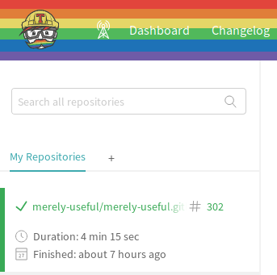
<p class="caption">(\#fig:rse-ci-add-repo)ci-add-repo</p>
</div>

<div class="figure">
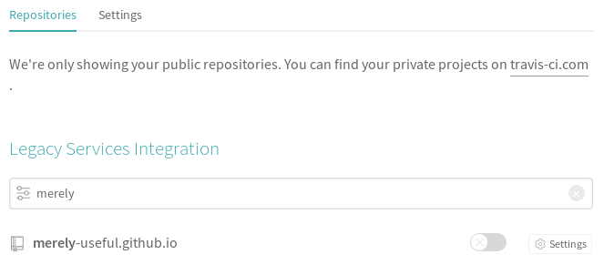
<p class="caption">(\#fig:rse-ci-list-repos)ci-list-repos</p>
</div>

### Configuring a project

The next step is to create a file called `.travis.yml`
in the root directory of the repository.
(The leading `.` in the name hides the file from casual listings on Mac or Linux,
but not on Windows.)
This file contains settings that control Travis CI's operation,
and is written in a format called [YAML][yaml] (Appendix \@ref(yaml)).
A simple template `.travis.yml` configuration file looks like this:

```yaml
language: python

python:
- "3.6"

install:
- pip install -r requirements.txt

script:
# if an example build.py file was in the src folder
- python src/build.py
```

-   `language` tells Travis CI which programming language we are using
    so that it knows which of its standard [virtual machine][virtual-machines]
    to use as a starting point for our project.
-   This example uses Python,
    so we tell Travis CI which Python version we want under the `python` key.
    We can ask Travis CI to test our project with several different versions
    by adding more versions to the list.
-   `install` tells Travis CI how to install the software we need for our project.
    For Python projects,
    we can put a list of packages in a file called `requirements.txt`
    and then use `pip` to install them (Chapter \@ref(rse-package-py)).
-   Finally,
    the entries under the `script` key tell Travis CI what to do.
    We can put almost anything here provided it doesn't need human interaction
    (i.e., doesn't ask questions).
    In this case,
    our only action is to run `src/build.py`.

After we have add this file to our repository,
Travis CI will obey the instructions in this file
every time a change is pushed to GitHub.
More specifically,
it will:

1.  Create a new Linux virtual machine.
1.  Install the desired version of Python.
1.  Install the software described in `requirements.txt`.
1.  Run the commands below the `script` key.
1.  Report the results at <code>https://travis-ci.org/<em>user</em>/<em>repo</em></code>,
    where <code><em>user/repo</em></code>
    identifies the repository.

Travis CI' summary report tells us whether the build passed,
which is shown in green Figure \@ref(fig:rse-ci-build-overview),
or whether it produced warnings or errors,
which are shown in red.

<div class="figure">

<p class="caption">(\#fig:rse-ci-build-overview)Travis Build Overview</p>
</div>

The log below this overview contains a wealth of information
that can help us debug when the build fails.

## How can I display my project's status on GitHub? {#rse-ci-display-github}

Travis CI's dashboard is very useful,
but is also convenient to display the status of the build on our project's GitHub home page
(which most people look at more often).
To add a status badge,
click the "build icon" shown in the top right corner of Figure \@ref(fig:image-github-icon)
to bring up a dialog box.
Select "Markdown" from the "Format" menu list,
then copy the Markdown text displayed in the "Result" box
and paste it into the project's `README.md` file.
(It's best to paste the text right below the page's title so that it will be instantly visible).
Once we commit and push thsi change to GitHub,
our project will now show the badge for its Travis CI status Figure \@ref(fig:image-github-icon).

<div class="figure">

<p class="caption">(\#fig:rse-ci-github-icon)The Travis CI Build Badge</p>
</div>

> **How Do Badges Work?**
>
> Badges are much simpler than they first appear.
> When someone visits our project,
> GitHub sends them the HTML of the project's home page.
> That page includes a link to an image on Travis CI's site,
> so our browser sends a request to Travis CI.
> The URL tells Travis CI's web server what project we're interested in;
> it then sends back a different image
> depending on the most recently recorded build status for that project.

## How can I set up Travis CI for an R project? {#rse-ci-setting-up-with-r}

The simplest way to set up and use Travis CI with R is to call:

```r
usethis::use_travis()
```

This command:

-   Creates a `.travis.yml` configuration file with typical settings for an R package.
-   Adds a Travis CI build badge to the project's `README.md`.
-   Opens the Travis CI page for the package so that we can activate Travis CI for the repository.
    (This assumes the package is already on GitHub and that we have a Travis CI account.)

FIXME: add example here of generated YAML file

The [usethis](https://usethis.r-lib.org/reference/ci.html) documentation has more details,
but it really is this simple.

## How can I use Travis CI to test my project? {#rse-ci-testing}

The main reason to set up CI is to test the project every time a change is made.
We still have to write unit tests (Chapter \@ref(rse-correct)),
but CI makes those tests much more valuable.

For R packages,
running tests is built into Travis CI so you don't need to modify anything.

FIXME: er, what? does this mean the commands are auto-generated by `usethis`?

FIXME: Include example here of what failing tests in R look like in Travis CI.

For Python packages,
we need to add `pytest` to the `script` key in the `.travis.yml` file:

```yaml
language: python
python:
- "3.6"
install:
- pip install -r requirements.txt
script:
- pytest
```

With this in place,
the Travis CI log located right below the build overview
will contain all of the information that our testing command produces when tests fail.

FIXME: Include example here of what failing tests in Python look like in Travis CI.

We can also have Travis CI report the [code coverage][code-coverage] of our tests (Section \@ref(rse-correct-coverage)).
If we are using R,
this command will set everything up for us:

```r
usethis::use_coverage()
```

FIXME: explain what this does to the YAML file.

To add code coverage for a Python project,
we add one line to `.travis.yml` to install the code coverage tool
and another to run it:

```yaml
language: python
python:
- "3.6"
install:
- pip install -r requirements.txt
# Install code coverage for CI
- pip install codecov
script:
- pytest
after_success:
# Send to codecov services for report
- codecov
```

We use [`codecov`][codecov] rather than the `coverage` tool described in Section \@ref(rse-correct-coverage)
because it is a service like Travis CI.

FIXME: fill in this explanation

## How can I use CI for other purposes? {#rse-ci-deploying}

Continuous integration was invented for testing,
but it can be used to automate almost anything.
For example,
if we want to create a website for an R package,
we can run:

```r
usethis::use_pkgdown()
usethis::use_pkgdown_travis()
```

to add lines like this to our `.travis.yml` file:

```yaml
language: R
sudo: false
cache: packages

before_cache: Rscript -e 'remotes::install_cran("pkgdown")'
deploy:
  provider: script
  script: Rscript -e 'pkgdown::deploy_site_github()'
  skip_cleanup: true
```

The `deploy` section tells Travis CI to put the generated website files online
using [GitHub Pages][github-pages].

FIXME: this section needs more detail.
As it is, readers will know something is possible
but not how it works or how to debug it when things go wrong.
At the least,
please explain what keys like `before_cache` are about
and provide a diagram showing what files are produced and copied where.

FIXME: Add an example for deployment Python projects.

## Summary {#rse-ci-summary}

FIXME: create concept map for continuous integration.

## Exercises {#rse-ci-exercises}

FIXME: Get feedback on this and fill it out more later.

1. Setup Travis CI for the package you've been working on (for the course).
2. Get Travis CI to run unit tests of your package (not applicable for R packages).
3. Write a new unit test in your package that you *know* will fail. Push the changes
up to GitHub.
4. Go through the Travis CI log and see what the log says about the failure and
how to fix it. Since you made it purposefully fail, you will already know how to
fix it, but the point is to get comfortable looking through Travis CI' logs.
5. Correct the test, push to GitHub, and get Travis CI to build your package
successfully.

## Key Points {#rse-ci-keypoints}


-   Continuous integration re-builds and/or re-tests software every time something changes.
-   Use continuous integration to check changes before they are inspected.
-   Check style as well as correctness.

<!--chapter:end:rse-ci.Rmd-->

# R Packaging {#rse-package-r}


## What's in an R package? {#rse-package-r-intro}

> Another response of the wizards,
> when faced with a new and unique situation,
> was to look through their libraries to see if it had ever happened before.
> This was…a good survival trait.
> It meant that in times of danger you spent the day sitting very quietly
> in a building with very thick walls.
>
> — Terry Pratchett

The more software you write,
the more you realize that a programming language is mostly
a way to build and combine software packages.
Every widely-used language now has an online [repository][repository]
from which people can download and install packages,
and sharing yours is a great way to contribute to the community
that has helped you get where you are.
This lesson shows you how to use R's tools to do this.

> ### CRAN and Alternatives
>
> [CRAN][cran],
> the Comprehensive R Archive Network,
> is the best place to find the packages you need.
> CRAN's famously strict rules ensure that packages run for everyone,
> but also makes package development a little more onerous than it might be.
> You can also share packages directly from GitHub,
> which many people do while packages are still in development.
> We will explore this in more detail below.

### Exercise: What packages do you have?

What R packages are currently installed on your computer?
How did you figure this out?

### Exercise: Can you build a package?

1.  Clone the GitHub repository for the `here` package at <https://github.com/r-lib/here>.
2.  Open `here.Rproj` in RStudio.
3.  Build the package.

Does the package build successfully?
What messages do you see?
Do any of them worry you?

## What *is* a package, exactly? {#rse-package-r-background}

Suppose you have written a useful R script and want to share it with colleagues.
You could email it to them (or point them at the GitHub repository it's in),
but what should they do next?
They could copy the file onto their computer,
but then they would have to decide where to put it
and remember their decision later on when you updated the script to fix a few bugs.
And what about the documentation you so lovingly crafted—where should it go?
Oh,
and what if different people decide to organize their files differently—how
hard will it be to make the things they have built play nicely together?

[Packages][package] solve these problems.
While the details vary from language to language,
packages always require that information about the software
be stored in a specific format and in a specific location,
so that statements like `library(something)` know where to find what they need.
They are rather like the USB ports of the software world:
anything that conforms to a few simple rules can plug in to anything else.

## How do I create a package? {#rse-package-r-create}

An R package must contain the following files:

-   The text file `DESCRIPTION` (with no suffix) describes what the package does,
    who wrote it,
    and what other packages it requires to run.
    We will edit its contents as we go along.

-   [`NAMESPACE`][namespace],
    (whose name also has no suffix)
    contains the names of everything exported from the package
    (i.e., everything that is visible to the outside world).
    As we will see,
    we should leave its management in the hands of RStudio
    and the `devtools` package we will meet below.

-   Just as `.gitignore` tells Git what files in a project to ignore,
    `.Rbuildignore` tells R which files to include or not include in the package.

-   All of the R source for our package must go in a directory called `R`;
    subdirectories below this are not allowed.

-   As you would expect from its name,
    the optional `data` directory contains any data we have put in our package.
    In order for it to be loadable as part of the package,
    the data must be saved in R's custom `.rda` format.
    We will see how to do this below.

-   Manual pages go in the `man` directory.
    The bad news is that they have to be in a sort-of-LaTeX format
    that is only a bit less obscure than the runes inscribed on the ancient dagger
    your colleague brought back from her latest archeological dig.
    The good news is,
    we can embed Markdown comments in our source code
    and use a tool called `roxygen2`
    to extract them and translate them into the format that R packages require.

-   The `tests` directory holds the package's unit tests.
    It should contain files with names like <code>test_<em>some_feature</em>.R</code>,
    which should in turn contain functions named <code>test_<em>something_specific</em></code>.
    We'll have a closer look at these in Chapter \@ref(rse-correct).

You can type all of this in if you want,
but R has a very useful package called `usethis` that will help you create and maintain packages.
To show how it works,
we will create an R package called `zipffreq` (with no dashes or other special characters in its name)
to hold word frequencies in classic English novels.
The first step is to load `usethis` in the console with `library(usethis)`
and use `usethis::create_package`
with the path to the new package directory as an argument:


```r
usethis::create_package('~/zipffreq')
```
```
✔ Setting active project to '/Users/hamilton/zipffreq'
✔ Creating 'R/'
✔ Creating 'man/'
✔ Writing 'DESCRIPTION'
✔ Writing 'NAMESPACE'
✔ Writing 'zipffreq.Rproj'
✔ Adding '.Rproj.user' to '.gitignore'
✔ Adding '^zipffreq\\.Rproj$', '^\\.Rproj\\.user$' to '.Rbuildignore'
✔ Opening new project 'zipffreq' in RStudio
```

Every well-behaved package should have a README file,
a license,
and a Code of Conduct,
so we will ask `usethis` to add those:


```r
usethis::use_readme_md()
usethis::use_mit_license(name="Merely Useful")
usethis::use_code_of_conduct()
```

(Note that `use_mit_license` creates two files: `LICENSE` and `LICENSE.md`.
The rules for R packages require the former,
but GitHub expects the latter.)
We then edit `README.md` to be:

```
# zipffreq

An example package for Merely Useful that checks Zipf's Law for classic English novels.

## Installation

TBD

## Example

FIXME: add an example.
```

and make a similar edit to `DESCRIPTION` so that it contains:

```
Package: zipffreq
Title: Checks Zipf's Law for classic English novels.
Version: 0.0.0.9000
Authors@R:
    person(given = "Merely",
           family = "Useful",
           role = c("aut", "cre"),
           email = "merely.useful@gmail.com")
Description: >
  Contains data and functions for checking Zipf's Law
  for a set of classic English novels.
License: MIT + file LICENSE
Encoding: UTF-8
LazyData: true
```

We can now go to the `Build` tab in RStudio and run `Check`
to see if our empty package makes sense.
When we do,
the check warns us that there shouldn't be a period at the end of the package title.
Once we fix that,
we get a clean bill of health.

> ### Leftovers
>
> Running `Check` creates another directory called `zipffreq.Rcheck`
> and a file called `zipffreq_0.0.0.9000.tar.gz`.
> These are created beside our project directory rather than in it
> so as not to confuse version control—we don't want
> the files we are building committed to our repository.

We can now create a placeholder for one of the functions we want to write
in a file called `R/frequency.R`
either by using `File…New` in RStudio
or by running `usethis::use_r('frequency.R')`
(which always creates the file in the `R` directory):


```r
word_count <- function(word, text) {
  0
}
```

`Build…Check` runs a lot more checks now
because we have some actual code for it to look at.
It warns us that our function needs documentation,
so we will look at that next.

### Exercise: Packaging the CO2 functions

1.  Create a brand-new package to hold the CO2 data and functions for analyzing it.
2.  Put the license file where R's packaging rules wants it.
3.  Read the documentation for `usethis::use_citation` and create a citation file.
4.  Build the package: what warnings do you get and what do they mean?

### Exercise: Exploring a package

1.  Clone a GitHub repository that contains an R package, such as <https://github.com/r-lib/usethis>.
2.  Which files in this repository do you recognize, and what are they for?
3.  Which files are there to satisfy something other than R's packaging system?

### Exercise: Ignoring Files

What does `usethis::use_build_ignore` do?
When would you use it?

## How do I use a package while I'm creating it? {#rse-package-r-use}

The `devtools` package includes functions to help you create and test packages.
After you install it,
`devtools::load_all("path/to/package")`
will do the same thing that `library(package)` does,
but use the files you are developing.
(If you run `load_all()` without a path,
it will re-load the package in the current working directory,
which is what you usually want to do during development.)

`devtools::load_all` is different from `devtools::install`,
which not only installs your package,
but also tries to install its dependencies from CRAN.
After you use `install`,
the package will be available to other projects on your computer.
This is therefore usually one of the last things you do
as you come to the end of development.

## How do I document a R package? {#rse-package-r-document}

Our next task is to document our function.
To do this,
we turn to Hadley Wickham's *[R Packages][wickham-packages]*
and Karl Broman's "[R package primer][broman-packages]"
for advice on writing roxygen2.
We then return to our source file and put a specially-formatted comment in front of our code:


```r
#' Count how often a word appears in a piece of text
#'
#' @param word the word to search for
#' @param text the text to search in
#'
#' @return number of times the word appears in the text
#'
#' @export

word_count <- function(word, text) {
  0
}
```

This comment text,
is an example of [embedded documentation][embedded-documentation],
can be easily inserted by placing the cursor somewhere in the function
and clicking the button "Code -> Insert Roxygen Skeleton" in RStudio.
Over the years,
programmers have found that if they put code in one file and documentation in another,
the documentation quickly falls out of date with the code:
people will change a function's name or add a new parameter and forget to update the docs.
If the documentation lives right beside the code,
on the other hand,
the next person to modify the code is far more likely to remember to update it.
Tools like roxygen2 can read the code,
extract the documentation,
and format it as HTML or PDF.
They can also do things like create an index,
which would be even more painful to do by hand than writing the documentation itself.

roxygen2 processes comment lines that start with `#'` (hash followed by single quote).
Putting a comment block right before a function associates that documentation with that function,
and `@something` indicates a roxygen2 command,
so what this file is saying is:

-   the function has two parameters called `word` and `text`
-   it returns the number of times the word is found in the text; and
-   we want to export it (i.e., we want it to be visible outside the package).

These roxygen2 text can also be written with [Markdown formatting][roxygen-md],
so that for instance using `**word**` will bold the word. Other common formatting
includes:

- `[function_name()]` or `[object_name]` to link to other function or object,
respectively, documentation in the same package.
- `[pkgname::function_name()]` or `[pkgname::object_name]` to link to function
or object, respectively, documentation in another package.
- `[link name](website-link)` to link to a website.

To enable Markdown with roxygen2 we'll need to install the package roxygen2md package
and use:

```r
roxygen2md::roxygen2md("full")
```

which will output something like:

```
✔ Setting active project to '/Users/hamilton/zipffreq'
No files changed.
✔ 0 source files changed
ℹ Running `devtools::document()`
Updating zipffreq documentation
Writing NAMESPACE
Loading zipffreq
Writing NAMESPACE
● Review the changes carefully
● Commit the changes to version control
✔ Setting active project to '<no active project>'
```

This converts all existing documentation to use Markdown version and will also
add this line to the `DESCRIPTION` file:

```
Roxygen: list(markdown = TRUE)
```

Ok, our function is now documented,
but when we run `Check`,
we still get a warning.
After a bit more searching and experimentation,
we discover that we need to run `devtools::document()` to regenerate documentation
because it isn't done automatically.
When we do this,
we get:

```
Updating zipffreq documentation
Updating roxygen version in /Users/hamilton/zipffreq/DESCRIPTION
Writing NAMESPACE
Loading zipffreq
Writing NAMESPACE
Writing word_count.Rd
```

We now have two files to look at:
`NAMESPACE` and `word_count.Rd`.
The first looks like this:


```r
# Generated by roxygen2: do not edit by hand

export(word_count)
```

The comment at the start tells roxygen2 it can overwrite the file,
and reminds us that we shouldn't edit it by hand.
The `export(word_count)` directive is what we really want:
as you might guess from the name `export`,
it tells the package builder to make this function visible outside the package.

What about `word_count.Rd`?
It lives in the `man` directory
and now contains:

```
% Generated by roxygen2: do not edit by hand
% Please edit documentation in R/frequency.R
\name{word_count}
\alias{word_count}
\title{Count how often a word appears in a piece of text}
\usage{
word_count(word, text)
}
\arguments{
\item{word}{the word to search for}

\item{text}{the text to search in}
}
\value{
number of times the word appears in the text
}
\description{
Count how often a word appears in a piece of text
}
```

Again,
there's a comment at the top to remind us that we shouldn't edit this by hand.
After doing this,
we go into "Build…More…Configure build tools" and check "Generate documentation with Roxygen".
Running `Check` again now gives us a clean bill of health.
If we use the `Install and Restart` button in RStudio's `Build` tab,
we can now use `?word_count` in the console to view our help.

### Exercise: Document a function

FIXME: write this exercise once the CO2 manipulation functions exist.

### Exercise: Use Markdown documentation

Read the documentation for the `roxygen2md` package,
which allows you to write R documentation in Markdown,
and then convert `zipffreq` to use Markdown documentation.

## What should I document? {#rse-package-r-docwhat}

The answer to the question in this section's title depends on what stage of development you are in.
If you are doing [exploratory programming][exploratory-programming],
a one-line comment to remind yourself of each function's purpose is good enough.
(In fact, it's probably better than what most people do.)
That comment should begin with an active verb and describe
how inputs are turned into outputs.
If the function has any [side effects][side-effects],
you should eliminate them.
If you can't,
you should describe them too.

An active verb is something like "extract", "normalize", or "find".
For example,
these are all good one-line comments:

-   "Create a list of current ages from a list of birth dates."
-   "Ensure training parameters lie in [0..1]."
-   "Reduce the red component of each pixel."

You can tell your one-liners are useful
if you can read them aloud in the order the functions are called
in place of the function's name and parameters.

Once you start writing code for other people—including yourself three months from now—your
documentation should describe:

1.  The name and purpose of every function and constant in your code.
2.  The name, purpose, and default value (if any) of every parameter to every function.
3.  Any side effects the function has.
4.  The type of value returned by every function.
5.  Why and how the function will deliberately fail.
    If a function uses something like `stopifnot` or `assert` to check that a condition holds,
    then that halt-and-catch-fire behavior is effectively part of its interface.

### Exercise: Fixing documentation

FIXME: provide poorly-documented function in CO2 package and ask learner to find and fix gaps.

### Exercise: Cross-references

1.  What should you add to the roxygen2 comments for one function to link to the documentation for another function?
2.  Add a cross-reference from the documentation for the function FIXME in the CO2 package to the documentation for the function FIXME.

### Exercise: Documenting error conditions

The guidelines above said that authors should document why and how their functions will deliberately fail.
Where and how should you do this using roxygen2 for R?

## How do I manage package dependencies? {#rse-package-r-dependencies}

In order to understand the rest of what follows,
it's important to understand that R packages are distributed as compiled [byte code][byte-code],
*not* as [source code][source-code] (which is how Python does it)
or as [binary code][binary-code] (which is how app stores distribute things).
When a package is built,
R loads and checks the code,
then saves the corresponding low-level instructions.
Our R files should therefore define functions,
not run commands immediately:
if they do the latter,
those commands will be executed every time the script loads,
which is probably not what users will want.

As a side effect,
this means that if a package uses `load(something)`,
then that `load` command is executed *while the package is being compiled*,
and *not* while the compiled package is being loaded by a user after distribution
(Figure \@ref(fig:package-distribution)).
If we have loaded the library by hand in our R session during development,
though,
we might not notice the problem.

<div class="figure">

<p class="caption">(\#fig:package-distribution)Package Distribution</p>
</div>

How then can our packages use other packages?
The safest way is to use [fully-qualified names][fully-qualified-name]
such as `stringr::str_replace`
every time we call a function from another package or that is defined somewhere outside our package.
Let's modify our word counter to use `stringr::str_count`:


```r
word_count <- function(word, text) {
  stringr::str_count(text, word)
}
```

Since our compiled-and-distributable package will only contain the compiled code for its own functions,
direct calls to functions from other packages won't work after the package is installed.
To fix this,
we ask `usethis` to add a note about `stringr` to `DESCRIPTION`:


```r
usethis::use_package('stringr')
```

The bottom of `DESCRIPTION` now has these two lines:

```
Imports:
    stringr
```

The `Imports` field in `DESCRIPTION` tells R what else it has to install when it installs our package.
To be explicit about the version of the package, we can run:

```r
usethis::use_tidy_versions()
```

Which will add the version of the package to the `DESCRIPTION` file, which will
look like:

```
Imports:
    stringr (>= 1.4.0)
```

(See Section \@ref(rse-git-advanced-tag) for a discussion of version numbering.)

All right: are we done now?
No, we are not:

### Exercise: Document dependencies

1.  Modify the functions in the CO2 package to use `package::function` name for everything.
2.  Modify the `DESCRIPTION` file to document the package's dependencies.

### Importing

1.  What does `@import` do in roxygen2 documentation?
2.  When should or shouldn't you use it?

## How can I share my package via GitHub? {#rse-package-r-github}

We said in Section \@ref(rse-package-r-intro) that R packages could be shared through GitHub
as well as through CRAN.
If someone has done this,
installing the package on your computer is as simple as:


```r
devtools::install_github("username/reponame")
```

where `username` and `reponame` are the names of the user and the project respectively.
If you want to share your work,
all you have to do is create a repository whose contents are laid out
as described earlier in this chapter:
if it looks like an R project,
`install_github` will treat it as one.

## How can I add data to a package? {#rse-package-r-data}

The last steps are to add some cleaned-up data to our package
and document the package as a whole. If we want to create fake data or clean up
raw data, we should first run the command:

```r
# Let's name the data "small_data", but it can be anything.
usethis::use_data_raw("small_data")
```

which outputs:

```
✔ Creating 'data-raw/'
✔ Adding '^data-raw$' to '.Rbuildignore'
✔ Writing 'data-raw/small_data.R'
● Modify 'data-raw/small_data.R'
● Finish the data preparation script in 'data-raw/small_data.R'
● Use `usethis::use_data()` to add prepared data to package
```

that creates the `data-raw/` folder and the `small_data.R` file in that folder.
Inside that new file is:

```
## code to prepare `small_data` dataset goes here

usethis::use_data("small_data")
```

Let's replace the first comment with:


```r
small_data <- tribble(
  ~word,  ~ count,
  "some",   2,
  "words",  1,
  "appear", 1,
  "times",  1)
```

which looks like:

```
# A tibble: 4 x 2
  word   count
  <chr>  <dbl>
1 some       2
2 words      1
3 appear     1
4 times      1
```

Remove the quotes within the `use_data()`. The new file should contain the code:

```r
small_data <- tribble(
  ~word,  ~ count,
  "some",   2,
  "words",  1,
  "appear", 1,
  "times",  1
  )

usethis::use_data(small_data)
```

Run the script by hitting "Source" (or `source("data-raw/small_data.R")`). This
will output:

```
✔ Creating 'data/'
✔ Saving 'small_data' to 'data/small_data.rda'
```

Now the `small_data` data.frame object is saved to `data/` and is now accessible
throughout the package!

When we run `Check`,
we get a complaint about an undocumented data set,
so we create a file called `R/small_data.R` to hold documentation about the dataset
and put this in it:


```r
#' Sample word frequency data.
#'
#' This small dataset contains word frequencies for tutorial purposes.
#'
#' @docType data
#'
#' @format A data frame
#' \describe{
#'   \item{word}{The word being counted (chr)}
#'   \item{n}{The number of occurrences (int)}
#' }
"small_data"
```

Everything except the last line is a roxygen2 comment block
that describes the data in plain language,
then uses some tags and directives to document its format and fields.
The line `@docType` tells roxygen2 that this comment describes data rather than a function,
and the last line is the string `"small_data"`,
i.e.,
the name of the dataset.
We will create one placeholder R file like this for each of our datasets,
and each will have that dataset's name as the thing being documented.

Running `Check` now gives us a different warning:

```
    Warning: package needs dependence on R (>= 2.10)
```

We do *not* fix this by adding another line under `Imports` in `DESCRIPTION`,
since R itself isn't a package.
Instead,
we add this line:

```
Depends: R (>= 2.10)
```

and get a clean bill of health.

We use a similar trick to document the package as a whole:
we create a file `R/zipffreq.R`
(i.e., a file with exactly the same name as the package)
and put this in it:


```r
#' Example of an R package.
#'
#' @author Merely Useful, \email{merely.useful@gmail.com}
#' @docType package
#' @name zipffreq
NULL
```

That's right:
to document the entire package,
we document `NULL`.
One last build,
and our package is ready to deliver.

> ### The Virtues of Laziness
>
> We should always put `LazyData: TRUE` in `DESCRIPTION`
> so that datasets are only loaded on demand.

### Exercise: Letting `usethis` do even more work

What does `usethis::use_package_doc` do?

### Exercise: Scripting data creation

1.  Put the code two create `small_data` in an R script in `data-raw` via `usethis::use_data_raw()`.
2.  Include `usethis::use_data(small_data)` at the end of the script.
3.  Describe what this script does step by step.

### Exercise: Add sample data to the CO2 package

1.  Create a small sample of the CO2 data in a tibble called `sample_CO2_data`.
2.  Save it and document it.

### Exercise: Reproducible data set creation

1.  Write a small script to create and save the sample dataset from the previous exercise.
2.  Where should this script go in your package? How should you document its existence and usage?
3.  Swap packages with a colleague. Can you regenerate their sample data using only what is (documented) in their package?

## Summary {#rse-package-r-summary}

<div class="figure">

<p class="caption">(\#fig:rse-package-r-concept)R Packaging Concept Map</p>
</div>

## Key Points {#rse-package-r-keypoints}


-   Packages allow software to be shared in manageable ways.
-   R packages can be shared through CRAN or GitHub, or managed locally during development.
-   Packages can contain code and data.
-   A package must contain `DESCRIPTION` and `NAMESPACE` files.
-   Use `.Rbuildignore` to control what is and isn't included in a package.
-   Include a README, a license, and a citation file in every package.
-   Use `usethis` and `devtools` to manage package development.
-   Put documentation in the `man` directory and tests in the `tests` directory.
-   Use roxygen2 or Markdown to document the contents of a package.

<!--chapter:end:rse-package-r.Rmd-->

# Python Packaging {#rse-package-py}


> Another response of the wizards,
> when faced with a new and unique situation,
> was to look through their libraries to see if it had ever happened before.
> This was…a good survival trait.
> It meant that in times of danger you spent the day sitting very quietly in a building with very thick walls.
>
> — Terry Pratchett

The more software you write,
the more you realize that a programming language is a way to build and combine software libraries.
Every widely-used language now has an online repository
from which people can download and install those libraries.
This lesson shows you how to use Python's tools to create and share libraries of your own.

This material is based in part on [Python 102][python-102] by [Ashwin Srinath][srinath-ashwin].

## How can I turn a set of Python source files into a module? {#rse-package-py-modules}

Any Python source file can be imported by any other.
(This is why Python files should be named using [`pothole_case`][pothole-case]
instead of [`kebab-case`][kebab-case]:
an expression like `import some-thing` isn't allowed
because `some-thing` isn't a legal variable name.)
When a file is imported,
the statements in it are executed as it loads.
Variables, functions, and items defined in the file are
then available as `module.name`, where `module` is the
filename (without the `.py` extention) and `name` is the
name of the item.

As an example,
we can put a constant and two functions used in our Zipf's Law study in a file called `zipf.py`:

```python
from pytest import approx

RELATIVE_ERROR = 0.05

def make_zipf(length):
    assert length > 0, 'Zipf distribution must have at least one element'
    result = [1/(1 + i) for i in range(length)]
    return result


def is_zipf(hist, rel=RELATIVE_ERROR):
    assert len(hist) > 0, 'Cannot test Zipfiness without data'
    scaled = [h/hist[0] for h in hist]
    perfect = make_zipf(len(hist))
    return scaled == approx(perfect, rel=rel)
```

and then use `import zipf`,
`from zipf import is_zipf`,
and so on:

```python
from zipf import make_zipf, is_zipf

generated = make_zipf(5)
print('generated distribution: {}'.format(generated))
generated[-1] *= 2
print('passes test with default tolerance: {}'.format(is_zipf(generated)))
print('passes test with tolerance of 1.0: {}'.format(is_zipf(generated, rel=1.0)))
```

Running this program produces the following output:

```text
generated distribution: [1.0, 0.5, 0.3333333333333333, 0.25, 0.2]
passes test with default tolerance: False
passes test with tolerance of 1.0: True
```

It also creates a subdirectory called `__pycache__`
that holds the compiled versions of the imported files.
The next time Python imports `zipf`,
it checks the timestamp on `zipf.py` and the timestamp on the corresponding file in `__pycache__`.
If the latter is more recent,
Python doesn't bother to recompile the file:
it just loads the bytes in the cached version and uses those.
In the general spirit of ["Don't Repeat Yourself (DRY)"][dry]
we typically don't put both the original and processed versions of files in
version control (it can be convenient, but then you have to have processes
in place to make sure that they stay in sync) so we normally add the
`__pycache__` directory to in `.gitignore`.

### Exercise: Hello, Zipf!

Put a statement

```python
print("Hello, Zipf!")
```
at the end of `zipf.py`.

1. What happens when you start Python interactively and import the
module with the command `import zipf`?
2. Python caches modules that have been imported.  What happens if you
type `import zipf` again?

## How can I control what is executed during import and what isn't? {#rse-package-py-import}

Sometimes it's handy to be able to import code and also run it as a program.
For example,
we may have a file full of useful functions for extracting keywords from text
that we want to be able to use in other programs,
but also want to be able to run `keywords somefile.txt` to get a listing.

To help us do this,
Python automatically creates a variable called `__name__` in each module.
If the module is the main program,
(e.g. when the script is run from the command line)
that variable is assigned the string `'__main__'`.
Otherwise (e.g. when the module is imported into a script), it is assigned the module's name.
Using this leads to modules like this:

```python
import sys
from pytest import approx

USAGE = '''zipf num [num...]: are the given values Zipfy?'''
RELATIVE_ERROR = 0.05

def make_zipf(length):
    ...as before...

def is_zipf(hist, rel=RELATIVE_ERROR):
    ...as before...

if __name__ == '__main__':
    if len(sys.argv) == 1:
        print(USAGE)
    else:
        values = [int(a) for a in sys.argv[1:]]
        result = is_zipf(values)
        print('{}: {}'.format(result, values))
    sys.exit(0)
```

Here,
the code guarded by `if __name__ == '__main__'` isn't executed when the file loaded by something else.
We can test this by re-running `use.py` as before:
the usage message doesn't appear,
which means the main block wasn't executed,
which is what we want.

### Exercise: What is `__name__` in different contexts?

1. Start an interactive Python interpreter, and run `print(__name__)`.
What do you get?
2. Add the statement `print(__name__)` to the end of the file `zipf.py`
and from the Python interpreter, run `import zipf`.  What is the name
printed?

### Exercise: Turn `use.py` into a unit test

1. Turn the `use.py` script into a `pytest` unit test; name the file `test_zipf.py`.

## How do I create a package? {#rse-package-py-creating}

Let's say we wanted to add some capabilities to what
we've built: we want to be able to generate noisy
Zipf distributions—noise within the same default `RELATIVE_ERROR`—and
we want to add a Zipf-checker that can handle unsorted inputs:

```python
...as before...

def make_zipf(length):
    assert length > 0, 'Zipf distribution must have at least one element'
    result = [1/(1 + i) for i in range(length)]
    return result

def make_noisy_zipf(length, rel=RELATIVE_ERROR):
    data = make_zipf(length)
    minnoise = 1.0 - rel/2
    maxnoise = 1.0 + rel/2
    for i in range(length):
        data[i] = data[i] * random_uniform(minnoise, maxnoise)
    return data

def is_zipf(hist, rel=RELATIVE_ERROR):
    assert len(hist) > 0, 'Cannot test Zipfiness without data'
    scaled = [h/hist[0] for h in hist]
    perfect = make_zipf(len(hist))
    return scaled == approx(perfect, rel=rel)

def is_unsorted_zipf(hist, rel=RELATIVE_ERROR):
    sortedhist = sorted(hist)
    return is_zipf(unsorted, rel)

...as before...
```

As our package grows,
we should split its source code into multiple files,
and this is now starting to look like two broad types of
related functionality: generating a Zipf distribution, and
checking against a Zipf distribution.  But they are related;
and what's more, there are constants that would be common
across the two pieces - the `RELATIVE_ERROR` constant.

If we want multiple files, but they are related and
and have some common items, that's a good indication that
we are outgrowing a single-file module and we want a Python
package.

A package in Python is no more than a directory containing
Python code, and by convention a Python file with a special
name, `__init__.py` (this was a requirement before Python 3.3).
Just as importing a module file executes the code in the module,
importing a package executes the code in `__init__.py`.

### Exercise: Create a package for our Zipf code.

We're going to create a package for the code we've written
for the Zipf distribution.  In the long and honourable(?)
tradition of package names ending in "py", we'll call our
package zipfpy.

1. Create a `zipfpy` directory and move the file `zipf.py` into that directory.
2. Create an empty file `zipfpy/__init__.py`.
3. Modify the test suite so that it runs; functions will now be found in the [namespace][namespace] `zipfpy.zipf` rather than `zipf`.
4. Run the test suite with `pytest`

### Exercise: "Hello `__init__.py`"

Repeat the "Hello, Zipf!" exercise by temporarily adding the
line `print("Hello, Init!")` to the `__init__.py`.  Then
from the directory containing the directory `zipfpy`, start
a Python interpreter and run:

```python
import zipfpy
```

What happens?

When you're done, remove the `print()` line from `__init__.py`.


## Referring to modules within the same package: multiple files

With that done, we're going to start splitting our module up into smaller components,
which will each be part of the package.  We'll split our routines up into functions that
generate Zipf-distributed data and those that test for Zipf-y-ness.  So we'll
have a `zipf/generate.py`

```python
from random import uniform

RELATIVE_ERROR = 0.05

def make_zipf(length):
    ...


def make_noisy_zipf(length, rel=RELATIVE_ERROR):
    ...
```

and a `zipf/check.py`.  Now here we have another
change to make; the the `is_zipf` function refers
to the `generate` routine, which is in another file,
but within the same module.

In this case of within-package imports, we have to use [`relative imports`][relative-import] to
refer to other files within the module; this is
a little bit like using relative paths vs absolutely
paths in the shell, right down to `.` referring
to the current directory.  We could use:

```python
from . import generate

...
x = generate.make_zipf(...)
```

or

```python
from .generate import make_zipf

...
x = make_zipf(...)
```

either would work.  Let's use the second to write `zipf/check.py`:

```python
import sys
from pytest import approx
from .generate import make_zipf


USAGE = '''zipf num [num...]: are the given values Zipfy?'''
RELATIVE_ERROR = 0.05


def is_zipf(hist, rel=RELATIVE_ERROR):
    assert len(hist) > 0, 'Cannot test Zipfiness without data'
    scaled = [h/hist[0] for h in hist]
    perfect = make_zipf(len(hist))
    return scaled == approx(perfect, rel=rel)


def is_unsorted_zipf(hist, rel=RELATIVE_ERROR):
    ...

if __name__ == '__main__':
    if len(sys.argv) == 1:
        print(USAGE)
    else:
        values = [int(a) for a in sys.argv[1:]]
        result = is_zipf(values)
        print('{}: {}'.format(result, values))
    sys.exit(0)
```

Now we just need to update our tests; outside of the package,
we refer to `zipfpy.generate` and `zipfpy.check` as we did
before with `zipfpy.zipf`:

```python
import zipfpy.generate
import zipfpy.check

def test_default_tolerance(length=5):
    generated = zipf.generate.make_zipf(length)
    assert zipf.check.is_zipf(generated)

...
```

### Exercise: Factor out the package-wide constant `RELATIVE_ERROR`

It's perfectly valid for an `__init__.py` file to be empty,
but it is also a very useful place to put definitions that are
common to the entire package.

Here, both `generate` and `check` use the same default `RELATIVE_ERROR`;
let's move that into `__init__.py`:

1. Add the line `RELATIVE_ERROR = 0.05` to `__init__.py`;
2. Now we can remove the line definining `RELATIVE_ERROR` from `check.py`
and `generate.py`, but;
3. We still need to import that definition somehow, or else those functions
won't know what a `RELATIVE_ERROR` is; add the line `from . import RELATIVE_ERROR`
to each so that it is visible.  When we don't specify a file, it imports the
definition from `__init__.py` (just as `import zipfpy` will read the `__init__.py`)
4. Run the test suite with `pytest`

We haven't shortened the code any here—we've replaced a `RELATIVE_ERROR = 0.05`
with an `from . import RELATIVE_ERROR`—but now the constant is defined in only
one location so we don't have to worry about editing it in one location and that
value being out of sync in the other.

### Exercise: Importing from within __init__.py

Since any code that does an `import zipf` will read `__init__.py`, it
can be convenient to put import statments in `__init__.py` itself, to
ensure that some key definitions are readily available when the package
is imported.

We'll try that here:

1. Add the lines `from .generate import *` and `from .check import *` to
`zipfpy/__init__.py`.
2. In the test suite, you can now just call `import zipfpy` and refer to,
_e.g._, `zipfpy.make_zipf(...)` instead of `zipfpy.generate_make_zipf(...)`.
Make those changes
3. Run the test suite with `pytest`

Note that it doesn't make sense to import absolutely everything like we
have here into the `zipfpy` namespace—it kind of defeats the purpose
of having split up the files—but for a modest number of key definitions
this can be very convenient for the package users.

4. Undo the changes you made in 1. and 2., and make sure the test suite
still runs.

## What does it mean to install a Python package? {#rse-package-py-install}

By the end of this chapter, you'll have made and published a Python
package that anyone with an internet connection can install.  You've
certainly installed Python packages before, such as with `pip install`;
the `pip` tool is the most common way to install Python packages.
The command <code>pip install <em>package</em></code>
checks to see if the package is already installed (or needs to be upgraded);
if so,
it downloads the package from [PyPI][pypi] (the Python Package Index),
unpacks it,
and installs it.

But what does it mean to install a Python package?

You've seen that when you have a Python module or package in the current
directory named, say, `zipfpy`, Python will successfully find that module
and directory when it runs `import zipfpy`.  But clearly having all of the
Python standard library, all installed packages, and our own code in the
same directory gets unwieldly quickly - especially if we want to run our
routines from a directory full of data!

Just as the `PATH` environment in the shell contains a list of directories that
the shell searches for programs it can execute, in Python a variable `sys.path`
(in the system-standard `sys` package) contains a list of the directories to
search.  Create a Python file `showpath.py` containing the following, and
then run it with `python showpath.py`:

```python
import sys

for directory in sys.path:
    print(directory)
```

If you are using the Anaconda distribution of Python and you run this script
from your desktop, you will see a list that looks like this:

```
/Users/pterry/Desktop
/Users/pterry/anaconda3/lib/python36.zip
/Users/pterry/anaconda3/lib/python3.6
/Users/pterry/anaconda3/lib/python3.6/lib-dynload
/Users/pterry/anaconda3/lib/python3.6/site-packages
/Users/pterry/anaconda3/lib/python3.6/site-packages/aeosa
```

the first will be your current directory - a Python environment
always looks there first - and the rest are system paths for
the Python installation you are using.

To install a package, then means to copy the contents of the
package in some form into one of the directories that Python
will search from.

### Exercise: Find a package in pip list

The `pip list` command will generate a list of Python packages
installed using pip in the current environment.  Here we'll find
a package that we've recently installed.

1.  Run `pip list`, and from the list pick something that you've
installed recently; if you can't think of anything, choose `pytest`.
2.  Run the `showpath.py` script to show the list of paths the package could be in.
3.  Search the paths in 2. for files corresponding to the package you choose in 1.;
`site-packages` is normally a good place to start looking.

## How can I have only the packages my projects need? {#rse-package-py-virtualenv}

It can be convenient to have several different Python environments that
you can switch between.  One reason is that you're probably working on
multiple projects at any given time, each with different requirements
for Python packages, and you want to keep them straight.

Another reason concerns us a bit more immediately.  We want to make sure
that other people can successfully install and use our package.  That
means:

* We want to be able to easily test install and uninstall our package, without affecting
the entire Python environment; and
* We want to avoid having to answer problems people have with your package with
something more helpful than "I don't know, it works for me", by making sure we
can install and run our package in a completely empty environment, so we can tell
that we're not accidentlly relying on some other package being installed.

A very handy answer to both of those needs is a [virtual environment][virtual-environment].
A virtual environment is a layer on top of an existing Python installation.
Whenever Python needs to find a library,
This gives us a place to install packages that only some projects need,
or that are still under development,
without affecting the main installation (Figure \@ref(fig:rse-package-py-virtualenv).

<div class="figure">

<p class="caption">(\#fig:rse-package-py-virtualenv)Virtual Environments</p>
</div>

We can create and manage virtual environments using a tool called `virtualenv`.
To install it,
run `pip install virtualenv`.
Once we have done that,
we can create a new virtual environment called `test` by running:

```shell
$ virtualenv test
```
```text
Using base prefix '/Users/pterry/anaconda3'
New python executable in /Users/pterry/test/bin/python
Installing setuptools, pip, wheel...
done.
```

`virtualenv` creates a new directory called `test`,
which contains subdirectories called `bin`, `lib`, and so on—everything
needed for a minimal Python installation.
Crucially,
`test/bin/python` checks for packages in `test/lib` *before* checking the system-wide install.

We can switch to the `test` environment by running:

```shell
$ source test/bin/activate
```

`source` is a Unix shell command meaning "run all the commands from a file in this currently-active shell".
We use it because typing `test/bin/activate` on its own would run those commands in a sub-shell,
which would have no effect on the shell we're in.
Once we have done this,
we're running the Python interpreter in `test/bin`:

```shell
$ which python
```
```text
/Users/pterry/test/bin/python
```

We can now install packages to our heart's delight.
Everything we install will go under `test`,
and won't affect the underlying Python installation.
When we're done,
we can switch back to the default environment with `deactivate`.
(We don't need to `source` this.)

Many developers create a directory called `~/envs`
(i.e., a directory called `envs` directly below their home directory)
to store their virtual environments:

```shell
$ cd ~
$ mkdir envs
$ which python
```
```text
/Users/pterry/anaconda3/bin/python
```
```shell
$ virtualenv envs/test
```
```text
Using base prefix '/Users/pterry/anaconda3'
New python executable in /Users/pterry/envs/test/bin/python
Installing setuptools, pip, wheel...done.
```
```shell
$ which python
```
```text
/Users/pterry/anaconda3/bin/python
```
```shell
$ source envs/test/bin/activate
```
```text
(test)
```
```shell
$ which python
```
```text
/Users/pterry/envs/test/bin/python
(test)
```
```shell
$ deactivate
```
```shell
$ which python
```
```text
/Users/pterry/anaconda3/bin/python
```

Notice how every command now displays `(test)` when that virtual environment is active.
Between Git branches and virtual environments,
it can be very easy to lose track of what exactly you're working on and with.
Having prompts like this can make it a little less confusing;
using virtual environment names that match the names of your projects
(and branches, if you're testing different environments on different branches)
quickly becomes essential.


### Exercises: Examining the virtual environment

1. If you haven't already, create a `test` virtual environment and activate it.  Your prompt should now start with `(test)`.
2. Run `pip list`. What packages are installed?
3. Run the `showpath.py` script from the earlier section, and note that the paths are different from your
base environment where you looked for packages.  They probably look like `/Users/pterry/envs/test/lib/python-3.7/site-packages`.
4. Pick a package you know you have installed in your base environment—pick `pytest` if you can't think of one—and
try to import it in a Python interpreter.  Can it be found?
5. Deactive the environment and try again.

### Exercises: Installing a package into the virtual environment

1. Re-activate the `test` virtual environment from above, and if necessary,
re-run the `showpath.py` script.
2. Let's install a simple package, `click`; it's a commonly used package for
creating simple command-line tools, but for our purposes it's just a small
self-contained package.  Run `pip install click`.
3. Search in the directories output from `showpath.py` for a package named `click`;
it will be a directory containing an `__init__.py`.
4. Start a Python interpreter, and run `import click`; it is installed in the environment.
5. From that same interpretter, run `print(click.path)`; that is the path to the click package.
It should report the same directory that you found it in.
6. Exit the Python interpretter

Now let's just clarify that the environment is different than the directory you
installed the virtual environment contents in:

1. Start another terminal, and go to the directory containing the `test` virtual environment contents.
2. Run the `showpath.py` script - does it show the directories in the base environment or the virtual environment?
3. Start a Python interpretter, and try `import click`.
4.
    a. If you didn't have `click` installed in the base environment, this will fail.
    b. If you did have `click` installed in the base environment, this will be successful, but the click path will be different: `print(click.__path__)` to verify.
5. Exit the Python interpreter, and deactivate the `test` environment in the other terminal.

## How can I create an installable Python package? {#rse-package-py-package}

People can always get your package by cloning your repository and copying files from that
(assuming your repository is accessible,
which is should be for published research),
but it's much friendlier to create something they can install
(and it will be easier for us when it comes to running test suites
and distributing, too!)

For historical reasons,
Python has several ways to build an installable package.
We will show how to use [setuptools][setuptools],
which is the lowest common denominator;
[conda][conda] is a modern does-everything solution,
but the setuptools approach we describe below will
allow everyone, regardless of what python distribution
they use, to easily use your package.

To use `setuptools`,
we must create a file called `setup.py` in the directory *above* the root directory of the package:

```text
+- setup.py
+- test_zipfpy.py
+- zipfpy
    +- __init__.py
    +- check.py
    +- generate.py
```

The file `setup.py` must have exactly that name,
and must contain these lines:

```python
from setuptools import setup

setup(
    name='zipfpy',
    version='0.1',
    author='Greg Wilson',
    packages=['zipfpy']
)
```

This is enough to be able to install the package from the
local copy source code using standard tools!

Let's create a virtual environment to test the installation:

```text
$ virtualenv ~/envs/test_zipfpy
...
$ source ~/envs/test_zipfpy/bin/activate
(test_zipfpy) $ pip install .
Processing /Users/pterry/zipfpy/
Building wheels for collected packages: zipfpy
  Building wheel for zipfpy (setup.py) ... done
  Stored in directory: /private/var/folders/44/[etc]
Successfully built zipfpy
Installing collected packages: zipfpy
Successfully installed zipfpy-0.1
```

Success!  If you take a look in `test_zipfpy/lib/python3.7/site-packages/`, you will
now see the package with all the other site packages.

We can generate Zipf-distributed data to our hearts content:

```python
>>> import zipfpy
>>> import zipfpy.generate
>>> zipf_out = zipfpy.generate.make_zipf(5)
>>> print(zipf_out)
[1.0, 0.5, 0.3333333333333333, 0.25, 0.2]
```

But if we continue and try to check the output, we'll find a problem:

```python
>>> import zipfpy.check
Traceback (most recent call last):
  File "<stdin>", line 1, in <module>
  File "/Users/pterry/zipfpy/zipfpy/check.py", line 2, in <module>
    from pytest import approx
ModuleNotFoundError: No module named 'pytest'
```

Ah ha - we're missing a dependency. We use `pytest` for approximate
value comparison.  How best should we document this requirement?

Since a project may depend on many packages,
developers frequently put a list of those dependencies in a file called `requirements.txt`.
`pip install -r requirements.txt` will then install the dependencies listed in that file.
(The file can be called anything,
but everyone uses `requirements.txt`,
so you should too.)
This file can just list package names,
or it can specify exact versions, minimum versions, etc.:

```text
request
scipy==1.1.0
tdda>=1.0
```
If you want to create a file like this,
`pip freeze` will print the exact versions of all installed packages.
`pip freeze` provides the same output as `pip list`, but in less human-reader-friendly
way and a more easily parsed by computer program format.

So let's install the dependency, ensure that it works, and then create the
`requirements.txt` file:

```text
(test_zipfpy) $ pip uninstall zipfpy
(test_zipfpy) $ pip install pytest
Collecting pytest
...[stuff omitted]...
Installing collected packages: py, zipp, importlib-metadata, pluggy, wcwidth, pyparsing, six, packaging, attrs, more-itertools, atomicwrites, pytest
Successfully installed atomicwrites-1.3.0 attrs-19.1.0 importlib-metadata-0.18 more-itertools-7.0.0 packaging-19.0 pluggy-0.12.0 py-1.8.0 pyparsing-2.4.0 pytest-4.6.3 six-1.12.0 wcwidth-0.1.7 zipp-0.5.1
(test_zipfpy) $ pip freeze > requirements.txt
(test_zipfpy) $ cat requirements.txt
atomicwrites==1.3.0
attrs==19.1.0
importlib-metadata==0.18
more-itertools==7.0.0
packaging==19.0
pluggy==0.12.0
py==1.8.0
pyparsing==2.4.0
pytest==4.6.3
six==1.12.0
wcwidth==0.1.7
zipp==0.5.1
```

(Note that the version numbers, current at the time of writing, will change).

Now we should be able to import `zipfpy.check`:

```text
(test_zipfpy) $ pip install .
...
(test_zipfpy) $ python
Python 3.7.2 (default, Mar  9 2019, 23:21:06)
[Clang 10.0.0 (clang-1000.11.45.5)] on darwin
Type "help", "copyright", "credits" or "license" for more information.
>>> import zipfpy.check
>>>
```

Great!  Let's make sure it works from scratch.  Let's deactivate and
completely delete the previous environment and try again:

```text
(test_zipfpy) $ deactivate
$ rm -r test_zipfpy
$ virtualenv test_zipfpy_2
$ source test_zipfpy_2/bin/activate
(test_zipfpy_2) $ pip install -r requirements.txt
Installing collected packages: atomicwrites, attrs, zipp, importlib-metadata, more-itertools, pyparsing, six, packaging, pluggy, py, wcwidth, pytest
Successfully installed atomicwrites-1.3.0 attrs-19.1.0 importlib-metadata-0.18 more-itertools-7.0.0 packaging-19.0 pluggy-0.12.0 py-1.8.0 pyparsing-2.4.0 pytest-4.6.3 six-1.12.0 wcwidth-0.1.7 zipp-0.5.1
(test_zipfpy_2) $ pip install .
Processing ...
Building wheels for collected packages: zipfpy
  Building wheel for zipfpy (setup.py) ... done
  Stored in directory: /private/var/folders/44/k2tfp8d12h7ggxc0xz8phfmr0000gn/T/pip-ephem-wheel-cache-ab2atma5/wheels/4b/65/6c/557b5122e27983111d3410a06ef63b7b0f3b848df218bb28ed
Successfully built zipfpy
Installing collected packages: zipfpy
Successfully installed zipfpy-0.1
(test_zipfpy_2) $ python -m pytest
=============================================================== test session starts ================================================================
platform darwin -- Python 3.7.2, pytest-4.6.3, py-1.8.0, pluggy-0.12.0
rootdir: /Users/pterry/Desktop/zipfpy
collected 3 items

test_zipf.py ...                                                                                                                             [100%]

============================================================= 3 passed in 0.02 seconds =============================================================
(test_zipfpy_2)
```

Success!

## How can I distribute command-line scripts in my Python package? {#rse-package-py-distrib-scripts}

Our package now works and can be installed in Python environments.

One downside of our packaging is that we've now buried the useful command-line
script that is now currently sits in `zipfpy/check.py`; we used to be able to
run that script as `python zipf.py 100 50 33` to test if a set of counts approximately
matched a zipf distribution:

```python
import sys
...

USAGE = '''zipf num [num...]: are the given values Zipfy?'''

...
if __name__ == '__main__':
    if len(sys.argv) == 1:
        print(USAGE)
    else:
        values = [int(a) for a in sys.argv[1:]]
        result = is_zipf(values)
        print('{}: {}'.format(result, values))
    sys.exit(0)
```

The `setuptools` package allows us to install not only the Python
package itself, but also associated scripts that it places with
other executable files.  So let's split that command line utility
out into its own tool, `bin/check_zipf.py`:

```python
#!/usr/bin/env python
import sys
import zipfpy.check

USAGE = '''zipf num [num...]: are the given values Zipfy?'''

if __name__ == '__main__':
    if len(sys.argv) == 1:
        print(USAGE)
    else:
        values = [int(a) for a in sys.argv[1:]]
        result = zipfpy.check.is_zipf(values)
        print('{}: {}'.format(result, values))
    sys.exit(0)
```

That means that the `zipfpy/check.py` file now contains only
the routines `is_zipf()` and `is_unsorted_zipf()`:

```python
from pytest import approx
from .generate import make_zipf
from . import RELATIVE_ERROR


def is_zipf(hist, rel=RELATIVE_ERROR):
    assert len(hist) > 0, 'Cannot test Zipfiness without data'
    scaled = [h/hist[0] for h in hist]
    perfect = make_zipf(len(hist))
    return scaled == approx(perfect, rel=rel)


def is_unsorted_zipf(hist, rel=RELATIVE_ERROR):
    sortedhist = sorted(hist)
    return is_zipf(sortedhist)
```

Now we make sure that setuptools knows about this script and
will install it:

```python
from setuptools import setup

setup(
    name='zipfpy',
    version='0.1',
    author='Greg Wilson',
    packages=['zipfpy'],
    scripts=['bin/check_zipf.py']
)
```


Now we we'll install the updated package in a virtual environment:

```text
coredump-2:08 pterry$ virtualenv test_script
..
Installing setuptools, pip, wheel...
done.
$ source test_script/bin/activate
(test_script) $ pip install -r requirements.txt
...
Installing collected packages: atomicwrites, attrs, zipp, importlib-metadata, more-itertools, six, pyparsing, packaging, pluggy, py, wcwidth, pytest
pip Successfully installed atomicwrites-1.3.0 attrs-19.1.0 importlib-metadata-0.18 more-itertools-7.0.0 packaging-19.0 pluggy-0.12.0 py-1.8.0 pyparsing-2.4.0 pytest-4.6.3 six-1.12.0 wcwidth-0.1.7 zipp-0.5.1
ins
(test_script) $ pip install .
...
Building wheels for collected packages: zipfpy
  Building wheel for zipfpy (setup.py) ... done
  Stored in directory: /private/var/folders/44/k2tfp8d12h7ggxc0xz8phfmr0000gn/T/pip-ephem-wheel-cache-0z_4yd1b/wheels/1c/84/f1/3dedca5ae7f979ead1ca046473b4a1f13552e873ccf1c1d958
Successfully built zipfpy
Installing collected packages: zipfpy
Successfully installed zipfpy-0.1

(test_script) $ check_zipf.py 100 50 33 25
True: [100, 50, 33, 25]
```

## How should I document my package for others? {#rse-package-py-document}

As we get our package ready for sharing with others, we should
make sure there's enough documentation written for our intended
initial users to successfully install the software and begin to
use key functionality.

Ideally we've been maintaining documentation throughout the development
process.  But the documentation we keep through that process is often
intended for a different audience and purpose—that is, it's meant for
us while developing the code, and so includes things that are good and
useful like code comments reminding us why steps are taken, but may
not include overviews of the package and how (and why!) to use it, which
we largely take for granted.

We should certainly have a README for the package, describing how to
install the package and how to use it in a couple of key use cases,
so let's add that.

In the Python community, much documentation is written in
[reStructuredText][restructured-text], which is
a markup format for plain text documents which can be rendered
into documents with quite complex indexes and cross-linking
by many documentation tools; GitHub will recognize reST files
ending in `.rst` and display them nicely.   We'll use that here;
titles are underlined and overlined, section headings are underlined,
and code blocks are set off with two colons (`::`) and indented.
So let's create a `README.rst`:

```text
======
Zipfpy
======

This python package provides routines for generating lists of counts
that follow (exactly or approximately) a Zipf distribution, and for
testing whether a counts distribution does or doesn't follow such
a distribution.

Installation
------------

To install, clone this repository, change into the repository directory
and run the commands::

    pip install -r requirements.txt
    pip install .

Use
---

You can use the package after installation with `import zipfpy`, with functions
in the modules `check` and `generate`.

You can also use the command line tool `check_zipf.py` which tests to see if
a provided list of countsfollows a Zipf distribution::

    $ check_zipf.py 100 50 33 25
    True: [100, 50, 33, 25]

Authors
-------

Terry Pratchett
```

In addition to the README, we should also make sure that there are
[docstrings](#docs-docstrings) written for the package as a whole
(in the `__init__.py`):

```python
"""
The zipfpy package contains tests of distributions of counts to see if
they follow a Zipf distribution (https://en.wikipedia.org/wiki/Zipf%27s_law)
using the routines in the check module, and routines for generating
lists of counts that follow a Zipf distribution in the generate module.
"""
RELATIVE_ERROR = 0.05
```

and for key routines like `is_zipf` and `make_zipf`:

```python
def is_zipf(hist, rel=RELATIVE_ERROR):
    """Tests if a histogram of counts follows a Zipf distribution.

    Given a list of counts as hist, assumed sorted in decreasing order,
    and a relative error tolerance (if not provided, the default value
    zipfpy.RELATIVE_ERROR is used), tests to see if the counts follow
    a Zipf distribution.

    Args:
        hist: an list or other iterable containing a list of numeric counts
        rel: the relative error tolerance used if provided; if not,
             the package default is used.

    Returns:
        True if the list of counts follows a zipf distribution within
        the relative tolerance.  False otherwise.

    Raises:
        AssertionError: raised if an empty list is passed.
    """
    assert len(hist) > 0, 'Cannot test Zipfiness without data'
    scaled = [h/hist[0] for h in hist]
    perfect = make_zipf(len(hist))
    return scaled == approx(perfect, rel=rel)
```

```python
def make_zipf(length):
    """Returns a list of counts that follows a Zipf distribution.

    Args:
        length: the number of counts to be generated

    Returns:
        A list of the provided length of floating point numbers corresponding
        exactly the zipf distribution.  For example, for length=5:

        [1.0, 0.5, 0.3333333333333333, 0.25, 0.2]

    Raises:
        AssertionError: raised if a zero or negative length is provided
    """
    assert length > 0, 'Zipf distribution must have at least one element'
    result = [1/(1 + i) for i in range(length)]
    return result
```

Not only is the documentation then useful for those reading the
code, but it helpfully shows up when a user types, for instance,
`help(zipfpy)`.

<!-- used="rse-package-py/09/requirements.txt" -->
<!-- used="rse-package-py/09/setup.py" -->
<!-- used="rse-package-py/09/test_zipf.py" -->

## How do I generate web pages of documentation for my package? {#rse-package-py-sphinx}

When you've viewed documentation for large Python packages, they
have very likely been prepared using [Sphinx](http://www.sphinx-doc.org/en/master/),
a package for writing software documentation and generating web packages
for that documentation that is widely used in the Python community.
When combined with [Read The Docs](https://readthedocs.org), a free service for
hosting that online documentation that includes tools to automatically update
documentation when your package and its documentation changes, and that understands
documents written to support Sphinx, it is an extremely useful way to
build both documentation and an online home for your package.  Both tools
recognize reStructuredText files.

We'll start by putting together a minimal set of documentation that includes
your `README.rst` and the docstrings for your package.  Sphinx makes it
relatively straightforwrd to get started, using the `quickstart` tool.  We'll
create doucmentation in a `docs/` directory at the top of our repository:

```bash
$ mkdir docs
$ cd docs
$ sphinx-quickstart
```

We'll be asked to specify the project's name, our (the author's) name, and
a release.  Otherwise we can mostly use the defaults, but we'll want
to use specfiy that we do want autodoc to automatically insert our docstrings:

```text
...
The project name will occur in several places in the built documentation.
> Project name: zipfpy
> Author name(s): Terry Pratchett
> Project release []: 1.0
...
> autodoc: automatically insert docstrings from modules (y/n) [n]: y
...
```

Once that is complete, there will be a file called `conf.py` in the docs
directory that configures Sphinx.  We'll make one change to that, so that
autodoc can find our module (and its docstrings).

First, we'll set the "Path setup" section, which starts very near the head
of the file:

```text
# -- Path setup --------------------------------------------------------------

# If extensions (or modules to document with autodoc) are in another directory,
# add these directories to sys.path here. If the directory is relative to the
# documentation root, use os.path.abspath to make it absolute, like shown here.
```

Here we those extensions are in another directory, so we'll uncomment those
lines below and add another pointing up one level from `docs/` so that we have:

```python
import os
import sys
sys.path.insert(0, os.path.abspath('./'))
sys.path.insert(0, os.path.abspath('../'))
```

With that done, we can generate run a sphinx autodoc script which will read
the docstrings from our package and include them into .rst files in the
`docs/source` directory:

```bash
sphinx-apidoc -o source/ ../zipfpy
```

Now we're ready.  In the `/docs` directory there's a Makefile,
generated by `sphinx-quickstart`;
if we run `make html`
and in a web browser open the file `docs/_build/index.html` we'll have a very minimal
documentation in a familiar looking form; if you look under `modules` you will
see the documentation for the individual modules.  But that first page is
still a little sparse.

If we add the line `.. include:: ../README.rst` to the `docs/index.rst` file
at the beginning, so that page starts with our README, and then include a direct
link to the zipfpy package documentation:

```text
Welcome to Zipfpy's documentation!
==================================

.. include:: ../README.rst

.. toctree::
   :maxdepth: 2
   :caption: Contents:

   zipfpy

Indices and tables
==================

* :ref:`genindex`
* :ref:`modindex`
* :ref:`search`
```

and rerun `make html`, we now get an updated set of web pages which
re-uses your README to be the introduction to the documentation.

Note that we needed additional packages to build the documentation
here that is not reflected in our `requirements.txt`; the `Sphinx`
package and its dependencies.

They aren't needed for running, developing, or even testing
the package, but it is needed for building the documentation.
To note this requirement, but without requiring everyone installing
the package to have `Sphinx`
installed, let's create a `requirements_docs.txt` file that contains
only those things (where versions come from `pip freeze`):

```text
Sphinx>=1.7.4
```

Then anyone wanting to build the documentation (including you, on another computer)
need only run `pip install -r requirement_docs.txt`

This breakdown of requirements by use case is often seen with packages
that have a `requirements_dev.txt` for additional packaged not needed
for users of the package, but for its development and testing.  For this
package, we could usefully pull out `pytest` from our `requirements.txt`
into a `requirements_dev.txt`

## How do I put the documentation for my package online? {#rse-package-py-rtd}

There are a number of ways of hosting the web pages that document
your project.  A very common option, particularly for Python
projects, is [Read The Docs](https://readthedocs.org), a community
supported site which hosts software documentation free of charge.

Read The Docs integrates nicely with GitHub, which will allow
you to have the documentation re-built automatically upon update
of your repository.  Thus we recommend
[registering for Read The Docs](https://readthedocs.org/accounts/signup/) with your GitHub
account.

Once you have registered for Read The Docs, confirmed your email, and signed in,
you will be able to add new projects by [importing a project](https://readthedocs.org/dashboard/import/?)
from your github repository; Read The Docs will then build the documentation
(_e.g._, run make) and host the resulting files.  For this to work, all of
the source files (in our case, `docs/source/modules.rst`, `docs/source/zipfpy.rst`,
`docs/Makefile`, `docs.conf.py`) need to be checked into your repository.

Then you should be able to build; after a few minutes, your documents should
be visible!  If you named your project, _e.g._, `pterry_zipfpy`, your
documents will be available at
[`https://pterry_zipfpy.readthedocs.io/en/latest/`](https://pterry_zipfpy.readthedocs.io/en/latest/).

As with [continuous integration with Travis-CI](integrate.html#integrate-basic),
GitHub works with ReadTheDocs so that if you have set up your ReadTheDocs project
with your GitHub account, changes to the documentation will automatically result
in the online documentation being rebuilt.

Also as with continuous integration testing, there are badges for your README linking
both to the documentation and reporting on the status of the documentation build;
you would be able to add that badge and link by adding the following line to your
`README.rst`:

```text
.. image:: https://pterry_zipfpy.readthedocs.io/en/latest/?badge=latest
    :target: https://readthedocs.org/projects/pterry_zipfpy/badge/?version=latest
    :alt: Documentation Status
```

Note the syntax for adding an image to a reST file; `.. image::` followed by the link
to the image, and additional, optional fields on indented lines, such as `:target:` for
a link to follow when the image is clicked, and `:alt:` for alternate text for the image.

## How can I distribute software packages that I have created? {#rse-package-py-distribute}

With our package working, testable, installable, and documented,
we should distribute it so anyone can just `pip install pterry_zipfpy`
and start running!

`pip` installs packages either from a source distribution (an `sdist` in
Python packaging jargon) or a binary distribution called a wheel (`bdist_wheel`).
We can use setuptools to generate both of these:

```shell
$ python setup.py sdist bdist_wheels
```
```text
running sdist
running egg_info
creating zipfpy.egg-info
writing zipfpy.egg-info/PKG-INFO
writing dependency_links to zipfpy.egg-info/dependency_links.txt
...
warning: check: missing required meta-data: url
warning: check: missing meta-data: if 'author' supplied, 'author_email' must be supplied too

creating zipfpy-0.1
creating zipfpy-0.1/bin
creating zipfpy-0.1/zipfpy
...
creating dist
Creating tar archive
removing 'zipfpy-0.1' (and everything under it)

running bdist_wheel
running build
running build_py
creating build
creating build/lib
creating build/lib/zipfpy
...
adding 'zipfpy/__init__.py'
adding 'zipfpy/check.py'
adding 'zipfpy/generate.py'
adding 'zipfpy-0.1.data/scripts/check_zipf.py'
adding 'zipfpy-0.1.dist-info/top_level.txt'
adding 'zipfpy-0.1.dist-info/WHEEL'
adding 'zipfpy-0.1.dist-info/METADATA'
adding 'zipfpy-0.1.dist-info/RECORD'
removing build/bdist.macosx-10.7-x86_64/wheel
```

We will look at how to clean up the warnings about `url`, and `author_email` in the exercises, as
well as considering other package metadata we should add for our package.

`python setup.py sdist` creates a compressed file `dist/zipf-0.1.tar.gz` that contains the following:

```shell
$ tar ztvf dist/zipf-0.1.tar.gz
```
```text
drwxr-xr-x  0 pterry staff       0 Jul 23 16:30 zipfpy-0.1/
-rw-r--r--  0 pterry staff     182 Jul 23 16:30 zipfpy-0.1/PKG-INFO
drwxr-xr-x  0 pterry staff       0 Jul 23 16:30 zipfpy-0.1/bin/
-rwxr-xr-x  0 pterry staff     467 Jul 23 16:24 zipfpy-0.1/bin/check_zipf.py
-rw-r--r--  0 pterry staff     792 Jul 23 16:24 zipfpy-0.1/README.md
drwxr-xr-x  0 pterry staff       0 Jul 23 16:30 zipfpy-0.1/zipfpy.egg-info/
-rw-r--r--  0 pterry staff     182 Jul 23 16:30 zipfpy-0.1/zipfpy.egg-info/PKG-INFO
-rw-r--r--  0 pterry staff     210 Jul 23 16:30 zipfpy-0.1/zipfpy.egg-info/SOURCES.txt
-rw-r--r--  0 pterry staff       7 Jul 23 16:30 zipfpy-0.1/zipfpy.egg-info/top_level.txt
-rw-r--r--  0 pterry staff       1 Jul 23 16:30 zipfpy-0.1/zipfpy.egg-info/dependency_links.txt
-rw-r--r--  0 pterry staff     162 Jul 23 16:24 zipfpy-0.1/setup.py
drwxr-xr-x  0 pterry staff       0 Jul 23 16:30 zipfpy-0.1/zipfpy/
-rw-r--r--  0 pterry staff    1978 Jul 23 16:24 zipfpy-0.1/zipfpy/check.py
-rw-r--r--  0 pterry staff    2022 Jul 23 16:24 zipfpy-0.1/zipfpy/generate.py
-rw-r--r--  0 pterry staff     318 Jul 23 16:24 zipfpy-0.1/zipfpy/__init__.py
-rw-r--r--  0 pterry staff      38 Jul 23 16:30 zipfpy-0.1/setup.cfg
```

The source files `__init__.py` and `generate.py` are in there,
along with the odds and ends that `pip` will need to install this package properly when the time comes.

Also present in `dist` is a file `zipfpy-0.1-py3-none-any.whl`, the "wheel" file;
running `file dist/zipfpy-0.1-py3-none-any.whl` will show it to be a zip file.  We
can list its contents and see the same source files and some metadata:

```shell
$ unzip -l dist/zipfpy-0.1-py3-none-any.whl
```
```text
Archive:  dist/zipfpy-0.1-py3-none-any.whl
  Length      Date    Time    Name
---------  ---------- -----   ----
      318  07-23-2019 20:24   zipfpy/__init__.py
     1978  07-23-2019 20:24   zipfpy/check.py
     2022  07-23-2019 20:24   zipfpy/generate.py
      454  07-23-2019 20:30   zipfpy-0.1.data/scripts/check_zipf.py
        7  07-23-2019 20:30   zipfpy-0.1.dist-info/top_level.txt
       92  07-23-2019 20:30   zipfpy-0.1.dist-info/WHEEL
      172  07-23-2019 20:30   zipfpy-0.1.dist-info/METADATA
      606  07-23-2019 20:30   zipfpy-0.1.dist-info/RECORD
---------                     -------
     5649                     8 files
```

These distribution files can now be distributed via `pypi`, the standard Python
repository for Python packages.

There is a `testpypi` repository that lets us test putting packages
on pypi without having them appear on the standard repository; let's
start with that.  Go to [`https://test.pypi.org`](https://test.pypi.org),
create an account, and confirm your email.

The preferred tool for uploading packages to the PyPI family of repositories
is called [`twine`](https://twine.readthedocs.io/en/latest/); we will
install that package:

```shell
$ pip install twine
```
and now we can upload our distributions:

```shell
$ twine upload --repository-url https://test.pypi.org/legacy/ dist/*
Enter your username: pterry
Enter your passowrd: *********
Uploading zipfpy-0.1-py3-none-any.whl
...
Uploading zipfpy-0.1.tar.gz
...
```

The `--repository-url` allows us to specify the test PyPI repository, and we
have now uploaded both types of distribution, allowing users with different
environments to use the wheel distribution if their systems allow it, or
the source distribution otherwise.

We can now test this with a virtual environment and installing with pip:

```shell
$ virtualenv ~/envs/testpypi
Using base prefix '/usr/local/Cellar/python/3.7.2_2/Frameworks/Python.framework/Versions/3.7'
New python executable in /Users/pterry/envs/testpypi/bin/python3.7
Also creating executable in /Users/pterry/envs/testpypi/bin/python
sourInstalling setuptools, pip, wheel...
$ source ~/envs/testpypi/bin/activate
(testpypi) $ pip install --index-url https://test.pypi.org/simple/ zipfpy
Looking in indexes: https://test.pypi.org/simple/
Collecting zipfpy
  Using cached https://test-files.pythonhosted.org/packages/f8/ac/d152eed95bff7567954becef22b8fe0f2aae15008fbeb346c69f75b9d2a0/zipfpy-0.1-py3-none-any.whl
Installing collected packages: zipfpy
Successfully installed zipfpy-0.1
(testpypi) $
```

Success!  Once we are happy with how our package appears in testpypi
(including its [project page](https://test.pypi.org/project/zipfpy/)),
we can go through the same process to put it on the main pypi repository.
But first we have a few improvements to make to our setup.py so that
our package webpage is useful and to make it easier for potential users
to find, understand, and install our package.

### Exercise: Clean up warning messages

-   FIXME: clean up warning messages from `python setup.py sdist`

### Exercise License, longinfo, and classification metadata

-   FIXME: add additional metadata to setup.py

### Exercise: Requirements in setup.py

-   FIXME: add requirements metadata to setup.py

## Announcing Work {#rse-package-py-announce}

FIXME: <https://medium.com/indeed-engineering/marketing-for-data-science-a-7-step-go-to-market-plan-for-your-next-data-product-60c034c34d55>

## Summary {#rse-package-py-summary}

<div class="figure">

<p class="caption">(\#fig:p-package-concept)Python Packaging Concept Map</p>
</div>


## Key Points {#rse-package-py-keypoints}


-   A module is simply a file containing Python code; it is executed on `import`.
-   A package named `mypackage` is a directory named `mypackage` containing a module with a special name `__init__.py`,
    which may be empty.
-   Other modules within the directory are visible after the import.
-   A package can contain subpackages.
-   Use `virtualenv` to create a separate virtual environment for each project.
-   Use `pip` to create a distributable package containing your project's software, documentation, and data.
-   The default respository for Python packages is [PyPI][pypi]
-   You can test distributing your package to Pypi using [TestPyPI][testpypi], and when you're ready, publish it to [pypi](pypi)

<!--chapter:end:rse-package-py.Rmd-->

# Correctness {#rse-correct}


We all hope the software we write does what we wrote it to do.
But how can we be sure?
The short is answer is that we can't,
but that as in science,
we can test our expectations against reality to help us decide if we are sure enough.
This chapter explores ways of doing that in both R and Python.

## How can I test functions manually? {#rse-correct-manual}

Suppose we have written a function to get the sign of a number.
In R,
this might be:


```r
numSign <- function(x) {
  if (x > 0) {
    1
  } else {
    -1
  }
}
```

while in Python,
it might be:


```python
def numSign(x):
    if x > 0:
        out = 1
    else:
        out = -1
    return out
```

A simple way to test the function interactively in either language
is to check that it produces the correct value for a few representative cases:


```r
numSign(2) == 1
```

```
## [1] TRUE
```

```r
numSign(0) == 0
```

```
## [1] FALSE
```

```r
numSign(-4) == -1
```

```
## [1] TRUE
```

These tests show that it handles (some) positive and negatives value correctly,
but gives the wrong value for zero
(whose sign should also be 0).

Manual testing is a good place to start,
but when we are creating or modifying a larger function,
we want to be able to re-run our tests with a single command.
That phrase "with a single command" suggests that we should write a second function
whose job is to re-run tests for the first.
In R,
this might be:


```r
test_numSign <- function() {
    stopifnot(numSign(0.1) == 1)
    stopifnot(numSign(0) == 0)
    stopifnot(numSign(-Inf) == -1)
}
```

As its name suggests,
`stopifnot` stops the program if its argument is not true.
A Python equivalent could use `assert` to achieve the same effect:


```python
import math

def test_numSign():
    assert numSign(0.1) == 1
    assert numSign(0) == 0
    assert numSign(math.inf) == -1
```

## What features do we want a testing framework to have? {#rse-correct-features}

The individual tests in `test_numSign` are called [unit tests][unit-test]
because they test the smallest units of our code.
Writing functions so that we can easily re-run unit tests is a step in the right direction,
but our current approach has two flaws.
First,
if a test fails,
none of the tests that come after it run.
In this case,
for example,
we don't know if `numSign` handles `-Inf` correctly or not
because testing stops when `numSign(0)` gives the wrong answer.
We would have more information if all of the tests ran every time.

The second flaw in `test_numSign` is that it doesn't tell us anything if our tests pass.
A one-line summary saying "3/3 tests passed" would confirm that the tests actually ran,
while something like "2/3 tests passed"
followed by a list of the tests that *didn't* so we know where to start investigating
would be even better.

> **Too Much Information**
>
> We *don't* want our testing framework to list all of the tests that pass
> because if there is too much output,
> we will soon start ignoring all of it.
> A testing framework should only demand that we pay attention to details
> when we actually need to.

One other requirement for a good set of tests is [isolation][test-isolation].
Suppose that we have two functions `first` and `second` and we test them in this way:

```
first_result = first()
check(first_result)
second_result = second(first_result)
check(second_result)
```

If `first` produces a wrong answer,
we won't know if `second` is working
because we won't know what its actual input is.
Using the output of one test as the input of another
increases the risk of [false positives][false-positive] (tests passing when they should fail)
and [false negatives][false-negative] (tests failing when they should pass),
which distract or mislead us.

Putting these requirements together,
a single unit test has:

-   a [fixture][fixture],
    which is the thing being tested (e.g., the number 0 or a list of images);
-   an [actual result][actual-result],
    which is what the code produces when given that fixture; and
-   an [expected result][expected-result]
    that the actual result is compared to.

Each test can have one of three results:

-   [success][test-success]: the code passed the test.
-   [failure][test-failure]: the code didn't pass the test.
-   [error][test-error]: something went wrong with the test itself,
    so we don't know anything for certain about the code being tested.

A [test framework][test-framework] (also called a [test runner][test-runner]) should:

-   find and run tests;
-   summarize results;
-   pinpoint the locations of failures so that users know where to start debugging;
-   encourage people to isolate tests; and
-   make it easy to write and update tests (because otherwise people won't do it).

The next two sections will introduce the most popular frameworks for R and Python.
We will then explore general issues
such as how we can tell which parts of our code have and haven't been tested
and what kinds of tests we should write.

## How do I create and run unit tests in Python? {#rse-correct-create-python}

[`pytest`][pytest] is the most widely used test framework for Python.
Tests obey three rules:

1.  All tests are put in files whose names begin with `test_`.
2.  Each test is a function whose name also begins with `test_`.
3.  These functions use `assert` to check results.

The `pytest` library comes with a command-line tool that is also called `pytest`.
When we run it with no options:

```shell
$ pytest
```

it searches for all files named `test_*.py` in the current directory and its subdirectories.
It then imports these files,
runs the tests they contain,
and summarizes their results.
If we only want to run the tests in a particular file,
we can use the command `pytest path/to/test_file.py`.

We can put our tests wherever we want,
but most projects put them in a subdirectory of the project's root directory called `tests`.
If the project uses a [build tool][build-tool] like Make (Chapter \@ref(rse-automate)),
it is common to include a target called `test` so that `make test` will re-run all of the tests.

So what do tests look like?
To see,
create a file called `test_add.py` and insert the following code:

```python
def add(x, y):
    val = x + y
    return val

def test_add_two_small_integers_2():
    assert add_two(1, 2) == 3

def test_add_integer_and_float():
    left = 1
    right = 2.0
    result = add_two(left, right)
    assert result == 3
    assert type(result) == int
```

The function being tested will *not* normally be in
the file of tests—test files will normally import those functions instead—but
we have put `add` here for convenience.
We don't write comments to explain what each test is doing;
we give each a long name instead,
because that's what `pytest` will print if and when the test fails.
Finally,
we have shown two styles of testing here:
one in which the fixture is just the values passed into the function
and the result is checked immediately,
and one in which the fixture is constructed step-by-step (the variables `left` and `right`)
and the function's result is captured in another variable
so that several checks can be done.

To run these tests, we use:

```shell
$ pytest test_add.py
```

The output is:

```text
============================= test session starts ==============================
platform darwin -- Python 3.7.3, pytest-5.0.1, py-1.8.0, pluggy-0.12.0
rootdir: /Users/merely/tests
plugins: openfiles-0.3.2, arraydiff-0.3, doctestplus-0.3.0, remotedata-0.3.1
collected 2 items

test_add.py FF                                                          [100%]

=================================== FAILURES ===================================
________________________ test_add_two_small_integers_2 _________________________

    def test_add_two_small_integers_2():
>       assert add_two(1, 2) == 3
E       NameError: name 'add_two' is not defined

test_add.py:6: NameError
__________________________ test_add_integer_and_float __________________________

    def test_add_integer_and_float():
        left = 1
        right = 2.0
>       result = add_two(left, right)
E       NameError: name 'add_two' is not defined

test_add.py:11: NameError
=========================== 2 failed in 0.10 seconds ===========================
```

The two `F`'s in the top line tell us there are two failures.
The `E` in the report for each test tells us why that test failed,
and the listing immediately above this line tells us why:
our function is called `add`,
but we are using `add_two` in our tests.
Let's rename the function and re-run our tests:

```text
============================= test session starts ==============================
platform darwin -- Python 3.7.3, pytest-5.0.1, py-1.8.0, pluggy-0.12.0
rootdir: /Users/merely/tests
plugins: openfiles-0.3.2, arraydiff-0.3, doctestplus-0.3.0, remotedata-0.3.1
collected 2 items

test_add.py .F                                                           [100%]

=================================== FAILURES ===================================
__________________________ test_add_integer_and_float __________________________

    def test_add_integer_and_float():
        left = 1
        right = 2.0
        result = add_two(left, right)
        assert result == 3
>       assert type(result) == int
E       AssertionError: assert <class 'float'> == int
E        +  where <class 'float'> = type(3.0)

test_add.py:13: AssertionError
====================== 1 failed, 1 passed in 0.05 seconds ======================
```

This time the first line of output tells us that one test passed (the `.`)
and another failed (the `F`).
`pytest` then shows where the problem occurred in the failing test:
we claimed on line 13 that the result's type would be `int`
but it is actually `float`.

## How do I create and run unit tests in R? {#rse-correct-create-r}

The easiest way to start testing in R is via the `usethis` package.
Let's create a new project in RStudio caller `creater` of type "package"
(both because `usethis` is designed to work with packages,
and because our R projects should always be packages).
We can then type:

```r
usethis::use_testthat()
```

```text
✔ Setting active project to '/Users/merely/creater'
✔ Adding 'testthat' to Suggests field in DESCRIPTION
✔ Creating 'tests/testthat/'
✔ Writing 'tests/testthat.R'
● Call `use_test()` to initialize a basic test file and open it for editing.
```

The call creates a new directory `tests/testthat/`,
adds `testthat` to `Suggests` in the `DESCRIPTION` file,
and creates a file called `tests/testthat.R` that tells R how to run the tests.
This may seem like a lot,
but it is all needed to create an R package (Chapter \@ref(rse-package-r)),
so we might as well do things that way from the start.

The file `tests/testthat.R` contains:

```r
library(testthat)
library(creater)

test_check("creater")
```

I.e.,
it loads the `testthat` library and our own package,
then calls `test_check` to run tests.
If we try to run our tests using:

```r
devtools::test()
```

we get the message:

```text
No tests: no files in /Users/merely/creater/tests/testthat match '^test.*\.[rR]$'
```

This is fair,
since we haven't yet created any tests.
To do that,
we run:

```r
usethis::use_test("mean")
```

```text
✔ Increasing 'testthat' version to '>= 2.1.0' in DESCRIPTION
✔ Writing 'tests/testthat/test-mean.R'
● Modify 'tests/testthat/test-mean.R'
```

As the output suggests,
this command creates a file called `tests/testthat/test-mean.R`.
We could create this file ourselves if we want;
either way,
its name should reflect what we are using it to test,
such as `test-read-data.R` or `test-annual-analysis.R`.
Note that we do *not* type the prefix `test-` in the call to `usethis::use_test`;
`usethis` will insert that automatically.

The newly-created file contains a single test case:

```r
test_that("multiplication works", {
  expect_equal(2 * 2, 4)
})
```

We can run this with:

```r
devtools::test()
```

```text
Loading creater
Testing creater
✔ |  OK F W S | Context
✔ |   1       | mean

══ Results ══════════════════════════════════════════════════════════════════════════════════════════════════════
OK:       1
Failed:   0
Warnings: 0
Skipped:  0
```

or use the RStudio keyboard shortcut <kbd>Ctrl</kbd>+<kbd>Shift</kbd>+<kbd>T</kbd> (on Windows)
or <kbd>Cmd</kbd>+<kbd>Shift</kbd>+<kbd>T</kbd> (on Mac),
which calls the same function.
Either way,
R searches below the `tests/testthat` directory to find files whose names start with `test`,
loads them,
and runs the tests that it finds.
The output tells us that one test passed,
none failed,
there were no warnings,
and no tests were skipped.

Let's re-open `tests/testthat/test-mean.R` and replace the test that R wrote for us
with this code:

```r
context("Computing the mean")

test_that("the mean of an odd-length vector is correct", {
    expect_identical(mean(1:3), 2.0)
})

test_that("the mean of an even-length vector is correct", {
    expect_identical(mean(1:4), 2.0)
})
```

```text
Loading creater
Testing creater
✔ |  OK F W S | Context
✖ |   1 1     | Computing the mean
─────────────────────────────────────────────────────────────────────────────────────────────────────────────────
test-mean.R:8: failure: the mean of an even-length vector is correct
mean(1:4) not identical to 2.
1/1 mismatches
[1] 2.5 - 2 == 0.5
─────────────────────────────────────────────────────────────────────────────────────────────────────────────────

══ Results ══════════════════════════════════════════════════════════════════════════════════════════════════════
OK:       1
Failed:   1
Warnings: 0
Skipped:  0
```

The little table at the top of the output shows that one test passed and one failed
in the context titled `"Computing the mean"`.
The lines below tell us what failed and why,
and the final section of the report summarizes the results.
It is redundant in this case,
since both of our tests are in the same context,
but is useful if we have several files full of tests.

## How should I set up fixtures my unit tests? {#rse-correct-fixtures}

Test files all have a similar structure:

1.  Load the software to be tested
    (since it normally won't be in the same file as the tests).
2.  Write one short function to test each feature of the software.

Each test function also has a stereotypical structure:

1.  Create the fixture.
2.  Run the test.
3.  Check the result.

Creating a fixture often requires many lines of code,
so we often write helper functions to do this.
For example,
if we are testing functions that work on multiple dataframes in R,
we might write a function like this:

```r
create_three_frames <- function() {
    ones <- tribble(
        ~odd, ~even,
           1,     2,
           3,     4)
    tens <- tribble(
        ~odd, ~even,
          10,    20,
          30,    40)
    hundreds <- tribble(
        ~odd, ~even,
         100,   200,
         300,   400)
    list(ones=ones, tens=tens, hundreds=hundreds)
}
```

We could then use the fixture that function produces in many tests.
Here,
for example,
we are using it to test a function called `columnize`:

```r
test_that("columnize combines columns by name with addition", {
    fixture <- create_three_frames()
    result <- columnize(fixture, '+', odd)
    expect_equal(result$odd, c(111, 333))
})

test_that("columnize combines columns by name with multiplication", {
    fixture <- create_three_frames()
    result <- columnize(fixture, '*', odd)
    expect_equal(result$odd, c(1000, 9000))
})
```

Using helper functions to create fixtures like this
reduces the [cognitive load][cognitive-load] on whoever has to maintain the tests,
since they only have to form a [mental model][mental-model] of a few cases
rather than a new one for each test.
Note that we do *not* create the fixture once as a global variable
and then re-use it in many tests.
Tests should be isolated,
and having them share data increases the chances that
one of our tests will modify the data in ways that interfere with other tests.

## How should I check the results of tests? {#rse-correct-check}

Once we have a result we need to check it.
The simplest way to do this in Python is the `assert` statement,
which [raises][raise-exception] an [exception][exception] if a condition is not true.
This normally causes Python to halt the program,
but `pytest` catches these exceptions,
adds them to its summary report,
and then runs the next test function.
As a result,
all of the test functions are run,
but each function only runs as far as the first failed check (Figure \@ref(fig:rse-correct-failed-test)).

<div class="figure">

<p class="caption">(\#fig:rse-correct-failed-test)Test Failure</p>
</div>

This is another reason to recycle fixtures and keep test functions short:
in the example below,
we can't be sure that the second test is run in `combined_tests`:

```python
def combined_tests():
    fixture = make_fixture()
    result = function(fixture)
    assert len(result) > 2
    assert result[0] != 0  # might not run
```

but we can be sure that both checks are run in `split_test_len` and `split_test_zero`.

```python
def split_test_len():
    fixture = make_fixture()
    result = function(fixture)
    assert len(result) > 2

def split_test_zero():
    fixture = make_fixture()
    result = function(fixture)
    assert result[0] != 0
```

> **Testing in the Real World**
>
> In practice,
> most programmers would write `combined_tests` in this case
> rather than doubling the amount of reading they have to do
> in order to understand these tests.
> The purpose of testing is always to draw attention to things that need it;
> if the second check in `combined_tests` doesn't run because the first one failed
> then we will have less information than we could,
> but we will still know the most important thing:
> our code is broken.

In contrast to Python,
R's `testthat` library provides multiple checking functions for different purposes.
`expect_identical()` compares that actual and expected results are identical down to the last bit.
`expect_equal()` checks that its arguments are equal within a narrow tolerance;
as we discuss in Section \@ref(rse-correct-float),
this is more useful for most data science problems.
Others include `expect_length`,
which checks that a vector has the right length,
and `expect_match`,
which checks that a string matches a [regular expression][regular-expression].
We can always replace these with `expect_true`,
i.e.,
use:

```r
expect_true(length(result == 3))
```

instead of:

```r
expect_length(result, 3)
```

but the latter makes our intention clearer.

## Why and how should I test that software fails correctly? {#rse-correct-failure}

Evil clowns are every programmer's worst nightmare.
Their second worst is a [silent failure][silent-failure]:
something that goes wrong but doesn't crash,
print a warning,
or otherwise signal that human attention is required.
Testing that our code fails when it should
is therefore just as important as testing that it runs correctly.

> **We Have the Data**
>
> The need to test error handling is not just folklore:
> in their study of failures in data-intensive applications,
> @Yuan2014 found that,
> "the majority of catastrophic failures could easily have been prevented
> by performing simple testing on error handling code—the last line of defense—even without
> an understanding of the software design."

In Python,
we can test for an error using a `with` statement
and the `pytest.raises` function.
For example,
suppose a function called `count_words` is supposed to raise a `ValueError` exception when given an empty string.
We can test this behavior as follows:

```python
import pytest

def test_text_must_not_be_empty():
    with pytest.raises(ValueError):
        count_words('')
```

In R,
`testthat` provides specific functions to test for errors or warnings
called `expect_error()` and `expect_warning()` respectively:

```r
test_that("text must not be empty", {
    expect_error(count_words(""))
})
```

## How can I tell whether my code has been tested or not? {#rse-correct-coverage}

As we write more code or make changes to code we already have,
we may lose track of which parts we have tested and which we haven't.
Even short programs,
loops or conditionals may make it difficult for us to figure out
what is actually being executed.
For example,
take a few moments to read this function in Python:

```python
def first(left, right):
    if left < right:
        left, right = right, left
    while left > right:
        value = second(left, right)
        left, right = right, int(right/2)
    return value

def second(check, balance):
    if check > 0:
        return balance
    else:
        return 0

print(first(3, 5))
```

or its equivalent in R:

```r
first <- function(left, right) {
  if (left < right) {
    tmp <- left
    left <- right
    right <- tmp
  }

  while (left > right) {
    value <- second(left, right)
    left <- right
    right <- as.integer(right / 2)
  }

  value
}

second <- function(check, balance) {
    if (check > 0) {
        balance
    } else {
        0
    }
}

c(3, 5, first(3, 5))
```

The only way to know which parts of these functions are and aren't executed
is to trace their execution a line at a time.
The good news is that we don't have to do this ourselves:
a [code coverage][code-coverage] tool will do this for us.
In essence,
a code coverage tool creates a vector of Boolean flags with one entry for each line of code,
then modifies the code so that the appropriate flag is set to `true` whenever that line is executed
(Figure \@ref(fig:rse-correct-how-coverage-works)).
When the program finishes,
the tool can show us which lines were touched
and report summary statistics such as the number or percentage of lines that weren't used.

<div class="figure">

<p class="caption">(\#fig:rse-correct-how-coverage-works)How Coverage Works</p>
</div>

Most Python programmers use the `coverage` module as a coverage checking tool.
When we install it we get a command-line utility that is also called `coverage`.
If the example program above is in a file called `demo.py`,
we can check coverage by running:

```shell
$ coverage run demo_coverage.py
```

This command doesn't display anything of its own;
instead,
it puts coverage data in a file called `.coverage` (with a leading `.`) in the current directory.
To display that data,
we run:

```shell
$ coverage report
```

```text
Name      Stmts   Miss  Cover
-----------------------------
demo.py      12      1    92%
```

To get a fuller report,
we run `coverage html`
and then open `htmlcov/index.html`.
Clicking on the name of our file produces the colorized line-by-line display shown in Figure \@ref(fig:python-coverage).

<div class="figure">
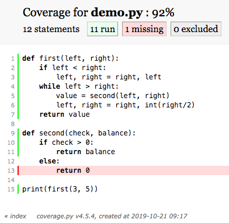
<p class="caption">(\#fig:python-coverage)Python Coverage</p>
</div>

R's `covr` package has several functions for checking coverage.
For example,
we can test the coverage of the tests for a package by running:

```r
covr::package_coverage()
```

This function outputs a list of all R files in the package
with their corresponding percentage coverage,
which is a good way to figure out what needs to be done next.

## How much testing is enough? {#rse-correct-enough}

If we are writing software for a safety-critical application such as a medical device,
we should aim for 100% code coverage,
i.e.,
every single line in the application should be tested.
In fact,
we should probably go further and aim for 100% [path coverage][path-coverage]
and ensure that every possible path through the code has been checked.

But most of us don't write software that people's lives depend on,
so requiring 100% code coverage is like asking for ten decimal places of accuracy
when checking the voltage of a household electrical outlet.
We always need to balance the effort required to create tests
against the likelihood that those tests will uncover useful information.

It's important to understand that no amount of testing can prove a piece of software is completely correct.
A function with only two numeric arguments has 2<sup>128</sup> possible inputs.
Even if we could write the tests,
how could we be sure we were checking the result of each one correctly?

And testing data analysis pipelines is often harder than testing mainstream software applications,
since data analysts often don't know what the right answer is.
(If we did,
we would have submitted our report and moved on to the next problem already.)
The key distinction is the difference between [validation][validation],
which asks whether the specification is correct,
while [verification][verification],
which asks whether we have met that specification.
The difference between them is the difference between building the right thing and building something right,
and the former question is often hard for data scientists to answer.

Luckily,
we can group the test cases for most functions into classes.
For example,
it might be possible to test a function that takes numbers as inputs
as well as we need to
using only a few cases:
zero, a positive number, a negative one, and infinity.
If we want to go further,
we could check that it fails the right way when given a string or a list.
Similarly,
when testing a function that summarizes a table full of data,
we should probably check that it handles tables with:

-   no rows
-   only one row
-   many identical rows
-   rows having keys that are supposed to be unique, but aren't
-   rows that contain nothing but missing values

Some projects develop [checklists][checklist] to remind programmers what they ought to test.
These checklists can be a bit daunting for newcomers,
but they are a great way to pass on hard-earned experience.

## When should I write my tests? {#rse-correct-tdd}

Many programmers are passionate advocates of a practice called
[test-driven development][tdd] (TDD).
Rather than writing code and then writing tests,
they write the tests first and then write just enough code to make those tests pass.
Once the code is working,
they clean it up (Chapter \@ref(refactor)) and then move on to the next task.

TDD's advocates claim that working this way leads to better code in less time because:

1.  Writing tests clarifies what the code is actually supposed to do.

2.  It eliminates [confirmation bias][confirmation-bias].
    If someone has just written a function,
    they are predisposed to want it to be right,
    so they will bias their tests towards proving that it is correct
    instead of trying to uncover errors.

3.  Writing tests first ensures that they actually get written.

These arguments are plausible.
However,
studies such as @Fucc2016 don't support them:
in practice,
writing tests first or last doesn't appear to affect productivity.
What *does* have an impact is working in small, interleaved increments,
i.e.,
writing just a few lines of code and testing it before moving on
rather than writing several pages of code and then spending hours on testing.

So how do most data scientists figure out if their software is doing the right thing?
The answer is spot checks:
each time they produce an intermediate or final result,
they scan a table, create a chart, or inspect some summary statistics
to see if everything looks OK.
Their heuristics are usually easy to state,
like "there shouldn't be NAs at this point" or "the age range should be reasonable",
but applying those heuristics to a particular analysis always depends on
their evolving insight into the data in question.

By analogy with test-driven development,
we could call this process [checking-driven development][cdd] (CDD).
Each time we add a step to our pipeline and look at its output,
we can also add a check of some kind to the pipeline to ensure that
what we are checking for remains true as the pipeline evolves or is run on other data.
This helps reusability—it's amazing how often a one-off analysis
winds up being used many times—but the real goal is comprehensibility.
If someone can get our code and data,
run the former on the latter,
and get the same result that we did,
then our computation is reproducible,
but that doesn't mean they can understand it.
Comments help
(either in the code or as blocks of prose in a [computational notebook][computational-notebook]),
but they won't check that assumptions and invariants hold.
And unlike comments,
runnable assertions can't fall out of step with what the code is actually doing…

We also need to distinguish between testing during development
and testing in production.
During development,
our main concern is whether our answers are (close enough to) what we expect.
We do this by analyzing small datasets
and convincing ourselves that we're getting the right answer in some ad hoc way.

In production,
on the other hand,
our goal is to detect cases where behavior deviates significantly from what we previously decided what right.
We want this to be automated
so that our pipeline will ring an alarm bell to tell us something is wrong
even if we're busy working on something else.
This can happen because real data will never have exactly the same characteristics as the data we used during development.
We also need these checks because the pipeline's environment can change:
for example,
someone could upgrade a library that one of our libraries depends on,
which could lead to us getting slightly different answers than we expected.

## Why should I be cautious when using floating-point numbers? {#rse-correct-float}

No matter what the cause,
we need to understand exactly what we mean by "tolerance" when talking about testing.
The explanation that follows is simplified to keep it manageable;
To learn more,
please take half an hour to read @Gold1991.

Finding a good representation for floating point numbers is hard:
we cannot represent an infinite number of real values with a finite set of bit patterns,
and unlike integers,
no matter what values we *do* represent,
there will be an infinite number of values between each of them that we can't.
These days,
floating point numbers are usually represented using [sign][sign],
[magnitude][magnitude] (or [mantissa][mantissa]),
and an [exponent][exponent].
In a 32-bit number,
the IEEE 754 standard calls for 1 bit of sign,
23 bits for the mantissa,
and 8 bits for the exponent.
To illustrate the problems with floating point,
we will use a much simpler 5-bit representation
with 3 bits for the magnitude and 2 for the exponent.
We won't worry about fractions or negative numbers,
since our simple representation will show off the main problems.

The table below shows the possible values we can represent with 5 bits.
(Real floating point representations shift values left and right to avoid the redundancy shown here,
but again,
that doesn't affect our main point.)
Using subscripts to show the bases of numbers,
110<sub>2</sub>×2<sup>11<sub>2</sub></sup> in binary
is 6×2<sup>3</sup> in decimal,
or 48.

<table>
  <tr>
    <th></th>
    <th colspan="4">Exponent</th>
  </tr>
  <tr>
    <th>Mantissa</th> <th>00</th> <th>01</th> <th>10</th> <th>11</th>
  </tr>
  <tr>
    <th>000</th> <td>0</td> <td>0</td> <td>0</td> <td>0</td>
  </tr>
  <tr>
    <th>001</th> <td>1</td> <td>2</td> <td>4</td> <td>8</td>
  </tr>
  <tr>
    <th>010</th> <td>2</td> <td>4</td> <td>8</td> <td>16</td>
  </tr>
  <tr>
    <th>011</th> <td>3</td> <td>6</td> <td>12</td> <td>24</td>
  </tr>
  <tr>
    <th>100</th> <td>4</td> <td>8</td> <td>16</td> <td>32</td>
  </tr>
  <tr>
    <th>101</th> <td>5</td> <td>10</td> <td>20</td> <td>40</td>
  </tr>
  <tr>
    <th>110</th> <td>6</td> <td>12</td> <td>24</td> <td>48</td>
  </tr>
  <tr>
    <th>111</th> <td>7</td> <td>14</td> <td>28</td> <td>56</td>
  </tr>
</table>

<div class="figure">
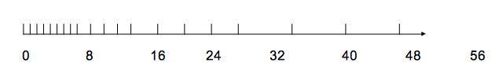
<p class="caption">(\#fig:verify-spacing)Number Spacing</p>
</div>

Figure \@ref(fig:verify-spacing) is a clearer view of some of the values our scheme can represent.
It shows that a lot of values are missing from this diagram:
for example,
it includes 8 and 10 but not 9.
This is exactly the same problem as writing out ⅓ in decimal:
we have to round that to 0.3333 or 0.3334.

Since this scheme has no representation for 9,
8+1 must be stored as either 8 or 10.
But if 8+1 is 8, what is 8+1+1?
If we add from the left, 8+1 is 8, plus another 1 is 8 again.
If we add from the right, 1+1 is 2, and 2+8 is 10,
so changing the order of operations can make the difference between right and wrong.
In this case,
sorting the values and adding from smallest to largest
gives us the best chance of getting the most accurate answer.
In other situations,
like inverting a matrix,
the rules are more complicated.

To make this more concrete,
consider the short Python program below.
It loops over the integers from 1 to 9
and puts the numbers 0.9, 0.09, 0.009, and so on in `vals`.
The sums should be 0.9, 0.99, 0.999, and so on, but are they?
To find out,
we can calculate the same values by subtracting .1 from 1,
then subtracting .01 from 1, and so on.
This should create exactly the same sequence of numbers, but it doesn't.


```python
vals = []
for i in range(1, 10):
    number = 9.0 * 10.0 ** -i
    vals.append(number)
    total = sum(vals)
    expected = 1.0 - (10.0 ** -i)
    diff = total - expected
    print('{:2d} {:22.21f} {:22.21f}'.format(i, total, total-expected))
```

```
##  1 0.900000000000000022204 0.000000000000000000000
##  2 0.989999999999999991118 0.000000000000000000000
##  3 0.998999999999999999112 0.000000000000000000000
##  4 0.999900000000000011013 0.000000000000000000000
##  5 0.999990000000000045510 0.000000000000000000000
##  6 0.999999000000000082267 0.000000000000000111022
##  7 0.999999900000000052636 0.000000000000000000000
##  8 0.999999990000000060775 0.000000000000000111022
##  9 0.999999999000000028282 0.000000000000000000000
```

As the output shows,
the very first value contributing to our sum is already slightly off:
even with 23 bits for a mantissa,
we cannot exactly represent 0.9 in base 2.
Doubling the size of the mantissa would reduce the error,
but we can't ever eliminate it.

The good news is that 9×10<sup>-1</sup> and 1-0.1 are exactly the same:
the values might not be correct,
but at least they are consistent.
However,
some later values differ,
and sometimes accumulated error makes the result *more* accurate.

*This has nothing to do with randomness.*
The process is completely deterministic,
so the same calculation will produce exactly the same results no matter how many times it is run.
(If we see someone run the same code on the same data with the same parameters many times and average the results,
we should ask if they know what they're doing.)
In practice,
just as electrical engineers trust oscilloscope makers,
data scientists should trust the authors of core libraries to do the best they can.

## How should I write tests that involved floating-point values? {#rse-correct-numeric}

The absolute spacing between the values we can represent in Figure \@ref(fig:verify-spacing) is uneven.
However,
the relative spacing between each set of values stays the same:
the first group is separated by 1,
then the separation becomes 2,
then 4,
and then 8.
This happens because we're multiplying the same fixed set of mantissas by ever-larger exponents,
and it leads to some useful definitions.
The [absolute error][absolute-error] in an approximation is the absolute value of
the difference between the approximation and the actual value.
The [relative error][relative-error] is the ratio of the absolute error to the value we're approximating.
For example,
it we are off by 1 in approximating 8+1 and 56+1,
we have the same absolute error,
but the relative error is larger in the first case than in the second.

Relative error is almost always more important than absolute error when we are testing software
because it makes little sense to say that we're off by a hundredth
when the value in question is a billionth.
[Accuracy][accuracy] is how close our answer is to right,
and [precision][precision] is how close repeated measurements are to each other.
We can be precise without being accurate (systematic bias),
or accurate without being precise (near the right answer but without many significant digits).

Accuracy is usually more important than precision for human decision making:
a relative error of 10<sup>-2</sup> (two decimal places) is good enough for most data science
because the decision a human being would make won't change if the number changes by 1%.

We now come to the crux of this lesson:
if the function we are testing uses floating point numbers,
what should we compare its result to?
If we compared the sum of the first few numbers in `vals` to the "right" answer,
the answer could be `False` even though we're doing nothing wrong.
If we compared it to a previously calculated result that we had stored somehow,
the match would be exact.

No one has a good generic answer to this problem
because its root cause is that we're using approximations,
and each approximation has to be judged in context.
So what can you do to test your programs?
If you are comparing to a saved result,
and the result was saved at full precision,
you could use exact equality,
because there is no reason for the new number to differ.
However,
any change to your code,
however small,
could trigger a report of a difference.
Experience shows that these spurious warnings quickly lead developers to stop paying attention to their tests.

A much better approach is to write a test that checks whether numbers are the same within some [tolerance][tolerance],
which is best expressed as a relative error.
R's `expect_equal` does this automatically.
In Python,
we can use `pytest.approx`,
which works on lists, sets, arrays, and other collections,
and can be given either relative or absolute error bounds.
To show how it works,
here's an example with an unrealistically tight absolute bound:

```python
from pytest import approx

for bound in (1e-15, 1e-16):
    vals = []
    for i in range(1, 10):
        number = 9.0 * 10.0 ** -i
        vals.append(number)
        total = sum(vals)
        expected = 1.0 - (10.0 ** -i)
        if total != approx(expected, abs=bound):
            print('{:22.21f} {:2d} {:22.21f} {:22.21f}'.format(bound, i, total, expected))
```

```text
9.999999999999999790978e-17  6 0.999999000000000082267 0.999998999999999971244
9.999999999999999790978e-17  8 0.999999990000000060775 0.999999989999999949752
```

This tells us that two tests pass with an absolute error of 10<sup>-15</sup>
but fail when the bound is 10<sup>-16</sup>,
both of which are unreasonably tight.
Again,
it helps to think of physical experiments:
an absolute error of 10<sup>-15</sup is one part in a trillion,
which only a handful of high-precision experiments have ever achieved.

## How can I test plots and other graphical results? {#rse-correct-plots}

Testing visualizations is hard:
any change to the dimension of the plot,
however small,
can change many pixels in a [raster image][raster-image],
and cosmetic changes such as moving the legend up a couple of pixels
will similarly cause false positives.

The simplest solution is therefore to test the data used to produce the image
rather than the image itself.
Unless we suspect that the plotting library contains bugs,
the correct data should alwyas produce the correct plot.

If we *do* need to test the generated image,
the only practical approach is to compare it to a saved image that we have visually verified.
For example,
[pytest-mpl][pytest-mpl] does this by calculating the root mean square (RMS) difference between images,
which must be below a threshold for the comparison to pass.
It also allows us to turn off comparison of text,
because font differences can throw up spurious failures.
As with choosing tolerances for floating-point tests,
our rule for picking thresholds should be,
"If images are close enough that a human being would make the same decision about meaning,
the test should pass"

Another approach is to save the plot in a [vector format][vector-image] like [SVG][svg]
that stores the coordinates of lines and other elements as text.
We can then check that the right elements are there with the right properties.
However,
this is usually unrewarding:
again,
small changes to the library or to plotting parameters can make all of the tests fail
by moving elements by a pixel or two.
Vector-based tests therefore still need to have thresholds on floating-point values.

## What data should I use to test my analyses? {#rse-correct-data}

There aren't any useful general rules for testing the calculations that our pipelines do,
since those calculations vary from one pipeline to the next,
but there *are* some rules about where to get data to test with.
The first method is [subsampling][subsampling]:
choose random subsets of your data,
analyze it,
and see how close the output is to what you get with the full dataset.
If the output doesn't converge as the sample size grows,
something is probably unstable in either the algorithm or its implementation.

When we are subsampling,
it's vital that we select a truly random subset of data
rather than (for example) the first N records or every N'th record.
If there is any ordering or grouping in our data,
those techniques can produce samples that are biased,
which may in turn invalidate some of your tests.

The other approach is to test with [synthetic data][synthetic-data].
A few lines of code can generate uniform data (i.e., data having the same values for all observations),
strongly bimodal data (which is handy for testing clustering algorithms),
or a pseudorandom sample with a known distribution.
If we do this,
we should also give our pipeline data that *doesn't* fit your expected distribution
and make sure that something, somewhere, complains.
Doing this is the data science equivalent of testing the fire alarm every once in a while.

For example,
we can write a short program to generate data that conforms to Zips' Law and use it to test our analysis.
Real data will be integers,
since words only occur or not,
and distributions will be fractional.
After a bit of experimentation,
we will use 5% relative error as our threshold for correctness:
1% excludes a valid correct case.
The test function is called `is_zipf`:

```python
from pytest import approx


RELATIVE_ERROR = 0.05


def is_zipf(hist):
    scaled = [h/hist[0] for h in hist]
    print('scaled', scaled)
    perfect = [1/(1 + i) for i in range(len(hist))]
    print('perfect', perfect)
    return scaled == approx(perfect, rel=RELATIVE_ERROR)
```

Here are three tests that synthesize data and then check it using this function
with names that suggest their purpose:

```python
def test_fit_correct():
    actual = [round(100 / (1 + i)) for i in range(10)]
    print('actual', actual)
    assert is_zipf(actual)


def test_fit_first_too_small():
    actual = [round(100 / (1 + i)) for i in range(10)]
    actual[0] /= 2
    assert not is_zipf(actual)


def test_fit_last_too_large():
    actual = [round(100 / (1 + i)) for i in range(10)]
    actual[-1] = actual[1]
    assert not is_zipf(actual)
```

## How can I test a data analysis pipeline in production? {#rse-correct-production}

An [operational test][operational-test] is one that is kept in place during production
to tell users if everything is still working as it should.
Some common operational tests include:

-   Does this pipeline stage produce the same number of output records as input records?
-   Or fewer if the stage is aggregating?
-   If two or more tables are being [joined][join],
    is the number of output records equal to the product of the number of input records?
-   Is the standard deviation smaller than the range of the data?
-   Are there any NaNs or NULLs where there aren't supposed to be?

A common pattern for such tests is to have every tool append information to a [log file][log-file]
and then have another tool check that log file after the run is over.
Logging while calculating and checking afterward makes it easy to compare values between pipeline stages,
and ensures that there's a record of why a problem was reported.

To illustrate these ideas,
here's a script that reads a document and prints one line per word:

```python
import sys

num_lines = num_words = 0
for line in sys.stdin:
    num_lines += 1
    words = [strip_punctuation(w) for w in line.strip().split()]
    num_words += len(words)
    for w in words:
        print(w)

with open('logfile.csv', 'a') as logger:
    logger.write('text_to_words.py,num_lines,{}\n'.format(num_lines))
    logger.write('text_to_words.py,num_words,{}\n'.format(num_words))
```

Here's a complementary script that counts how often words appear in its input:

```python
import sys

num_words = 0
count = {}
for word in sys.stdin:
    num_words += 1
    count[word] = count.get(word, 0) + 1

for word in count:
    print('{} {}', word, count[word])

with open('logfile.csv', 'a') as logger:
    logger.write('word_count.py,num_words,{}\n'.format(num_words))
    logger.write('word_count.py,num_distinct,{}\n'.format(len(count)))
```

Both of these scripts write records to `logfile.csv`.
When we look at that file after a typical run,
we see records like this:

```text
text_to_words.py,num_lines,431
text_to_words.py,num_words,2554
word_count.py,num_words,2554
word_count.py,num_distinct,1167
```

We can then use a small program to check that everything went as planned:

```python
import sys
import csv

data = {}
for row in csv.reader(sys.stdin):
    data[(row[0], row[1])] = int(row[2])

assert data[('text_to_words.py', 'num_lines')] <= data['word_count.py', 'num_words')]
assert data[('text_to_words.py', 'num_words')] == data['word_count.py', 'num_words')]
assert data[('word_count.py', 'num_words')] >= data['word_count.py', 'num_distinct')]
```

Tests like these are simple to write
and catch a surprising number of errors,
particularly when the person using the pipeline isn't its original author.

> **Validating Pipelines**
>
> There are several libraries for validating data pipelines in R,
> including [assertr][assertr],
> [checkr][checkr],
> and [validate][validate-r].

## How can I infer and check properties of my data? {#rse-correct-infer}

Writing tests for the properties of data can be tedious,
but some of the work can be automated.
In particular,
the [TDDA library][tdda-site] for Python can infer test rules from data,
such as "`age` should be less than 100",
"`Date` should be sorted in ascending order",
or "`StartDate` should be less than or equal to `EndDate`".
The library comes with a command-line tool called `tdda`,
so that the command:

```shell
$ tdda discover training-data.csv properties.tdda
```

infers rules from data,
while the command:

```shell
$ tdda verify actual-data.csv properties.tdda
```

verifies data against those rules.
The inferred rules are stored as [JSON][json],
which is (sort of) readable with a bit of practice.
Reading the generated rules is a good way to get to know your data,
and modifying values
(e.g., changing the maximum allowed value for `Grade` from the observed 94.5 to the actual 100.0)
is an easy way to make constraints explicit.
For example,
if we run:

```shell
$ tdda discover elements92.csv elements.tdda
```

(which contains information about the first 92 elements)
the output includes:

```json
"fields": {
    "Name": {
        "type": "string",
        "min_length": 3,
        "max_length": 12,
        "max_nulls": 0,
        "no_duplicates": true
    },
    "Symbol": {
        "type": "string",
        "min_length": 1,
        "max_length": 2,
        "max_nulls": 0,
        "no_duplicates": true
    },
    "ChemicalSeries": {
        "type": "string",
        "min_length": 7,
        "max_length": 20,
        "max_nulls": 0,
        "allowed_values": [
            "Actinoid",
            "Alkali metal",
            "Alkaline earth metal",
            "Halogen",
            "Lanthanoid",
            "Metalloid",
            "Noble gas",
            "Nonmetal",
            "Poor metal",
            "Transition metal"
        ]
    },
    "AtomicWeight": {
        "type": "real",
        "min": 1.007947,
        "max": 238.028913,
        "sign": "positive",
        "max_nulls": 0
    },
    ...more...
}
```

We can apply these inferred rules to all elements up to number 118
using the `-7` option to get pure ASCII output
and the `-f` option to show only fields with failures:

```shell
$ tdda verify -f elements118.csv elements.tdda
```

```text
FIELDS:

Z: 1 failure  5 passes  type ✓  min ✓  max ✗  sign ✓  max_nulls ✓  no_duplicates ✓

Name: 1 failure  4 passes  type ✓  min_length ✓  max_length ✗  max_nulls ✓  no_duplicates ✓

Symbol: 1 failure  4 passes  type ✓  min_length ✓  max_length ✗  max_nulls ✓  no_duplicates ✓

AtomicWeight: 2 failures  3 passes  type ✓  min ✓  max ✗  sign ✓  max_nulls ✗

...other reports...

SUMMARY:

Constraints passing: 57
Constraints failing: 15
```

Another way to use TDDA is to generate constraints for two datasets and then look at differences
in order to see how similar the datasets are to each other.
This is especially useful if the constraint file is put under version control.

## Summary {#rse-correct-summary}

<div class="figure">
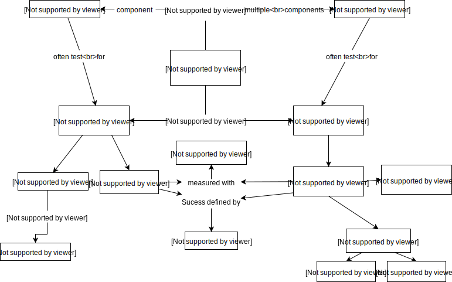
<p class="caption">(\#fig:rse-correct-concept)Correctness Concept Map</p>
</div>

## Exercises {#rse-correct-exercises}

### Fixing `numSign` {#rse-correct-ex-numsign}

1.  Fix the implementation of `numSign` in either R or Python so that all tests will succeed.
2.  Re-run the tests to confirm that the function is working.
3.  Extend the function so that it does something sensible when passed a string or an empty list.
    Write functions to check your changes.

### Checking simple calculations {#rse-correct-ex-simple-calc}

Create a new test by running `usethis::use_test("simple-arithmetic")`.
Copy the code below into the newly created test file and fill in the blanks
so that it runs correctly.

```r
context("Check simple calculations")

test_that("plus and minus give correct outputs", {
  expect_identical(1 + 2, 3)
  ___(1 - 2, -1)
  expect_identical(1 + NA, __)
  expect_identical(___ - ___, NA)
})
```

### Explain the purpose of tests {#rse-correct-ex-purpose}

Based on the contents of the tests below,
replace the blanks with appropriate `context()` and `test_that()` messages.

```r
context("___")

test_that("___", {
  expect_identical(sum(c(1, 2)), 3)
  expect_identical(sum(c(NA, 2)), NA)
})

test_that("___", {
  expect_identical(mean(c(1, 2)), 1.5)
  expect_identical(mean(c(NA, 2)), NA)
})
```

### Testing `count_words` {#rse-correct-ex-count-words}

1.  Create a new test file.
2.  Write unit tests for `count_words` to check the following:
    -   Returns zero when given an empty string.
    -   Returns `NA` when given `NA`.
    -   Returns 2 when given two words separated by a space.
    -   Returns 2 when given two words separated by a dash `-`.

### Checking for errors {#rse-correct-ex-check-errors}

Add new unit tests for the word-counting function
to check that it raises errors when it should.

## Key Points {#rse-correct-keypoints}


-   Testing can only ever show that software has flaws, not that it is correct.
-   The real purpose is to convince people (including yourself) that software is correct enough
    and to make tolerances on 'enough' explicit.
-   A testing suite finds and runs tests written in a prescribed fashion and reports their results.
-   A unit test can pass (work as expected),
    fail (meaning the software under test is flawed),
    or produce an error (meaning the test itself is flawed).
-   Every unit test should be independent of each other so results are comprehensible, contained, and reliable.
-   Tests should be built to test that the software fails when and as it is supposed.
-   Tests can usefully exercise particular pieces of functionality (unit tests)
    or larger pieces of the code base demonstrating interactions between units (integration tests)
-   Tests should verify software (make sure it does what it's supposed to)
    and also validate it (make sure it produces the right answers).
-   Data science is normally concerned with approximate correctness of solutions.
-   Stochastic statistical variation and deterministic floating point approximations both make answers approximately correct.
-   Check that parametric or non-parametric statistics of data
    do not differ from saved values by more than a specified tolerance.
-   Infer constraints on data and then check that subsequent data sets obey these constraints.
-   Test the data structures used in plotting rather than the plots themselves.

<!--chapter:end:rse-correct.Rmd-->

# Publishing {#rse-publish}


This lesson looks at what should be included in and/or alongside reports and how best to do that.
We use the generic term "report" to include research papers,
summaries for clients,
and everything else that is shorter than a book and is going to be read by someone else.

Our motivation is summed up in this quotation:

> An article about computational science in a scientific publication is *not* the scholarship itself,
> it is merely *advertising* of the scholarship.
> The actual scholarship is the complete software development environment
> and the complete set of instructions which generated the figures.
>
> — Jonathan Buckheit and David Donoho, paraphrasing Jon Claerbout, in @Buck1995

As the quote suggests,
modern publishing involves much more than simply producing a report.
It involves providing readers with the data underpinning the report,
as well as any code written in analysing the data.

While the definition of data (and its associated metadata)
is relatively easy to understand,
code can come in many different forms.
Here we distinguish between “analysis scripts” written
solely for the purpose of the report (e.g. to produce a figure)
and “analysis software” that is formally packaged and released for use by a wider audience.
Of course, in reality the analysis scripts/software written during the process of preparing
a report can often lie on a continuum between those two definitions.

While some reports, datasets, software packages and/or analysis scripts
can't be published without violating personal or commercial confidentiality,
every researcher's default should be to make all these components
of their work as widely available as possible.
That means publishing it under an open license (Section \@ref(rse-teams-software-license))
so that people who aren't in academia can find and access it.

## Identification {#rse-publish-identifiers}

Before publishing anything,
we need to understand the systems used to identify works
and their authors.

A [Digital Object Identifier][doi] (DOI)
is a unique identifier for a particular version of a particular digital artifact
such as a report, a dataset, or a piece of software.
DOIs are written as `doi:prefix/suffix`,
but you will often also see them represented as URLs like `http://dx.doi.org/prefix/suffix`.
In order to be allowed to issue a DOI,
online platforms (e.g. academic journals, data archives)
must guarantee a certain level of security, longevity and access.

An [ORCID][orcid] is an Open Researcher and Contributor ID.
You can get an ORCID for free,
and you should include it in publications
because people's names and affiliations change over time.


## Publishing a report {#rse-publish-document}

The best option for publishing a report (with a platform that issues a DOI)
depends on the context.
For academic, peer-reviewed research papers,
numerous open access journals have popped up in recent years.
Many formerly closed-access journals also now offer an open access option
(for an additional fee).
Another option is to publish with an online pre-print server
(e.g. [bioRxiv](https://www.biorxiv.org/), [arXiv](https://arxiv.org/)).
A preprint is a version of an academic research paper that precedes formal peer review
and publication in a peer-reviewed journal.
The preprint may be available, often as a non-typeset version available free,
before and/or after a paper is published in a journal.

Online writing platforms such as [Authorea](https://authorea.com/) are also an option,
which allow a report to be openly viewable on the web throughout the entire writing process.
At the end of the process Authorea can issue its own DOI for the report,
or the text can be exported in the format required for submission to an academic journal.
Finally, online platforms such as [Figshare](https://figshare.com) and
[Zenodo](https://zenodo.org/)
are a place where any research outputs (reports, datasets, code, supplementary figures)
can be published with a DOI.
It is common for people to upload reports to these platforms so that they can be
easily accessed by others.

## Publishing data {#rse-publish-data}

The first step in publishing the data associated with a report
is to determine what (if anything) needs to be published.

If the report involved the analysis of a publicly available dataset
that is maintained and documented by a third party (e.g. open government data),
then it's likely that no data publishing is required.
The report simply needs to document where to access the data
and what version was analyzed,
along with any scripts and software used to download and process the data.
In other words, it's not necessary to re-publish a duplicate of the original dataset
if it's already accessible elsewhere.

Strictly speaking, it's not necessary to publish any data files
produced during the analysis of a publicly available dataset either,
since readers have access to the original data and the scripts/software used to process it.
Having said that, it can be advantageous to publish processed data that is difficult to reproduce
(e.g. it might require access to a supercomputing facility to run the code)
and/or represents a derived quantity with high re-use potential.
For instance, it would be worthwhile to publish
an estimate of the global average surface temperature derived from
a large database of weather observations,
because a simple metric of global warming could be useful in many subsequent studies.

If a report involves the generation of a new dataset
(e.g. observations collected during a field experiment),
then clearly that dataset needs to be published.
This section describes how to go about doing that.

### What is the most useful way to share my data?

Making data useful to other people (including your future self)
is one of the best investments you can make.
The simple version of how to do this is:

-   Always use [tidy data][tidy-data].
-   Include keywords describing the data in the project's `README.md`
    so that they appear on its home page and can easily be found by search engines.
-   Give every dataset and every report a unique identifier (Section \@ref(rse-publish-identifiers)).
-   Put data in open repositories.
-   Use well-known formats like CSV and HDF5.
-   Include an explicit license in every project and every dataset.
-   Include units and other metadata.

The last point is often the hardest for people to implement,
since many researchers have never seen a well-documented dataset.
We draw inspiration from the data catalog included in [the repository][womens-pockets-data]
for the article "[Women's Pockets Are Inferior][womens-pockets]"
and include a file `./data/README.md` in every project
that looks like this:

```
-   Infants born to women with HIV receiving an HIV test within two months of birth, 2009-2017
    -   `Infant_HIV_Testing_2017.xlsx`
        -   What is this?: Excel spreadsheet with summarized data.
        -   Source(s): UNICEF, <https://data.unicef.org/resources/dataset/hiv-aids-statistical-tables/>
        -   Last Modified: July 2018 (according to website)
        -   Contact: Greg Wilson <greg.wilson@rstudio.com>
        -   Spatial Applicability: global
        -   Temporal Applicability: 2009-2017
    -   `infant_hiv.csv`
        -   What is this?: CSV export from `Infant_HIV_Testing_2017.xlsx`
    -   Notes
        -   Data is not tidy: some rows are descriptive comments, others are blank separators between sections, and column headers are inconsistent.
        -   Use `tidy_infant_hiv()` to tidy this data.
-   Maternal health indicators disaggregated by age
    -   `maternal_health_adolescents_indicators_April-2016_250d599.xlsx`
        -   What is this?: Excel spreadsheet with summarized data.
        -   Source(s): UNICEF, <https://data.unicef.org/resources/dataset/maternal-health-data/>
        -   Last Modified: July 2018 (according to website)
        -   Contact: Greg Wilson <greg.wilson@rstudio.com>
        -   Spatial Applicability: global
        -   Temporal Applicability: 2000-2014
    -   `at_health_facilities.csv`
        -   What is this?: percentage of births at health facilities by country, year, and mother's age
        -   Source(s): single sheet from `maternal_health_adolescents_indicators_April-2016_250d599.xlsx`
    -   `c_sections.csv`
        -   What is this?: percentage of Caesarean sections by country, year, and mother's age
        -   Source(s): single sheet from `maternal_health_adolescents_indicators_April-2016_250d599.xlsx`
    -   `skilled_attendant_at_birth.csv`
        -   What is this?: percentage of births with skilled attendant present by country, year, and mother's age
        -   Source(s): single sheet from `maternal_health_adolescents_indicators_April-2016_250d599.xlsx`
    -   Notes
        -   Data is not tidy: some rows are descriptive comments, others are blank separators between sections, and column headers are inconsistent.
        -   Use `tidy_maternal_health_adolescents()` to tidy this data.
```

The catalog above doesn't include column headers or units because the data isn't tidy.
It *does* include the names of the functions used to reformat that data,
and `./results/README.md` then includes the information that users will want.
One section of that file is shown below:

```
-   Infants born to women with HIV receiving an HIV test within two months of birth, 2009-2017
    -   infant_hiv.csv
      -   What is this?: tidied version of CSV export from spreadsheet.
      -   Source(s): UNICEF, <https://data.unicef.org/resources/dataset/hiv-aids-statistical-tables/>
      -   Last Modified: September 2018
      -   Contact: Greg Wilson <greg.wilson@rstudio.com>
      -   Spatial Applicability: global
      -   Temporal Applicability: 2009-2017
      -   Generated By: scripts/tidy-24.R

| Header   | Datatype | NA    | Description                                 |
|----------|----------|-------|---------------------------------------------|
| country  | char     | false | ISO3 country code of country reporting data |
| year     | integer  | false | year CE for which data reported             |
| estimate | double   | true  | estimated percentage of measurement         |
| hi       | double   | true  | high end of range                           |
| lo       | double   | true  | low end of range                            |
```

Note that this catalog includes both units and whether or not a field can be NA.
Note also that calling a field "NA" is asking for trouble…

### What standards of data sharing should I aspire to?

The [FAIR Principles][go-fair] describe what research data should look like.
They are [still aspirational](https://www.natureindex.com/news-blog/what-scientists-need-to-know-about-fair-data)
for most researchers,
but they tell us what to aim for.
The most immediately important elements of the FAIR Principles are outlined below.

#### Data should be *findable*.

The first step in using or re-using data is to find it.
You can tell you've done this if:

1.  (Meta)data is assigned a globally unique and persistent identifier (Section \@ref(rse-publish-identifiers)).
2.  Data is described with rich metadata (like the catalog shown above).
3.  Metadata clearly and explicitly includes the identifier of the data it describes.
4.  (Meta)data is registered or indexed in a searchable resource,
    such as the data sharing platforms described in Section \@ref(rse-publish-data).

#### Data should be *accessible*.

You can't use data if you don't have access to it.
In practice,
this rule means the data should be openly accessible (the preferred solution)
or that authenticating in order to view or download it should be free.
You can tell you've done this if:

1.  (Meta)data is retrievable by its identifier using a standard communications protocol like HTTP.
2.  Metadata is accessible even when the data is no longer available.

#### Data should be *interoperable*.

Data usually needs to be integrated with other data,
which means that tools need to be able to process it.
You can tell you've done this if:

1.  (Meta)data uses a formal, accessible, shared, and broadly applicable language for knowledge representation
2.  (Meta)data uses vocabularies that follow FAIR principles
3.  (Meta)data includes qualified references to other (meta)data

#### Data should be *reusable*.

This is the ultimate purpose of the FAIR Principles and much other work.
You can tell you've done this if:

1.  Meta(data) is described with accurate and relevant attributes.
2.  (Meta)data is released with a clear and accessible data usage license.
3.  (Meta)data has detailed [provenance][provenance].
4.  (Meta)data meets domain-relevant community standards.

### How and where do I publish the data?

Small datasets (i.e., anything under 500 MB) can be stored in version control
using the conventions described in Chapter \@ref(rse-project).
If the data is being used in several projects,
it may make sense to create one repository to hold only the data;
the R community refers to these as [data packages][data-package],
and they are often accompanied by small scripts to clean up and query the data.
Be sure to give the dataset an identifier as discussed in Section \@ref(rse-publish-identifiers).

For medium-sized datasets (between 500 MB and 5 GB),
it's better to put the data on platforms like the [Open Science Framework][osf],
[Dryad][dryad],
and [Figshare][figshare].
Each of these will give the datasets identifiers;
those identifiers should be included in reports
along with scripts to download the data.
Big datasets (i.e., anything more than 5 GB)
may not be yours in the first place,
and probably need the attention of a professional archivist.
Any processed or intermediate data that takes a long time to regenerate
should probably be published as well using these same sizing rules;
all of this data should be given identifiers,
and those identifiers should be included in reports.

> **Data journals**
>
> While archiving data at a site like Dryad or Figshare (following the FAIR Principles)
> is usually the end of the data publishing process,
> there is the option of publishing a journal paper to describe the dataset in detail.
> Some research disciplines have journals devoted
> to describing particular types of data
> (e.g. [Geoscience Data Journal](https://rmets.onlinelibrary.wiley.com/journal/20496060))
> and there are also generic data journals
> (e.g. [Scientific Data](https://www.nature.com/sdata/)).


## Publishing analysis software {#rse-publish-software}

In the preceding chapters we have learned how to document and package software
so that it can be installed and used by others.
The final step in this process is publication.

It is common practice to have the code associated with a software package
openly available on a hosting service such as GitHub (or GitLab or Bitbucket).
These hosting services are not only a convenient place for people to ask questions
and make contributions/improvements to the software,
they also have built-in functionality for managing the
release of new versions of the software.
One limitation of these sites, however,
is that they don’t guarantee persistent long term storage
(e.g. if you changed the name of your GitHub repository any URLs for
the existing repository would be broken).
Acknowledging this limitation,
GitHub provides [Zenodo integration](https://guides.github.com/activities/citable-code/)
for creating a DOI with each new software release.

> **Software journals**
>
> While creating a DOI using a site like Zenodo
> is often the end of the software publishing process,
> there is the option of publishing
> a journal paper to describe the software in detail.
> Some research disciplines have journals devoted
> to describing particular types of software
> (e.g. [Geoscientific Model Development](https://www.geoscientific-model-development.net/)),
> and there are also a number of generic software journals such as the
> [Journal of Open Research Software](https://openresearchsoftware.metajnl.com/) and
> [Journal of Open Source Software](https://joss.theoj.org/).


## Publishing analysis scripts {#rse-publish-scripts}

The final component that needs to be published is the analysis scripts.
Unlike analysis software that has been packaged and released for use by a wider audience,
analysis scripts are simply written to create the figures and tables presented in a given report.
In fact, these scripts would typically make use of analysis software written
by the wider data science community (e.g. matplotlib, ggplot)
as well discipline-specific packages written by colleagues or co-authors
(e.g. AstroPy).

Given that analysis scripts will typically leverage
a wide variety of existing software packages,
there's actually three separate items that need to be published:

1. A detailed description of the analysis software used
2. A copy of any analysis scripts written by the authors to produce the key results
   presented in the report
3. A description of the data processing steps taken in producing each key result
   (i.e. a step-by-step account of how the software and scripts were actually implemented)

Earlier we saw that there are well-developed and widely adopted
guidelines for data publishing (e.g. the FAIR Principles).
The same is not true for analysis scripts.
Librarians, publishers, and regulatory bodies are still trying to determine
the best way for code to be documented and archived.
For the moment,
the best advice we can give for those three key items is discussed below.
That advice ranges from the bare minimum that needs to be done
through to current gold standard practice.


### Software description

In order to document the software packages that were used,
the bare minimum requirement is to list the name and version number
of each software package
that played a critical role in producing the analysis presented in your report.

As Section \@ref(rse-package-py-package) described,
you can get these automatically by running:

```shell
$ pip freeze > requirements.txt
```

For everything else,
you should write a script or create a rule in your project's Makefile (Chapter \@ref(rse-automate)),
since the commands used to get version numbers will vary from tool to tool:

```make
## versions : dump versions of software.
versions :
        @echo '# Python packages'
        @pip freeze
        @echo '# dezply'
        @dezply --version
        @echo '# parajune'
        @parajune --status | head 1
```

While such a list means your software environment is now technically reproducible,
you’ve left it up to the reader to figure out how to get all those software packages
and libraries installed and playing together nicely.
In some cases this is fine
(e.g. it might be easy enough for a reader to install the handful of R packages you used),
but in other cases you might want to save the reader (and your future self)
the pain of software installation by making use of a tool
that can automatically install a specified software environment.
The most prominent such tool in data science at the moment is [conda](https://docs.conda.io).
A conda environment can be exported,

```shell
$ conda env export -n myenv -f myenv.yml
```

and made available so that readers can use it to install the same environment on their
own computer:

```
$ conda env create -f myenv.yml
```

> **Conda environments**
>
> The Python for Atmosphere and Ocean Scientists lesson materials
> maintained by Data Carpentry have a section devoted to
> [Software Installation using Conda](https://carpentrieslab.github.io/python-aos-lesson/01-conda/index.html)

Beyond conda there are more complex tools like [Docker][docker] and Nix,
which can literally install your entire environment (down to the precise operating system)
on a different computer.
There’s lots of debate
about the potential and suitability of these tools as a solution to reproducible research,
but it’s fair to say that their complexity puts them out of reach
for many researchers.

### Analysis scripts

The next item you’ll need to publish is a copy of the scripts
written to execute those software packages.
Depending on the size or complexity of the scripts you have written,
and whether you re-use them in multiple projects,
you may publish script by script
or create a zip file or tar file that includes everything.
For example,
the Makefile fragment below creates `~/archive/meow-2019-02-21.tgz`:

```make
ARCHIVE=${HOME}/archive
PROJECT=meow
TODAY=$(shell date "+%Y-%m-%d")
SCRIPTS=./Makefile ./bin/*.py ./bin/*.sh

## archive : create an archive of all the scripts used in this run
archive :
        @mkdir -p ${ARCHIVE}
        @tar zcf ${ARCHIVE}/${PROJECT}-${TODAY}.tgz
```

### Data processing steps

A software description and analysis scripts on their own are not much use to a reader;
they also need to know how those scripts was actually executed.
This means including the configuration files (Chapter \@ref(configure)),
and/or command-line parameters used to generate each key result.

The way in which this information is collected and archived
depends on how your workflow is constructed.
If all of a program's parameters are in a configuration file (Chapter \@ref(configure)),
then that file can be archived.
Alternatively, you might need to have your program print out its configuration parameters
and then use `grep` or a script to extract information from the logfile (Chapter \@ref(logging)).

If your workflow involves executing a series of command line programs,
then you can keep a log/record of the command line entries
required to produce a given result.
For example, the [cmdline-provenance](https://cmdline-provenance.readthedocs.io/en/latest/)
package generates such records,
including keeping track of the corresponding version control revision number,
so you know exactly which version of your command line program was executed.

As before, while these bare minimum log files ensure that your workflow is reproducible,
they may not be particularly comprehensible.
Manually recreating workflows from them might be a tedious and time consuming process,
even for just moderately complex analyses.
To make things a little easier for the reader (and your future self),
it’s a good idea to include a README file in your code library
explaining the sequence of commands required to produce common/key results.
You might also provide a Makefile that automatically builds and executes common workflows.
Beyond that the options get more complex,
with workflow management packages like [VisTrails](https://www.vistrails.org/index.php/Main_Page)
providing a graphical interface
that allows users to drag and drop the various components of their workflow.


### Where to publish all this stuff?

Following the steps above, you’ll be left with a text file
(or perhaps an environment file exported from a conda)
describing your software environment,
a copy of your code library and various log files, and README files and/or Makefiles
that describe your data processing steps.
Sites like Figshare and Zenodo are the ideal place to publish these items,
as they have been specifically setup for archiving the “long tail” of reports
(e.g. supplementary figures, tables, code and data).

## Summary {#rse-publish-summary}

FIXME: create concept map for publishing

## Exercises {#rse-publish-exercises}

### ORCID

If you don't already have an [ORCID][orcid],
go to the website and register now.

If you do have an ORCID,
login at the website and make sure that your details
and publication record are up-to-date.

### A FAIR test

An [online questionnaire](https://www.ands-nectar-rds.org.au/fair-tool)
for measuring the extent to which datasets are FAIR
has been created by the Australian Research Data Commons.

Take the questionnaire for a dataset you have published
or that you use often.

### Publishing your code

Think about a project that you're currently working on.
How would you go about publishing the code associated with that project?
(i.e. the software description, analysis scripts and data processing steps)

## Key Points {#rse-publish-keypoints}


-   Include small datasets in repositories; store large ones on data sharing sites, and include metadata in the repository to locate them.
-   An ORCID is a unique personal identifier that you can use to identify your work.
-   A DOI is a unique identifier for a particular dataset, report, or software release.
-   Data should be findable, accessible, interoperable, and reusable (FAIR).
-   Use Zenodo to obtain DOIs.
-   Publish your software as you would a paper.


[abandonware]: glossary.html#abandonware
[absolute-error]: glossary.html#absolute-error
[absolute-path]: glossary.html#absolute-path
[accuracy]: glossary.html#accuracy
[action-make]: glossary.html#action-make
[actual-result]: glossary.html#actual-result
[advanced-r-performance]: http://adv-r.had.co.nz/Performance.html
[aggregate]: glossary.html#aggregate
[ally-skills]: https://frameshiftconsulting.com/ally-skills-workshop/
[ally]: glossary.html#ally
[anscombe-datasaurus]: https://blog.revolutionanalytics.com/2017/05/the-datasaurus-dozen.html
[assertr]: https://cran.r-project.org/web/packages/assertr/index.html
[authentic-task]: glossary.html#authentic-task
[auto-completion]: glossary.html#auto-completion
[automatic-variable-make]: glossary.html#automatic-variable-make
[bash]: glossary.html#bash
[beeswarm-plot]: glossary.html#beeswarm-plot
[bibtex]: http://www.bibtex.org/
[binary-code]: glossary.html#binary-code
[boilerplate]: glossary.html#boilerplate
[bootswatch]: https://bootswatch.com/3/
[branch-per-feature]: glossary.html#branch-per-feature-workflow
[branch]: glossary.html#branch
[broman-packages]: https://kbroman.org/pkg_primer/
[bug-report]: glossary.html#bug-report
[bug-tracker]: glossary.html#bug-tracker
[build-tool]: glossary.html#build-tool
[byte-code]: glossary.html#byte-code
[capes-gerard]: https://github.com/gcapes
[captain-awkward]: https://captainawkward.com/
[carpentries]: https://carpentries.org/
[caulfield-chorus]: https://hapgood.us/2016/05/13/choral-explanations/
[cc-0]: glossary.html#cc-0
[cc-by]: glossary.html#cc-by
[cdd]: glossary.html#cdd
[charles-rules]: http://geekfeminism.wikia.com/wiki/Charles%27_Rules_of_Argument
[checklist]: glossary.html#checklist
[checkr]: https://cran.r-project.org/web/packages/checkr/index.html
[chocolatey]: https://chocolatey.org/
[choose-license]: http://choosealicense.com/
[chunk-label]: https://yihui.name/knitr/options/#chunk-options
[cli]: glossary.html#cli
[climate-api]: http://data.worldbank.org/developers/climate-data-api
[code-coverage]: glossary.html#code-coverage
[code-smells-and-feels]: https://github.com/jennybc/code-smells-and-feels
[codecov]: https://codecov.io/
[cognitive-load]: glossary.html#cognitive-load
[command-argument]: glossary.html#command-argument
[command-flag]: glossary.html#command-flag
[command-history-unix]: glossary.html#command-history-unix
[command-option]: glossary.html#command-option
[command-shell]: glossary.html#command-shell
[command-switch]: glossary.html#command-switch
[comment]: glossary.html#comment
[commit-message]: glossary.html#commit-message
[commit]: glossary.html#commit
[commons]: glossary.html#commons
[competent-practitioner]: glossary.html#competent-practitioner
[compiled-language]: glossary.html#compiled-language
[compiler]: glossary.html#compiler
[computational-notebook]: glossary.html#computational-notebook
[conda]: https://conda.io/
[conditional-expression]: glossary.html#conditional-expression
[config-email]: mailto:gvwilson@third-bit.com
[config-repo]: https://github.com/merely-useful/merely-useful.github.io/
[confirmation-bias]: glossary.html#confirmation-bias
[continuation-prompt]: glossary.html#continuation-prompt
[continuous-integration]: glossary.html#continuous-integration
[cookiecutter]: https://drivendata.github.io/cookiecutter-data-science/
[corpus]: glossary.html#corpus
[covenant]: https://www.contributor-covenant.org
[cran]: https://cran.r-project.org/
[creative-commons]: https://creativecommons.org/
[cron]: https://en.wikipedia.org/wiki/Cron
[csv]: glossary.html#csv
[curb-cuts]: glossary.html#curb-cuts
[current-working-directory]: glossary.html#current-working-directory
[cv]: https://stats.stackexchange.com/
[data-package]: glossary.html#data-package
[dc]: https://datacarpentry.org/
[declarative-programming]: glossary.html#declarative-programming
[default-target-make]: glossary.html#default-target-make
[delimiter]: glossary.html#delimiter
[design-pattern]: glossary.html#design-pattern
[destructuring]: glossary.html#destructuring
[dictionary]: glossary.html#dictionary
[docker]: https://en.wikipedia.org/wiki/Docker_(software)
[documentation-generator]: glossary.html#documentation-generator
[doi]: glossary.html#doi
[downvote]: glossary.html#downvote
[drake]: https://ropenscilabs.github.io/drake-manual/
[dry]: glossary.html#dry
[dryad]: https://datadryad.org/
[dursi-jonathan]: https://www.dursi.ca/
[dursi-pattern-rules]: https://github.com/ljdursi/make_pattern_rules
[embedded-documentation]: glossary.html#embedded-documentation
[eniac]: glossary.html#eniac
[environment]: glossary.html#environment
[error-unexpected]: https://stackoverflow.com/questions/25889234/error-unexpected-symbol-input-string-constant-numeric-constant-special-in-my-co
[exception]: glossary.html#exception
[expected-result]: glossary.html#expected-result
[expert]: glossary.html#expert
[exploratory-programming]: glossary.html#exploratory-programming
[exponent]: glossary.html#exponent
[f1000-research]: https://f1000research.com/
[false-beginner]: glossary.html#false-beginner
[false-negative]: glossary.html#false-negative
[false-positive]: glossary.html#false-positive
[faq]: glossary.html#faq
[feature-request]: glossary.html#feature-request
[figshare]: https://figshare.com/
[filename-extension]: glossary.html#filename-extension
[filename-stem]: glossary.html#filename-stem
[filesystem]: glossary.html#filesystem
[filter]: glossary.html#filter
[fixture]: glossary.html#fixture
[flag-variable]: glossary.html#flag-variable
[folder]: glossary.html#folder
[forge]: glossary.html#forge
[full-identifier-git]: glossary.html#full-identifier-git
[fully-qualified-name]: glossary.html#fully-qualified-name
[function-make]: glossary.html#function-make
[gdb]: https://www.gnu.org/software/gdb
[geek-feminism]: http://geekfeminism.wikia.com/
[ggplot2]: https://ggplot2.tidyverse.org/
[gh-myoctocat]: https://myoctocat.com
[gh-pages]: https://pages.github.com/
[git-branch]: glossary.html#git-branch
[git-clone]: glossary.html#git-clone
[git-conflict]: glossary.html#git-conflict
[git-fork]: glossary.html#git-fork
[git-merge]: glossary.html#git-merge
[git-pull]: glossary.html#git-pull
[git-push]: glossary.html#git-push
[git-ssh-bitbucket]: https://confluence.atlassian.com/bitbucket/set-up-ssh-for-git-728138079.html
[git-ssh-github]: https://help.github.com/articles/generating-ssh-keys
[git-ssh-gitlab]: https://about.gitlab.com/2014/03/04/add-ssh-key-screencast/
[git-stage]: glossary.html#git-stage
[git]: glossary.html#git
[github-pages]: https://pages.github.com/
[github-zenodo-tutorial]: https://guides.github.com/activities/citable-code/
[github]: http://github.com
[github]: http://github.com
[gitkraken]: https://www.gitkraken.com/
[gnu-make-other-vars]: https://www.gnu.org/software/make/manual/html_node/Special-Variables.html
[gnu-make]: http://www.gnu.org/software/make/
[gnu-man-coreutils]: http://www.gnu.org/software/coreutils/manual/coreutils.html
[gnu-man]: http://www.gnu.org/manual/manual.html
[go-fair]: https://www.go-fair.org/fair-principles/
[gpl]: glossary.html#gpl
[gui]: glossary.html#gui
[gutenberg]: https://www.gutenberg.org/
[hitchhiker]: glossary.html#hitchhiker
[home-directory]: glossary.html#home-directory
[huff-testing]: https://github.com/katyhuff/python-testing
[impostor-syndrome]: glossary.html#impostor-syndrome
[in-place-operator]: glossary.html#in-place-operator
[ini-format]: https://en.wikipedia.org/wiki/INI_file
[insight]: https://www.insightdatascience.com/
[install]: glossary.html#install
[intellij-idea]: https://www.jetbrains.com/idea/
[interpeter]: glossary.html#interpeter
[interpreted-language]: glossary.html#interpreted-language
[interruption-bingo]: glossary.html#interruption-bingo
[iso-date-format]: glossary.html#iso-date-format
[issue-label]: glossary.html#issue-label
[issue-tracking-system]: glossary.html#issue-tracking-system
[issue]: glossary.html#issue
[join]: glossary.html#join
[joss]: https://joss.theoj.org/
[json]: glossary.html#json
[jupyter]: http://jupyter.org/
[jupytext]: https://jupytext.readthedocs.io/en/latest/introduction.html
[lbyl-vs-eafp]: https://blogs.msdn.microsoft.com/pythonengineering/2016/06/29/idiomatic-python-eafp-versus-lbyl/
[lc]: https://librarycarpentry.org
[learned-helplessness]: glossary.html#learned-helplessness
[library]: glossary.html#library
[lint]: https://en.wikipedia.org/wiki/Lint_(software)
[linter]: glossary.html#linter
[lme4]: https://cran.r-project.org/web/packages/lme4/vignettes/lmer.pdf
[log-file]: glossary.html#log-file
[loop-body]: glossary.html#loop-body
[loop-unix]: glossary.html#loop-unix
[magic-number]: glossary.html#magic-number
[magnitude]: glossary.html#magnitude
[make]: https://www.gnu.org/software/make/
[makefile]: glossary.html#makefile
[mantissa]: glossary.html#mantissa
[markdown]: https://en.wikipedia.org/wiki/Markdown
[marthas-rules]: glossary.html#marthas-rules
[mental-model]: glossary.html#mental-model
[mertz-documentation]: https://realpython.com/documenting-python-code/
[mit-license]: glossary.html#mit-license
[model-coc]: http://geekfeminism.wikia.com/wiki/Conference_anti-harassment/Policy
[namespace]: glossary.html#namespace
[nano]: glossary.html#nano
[ngo]: glossary.html#ngo
[noller-a-lot-happens]: http://jessenoller.com/blog/2015/9/27/a-lot-happens
[noller-sequel]: http://jessenoller.com/blog/2015/10/31/community-boundaries
[novice]: glossary.html#novice
[numpy-docstring]: https://numpydoc.readthedocs.io/en/latest/format.html
[object]: glossary.html#object
[oop]: glossary.html#oop
[open-license]: glossary.html#open-license
[open-science]: glossary.html#open-science
[openrefine]: http://openrefine.org/
[operating-system]: glossary.html#operating-system
[operational-test]: glossary.html#operational-test
[oppression]: glossary.html#oppression
[orcid]: https://orcid.org/
[orthogonality]: glossary.html#orthogonality
[orwells-rules]: https://en.wikipedia.org/wiki/Politics_and_the_English_Language#Remedy_of_Six_Rules
[osf]: https://osf.io/
[osi-license-list]: http://opensource.org/licenses
[overloading]: glossary.html#overloading
[package]: glossary.html#package
[pager]: glossary.html#pager
[pandas-docstring]: https://pandas.pydata.org/pandas-docs/stable/development/contributing_docstring.html
[pandoc-markdown]: https://pandoc.org/MANUAL.html#pandocs-markdown
[parent-directory]: glossary.html#parent-directory
[parking-lot]: glossary.html#parking-lot
[path-coverage]: glossary.html#path-coverage
[path]: glossary.html#path
[pattern-rule-make]: glossary.html#pattern-rule-make
[peer-action]: glossary.html#peer-action
[pentium-div-bug]: https://en.wikipedia.org/wiki/Pentium_FDIV_bug
[pep-8-hobgoblin]: https://www.python.org/dev/peps/pep-0008/#a-foolish-consistency-is-the-hobgoblin-of-little-minds
[pep-8]: https://www.python.org/dev/peps/pep-0008/
[phony-target-make]: glossary.html#phony-target-make
[pipe-unix]: glossary.html#pipe-unix
[pothole-case]: glossary.html#pothole-case
[precision]: glossary.html#precision
[prerequisite-make]: glossary.html#prerequisite-make
[privilege]: glossary.html#privilege
[procedural-programming]: glossary.html#procedural-programming
[process]: glossary.html#process
[product-manager]: glossary.html#product-manager
[prompt]: glossary.html#prompt
[provenance]: glossary.html#provenance
[pull-request]: glossary.html#pull-request
[pypi]: https://pypi.org/
[pytest-mpl]: https://github.com/matplotlib/pytest-mpl
[pytest]: http://pytest.org/
[python-102]: https://python-102.readthedocs.io/
[python-exceptions]: https://docs.python.org/3/library/exceptions.html#exception-hierarchy
[python]: glossary.html#python
[r-here-pkg]: https://here.r-lib.org/
[r-markdown]: https://rmarkdown.rstudio.com/
[r-pkg-book-testing]: http://r-pkgs.had.co.nz/tests.html
[r-pkg-book]: http://r-pkgs.had.co.nz/
[r-style-guide-files]: https://style.tidyverse.org/files.html
[r-style-guide]: https://style.tidyverse.org/
[r-testthat]: https://testthat.r-lib.org/
[r]: https://cran.r-project.org/
[raise-exception]: glossary.html#raise-exception
[raster-image]: glossary.html#raster-image
[readthedocs]: https://docs.readthedocs.io/en/latest/
[recursion]: glossary.html#recursion
[redirection]: glossary.html#redirection
[refactoring]: glossary.html#refactoring
[regular-expression]: glossary.html#regular-expression
[relative-error]: glossary.html#relative-error
[relative-path]: glossary.html#relative-path
[remote-repository]: glossary.html#remote-repository
[repl]: glossary.html#repl
[repository]: glossary.html#repository
[reprex]: glossary.html#reprex
[reproducible-research]: glossary.html#reproducible-research
[requests]: http://docs.python-requests.org
[restructured-text]: glossary.html#restructured-text
[revision]: glossary.html#revision
[rmd-documentation]: https://bookdown.org/yihui/rmarkdown/html-document.html#appearance-and-style
[rmd-themes]: FIXME
[root-directory]: glossary.html#root-directory
[rothenberg-backup]: http://wiki.c2.com/?ComputerErrorHaiku
[rothenberg-quote]: https://www.clir.org/wp-content/uploads/sites/6/ensuring.pdf
[roxygen-md]: https://cran.r-project.org/web/packages/roxygen2/vignettes/markdown.html
[rse]: glossary.html#rse
[rstudio-addin]: https://rstudio.github.io/rstudioaddins/
[rstudio-cloud]: https://rstudio.cloud/
[rstudio-ide]: https://www.rstudio.com/products/rstudio/
[rstudio-r-projects]: https://support.rstudio.com/hc/en-us/articles/200526207-Using-Projects
[rstudio]: https://rstudio.com/
[rubber-duck-debugging]: https://en.wikipedia.org/wiki/Rubber_duck_debugging
[rule-make]: glossary.html#rule-make
[sci-reproducibility]: https://en.wikipedia.org/wiki/Reproducibility
[script]: glossary.html#script
[select-docs]: https://dplyr.tidyverse.org/reference/select.html#useful-functions
[sense-vote]: glossary.html#sense-vote
[setuptools]: https://setuptools.readthedocs.io/
[shebang]: glossary.html#shebang
[shell-script]: glossary.html#shell-script
[short-circuit-test]: glossary.html#short-circuit-test
[short-identifier-git]: glossary.html#short-identifier-git
[side-effects]: glossary.html#side-effects
[sign]: glossary.html#sign
[silent-failure]: glossary.html#silent-failure
[situational-action]: glossary.html#situational-action
[snake-case]: glossary.html#snake-case
[snakemake]: https://snakemake.readthedocs.io/
[so-bash]: https://stackoverflow.com/questions/tagged/bash
[so-keywords-builtins]: https://stackoverflow.com/a/22864250/2166823
[so-mre-p]: https://stackoverflow.com/questions/20109391/how-to-make-good-reproducible-pandas-examples
[so-mre-r]: https://stackoverflow.com/questions/5963269/how-to-make-a-great-r-reproducible-example
[so-mre]: https://stackoverflow.com/help/minimal-reproducible-example
[so]: https://stackoverflow.com/
[source-code]: glossary.html#source-code
[sphinx]: http://www.sphinx-doc.org/en/master/
[srinath-ashwin]: https://ccit.clemson.edu/research/researcher-profiles/ashwin-srinath/
[stack-exchange-data-explorer]: https://data.stackexchange.com/
[stack-overflow-good-question]: https://stackoverflow.com/help/how-to-ask
[stack-overflow]: https://stackoverflow.com/
[stack-printer]: http://www.stackprinter.com/
[standard-error]: glossary.html#standard-error
[standard-input]: glossary.html#standard-input
[standard-output]: glossary.html#standard-output
[stderr]: glossary.html#stderr
[stdin]: glossary.html#stdin
[stdout]: glossary.html#stdout
[streaming-data]: glossary.html#streaming-data
[styler-pkg]: http://styler.r-lib.org/
[subcommand]: glossary.html#subcommand
[subdirectory]: glossary.html#subdirectory
[subsampling]: glossary.html#subsampling
[sustainable-software]: glossary.html#sustainable-software
[svg]: glossary.html#svg
[swc-git]: https://swcarpentry.github.io/git-novice/
[swc-make]: https://github.com/swcarpentry/make-novice
[swc-python]: https://swcarpentry.github.io/python-novice-inflammation/
[swc-r]: https://swcarpentry.github.io/r-novice-gapminder/
[swc-shell]: https://swcarpentry.github.io/shell-novice/
[swc]: http://software-carpentry.org
[syntax-highlighting]: glossary.html#syntax-highlighting
[synthetic-data]: glossary.html#synthetic-data
[tab-completion]: glossary.html#tab-completion
[tag]: glossary.html#tag
[target-make]: glossary.html#target-make
[target]: glossary.html#target
[tdd]: glossary.html#tdd
[tdda-site]: http://www.tdda.info/
[test-error]: glossary.html#test-error
[test-failure]: glossary.html#test-failure
[test-framework]: glossary.html#test-framework
[test-isolation]: glossary.html#test-isolation
[test-runner]: glossary.html#test-runner
[test-success]: glossary.html#test-success
[testpypi]: https://test.pypi.org
[tf-idf]: https://en.wikipedia.org/wiki/Tf%E2%80%93idf
[three-stickies]: glossary.html#three-stickies
[ticket]: glossary.html#ticket
[ticketing-system]: glossary.html#ticketing-system
[tidy-data]: glossary.html#tidy-data
[timestamp]: glossary.html#timestamp
[tinytex]: https://yihui.name/tinytex/
[tldr-gpl]: https://tldrlegal.com/license/gnu-general-public-license-v3-(gpl-3)
[tldr]: glossary.html#tldr
[tolerance]: glossary.html#tolerance
[transitive-dependency]: glossary.html#transitive-dependency
[travis-ci]: https://travis-ci.org/
[triage]: glossary.html#triage
[troy-meetings]: https://chelseatroy.com/2018/03/29/why-do-remote-meetings-suck-so-much/
[tuple]: glossary.html#tuple
[tyranny-structurelessness]: http://www.jofreeman.com/joreen/tyranny.htm
[ukho-accessibility]: https://ukhomeoffice.github.io/accessibility-posters/posters/accessibility-posters.pdf
[unit-test]: glossary.html#unit-test
[unix-shell]: glossary.html#unix-shell
[unpaywall]: http://unpaywall.org/
[update-operator]: glossary.html#update-operator
[upvote]: glossary.html#upvote
[usethis]: https://usethis.r-lib.org/
[uwm-git-lesson]: https://uw-madison-datascience.github.io/git-novice-custom/
[validate-r]: https://cran.r-project.org/web/packages/validate/index.html
[validation]: glossary.html#validation
[vanderplas-licensing]: http://www.astrobetter.com/blog/2014/03/10/the-whys-and-hows-of-licensing-scientific-code/
[variable-make]: glossary.html#variable-make
[variable]: glossary.html#variable
[vector-image]: glossary.html#vector-image
[verification]: glossary.html#verification
[version-control]: https://peerj.com/preprints/3159/
[violin-plot]: glossary.html#violin-plot
[virtual-environment]: glossary.html#virtual-environment
[vs-code]: https://code.visualstudio.com/
[wickham-packages]: http://r-pkgs.had.co.nz/
[wiki-rubber-duck-debugging]: https://en.wikipedia.org/wiki/Rubber_duck_debugging
[wikipedia-iso-country]: http://en.wikipedia.org/wiki/ISO_3166-1_alpha-3
[wildcard]: glossary.html#wildcard
[wing-ide]: https://wingware.com/
[womens-pockets-data]: https://github.com/the-pudding/data/blob/master/pockets/README.md
[womens-pockets]: https://pudding.cool/2018/08/pockets/
[working-memory]: glossary.html#working-memory
[wrap-code]: glossary.html#wrap-code
[xcode]: https://developer.apple.com/xcode/ide/
[xkcd-duty-calls]: https://xkcd.com/386/
[yaml]: https://bookdown.org/yihui/rmarkdown/html-document.html
[zenodo]: https://zenodo.org/
[zipfs-law]: http://en.wikipedia.org/wiki/Zipf%27s_law

<!--chapter:end:rse-publish.Rmd-->

# Finale {#rse-finale}


FIXME: how do we end?

<!--chapter:end:rse-finale.Rmd-->

# (APPENDIX) Appendix {-}

<!--chapter:end:appendix.Rmd-->

# License {#license}

*This is a human-readable summary of (and not a substitute for) the license.
Please see <https://creativecommons.org/licenses/by/4.0/legalcode> for the full legal text.*

This work is licensed under the Creative Commons Attribution 4.0
International license (CC-BY-4.0).

**You are free to:**

- **Share**---copy and redistribute the material in any medium or
  format

- **Remix**---remix, transform, and build upon the material for any
  purpose, even commercially.

The licensor cannot revoke these freedoms as long as you follow the
license terms.

**Under the following terms:**

- **Attribution**---You must give appropriate credit, provide a link
  to the license, and indicate if changes were made. You may do so in
  any reasonable manner, but not in any way that suggests the licensor
  endorses you or your use.

- **No additional restrictions**---You may not apply legal terms or
  technological measures that legally restrict others from doing
  anything the license permits.

**Notices:**

You do not have to comply with the license for elements of the
material in the public domain or where your use is permitted by an
applicable exception or limitation.

No warranties are given. The license may not give you all of the
permissions necessary for your intended use. For example, other rights
such as publicity, privacy, or moral rights may limit how you use the
material.

<!--chapter:end:LICENSE.md-->

# Code of Conduct {#conduct}

In the interest of fostering an open and welcoming environment, we as
contributors and maintainers pledge to making participation in our project and
our community a harassment-free experience for everyone, regardless of age, body
size, disability, ethnicity, gender identity and expression, level of
experience, education, socio-economic status, nationality, personal appearance,
race, religion, or sexual identity and orientation.

## Our Standards {#conduct-standards}

Examples of behavior that contributes to creating a positive environment
include:

* using welcoming and inclusive language,
* being respectful of differing viewpoints and experiences,
* gracefully accepting constructive criticism,
* focusing on what is best for the community, and
* showing empathy towards other community members.

Examples of unacceptable behavior by participants include:

* the use of sexualized language or imagery and unwelcome sexual
  attention or advances,
* trolling, insulting/derogatory comments, and personal or political
  attacks,
* public or private harassment,
* publishing others' private information, such as a physical or
  electronic address, without explicit permission, and
* other conduct which could reasonably be considered inappropriate in
  a professional setting

## Our Responsibilities {#conduct-responsibilities}

Project maintainers are responsible for clarifying the standards of acceptable
behavior and are expected to take appropriate and fair corrective action in
response to any instances of unacceptable behavior.

Project maintainers have the right and responsibility to remove, edit, or reject
comments, commits, code, wiki edits, issues, and other contributions that are
not aligned to this Code of Conduct, or to ban temporarily or permanently any
contributor for other behaviors that they deem inappropriate, threatening,
offensive, or harmful.

## Scope {#conduct-scope}

This Code of Conduct applies both within project spaces and in public spaces
when an individual is representing the project or its community. Examples of
representing a project or community include using an official project e-mail
address, posting via an official social media account, or acting as an appointed
representative at an online or offline event. Representation of a project may be
further defined and clarified by project maintainers.

## Enforcement {#conduct-enforcement}

Instances of abusive, harassing, or otherwise unacceptable behavior may be
reported by [emailing the project team](mailto:gvwilson@third-bit.com). All
complaints will be reviewed and investigated and will result in a response that
is deemed necessary and appropriate to the circumstances. The project team is
obligated to maintain confidentiality with regard to the reporter of an
incident.  Further details of specific enforcement policies may be posted
separately.

Project maintainers who do not follow or enforce the Code of Conduct in good
faith may face temporary or permanent repercussions as determined by other
members of the project's leadership.

## Attribution {#conduct-attribution}

This Code of Conduct is adapted from the
[Contributor Covenant](https://www.contributor-covenant.org) version 1.4.

<!--chapter:end:CONDUCT.md-->

# Contributing {#contributing}

Contributions of all kinds are welcome.
By offering a contribution, you agree to abide by our [Code of Conduct](CONDUCT.md)
and that your work may be made available under the terms of [our license](LICENSE.md).

1.  To report a bug or request a new feature,
    please check the [list of open issues](https://github.com/tidyblocks/tidyblocks/issues)
    to see if it's already there,
    and if not,
    file as complete a description as you can.

1.  If you have made a fix or improvement,
    please create a [pull request](https://github.com/tidyblocks/tidyblocks/pulls).
    We will review these as quickly as we can (typically within 2-3 days).
    If you are tackling an issue that has already been opened,
    please name your branch `number-some-description`
    (e.g., `20-highlighting-active-block`)
    and put `Closes #N` (e.g., `Closes #20`)
    on a line by itself at the end of the PR's long description.

## Style Guide {#contributing-style}

We follow the [tidyverse style guide](https://style.tidyverse.org/) for R and
[PEP 8](https://www.python.org/dev/peps/pep-0008/) for Python as closely as
possible but specify some conventions further. We go against the style guides
only when it is considered that it will improve clarity.

Specific conventions include:

- `variable_name` (snake_case)
- `function_name` and `method_name` (snake_case)
  - Please do _not_ include empty parentheses to indicate a function,
    as this makes it hard to distinguish a function name from a call with no arguments.
- `folder-name/` (hyphens instead of underscores, trailing slash for clarity)
- `file-name` (hyphens instead of underscores)
- `'string'` and `"string"`
  - We will settle on single vs. double quotes before we publish :-)
- Method chaining in pandas:

    ```
    (dataframe
        .method()
        .method(short_arg)
        .method(
            long_arg1,
            long_arg2))
    ```

For markdown, we use ATX-headers (`#` prefix) rather than Setext headers (`=/-`
underlines), links with `[linkname][tag]` rather than `[linkname](url)`, and
fenced code blocks rather than indented blocks.

There are more details for what we recommend for learners in
[rse-style.Rmd](rse-style.Rmd). Discuss further in [issue #116](https://github.com/merely-useful/merely-useful.github.io/issues/116).

Please note that we use Simplified English rather than Traditional English,
i.e., American rather than British spelling and grammar.

## Setting Up

This book is written in [Bookdown](https://bookdown.org/).
If you want to preview builds on your own computer, please:

1.  Follow the instructions for installing Bookdown.
2.  Run `make everything` to recompile everything.
    -   Run `make` on its own to see a list of targets for rebuilding specific volumes as HTML or PDF.

Please note that Bookdown works best with [TinyTeX](https://yihui.name/tinytex/).
After installing it, you can run `make tex-packages` to install all the packages this book depends on.
You do _not_ need to do this if you are only building and previewing the HTML versions of the books.

<!--chapter:end:CONTRIBUTING.md-->

# Glossary {#glossary}

**Abandonware**<a id="abandonware"></a>
:   FIXME

**Absolute error**<a id="absolute-error"></a>
:   FIXME

**Absolute path**<a id="absolute-path"></a>
:   FIXME

**Accuracy**<a id="accuracy"></a>
:   FIXME

**Action**<a id="action-make"></a> (in Make):
   FIXME

**Active listening**<a id="active-listening"></a>
:   FIXME

**Actual output**<a id="actual-output"></a> (of a test):
   FIXME

**Actual result**<a id="actual-result"></a>
:   FIXME

**Aggregate**<a id="aggregate"></a>
:   FIXME

**Agile development**<a id="agile"></a>
:   FIXME

**Ally**<a id="ally"></a>
:   FIXME

**Analysis and estimation**<a id="ae"></a>
:   FIXME

**Annotated tag**<a id="annotated-tag"></a> (in version control):
   FIXME

**Append mode**<a id="append-mode"></a>
:   FIXME

**Application Programming Interface**<a id="api"></a> (API):
   FIXME

**Assertion**<a id="assertion"></a>
:   FIXME

**Authentic task**<a id="authentic-task"></a>
:   A task which contains important elements of things that learners would do in real (non-classroom situations).
    To be authentic,
    a task should require learners to construct their own answers rather than choose between provided answers,
    and to work with the same tools and data they would use in real life.

**Auto-completion**<a id="auto-completion"></a>
:   FIXME

**Automatic variable**<a id="automatic-variable"></a>
:   FIXME

**Automatic variable**<a id="automatic-variable-make"></a> (in Make):
   FIXME

**Backlog**<a id="backlog"></a>
:   FIXME

**Bash**<a id="bash"></a>
:   FIXME

**Beeswarm plot**<a id="beeswarm-plot"></a>
:   FIXME

**Binary code**<a id="binary-code"></a>
:   FIXME

**Bit rot**<a id="bit-rot"></a>
:   FIXME

**Boilerplate**<a id="boilerplate"></a>
:   FIXME

**Branch**<a id="branch"></a>
:   FIXME

**Branch-per-feature workflow**<a id="branch-per-feature-workflow"></a>
:   FIXME <https://www.atlassian.com/git/tutorials/comparing-workflows/feature-branch-workflow>

**Breakpoint**<a id="breakpoint"></a>
:   FIXME

**Buffer**<a id="buffer"></a>
:   FIXME

**Bug report**<a id="bug-report"></a>
:   FIXME

**Bug tracker**<a id="bug-tracker"></a>
:   FIXME

**Build tool**<a id="build-tool"></a>
:   FIXME

**Build tool**<a id="build-tool"></a>
:   FIXME <https://en.wikipedia.org/wiki/List_of_build_automation_software>

**Byte code**<a id="byte-code"></a>
:   FIXME

**Call stack**<a id="call-stack"></a>
:   FIXME

**Camel case**<a id="camel-case"></a>
:   FIXME

**Catch**<a id="catch"></a> (an exception):
   FIXME

**Checking-driven development**<a id="cdd"></a> (CDD):
   FIXME

**Checklist**<a id="checklist"></a>
:   FIXME

**Code browser**<a id="code-browser"></a>
:   FIXME

**Code coverage**<a id="code-coverage"></a>
:   FIXME

**Cognitive load**<a id="cognitive-load"></a>
:   FIXME

**Comma-separated values**<a id="csv"></a> (CSV):
   FIXME

**Command argument**<a id="command-argument"></a>
:   FIXME

**Command flag**<a id="command-flag"></a>
:   FIXME

**Command history**<a id="command-history-unix"></a>
:   FIXME

**Command option**<a id="command-option"></a>
:   FIXME

**Command shell**<a id="command-shell"></a>
:   FIXME

**Command switch**<a id="command-switch"></a>
:   FIXME

**Command-line interface**<a id="cli"></a> (CLI):
   FIXME

**Comment**<a id="comment"></a>
:   FIXME

**Commit hash**<a id="commit-hash"></a>
:   FIXME

**Commit message**<a id="commit-message"></a>
:   FIXME

**Commit**<a id="commit"></a>
:   FIXME

**Commons**<a id="commons"></a>
:   FIXME

**Competent practitioner**<a id="competent-practitioner"></a>
:   Someone who can do normal tasks with normal effort under normal circumstances.
    See also [novice][novice] and [expert][novice].

**Compiled language**<a id="compiled-language"></a>
:   FIXME

**Compiler**<a id="compiler"></a>
:   FIXME

**Computational competence**<a id="computational-competence"></a>
:   FIXME

**Computational notebook**<a id="computational-notebook"></a>
:   FIXME

**Computational stylometry**<a id="computational-stylometry"></a>
:   FIXME

**Computational thinking**<a id="computational-thinking"></a>
:   FIXME

**Conditional expression**<a id="conditional-expression"></a>
:   FIXME

**Configuration object**<a id="configuration-object"></a>
:   FIXME

**Confirmation bias**<a id="confirmation-bias"></a>
:   FIXME

**Context manager**<a id="context-manager"></a>
:   FIXME

**Continuation prompt**<a id="continuation-prompt"></a>
:   FIXME

**Continuous integration**<a id="continuous-integration"></a>
:   FIXME

**Corpus**<a id="corpus"></a>
:   FIXME

**Coverage**<a id="coverage"></a>
:   FIXME

**Creative Commons - Attribution License**<a id="cc-by"></a> (CC-BY):
   FIXME

**Curb cuts**<a id="curb-cuts"></a>
:   https://medium.com/@mosaicofminds/the-curb-cut-effect-how-making-public-spaces-accessible-to-people-with-disabilities-helps-everyone-d69f24c58785

**Current working directory**<a id="current-working-directory"></a>
:   FIXME

**DRY (Don't Repeat Yourself)**<a id="dry"></a>
:   The general principle when programming that it's typically better to define something (a function, a constant...) once
    and refer to it consistently  as a "single source of truth" throughout a piece of software
    than to define copies in multiple places,
    if only because then you only have to make any changes in one place.
    This is useful and helpful principle but should not be thought of as an involate rule.

**Data engineering**<a id="data-engineering"></a>
:   FIXME

**Data package**<a id="data-package"></a>
:   FIXME

**Declarative programming**<a id="declarative-programming"></a>
:   FIXME

**Default target**<a id="default-target"></a>
:   FIXME

**Default target**<a id="default-target-make"></a> (in Make):
   FIXME

**Delimiter**<a id="delimiter"></a>
:   FIXME

**Dependency graph**<a id="dependency-graph"></a>
:   FIXME

**Design pattern**<a id="design-pattern"></a>
:   FIXME

**Design patterns**<a id="design-patterns"></a>
:   FIXME

**Destructuring**<a id="destructuring"></a>
:   FIXME

**Dictionary**<a id="dictionary"></a>
:   FIXME

**Digital Object Identifier**<a id="doi"></a> (DOI):
   FIXME

**Directory Tree**<a id="directory-tree"></a>
:   If the nesting relationships between directories in a filesystem are drawn as arrows from the containing directory to the nested ones,
    a tree structure develops. 

**Directory**<a id="directory"></a>
:   A folder in a filesystem. 

**Disk**<a id="disk"></a>
:   Disk refers to disk storage, a physical component of a computer that stores  information on a disk.
    The most common kind of disk storage is a hard disk drive,
    which is a storage drive with a non-removable disk. 

**Docstring**<a id="docstring"></a>
:   FIXME

**Documentation generator**<a id="documentation-generator"></a>
:   FIXME

**Downvote**<a id="downvote"></a>
:   FIXME

**Embedded documentation**<a id="embedded-documentation"></a>
:   FIXME

**Eniac**<a id="eniac"></a>
:   FIXME

**Environment**<a id="environment"></a>
:   FIXME

**Error**<a id="test-error"></a> (result from a unit test):
   FIXME

**Escape sequence**<a id="escape-sequence"></a>
:   FIXME

**Exception**<a id="exception"></a>
:   FIXME

**Exit status**<a id="exit-status"></a>
:   FIXME

**Expected output**<a id="expected-output"></a> (of a test):
   FIXME

**Expected result**<a id="expected-result"></a>
:   FIXME

**Expert**<a id="expert"></a>
:   Someone who can diagnose and handle unusual situations,
    knows when the usual rules do not apply,
    and tends to recognize solutions rather than reasoning to them.
    See also [competent practitioner][competent-practitioner] and [novice][novice].

**Exploratory programming**<a id="exploratory-programming"></a>
:   FIXME

**Exponent**<a id="exponent"></a>
:   FIXME

**External error**<a id="external-error"></a>
:   FIXME

**Failure**<a id="test-failure"></a> (result from a unit test):
   FIXME

**False beginner**<a id="false-beginner"></a>
:   Someone who has studied a language before but is learning it again.
    False beginners start at the same point as true beginners
    (i.e., a pre-test will show the same proficiency)
    but can move much more quickly.

**False negative**<a id="false-negative"></a>
:   FIXME

**False positive**<a id="false-positive"></a>
:   FIXME

**Feature boxing**<a id="feature-boxing"></a>
:   FIXME

**Feature creep**<a id="feature-creep"></a>
:   FIXME

**Feature request**<a id="feature-request"></a>
:   FIXME

**Filename extension**<a id="filename-extension"></a>
:   FIXME

**Filename stem**<a id="filename-stem"></a>
:   FIXME

**Filesystem**<a id="filesystem"></a>
:   Controls how files are stored and retrieved on disk by an operating system.
    Also used to refer to the disk that is used to store the files or the type  of the filesystem. 

**Filter**<a id="filter"></a>
:   FIXME

**Fixture**<a id="fixture"></a>
:   FIXME

**Flag variable**<a id="flag-variable"></a>
:   FIXME

**Flag**<a id="flag"></a>
:   FIXME

**Folder**<a id="folder"></a>
:   FIXME

**Forge**<a id="forge"></a>
:   FIXME

**Fork**<a id="fork"></a>
:   FIXME

**Format string**<a id="format-string"></a>
:   FIXME

**Frequently Asked Questions**<a id="faq"></a> (FAQ):
   FIXME

**Full identifier**<a id="full-identifier-git"></a> (in Git):
   FIXME

**Fully-qualified name**<a id="fully-qualified-name"></a>
:   FIXME

**Function attribute**<a id="function-attribute"></a>
:   FIXME

**Function**<a id="function-make"></a> (in Make):
   FIXME

**GNU Public License**<a id="gpl"></a> (GPL):
   FIXME

**Git branch**<a id="git-branch"></a>
:   FIXME

**Git clone**<a id="git-clone"></a>
:   FIXME

**Git conflict**<a id="git-conflict"></a>
:   FIXME

**Git fork**<a id="git-fork"></a>
:   FIXME

**Git merge**<a id="git-merge"></a>
:   FIXME

**Git pull**<a id="git-pull"></a>
:   FIXME

**Git push**<a id="git-push"></a>
:   FIXME

**Git stage**<a id="git-stage"></a>
:   FIXME

**Git**<a id="git"></a>
:   FIXME

**GitHub Pages**<a id="github-pages"></a>
:   FIXME

**Globbing**<a id="globbing"></a>
:   FIXME

**Graphical user interface**<a id="gui"></a> (GUI):
   FIXME

**HTTP status code**<a id="http-status-code"></a>
:   FIXME

**Hitchhiker**<a id="hitchhiker"></a>
:   FIXME

**Home directory**<a id="home-directory"></a>
:   FIXME

**Hot spot**<a id="hot-spot"></a>
:   FIXME

**ISO date format**<a id="iso-date-format"></a>
:   FIXME

**Impostor syndrome**<a id="impostor-syndrome"></a>
:   FIXME

**In-place operator**<a id="in-place-operator"></a>
:   FIXME

**Index**<a id="index"></a>
:   FIXME

**Install**<a id="install"></a>
:   FIXME

**Integrated Development Environment**<a id="ide"></a> (IDE):
   FIXME

**Internal error**<a id="internal-error"></a>
:   FIXME

**Interpeter**<a id="interpeter"></a>
:   FIXME

**Interpreted language**<a id="interpreted-language"></a>
:   FIXME

**Interruption bingo**<a id="interruption-bingo"></a>
:   FIXME

**Issue tracking system**<a id="issue-tracking-system"></a>
:   FIXME

**Issue**<a id="issue"></a>
:   FIXME

**Iteration**<a id="iteration"></a> (in software development):
   FIXME

**JSON**<a id="json"></a>
:   FIXME

**Jenny**<a id="jenny"></a> (a repository):
   FIXME

**Join**<a id="join"></a> (of database tables):
   FIXME

**Kebab case**<a id="kebab-case"></a>
:   FIXME

**Label**<a id="issue-label"></a> (in issue tracker):
   FIXME

**Learned helplessness**<a id="learned-helplessness"></a>
:   FIXME

**Library**<a id="library"></a>
:   FIXME

**Linter**<a id="linter"></a>
:   FIXME

**List comprehension**<a id="list-comprehension"></a>
:   FIXME

**Log file**<a id="log-file"></a>
:   FIXME

**Logging framework**<a id="logging-framework"></a>
:   FIXME

**Loop body**<a id="loop-body"></a>
:   FIXME

**Loop**<a id="loop-unix"></a> (in Unix):
   FIXME

**MIT License**<a id="mit-license"></a>
:   FIXME

**Macro**<a id="macro"></a>
:   FIXME

**Magic number**<a id="magic-number"></a>
:   FIXME

**Magnitude**<a id="magnitude"></a>
:   FIXME

**Makefile**<a id="makefile"></a>
:   FIXME

**Mantissa**<a id="mantissa"></a>
:   FIXME

**Martha's Rules**<a id="marthas-rules"></a>
:   FIXME

**Memory**<a id="memory"></a>
:   A physical device on your computer that temporarily stores information for immediate use. 

**Mental model**<a id="mental-model"></a>
:   A simplified representation of the key elements and relationships of some problem domain
    that is good enough to support problem solving.

**Method**<a id="method"></a>
:   A function that is specific to an object type,
    based on qualities  of that type,
    e.g. a string method like `upper()` which turns characters  in a string to uppercase. 

**Namespace**<a id="namespace"></a>
:   A way of organizing names of related objects, functions, or variables
    to avoid confusion with (for instance) common names that might well occur in multiple packages.

**Nano**<a id="nano"></a>
:   FIXME

**Ngo**<a id="ngo"></a>
:   FIXME

**Not Invented Here**<a id="not-invented-here"></a> (NIH):
   FIXME

**Novice**<a id="novice"></a>
:   Someone who has not yet built a usable mental model of a domain.
    See also [competent practitioner][competent-practitioner] and [expert][expert].

**ORCID**<a id="orcid"></a>
:   FIXME

**Object**<a id="object"></a>
:   An object is a programming language's way of descrbing and storing values,
    usually labeled with a variable name. 

**Object-oriented programming**<a id="oop"></a>
:   FIXME

**Open license**<a id="open-license"></a>
:   FIXME

**Open science**<a id="open-science"></a>
:   FIXME

**Operating system**<a id="operating-system"></a>
:   FIXME

**Operational test**<a id="operational-test"></a>
:   FIXME

**Oppression**<a id="oppression"></a>
:   FIXME

**Orthogonality**<a id="orthogonality"></a>
:   FIXME

**Overlay configuration**<a id="overlay-configuration"></a>
:   FIXME

**Overloading**<a id="overloading"></a>
:   FIXME

**Package**<a id="package"></a>
:   FIXME

**Pager**<a id="pager"></a>
:   FIXME

**Pair programming**<a id="pair-programming"></a>
:   FIXME

**Parent directory**<a id="parent-directory"></a>
:   FIXME

**Parking lot**<a id="parking-lot"></a>
:   FIXME

**Path coverage**<a id="path-coverage"></a>
:   FIXME

**Path**<a id="path"></a>
:   FIXME

**Pattern rule**<a id="pattern-rule"></a>
:   FIXME

**Pattern rule**<a id="pattern-rule-make"></a>
:   FIXME

**Peer action**<a id="peer-action"></a>
:   FIXME

**Phony target**<a id="phony-target"></a>
:   FIXME

**Phony target**<a id="phony-target-make"></a>
:   FIXME

**Pipe**<a id="pipe-unix"></a> (in Unix):
   FIXME

**Post-mortem**<a id="post-mortem"></a>
:   FIXME

**Pothole case**<a id="pothole-case"></a>
:   FIXME

**Precision**<a id="precision"></a>
:   FIXME

**Prerequisite**<a id="prerequisite-make"></a> (in Make):
   FIXME

**Privilege**<a id="privilege"></a>
:   FIXME

**Procedural programming**<a id="procedural-programming"></a>
:   FIXME

**Process**<a id="process"></a>
:   FIXME

**Product manager**<a id="product-manager"></a>
:   FIXME

**Project manager**<a id="project-manager"></a>
:   FIXME

**Prompt**<a id="prompt"></a>
:   FIXME

**Provenance**<a id="provenance"></a>
:   FIXME

**Pseudorandom number generator**<a id="prng"></a> (PRNG):
   FIXME

**Public domain license**<a id="cc-0"></a> (CC-0):
   FIXME

**Pull request**<a id="pull-request"></a>
:   FIXME

**Python**<a id="python"></a>
:   FIXME

**Raise**<a id="raise"></a>
:   FIXME

**Raise**<a id="raise-exception"></a> (exception):
   FIXME

**Raster image**<a id="raster-image"></a>
:   FIXME

**Rebase**<a id="rebase"></a>
:   FIXME

**Recursion**<a id="recursion"></a>
:   FIXME

**Redirection**<a id="redirection"></a>
:   FIXME

**Refactor**<a id="refactor"></a>
:   FIXME

**Refactoring**<a id="refactoring"></a>
:   FIXME

**Regular expression**<a id="regular-expression"></a>
:   FIXME

**Relative error**<a id="relative-error"></a>
:   FIXME

**Relative import**<a id="relative-import"></a>
:   In Python,
    the importing of a module relative to the current path
    and thus likely from within the current package (e.g., `from . import generate`)
    rather than an import from a globally-defined package (e.g., `from zipfpy import generate`).

**Relative path**<a id="relative-path"></a>
:   FIXME

**Remote login**<a id="remote-login"></a>
:   FIXME

**Remote repository**<a id="remote-repository"></a>
:   FIXME

**Repl**<a id="repl"></a>
:   FIXME

**Repository**<a id="repository"></a>
:   FIXME

**Representation State Transfer**<a id="rest"></a> (REST):
   FIXME

**Reproducible example**<a id="reprex"></a> (reprex):
   FIXME

**Reproducible research**<a id="reproducible-research"></a>
:   FIXME

**Research software engineer**<a id="rse"></a> (RSE):
   FIXME

**Restructured Text (reST)**<a id="restructured-text"></a>
:   A plain text markup language used by much Python documentation and documentation tooling.

**Revision**<a id="revision"></a>
:   FIXME

**Root directory**<a id="root-directory"></a>
:   FIXME

**Rotating file**<a id="rotating-file"></a>
:   FIXME

**Rule**<a id="rule-make"></a> (in Make):
   FIXME

**SSH key**<a id="ssh-key"></a>
:   FIXME

**SSH protocol**<a id="ssh-protocol"></a>
:   FIXME

**Scalable Vector Graphics**<a id="svg"></a> (SVG):
   FIXME

**Script**<a id="script"></a>
:   FIXME

**Seed**<a id="prng-seed"></a> (for pseudorandom number generator):
   FIXME

**Semantic versioning**<a id="semantic-versioning"></a>
:   FIXME <https://semver.org/>

**Sense vote**<a id="sense-vote"></a>
:   FIXME

**Set and override**<a id="set-and-override"></a> (pattern):
   FIXME

**Shebang**<a id="shebang"></a>
:   FIXME

**Shell script**<a id="shell-script"></a>
:   FIXME

**Short circuit test**<a id="short-circuit-test"></a>
:   FIXME

**Short identifier**<a id="short-identifier-git"></a> (in Git):
   FIXME

**Side effects**<a id="side-effects"></a>
:   FIXME

**Sign**<a id="sign"></a>
:   FIXME

**Silent error**<a id="silent-error"></a>
:   FIXME

**Silent failure**<a id="silent-failure"></a>
:   FIXME

**Situational action**<a id="situational-action"></a>
:   FIXME

**Snake case**<a id="snake-case"></a>
:   FIXME

**Software development process**<a id="dev-process"></a>
:   FIXME

**Source code**<a id="source-code"></a>
:   FIXME

**Stand-up meeting**<a id="stand-up-meeting"></a>
:   FIXME

**Standard error**<a id="standard-error"></a>
:   FIXME

**Standard error**<a id="stderr"></a>
:   FIXME

**Standard input**<a id="standard-input"></a>
:   FIXME

**Standard input**<a id="stdin"></a>
:   FIXME

**Standard output**<a id="standard-output"></a>
:   FIXME

**Standard output**<a id="stdout"></a>
:   FIXME

**Streaming data**<a id="streaming-data"></a>
:   FIXME

**Sturdy development**<a id="sturdy"></a>
:   FIXME

**Subcommand**<a id="subcommand"></a>
:   FIXME

**Subdirectory**<a id="subdirectory"></a>
:   FIXME

**Subsampling**<a id="subsampling"></a>
:   FIXME

**Success**<a id="test-success"></a> (result from a unit test):
   FIXME

**Sustainability**<a id="sustainability"></a>
:   FIXME

**Sustainable software**<a id="sustainable-software"></a>
:   FIXME

**Symbolic debugger**<a id="symbolic-debugger"></a>
:   FIXME

**Syntax highlighting**<a id="syntax-highlighting"></a>
:   FIXME

**Synthetic data**<a id="synthetic-data"></a>
:   FIXME

**Tab completion**<a id="tab-completion"></a>
:   FIXME

**Tag**<a id="git-tag"></a> (in version control):
   FIXME

**Tag**<a id="tag"></a>
:   FIXME

**Target**<a id="target"></a>
:   FIXME

**Target**<a id="target-make"></a> (in Make):
   FIXME

**Target**<a id="target-oppression"></a> (of oppression):
   FIXME

**Technical debt**<a id="technical-debt"></a>
:   FIXME

**Test coverage**<a id="test-coverage"></a>
:   FIXME

**Test framework**<a id="test-framework"></a>
:   FIXME

**Test isolation**<a id="test-isolation"></a>
:   FIXME

**Test runner**<a id="test-runner"></a>
:   FIXME

**Test-driven development**<a id="tdd"></a>
:   FIXME

**Three stickies**<a id="three-stickies"></a>
:   FIXME

**Ticket**<a id="ticket"></a>
:   FIXME

**Ticketing system**<a id="ticketing-system"></a>
:   FIXME

**Tidy data**<a id="tidy-data"></a>
:   As defined in @Wick2014, tabular data is tidy if (1) each variable is in one column,
    (2) each different observation of that variable is in a different row,
    (3) there is one table for each kind of variable, and
    (4) if there are multiple tables, each includes a key so that related data can be linked.

**Time boxing**<a id="time-boxing"></a>
:   FIXME

**Timestamp**<a id="timestamp"></a> (on a file):
   FIXME

**Tldr**<a id="tldr"></a>
:   FIXME

**Tolerance**<a id="tolerance"></a>
:   FIXME

**Transitive dependency**<a id="transitive-dependency"></a>
:   FIXME

**Triage**<a id="triage"></a>
:   FIXME

**Tuning**<a id="tuning"></a>
:   FIXME

**Tuple**<a id="tuple"></a>
:   FIXME

**Typesetting language**<a id="typesetting-language"></a>
:   FIXME

**Unit test**<a id="unit-test"></a>
:   FIXME

**Unix shell**<a id="unix-shell"></a>
:   FIXME

**Update operator**<a id="update-operator"></a>
:   See [in-place operator][in-place-operator].

**Upvote**<a id="upvote"></a>
:   FIXME

**Validation**<a id="validation"></a>
:   FIXME

**Variable**<a id="python-variable"></a> (in Python):
   A symbolic name that reserves memory to store a value. 

**Variable**<a id="variable"></a>
:   FIXME

**Variable**<a id="variable-make"></a> (in Make):
   FIXME

**Vector image**<a id="vector-image"></a>
:   FIXME

**Verification**<a id="verification"></a>
:   FIXME

**Violin plot**<a id="violin-plot"></a>
:   FIXME

**Virtual environment**<a id="virtual-environment"></a>
:   In Python, the `virtualenv` package allows you to create virtual, disposable, Python software environments
    containing only the packages and versions of packages you want to use for a particular project or task,
    and to install new packages into the environment
    without affecting other virtual environments or the system-wide default environment.

**What You See Is What You Get**<a id="wysiwyg"></a> (WYSIWYG):
   FIXME

**Wildcard**<a id="wildcard"></a>
:   FIXME

**Working directory**<a id="working-directory"></a>
:   FIXME

**Working memory**<a id="working-memory"></a>
:   FIXME

**Wrap code**<a id="wrap-code"></a>
:   FIXME

**Wrapper**<a id="wrapper"></a>
:   FIXME

**YAML**<a id="yaml"></a>
:   FIXME

<!--chapter:end:gloss.md-->

# Learning Objectives {#rse-objectives}


This appendix lays out the learning objectives for each set of lessons,
and is intended to help instructors who want to use this curriculum.

## The Basics of the Unix Shell

-   Explain how the shell relates to the keyboard, the screen, the operating system, and users' programs.
-   Explain when and why command-line interfaces should be used instead of graphical interfaces.
-   Explain the steps in the shell's read-run-print cycle.
-   Identify the actual command, options, and filenames in a command-line call.
-   Demonstrate the use of tab completion and explain its advantages.
-   Explain the similarities and differences between a file and a directory.
-   Translate an absolute path into a relative path and vice versa.
-   Construct absolute and relative paths that identify specific files and directories.
-   Create a directory hierarchy that matches a given diagram.
-   Create files in that hierarchy using an editor or by copying and renaming existing files.
-   Delete, copy and move specified files and/or directories.
-   Redirect a command's output to a file.
-   Process a file instead of keyboard input using redirection.
-   Construct command pipelines with two or more stages.
-   Explain what usually happens if a program or pipeline isn't given any input to process.
-   Explain Unix's 'small pieces, loosely joined' philosophy.
-   Write a loop that applies one or more commands separately to each file in a set of files.
-   Trace the values taken on by a loop variable during execution of the loop.
-   Explain the difference between a variable's name and its value.
-   Explain why spaces and some punctuation characters shouldn't be used in file names.
-   Demonstrate how to see what commands have recently been executed.
-   Re-run recently executed commands without retyping them.

## Going Further with the Unix Shell

-   Write a shell script that runs a command or series of commands for a fixed set of files.
-   Run a shell script from the command line.
-   Write a shell script that operates on a set of files defined by the user on the command line.
-   Create pipelines that include shell scripts you, and others, have written.
-   Use `grep` to select lines from text files that match simple patterns.
-   Use `find` to find files whose names match simple patterns.
-   Use the output of one command as the command-line argument(s) to another command.
-   Explain what is meant by 'text' and 'binary' files, and why many common tools don't handle the latter well.

## Git at the Command Line

-   Explain why someone would use Git at the command line.
-   Configure `git` the first time it is used on a computer.
-   Understand the meaning of the `--global` configuration flag.
-   Create a local Git repository at the command line.
-   Go through the modify-add-commit cycle for one or more files.
-   Explain what the HEAD of a repository is and how to use it.
-   Identify and use Git commit numbers.
-   Compare various versions of tracked files.
-   Restore old versions of files.

## Advanced Git

-   Explain why branches can be useful.
-   Merge branches back into the master branch.
-   Define the terms fork, clone, origin, remote.
-   Understand how to make a pull request and explain what they are useful for.

## Code Style, Review, and Refactoring

-   Explain why consistent formatting of code is important.
-   Describe standard Python formatting rules and identify cases where code does or doesn't conform to them.
-   Write functions whose parameters have default values.
-   Explain which parameters should have default values and how to select good ones.
-   Write functions that can handle variable numbers of arguments.
-   Explain what problems can most easily be solved by creating functions with variable numbers of arguments.

## Automating Analyses

-   Explain what a build tool is and how build tools aid reproducible research.
-   Describe and identify the three parts of a Make rule.
-   Write a Makefile that re-runs a multi-stage data analysis.
-   Explain and trace how Make chooses an order in which to execute rules.
-   Explain what phony targets are and define a phony target.
-   Explain what automatic variables are and correctly identify three commonly-used automatic variables.
-   Rewrite Make rules to use automatic variables.
-   Explain why and how to write a pattern rule in a Makefile.
-   Rewrite Make rules to use patterns.
-   Define variables in a Makefile explicitly and by using functions.
-   Make a self-documenting Makefile.

## Working in Teams

-   Explain what an issue tracking tool does and what it should be used for.
-   Explain how to use labels on issues to manage work.
-   Describe the information a well-written issue should contain.
-   Explain the purpose of a Code of Conduct and the essential features an effective one must have.
-   Explain why adding licensing information to a repository is important.
-   Explain differences in licensing and social expectations.
-   Choose an appropriate license.
-   Explain where and how to communicate licensing.
-   Explain steps a project lead can take to be a good ally.

## Project Structure

-   Describe and justify Noble's Rules for organizing projects.
-   Explain the purpose of README, LICENSE, CONDUCT, and CITATION files.

## Continuous Integration

-   Explain what continuous integration is, how it works, and why it's useful.
-   Configure continuous integration for small R and Python software projects.
-   Examine and explain output of continuous integration builds.
-   Add additional settings to the continuous integration configuration.
-   Introduce other uses of continuous integration.

## R Packaging

-   Create and test a citable, shareable R package.

## Python Packaging

-   Create and use virtual environments to manage library versions without conflict.
-   Create and test a citable, shareable, documented Pip package.
-   Distribute a Pip package with [Pypi][pypi]

## Correctness

-   Explain the reasons for testing software.
-   Write and run unit tests using `pytest` for Python and `testthat` for R.

## Publishing

-   Explain what to include in publications.
-   Explain what DOIs and ORCIDs are.
-   Get an ORCID.
-   Describe the FAIR Principles and determine whether a dataset conforms to them.\
-   Explain where to publish large, medium, and small datasets.
-   Explain where to publish software
-   Explain what's involved in publishing analysis code
-   Obtain DOIs for datasets, reports, and software packages.

<!--chapter:end:rse-objectives.Rmd-->

# Key Points {#rse-keypoints}


## The Basics of the Unix Shell

-   A shell is a program whose primary purpose is to read commands and run other programs.
-   The shell's main advantages are its high action-to-keystroke ratio,
    its support for automating repetitive tasks,
    and its capacity to access networked machines.
-   The shell's main disadvantages are its primarily textual nature and how cryptic its commands and operation can be.
-   The file system is responsible for managing information on the disk.
-   Information is stored in files, which are stored in directories (folders).
-   Directories can also store other directories, which forms a directory tree.
-   `cd path` changes the current working directory.
-   `ls path` prints a listing of a specific file or directory; `ls` on its own lists the current working directory.
-   `pwd` prints the user's current working directory.
-   `/` on its own is the root directory of the whole file system.
-   A relative path specifies a location starting from the current location.
-   An absolute path specifies a location from the root of the file system.
-   Directory names in a path are separated with `/` on Unix, but `\\` on Windows.
-   `..` means 'the directory above the current one'; `.` on its own means 'the current directory'.
-   `cp old new` copies a file.
-   `mkdir path` creates a new directory.
-   `mv old new` moves (renames) a file or directory.
-   `rm path` removes (deletes) a file.
-   `*` matches zero or more characters in a filename, so `*.txt` matches all files ending in `.txt`.
-   `?` matches any single character in a filename, so `?.txt` matches `a.txt` but not `any.txt`.
-   Use of the Control key may be described in many ways, including `Ctrl-X`, `Control-X`, and `^X`.
-   The shell does not have a trash bin: once something is deleted, it's really gone.
-   Most files' names are `something.extension`.
    The extension isn't required and doesn't guarantee anything,
    but is normally used to indicate the type of data in the file.
-   Depending on the type of work you do, you may need a more powerful text editor than Nano.
-   `cat` displays the contents of its inputs.
-   `head` displays the first 10 lines of its input.
-   `tail` displays the last 10 lines of its input.
-   `sort` sorts its inputs.
-   `wc` counts lines, words, and characters in its inputs.
-   `command > file` redirects a command's output to a file (overwriting any existing content).
-   `command >> file` appends a command's output to a file.
-   `<` operator redirects input to a command
-   `first | second` is a pipeline: the output of the first command is used as the input to the second.
-   The best way to use the shell is to use pipes to combine simple single-purpose programs (filters).
-   A `for` loop repeats commands once for every thing in a list.
-   Every `for` loop needs a variable to refer to the thing it is currently operating on.
-   Use `$name` to expand a variable (i.e., get its value). `${name}` can also be used.
-   Do not use spaces, quotes, or wildcard characters such as '*' or '?' in filenames, as it complicates variable expansion.
-   Give files consistent names that are easy to match with wildcard patterns to make it easy to select them for looping.
-   Use the up-arrow key to scroll up through previous commands to edit and repeat them.
-   Use `Ctrl-R` to search through the previously entered commands.
-   Use `history` to display recent commands, and `!number` to repeat a command by number.

## Going Further with the Unix Shell

-   Save commands in files (usually called shell scripts) for re-use.
-   `bash filename` runs the commands saved in a file.
-   `$@` refers to all of a shell script's command-line arguments.
-   `$1`, `$2`, etc., refer to the first command-line argument, the second command-line argument, etc.
-   Place variables in quotes if the values might have spaces in them.
-   Letting users decide what files to process is more flexible and more consistent with built-in Unix commands.
-   `find` finds files with specific properties that match patterns.
-   `grep` selects lines in files that match patterns.
-   `--help` is an option supported by many bash commands, and programs that can be run from within Bash, to display more information on how to use these commands or programs.
-   `man command` displays the manual page for a given command.
-   `$(command)` inserts a command's output in place.

## Git at the Command Line

-   Use git config with the `--global` option to configure a user name, email address, and other preferences once per machine.
-   `git init` initializes a repository.
-   Git stores all of its repository data in the `.git` directory.
-   `git status` shows the status of a repository.
-   `git add` puts files in the staging area.
-   `git commit` saves the staged content as a new commit in the local repository.
-   The `.gitignore` file tells Git what files to ignore.
-   `git push` copies changes from a local repository to a remote repository.
-   `git pull` copies changes from a remote repository to a local repository.
-   `git diff` displays differences between commits.
-   `git checkout` recovers old versions of files.

## Advanced Git

-   `git branch` creates a new branch where new features can be developed while leaving the master branch untouched.
-   `git clone` copies a remote repository to create a local repository with a remote called origin automatically set up.
-   Pull requests suggest changes to repos where you don’t have write privileges.
-   Reorganizing code in consistent ways makes errors less likely.
-   Replace a value with a name to make code more readable and to forestall typing errors.
-   Replace a repeated test with a flag to ensure consistency.
-   Turn small pieces of large functions into functions in their own right, even if they are only used once.
-   Combine functions if they are always used together on the same inputs.
-   Use lookup tables to make decision rules easier to follow.
-   Use comprehensions instead of loops.

## Code Style, Review, and Refactoring

-   The brain thinks every difference is significant, so removing unnecessary differences in formatting reduces cognitive load.
-   Python software should always conform to the formatting the rules in PEP 8.
-   Use `name=value` to define a default value for a function parameter.
-   Use `*args` to define a catch-all parameter for functions taking a variable number of unnamed arguments.
-   Use `**kwargs` to define a catch-all parameter for functions taking a variable number of named arguments.
-   Use destructuring to unpack data structures as needed.

## Automating Analyses

-   A build tool re-runs commands so all files and their dependencies are up-to-date with each other.
-   Make is a widely-used build tool that uses files' timestamps to find out-of-date prerequisites.
-   A Make rule has targets, prerequisites, and actions.
-   A target can correspond to a file or be a phony target (used simply to trigger actions).
-   When a target is out of date with respect to its prerequisites, Make executes the actions associated with its rule.
-   Make executes as many rules as it needs to when updating files, but always respect prerequisite order.
-   Make defines the automatic variables `$@` (target), `$^` (all prerequisites), and `$<` (first prerequisite).
-   Pattern rules can use `%` as a placeholder for parts of filenames.
-   Makefiles can define variables using `NAME=value`.
-   Makefiles can also use functions such as `$(wildcard ...)` and `$(patsubst ...)`.
-   Specially-formatted comments can be used to make Makefiles self-documenting.

## Working in Teams

-   Create issues for bugs, enhancement requests, and discussions.
-   Add people to issues to show who is responsible for working on what.
-   Add labels to issues to identify their purpose.
-   Use rules for issue state transitions to define a workflow for a project.
-   Create an explicit Code of Conduct for your project modelled on the Contributor Covenant.
-   Be clear about how to report violations of the Code of Conduct and who will handle such reports.
-   People who are not lawyers should not try to write licenses.
-   Every project should include an explicit license to make clear who can do what with the material.
-   People who incorporate GPL'd software into their own software must make their software also open under the GPL license; most other open licenses do not require this.
-   The Creative Commons family of licenses allow people to mix and match requirements and restrictions on attribution, creation of derivative works, further sharing, and commercialization.
-   Be proactive about welcoming and nurturing community members.


## Project Structure

-   Put source code for compilation in `./src/`.
-   Put runnable code in `./bin/`.
-   Put raw data in `./data/`.
-   Put results in `./results/`.
-   Put documentation and manuscripts in `./doc/`.
-   Use file and directory names that are easy to match and include dates for the level under `./data/` and `./results/`.
-   Create README, LICENSE, CONDUCT, and CITATION files in the root directory of the project.

## Continuous Integration

-   Continuous integration re-builds and/or re-tests software every time something changes.
-   Use continuous integration to check changes before they are inspected.
-   Check style as well as correctness.

## R Packaging

-   Packages allow software to be shared in manageable ways.
-   R packages can be shared through CRAN or GitHub, or managed locally during development.
-   Packages can contain code and data.
-   A package must contain `DESCRIPTION` and `NAMESPACE` files.
-   Use `.Rbuildignore` to control what is and isn't included in a package.
-   Include a README, a license, and a citation file in every package.
-   Use `usethis` and `devtools` to manage package development.
-   Put documentation in the `man` directory and tests in the `tests` directory.
-   Use roxygen2 or Markdown to document the contents of a package.

## Python Packaging

-   A module is simply a file containing Python code; it is executed on `import`.
-   A package named `mypackage` is a directory named `mypackage` containing a module with a special name `__init__.py`,
    which may be empty.
-   Other modules within the directory are visible after the import.
-   A package can contain subpackages.
-   Use `virtualenv` to create a separate virtual environment for each project.
-   Use `pip` to create a distributable package containing your project's software, documentation, and data.
-   The default respository for Python packages is [PyPI][pypi]
-   You can test distributing your package to Pypi using [TestPyPI][testpypi], and when you're ready, publish it to [pypi](pypi)

## Correctness

-   Testing can only ever show that software has flaws, not that it is correct.
-   The real purpose is to convince people (including yourself) that software is correct enough
    and to make tolerances on 'enough' explicit.
-   A testing suite finds and runs tests written in a prescribed fashion and reports their results.
-   A unit test can pass (work as expected),
    fail (meaning the software under test is flawed),
    or produce an error (meaning the test itself is flawed).
-   Every unit test should be independent of each other so results are comprehensible, contained, and reliable.
-   Tests should be built to test that the software fails when and as it is supposed.
-   Tests can usefully exercise particular pieces of functionality (unit tests)
    or larger pieces of the code base demonstrating interactions between units (integration tests)
-   Tests should verify software (make sure it does what it's supposed to)
    and also validate it (make sure it produces the right answers).
-   Data science is normally concerned with approximate correctness of solutions.
-   Stochastic statistical variation and deterministic floating point approximations both make answers approximately correct.
-   Check that parametric or non-parametric statistics of data
    do not differ from saved values by more than a specified tolerance.
-   Infer constraints on data and then check that subsequent data sets obey these constraints.
-   Test the data structures used in plotting rather than the plots themselves.

## Publishing

-   Include small datasets in repositories; store large ones on data sharing sites, and include metadata in the repository to locate them.
-   An ORCID is a unique personal identifier that you can use to identify your work.
-   A DOI is a unique identifier for a particular dataset, report, or software release.
-   Data should be findable, accessible, interoperable, and reusable (FAIR).
-   Use Zenodo to obtain DOIs.
-   Publish your software as you would a paper.

<!--chapter:end:rse-keypoints.Rmd-->

# Solutions {#rse-solutions}


## Chapter \@ref(rse-bash-basics)

### Exercise \@ref(rse-bash-basics-ex-more-ls)

The `-l` option makes `ls` use a **l**ong listing format, showing not only
the file/directory names but also additional information such as the file size
and the time of its last modification. If you use both the `-h` option and the `-l` option,
this makes the file size "**h**uman readable", i.e. displaying something like `5.3K`
instead of `5369`.

### Exercise \@ref(rse-bash-basics-ex-ls-rt)

The files/directories in each directory are sorted by time of last change.

### Exercise \@ref(rse-bash-basics-ex-paths)

1. No: `.` stands for the current directory.
2. No: `/` stands for the root directory.
3. No: Amanda's home directory is `/Users/amanda`.
4. No: this goes up two levels, i.e. ends in `/Users`.
5. Yes: `~` stands for the user's home directory, in this case `/Users/amanda`.
6. No: this would navigate into a directory `home` in the current directory if it exists.
7. Yes: unnecessarily complicated, but correct.
8. Yes: shortcut to go back to the user's home directory.
9. Yes: goes up one level.

### Exercise \@ref(rse-bash-basics-ex-resolve-rel-path)

1. No: there *is* a directory `backup` in `/Users`.
2. No: this is the content of `Users/thing/backup`,
   but with `..` we asked for one level further up.
3. No: see previous explanation.
4. Yes: `../backup/` refers to `/Users/backup/`.

### Exercise \@ref(rse-bash-basics-ex-reading-ls)

 1. No: `pwd` is not the name of a directory.
 2. Yes: `ls` without directory argument lists files and directories
    in the current directory.
 3. Yes: uses the absolute path explicitly.

### Exercise \@ref(rse-bash-basics-ex-touch)

1.  The `touch` command generates a new file called `my_file.txt` in
    your current directory.  You
    can observe this newly generated file by typing `ls` at the
    command line prompt. `my_file.txt` can also be viewed in your
    GUI file explorer.

2.  When you inspect the file with `ls -l`, note that the size of
    `my_file.txt` is 0 bytes.  In other words, it contains no data.
    If you open `my_file.txt` using your text editor it is blank.

3.  Some programs do not generate output files themselves, but
    instead require that empty files have already been generated.
    When the program is run, it searches for an existing file to
    populate with its output.  The touch command allows you to
    efficiently generate a blank text file to be used by such
    programs.

### Exercise \@ref(rse-bash-basics-ex-move-dot)

```shell
$ mv ../analyzed/sucrose.dat ../analyzed/maltose.dat .
```

Recall that `..` refers to the parent directory (i.e. one above the current directory)
and that `.` refers to the current directory.

### Exercise \@ref(rse-bash-basics-ex-renaming-files)

1. No.  While this would create a file with the correct name,
the incorrectly named file still exists in the directory and would need to be deleted.
2. Yes, this would work to rename the file.
3. No, the period(.) indicates where to move the file, but does not provide a new file name;
identical file names cannot be created.
4. No, the period(.) indicates where to copy the file, but does not provide a new file name;
identical file names cannot be created.

### Exercise \@ref(rse-bash-basics-ex-last-ls)

We start in the `/Users/jamie/data` directory, and create a new folder called `recombine`.
The second line moves (`mv`) the file `proteins.dat` to the new folder (`recombine`).
The third line makes a copy of the file we just moved.  The tricky part here is where the file was
copied to.  Recall that `..` means "go up a level", so the copied file is now in `/Users/jamie`.
Notice that `..` is interpreted with respect to the current working
directory, **not** with respect to the location of the file being copied.
So, the only thing that will show using ls (in `/Users/jamie/data`) is the recombine folder.

1. No, see explanation above.  `proteins-saved.dat` is located at `/Users/jamie`
2. Yes
3. No, see explanation above.  `proteins.dat` is located at `/Users/jamie/data/recombine`
4. No, see explanation above.  `proteins-saved.dat` is located at `/Users/jamie`

### Exercise \@ref(rse-bash-basics-ex-safe-rm)

```shell
$ rm: remove regular file 'thesis_backup/quotations.txt'? y
```

The `-i` option will prompt before (every) removal
(use <kbd>Y</kbd> to confirm deletion or <kbd>N</kbd> to keep the file).
The Unix shell doesn't have a trash bin, so all the files removed will disappear forever.
By using the `-i` option, we have the chance to check that we are deleting
only the files that we want to remove.

### Exercise \@ref(rse-bash-basics-ex-copy-multi)

If given more than one file name followed by a directory name (i.e. the destination directory must
be the last argument), `cp` copies the files to the named directory.

If given three file names, `cp` throws an error such as the one below, because it is expecting a directory
name as the last argument.

```text
cp: target ‘morse.txt’ is not a directory
```

### Exercise \@ref(rse-bash-basics-ex-ls-match)

The solution is `3.`

`1.` shows all files whose names contain zero or more characters (`*`) followed by the letter `t`,
then zero or more characters (`*`) followed by `ane.pdb`.
This gives `ethane.pdb  methane.pdb  octane.pdb  pentane.pdb`.

`2.` shows all files whose names start with zero or more characters (`*`) followed by the letter `t`,
then a single character (`?`), then `ne.` followed by zero or more characters (`*`).
This will give us `octane.pdb` and `pentane.pdb` but doesn't match anything which ends in `thane.pdb`.

`3.` fixes the problems of option 2 by matching two characters (`??`) between `t` and `ne`.
This is the solution.

`4.` only shows files starting with `ethane.`.

### Exercise \@ref(rse-bash-basics-ex-more-wildcards)

```shell
$ cp *calibration.txt backup/calibration
$ cp 2015-11-* send_to_bob/all_november_files/
$ cp *-23-dataset* send_to_bob/all_datasets_created_on_a_23rd/
```

### Exercise \@ref(rse-bash-basics-ex-organizing)

```shell
mv *.dat analyzed
```

Jamie needs to move her files `fructose.dat` and `sucrose.dat` to the `analyzed` directory.
The shell will expand *.dat to match all .dat files in the current directory.
The `mv` command then moves the list of .dat files to the "analyzed" directory.

### Exercise \@ref(rse-bash-basics-ex-reproduce-structure)

The first two sets of commands achieve this objective.
The first set uses relative paths to create the top level directory before
the subdirectories.

The third set of commands will give an error because `mkdir` won't create a subdirectory
of a non-existant directory: the intermediate level folders must be created first.

The final set of commands generates the 'raw' and 'processed' directories at the same level
as the 'data' directory.

### Exercise \@ref(rse-bash-basics-ex-sort-n)

The `-n` option specifies a numerical rather than an alphanumerical sort.

### Exercise \@ref(rse-bash-basics-ex-redirect-append)

In the first example with `>`, the string "hello" is written to `testfile01.txt`,
but the file gets overwritten each time we run the command.

We see from the second example that the `>>` operator also writes "hello" to a file
(in this case`testfile02.txt`),
but appends the string to the file if it already exists (i.e. when we run it for the second time).

### Exercise \@ref(rse-bash-basics-ex-append-data)

Option 3 is correct.
For option 1 to be correct we would only run the `head` command.
For option 2 to be correct we would only run the `tail` command.
For option 4 to be correct we would have to pipe the output of `head` into `tail -n 2`
by doing `head -n 3 animals.txt | tail -n 2 > animals-subset.txt`

### Exercise \@ref(rse-bash-basics-ex-piping)

Option 4 is the solution.
The pipe character `|` is used to feed the standard output from one process to
the standard input of another.
`>` is used to redirect standard output to a file.
Try it in the `data-shell/molecules` directory!

### Exercise \@ref(rse-bash-basics-ex-uniq-adjacent)

```shell
$ sort salmon.txt | uniq
```

### Exercise \@ref(rse-bash-basics-ex-reading-pipes)

The `head` command extracts the first 5 lines from `animals.txt`.
Then, the last 3 lines are extracted from the previous 5 by using the `tail` command.
With the `sort -r` command those 3 lines are sorted in reverse order and finally,
the output is redirected to a file `final.txt`.
The content of this file can be checked by executing `cat final.txt`.
The file should contain the following lines:
```text
2012-11-06,rabbit
2012-11-06,deer
2012-11-05,raccoon
```

### Exercise \@ref(rse-bash-basics-ex-pipe-construction)

```shell
$ cut -d , -f 2 animals.txt | sort | uniq
```

### Exercise \@ref(rse-bash-basics-ex-which-pipe)

Option 4. is the correct answer.
If you have difficulty understanding why, try running the commands, or sub-sections of
the pipelines (make sure you are in the `data-shell/data` directory).

### Exercise \@ref(rse-bash-basics-ex-wildcard-expressions)

1. A solution using two wildcard expressions:
    ```shell
    $ ls *A.txt
    $ ls *B.txt
    ```
2. The output from the new commands is separated because there are two commands.
3. When there are no files ending in `A.txt`, or there are no files ending in
`B.txt`.

### Exercise \@ref(rse-bash-basics-ex-remove-unneeded)

1. This would remove `.txt` files with one-character names
2. This is correct answer
3. The shell would expand `*` to match everything in the current directory,
so the command would try to remove all matched files and an additional
file called `.txt`
4. The shell would expand `*.*` to match all files with any extension,
so this command would delete all files

### Exercise \@ref(rse-bash-basics-ex-loop-dry-run)

The second version is the one we want to run.
This prints to screen everything enclosed in the quote marks, expanding the
loop variable name because we have prefixed it with a dollar sign.

The first version redirects the output from the command `echo analyze $file` to
a file, `analyzed-$file`. A series of files is generated: `analyzed-cubane.pdb`,
`analyzed-ethane.pdb` etc.

Try both versions for yourself to see the output! Be sure to open the
`analyzed-*.pdb` files to view their contents.

### Exercise \@ref(rse-bash-basics-ex-nested-loops)

We have a nested loop, i.e. contained within another loop, so for each species
in the outer loop, the inner loop (the nested loop) iterates over the list of
temperatures, and creates a new directory for each combination.

Try running the code for yourself to see which directories are created!

### Exercise \@ref(rse-bash-basics-ex-loop-variables)

The first code block gives the same output on each iteration through
the loop.
Bash expands the wildcard `*.pdb` within the loop body (as well as
before the loop starts) to match all files ending in `.pdb`
and then lists them using `ls`.
The expanded loop would look like this:
```shell
$ for datafile in cubane.pdb  ethane.pdb  methane.pdb  octane.pdb  pentane.pdb  propane.pdb
> do
>	ls cubane.pdb  ethane.pdb  methane.pdb  octane.pdb  pentane.pdb  propane.pdb
> done
```

```text
cubane.pdb  ethane.pdb  methane.pdb  octane.pdb  pentane.pdb  propane.pdb
cubane.pdb  ethane.pdb  methane.pdb  octane.pdb  pentane.pdb  propane.pdb
cubane.pdb  ethane.pdb  methane.pdb  octane.pdb  pentane.pdb  propane.pdb
cubane.pdb  ethane.pdb  methane.pdb  octane.pdb  pentane.pdb  propane.pdb
cubane.pdb  ethane.pdb  methane.pdb  octane.pdb  pentane.pdb  propane.pdb
cubane.pdb  ethane.pdb  methane.pdb  octane.pdb  pentane.pdb  propane.pdb
```

The second code block lists a different file on each loop iteration.
The value of the `datafile` variable is evaluated using `$datafile`,
and then listed using `ls`.

```text
cubane.pdb
ethane.pdb
methane.pdb
octane.pdb
pentane.pdb
propane.pdb
```

### Exercise \@ref(rse-bash-basics-ex-limiting-file-sets)

**Part 1**

4 is the correct answer. `*` matches zero or more characters, so any file name starting with
the letter c, followed by zero or more other characters will be matched.

**Part 2**

4 is the correct answer. `*` matches zero or more characters, so a file name with zero or more
characters before a letter c and zero or more characters after the letter c will be matched.

### Exercise \@ref(rse-bash-basics-ex-loop-save)

**Part 1**

1. The text from each file in turn gets written to the `alkanes.pdb` file.
However, the file gets overwritten on each loop interation, so the final content of `alkanes.pdb`
is the text from the `propane.pdb` file.

**Part 2**

3 is the correct answer. `>>` appends to a file, rather than overwriting it with the redirected
output from a command.
Given the output from the `cat` command has been redirected, nothing is printed to the screen.

### Exercise \@ref(rse-bash-basics-ex-list-unique)

```text
# Script to find unique species in csv files where species is the second data field
# This script accepts any number of file names as command line arguments

# Loop over all files
for file in $@
do
	echo "Unique species in $file:"
	# Extract species names
	cut -d , -f 2 $file | sort | uniq
done
```

### Exercise \@ref(rse-bash-basics-ex-history-order)

If a command causes something to crash or hang, it might be useful
to know what that command was, in order to investigate the problem.
Were the command only be recorded after running it, we would not
have a record of the last command run in the event of a crash.

## Chapter \@ref(rse-bash-advanced)

### Exercise \@ref(rse-bash-advanced-ex-script-variables)

The correct answer is 2.

The special variables $1, $2 and $3 represent the command line arguments given to the
script, such that the commands run are:

```shell
$ head -n 1 cubane.pdb ethane.pdb octane.pdb pentane.pdb propane.pdb
$ tail -n 1 cubane.pdb ethane.pdb octane.pdb pentane.pdb propane.pdb
```

The shell does not expand `'*.pdb'` because it is enclosed by quote marks.
As such, the first argument to the script is `'*.pdb'` which gets expanded within the
script by `head` and `tail`.

### Exercise \@ref(rse-bash-advanced-ex-longest-with-extension)

```text
# Shell script which takes two arguments:
#    1. a directory name
#    2. a file extension
# and prints the name of the file in that directory
# with the most lines which matches the file extension.

wc -l $1/*.$2 | sort -n | tail -n 2 | head -n 1
```

### Exercise \@ref(rse-bash-advanced-ex-reading-scripts)

In each case, the shell expands the wildcard in `*.pdb` before passing the resulting
list of file names as arguments to the script.

Script 1 would print out a list of all files containing a dot in their name.
The arguments passed to the script are not actually used anywhere in the script.

Script 2 would print the contents of the first 3 files with a `.pdb` file extension.
`$1`, `$2`, and `$3` refer to the first, second, and third argument respectively.

Script 3 would print all the arguments to the script (i.e. all the `.pdb` files),
followed by `.pdb`.
`$@` refers to *all* the arguments given to a shell script.
```text
cubane.pdb ethane.pdb methane.pdb octane.pdb pentane.pdb propane.pdb.pdb
```

### Exercise \@ref(rse-bash-advanced-ex-using-grep)

The correct answer is 3, because the `-w` option looks only for whole-word matches.
The other options will also match "of" when part of another word.

### Exercise \@ref(rse-bash-advanced-ex-tracking-species)

```shell
grep -w $1 -r $2 | cut -d : -f 2 | cut -d , -f 1,3  > $1.txt
```

You would call the script above like this:

```shell
$ bash count-species.sh bear .
```

### Exercise \@ref(rse-bash-advanced-ex-little-women)

```text
for sis in Jo Meg Beth Amy
do
	echo $sis:
>	grep -ow $sis LittleWomen.txt | wc -l
done
```

Alternative, slightly inferior solution:
```text
for sis in Jo Meg Beth Amy
do
	echo $sis:
>	grep -ocw $sis LittleWomen.txt
done
```

This solution is inferior because `grep -c` only reports the number of lines matched.
The total number of matches reported by this method will be lower if there is more
than one match per line.

### Exercise \@ref(rse-bash-advanced-ex-match-subtract)

The correct answer is 1. Putting the match expression in quotes prevents the shell
expanding it, so it gets passed to the `find` command.

Option 2 is incorrect because the shell expands `*s.txt` instead of passing the wildcard
expression to `find`.

Option 3 is incorrect because it searches the contents of the files for lines which
do not match "temp", rather than searching the file names.

### Exercise \@ref(rse-bash-advanced-ex-reading-find)

1. Find all files with a `.dat` extension recursively from the current directory
2. Count the number of lines each of these files contains
3. Sort the output from step 2. numerically

### Exercise \@ref(rse-bash-advanced-ex-find-properties)

Assuming that Nelle's home is our working directory we type:

```shell
$ find ./ -type f -mtime -1 -user ahmed
```

### Exercise \@ref(rse-bash-advanced-ex-combining-options)

FIXME: write solution for combining options exercise

### Exercise \@ref(rse-bash-advanced-ex-other-wildcards)

FIXME: write solution for wildcards exercise

## Chapter \@ref(rse-automate)

### Exercise \@ref(rse-automate-ex-create-summary-results) {-}

-   Add a rule to Makefile to create a summary CSV file from all of the book CSV files.
-   Be careful about writing the prerequisites so that it doesn't depend on itself.

### Exercise \@ref(rse-automate-ex-plot-top-n) {-}

-   Make it depend on the summary.

### Exercise \@ref(rse-automate-ex-mkdir) {-}

-   Why is `mkdir -p` useful?

### Exercise \@ref(rse-automate-ex-report-change) {-}

-   Write a rule to report which result files would actually change.
-   Hint: use `diff`.

### Exercise \@ref(rse-automate-ex-readable-help) {-}

-   Modify the command in the `help` action to remove the leading '##' markers from the output.

### Exercise \@ref(rse-automate-ex-wildcard-perils) {-}

What is wrong with writing the rule for `results/collated.csv` like this:

```make
results/collated.csv : results/*.csv
	$(RUN_COLLATE) $^ > $@
```

Hint: the fact that the result no longer depends on the program used to create it isn't the only problem.

## Chapter \@ref(rse-git-cmdline)

### Exercise \@ref(rse-git-cmdline-ex-places) {-}

Frances does not need to make the `univac` subdirectory a Git repository
because the `eniac` repository will track everything inside it regardless of how deeply nested.

Frances *shouldn't* run `git init` in `univac` because nested Git repositories can interfere with each other.
If someone commits something in the inner repository,
Git will not know whether to record the changes in that repository,
the outer one,
or both.

### Exercise \@ref(rse-git-cmdline-ex-commit) {-}

1.  Would only create a commit if files have already been staged.
2.  Would try to create a new repository.
3.  Is correct: first add the file to the staging area, then commit.
4.  Would try to commit a file "my recent changes" with the message myfile.txt.

### Exercise \@ref(rse-git-cmdline-ex-multiple) {-}

1.  Change `names.txt` and `old-computers.txt` using an editor like Nano.
2.  Add both files to the staging area with `git add *.txt`.
3.  Check that both files are there with `git status`.
4.  Commit both files at once with `git commit`.

### Exercise \@ref(rse-git-cmdline-ex-bio) {-}

1.  Go into your home directory with `cd ~`.
2.  Create a new folder called `bio` with `mkdir bio`.
3.  Go into it with `cd bio`.
4.  Turn it into a repository with `git init`.
5.  Create your biography using Nano or another text editor.
6.  Add it and commit it in a single step with `git commit -a -m "Some message"`.
7.  Modify the file.
8.  Use `git diff` to see the differences.

### Exercise \@ref(rse-git-cmdline-ex-ignore-nested) {-}

To ignore only the contents of `results/plots`,
add this line to `.gitignore`:

```text
results/plots/
```

### Exercise \@ref(rse-git-cmdline-ex-include) {-}

Add the following two lines to `.gitignore`:

```text
*.dat           # ignore all data files
!final.dat      # except final.data
```

The exclamation point `!` includes a previously-excluded entry.

Note also that if we have previously committed `.dat` files in this repository
they will not be ignored once these rules are added to `.gitignore`.
Only future `.dat` files will be ignored.

### Exercise \@ref(rse-git-cmdline-ex-github-interface) {-}

The left button (with the picture of a clipboard)
copies the full identifier of the commit to the clipboard.
In the shell,
`git log` shows the full commit identifier for each commit.

The middle button shows all of the changes that were made in that particular commit;
green shaded lines indicate additions and red lines indicate removals.
We can show the same thing in the shell using `git diff`
or <code>git diff <em>from</em>..<em>to</em></code>
(where <code><em>from</em></code> and <code><em>to</em></code> are commit identifiers).

The right button lets us view all of the files in the repository at the time of that commit.
To do this in the shell,
we would need to check out the repository as it was at that commit
using <code>git checkout <em>id</em></code>.
If we do this,
we need to remember to put the repository back to the right state afterward.

### Exercise \@ref(rse-git-cmdline-ex-timestamp) {-}

GitHub displays timestamps in a human-readable relative format
(i.e. "22 hours ago" or "three weeks ago").
However, if we hover over the timestamp
we can see the exact time at which the last change to the file occurred.

### Exercise \@ref(rse-git-cmdline-ex-push-commit) {-}

Committing updates our local repository.
Pushing sends any commits we have made locally
that aren't yet in the remote repository
to the remote repository.

### Exercise \@ref(rse-git-cmdline-ex-boilerplate) {-}

When GitHub creates a `README.md` file while setting up a new repository,
it actually creates the repository and then commits the `README.md` file.
When we try to pull from the remote repository to our local repository,
Git detects that their histories do not share a common origin and refuses to merge them.

```shell
$ git pull origin master
```

```text
warning: no common commits
remote: Enumerating objects: 3, done.
remote: Counting objects: 100% (3/3), done.
remote: Total 3 (delta 0), reused 0 (delta 0), pack-reused 0
Unpacking objects: 100% (3/3), done.
From https://github.com/frances/eniac
 * branch            master     -> FETCH_HEAD
 * [new branch]      master     -> origin/master
fatal: refusing to merge unrelated histories
```

We can force git to merge the two repositories with the option `--allow-unrelated-histories`.
Please check the contents of the local and remote repositories carefully before doing this.

### Exercise \@ref(rse-git-cmdline-ex-recover) {-}

The answer is (5)-Both 2 and 4.

The `checkout` command restores files from the repository,
overwriting the files in our working directory.
Answers 2 and 4 both restore the latest version in the repository of the file `data_cruncher.sh`.
Answer 2 uses `HEAD` to indicate the latest,
while answer 4 uses the unique ID of the last commit,
which is what `HEAD` means.

Answer 3 gets the version of `data_cruncher.sh` from the commit before `HEAD`,
which is not what we want.

Answer 1 can be dangerous:
without a filename,
`git checkout` will restore all files in the current directory (and all directories below it)
to their state at the commit specified.
This command will restore `data_cruncher.sh` to the latest commit version,
but will also reset any other files we have changed to that version,
which will erase any unsaved changes you may have made to those files.

### Exercise \@ref(rse-git-cmdline-ex-history) {-}

The answer is 2.

The command `git add history.txt` adds the current version of `history.txt` to the staging area.
The changes to the file from the second `echo` command are only applied to the working copy,
not the version in the staging area.

As a result,
when `git commit -m "Origins of ENIAC"` is executed,
the version of `history.txt` committed to the repository is the one from the staging area
with only one line.

However,
the working copy still has the second line.
(`git status` will show that the file is modified.)
`git checkout HEAD history.txt` therefore replaces the working copy with
the most recently committed version of `history.txt`,
so `cat history.txt` prints:

```text
ENIAC was the world's first general-purpose electronic computer.
```

### Exericse \@ref(rse-git-cmdline-ex-diff) {-}

FIXME: solution for exercise on git diff

### Exercise \@ref(rse-git-cmdline-ex-unstage) {-}

FIXME: solution for exercise on git unstage

### Exercise \@ref(rse-git-cmdline-ex-blame) {-}

FIXME: solution for exercise on git blame

## Chapter \@ref(rse-git-advanced)

### Exercise \@ref(rse-git-advanced-ex-additional-pr) {-}

```shell
$ git checkout master
$ git checkout -b addItaly
$ cp united_states.txt italy.txt
$ nano italy.txt #Add the right info into the file
$ git add italy.txt
$ git commit -m "Added file on Italy"
$ git push origin addItaly
```

## Chapter \@ref(rse-project}

### Exercise \@ref(rse-project-ex-understand-project)

1.  Who are the participants of this study?
    -   51 soliciters were interviwed as the participants.
1.  What types of data was collected and used for analysis?
    -   Interview data and a data from a database on court decisions.
1.  Can you find information on the demographics of the interviewees?
    -   This information is not available within the documentation.
        Information on their jobs and opinions are there,
        but the participant demographics are only described within the associated article.
        The difficulty is that the article is not linked within the documentation or the metadata.
1.  This dataset is clearly in support of an article. What information can you find about it, and can you find a link to it?
    -   We can search the dataset name and authorname trying to find this.
        A search for "National Science Foundation (1228602)",
        which is the grant information,
        finds the grant page <https://www.nsf.gov/awardsearch/showAward?AWD_ID=1228602>.
        Two articles are linked there,
        but both the DOI links are broken.
        We can search with the citation for each paper to find them.
        The Forced Migration article can be found at <https://www.fmreview.org/fragilestates/meili>
        but uses a different subset of interviews and does not mention demographics nor links to the deposited dataset.
        The Boston College Law Review article at <https://lawdigitalcommons.bc.edu/cgi/viewcontent.cgi?article=3318&context=bclr>
        has the same two problems of different data and no dataset citation.

Searching more broadly through Meili's work, we can find this article: <br/>

> Stephen Meili: "Do Human Rights Treaties Help Asylum-Seekers?: Lessons from the United Kingdom"
> (October 1, 2015).
> Minnesota Legal Studies Research Paper No. 15-41.
> Available at SSRN <https://ssrn.com/abstract=2668259> or <http://dx.doi.org/10.2139/ssrn.2668259>.

This does list the dataset as a footnote and reports the 51 interviews with demographic data on reported gender of the interviewees.
This paper lists data collection as 2010-2014,
while the other two say 2010-2013.
We might come to a conclusion that this extra year is where the extra 9 interviews come in,
but that difference is not explained anywhere.

### Exercise \@ref(rse-project-ex-permanent-links)

<https://web.archive.org/web/20191105173924/https://ukhomeoffice.github.io/accessibility-posters/posters/accessibility-posters.pdf>


[abandonware]: glossary.html#abandonware
[absolute-error]: glossary.html#absolute-error
[absolute-path]: glossary.html#absolute-path
[accuracy]: glossary.html#accuracy
[action-make]: glossary.html#action-make
[actual-result]: glossary.html#actual-result
[advanced-r-performance]: http://adv-r.had.co.nz/Performance.html
[aggregate]: glossary.html#aggregate
[ally-skills]: https://frameshiftconsulting.com/ally-skills-workshop/
[ally]: glossary.html#ally
[anscombe-datasaurus]: https://blog.revolutionanalytics.com/2017/05/the-datasaurus-dozen.html
[assertr]: https://cran.r-project.org/web/packages/assertr/index.html
[authentic-task]: glossary.html#authentic-task
[auto-completion]: glossary.html#auto-completion
[automatic-variable-make]: glossary.html#automatic-variable-make
[bash]: glossary.html#bash
[beeswarm-plot]: glossary.html#beeswarm-plot
[bibtex]: http://www.bibtex.org/
[binary-code]: glossary.html#binary-code
[boilerplate]: glossary.html#boilerplate
[bootswatch]: https://bootswatch.com/3/
[branch-per-feature]: glossary.html#branch-per-feature-workflow
[branch]: glossary.html#branch
[broman-packages]: https://kbroman.org/pkg_primer/
[bug-report]: glossary.html#bug-report
[bug-tracker]: glossary.html#bug-tracker
[build-tool]: glossary.html#build-tool
[byte-code]: glossary.html#byte-code
[capes-gerard]: https://github.com/gcapes
[captain-awkward]: https://captainawkward.com/
[carpentries]: https://carpentries.org/
[caulfield-chorus]: https://hapgood.us/2016/05/13/choral-explanations/
[cc-0]: glossary.html#cc-0
[cc-by]: glossary.html#cc-by
[cdd]: glossary.html#cdd
[charles-rules]: http://geekfeminism.wikia.com/wiki/Charles%27_Rules_of_Argument
[checklist]: glossary.html#checklist
[checkr]: https://cran.r-project.org/web/packages/checkr/index.html
[chocolatey]: https://chocolatey.org/
[choose-license]: http://choosealicense.com/
[chunk-label]: https://yihui.name/knitr/options/#chunk-options
[cli]: glossary.html#cli
[climate-api]: http://data.worldbank.org/developers/climate-data-api
[code-coverage]: glossary.html#code-coverage
[code-smells-and-feels]: https://github.com/jennybc/code-smells-and-feels
[codecov]: https://codecov.io/
[cognitive-load]: glossary.html#cognitive-load
[command-argument]: glossary.html#command-argument
[command-flag]: glossary.html#command-flag
[command-history-unix]: glossary.html#command-history-unix
[command-option]: glossary.html#command-option
[command-shell]: glossary.html#command-shell
[command-switch]: glossary.html#command-switch
[comment]: glossary.html#comment
[commit-message]: glossary.html#commit-message
[commit]: glossary.html#commit
[commons]: glossary.html#commons
[competent-practitioner]: glossary.html#competent-practitioner
[compiled-language]: glossary.html#compiled-language
[compiler]: glossary.html#compiler
[computational-notebook]: glossary.html#computational-notebook
[conda]: https://conda.io/
[conditional-expression]: glossary.html#conditional-expression
[config-email]: mailto:gvwilson@third-bit.com
[config-repo]: https://github.com/merely-useful/merely-useful.github.io/
[confirmation-bias]: glossary.html#confirmation-bias
[continuation-prompt]: glossary.html#continuation-prompt
[continuous-integration]: glossary.html#continuous-integration
[cookiecutter]: https://drivendata.github.io/cookiecutter-data-science/
[corpus]: glossary.html#corpus
[covenant]: https://www.contributor-covenant.org
[cran]: https://cran.r-project.org/
[creative-commons]: https://creativecommons.org/
[cron]: https://en.wikipedia.org/wiki/Cron
[csv]: glossary.html#csv
[curb-cuts]: glossary.html#curb-cuts
[current-working-directory]: glossary.html#current-working-directory
[cv]: https://stats.stackexchange.com/
[data-package]: glossary.html#data-package
[dc]: https://datacarpentry.org/
[declarative-programming]: glossary.html#declarative-programming
[default-target-make]: glossary.html#default-target-make
[delimiter]: glossary.html#delimiter
[design-pattern]: glossary.html#design-pattern
[destructuring]: glossary.html#destructuring
[dictionary]: glossary.html#dictionary
[docker]: https://en.wikipedia.org/wiki/Docker_(software)
[documentation-generator]: glossary.html#documentation-generator
[doi]: glossary.html#doi
[downvote]: glossary.html#downvote
[drake]: https://ropenscilabs.github.io/drake-manual/
[dry]: glossary.html#dry
[dryad]: https://datadryad.org/
[dursi-jonathan]: https://www.dursi.ca/
[dursi-pattern-rules]: https://github.com/ljdursi/make_pattern_rules
[embedded-documentation]: glossary.html#embedded-documentation
[eniac]: glossary.html#eniac
[environment]: glossary.html#environment
[error-unexpected]: https://stackoverflow.com/questions/25889234/error-unexpected-symbol-input-string-constant-numeric-constant-special-in-my-co
[exception]: glossary.html#exception
[expected-result]: glossary.html#expected-result
[expert]: glossary.html#expert
[exploratory-programming]: glossary.html#exploratory-programming
[exponent]: glossary.html#exponent
[f1000-research]: https://f1000research.com/
[false-beginner]: glossary.html#false-beginner
[false-negative]: glossary.html#false-negative
[false-positive]: glossary.html#false-positive
[faq]: glossary.html#faq
[feature-request]: glossary.html#feature-request
[figshare]: https://figshare.com/
[filename-extension]: glossary.html#filename-extension
[filename-stem]: glossary.html#filename-stem
[filesystem]: glossary.html#filesystem
[filter]: glossary.html#filter
[fixture]: glossary.html#fixture
[flag-variable]: glossary.html#flag-variable
[folder]: glossary.html#folder
[forge]: glossary.html#forge
[full-identifier-git]: glossary.html#full-identifier-git
[fully-qualified-name]: glossary.html#fully-qualified-name
[function-make]: glossary.html#function-make
[gdb]: https://www.gnu.org/software/gdb
[geek-feminism]: http://geekfeminism.wikia.com/
[ggplot2]: https://ggplot2.tidyverse.org/
[gh-myoctocat]: https://myoctocat.com
[gh-pages]: https://pages.github.com/
[git-branch]: glossary.html#git-branch
[git-clone]: glossary.html#git-clone
[git-conflict]: glossary.html#git-conflict
[git-fork]: glossary.html#git-fork
[git-merge]: glossary.html#git-merge
[git-pull]: glossary.html#git-pull
[git-push]: glossary.html#git-push
[git-ssh-bitbucket]: https://confluence.atlassian.com/bitbucket/set-up-ssh-for-git-728138079.html
[git-ssh-github]: https://help.github.com/articles/generating-ssh-keys
[git-ssh-gitlab]: https://about.gitlab.com/2014/03/04/add-ssh-key-screencast/
[git-stage]: glossary.html#git-stage
[git]: glossary.html#git
[github-pages]: https://pages.github.com/
[github-zenodo-tutorial]: https://guides.github.com/activities/citable-code/
[github]: http://github.com
[github]: http://github.com
[gitkraken]: https://www.gitkraken.com/
[gnu-make-other-vars]: https://www.gnu.org/software/make/manual/html_node/Special-Variables.html
[gnu-make]: http://www.gnu.org/software/make/
[gnu-man-coreutils]: http://www.gnu.org/software/coreutils/manual/coreutils.html
[gnu-man]: http://www.gnu.org/manual/manual.html
[go-fair]: https://www.go-fair.org/fair-principles/
[gpl]: glossary.html#gpl
[gui]: glossary.html#gui
[gutenberg]: https://www.gutenberg.org/
[hitchhiker]: glossary.html#hitchhiker
[home-directory]: glossary.html#home-directory
[huff-testing]: https://github.com/katyhuff/python-testing
[impostor-syndrome]: glossary.html#impostor-syndrome
[in-place-operator]: glossary.html#in-place-operator
[ini-format]: https://en.wikipedia.org/wiki/INI_file
[insight]: https://www.insightdatascience.com/
[install]: glossary.html#install
[intellij-idea]: https://www.jetbrains.com/idea/
[interpeter]: glossary.html#interpeter
[interpreted-language]: glossary.html#interpreted-language
[interruption-bingo]: glossary.html#interruption-bingo
[iso-date-format]: glossary.html#iso-date-format
[issue-label]: glossary.html#issue-label
[issue-tracking-system]: glossary.html#issue-tracking-system
[issue]: glossary.html#issue
[join]: glossary.html#join
[joss]: https://joss.theoj.org/
[json]: glossary.html#json
[jupyter]: http://jupyter.org/
[jupytext]: https://jupytext.readthedocs.io/en/latest/introduction.html
[lbyl-vs-eafp]: https://blogs.msdn.microsoft.com/pythonengineering/2016/06/29/idiomatic-python-eafp-versus-lbyl/
[lc]: https://librarycarpentry.org
[learned-helplessness]: glossary.html#learned-helplessness
[library]: glossary.html#library
[lint]: https://en.wikipedia.org/wiki/Lint_(software)
[linter]: glossary.html#linter
[lme4]: https://cran.r-project.org/web/packages/lme4/vignettes/lmer.pdf
[log-file]: glossary.html#log-file
[loop-body]: glossary.html#loop-body
[loop-unix]: glossary.html#loop-unix
[magic-number]: glossary.html#magic-number
[magnitude]: glossary.html#magnitude
[make]: https://www.gnu.org/software/make/
[makefile]: glossary.html#makefile
[mantissa]: glossary.html#mantissa
[markdown]: https://en.wikipedia.org/wiki/Markdown
[marthas-rules]: glossary.html#marthas-rules
[mental-model]: glossary.html#mental-model
[mertz-documentation]: https://realpython.com/documenting-python-code/
[mit-license]: glossary.html#mit-license
[model-coc]: http://geekfeminism.wikia.com/wiki/Conference_anti-harassment/Policy
[namespace]: glossary.html#namespace
[nano]: glossary.html#nano
[ngo]: glossary.html#ngo
[noller-a-lot-happens]: http://jessenoller.com/blog/2015/9/27/a-lot-happens
[noller-sequel]: http://jessenoller.com/blog/2015/10/31/community-boundaries
[novice]: glossary.html#novice
[numpy-docstring]: https://numpydoc.readthedocs.io/en/latest/format.html
[object]: glossary.html#object
[oop]: glossary.html#oop
[open-license]: glossary.html#open-license
[open-science]: glossary.html#open-science
[openrefine]: http://openrefine.org/
[operating-system]: glossary.html#operating-system
[operational-test]: glossary.html#operational-test
[oppression]: glossary.html#oppression
[orcid]: https://orcid.org/
[orthogonality]: glossary.html#orthogonality
[orwells-rules]: https://en.wikipedia.org/wiki/Politics_and_the_English_Language#Remedy_of_Six_Rules
[osf]: https://osf.io/
[osi-license-list]: http://opensource.org/licenses
[overloading]: glossary.html#overloading
[package]: glossary.html#package
[pager]: glossary.html#pager
[pandas-docstring]: https://pandas.pydata.org/pandas-docs/stable/development/contributing_docstring.html
[pandoc-markdown]: https://pandoc.org/MANUAL.html#pandocs-markdown
[parent-directory]: glossary.html#parent-directory
[parking-lot]: glossary.html#parking-lot
[path-coverage]: glossary.html#path-coverage
[path]: glossary.html#path
[pattern-rule-make]: glossary.html#pattern-rule-make
[peer-action]: glossary.html#peer-action
[pentium-div-bug]: https://en.wikipedia.org/wiki/Pentium_FDIV_bug
[pep-8-hobgoblin]: https://www.python.org/dev/peps/pep-0008/#a-foolish-consistency-is-the-hobgoblin-of-little-minds
[pep-8]: https://www.python.org/dev/peps/pep-0008/
[phony-target-make]: glossary.html#phony-target-make
[pipe-unix]: glossary.html#pipe-unix
[pothole-case]: glossary.html#pothole-case
[precision]: glossary.html#precision
[prerequisite-make]: glossary.html#prerequisite-make
[privilege]: glossary.html#privilege
[procedural-programming]: glossary.html#procedural-programming
[process]: glossary.html#process
[product-manager]: glossary.html#product-manager
[prompt]: glossary.html#prompt
[provenance]: glossary.html#provenance
[pull-request]: glossary.html#pull-request
[pypi]: https://pypi.org/
[pytest-mpl]: https://github.com/matplotlib/pytest-mpl
[pytest]: http://pytest.org/
[python-102]: https://python-102.readthedocs.io/
[python-exceptions]: https://docs.python.org/3/library/exceptions.html#exception-hierarchy
[python]: glossary.html#python
[r-here-pkg]: https://here.r-lib.org/
[r-markdown]: https://rmarkdown.rstudio.com/
[r-pkg-book-testing]: http://r-pkgs.had.co.nz/tests.html
[r-pkg-book]: http://r-pkgs.had.co.nz/
[r-style-guide-files]: https://style.tidyverse.org/files.html
[r-style-guide]: https://style.tidyverse.org/
[r-testthat]: https://testthat.r-lib.org/
[r]: https://cran.r-project.org/
[raise-exception]: glossary.html#raise-exception
[raster-image]: glossary.html#raster-image
[readthedocs]: https://docs.readthedocs.io/en/latest/
[recursion]: glossary.html#recursion
[redirection]: glossary.html#redirection
[refactoring]: glossary.html#refactoring
[regular-expression]: glossary.html#regular-expression
[relative-error]: glossary.html#relative-error
[relative-path]: glossary.html#relative-path
[remote-repository]: glossary.html#remote-repository
[repl]: glossary.html#repl
[repository]: glossary.html#repository
[reprex]: glossary.html#reprex
[reproducible-research]: glossary.html#reproducible-research
[requests]: http://docs.python-requests.org
[restructured-text]: glossary.html#restructured-text
[revision]: glossary.html#revision
[rmd-documentation]: https://bookdown.org/yihui/rmarkdown/html-document.html#appearance-and-style
[rmd-themes]: FIXME
[root-directory]: glossary.html#root-directory
[rothenberg-backup]: http://wiki.c2.com/?ComputerErrorHaiku
[rothenberg-quote]: https://www.clir.org/wp-content/uploads/sites/6/ensuring.pdf
[roxygen-md]: https://cran.r-project.org/web/packages/roxygen2/vignettes/markdown.html
[rse]: glossary.html#rse
[rstudio-addin]: https://rstudio.github.io/rstudioaddins/
[rstudio-cloud]: https://rstudio.cloud/
[rstudio-ide]: https://www.rstudio.com/products/rstudio/
[rstudio-r-projects]: https://support.rstudio.com/hc/en-us/articles/200526207-Using-Projects
[rstudio]: https://rstudio.com/
[rubber-duck-debugging]: https://en.wikipedia.org/wiki/Rubber_duck_debugging
[rule-make]: glossary.html#rule-make
[sci-reproducibility]: https://en.wikipedia.org/wiki/Reproducibility
[script]: glossary.html#script
[select-docs]: https://dplyr.tidyverse.org/reference/select.html#useful-functions
[sense-vote]: glossary.html#sense-vote
[setuptools]: https://setuptools.readthedocs.io/
[shebang]: glossary.html#shebang
[shell-script]: glossary.html#shell-script
[short-circuit-test]: glossary.html#short-circuit-test
[short-identifier-git]: glossary.html#short-identifier-git
[side-effects]: glossary.html#side-effects
[sign]: glossary.html#sign
[silent-failure]: glossary.html#silent-failure
[situational-action]: glossary.html#situational-action
[snake-case]: glossary.html#snake-case
[snakemake]: https://snakemake.readthedocs.io/
[so-bash]: https://stackoverflow.com/questions/tagged/bash
[so-keywords-builtins]: https://stackoverflow.com/a/22864250/2166823
[so-mre-p]: https://stackoverflow.com/questions/20109391/how-to-make-good-reproducible-pandas-examples
[so-mre-r]: https://stackoverflow.com/questions/5963269/how-to-make-a-great-r-reproducible-example
[so-mre]: https://stackoverflow.com/help/minimal-reproducible-example
[so]: https://stackoverflow.com/
[source-code]: glossary.html#source-code
[sphinx]: http://www.sphinx-doc.org/en/master/
[srinath-ashwin]: https://ccit.clemson.edu/research/researcher-profiles/ashwin-srinath/
[stack-exchange-data-explorer]: https://data.stackexchange.com/
[stack-overflow-good-question]: https://stackoverflow.com/help/how-to-ask
[stack-overflow]: https://stackoverflow.com/
[stack-printer]: http://www.stackprinter.com/
[standard-error]: glossary.html#standard-error
[standard-input]: glossary.html#standard-input
[standard-output]: glossary.html#standard-output
[stderr]: glossary.html#stderr
[stdin]: glossary.html#stdin
[stdout]: glossary.html#stdout
[streaming-data]: glossary.html#streaming-data
[styler-pkg]: http://styler.r-lib.org/
[subcommand]: glossary.html#subcommand
[subdirectory]: glossary.html#subdirectory
[subsampling]: glossary.html#subsampling
[sustainable-software]: glossary.html#sustainable-software
[svg]: glossary.html#svg
[swc-git]: https://swcarpentry.github.io/git-novice/
[swc-make]: https://github.com/swcarpentry/make-novice
[swc-python]: https://swcarpentry.github.io/python-novice-inflammation/
[swc-r]: https://swcarpentry.github.io/r-novice-gapminder/
[swc-shell]: https://swcarpentry.github.io/shell-novice/
[swc]: http://software-carpentry.org
[syntax-highlighting]: glossary.html#syntax-highlighting
[synthetic-data]: glossary.html#synthetic-data
[tab-completion]: glossary.html#tab-completion
[tag]: glossary.html#tag
[target-make]: glossary.html#target-make
[target]: glossary.html#target
[tdd]: glossary.html#tdd
[tdda-site]: http://www.tdda.info/
[test-error]: glossary.html#test-error
[test-failure]: glossary.html#test-failure
[test-framework]: glossary.html#test-framework
[test-isolation]: glossary.html#test-isolation
[test-runner]: glossary.html#test-runner
[test-success]: glossary.html#test-success
[testpypi]: https://test.pypi.org
[tf-idf]: https://en.wikipedia.org/wiki/Tf%E2%80%93idf
[three-stickies]: glossary.html#three-stickies
[ticket]: glossary.html#ticket
[ticketing-system]: glossary.html#ticketing-system
[tidy-data]: glossary.html#tidy-data
[timestamp]: glossary.html#timestamp
[tinytex]: https://yihui.name/tinytex/
[tldr-gpl]: https://tldrlegal.com/license/gnu-general-public-license-v3-(gpl-3)
[tldr]: glossary.html#tldr
[tolerance]: glossary.html#tolerance
[transitive-dependency]: glossary.html#transitive-dependency
[travis-ci]: https://travis-ci.org/
[triage]: glossary.html#triage
[troy-meetings]: https://chelseatroy.com/2018/03/29/why-do-remote-meetings-suck-so-much/
[tuple]: glossary.html#tuple
[tyranny-structurelessness]: http://www.jofreeman.com/joreen/tyranny.htm
[ukho-accessibility]: https://ukhomeoffice.github.io/accessibility-posters/posters/accessibility-posters.pdf
[unit-test]: glossary.html#unit-test
[unix-shell]: glossary.html#unix-shell
[unpaywall]: http://unpaywall.org/
[update-operator]: glossary.html#update-operator
[upvote]: glossary.html#upvote
[usethis]: https://usethis.r-lib.org/
[uwm-git-lesson]: https://uw-madison-datascience.github.io/git-novice-custom/
[validate-r]: https://cran.r-project.org/web/packages/validate/index.html
[validation]: glossary.html#validation
[vanderplas-licensing]: http://www.astrobetter.com/blog/2014/03/10/the-whys-and-hows-of-licensing-scientific-code/
[variable-make]: glossary.html#variable-make
[variable]: glossary.html#variable
[vector-image]: glossary.html#vector-image
[verification]: glossary.html#verification
[version-control]: https://peerj.com/preprints/3159/
[violin-plot]: glossary.html#violin-plot
[virtual-environment]: glossary.html#virtual-environment
[vs-code]: https://code.visualstudio.com/
[wickham-packages]: http://r-pkgs.had.co.nz/
[wiki-rubber-duck-debugging]: https://en.wikipedia.org/wiki/Rubber_duck_debugging
[wikipedia-iso-country]: http://en.wikipedia.org/wiki/ISO_3166-1_alpha-3
[wildcard]: glossary.html#wildcard
[wing-ide]: https://wingware.com/
[womens-pockets-data]: https://github.com/the-pudding/data/blob/master/pockets/README.md
[womens-pockets]: https://pudding.cool/2018/08/pockets/
[working-memory]: glossary.html#working-memory
[wrap-code]: glossary.html#wrap-code
[xcode]: https://developer.apple.com/xcode/ide/
[xkcd-duty-calls]: https://xkcd.com/386/
[yaml]: https://bookdown.org/yihui/rmarkdown/html-document.html
[zenodo]: https://zenodo.org/
[zipfs-law]: http://en.wikipedia.org/wiki/Zipf%27s_law

<!--chapter:end:rse-solutions.Rmd-->

# YAML {#rse-yaml}

[YAML][yaml] is a way to write nested data structures in plain text
that is often used to specify configuration options for software.
The acronym stands for "YAML Ain't Markup Language",
but that's a lie:
YAML doesn't use `<tags>` like HTML,
but can still be quite fussy about what is allowed to appear where.

A simple YAML file has one key-value pair on each line
with a colon separating the key from the value:

```yaml
project-name: planet earth
purpose: science fair
moons: 1
```

Here,
the keys are `"project-name"`, `"purpose"`, and `"moons"`,
and the values are `"planet earth"`,
`"science fair"`,
and (hopefully) the number 1,
since most YAML implementations try to guess the type of data.

If we want to create a list of values without keys,
we can write it either using square brackets (like a Python array)
or dashed items (like a Markdown list),
so:

```yaml
rotation-time: ["1 year", "12 months", "365.25 days"]
```

and:

```yaml
rotation-time:
    - 1 year
    - 12 months
    - 365.25 days
```

are equivalent.
(The indentation isn't absolutely required in this case,
but helps make the intenton clear.)
If we want to write entire paragraphs,
we can use a marker to show that a value spans multiple lines:

```yaml
feedback: |
    Neat molten core concept.
    Too much water.
    Could have used more imaginative ending.
```

We can also add comments using `#` just as we do in many programming languages.

YAML is easy to understand when used this way,
but it starts to get tricky as soon as sub-lists and sub-keys appear.
For example,
this is part of the YAML configuration file for formatting this book:

```yaml
bookdown::gitbook:
  pandoc_args: ["--csl", "./csl/jcb.csl"]
  highlight: tango
  config:
    download: ["pdf", "epub"]
    toc:
      collapse: section
      before: |
        <li><strong><a href="./">Merely Useful</a></strong></li>
    sharing: no
```

It corresponds to the following Python data structure:

```python
{
  'bookdown::gitbook': {
    'pandoc_args': [
      '--csl',
      './csl/jcb.csl'
    ],
    'highlight': 'tango',
    'config': {
      'download': [
        'pdf',
        'epub'
      ],
      'toc': {
        'collapse': 'section',
        'before': '<li><strong><a href="./">Merely Useful</a></strong></li>\n'
      }
      'sharing': False
    }
  }
}
```


[abandonware]: glossary.html#abandonware
[absolute-error]: glossary.html#absolute-error
[absolute-path]: glossary.html#absolute-path
[accuracy]: glossary.html#accuracy
[action-make]: glossary.html#action-make
[actual-result]: glossary.html#actual-result
[advanced-r-performance]: http://adv-r.had.co.nz/Performance.html
[aggregate]: glossary.html#aggregate
[ally-skills]: https://frameshiftconsulting.com/ally-skills-workshop/
[ally]: glossary.html#ally
[anscombe-datasaurus]: https://blog.revolutionanalytics.com/2017/05/the-datasaurus-dozen.html
[assertr]: https://cran.r-project.org/web/packages/assertr/index.html
[authentic-task]: glossary.html#authentic-task
[auto-completion]: glossary.html#auto-completion
[automatic-variable-make]: glossary.html#automatic-variable-make
[bash]: glossary.html#bash
[beeswarm-plot]: glossary.html#beeswarm-plot
[bibtex]: http://www.bibtex.org/
[binary-code]: glossary.html#binary-code
[boilerplate]: glossary.html#boilerplate
[bootswatch]: https://bootswatch.com/3/
[branch-per-feature]: glossary.html#branch-per-feature-workflow
[branch]: glossary.html#branch
[broman-packages]: https://kbroman.org/pkg_primer/
[bug-report]: glossary.html#bug-report
[bug-tracker]: glossary.html#bug-tracker
[build-tool]: glossary.html#build-tool
[byte-code]: glossary.html#byte-code
[capes-gerard]: https://github.com/gcapes
[captain-awkward]: https://captainawkward.com/
[carpentries]: https://carpentries.org/
[caulfield-chorus]: https://hapgood.us/2016/05/13/choral-explanations/
[cc-0]: glossary.html#cc-0
[cc-by]: glossary.html#cc-by
[cdd]: glossary.html#cdd
[charles-rules]: http://geekfeminism.wikia.com/wiki/Charles%27_Rules_of_Argument
[checklist]: glossary.html#checklist
[checkr]: https://cran.r-project.org/web/packages/checkr/index.html
[chocolatey]: https://chocolatey.org/
[choose-license]: http://choosealicense.com/
[chunk-label]: https://yihui.name/knitr/options/#chunk-options
[cli]: glossary.html#cli
[climate-api]: http://data.worldbank.org/developers/climate-data-api
[code-coverage]: glossary.html#code-coverage
[code-smells-and-feels]: https://github.com/jennybc/code-smells-and-feels
[codecov]: https://codecov.io/
[cognitive-load]: glossary.html#cognitive-load
[command-argument]: glossary.html#command-argument
[command-flag]: glossary.html#command-flag
[command-history-unix]: glossary.html#command-history-unix
[command-option]: glossary.html#command-option
[command-shell]: glossary.html#command-shell
[command-switch]: glossary.html#command-switch
[comment]: glossary.html#comment
[commit-message]: glossary.html#commit-message
[commit]: glossary.html#commit
[commons]: glossary.html#commons
[competent-practitioner]: glossary.html#competent-practitioner
[compiled-language]: glossary.html#compiled-language
[compiler]: glossary.html#compiler
[computational-notebook]: glossary.html#computational-notebook
[conda]: https://conda.io/
[conditional-expression]: glossary.html#conditional-expression
[config-email]: mailto:gvwilson@third-bit.com
[config-repo]: https://github.com/merely-useful/merely-useful.github.io/
[confirmation-bias]: glossary.html#confirmation-bias
[continuation-prompt]: glossary.html#continuation-prompt
[continuous-integration]: glossary.html#continuous-integration
[cookiecutter]: https://drivendata.github.io/cookiecutter-data-science/
[corpus]: glossary.html#corpus
[covenant]: https://www.contributor-covenant.org
[cran]: https://cran.r-project.org/
[creative-commons]: https://creativecommons.org/
[cron]: https://en.wikipedia.org/wiki/Cron
[csv]: glossary.html#csv
[curb-cuts]: glossary.html#curb-cuts
[current-working-directory]: glossary.html#current-working-directory
[cv]: https://stats.stackexchange.com/
[data-package]: glossary.html#data-package
[dc]: https://datacarpentry.org/
[declarative-programming]: glossary.html#declarative-programming
[default-target-make]: glossary.html#default-target-make
[delimiter]: glossary.html#delimiter
[design-pattern]: glossary.html#design-pattern
[destructuring]: glossary.html#destructuring
[dictionary]: glossary.html#dictionary
[docker]: https://en.wikipedia.org/wiki/Docker_(software)
[documentation-generator]: glossary.html#documentation-generator
[doi]: glossary.html#doi
[downvote]: glossary.html#downvote
[drake]: https://ropenscilabs.github.io/drake-manual/
[dry]: glossary.html#dry
[dryad]: https://datadryad.org/
[dursi-jonathan]: https://www.dursi.ca/
[dursi-pattern-rules]: https://github.com/ljdursi/make_pattern_rules
[embedded-documentation]: glossary.html#embedded-documentation
[eniac]: glossary.html#eniac
[environment]: glossary.html#environment
[error-unexpected]: https://stackoverflow.com/questions/25889234/error-unexpected-symbol-input-string-constant-numeric-constant-special-in-my-co
[exception]: glossary.html#exception
[expected-result]: glossary.html#expected-result
[expert]: glossary.html#expert
[exploratory-programming]: glossary.html#exploratory-programming
[exponent]: glossary.html#exponent
[f1000-research]: https://f1000research.com/
[false-beginner]: glossary.html#false-beginner
[false-negative]: glossary.html#false-negative
[false-positive]: glossary.html#false-positive
[faq]: glossary.html#faq
[feature-request]: glossary.html#feature-request
[figshare]: https://figshare.com/
[filename-extension]: glossary.html#filename-extension
[filename-stem]: glossary.html#filename-stem
[filesystem]: glossary.html#filesystem
[filter]: glossary.html#filter
[fixture]: glossary.html#fixture
[flag-variable]: glossary.html#flag-variable
[folder]: glossary.html#folder
[forge]: glossary.html#forge
[full-identifier-git]: glossary.html#full-identifier-git
[fully-qualified-name]: glossary.html#fully-qualified-name
[function-make]: glossary.html#function-make
[gdb]: https://www.gnu.org/software/gdb
[geek-feminism]: http://geekfeminism.wikia.com/
[ggplot2]: https://ggplot2.tidyverse.org/
[gh-myoctocat]: https://myoctocat.com
[gh-pages]: https://pages.github.com/
[git-branch]: glossary.html#git-branch
[git-clone]: glossary.html#git-clone
[git-conflict]: glossary.html#git-conflict
[git-fork]: glossary.html#git-fork
[git-merge]: glossary.html#git-merge
[git-pull]: glossary.html#git-pull
[git-push]: glossary.html#git-push
[git-ssh-bitbucket]: https://confluence.atlassian.com/bitbucket/set-up-ssh-for-git-728138079.html
[git-ssh-github]: https://help.github.com/articles/generating-ssh-keys
[git-ssh-gitlab]: https://about.gitlab.com/2014/03/04/add-ssh-key-screencast/
[git-stage]: glossary.html#git-stage
[git]: glossary.html#git
[github-pages]: https://pages.github.com/
[github-zenodo-tutorial]: https://guides.github.com/activities/citable-code/
[github]: http://github.com
[github]: http://github.com
[gitkraken]: https://www.gitkraken.com/
[gnu-make-other-vars]: https://www.gnu.org/software/make/manual/html_node/Special-Variables.html
[gnu-make]: http://www.gnu.org/software/make/
[gnu-man-coreutils]: http://www.gnu.org/software/coreutils/manual/coreutils.html
[gnu-man]: http://www.gnu.org/manual/manual.html
[go-fair]: https://www.go-fair.org/fair-principles/
[gpl]: glossary.html#gpl
[gui]: glossary.html#gui
[gutenberg]: https://www.gutenberg.org/
[hitchhiker]: glossary.html#hitchhiker
[home-directory]: glossary.html#home-directory
[huff-testing]: https://github.com/katyhuff/python-testing
[impostor-syndrome]: glossary.html#impostor-syndrome
[in-place-operator]: glossary.html#in-place-operator
[ini-format]: https://en.wikipedia.org/wiki/INI_file
[insight]: https://www.insightdatascience.com/
[install]: glossary.html#install
[intellij-idea]: https://www.jetbrains.com/idea/
[interpeter]: glossary.html#interpeter
[interpreted-language]: glossary.html#interpreted-language
[interruption-bingo]: glossary.html#interruption-bingo
[iso-date-format]: glossary.html#iso-date-format
[issue-label]: glossary.html#issue-label
[issue-tracking-system]: glossary.html#issue-tracking-system
[issue]: glossary.html#issue
[join]: glossary.html#join
[joss]: https://joss.theoj.org/
[json]: glossary.html#json
[jupyter]: http://jupyter.org/
[jupytext]: https://jupytext.readthedocs.io/en/latest/introduction.html
[lbyl-vs-eafp]: https://blogs.msdn.microsoft.com/pythonengineering/2016/06/29/idiomatic-python-eafp-versus-lbyl/
[lc]: https://librarycarpentry.org
[learned-helplessness]: glossary.html#learned-helplessness
[library]: glossary.html#library
[lint]: https://en.wikipedia.org/wiki/Lint_(software)
[linter]: glossary.html#linter
[lme4]: https://cran.r-project.org/web/packages/lme4/vignettes/lmer.pdf
[log-file]: glossary.html#log-file
[loop-body]: glossary.html#loop-body
[loop-unix]: glossary.html#loop-unix
[magic-number]: glossary.html#magic-number
[magnitude]: glossary.html#magnitude
[make]: https://www.gnu.org/software/make/
[makefile]: glossary.html#makefile
[mantissa]: glossary.html#mantissa
[markdown]: https://en.wikipedia.org/wiki/Markdown
[marthas-rules]: glossary.html#marthas-rules
[mental-model]: glossary.html#mental-model
[mertz-documentation]: https://realpython.com/documenting-python-code/
[mit-license]: glossary.html#mit-license
[model-coc]: http://geekfeminism.wikia.com/wiki/Conference_anti-harassment/Policy
[namespace]: glossary.html#namespace
[nano]: glossary.html#nano
[ngo]: glossary.html#ngo
[noller-a-lot-happens]: http://jessenoller.com/blog/2015/9/27/a-lot-happens
[noller-sequel]: http://jessenoller.com/blog/2015/10/31/community-boundaries
[novice]: glossary.html#novice
[numpy-docstring]: https://numpydoc.readthedocs.io/en/latest/format.html
[object]: glossary.html#object
[oop]: glossary.html#oop
[open-license]: glossary.html#open-license
[open-science]: glossary.html#open-science
[openrefine]: http://openrefine.org/
[operating-system]: glossary.html#operating-system
[operational-test]: glossary.html#operational-test
[oppression]: glossary.html#oppression
[orcid]: https://orcid.org/
[orthogonality]: glossary.html#orthogonality
[orwells-rules]: https://en.wikipedia.org/wiki/Politics_and_the_English_Language#Remedy_of_Six_Rules
[osf]: https://osf.io/
[osi-license-list]: http://opensource.org/licenses
[overloading]: glossary.html#overloading
[package]: glossary.html#package
[pager]: glossary.html#pager
[pandas-docstring]: https://pandas.pydata.org/pandas-docs/stable/development/contributing_docstring.html
[pandoc-markdown]: https://pandoc.org/MANUAL.html#pandocs-markdown
[parent-directory]: glossary.html#parent-directory
[parking-lot]: glossary.html#parking-lot
[path-coverage]: glossary.html#path-coverage
[path]: glossary.html#path
[pattern-rule-make]: glossary.html#pattern-rule-make
[peer-action]: glossary.html#peer-action
[pentium-div-bug]: https://en.wikipedia.org/wiki/Pentium_FDIV_bug
[pep-8-hobgoblin]: https://www.python.org/dev/peps/pep-0008/#a-foolish-consistency-is-the-hobgoblin-of-little-minds
[pep-8]: https://www.python.org/dev/peps/pep-0008/
[phony-target-make]: glossary.html#phony-target-make
[pipe-unix]: glossary.html#pipe-unix
[pothole-case]: glossary.html#pothole-case
[precision]: glossary.html#precision
[prerequisite-make]: glossary.html#prerequisite-make
[privilege]: glossary.html#privilege
[procedural-programming]: glossary.html#procedural-programming
[process]: glossary.html#process
[product-manager]: glossary.html#product-manager
[prompt]: glossary.html#prompt
[provenance]: glossary.html#provenance
[pull-request]: glossary.html#pull-request
[pypi]: https://pypi.org/
[pytest-mpl]: https://github.com/matplotlib/pytest-mpl
[pytest]: http://pytest.org/
[python-102]: https://python-102.readthedocs.io/
[python-exceptions]: https://docs.python.org/3/library/exceptions.html#exception-hierarchy
[python]: glossary.html#python
[r-here-pkg]: https://here.r-lib.org/
[r-markdown]: https://rmarkdown.rstudio.com/
[r-pkg-book-testing]: http://r-pkgs.had.co.nz/tests.html
[r-pkg-book]: http://r-pkgs.had.co.nz/
[r-style-guide-files]: https://style.tidyverse.org/files.html
[r-style-guide]: https://style.tidyverse.org/
[r-testthat]: https://testthat.r-lib.org/
[r]: https://cran.r-project.org/
[raise-exception]: glossary.html#raise-exception
[raster-image]: glossary.html#raster-image
[readthedocs]: https://docs.readthedocs.io/en/latest/
[recursion]: glossary.html#recursion
[redirection]: glossary.html#redirection
[refactoring]: glossary.html#refactoring
[regular-expression]: glossary.html#regular-expression
[relative-error]: glossary.html#relative-error
[relative-path]: glossary.html#relative-path
[remote-repository]: glossary.html#remote-repository
[repl]: glossary.html#repl
[repository]: glossary.html#repository
[reprex]: glossary.html#reprex
[reproducible-research]: glossary.html#reproducible-research
[requests]: http://docs.python-requests.org
[restructured-text]: glossary.html#restructured-text
[revision]: glossary.html#revision
[rmd-documentation]: https://bookdown.org/yihui/rmarkdown/html-document.html#appearance-and-style
[rmd-themes]: FIXME
[root-directory]: glossary.html#root-directory
[rothenberg-backup]: http://wiki.c2.com/?ComputerErrorHaiku
[rothenberg-quote]: https://www.clir.org/wp-content/uploads/sites/6/ensuring.pdf
[roxygen-md]: https://cran.r-project.org/web/packages/roxygen2/vignettes/markdown.html
[rse]: glossary.html#rse
[rstudio-addin]: https://rstudio.github.io/rstudioaddins/
[rstudio-cloud]: https://rstudio.cloud/
[rstudio-ide]: https://www.rstudio.com/products/rstudio/
[rstudio-r-projects]: https://support.rstudio.com/hc/en-us/articles/200526207-Using-Projects
[rstudio]: https://rstudio.com/
[rubber-duck-debugging]: https://en.wikipedia.org/wiki/Rubber_duck_debugging
[rule-make]: glossary.html#rule-make
[sci-reproducibility]: https://en.wikipedia.org/wiki/Reproducibility
[script]: glossary.html#script
[select-docs]: https://dplyr.tidyverse.org/reference/select.html#useful-functions
[sense-vote]: glossary.html#sense-vote
[setuptools]: https://setuptools.readthedocs.io/
[shebang]: glossary.html#shebang
[shell-script]: glossary.html#shell-script
[short-circuit-test]: glossary.html#short-circuit-test
[short-identifier-git]: glossary.html#short-identifier-git
[side-effects]: glossary.html#side-effects
[sign]: glossary.html#sign
[silent-failure]: glossary.html#silent-failure
[situational-action]: glossary.html#situational-action
[snake-case]: glossary.html#snake-case
[snakemake]: https://snakemake.readthedocs.io/
[so-bash]: https://stackoverflow.com/questions/tagged/bash
[so-keywords-builtins]: https://stackoverflow.com/a/22864250/2166823
[so-mre-p]: https://stackoverflow.com/questions/20109391/how-to-make-good-reproducible-pandas-examples
[so-mre-r]: https://stackoverflow.com/questions/5963269/how-to-make-a-great-r-reproducible-example
[so-mre]: https://stackoverflow.com/help/minimal-reproducible-example
[so]: https://stackoverflow.com/
[source-code]: glossary.html#source-code
[sphinx]: http://www.sphinx-doc.org/en/master/
[srinath-ashwin]: https://ccit.clemson.edu/research/researcher-profiles/ashwin-srinath/
[stack-exchange-data-explorer]: https://data.stackexchange.com/
[stack-overflow-good-question]: https://stackoverflow.com/help/how-to-ask
[stack-overflow]: https://stackoverflow.com/
[stack-printer]: http://www.stackprinter.com/
[standard-error]: glossary.html#standard-error
[standard-input]: glossary.html#standard-input
[standard-output]: glossary.html#standard-output
[stderr]: glossary.html#stderr
[stdin]: glossary.html#stdin
[stdout]: glossary.html#stdout
[streaming-data]: glossary.html#streaming-data
[styler-pkg]: http://styler.r-lib.org/
[subcommand]: glossary.html#subcommand
[subdirectory]: glossary.html#subdirectory
[subsampling]: glossary.html#subsampling
[sustainable-software]: glossary.html#sustainable-software
[svg]: glossary.html#svg
[swc-git]: https://swcarpentry.github.io/git-novice/
[swc-make]: https://github.com/swcarpentry/make-novice
[swc-python]: https://swcarpentry.github.io/python-novice-inflammation/
[swc-r]: https://swcarpentry.github.io/r-novice-gapminder/
[swc-shell]: https://swcarpentry.github.io/shell-novice/
[swc]: http://software-carpentry.org
[syntax-highlighting]: glossary.html#syntax-highlighting
[synthetic-data]: glossary.html#synthetic-data
[tab-completion]: glossary.html#tab-completion
[tag]: glossary.html#tag
[target-make]: glossary.html#target-make
[target]: glossary.html#target
[tdd]: glossary.html#tdd
[tdda-site]: http://www.tdda.info/
[test-error]: glossary.html#test-error
[test-failure]: glossary.html#test-failure
[test-framework]: glossary.html#test-framework
[test-isolation]: glossary.html#test-isolation
[test-runner]: glossary.html#test-runner
[test-success]: glossary.html#test-success
[testpypi]: https://test.pypi.org
[tf-idf]: https://en.wikipedia.org/wiki/Tf%E2%80%93idf
[three-stickies]: glossary.html#three-stickies
[ticket]: glossary.html#ticket
[ticketing-system]: glossary.html#ticketing-system
[tidy-data]: glossary.html#tidy-data
[timestamp]: glossary.html#timestamp
[tinytex]: https://yihui.name/tinytex/
[tldr-gpl]: https://tldrlegal.com/license/gnu-general-public-license-v3-(gpl-3)
[tldr]: glossary.html#tldr
[tolerance]: glossary.html#tolerance
[transitive-dependency]: glossary.html#transitive-dependency
[travis-ci]: https://travis-ci.org/
[triage]: glossary.html#triage
[troy-meetings]: https://chelseatroy.com/2018/03/29/why-do-remote-meetings-suck-so-much/
[tuple]: glossary.html#tuple
[tyranny-structurelessness]: http://www.jofreeman.com/joreen/tyranny.htm
[ukho-accessibility]: https://ukhomeoffice.github.io/accessibility-posters/posters/accessibility-posters.pdf
[unit-test]: glossary.html#unit-test
[unix-shell]: glossary.html#unix-shell
[unpaywall]: http://unpaywall.org/
[update-operator]: glossary.html#update-operator
[upvote]: glossary.html#upvote
[usethis]: https://usethis.r-lib.org/
[uwm-git-lesson]: https://uw-madison-datascience.github.io/git-novice-custom/
[validate-r]: https://cran.r-project.org/web/packages/validate/index.html
[validation]: glossary.html#validation
[vanderplas-licensing]: http://www.astrobetter.com/blog/2014/03/10/the-whys-and-hows-of-licensing-scientific-code/
[variable-make]: glossary.html#variable-make
[variable]: glossary.html#variable
[vector-image]: glossary.html#vector-image
[verification]: glossary.html#verification
[version-control]: https://peerj.com/preprints/3159/
[violin-plot]: glossary.html#violin-plot
[virtual-environment]: glossary.html#virtual-environment
[vs-code]: https://code.visualstudio.com/
[wickham-packages]: http://r-pkgs.had.co.nz/
[wiki-rubber-duck-debugging]: https://en.wikipedia.org/wiki/Rubber_duck_debugging
[wikipedia-iso-country]: http://en.wikipedia.org/wiki/ISO_3166-1_alpha-3
[wildcard]: glossary.html#wildcard
[wing-ide]: https://wingware.com/
[womens-pockets-data]: https://github.com/the-pudding/data/blob/master/pockets/README.md
[womens-pockets]: https://pudding.cool/2018/08/pockets/
[working-memory]: glossary.html#working-memory
[wrap-code]: glossary.html#wrap-code
[xcode]: https://developer.apple.com/xcode/ide/
[xkcd-duty-calls]: https://xkcd.com/386/
[yaml]: https://bookdown.org/yihui/rmarkdown/html-document.html
[zenodo]: https://zenodo.org/
[zipfs-law]: http://en.wikipedia.org/wiki/Zipf%27s_law

<!--chapter:end:rse-yaml.Rmd-->


# References {-}


<!--chapter:end:references.Rmd-->

[abandonware]: glossary.html#abandonware
[absolute-error]: glossary.html#absolute-error
[absolute-path]: glossary.html#absolute-path
[accuracy]: glossary.html#accuracy
[action-make]: glossary.html#action-make
[actual-result]: glossary.html#actual-result
[advanced-r-performance]: http://adv-r.had.co.nz/Performance.html
[aggregate]: glossary.html#aggregate
[ally-skills]: https://frameshiftconsulting.com/ally-skills-workshop/
[ally]: glossary.html#ally
[anscombe-datasaurus]: https://blog.revolutionanalytics.com/2017/05/the-datasaurus-dozen.html
[assertr]: https://cran.r-project.org/web/packages/assertr/index.html
[authentic-task]: glossary.html#authentic-task
[auto-completion]: glossary.html#auto-completion
[automatic-variable-make]: glossary.html#automatic-variable-make
[bash]: glossary.html#bash
[beeswarm-plot]: glossary.html#beeswarm-plot
[bibtex]: http://www.bibtex.org/
[binary-code]: glossary.html#binary-code
[boilerplate]: glossary.html#boilerplate
[bootswatch]: https://bootswatch.com/3/
[branch-per-feature]: glossary.html#branch-per-feature-workflow
[branch]: glossary.html#branch
[broman-packages]: https://kbroman.org/pkg_primer/
[bug-report]: glossary.html#bug-report
[bug-tracker]: glossary.html#bug-tracker
[build-tool]: glossary.html#build-tool
[byte-code]: glossary.html#byte-code
[capes-gerard]: https://github.com/gcapes
[captain-awkward]: https://captainawkward.com/
[carpentries]: https://carpentries.org/
[caulfield-chorus]: https://hapgood.us/2016/05/13/choral-explanations/
[cc-0]: glossary.html#cc-0
[cc-by]: glossary.html#cc-by
[cdd]: glossary.html#cdd
[charles-rules]: http://geekfeminism.wikia.com/wiki/Charles%27_Rules_of_Argument
[checklist]: glossary.html#checklist
[checkr]: https://cran.r-project.org/web/packages/checkr/index.html
[chocolatey]: https://chocolatey.org/
[choose-license]: http://choosealicense.com/
[chunk-label]: https://yihui.name/knitr/options/#chunk-options
[cli]: glossary.html#cli
[climate-api]: http://data.worldbank.org/developers/climate-data-api
[code-coverage]: glossary.html#code-coverage
[code-smells-and-feels]: https://github.com/jennybc/code-smells-and-feels
[codecov]: https://codecov.io/
[cognitive-load]: glossary.html#cognitive-load
[command-argument]: glossary.html#command-argument
[command-flag]: glossary.html#command-flag
[command-history-unix]: glossary.html#command-history-unix
[command-option]: glossary.html#command-option
[command-shell]: glossary.html#command-shell
[command-switch]: glossary.html#command-switch
[comment]: glossary.html#comment
[commit-message]: glossary.html#commit-message
[commit]: glossary.html#commit
[commons]: glossary.html#commons
[competent-practitioner]: glossary.html#competent-practitioner
[compiled-language]: glossary.html#compiled-language
[compiler]: glossary.html#compiler
[computational-notebook]: glossary.html#computational-notebook
[conda]: https://conda.io/
[conditional-expression]: glossary.html#conditional-expression
[config-email]: mailto:gvwilson@third-bit.com
[config-repo]: https://github.com/merely-useful/merely-useful.github.io/
[confirmation-bias]: glossary.html#confirmation-bias
[continuation-prompt]: glossary.html#continuation-prompt
[continuous-integration]: glossary.html#continuous-integration
[cookiecutter]: https://drivendata.github.io/cookiecutter-data-science/
[corpus]: glossary.html#corpus
[covenant]: https://www.contributor-covenant.org
[cran]: https://cran.r-project.org/
[creative-commons]: https://creativecommons.org/
[cron]: https://en.wikipedia.org/wiki/Cron
[csv]: glossary.html#csv
[curb-cuts]: glossary.html#curb-cuts
[current-working-directory]: glossary.html#current-working-directory
[cv]: https://stats.stackexchange.com/
[data-package]: glossary.html#data-package
[dc]: https://datacarpentry.org/
[declarative-programming]: glossary.html#declarative-programming
[default-target-make]: glossary.html#default-target-make
[delimiter]: glossary.html#delimiter
[design-pattern]: glossary.html#design-pattern
[destructuring]: glossary.html#destructuring
[dictionary]: glossary.html#dictionary
[docker]: https://en.wikipedia.org/wiki/Docker_(software)
[documentation-generator]: glossary.html#documentation-generator
[doi]: glossary.html#doi
[downvote]: glossary.html#downvote
[drake]: https://ropenscilabs.github.io/drake-manual/
[dry]: glossary.html#dry
[dryad]: https://datadryad.org/
[dursi-jonathan]: https://www.dursi.ca/
[dursi-pattern-rules]: https://github.com/ljdursi/make_pattern_rules
[embedded-documentation]: glossary.html#embedded-documentation
[eniac]: glossary.html#eniac
[environment]: glossary.html#environment
[error-unexpected]: https://stackoverflow.com/questions/25889234/error-unexpected-symbol-input-string-constant-numeric-constant-special-in-my-co
[exception]: glossary.html#exception
[expected-result]: glossary.html#expected-result
[expert]: glossary.html#expert
[exploratory-programming]: glossary.html#exploratory-programming
[exponent]: glossary.html#exponent
[f1000-research]: https://f1000research.com/
[false-beginner]: glossary.html#false-beginner
[false-negative]: glossary.html#false-negative
[false-positive]: glossary.html#false-positive
[faq]: glossary.html#faq
[feature-request]: glossary.html#feature-request
[figshare]: https://figshare.com/
[filename-extension]: glossary.html#filename-extension
[filename-stem]: glossary.html#filename-stem
[filesystem]: glossary.html#filesystem
[filter]: glossary.html#filter
[fixture]: glossary.html#fixture
[flag-variable]: glossary.html#flag-variable
[folder]: glossary.html#folder
[forge]: glossary.html#forge
[full-identifier-git]: glossary.html#full-identifier-git
[fully-qualified-name]: glossary.html#fully-qualified-name
[function-make]: glossary.html#function-make
[gdb]: https://www.gnu.org/software/gdb
[geek-feminism]: http://geekfeminism.wikia.com/
[ggplot2]: https://ggplot2.tidyverse.org/
[gh-myoctocat]: https://myoctocat.com
[gh-pages]: https://pages.github.com/
[git-branch]: glossary.html#git-branch
[git-clone]: glossary.html#git-clone
[git-conflict]: glossary.html#git-conflict
[git-fork]: glossary.html#git-fork
[git-merge]: glossary.html#git-merge
[git-pull]: glossary.html#git-pull
[git-push]: glossary.html#git-push
[git-ssh-bitbucket]: https://confluence.atlassian.com/bitbucket/set-up-ssh-for-git-728138079.html
[git-ssh-github]: https://help.github.com/articles/generating-ssh-keys
[git-ssh-gitlab]: https://about.gitlab.com/2014/03/04/add-ssh-key-screencast/
[git-stage]: glossary.html#git-stage
[git]: glossary.html#git
[github-pages]: https://pages.github.com/
[github-zenodo-tutorial]: https://guides.github.com/activities/citable-code/
[github]: http://github.com
[github]: http://github.com
[gitkraken]: https://www.gitkraken.com/
[gnu-make-other-vars]: https://www.gnu.org/software/make/manual/html_node/Special-Variables.html
[gnu-make]: http://www.gnu.org/software/make/
[gnu-man-coreutils]: http://www.gnu.org/software/coreutils/manual/coreutils.html
[gnu-man]: http://www.gnu.org/manual/manual.html
[go-fair]: https://www.go-fair.org/fair-principles/
[gpl]: glossary.html#gpl
[gui]: glossary.html#gui
[gutenberg]: https://www.gutenberg.org/
[hitchhiker]: glossary.html#hitchhiker
[home-directory]: glossary.html#home-directory
[huff-testing]: https://github.com/katyhuff/python-testing
[impostor-syndrome]: glossary.html#impostor-syndrome
[in-place-operator]: glossary.html#in-place-operator
[ini-format]: https://en.wikipedia.org/wiki/INI_file
[insight]: https://www.insightdatascience.com/
[install]: glossary.html#install
[intellij-idea]: https://www.jetbrains.com/idea/
[interpeter]: glossary.html#interpeter
[interpreted-language]: glossary.html#interpreted-language
[interruption-bingo]: glossary.html#interruption-bingo
[iso-date-format]: glossary.html#iso-date-format
[issue-label]: glossary.html#issue-label
[issue-tracking-system]: glossary.html#issue-tracking-system
[issue]: glossary.html#issue
[join]: glossary.html#join
[joss]: https://joss.theoj.org/
[json]: glossary.html#json
[jupyter]: http://jupyter.org/
[jupytext]: https://jupytext.readthedocs.io/en/latest/introduction.html
[lbyl-vs-eafp]: https://blogs.msdn.microsoft.com/pythonengineering/2016/06/29/idiomatic-python-eafp-versus-lbyl/
[lc]: https://librarycarpentry.org
[learned-helplessness]: glossary.html#learned-helplessness
[library]: glossary.html#library
[lint]: https://en.wikipedia.org/wiki/Lint_(software)
[linter]: glossary.html#linter
[lme4]: https://cran.r-project.org/web/packages/lme4/vignettes/lmer.pdf
[log-file]: glossary.html#log-file
[loop-body]: glossary.html#loop-body
[loop-unix]: glossary.html#loop-unix
[magic-number]: glossary.html#magic-number
[magnitude]: glossary.html#magnitude
[make]: https://www.gnu.org/software/make/
[makefile]: glossary.html#makefile
[mantissa]: glossary.html#mantissa
[markdown]: https://en.wikipedia.org/wiki/Markdown
[marthas-rules]: glossary.html#marthas-rules
[mental-model]: glossary.html#mental-model
[mertz-documentation]: https://realpython.com/documenting-python-code/
[mit-license]: glossary.html#mit-license
[model-coc]: http://geekfeminism.wikia.com/wiki/Conference_anti-harassment/Policy
[namespace]: glossary.html#namespace
[nano]: glossary.html#nano
[ngo]: glossary.html#ngo
[noller-a-lot-happens]: http://jessenoller.com/blog/2015/9/27/a-lot-happens
[noller-sequel]: http://jessenoller.com/blog/2015/10/31/community-boundaries
[novice]: glossary.html#novice
[numpy-docstring]: https://numpydoc.readthedocs.io/en/latest/format.html
[object]: glossary.html#object
[oop]: glossary.html#oop
[open-license]: glossary.html#open-license
[open-science]: glossary.html#open-science
[openrefine]: http://openrefine.org/
[operating-system]: glossary.html#operating-system
[operational-test]: glossary.html#operational-test
[oppression]: glossary.html#oppression
[orcid]: https://orcid.org/
[orthogonality]: glossary.html#orthogonality
[orwells-rules]: https://en.wikipedia.org/wiki/Politics_and_the_English_Language#Remedy_of_Six_Rules
[osf]: https://osf.io/
[osi-license-list]: http://opensource.org/licenses
[overloading]: glossary.html#overloading
[package]: glossary.html#package
[pager]: glossary.html#pager
[pandas-docstring]: https://pandas.pydata.org/pandas-docs/stable/development/contributing_docstring.html
[pandoc-markdown]: https://pandoc.org/MANUAL.html#pandocs-markdown
[parent-directory]: glossary.html#parent-directory
[parking-lot]: glossary.html#parking-lot
[path-coverage]: glossary.html#path-coverage
[path]: glossary.html#path
[pattern-rule-make]: glossary.html#pattern-rule-make
[peer-action]: glossary.html#peer-action
[pentium-div-bug]: https://en.wikipedia.org/wiki/Pentium_FDIV_bug
[pep-8-hobgoblin]: https://www.python.org/dev/peps/pep-0008/#a-foolish-consistency-is-the-hobgoblin-of-little-minds
[pep-8]: https://www.python.org/dev/peps/pep-0008/
[phony-target-make]: glossary.html#phony-target-make
[pipe-unix]: glossary.html#pipe-unix
[pothole-case]: glossary.html#pothole-case
[precision]: glossary.html#precision
[prerequisite-make]: glossary.html#prerequisite-make
[privilege]: glossary.html#privilege
[procedural-programming]: glossary.html#procedural-programming
[process]: glossary.html#process
[product-manager]: glossary.html#product-manager
[prompt]: glossary.html#prompt
[provenance]: glossary.html#provenance
[pull-request]: glossary.html#pull-request
[pypi]: https://pypi.org/
[pytest-mpl]: https://github.com/matplotlib/pytest-mpl
[pytest]: http://pytest.org/
[python-102]: https://python-102.readthedocs.io/
[python-exceptions]: https://docs.python.org/3/library/exceptions.html#exception-hierarchy
[python]: glossary.html#python
[r-here-pkg]: https://here.r-lib.org/
[r-markdown]: https://rmarkdown.rstudio.com/
[r-pkg-book-testing]: http://r-pkgs.had.co.nz/tests.html
[r-pkg-book]: http://r-pkgs.had.co.nz/
[r-style-guide-files]: https://style.tidyverse.org/files.html
[r-style-guide]: https://style.tidyverse.org/
[r-testthat]: https://testthat.r-lib.org/
[r]: https://cran.r-project.org/
[raise-exception]: glossary.html#raise-exception
[raster-image]: glossary.html#raster-image
[readthedocs]: https://docs.readthedocs.io/en/latest/
[recursion]: glossary.html#recursion
[redirection]: glossary.html#redirection
[refactoring]: glossary.html#refactoring
[regular-expression]: glossary.html#regular-expression
[relative-error]: glossary.html#relative-error
[relative-path]: glossary.html#relative-path
[remote-repository]: glossary.html#remote-repository
[repl]: glossary.html#repl
[repository]: glossary.html#repository
[reprex]: glossary.html#reprex
[reproducible-research]: glossary.html#reproducible-research
[requests]: http://docs.python-requests.org
[restructured-text]: glossary.html#restructured-text
[revision]: glossary.html#revision
[rmd-documentation]: https://bookdown.org/yihui/rmarkdown/html-document.html#appearance-and-style
[rmd-themes]: FIXME
[root-directory]: glossary.html#root-directory
[rothenberg-backup]: http://wiki.c2.com/?ComputerErrorHaiku
[rothenberg-quote]: https://www.clir.org/wp-content/uploads/sites/6/ensuring.pdf
[roxygen-md]: https://cran.r-project.org/web/packages/roxygen2/vignettes/markdown.html
[rse]: glossary.html#rse
[rstudio-addin]: https://rstudio.github.io/rstudioaddins/
[rstudio-cloud]: https://rstudio.cloud/
[rstudio-ide]: https://www.rstudio.com/products/rstudio/
[rstudio-r-projects]: https://support.rstudio.com/hc/en-us/articles/200526207-Using-Projects
[rstudio]: https://rstudio.com/
[rubber-duck-debugging]: https://en.wikipedia.org/wiki/Rubber_duck_debugging
[rule-make]: glossary.html#rule-make
[sci-reproducibility]: https://en.wikipedia.org/wiki/Reproducibility
[script]: glossary.html#script
[select-docs]: https://dplyr.tidyverse.org/reference/select.html#useful-functions
[sense-vote]: glossary.html#sense-vote
[setuptools]: https://setuptools.readthedocs.io/
[shebang]: glossary.html#shebang
[shell-script]: glossary.html#shell-script
[short-circuit-test]: glossary.html#short-circuit-test
[short-identifier-git]: glossary.html#short-identifier-git
[side-effects]: glossary.html#side-effects
[sign]: glossary.html#sign
[silent-failure]: glossary.html#silent-failure
[situational-action]: glossary.html#situational-action
[snake-case]: glossary.html#snake-case
[snakemake]: https://snakemake.readthedocs.io/
[so-bash]: https://stackoverflow.com/questions/tagged/bash
[so-keywords-builtins]: https://stackoverflow.com/a/22864250/2166823
[so-mre-p]: https://stackoverflow.com/questions/20109391/how-to-make-good-reproducible-pandas-examples
[so-mre-r]: https://stackoverflow.com/questions/5963269/how-to-make-a-great-r-reproducible-example
[so-mre]: https://stackoverflow.com/help/minimal-reproducible-example
[so]: https://stackoverflow.com/
[source-code]: glossary.html#source-code
[sphinx]: http://www.sphinx-doc.org/en/master/
[srinath-ashwin]: https://ccit.clemson.edu/research/researcher-profiles/ashwin-srinath/
[stack-exchange-data-explorer]: https://data.stackexchange.com/
[stack-overflow-good-question]: https://stackoverflow.com/help/how-to-ask
[stack-overflow]: https://stackoverflow.com/
[stack-printer]: http://www.stackprinter.com/
[standard-error]: glossary.html#standard-error
[standard-input]: glossary.html#standard-input
[standard-output]: glossary.html#standard-output
[stderr]: glossary.html#stderr
[stdin]: glossary.html#stdin
[stdout]: glossary.html#stdout
[streaming-data]: glossary.html#streaming-data
[styler-pkg]: http://styler.r-lib.org/
[subcommand]: glossary.html#subcommand
[subdirectory]: glossary.html#subdirectory
[subsampling]: glossary.html#subsampling
[sustainable-software]: glossary.html#sustainable-software
[svg]: glossary.html#svg
[swc-git]: https://swcarpentry.github.io/git-novice/
[swc-make]: https://github.com/swcarpentry/make-novice
[swc-python]: https://swcarpentry.github.io/python-novice-inflammation/
[swc-r]: https://swcarpentry.github.io/r-novice-gapminder/
[swc-shell]: https://swcarpentry.github.io/shell-novice/
[swc]: http://software-carpentry.org
[syntax-highlighting]: glossary.html#syntax-highlighting
[synthetic-data]: glossary.html#synthetic-data
[tab-completion]: glossary.html#tab-completion
[tag]: glossary.html#tag
[target-make]: glossary.html#target-make
[target]: glossary.html#target
[tdd]: glossary.html#tdd
[tdda-site]: http://www.tdda.info/
[test-error]: glossary.html#test-error
[test-failure]: glossary.html#test-failure
[test-framework]: glossary.html#test-framework
[test-isolation]: glossary.html#test-isolation
[test-runner]: glossary.html#test-runner
[test-success]: glossary.html#test-success
[testpypi]: https://test.pypi.org
[tf-idf]: https://en.wikipedia.org/wiki/Tf%E2%80%93idf
[three-stickies]: glossary.html#three-stickies
[ticket]: glossary.html#ticket
[ticketing-system]: glossary.html#ticketing-system
[tidy-data]: glossary.html#tidy-data
[timestamp]: glossary.html#timestamp
[tinytex]: https://yihui.name/tinytex/
[tldr-gpl]: https://tldrlegal.com/license/gnu-general-public-license-v3-(gpl-3)
[tldr]: glossary.html#tldr
[tolerance]: glossary.html#tolerance
[transitive-dependency]: glossary.html#transitive-dependency
[travis-ci]: https://travis-ci.org/
[triage]: glossary.html#triage
[troy-meetings]: https://chelseatroy.com/2018/03/29/why-do-remote-meetings-suck-so-much/
[tuple]: glossary.html#tuple
[tyranny-structurelessness]: http://www.jofreeman.com/joreen/tyranny.htm
[ukho-accessibility]: https://ukhomeoffice.github.io/accessibility-posters/posters/accessibility-posters.pdf
[unit-test]: glossary.html#unit-test
[unix-shell]: glossary.html#unix-shell
[unpaywall]: http://unpaywall.org/
[update-operator]: glossary.html#update-operator
[upvote]: glossary.html#upvote
[usethis]: https://usethis.r-lib.org/
[uwm-git-lesson]: https://uw-madison-datascience.github.io/git-novice-custom/
[validate-r]: https://cran.r-project.org/web/packages/validate/index.html
[validation]: glossary.html#validation
[vanderplas-licensing]: http://www.astrobetter.com/blog/2014/03/10/the-whys-and-hows-of-licensing-scientific-code/
[variable-make]: glossary.html#variable-make
[variable]: glossary.html#variable
[vector-image]: glossary.html#vector-image
[verification]: glossary.html#verification
[version-control]: https://peerj.com/preprints/3159/
[violin-plot]: glossary.html#violin-plot
[virtual-environment]: glossary.html#virtual-environment
[vs-code]: https://code.visualstudio.com/
[wickham-packages]: http://r-pkgs.had.co.nz/
[wiki-rubber-duck-debugging]: https://en.wikipedia.org/wiki/Rubber_duck_debugging
[wikipedia-iso-country]: http://en.wikipedia.org/wiki/ISO_3166-1_alpha-3
[wildcard]: glossary.html#wildcard
[wing-ide]: https://wingware.com/
[womens-pockets-data]: https://github.com/the-pudding/data/blob/master/pockets/README.md
[womens-pockets]: https://pudding.cool/2018/08/pockets/
[working-memory]: glossary.html#working-memory
[wrap-code]: glossary.html#wrap-code
[xcode]: https://developer.apple.com/xcode/ide/
[xkcd-duty-calls]: https://xkcd.com/386/
[yaml]: https://bookdown.org/yihui/rmarkdown/html-document.html
[zenodo]: https://zenodo.org/
[zipfs-law]: http://en.wikipedia.org/wiki/Zipf%27s_law

<!--chapter:end:links.md-->

